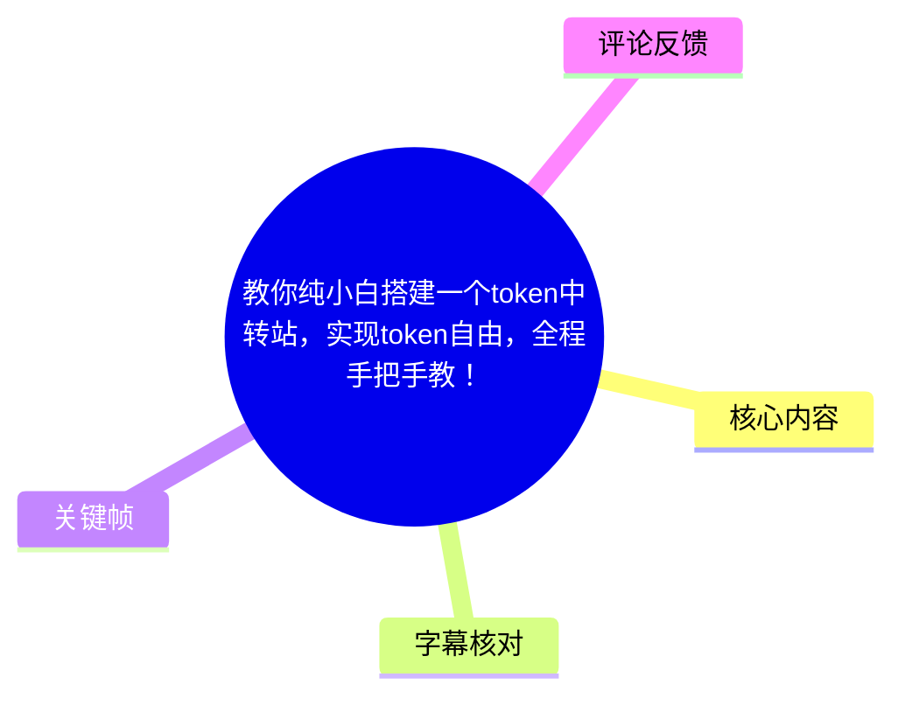
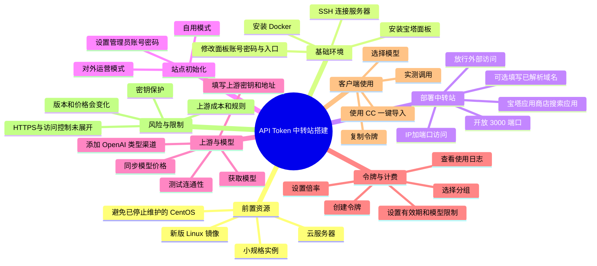
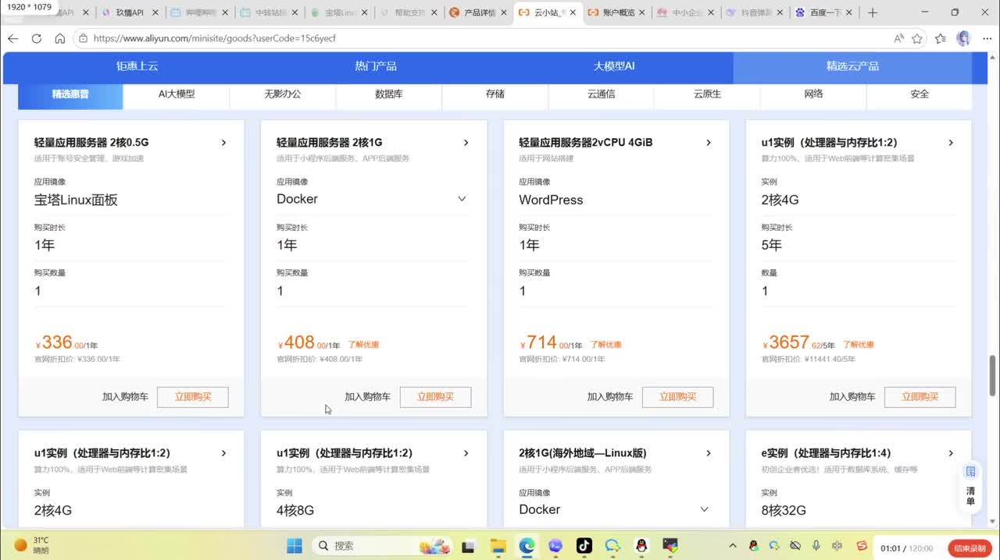
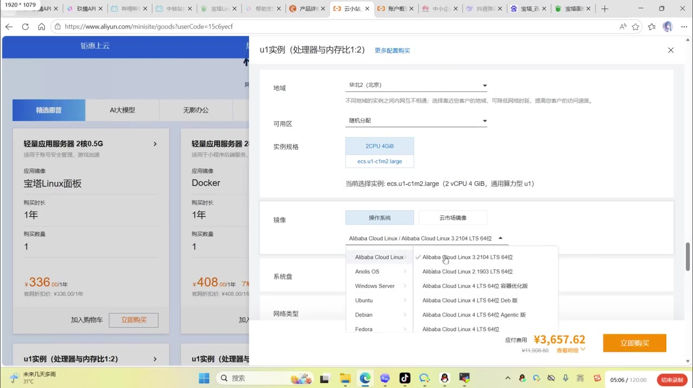
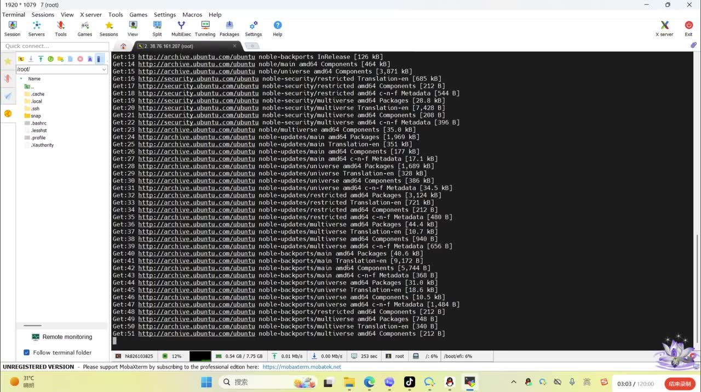
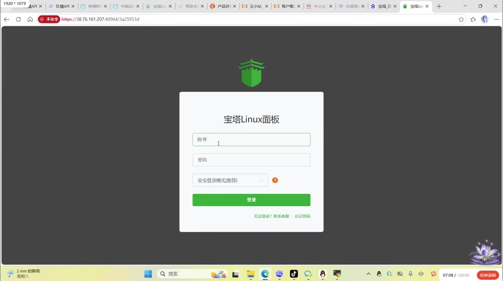

# 教你纯小白搭建一个 token 中转站，实现 token 自由，全程手把手教！

> 来源：[Bilibili 视频](https://www.bilibili.com/video/BV1JmGQ6LEcP)  
> UP 主：漫界WiKi｜时长：26 分 32 秒｜合集：AIcode  
> 注意：视频标题中的“token 自由”是宣传性表达。视频实际演示的是在云服务器、宝塔面板与 Docker 环境中部署一个 API 中转/聚合站，并接入上游 API 渠道；并不意味着模型调用免费、无限量或不受上游平台规则约束。

## 小结

视频面向服务器部署经验较少的用户，演示从购买云服务器到完成 API Token 中转站部署、配置上游渠道、同步模型、设置价格分组、创建令牌并在客户端导入使用的完整路径。教程的部署核心是：**云服务器 + 宝塔 Linux 面板 + Docker + 宝塔应用商店中的中转站应用**。

基础资源方面，UP 主建议购买小规格云服务器，并优先选带宝塔面板镜像或较新 Linux 镜像。视频明确不建议使用已停止维护的 CentOS，理由是后续漏洞和维护问题更难处理。部署过程中，宝塔面板的初始地址、账号、密码、端口和安全入口均为重要凭据，建议保存后再改成自己可管理的信息。

应用部署后，视频要求开放服务端口 `3000`，再通过“服务器 IP + 端口”访问站点。若已绑定域名，视频称域名应先解析至服务器 IP，并按安装界面提示处理“允许外部访问”的选项。首次访问还需完成管理员密码与站点模式设置：自用可选“自用模式”，若对外运营则选择对应模式。

业务配置分为三层：其一是创建供客户端调用的令牌；其二是添加上游渠道，视频以默认 OpenAI 类型及 NewAPI 对接为例，填写上游密钥与地址、拉取模型并确认连通；其三是在分组模型定价中设置倍率，例如默认分组设置为 `1.5` 倍。UP 主还展示了“从上游同步价格”的方式，以避免逐模型手工填价。

教程最后展示了测试调用、使用日志、操练场，以及通过名为“CC”的工具一键导入令牌到客户端的过程。视频强调用户界面与管理员界面权限不同：普通用户注册后不能看到管理员配置项，只能创建和使用自己的令牌。

本视频具有明显时效性：宝塔应用商店、Docker 安装方式、中转站程序版本、上游 API 地址、模型名称、定价、支付能力和第三方客户端均可能变化。视频未展示具体安装命令、完整应用名称、反向代理/HTTPS、访问控制、备份、监控、密钥轮换等生产级配置；如用于公开运营，还需自行评估上游服务条款、数据安全、支付合规与网络安全责任。

## 思维导图





## 目录

- [视频定位、前提与适用边界](#视频定位前提与适用边界)
- [购买服务器与选择系统镜像](#购买服务器与选择系统镜像)
- [安装和管理宝塔面板](#安装和管理宝塔面板)
- [安装 Docker 与部署中转站](#安装-docker-与部署中转站)
- [放行端口、首次访问与站点初始化](#放行端口首次访问与站点初始化)
- [创建令牌与理解分组](#创建令牌与理解分组)
- [接入上游渠道并同步模型](#接入上游渠道并同步模型)
- [模型定价、倍率与调用测试](#模型定价倍率与调用测试)
- [客户端导入与日常使用](#客户端导入与日常使用)
- [完整操作清单](#完整操作清单)
- [限制、风险与时效性](#限制风险与时效性)
- [字幕比对](#字幕比对)
- [评论分析](#评论分析)
- [处理记录](#处理记录)

## 视频定位、前提与适用边界

### 教程目标与演示范围 [00:00:00](https://www.bilibili.com/video/BV1JmGQ6LEcP?t=0)

UP 主开场说明这是一个“从零到有”的 API Token 中转站搭建教程，定位为“纯小白、基础”教学。其主要目标不是训练模型或搭建推理服务，而是在已有云服务器上部署一个可管理 API 渠道、模型、令牌、价格和用户权限的中转站。

视频所展示的使用方式包括：

1. 管理员部署中转站程序；
2. 管理员接入一个或多个上游 API 渠道；
3. 管理员将上游可用模型同步到本站；
4. 管理员建立不同倍率的用户分组；
5. 用户创建或取得令牌；
6. 用户通过客户端或兼容 API 的软件调用模型。

UP 主称此类中转站近期“很火”，并认为程序较成熟、自用搭建方便、门槛不高。这是视频作者的经验判断，不构成对稳定性、安全性或合规性的保证。

## 购买服务器与选择系统镜像

### 服务器规格、购买方式与新人优惠 [00:00:18](https://www.bilibili.com/video/BV1JmGQ6LEcP?t=18)

视频建议先在阿里云等云厂商购买一台服务器，首次尝试可从较小规格开始。ASR 中可辨识到 UP 主提到“2 核 1G”“2 核 4G”等规格，并称价格较低；但视频没有给出可复用的明确最低配置、带宽、磁盘、流量或并发指标，因此不能把它们视为适用于所有部署场景的硬性要求。

UP 主提到阿里云、腾讯云等平台可能存在新人优惠，首次购买可能更便宜。这类优惠属于平台随时调整的商业政策，实际价格、地域、可用实例和活动资格应以购买时页面为准。



> 图：关键帧展示云厂商购买页中的多个实例卡片，其中包含“宝塔 Linux 面板”“Docker”“WordPress”等应用镜像选项。它说明视频建议优先选择便于后续部署的镜像，而不是要求购买某一种固定实例。

### 镜像和操作系统选择 [00:05:03](https://www.bilibili.com/video/BV1JmGQ6LEcP?t=303)

在服务器购买流程中，视频补充说明：

- 可选带宝塔面板的镜像，以减少后续手工安装步骤；
- 若购买的是纯原生服务器，则需要后续自行安装宝塔；
- 可在镜像选择页选择较新的系统版本；
- UP 主明确说 CentOS 已不再维护，因此不建议继续选用；
- Windows Server 被描述为更接近“云电脑”的用途，视频认为此处不需要选择它；
- 视频称不同镜像在其演示页中不额外加价，但这一点只对应演示页面，不能推广至所有云厂商和套餐。



> 图：关键帧显示云服务器购买弹窗中的操作系统菜单，包括 Alibaba Cloud Linux、Anolis OS、Windows Server、Ubuntu、Debian、Fedora 等选项。这为“选择仍在维护的 Linux 系统而非已停止维护的 CentOS”提供了画面依据。

## 安装和管理宝塔面板

### SSH 连接服务器并安装宝塔 [00:01:36](https://www.bilibili.com/video/BV1JmGQ6LEcP?t=96)

购买并进入服务器后，UP 主要求先记录服务器 IP、账号和密码，再使用连接工具登录。视频举例使用 MobaXterm，也提到可使用其他 SSH 工具；连接时填写 IP、账号名，再按提示输入密码。

接着进入宝塔安装环节。视频展示从宝塔官方网站获取安装命令，将命令复制到终端后粘贴执行，安装过程预计约需 3～5 分钟。视频没有在字幕素材中提供完整命令文本，因此本文不补写或猜测具体命令；应以宝塔官方文档、所选发行版及当前版本所给命令为准。



> 图：关键帧展示 MobaXterm 的 SSH 终端界面，终端正在获取 Ubuntu 软件包。这张图对应“在本地连接工具中操作远程服务器”的步骤，也表明安装过程会涉及软件包下载和等待时间。

### 保存初始信息并调整面板设置 [00:06:31](https://www.bilibili.com/video/BV1JmGQ6LEcP?t=391)

宝塔安装完成后，视频提示界面会显示：

- 面板访问 IP；
- 初始账号；
- 初始密码；
- 随机端口；
- 随机安全入口/后缀。

UP 主建议首次出现时先复制保存这些信息。随后可在宝塔设置中修改账号、密码、端口和面板后缀，使其更便于自己记忆和维护；修改后，旧面板地址将失效。

如果忘记了面板地址、端口或安全入口，视频称可 SSH 登录服务器后输入 `bt`，然后通过面板信息相关菜单查询或重置；但密码不会直接显示，需要自行重置。视频提及的菜单编号在 ASR 中识别不清，本文不将其作为可靠操作参数。

### 安全提示

视频的“改成好记的账号、密码、端口和后缀”主要是可用性建议。对于实际公网部署，仅“好记”并不足够，至少应避免弱密码、默认账号和可预测入口。该部分属于基于视频内容延伸出的安全建议，并非视频所展示的完整安全方案。

## 安装 Docker 与部署中转站

### 在宝塔中安装 Docker [00:08:44](https://www.bilibili.com/video/BV1JmGQ6LEcP?t=524)

在宝塔准备完成后，视频的下一步是安装 Docker。UP 主称新版宝塔中已有 Docker 入口，旧版本可能需要升级。安装方式优先使用默认方式；若默认方式安装失败，可尝试切换到“二进制”方式。视频将失败原因归因于镜像或操作系统版本过旧。

UP 主解释选用宝塔与 Docker 的理由：

- 宝塔提供图形化操作界面；
- Docker 将不同应用封装在各自容器中；
- 一个服务故障时，理论上不应直接影响其他独立容器中的服务。

这体现的是容器隔离的基本思路，但并不意味着容器能自动解决主机资源耗尽、网络故障、磁盘故障、错误权限配置或宿主机被入侵等问题。

### 从应用商店安装中转站 [00:10:59](https://www.bilibili.com/video/BV1JmGQ6LEcP?t=659)

Docker 可用后，UP 主在宝塔相关应用页面搜索并安装中转站应用。ASR 对应用名称识别不稳定，素材没有提供可核验的完整程序名称、仓库地址或版本号，因此本文仅称其为“视频演示的中转站应用”，不将其误标为某个具体开源项目。

安装页面涉及以下配置：

| 项目 | 视频中的操作说明 |
| --- | --- |
| 域名 | 有域名时可填写，例如 `www.abc.com`；域名应先解析到服务器 IP。 |
| 无域名部署 | 不填写域名，使用 IP 加端口访问。 |
| 外部访问 | 视频要求按界面选择允许外部访问。 |
| 已设置域名时的选项 | UP 主提示界面中有“设置域名后不要选”的提醒，应按应用界面说明处理。 |
| 安装等待 | 视频估计约 1～5 分钟。 |
| 安装日志 | 可通过日志观察安装过程。 |

视频强调该流程被宝塔“封装得较全面”，但实际可用性仍取决于服务器网络、镜像下载、应用版本、DNS 解析和防火墙配置。

## 放行端口、首次访问与站点初始化

### 开放 3000 端口 [00:12:27](https://www.bilibili.com/video/BV1JmGQ6LEcP?t=747)

安装过程中，视频特别要求放行 `3000` 端口。UP 主说明应用原始端口为 `3000`，若防火墙规则中没有该端口，需要新增端口规则；即使使用域名，视频也要求放行这一端口。

这里需要区分两个层面：

1. **服务器系统或宝塔防火墙规则**：允许端口入站；
2. **云厂商安全组/网络 ACL**：也可能需要同步放行对应端口。

视频主要展示了在面板中放行端口，并未完整展开云安全组检查。若端口开放后仍无法访问，应同时检查两层规则、应用容器状态与网络监听状态。

### 使用 IP 与端口访问站点 [00:14:09](https://www.bilibili.com/video/BV1JmGQ6LEcP?t=849)

应用运行后，视频用“IP + `:3000`”访问站点。UP 主提示应根据实际情况处理协议：

- 有些情况使用 `http`；
- 有些情况使用 `https`；
- 如果 `https` 不通，可以尝试 `http`。

这一说法反映的是演示中的访问排障，而不是 HTTPS 配置指导。对于公开站点，不能因为 HTTP 能访问就长期以明文方式传输管理员密码或 API 密钥；视频没有展示 TLS 证书、反向代理及 HTTPS 强制跳转的配置过程。



> 图：关键帧展示宝塔 Linux 面板登录界面，浏览器地址栏使用 IP、端口与安全入口访问。这有助于理解视频所说的“初始面板地址由 IP、随机端口和随机后缀组成”。

### 完成安全向导与站点模式设置 [00:14:29](https://www.bilibili.com/video/BV1JmGQ6LEcP?t=869)

中转站首次打开时，视频要求完成安全向导并设置管理员密码。之后选择站点模式：

- **自用模式**：适合仅自己使用；
- **对外运营模式**：适合希望吸引用户、进行运营的情形。

视频只说明了模式选择，没有详细展示两种模式在权限、注册、计费、支付、风控和法律责任方面的差异。若对外提供服务，不能仅依赖该开关，还应确认用户条款、支付渠道资质、个人信息处理、日志留存和上游授权范围。

## 创建令牌与理解分组

### 创建用于调用的 Token [00:15:28](https://www.bilibili.com/video/BV1JmGQ6LEcP?t=928)

登录管理端后，UP 主先介绍“令牌”功能。创建令牌时，视频展示的关键配置包括：

- 令牌名称：可自定义，例如“测试”；
- 分组：先选择默认分组；
- 有效期：演示中选择“永不过期”；
- 模型限制：可限制令牌仅能调用某些模型；
- 提交后生成可用令牌。

在当时尚未配置模型的状态下，模型限制列表没有可选数据，这是因为尚未从上游获取模型。该顺序很重要：先创建令牌可行，但要实现指定模型的调用，仍需先完成上游渠道和模型配置。

### 分组用于区分成本与倍率 [00:15:51](https://www.bilibili.com/video/BV1JmGQ6LEcP?t=951)

视频将“分组”解释为区分不同渠道成本与不同计费倍率的工具。例如可以按不同成本设置一倍、二倍、三倍等分组。令牌被分配到相应分组后，将按照该组对应的规则计费和可用模型范围运行。

可抽象为：

```text
用户侧扣费 ≈ 上游价格 × 分组倍率
```

这只是视频所描述的基本定价关系。真实成本还可能受充值汇率、折扣、模型输入输出差异、缓存、图像/音频计费、渠道失败重试、平台服务费等影响，视频没有逐项展开。

## 接入上游渠道并同步模型

### 添加渠道：密钥、地址与连通性验证 [00:16:31](https://www.bilibili.com/video/BV1JmGQ6LEcP?t=991)

UP 主随后进入“渠道管理”，演示时选择默认 OpenAI 类型，并以 NewAPI 对接 NewAPI 或其他上游的情形举例。

视频口述“必不可少的有三个参数”，但紧接着 ASR 能明确识别到的只有：

1. `key`（上游密钥）；
2. 地址（上游 API 地址）。

第三个参数在 ASR 中没有被清晰识别，且提供的关键帧中未包含该处界面，因此不能依据上下文臆测其具体名称。实际填写字段必须以中转站当前版本的渠道添加页面和上游 API 文档为准。

视频建议在正式提交前先使用“获取模型”或类似功能验证连通性：

1. 填写渠道名称、上游密钥与上游地址；
2. 先尝试获取模型；
3. 若成功拉取到如 MiniMax、OpenAI 等模型列表，说明连接基本正常；
4. 再选择需要的模型并确认导入；
5. 视频称其余标志项通常不需要改动。

### 上游密钥不可视为可公开信息

视频中 UP 主曾称可填写其演示中的内容“试一下”，并引导到其自身站点注册、创建令牌。这属于视频中的推广与演示路径。任何上游密钥或个人令牌都应视为敏感凭据，不应在公开文档、截图、代码仓库或客户端日志中暴露，也不应直接信任来源不明的公共 API 地址。

## 模型定价、倍率与调用测试

### 同步价格并设置分组倍率 [00:18:48](https://www.bilibili.com/video/BV1JmGQ6LEcP?t=1128)

模型导入后，UP 主说明模型广场会出现相应模型，但初始显示的价格可能不符合预期，需要进入系统设置中的“分组模型定价”进行调整。

视频推荐的方式不是逐个模型手工设置价格，而是从上游同步价格：

1. 先完成渠道对接；
2. 进入分组模型定价；
3. 选择已添加的上游渠道；
4. 选择全部模型；
5. 应用价格；
6. 刷新模型列表，检查价格是否已更新。

UP 主演示将默认分组设置为 `1.5` 倍，并以此解释模型价格为何呈现为上游价格的 1.5 倍；还提到可设置 `1.7` 倍以获得更高利润。UP 主个人意见是“薄利多销”、不建议定价过高。

### 视频中的价格示例及其边界 [00:20:43](https://www.bilibili.com/video/BV1JmGQ6LEcP?t=1243)

视频给出一组其自身站点的示例性计算口径：

- 充值比例：`7:100`；
- 某模型价格倍率：`1.5`；
- 大额充值可有九折或八折；
- UP 主据此称最终成本约为“不到一毛钱”或“八分钱”。

这些数字是作者对其站点当时政策的陈述，不是普适市场价格，且 ASR 对“7 分钱、7 毛钱、token”等单位的识别存在混乱。不能据此推导某个模型的准确单价，更不应把其作为购买或运营决策依据。

### 测试模型调用和查看日志 [00:21:40](https://www.bilibili.com/video/BV1JmGQ6LEcP?t=1300)

视频随后进行调用测试：

- 先选择模型测试连通；
- 演示中多次显示“成功”；
- 管理员可查看使用日志；
- 在“操练场”中输入“你好，我是……你是谁”一类测试文本；
- 获得回复后，UP 主据此确认渠道已经打通。

这个测试至少应验证三项结果：

| 检查项 | 视频中的体现 |
| --- | --- |
| 模型是否可调用 | 页面显示调用成功。 |
| 响应是否返回 | 操练场出现模型回复。 |
| 调用是否被记录 | 管理员侧可查看使用日志。 |

对实际部署而言，单次成功不能证明所有模型、所有用户分组、流式输出、异常重试和并发请求均正常，仍需要按自身用途进行持续测试。

## 客户端导入与日常使用

### 普通用户的可见权限 [00:22:33](https://www.bilibili.com/video/BV1JmGQ6LEcP?t=1353)

UP 主强调普通用户注册登录后看不到管理员配置区域，只能看到用户侧功能。用户的主要使用流程是：

1. 创建自己的令牌；
2. 选择对应分组；
3. 设置令牌名称；
4. 复制令牌或使用客户端导入功能；
5. 选择需要调用的模型。

这说明中转站将管理端配置与普通用户调用入口进行区分。视频未展示细粒度角色、审计、封禁、额度、IP 限制或多因素认证的具体配置。

### 使用 CC 工具一键导入 [00:22:57](https://www.bilibili.com/video/BV1JmGQ6LEcP?t=1377)

视频称若使用“CC”相关工具，可不必手工复制参数，而是在中转站页面选择对应客户端类型后进行一键导入。ASR 对客户端名称有“cloud”“gmit”“科特叉”等不稳定识别，能较可靠确认的是视频展示了一个简称为“CC”的软件导入流程。

演示步骤为：

1. 在中转站选择客户端/导入类型；
2. 设置名称与需要的模型；
3. 点击打开 CC；
4. 若第一次点击只启动软件、未导入，可再次点击；
5. 出现导入弹窗后确认导入；
6. 视频提醒先不要在该客户端中登录其他账号；
7. 重启或重新进入客户端后，查看模型是否出现；
8. 出现模型即表示导入成功，可开始使用。

视频称软件下载链接和使用教程会放在视频下方，或可自行搜索。由于素材没有提供实际链接与软件版本，本文不补充外部下载地址。

### 系统设置、充值与支付 [00:24:54](https://www.bilibili.com/video/BV1JmGQ6LEcP?t=1494)

视频末尾快速展示系统设置中可能包含的内容：

- 充值链接；
- 个性化设置；
- 仪表盘数据；
- 支付；
- 系统设置；
- 公告。

UP 主称其 API 站点已集成支付能力，第三方对接后可向用户“影片/页面”提供服务；但 ASR 在这一句存在较多错字，不能确认其具体支付产品、接入方式或资金结算逻辑。视频也没有教学支付配置细节，这与热评中有人请求补充“支付设置、改网址设置”相互印证。

## 完整操作清单

### 从零部署顺序 [00:00:18](https://www.bilibili.com/video/BV1JmGQ6LEcP?t=18)

以下按视频实际演示顺序整理，不额外加入视频未出现的命令：

1. **准备云服务器**
   - 购买一台云服务器；
   - 初次尝试可选小规格；
   - 保存公网 IP、登录账号与密码；
   - 如有条件，可选择带宝塔面板的镜像。

2. **选择受维护的 Linux 系统**
   - 优先选择较新的、仍在维护的系统版本；
   - 视频不建议选择已停止维护的 CentOS；
   - 若买了原生镜像，后续自行安装宝塔。

3. **SSH 登录服务器**
   - 使用 MobaXterm 或其他 SSH 工具；
   - 填写服务器 IP、账号并输入密码。

4. **安装宝塔面板**
   - 从宝塔官网获取与系统匹配的安装命令；
   - 在 SSH 终端粘贴执行；
   - 等待安装完成，视频估计约 3～5 分钟；
   - 保存初始面板地址、账号、密码、端口和安全入口。

5. **调整宝塔面板信息**
   - 登录面板；
   - 视需要修改账号、密码、端口和安全入口；
   - 修改后记录新的访问地址；
   - 忘记面板信息时，按视频所说通过 SSH 中的 `bt` 工具查询或重置。

6. **安装 Docker**
   - 在新版宝塔的 Docker 功能中安装；
   - 默认方式失败时，视频建议尝试二进制方式；
   - 旧版宝塔可能需要先升级。

7. **安装中转站应用**
   - 在宝塔应用/容器相关页面搜索视频演示的中转站应用；
   - 有域名则先做好 DNS 解析后填写；
   - 无域名则保留空白、以 IP 方式部署；
   - 按界面要求选择是否允许外部访问；
   - 等待安装完成，并查看安装日志。

8. **开放端口**
   - 在面板防火墙中放行 `3000`；
   - 同时检查云厂商安全组是否也需放行；
   - 确认应用状态为“正在运行”。

9. **完成站点初始化**
   - 以 `IP:3000` 访问；
   - 视页面情况处理 HTTP/HTTPS；
   - 完成安全向导；
   - 设置并保存管理员密码；
   - 按用途选择自用模式或对外运营模式。

10. **创建测试令牌**
    - 在令牌页面创建测试令牌；
    - 选择默认分组；
    - 设置有效期；
    - 需要时限制可调用模型。

11. **配置上游渠道**
    - 进入渠道管理；
    - 视频演示选择默认 OpenAI 类型；
    - 填写上游密钥和 API 地址；
    - 使用获取模型功能先验证是否能连通；
    - 导入所需模型。

12. **配置分组与价格**
    - 进入分组模型定价；
    - 设置分组倍率，例如视频演示的 `1.5`；
    - 从上游同步模型价格；
    - 刷新模型列表确认生效。

13. **测试调用**
    - 选择模型进行调用；
    - 在操练场发送简单测试文本；
    - 确认能够返回结果；
    - 在使用日志中检查是否产生记录。

14. **导入客户端使用**
    - 用户创建并取得令牌；
    - 使用视频演示的 CC 一键导入能力，或按兼容客户端要求填入地址与令牌；
    - 选择模型；
    - 进行真实调用验证。

## 限制、风险与时效性

### 视频未覆盖或未能核验的内容

| 类别 | 素材中的情况 | 使用时应注意 |
| --- | --- | --- |
| 应用名称与版本 | ASR 未可靠识别，素材未给出明确版本或仓库。 | 必须根据实际部署界面和官方项目文档确认。 |
| 完整安装命令 | 视频说会放在简介/下方，但素材未提供命令文本。 | 不应从本文或模糊字幕推测命令。 |
| 上游渠道的第三参数 | UP 主称需要三个参数，但只清晰说出密钥和地址。 | 以当前渠道配置表单为准。 |
| HTTPS | 仅提到 HTTP/HTTPS 不通时的尝试。 | 公网服务应自行配置证书、反向代理和强制 HTTPS。 |
| 访问控制 | 未展示安全组最小化、IP 白名单、WAF、二次验证等。 | 管理端和 API 密钥应进行额外保护。 |
| 备份与升级 | 未展示数据库备份、容器更新、回滚策略。 | 对外运营前应建立备份与变更流程。 |
| 支付设置 | 仅快速提及站点可有支付能力。 | 不可据此认定支付已正确配置或具备合规资质。 |
| 成本与价格 | 仅展示作者当时的倍率和充值示例。 | 上游价格、汇率、折扣和模型计费随时变化。 |

### 合规与安全边界

视频中的中转站模式意味着管理员会处理上游密钥、用户令牌、调用日志与可能的支付信息。以下风险需要单独评估：

- **上游服务条款**：中转、转售、多用户共享、地区访问或特定模型调用方式可能受上游规则限制；
- **密钥泄露**：管理员密钥、上游密钥和用户令牌泄露可能带来直接费用损失；
- **公网暴露**：开放 `3000` 端口会扩大攻击面；
- **明文传输**：若长期以 HTTP 登录或调用，密码和令牌可能在网络中以明文形式传输；
- **计费争议**：分组倍率、上游折扣、充值比例与用户侧展示价格应可审计；
- **对外运营责任**：注册、充值、支付、数据处理与内容管理均可能产生额外责任。

### 时效性说明

本视频时长约 26 分钟，素材抓取时间为 2026-07-16。视频内提及的宝塔界面、Docker 安装入口、应用商店应用、模型列表、OpenAI 兼容参数、CC 客户端、上游站点价格及优惠均可能在观看后发生变化。特别是视频中声称其站点提供注册赠额和低价购买的内容，属于 UP 主当时的推广信息，当前是否有效无法由本素材验证。

## 字幕比对

### 比对结论

本次素材同时提供了站内字幕和本次 ASR。两者存在根本性冲突：**站内字幕内容是关于地球承载力、外星人和生物电池的文本，时长约 4 分 11 秒，与本视频标题、视频时长 26 分 32 秒以及关键帧中的云服务器/宝塔画面均不匹配。**因此站内字幕显然不适用于本视频，不能作为正文依据。

本次 ASR 识别到中文音轨，语言置信度为 `0.9970703125`，覆盖 142 个分段、总语音约 `993.1` 秒，时间跨度从 `00:00:00.340` 到 `00:26:31.130`。诊断中没有 `noAudioStream=true` 标记，说明源视频存在音轨；本任务没有将站内字幕不匹配误判为无音轨或工具失败。

| 字幕来源 | 完整性 | 专有名词 | 时间轴 | 主要问题 |
| --- | --- | --- | --- | --- |
| Bilibili 站内字幕 `p01-ai-zh.srt` | 与本视频完全不匹配，仅约 4 分 11 秒 | 内容为“地球承载力”等无关话题 | 分段时间本身完整，但对应错误视频内容 | 属于错配字幕，不能采用 |
| 本次 ASR 字幕 | 覆盖全片，142 段，语音覆盖率约 62.39% | 多个术语误识别，如“宝塔/宝卡”“Docker/刀口”“Token/令牵”等 | 具备真实时间戳，可用于章节跳转 | 语音间隔较大，专有名词和部分客户端名称识别不稳 |

### 最终字幕选择与校正原则

正文以**本次 ASR 的时间戳与实际语义**为主，并结合视频关键帧进行术语校正。采用的主要校正包括：

| ASR 识别文本 | 正文采用表述 | 校正依据 |
| --- | --- | --- |
| 宝卡、保卡 | 宝塔 | 视频多处语义为“宝塔面板”，且关键帧显示“宝塔 Linux 面板”登录页 |
| 刀口、刀壳 | Docker | 上下文为容器安装、容器隔离和应用封装 |
| 中软站 | 中转站 | 与视频标题和“API Token 中转站”主题一致 |
| kin、king | key/密钥 | 上下文为上游渠道认证字段 |
| sintOS | CentOS | 上下文为系统发行版维护状态 |
| hts、httpp | HTTPS、HTTP | 上下文为浏览器访问协议 |
| 令牵、令牨 | 令牌/Token | 上下文为创建 API 调用凭据 |
| 5 4、5 2 | 未强行扩展为具体模型名称 | ASR 无法稳定区分模型名，本文仅保留“测试模型调用”的事实 |

ASR 在 `00:03:59.600—00:04:43.120`、`00:12:51.650—00:13:33.730`、`00:05:58.270—00:06:31.030` 等区间存在较长无语音段，符合教程中等待安装、刷新页面或操作演示的情形。本文未根据这些静默段的文字顺序虚构具体操作。

## 评论分析

仅处理素材中可获取的热评前三条，以下均为评论者个人陈述，未作为事实验证。

1. **66解说｜2 赞**
   - 评论称其“最近发现一个巨便宜中转的满血 cc，chat，贼好用”。
   - 这反映观众关注低价中转和客户端能力，与视频的中转站主题相关。
   - 评论没有提供服务名称、价格、稳定性、来源或合规信息，因此不能据此认定存在可靠或低价的服务。

2. **周啊周dada｜1 赞**
   - 评论为“已跑通，来下游”。
   - 可理解为评论者声称已成功完成部署或调用链路，并表达希望成为下游用户/合作方的意愿。
   - 这提供了有限的正向使用反馈，但没有环境、版本、步骤、错误记录或测试范围，无法独立验证教程在不同环境中的成功率。

3. **308662770｜1 赞**
   - 评论请求“教下支付设置还有更改网址设置”。
   - 该评论指出视频讲解的缺口：支付配置和更改站点网址/域名配置未被详细展开。
   - 这与视频末尾仅快速展示支付、充值链接和系统设置的情况一致。该需求不代表视频已经提供了对应解决方案。

## 处理记录

- **Worker ID**：worker-mrj0wjed-b0c290ad
- **模型**：gpt-5.6-terra
- **素材与工具结果**：使用提供的 Bilibili 元数据、视频关键帧路径、站内 SRT、ASR SRT、ASR 诊断结果及热评 JSON 进行整理；未补造外部命令、链接、应用版本或价格。
- **字幕选择**：检查了站内字幕与本次 ASR。站内字幕内容和时长均与目标视频不一致，判定为错配；正文采用本次 ASR 的真实分段时间，并基于关键帧与上下文校正明显术语错误。
- **音轨检查**：ASR 诊断显示中文识别置信度 `0.9970703125`、存在时间戳、覆盖至 `1591.13` 秒，且未标记 `noAudioStream=true`；据此确认源视频存在音轨。
- **关键帧选择依据**：
  - `frames/frame-001.jpg`：云服务器商品卡片与应用镜像，支撑服务器和镜像选择章节；
  - `frames/frame-002.jpg`：MobaXterm SSH 终端，支撑远程登录与安装操作；
  - `frames/frame-003.jpg`：操作系统镜像选择菜单，支撑 Linux 镜像与 CentOS 时效性说明；
  - `frames/frame-004.jpg`：宝塔 Linux 面板登录页，支撑面板访问地址、账号和安全入口管理。
- **热评处理范围**：仅分析可获取的前三条热评，未扩展到其他评论。
- **缓存清理**：未提供可执行的缓存清理日志或结果；本记录不虚构清理已完成。
- **未解决问题**：
  - 视频实际使用的中转站应用名称、版本、镜像地址与完整安装参数未能从素材可靠确认；
  - 上游渠道所称“第三个必不可少参数”未被 ASR 清晰识别；
  - 支付、域名迁移、HTTPS、备份、反向代理、访问控制和生产运维未在视频中完整教学；
  - 视频中推广站点的赠额、价格、折扣和可用性无法在本素材范围内验证。
