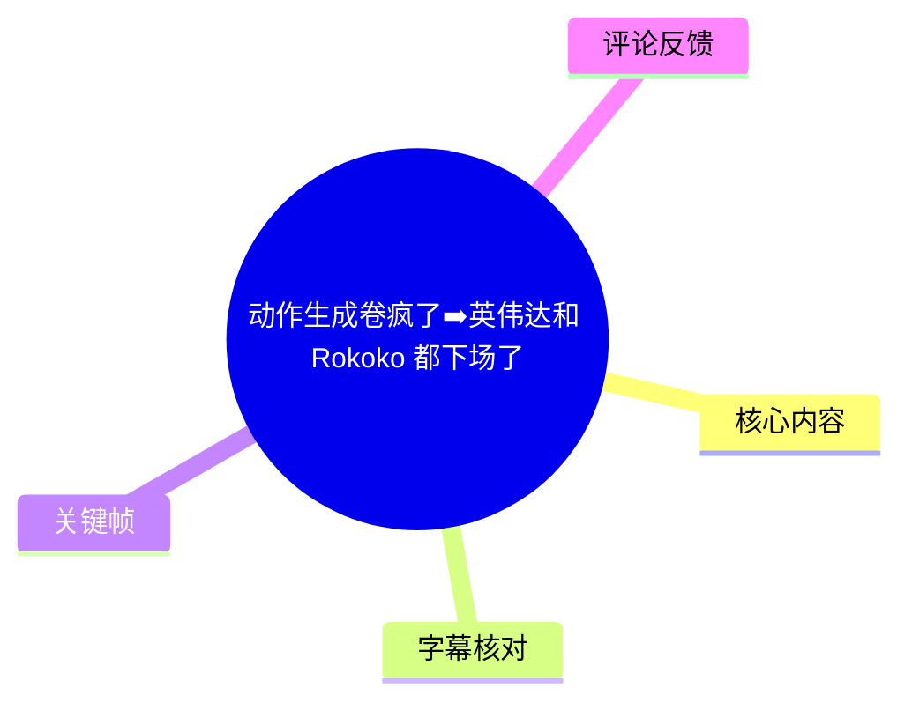
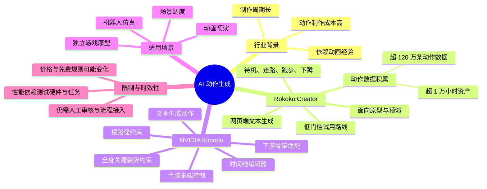
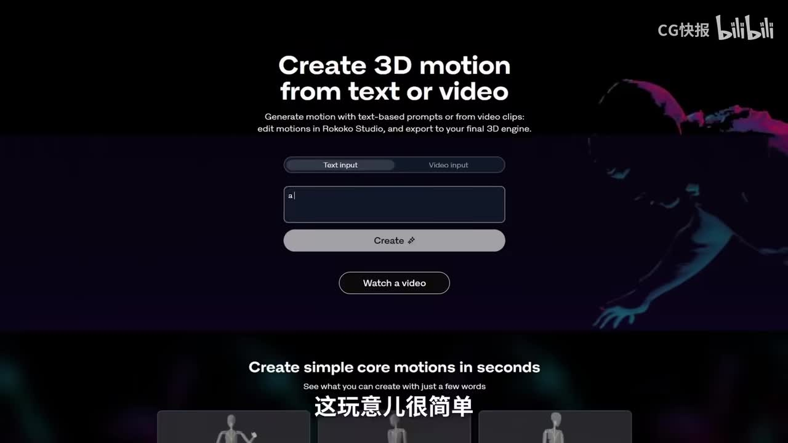
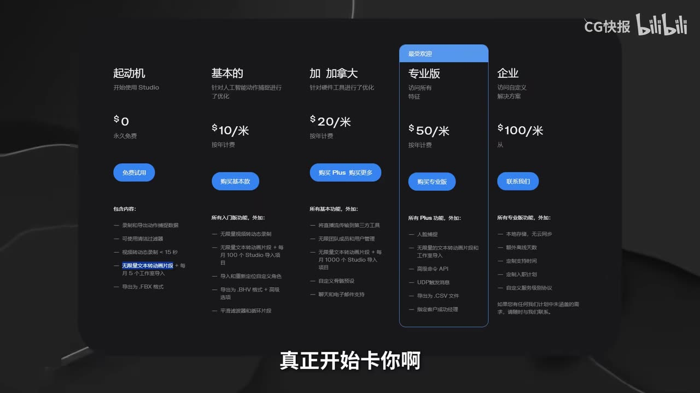
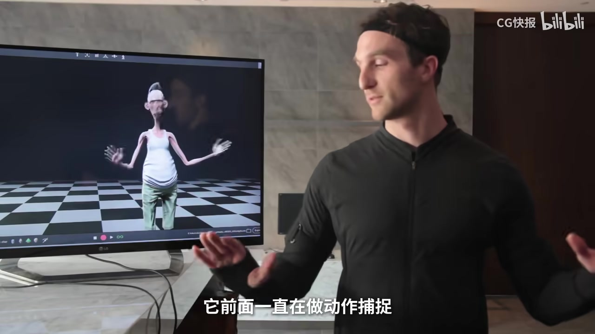
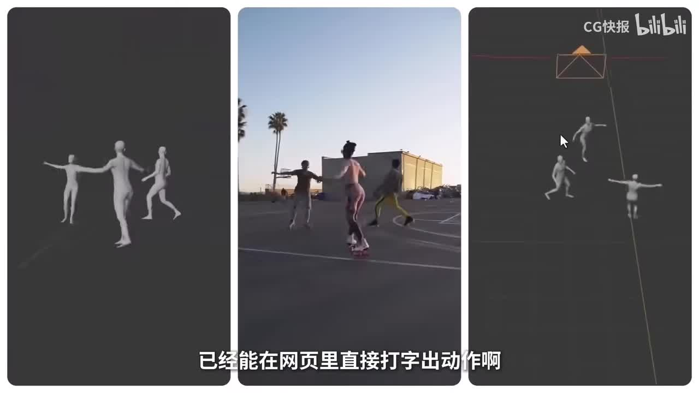

# 动作生成卷疯了➡️英伟达和 Rokoko 都下场了

> 来源：[Bilibili 视频](https://www.bilibili.com/video/BV1V5DLBdExY)  
> UP 主：CG快报｜时长：5 分 56 秒｜画面规格：1920×1080  
> 视频简介提供的工具入口：[NVIDIA Kimodo（Hugging Face Space）](https://huggingface.co/spaces/nvidia/Kimodo)｜[Rokoko Create](https://create.rokoko.com/)

## 小结

视频聚焦 AI 角色动作生成的两条产品路线：**Rokoko Creator** 主打低门槛、网页端的文本生成动作；**NVIDIA Kimodo** 则强调动作的精细约束、路径控制、时间线编排及面向下游流程的骨架适配。UP 主认为，角色动作这个传统上成本高、周期长、依赖经验的环节，正在成为生成式 AI 的新竞争方向。

Rokoko Creator 的核心价值是让创作者先快速获得可用的动作雏形：在网页输入动作描述，即可生成待机、走路、跑步、下蹲等 3D 动作。视频将其定位为独立游戏原型、镜头预演和早期节奏搭建工具——先让角色“动起来”，再进入后续精修。视频还转述其当时的官方规则：普通用户可先免费使用；当每月向 Rokoko Studio 添加的动作片段超过 5 个后，可能需要额外付费；不接入 Rokoko Studio 时可无限生成。此类套餐与限制具有时效性，应以官网当前页面为准。

Kimodo 的路线并不止于“提示词出动作”。视频列出其能力包括：文本生成、全身关键姿势约束、手脚末端控制、根路径约束、时间线编辑器，以及面向人体、机器人等不同骨架/参数化模型的下游适配。UP 主特别强调：动画制作中开头和结尾姿势往往容易确定，真正耗时的是中间过渡帧；Kimodo 试图把这些中间过程交给模型补全，同时仍向创作者保留关键控制权。

视频给出的性能信息是：依据其技术报告，Kimodo 面向**离线动作制作**，在 NVIDIA RTX 3090 上，从单个提示词生成一段动作约需 **2～5 秒**。这是视频转述的特定测试口径，不能直接外推到其他硬件、动作长度、约束复杂度或实际生产吞吐。

适合阅读本笔记的人包括：做独立游戏原型、3D 动画预演、角色镜头设计、动作捕捉后处理、机器人仿真或数字人研发的从业者。关键现实限制是：生成动作可降低“从零开始”的门槛，但视频并未证明其输出能够免除动画清理、接触校正、重定向、镜头适配、物理验证及资产版权审查等环节。

## 思维导图

## 目录

- [背景：动作生成为何成为新竞争点](#背景动作生成为何成为新竞争点)
- [Rokoko Creator：先让角色快速动起来](#rokoko-creator先让角色快速动起来)
- [Rokoko 的数据与产品背景](#rokoko-的数据与产品背景)
- [Kimodo：从生成动作走向可控动作](#kimodo从生成动作走向可控动作)
- [Kimodo 的六类能力与制作步骤](#kimodo-的六类能力与制作步骤)
- [两条路线的对比与选型](#两条路线的对比与选型)
- [限制、风险与时效性](#限制风险与时效性)
- [关键帧索引](#关键帧索引)
- [字幕比对](#字幕比对)
- [评论分析](#评论分析)
- [处理记录](#处理记录)

## 背景：动作生成为何成为新竞争点 [00:23](https://www.bilibili.com/video/BV1V5DLBdExY?t=23)

视频开场提出，生成式 AI 的竞争对象已从图像、视频与建模，进一步延伸到 3D 角色动作。UP 主的判断是：动作制作长期是角色生产中“贵、慢、吃经验”的部分，短短数秒动作也可能消耗半天制作时间。

这里的“动作生成”并不等同于最终动画成片。视频讨论的是将自然语言描述、关键姿势、手脚接触要求或空间路径等输入，转化为角色骨架动画的能力。它重点降低的是前期动作草案、镜头预演和中间帧补全的成本。

视频把此次观察对象概括为两类厂商：

1. **Rokoko**：原本深耕动作捕捉生态，现推出面向网页端的动作生成工具。
2. **NVIDIA**：推出 Kimodo，强调在生成之外继续提供姿势、末端、路径和时间线等控制手段。

## Rokoko Creator：先让角色快速动起来 [00:39](https://www.bilibili.com/video/BV1V5DLBdExY?t=39)

### 1. 基本操作模式

据视频介绍，Rokoko Creator 可以在网页中使用：输入一段动作描述，系统生成一个 3D 动作片段。视频举例的动作类型包括：

- 角色待机；
- 走路；
- 跑步；
- 正在下蹲；
- 其他基础运动描述。

> 图：关键帧展示了 Rokoko 的页面文案“Create 3D motion from text or video”，以及文字输入区域与创建按钮。它直接说明该产品以文本或视频作为动作创建入口，是理解其低门槛定位的核心画面。

UP 主给出的实践思路不是直接用它替代完整动画制作，而是先解决早期决策问题：原本创作者可能需要在“找动作库”与“自己补动画”之间选择；现在可以先生成动作，快速让角色跑起来，再据此搭建镜头节奏与原型。

### 2. 可迁移的原型制作流程

根据视频描述，可将 Rokoko Creator 的使用流程整理为：

1. **明确动作意图**：用一句话描述角色的基础行为，如行走、跑步、下蹲或待机。
2. **在网页端生成动作草案**：先获得能播放的 3D 动作，而非从空白时间线开始。
3. **让角色进入镜头/场景**：用生成结果验证镜头节奏、角色移动感和关卡预演。
4. **再决定是否进入精修**：如果原型成立，再补充更精确的动作、绑定、接触与表演细节。
5. **按实际工作流接入 Studio 或后续 DCC 工具**：视频仅说明动作可进入 Rokoko Studio 相关流程，未展示具体导出格式、重定向步骤或 DCC 插件配置。

这一流程尤其适合“第一步卡住”的情况：制作团队尚不确定角色如何起步、镜头如何跑、节奏是否成立时，先获得可视化动作可显著缩短沟通回路。

### 3. 视频转述的免费与付费边界 [01:03](https://www.bilibili.com/video/BV1V5DLBdExY?t=63)

视频称，普通用户可以先免费使用 Rokoko Creator；而当用户每月向 **Rokoko Studio** 添加的动作片段超过 **5 个** 后，需要额外付费。UP 主同时表示，不使用 Rokoko Studio 时可以无限生成。

> 图：关键帧展示 Rokoko 的套餐分层页面，画面中可见免费、基础、Plus、专业和企业级方案。它有助于理解视频所说“真正开始卡你”的商业化边界，但截图所示价格、功能与视频口述规则均可能已经变化。

需要谨慎解读：

- 视频没有给出套餐生效地区、货币、账户类型、生成次数统计规则或导出限制。
- “无限生成”是视频对当时规则的转述，不代表无限制商用、无限制导出或永久有效。
- 应在实际使用前查看 Rokoko 官网的当前定价、服务条款、资产许可与隐私政策。

## Rokoko 的数据与产品背景 [01:27](https://www.bilibili.com/video/BV1V5DLBdExY?t=87)

UP 主认为，Rokoko Creator 并不是一个孤立的网页功能。其判断依据是 Rokoko 长期经营动作捕捉相关产品与服务，包括：

- 全身动作捕捉；
- 手指动作捕捉手套；
- 面部捕捉；
- 动作采集、记录与整理相关链路。

> 图：关键帧中，使用者站在显示器旁，屏幕呈现角色动作结果。该画面帮助解释视频的观点：Rokoko 的生成能力被放在既有动捕生态与动作资产积累中理解，而不是单纯的网页生成器。

视频进一步转述 Rokoko 当时给出的数据：

| 项目 | 视频转述数值 |
| --- | ---: |
| 人体动作数据 | 超过 120 万条 |
| 人体动作资产总量 | 超过 1 万小时 |
| 数据规模趋势 | 仍在持续增长 |

这些数值的意义在于解释 UP 主的产品逻辑：用户表面上看到的是一个文本输入框，背后则可能依赖多年积累的动作数据与动捕工作流。需要注意，视频没有披露这些数据的采集标准、标注质量、授权构成、训练使用方式或去重方法，因此不能据此判断其数据集质量与版权边界。

## Kimodo：从生成动作走向可控动作 [02:39](https://www.bilibili.com/video/BV1V5DLBdExY?t=159)

与 Rokoko 的“轻量、易上手”路线相比，视频认为 NVIDIA Kimodo 的目标更偏向专业动作制作与流程接入。它同样支持根据文字提示生成动作，例如：

- 走路；
- 跳舞；
- 拿取物品；
- 做手势；
- 组合运动；
- 更复杂的动作关键词组合。

但视频的重点不在“能否文本生成”，而在于 Kimodo 给用户提供的额外控制维度。UP 主的核心判断是：Kimodo 不只是想交付一条动作，而是希望让创作者在生成后继续控制、编辑并将其接入下游管线。

## Kimodo 的六类能力与制作步骤 [03:03](https://www.bilibili.com/video/BV1V5DLBdExY?t=183)

### 1. 文本生成动作 [03:03](https://www.bilibili.com/video/BV1V5DLBdExY?t=183)

最基础的输入方式是自然语言提示词。其用途是快速形成角色的初始运动方案。视频没有提供 Kimodo 的提示词语法、最大文本长度、支持语言、动作时长限制或输出文件格式，因此这些参数不能从本视频确定。

### 2. 全身约束：用关键姿势补齐中间动画 [03:03](https://www.bilibili.com/video/BV1V5DLBdExY?t=183)

视频称，创作者可以指定多个关键姿势，例如：

- 初始姿势；
- 中间某一帧的姿势；
- 最终收势。

模型负责补齐这些关键点之间的动作，使过渡过程更顺畅。视频将它对应到动画工作中的典型痛点：开头和结尾往往已有明确设计，但中间帧的衔接最耗时间。

可按以下方式理解其使用步骤：

1. 确定动作的开始姿势；
2. 标记必须出现的中间姿势；
3. 确定结束姿势；
4. 让模型生成或补全姿势之间的运动；
5. 对生成的重心、速度、接触、穿插和表演节奏进行人工复核。

这里的“补顺、补齐”是视频口述目标，而非已验证的质量保证。复杂表演、双人交互、道具接触、特定角色比例或极端姿势，仍可能需要人工调整。

### 3. 末端执行器约束：重点控制手与脚 [03:27](https://www.bilibili.com/video/BV1V5DLBdExY?t=207)

视频将第三项能力称为“末端执行器约束”，并将其通俗解释为对**手脚**的控制。它关心的并非骨架整体是否在运动，而是动作中最容易暴露问题的局部：

- 手是否真的碰到目标物；
- 脚是否踩实地面；
- 抓握位置是否跑偏；
- 接触点与运动方向是否合理。

在角色动画中，手脚“漂浮”、脚底打滑、接触穿透通常会迅速降低可信度。因此，视频认为这类约束是 Kimodo 的关键价值之一。

实践上，应将末端约束用于动作审核的重点检查项，而不能只看整体动作是否“看起来会动”：

| 检查对象 | 需验证的问题 |
| --- | --- |
| 手部 | 是否接触到指定物体、抓握点是否稳定、手臂是否过度拉伸 |
| 足部 | 是否落地、是否滑步、是否穿透地面 |
| 道具 | 接触时序是否正确、相对位置是否漂移 |
| 身体重心 | 手脚约束是否造成躯干姿势不自然 |

### 4. 根路径约束：控制角色在空间中的移动 [03:42](https://www.bilibili.com/video/BV1V5DLBdExY?t=222)

视频称，Kimodo 还可基于用户给出的入镜点与完整路径控制角色运动。UP 主以类似 Maya 的 AI 动画功能作类比：用户可以在地面上画出路径，指定角色往哪里走、在哪里转弯、如何穿过场景。

其可迁移的场景调度流程为：

1. 在场景中确认角色入场位置；
2. 绘制或指定移动路径；
3. 明确拐点、目标点与可能的障碍区域；
4. 生成沿路径的角色动作；
5. 检查步幅、朝向、转弯、足部接触和与场景的关系；
6. 将结果纳入镜头预演或关卡调度。

这意味着任务从“生成一条孤立动作”扩展为“让角色在指定空间中完成运动”。不过视频未展示避障精度、地形适应、多人碰撞、路径编辑粒度等具体能力，不能假定其已解决完整的导航或物理仿真问题。

### 5. 时间线编辑器：叠加提示词、关键帧和约束区间 [04:06](https://www.bilibili.com/video/BV1V5DLBdExY?t=246)

视频介绍 Kimodo 具备时间线编辑器，允许在多条轨道上添加：

- 提示词；
- 关键帧；
- 约束区间；
- 可直接编辑的约束。

它的意义在于把前述控制方式组合到一个编辑环境里，而非每次都以单一文本提示重新生成。对于制作流程而言，可将其理解为“生成 + 约束 + 分段编辑”的非线性工作方式：

1. 先用提示词建立整体动作意图；
2. 在重要时间点放置关键姿势；
3. 针对接触或脚步添加局部约束；
4. 通过根路径定义空间移动；
5. 在时间线上检查不同约束是否冲突；
6. 输出前进行人工清理与下游验证。

### 6. 下游适配与性能口径 [04:30](https://www.bilibili.com/video/BV1V5DLBdExY?t=270)

视频称，Kimodo 支持 NVIDIA 人体骨架模型、某类人形机器人骨架以及人体参数化骨架模型等多个版本；原始口述中的具体专有名词部分受到 ASR 误识别影响，因此本笔记不将未能从素材准确确认的模型名称扩写为确定事实。

视频所要表达的重点是：Kimodo 的动作结果不仅面向游戏动画，也可能进入机器人、仿真等下游流程。UP 主进一步转述技术报告：Kimodo 采用离线动作制作思路，在 **RTX 3090** 上，单个提示词生成一段动作约需 **2～5 秒**。

该性能数据应附带以下边界：

- 是视频转述的技术报告结论；
- 硬件基准为 RTX 3090；
- 输入口径为单个提示词；
- 未说明动作长度、骨架类型、采样参数、模型版本和并发条件；
- 加入关键帧、路径、末端约束和时间线编辑后，实际耗时可能不同；
- “离线制作”不代表实时互动场景一定可达到相同延迟。

## 两条路线的对比与选型 [05:18](https://www.bilibili.com/video/BV1V5DLBdExY?t=318)

视频最后将二者归纳为两种不同的优化目标：

| 维度 | Rokoko Creator | NVIDIA Kimodo |
| --- | --- | --- |
| 视频中的产品定位 | 轻量、易上手 | 控制更深、流程更专业 |
| 核心起点 | 网页输入文本生成动作 | 文本生成动作并增加多维约束 |
| 主要价值 | 先让角色快速动起来 | 让动作更可控、可编辑、可接入流程 |
| 适合的早期任务 | 原型、预演、镜头节奏验证 | 复杂动作设计、路径调度、细节控制 |
| 视频强调的控制方式 | 以生成和快速试用为主 | 关键姿势、手脚、路径、时间线 |
| 视频指出的下游方向 | Rokoko Studio 与既有动捕生态 | 游戏、机器人、仿真等流程 |

### 如何按项目阶段选择

**优先考虑 Rokoko Creator 的情况：**

- 需要快速做独立游戏或动画原型；
- 团队当前没有完整动捕条件；
- 目标是尽快验证角色运动和镜头节奏；
- 可以接受后续再修动作细节；
- 希望以网页端低门槛方式先试用。

**优先评估 Kimodo 的情况：**

- 动作必须满足指定关键姿势；
- 手、脚、道具接触的正确性很重要；
- 角色必须沿预定路径在场景中移动；
- 希望将动作编辑整合进更明确的生产流程；
- 项目涉及机器人、人形仿真或多种骨架表示。

视频的最终判断是：前者竞争“上手速度”，后者竞争“控制深度”。这是一种产品方向判断，不代表两类工具在实际项目中只能二选一；团队也可能先用易用工具进行预演，再使用专业工具或传统 DCC/动捕流程完成精修。

## 限制、风险与时效性 [05:42](https://www.bilibili.com/video/BV1V5DLBdExY?t=342)

### 视频未验证或未展开的信息

以下事项未在视频素材中得到充分演示或验证：

- Rokoko Creator 与 Kimodo 的具体导出格式；
- 与 Maya、Blender、Unreal Engine、Unity 等工具的完整接入步骤；
- 重定向到不同角色比例时的稳定性；
- 双人互动、复杂道具、摔倒、格斗等高难度动作质量；
- 商用授权、训练数据权利与生成资产归属；
- 机器人部署中的安全约束、动力学可行性与真实硬件执行效果；
- Kimodo 所述不同骨架模型的准确名称及完整支持范围。

### 生产使用时的必要人工环节

即使生成结果满足大致意图，仍应保留以下质量控制：

1. **接触校验**：检查脚底、手部和道具是否漂浮、穿透或滑动。
2. **重心与动力学检查**：避免动作虽连贯却缺乏支撑逻辑。
3. **角色适配**：不同骨骼比例、关节极限和绑定质量会改变结果。
4. **镜头适配**：镜头构图会放大手部、脚部和轮廓的问题。
5. **版权与许可审查**：确认工具服务条款、导出资产的商用范围及项目合规要求。
6. **版本复现**：记录模型版本、输入提示词、约束条件与导出日期，避免在线工具更新后难以复现。

### 时效性说明

本视频发布信息显示为 **2026-04-08**，素材抓取时间为 **2026-07-15**。视频涉及的价格、免费额度、功能名称、模型能力、支持骨架和性能表现都有可能随产品更新而变化。本文保留的是视频当时的转述与画面信息，不应视为两家产品当前官方承诺。

## 关键帧索引

### Rokoko 的文本/视频动作生成入口 [00:39](https://www.bilibili.com/video/BV1V5DLBdExY?t=39)

> 图：画面并置展示 3D 人体动作、真人滑板动作和场景中的角色运动，直观呈现视频所说的“网页里直接打字出动作”的效果方向。适合作为理解文本/视频驱动动作生成概念的视觉证据。

### Rokoko Creator 网页界面 [00:39](https://www.bilibili.com/video/BV1V5DLBdExY?t=39)

> 图：界面明确出现文字输入、视频输入和创建动作入口，支持视频关于网页端使用方式的描述。

### Rokoko 商业化页面 [01:03](https://www.bilibili.com/video/BV1V5DLBdExY?t=63)

> 图：画面展示多个套餐层级，是理解视频谈及免费试用与 Studio 使用限制的辅助材料；具体价格与权益须以官网实时信息为准。

### Rokoko 动捕生态示意 [01:27](https://www.bilibili.com/video/BV1V5DLBdExY?t=87)

> 图：人物动作与屏幕角色呈现同框，帮助建立“Rokoko 生成工具背后有长期动捕业务与动作资产积累”的上下文。

## 字幕比对

### 对比结论

站内字幕存在，但其内容从开头到结尾均为《英雄联盟》游戏 Bug、广告等无关文本，与本视频的画面、标题和音频主题完全不匹配，不能作为知识整理依据。本次 ASR 检测到中文音频，覆盖视频主体内容，时间戳与视频主题一致，因此正文以 **本次 ASR 时间轴** 为主，并结合关键帧对工具名称和页面功能进行校正。

| 字幕来源 | 完整性 | 专有名词 | 时间轴 | 主要问题 |
| --- | --- | --- | --- | --- |
| Bilibili 站内字幕 `p01-ai-zh.srt` | 形式上覆盖约 0:00～6:01，但内容与视频完全不对应 | 出现大量《英雄联盟》角色、装备与笔记主题无关 | 时间段可读，但对应的是错误内容 | 明显串片/错配字幕，不可采用 |
| 本次 ASR 字幕 | 覆盖 0:23.080～5:55.260；诊断语音覆盖率 92.58% | 工具名和技术术语存在音近误识别 | 含可靠起止时间，可用于章节定位 | 开头约 23 秒无 ASR 语音；长句分段过粗；专名误识别较多 |

### ASR 检查结果

- ASR 模型：`medium`
- 识别语言：中文，语言置信度 `0.99951171875`
- 音频时长：`355.5439375` 秒
- 有时间戳：是
- 语音覆盖：`329.16` 秒，约 `92.58%`
- 首段语音：`00:00:23.080`
- 末段语音：`00:05:55.260`
- `noAudioStream=true`：**未标记**；本素材存在音频流，ASR 是对实际音频的识别，并非工具失败。

### 关键校正

以下词语在 ASR 中有明显音近或拼写误识别，依据视频标题、简介链接、上下文与关键帧进行校正：

| ASR 识别形式 | 本文采用形式 | 校正依据 |
| --- | --- | --- |
| `Rocococo`、`Roccoco` | Rokoko | 标题、简介链接及关键帧页面 |
| `Kemoto`、`KIMOTO`、`KIMODO` | Kimodo | 视频简介提供 NVIDIA Kimodo 链接 |
| `关键针` | 关键帧 | 上下文为动画关键姿势/时间点 |
| `根约数` | 根路径约束 | 后文明确描述在地面画路径、指定走向与拐弯 |
| `末端执行契约处` | 末端执行器约束 | 上下文明确说明指向手和脚 |
| `实现线编辑器`、`编剧器` | 时间线编辑器 | 上下文为多轨道添加提示词、关键帧和约束 |
| `英估达3090` | NVIDIA RTX 3090 | 上下文为 GPU 性能测试口径 |

对于 ASR 中无法被素材可靠确认的具体骨架模型名称，本文仅保留“人体、机器人及参数化骨架模型等”的概括，不扩写为确定专名。

## 评论分析

> 以下仅分析当前可获取的热评前三条。评论反映用户观点与行业情绪，不构成已验证事实。

### 1. “接入 AI 的难点是重做流程”｜177 赞

评论者认为，客户提出“接入 AI”后，团队往往需要额外设计整套配套工作流；当流程成熟时，团队效率可能提升至少 30%，但前期流程设计成本未必有人补偿。

- **补充价值**：指出视频未展开的真实落地问题——工具能力不等于组织效率，接入成本包括流程设计、人员培训、质量标准、版本管理与协作方式重构。
- **与视频的关联**：与 Kimodo 强调“可接入流程”的方向直接呼应；越复杂的约束与下游适配，越需要清晰的生产规范。
- **可信度边界**：“至少提效 30%”是个人经验判断，评论没有提供项目规模、基线、计算方式或验证数据，不能当作普遍结论。

### 2. “刚学的 Cascadeur 又没用了”｜50 赞

评论者以调侃方式表达对新工具迭代速度的焦虑，提及动画辅助软件 Cascadeur。

- **补充价值**：反映创作者对于技能投资被新一代生成工具削弱的担忧。
- **需要辨析**：视频展示的是生成与约束能力，并未证明 AI 工具可以替代 Cascadeur、传统关键帧动画、物理辅助、动作修正或动画师判断。
- **更合理的理解**：此类工具更可能改变前期草案、中间帧补全和重复劳动的占比；对复杂表演、风格控制和最终质量负责的能力仍具有价值。

### 3. “3D 动作是劳动密集型岗位，可能冲击外包”｜48 赞

评论者认为 3D 动作从业人群庞大、劳动密集，AI 动作生成可能对外包业务带来较大影响，并进一步推测对 Autodesk、Adobe 等公司股价的影响。

- **补充价值**：将讨论从单个工具扩展到就业结构、外包产能和软件产业链。
- **与视频的关联**：视频确实强调动作生产的高成本与低门槛生成趋势，因此该担忧有现实讨论基础。
- **可信度与争议**：对行业规模、岗位替代程度及公司股价的判断均未提供数据支撑；尤其“做空某公司股票”属于高风险金融观点，与视频内容没有形成可验证的因果关系，不应据此进行投资决策。

## 处理记录

- **Worker ID**：`worker-mrj0wjed-b0c290ad`
- **模型**：`gpt-5.6-terra`
- **ASR 模型**：`medium`，CUDA / `float16`
- **使用的素材与工具**：视频元数据、音频 ASR 结果与 SRT 时间轴、站内字幕文件、4 张已提供的关键帧、热评 JSON。
- **字幕选择**：已检查站内字幕与本次 ASR。站内字幕内容为无关的《英雄联盟》视频文本，确认错配；采用本次 ASR 的真实时间段作为正文时间轴来源，并通过标题、简介链接、关键帧和上下文校正专有名词。
- **时间轴依据**：正文链接优先使用 ASR SRT 的真实起止时间换算秒数，如 Rokoko 段落起点 `00:00:39.340` 对应 `t=39`，Kimodo 段落起点 `00:02:39.800` 对应 `t=159`。
- **关键帧选择依据**：选用已提供且能直接支持正文论点的画面：动作生成效果对照、Rokoko 输入界面、套餐页、动捕使用场景；图片均以相对路径 `frames/xxx.jpg` 插入。
- **缓存清理**：素材清单未提供缓存清理执行日志或结果；未编造清理状态，记录为**无法从现有素材确认**。
- **未解决问题**：Kimodo 若干骨架模型的精确专名在 ASR 中误识别，现有关键帧未覆盖其界面或技术报告原文；因此未将其扩写为未经确认的具体模型名称。
