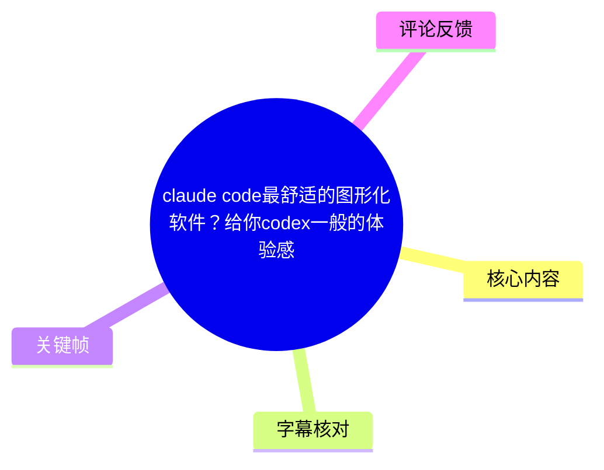
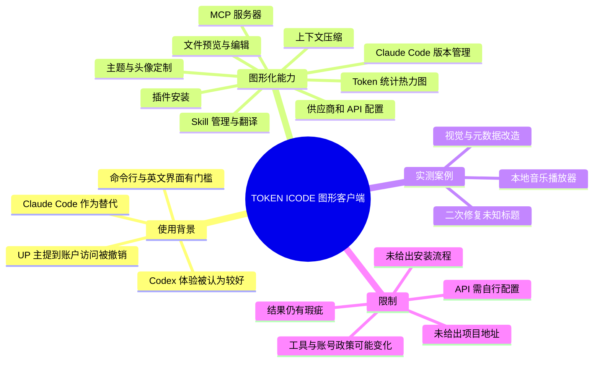
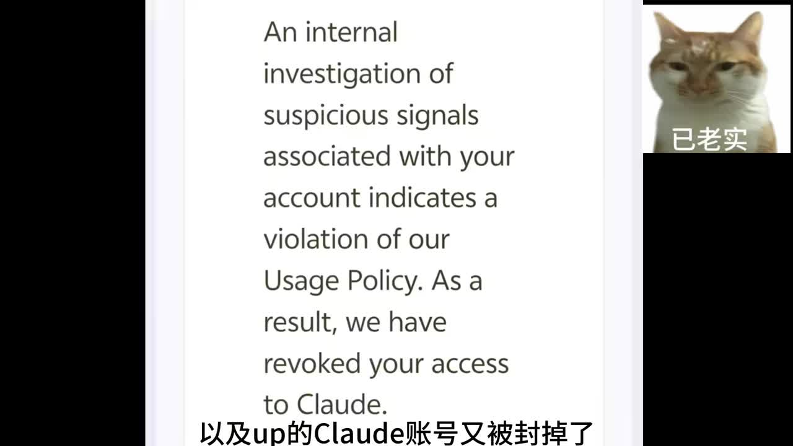
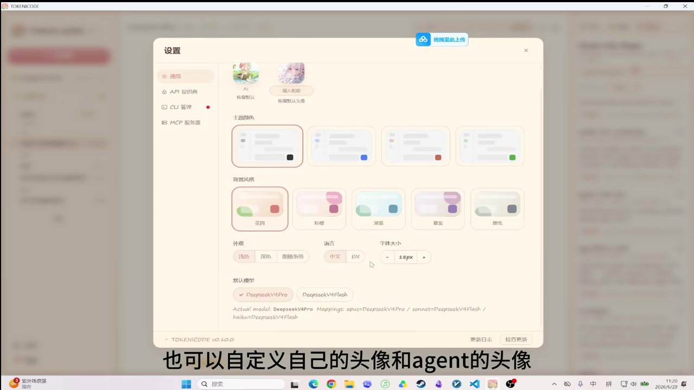

# claude code最舒适的图形化软件？给你codex一般的体验感

> 来源：[Bilibili 视频](https://www.bilibili.com/video/BV1uEK96HEWQ) 
> UP 主：树雨自莺莺｜合集：AIcode｜时长：4 分 09 秒｜画面规格：2560×1440

## 小结

视频介绍了一个被 UP 主改版后的 Claude Code 图形化客户端，界面中显示的软件名为 **TOKEN ICODE**。UP 主的核心诉求是：在保留 Claude Code 工作方式的前提下，获得更接近 Codex 的可视化、可配置与易用体验。

视频给出的背景是：UP 主认为 Codex 使用体验较好，但其使用条件对自己并不理想；而 Claude Code 虽可作为替代方案使用，却存在英文界面、命令行操作门槛，以及账号访问被撤销等困扰。UP 主曾在 VS Code 中使用 Claude Code，但认为其体验仍与 Codex 有差距。

该客户端的重点不在展示某种新模型能力，而在于把 Claude Code 相关信息和操作图形化：包括 Token 用量热力图、模型与输入/输出 Token 统计、Skill 列表及翻译/编辑、对话导出、文件预览与编辑、插件查看及安装、主题和头像定制、供应商/API 配置、CC Switch 相关支持、Claude Code 版本管理、MCP 服务器添加以及会话上下文查看和压缩等。

后半段用一个本地音乐播放器改造作为实测：UP 主先让 Agent 为缺失歌曲封面、艺术家和标题信息的播放器改善界面，再针对“部分歌曲标题仍显示未知”的问题追加修复。展示结果表明视觉风格有所提升，且第二轮可修复部分元数据展示问题；但视频也承认仍有小问题，需要继续让 Agent 修正。

适合已经在使用或准备使用 Claude Code、希望减少命令行与英文配置负担、并希望集中管理 Skill、插件、模型/API 和项目文件的用户。需要注意：视频没有提供项目名称、GitHub 地址、安装包、部署命令、支持平台、授权方式、API 计费标准或安全审计信息，因此不能据此直接判断该软件可得性、稳定性与安全性。

## 思维导图

## 目录

- [背景：为什么需要 Claude Code 的图形化界面](#背景为什么需要-claude-code-的图形化界面)
- [客户端功能总览](#客户端功能总览)
  - [统计、Skill 与对话管理](#统计skill-与对话管理)
  - [文件、插件与个性化设置](#文件插件与个性化设置)
  - [模型、版本、MCP 与上下文](#模型版本mcp-与上下文)
- [实测：改造本地音乐播放器](#实测改造本地音乐播放器)
- [可复用操作流程](#可复用操作流程)
- [限制、风险与时效性](#限制风险与时效性)
- [字幕比对](#字幕比对)
- [评论分析](#评论分析)
- [处理记录](#处理记录)

## [背景：为什么需要 Claude Code 的图形化界面](https://www.bilibili.com/video/BV1uEK96HEWQ?t=0)

视频开头以 UP 主的个人使用困境切入。按本次 ASR 及画面上下文校正，涉及的产品/名称包括：

- **Codex**：UP 主评价其“很好用”，并希望获得接近其操作感受的替代界面。
- **Claude Code**：视频所围绕的代码 Agent 工具；ASR 多次误识别为“Cloud Code”或“Cloud”。
- **DeepSeek**：ASR 提到 UP 主以 Claude Code 配合 DeepSeek 使用，但具体接入方式、模型版本、价格和授权关系均未展示。
- **VS Code**：UP 主表示在 VS Code 中使用 Claude Code 后舒适度已有改善，但仍认为与 Codex 的体验存在差距。

UP 主提到的困难可分为三类：

1. **使用资格与账号风险**：画面展示了一段英文账号通知，其内容指向“因检测到与账号有关的可疑信号而违反使用政策，访问 Claude 的权限已被撤销”。这是 UP 主自身展示的个案，不能外推为所有用户都会遇到相同处理。
2. **交互门槛**：UP 主认为 Claude Code 的命令行工作方式对“小白”较难，英文界面也增加了理解成本。
3. **可见性不足**：UP 主举例称，希望能更直观地查看 Skill、已安装插件等，而不是在命令行或分散配置中寻找。

> 图：该关键帧直接呈现视频所说的账号访问问题及英文通知文本，是理解“为什么 UP 主寻求更易用替代界面”的背景证据。它只证明视频中展示了该账号通知，不足以证明封禁原因、适用范围或平台普遍政策。

## [客户端功能总览](https://www.bilibili.com/video/BV1uEK96HEWQ?t=40)

UP 主表示，其在 GitHub 上找到一个开源项目后，将其克隆到本地并进行了“vibe coding 改版重置”。视频没有公开项目仓库名、原始作者、许可证、提交记录或改动内容，因此可确认的只有“UP 主基于一个开源项目进行了本地改版”这一叙述，无法据此复现。

画面中的软件标题为 **TOKEN ICODE**；下文以“该客户端”称呼它。视频展示的是桌面窗口中的图形界面，主要将 Claude Code 使用、项目文件、配置与 Agent 工作过程整合在同一客户端中。

> 图：画面字幕明确写有“UP将这个项目克隆了下来，自己 vibecoding 改版重置了一下”。该帧有助于区分：视频并非在演示 Claude Code 官方界面，而是在展示基于开源项目改造的客户端。

### [统计、Skill 与对话管理](https://www.bilibili.com/video/BV1uEK96HEWQ?t=53)

视频前段演示了以下功能：

| 功能 | 视频展示的操作/结果 | 作用与前提 |
| --- | --- | --- |
| Token 用量统计 | 点击右上角入口后，可显示热力图 | 用于查看哪一天 Token 使用较多；视频还称可查看常用模型及输入、输出 Token。统计是否覆盖全部会话、如何计费，未说明。 |
| Skill 侧边栏 | 右侧边栏显示已安装的 Skill | 把 Skill 集中展示，降低用户查找成本。 |
| Skill 中文翻译 | 点击翻译相关按钮，将 Skill 翻译为中文 | 视频明确提示：**需要用户自行填写大模型 API**。翻译质量、发送的数据范围、API 提供商及费用未说明。 |
| Skill 编辑/微调 | 在翻译后或 Skill 管理界面中编辑 | 适合调整已有 Skill 的说明或内容；视频未展示版本控制、校验机制或回滚机制。 |
| 对话导出 | 点击按钮下载与 Claude Code 的对话 | 用于保存或分享会话；导出格式、敏感信息脱敏与权限控制未展示。 |

画面中，Skill 内容被呈现在工作区，字幕强调“可以在里面对你的 skill 进行编辑和微调”。这说明客户端的目标不仅是聊天，而是把 Agent 的提示/技能资产放到可浏览、可编辑的界面里。

> 图：该帧展示 TOKEN ICODE 的主工作区、左侧内容结构及 Agent 处理记录，且字幕对应“对 skill 进行编辑和微调”。它能直观说明视频中的 Skill 管理不是单一列表，而是包含内容查看与修改的工作流。

### [文件、插件与个性化设置](https://www.bilibili.com/video/BV1uEK96HEWQ?t=91)

接下来视频展示项目操作与界面配置能力：

- **文件列表**：可在文件列表中预览文件。
- **文件编辑**：可直接编辑列表中的文件；UP 主主观评价“里面的代码编辑起来也是很舒服的”。
- **插件查看与安装**：可查看 Claude Code 插件，并对对应插件执行一键安装。视频未说明插件来源、签名验证、权限范围或安装失败处理。
- **界面布局与皮肤**：ASR 对部分词语识别不清，但结合画面与语境，可以确认视频展示了界面样式/主题选择。
- **头像自定义**：可分别设置用户自身头像和 Agent 头像。
- **语言与字体大小**：设置界面画面可见中文/EN 语言选项，以及字体大小的减号、数值和加号控制。

> 图：该帧完整呈现“通用 / API 提供商 / CLI 管理 / MCP 服务器”等设置入口，以及主题配色、外观、语言、字体大小和头像配置。它是理解该工具“图形化体验”与“可定制性”的关键画面。

## [模型、版本、MCP 与上下文](https://www.bilibili.com/video/BV1uEK96HEWQ?t=126)

视频中继续提到以下偏配置层的能力：

1. **供应商、URL 与 API**
   - 除了预设的供应商设置外，用户还可以自行填写 URL 和 API。
   - 这是客户端连接模型服务的必要配置入口，但视频没有公开支持哪些协议、密钥如何存储、是否本地加密、是否支持代理或多账户。

2. **CC Switch 相关支持**
   - UP 主称该客户端支持“CC Switch”；评论区也有人将其作为 Claude Code 模型切换的相关方案提及。
   - 视频没有演示具体切换步骤，也没有说明该支持是内置、外部依赖、兼容层还是仅配置项，因此不应将其理解为已验证的全功能集成。

3. **Claude Code CLI 管理**
   - 客户端可以检查 Claude Code 版本。
   - 视频称更新或切换版本可以“一键”完成。
   - 实际可用性仍取决于本机环境、网络、账户权限、CLI 安装状态以及软件版本兼容性。

4. **MCP 服务器**
   - 可添加 MCP 服务器，让 Agent 操作其他软件。
   - MCP 是模型上下文协议生态中常见的外部工具连接方式；但本视频未展示服务器清单、启动参数、权限确认、读写边界或执行日志。

5. **会话上下文**
   - 视频称可显示“绘画可用向下纹”等内容，本次 ASR 在此处明显失真；结合随后“一键压缩”的表述，可较稳妥确认其意为**显示会话可用上下文/上下文窗口余量，并可一键压缩上下文**。
   - 可确认的功能是“查看可用上下文并压缩”；压缩策略、是否造成信息丢失、摘要由何模型生成，均未展示。

## [实测：改造本地音乐播放器](https://www.bilibili.com/video/BV1uEK96HEWQ?t=156)

后半段是对客户端内 Agent 工作方式的实测。案例对象是 UP 主的本地音乐播放器，初始问题包括：

- 未配置歌曲封面；
- 未配置艺术家信息；
- 未配置歌曲标题；
- 因此整体界面“非常非常不好看”。

UP 主在客户端中输入提示词后，画面显示 Agent 开始工作。视频并未完整展示提示词文本、项目源码、依赖安装记录、终端命令、修改的文件清单或运行环境，因此无法复刻同一结果；可以观察到的流程是：

1. 提出播放器视觉与信息展示改造需求；
2. 等待 Agent 完成代码或文件修改；
3. 浏览/预览不同界面样式；
4. 完成后切换歌曲检查效果；
5. 发现部分歌曲标题仍为“未知”；
6. 将问题反馈给 Agent，等待第二轮修复；
7. 再次查看结果，确认该问题得到改善；
8. UP 主仍提到存在小问题，打算继续修。

视频呈现的结果是：音乐播放器的视觉氛围和信息层级有明显改善；但它不是一次无误完成的过程，而是“生成—验证—反馈—再修复”的迭代。

## [可复用操作流程](https://www.bilibili.com/video/BV1uEK96HEWQ?t=174)

基于视频实际演示，可提炼出以下图形化 Agent 开发流程。此处是对视频顺序的整理，不补充视频未给出的命令或配置参数。

### 1. 先完成基础接入

- 在客户端的 API/供应商设置中填写模型服务所需的 URL 和 API。
- 如需使用 Skill 中文翻译功能，视频明确要求用户自行提供大模型 API。
- 如需调用外部软件或服务，则在 MCP 服务器设置中添加相应服务。

**注意**：视频未展示 API Key 的安全存储方式。不要把密钥写入代码仓库、截图、公开聊天记录或导出的会话文件。

### 2. 让客户端呈现可管理资产

- 在右侧查看当前已安装的 Skill；
- 对需要理解的 Skill 执行翻译；
- 在界面内编辑、微调 Skill；
- 查看插件并按需安装；
- 用文件列表浏览、预览与编辑项目文件。

这一阶段的价值是先让上下文、工具与项目结构变得可见，再开始 Agent 改造任务，避免只在命令行中盲目执行。

### 3. 以明确问题驱动 Agent

视频中的提示目标不是泛泛地“美化”，而是有可检验的问题：本地音乐播放器缺封面、艺术家和标题，整体观感较差。可复用的任务描述应至少包含：

- 当前对象：哪个项目/页面/功能；
- 当前问题：例如信息缺失、布局不佳、样式不统一；
- 预期结果：需要改善哪些可见元素；
- 验收方式：通过切歌、预览不同界面、检查未知标题等动作验证。

### 4. 完成后必须人工验收

UP 主没有把 Agent 的输出视为最终答案，而是通过切换多首歌曲检查结果。视频中的实际验收点包括：

- 风格是否得到提升；
- 连续切换歌曲时展示是否正常；
- 是否仍出现“未知”标题；
- 修复后是否达到预期。

当发现问题时，应把具体问题反馈给 Agent，而非重新给出模糊需求。视频展示的“未知标题”二次修复就是这一方法的例子。

### 5. 管理会话与版本

- 上下文接近限制时，可使用一键压缩功能，但压缩可能丢失细节，重要约束应在压缩后重新确认。
- 需要调整 Claude Code CLI 时，可先在客户端检查版本，再考虑更新或切换。
- 对话需要共享时可导出；导出前应自行检查其中是否包含 API 地址、私有路径、代码片段或业务数据。

## [限制、风险与时效性](https://www.bilibili.com/video/BV1uEK96HEWQ?t=229)

### 视频已展示的限制

- **账号可用性不稳定**：UP 主展示其 Claude 账号访问被撤销的通知。原因和解决路径未在视频中展开。
- **需要自行配置 API**：至少 Skill 翻译功能需要自行填写大模型 API；这意味着用户还要处理密钥、服务商、额度和费用。
- **自动改造并非一次成功**：音乐播放器案例中仍出现歌曲标题未知的问题，需二次反馈修复。
- **信息不完整**：没有项目链接、安装包、开源许可证、兼容系统、最低环境要求、详细教程或源码修改详情。
- **插件与 MCP 风险未说明**：一键安装插件、让 Agent 操作其他软件会扩大本地权限和供应链风险，但视频没有展示审计、权限确认或沙箱机制。

### 时效性判断

- 元数据显示视频发布时间为 **2026-06-29**；工具界面、Claude Code 版本、模型供应商、API 价格、账号政策与 CC Switch 的兼容状况均可能在之后变化。
- 视频中的“Codex 更好用”“VS Code 仍有差距”等属于 UP 主的使用评价，不是可普遍量化的产品结论。
- 视频展示的是 UP 主本地改版后的客户端，而非已核验的官方产品说明。是否能下载、是否仍维护、能否在其他环境运行，都需要以项目实际发布页和最新文档为准。

## [字幕比对](https://www.bilibili.com/video/BV1uEK96HEWQ?t=0)

本次任务中，**站内字幕和本次 ASR 均已获取并执行分析**。两者质量差异显著。

| 字幕来源 | 完整性 | 专有名词 | 时间轴 | 主要问题 |
| --- | --- | --- | --- | --- |
| Bilibili 站内字幕 | 极低，内容仅数句 | 与视频主题完全不符 | 未提供可用分段时间轴 | 内容讲述潜水员、珊瑚苗圃与珊瑚保育，显然不是本视频的语音内容。 |
| 本次 ASR 字幕 | 较高，基本覆盖整段叙述 | 存在多处误识别 | 未提供逐句时间戳 | 将 Claude Code 多次识别为“Cloud Code”，将 Codex、MCP、上下文等词语部分错写或错断。 |

### 最终字幕选择

最终以**本次 ASR**作为主要内容来源，并结合视频标题、关键帧中的界面文字及上下文进行有限校正；站内字幕不采用，因为其主题与当前视频完全无关。

重点校正如下：

| ASR 原文/近似识别 | 正文采用写法 | 校正依据 |
| --- | --- | --- |
| Cloud Code / Cloud | Claude Code | 视频标题、上下文和评论均围绕 Claude Code；画面亦出现 Claude 账号通知。 |
| Cloud叫号 | Claude 账号 | ASR 语音误识别；关键帧展示英文账号访问撤销通知。 |
| Verses Code | VS Code | 与代码开发环境语境相符。 |
| Token Icode | TOKEN ICODE | 软件窗口左上角可见 “TOKEN ICODE”。 |
| MT 服务器 | MCP 服务器 | 设置界面可见 “MCP 服务器”。 |
| 绘画可用向下纹 | 可用上下文/上下文窗口余量 | 后文紧接“一键压缩”，符合上下文管理语境；此项仍保留不确定性。 |
| 装了哪些插件 | 已安装插件 | 与视频功能展示及字幕语义一致。 |

由于 ASR 没有提供逐句时间戳，正文中的时间轴以视频叙事和功能段落位置进行定位，适合跳转回看，不应视为逐字稿级别的精确切分。

## [评论分析](https://www.bilibili.com/video/BV1uEK96HEWQ?t=236)

仅处理本次可获取的热评前三条；评论观点均为用户经验或建议，**不作为已验证事实**。

1. **Micafret（59 赞）**：“A社真敏感肌，开一个封一个”
   - 观点：呼应视频中账号访问被撤销的画面，表达对相关账号风控/封禁体验的不满。
   - 补充价值：说明该问题可能引发其他用户共鸣。
   - 可信度与边界：评论未提供账户类型、操作背景、官方申诉结果或证据，不能据此确认平台存在普遍性“开一个封一个”的情况。

2. **SycamoreLeaves（11 赞）**：“codex接ds不就好了”
   - 观点：建议直接让 Codex 接入 DeepSeek（“ds”通常被用作 DeepSeek 的简称）。
   - 补充价值：提供了另一种思路：不必围绕 Claude Code 图形客户端，或可从 Codex 与其他模型服务的组合着手。
   - 可信度与边界：评论没有给出接入方法、支持范围、费用、模型能力差异或当前可行性，属于方向性建议。

3. **努力的大撸鱼（4 赞）**：“CC switch不就行了吗 但是CC桌面端也不如codex界面好用 差远了”
   - 观点：认为 CC Switch 可解决部分模型切换问题，但仍认为 Claude Code 桌面端界面不如 Codex。
   - 补充价值：与视频所展示的“支持 CC Switch”“追求接近 Codex 的界面体验”形成对应。
   - 可信度与边界：这是主观交互体验评价；具体所指版本、操作系统和配置不明，不能得出产品优劣的普遍结论。

## [处理记录](https://www.bilibili.com/video/BV1uEK96HEWQ?t=249)

- **Worker ID**：worker-mrj0wjed-b0c290ad
- **模型**：gpt-5.6-terra
- **调用工具与素材**：基于任务提供的 Bilibili 元数据、视频素材清单、站内字幕、已执行的 ASR 字幕、热评前三条及关键帧进行整理；未获得外部项目仓库、安装包或官方文档。
- **字幕选择**：站内字幕内容与视频主题不符，未采用；本次 ASR 已执行并作为主来源，结合标题、关键帧和上下文校正 Claude Code、VS Code、TOKEN ICODE、MCP 等关键术语。
- **关键帧选择依据**：
  - `frames/frame-001.jpg`：展示账号访问撤销通知，对应视频问题背景；
  - `frames/frame-002.jpg`：展示“克隆开源项目并改版”的来源说明；
  - `frames/frame-003.jpg`：展示 Skill 工作区与编辑语境；
  - `frames/frame-004.jpg`：展示设置页中的主题、语言、字体、头像及 API/CLI/MCP 入口。
- **缓存清理**：本次仅依据已提供的素材路径和文本信息生成文档；未产生可报告的额外下载缓存或临时媒体缓存，故无额外缓存清理项。
- **未解决问题**：
  - 未提供 TOKEN ICODE 对应项目的名称、仓库 URL、许可证和安装方式；
  - ASR 无逐句时间戳，且局部专有名词识别存在不确定性；
  - 未能从素材中验证 API 安全机制、插件来源审计、MCP 权限边界、实际兼容系统及 Claude Code/CC Switch 的最新可用状态。

## 评论分析

本次流程未获取到可用热评，因此不推断观众态度或额外结论。
