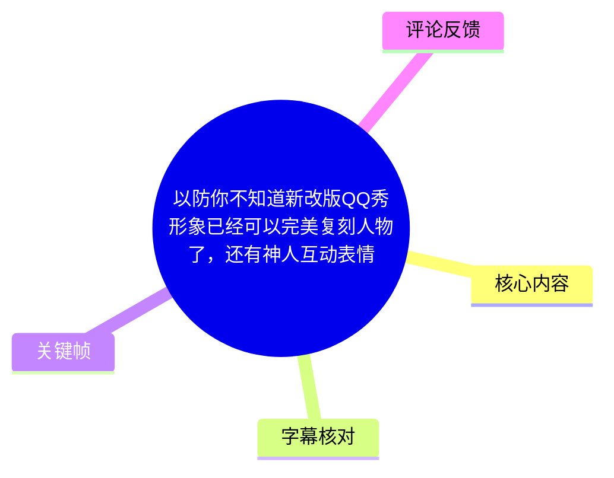
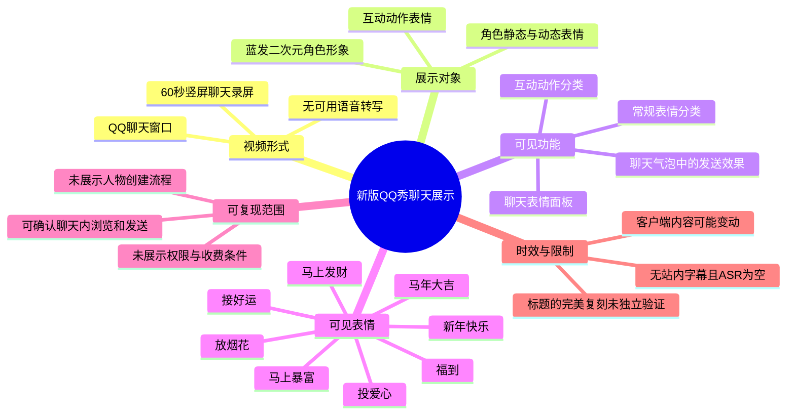
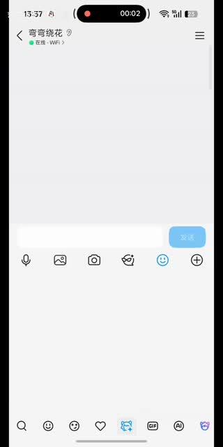
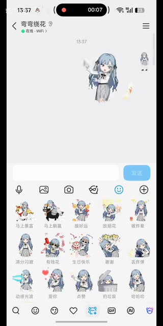
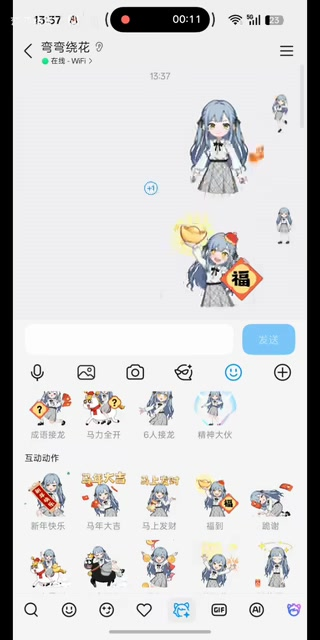
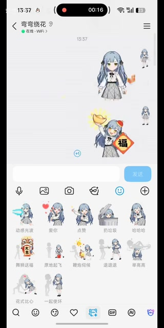

# 以防你不知道新改版QQ秀形象已经可以完美复刻人物了，还有神人互动表情

> 来源：[Bilibili 视频](https://www.bilibili.com/video/BV1H8Ej6aEao) 
> UP 主：弯弯绕花｜视频时长：60 秒｜画面规格：720 × 1440 竖屏 
> 标签：神人、bangdream、千早爱音、丰川祥子

## 小结

视频以 QQ 聊天窗口的录屏形式，展示了新版 QQ 秀形象及其在聊天表情面板中的使用效果。画面中的蓝发角色形象与视频标签所指向的《BanG Dream! It's MyGO!!!!!》相关角色形象存在明显的二次元角色化特征；标题将其描述为可“完美复刻人物”，但这属于投稿标题的主张，素材本身仅能确认其展示了高度定制化的 QQ 秀/表情形象，不能据此独立验证“完美复刻”的技术标准。

视频最明确的演示重点是两类内容：其一，聊天界面中可发送的角色表情，包括“马上暴富”“投爱心”“放烟花”“接好运”“生日快乐”“谢谢”“去炸弹”“动感光波”“爱你”“点赞”“扔垃圾”“哈哈哈”等；其二，名为“互动动作”的分类，其中出现“新年快乐”“马年大吉”“马上发财”“福到”“谢谢”等双人或多角色互动式动画表情。

从可见界面判断，创作者并未展示人物捏脸、素材导入、服装配置、表情制作或开通入口等前置步骤。因此，这份记录只能整理**已展示的聊天内调用流程与表情效果**，不能将其扩展为完整的 QQ 秀复刻教程，也不能提供未在视频中出现的功能路径、会员条件、价格或适用版本。

对想确认“新版 QQ 秀能否在聊天内作为动态形象/互动表情使用”的读者，本视频提供了直观示例；对想复现特定角色外观的读者，则仍需自行在实际客户端确认形象创建入口、素材供给、设备兼容性和账号权限。

信息具有时效性：视频元数据对应 2026 年 2 月，QQ 的客户端界面、QQ 秀入口、互动表情内容和可用范围均可能在后续版本调整。站内未提供字幕，本次 ASR 也没有识别到语音文本，正文主要依据关键帧中的可见 UI 与文字撰写。

## 思维导图

## 目录

- [展示背景与证据边界](#展示背景与证据边界)
- [聊天表情面板与角色效果](#聊天表情面板与角色效果)
- [互动动作表情](#互动动作表情)
- [可从画面复现的操作流程](#可从画面复现的操作流程)
- [参数、限制与时效性](#参数限制与时效性)
- [字幕比对](#字幕比对)
- [评论分析](#评论分析)
- [处理记录](#处理记录)

## 展示背景与证据边界 [00:00:02](https://www.bilibili.com/video/BV1H8Ej6aEao?t=2)

视频是手机竖屏录制的 QQ 单聊界面，聊天对象显示为“弯弯绕花”，状态文字为“在线 - WiFi”。录屏计时器显示到 `00:02` 时，聊天区域尚无大量消息，底部已经打开表情相关面板；输入框右侧为“发送”按钮。

标题所称“新改版 QQ 秀形象已经可以完美复刻人物”是本视频的核心宣传语。结合标签“bangdream”“千早爱音”“丰川祥子”以及画面中的蓝发少女形象，可合理确认视频在以二次元角色风格的 QQ 秀形象及表情为例进行展示。不过，视频没有给出角色建模参数、原图对照、捏脸数据或制作过程，因此：

- **可确认**：聊天内存在一组与该角色形象相匹配的动态表情和互动动作。
- **无法从素材确认**：形象是否由 QQ 秀自动生成、是否完全手工搭配、是否“完美”还原角色、是否对所有用户开放。
- **不应延伸**：不能据此断言具体角色版权合作、官方联动身份或某项 AI 生成功能已上线。

> 图：关键帧中可见 QQ 单聊窗口、输入栏下方的功能入口，以及底部被选中的蓝色 QQ 秀/表情相关图标。它证明视频展示的是聊天场景内的功能调用，而不是单独的人物编辑器。

## 聊天表情面板与角色效果 [00:00:07](https://www.bilibili.com/video/BV1H8Ej6aEao?t=7)

在录屏 `00:07`，聊天记录区出现一个蓝发角色的动态形象，底部则展开了同一形象主题的表情网格。可读到的可见项目包括：

| 可见表情名称 | 画面呈现或含义 |
| --- | --- |
| 马上暴富 | 与财富祝福相关的角色动画表情 |
| 马上暴富（另一格） | 同主题的另一表现形式或重复显示项；仅凭画面无法确认其与前者的差别 |
| 投爱心 | 角色配合爱心动作 |
| 放烟花 | 角色配合烟花效果 |
| 接好运 | 角色配合接取好运的动作 |
| 新年快乐 | 节日祝福类表情 |
| 有钱花 | 财富主题表情 |
| 生日快乐 | 生日祝福表情 |
| 谢谢 | 致谢表情 |
| 去炸弹 | 文字如此显示，具体动作含义以客户端实际动画为准 |
| 动感光波 | 模仿“动感光波”的动作表情 |
| 爱你 | 爱意表达 |
| 点赞 | 点赞动作 |
| 扔垃圾 | 扔垃圾动作 |
| 哈哈哈 | 大笑反应 |

表情面板上方的聊天区也出现了角色小尺寸动画和较大尺寸角色动画，说明这些内容并非单纯头像贴纸，而是可以进入聊天记录区域的动态表情。视频画面没有显示单次点击后的完整播放时长、是否可撤回、是否在不同客户端降级为静态图，故这些行为不能进一步确定。

> 图：该帧同时展示聊天区内的大尺寸角色动画与表情面板中的角色表情网格，是判断“形象”和“聊天表情”已形成视觉一致性的重要依据。画面计时器为 `00:07`，可作为本节时间轴链接的来源。

## 互动动作表情 [00:00:11](https://www.bilibili.com/video/BV1H8Ej6aEao?t=11)

录屏 `00:11` 时，底部面板切换到标题为“互动动作”的分类。该区域出现多个人物、物品或对向动作组合，视觉上与普通单角色表情不同，重点是角色之间或角色与场景元素之间的联动。

可辨认的互动动作项目如下：

| 名称 | 画面可见信息 | 可确认范围 |
| --- | --- | --- |
| 新年快乐 | 红色节日元素与角色组合 | 节日互动动作存在 |
| 马年大吉 | 马主题、节庆构图 | 以画面文字为准，不推断具体动画规则 |
| 马上发财 | 财富/祝福构图 | 可见为互动分类条目 |
| 福到 | “福”字与角色组合 | 可见为互动分类条目 |
| 谢谢 | 人物与感谢主题构图 | 可见为互动分类条目 |
| 其余未能清晰辨认的格子 | 含人物与场景/道具组合 | 不臆测名称及触发条件 |

聊天区内可见两个角色或角色与表情元素同时出现：上方是较大蓝发角色，下方有带“福”字的动作画面。这与“互动动作”标签相互印证，表明该分类至少包含比常规单人表情更复杂的组合式表现。

但“互动”具体如何触发，视频没有完整展示。例如，尚不能确认它是否需要对方拥有相同 QQ 秀、是否自动识别双方形象、是否只能在单聊使用，或是否由发送者单方面播放。将“互动动作”理解为“一个独立的互动表情分类”是稳妥结论；将其理解为“两个真实用户角色自动互动”则超出了现有证据。

> 图：底部清晰显示“互动动作”栏目，网格中包含“新年快乐”“马年大吉”“马上发财”“福到”“谢谢”等可读文字；聊天区的角色与“福”字动画则说明该类内容会在对话区域中呈现。

## 可从画面复现的操作流程 [00:00:16](https://www.bilibili.com/video/BV1H8Ej6aEao?t=16)

以下是根据画面能够确认的最小操作链路，而不是人物复刻或表情制作教程：

1. **进入 QQ 单聊窗口。**  
   视频始终处于与“弯弯绕花”的对话界面，底部有文本输入框与发送按钮。

2. **打开底部表情/QQ 秀相关面板。**  
   `00:02` 画面中，输入区下方的功能栏存在一个被高亮的蓝色图标；展开后显示角色主题表情。该图标在不同版本上的名称或位置未由视频文字明确说明，建议以实际客户端 UI 为准。

3. **在角色主题表情网格中选择常规动作。**  
   `00:07` 可见“投爱心”“放烟花”“接好运”等表情。选择后，聊天区出现对应的角色动画效果。

4. **切换到“互动动作”分类。**  
   `00:11` 画面明确显示分类名称“互动动作”，其中有新年、马年、发财、福到、谢谢等主题动作。

5. **发送并观察聊天区效果。**  
   视频在 `00:16` 回到常规角色表情网格，聊天区保留了此前出现的角色/祝福动画，说明演示重点在于发送后的视觉呈现。

> 图：该帧中的“互动动作”面板已切回常规表情网格，但聊天区仍可看到此前的角色与祝福元素。这有助于区分“表情选择区”和“消息呈现区”两个界面层级。

### 未展示、因此不能补写的步骤

视频没有提供下列信息，实际操作时应自行核实：

- 如何创建、导入或编辑视频中的蓝发角色形象；
- QQ 秀的具体入口名称、版本号与系统平台要求；
- 是否需要超级会员、QQ 秀装扮、付费道具或活动资格；
- 互动动作是否要求聊天双方均具备 QQ 秀形象；
- 表情是否支持群聊、频道、电脑端或不同系统客户端；
- 是否能搜索、收藏、下载、管理或删除这套表情；
- 人物“复刻”所需的脸型、发型、服装、颜色及任何数值参数。

## 参数、限制与时效性 [00:00:07](https://www.bilibili.com/video/BV1H8Ej6aEao?t=7)

### 视频内可核验的参数

| 项目 | 可核验信息 |
| --- | --- |
| 视频时长 | 60 秒（元数据）；ASR 实际音频分析时长为 59.118 秒 |
| 画面方向 | 竖屏 |
| 分辨率 | 720 × 1440 |
| 演示场景 | QQ 单聊窗口 |
| 可见分类 | 角色常规表情、互动动作 |
| 画面角色 | 蓝发二次元风格少女形象 |
| 视频语言证据 | 无可用语音文本；UI 中可见中文表情名称 |
| 站内字幕 | 未提供可用字幕 |
| 本次 ASR | 空结果，共 0 个语音片段 |

### 结论的适用边界

1. **“可以在聊天中使用”有画面证据。**  
   角色动画和表情网格均出现在聊天窗口中，这是本视频最可靠的信息。

2. **“完美复刻人物”没有可量化证据。**  
   该表述来自标题，未提供原型图对照、建模精度比较或官方说明。正文仅记录为创作者的展示性主张。

3. **“互动”机制不完整。**  
   视频能证明存在“互动动作”栏目，不能证明其真实的双人触发逻辑、兼容性或限制。

4. **可用内容随版本变化。**  
   QQ 的产品入口、装扮库、表情包活动和权限政策可能变化；应以观看时客户端实际显示为准，尤其不要把本视频中的春节、马年等主题表情视为长期固定内容。

5. **发布时间元数据需保留来源属性。**  
   本文将 `pubdate: 1780984263` 换算为 2026-02-13 12:04:23，但该时间取自提供的元数据；未取得平台页面上的人工可读发布日期截图，不能额外确认时区展示规则。

## 字幕比对

站内没有提供可用字幕；本次 ASR 已按自动语言模式运行并产出带时间戳能力的结果文件，但最终没有识别出任何语音片段。诊断中**没有**标记 `noAudioStream=true`，因此不能将其表述为“源视频没有音轨”；准确说法是：素材存在被处理的音频文件，ASR 未识别出可转写语音，诊断建议核查音轨或重试正确音轨。

| 字幕来源 | 完整性 | 专有名词 | 时间轴 | 主要问题 |
| --- | --- | --- | --- | --- |
| Bilibili 站内字幕 | 无可用字幕 | 无法评估 | 无 | 未提供可用站内字幕 |
| 本次 ASR 字幕 | 空，0 个 segments | 无法识别 | 无可用语音分段；ASR 处理时长 59.118 秒 | 语言自动判断为 `en`，置信度 0.5410；语音覆盖率为 0，未识别出语音 |

### 最终字幕与时间轴选择

- **字幕选择**：无可采用的文字字幕，不进行站内字幕与 ASR 的内容合并。
- **时间轴依据**：正文中的 `00:02`、`00:07`、`00:11`、`00:16` 链接依据所给关键帧内的录屏计时器，而非按照文案顺序臆测位置；所有链接均指向对应秒数。
- **多模态校正方式**：通过关键帧可读 UI 文字确认“互动动作”“新年快乐”“马年大吉”“马上发财”“福到”“谢谢”等名称；通过视频标题、标签与可见角色形象建立主题背景，但不把标签推断为官方功能命名或角色授权证明。
- **未能校正的内容**：无口播文本可供核对，无法转写创作者对“新改版”“完美复刻”及“神人互动表情”的任何额外解释。

## 评论分析

以下仅处理本次可获取热评前三条。评论反映的是观众态度或个人经验，不作为 QQ 产品规则、功能稳定性或视频内容的已验证事实。

| 热评 | 点赞数 | 观点与补充 | 可信度与边界 |
| --- | ---: | --- | --- |
| 嘔嘔鞑靼：“已严肃使用……26mygo的dlc表情包_快看……” | 536 | 评论者以玩笑口吻表示已经开始使用该主题表情，并将其称作 “MyGO 的 DLC 表情包”。这与视频呈现的角色主题聊天表情高度相关。 | “DLC”是社区化比喻，不是官方产品分类；不能据此确认 QQ 与 MyGO 存在正式 DLC 或联动。 |
| 康木特：“不搞了，当年厘米秀搞了这么多s级皮肤……说没就没了……” | 360 | 评论者表达对长期投入虚拟形象/装扮的担忧，并以“厘米秀”过去的个人使用经历说明其不愿再次积累皮肤和任务。 | 这是个体经验与风险提醒。视频未涉及厘米秀、资产迁移或服务终止，不能据此推导新版 QQ 秀一定会下线。 |
| ゚゚四季映姬：“[doge]看看我的” | 278 | 评论者希望展示自己的相关形象或使用效果，侧面体现该话题具有晒装扮、比较还原度的社群互动属性。 | 未附可核验图文信息，无法判断其形象、使用资格或与视频功能的具体对应关系。 |

综合前三条热评，可以看到两种主要反馈：一类把这套内容当作角色主题表情进行轻松使用与传播；另一类则关注数字装扮的长期留存风险。前者与视频可见内容一致，后者值得在实际投入时间或付费前关注，但仍需查询 QQ 官方规则与当前服务状态。

## 处理记录

- Worker ID：`worker-mrj0www4-e8d79408`
- 模型：`gpt-5.6-terra`
- 调用工具与产物：视频素材整理流程已提供 `merged.mp4`、`audio/audio.wav`、关键帧目录、ASR 结果、信息文件与评论文件；本次文档基于这些已提供产物编写。
- ASR 检查：已检查 `asr-result.json` 及诊断信息。模型为 `medium`，设备为 CUDA，计算类型为 `float16`，自动检测语言为英语（概率 `0.541015625`）；结果为空，`sentenceCount=0`、`speechSeconds=0`、`speechCoverage=0`。
- 字幕选择：站内字幕未提供可用内容；本次 ASR 为空，故不采用任何转写字幕。时间定位改用关键帧内可见的录屏计时器，不把 ASR 空结果误写为无音轨。
- 关键帧选择依据：
  - `frames/frame-001.jpg`：`00:02`，用于说明 QQ 聊天场景和功能入口；
  - `frames/frame-002.jpg`：`00:07`，用于说明角色主题常规表情网格与聊天动画；
  - `frames/frame-003.jpg`：`00:11`，用于说明“互动动作”分类及其可读条目；
  - `frames/frame-004.jpg`：`00:16`，用于说明切回常规网格后聊天区的动画呈现。
- 关键帧使用范围：素材清单列出 12 个关键帧路径，但本次实际提供可辨识画面预览的是前 4 帧；未对未展示内容的其余帧作任何描述或推断。
- 评论范围：仅分析成功获取的热评前三条，共 3 条。
- 缓存清理：未提供实际缓存删除或清理日志；因此不声称已执行缓存清理。
- 未解决问题：无法确认 QQ 客户端版本、QQ 秀创建方式、装扮来源、费用/权限、互动动作触发规则、跨端兼容性，以及标题所称“完美复刻”的具体评价标准。
