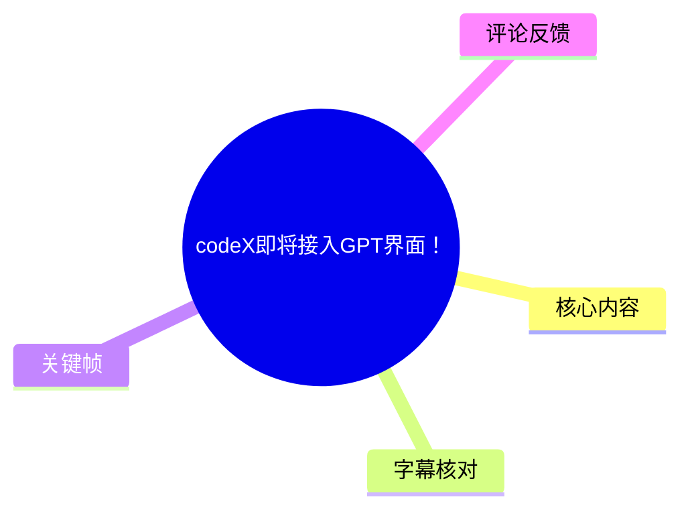
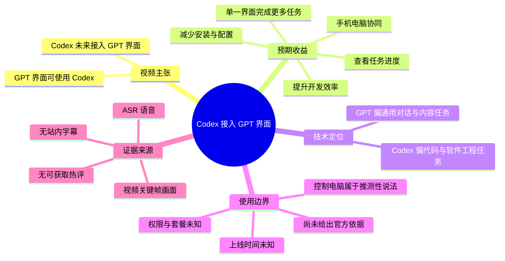
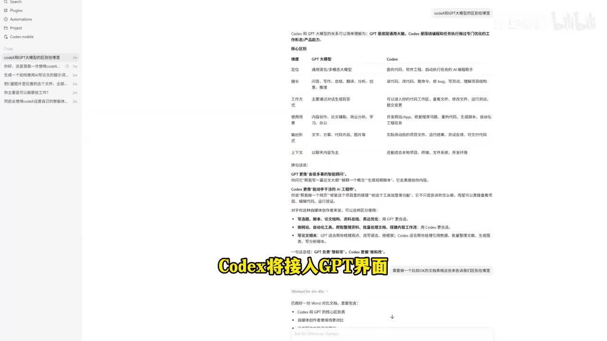
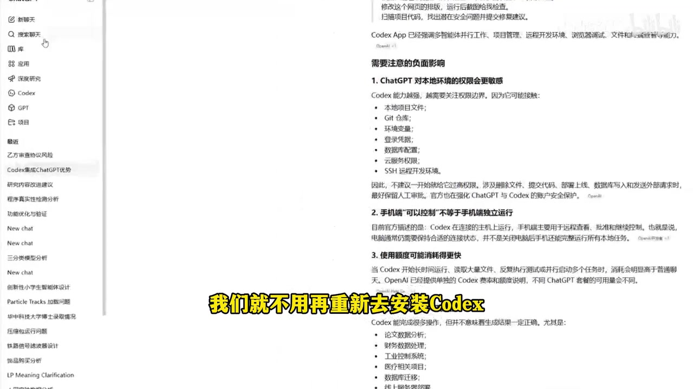
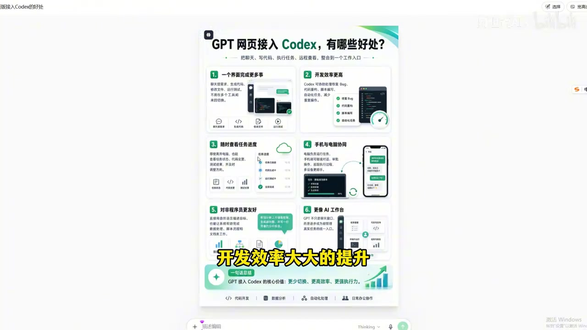
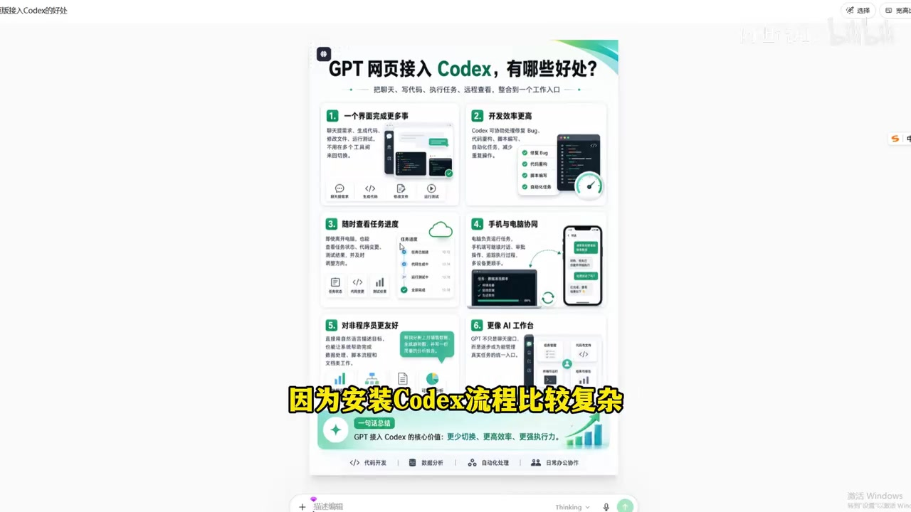

# codeX即将接入GPT界面！

> 来源：[Bilibili 视频](https://www.bilibili.com/video/BV1rc7D6xENK) 
> UP 主：阿坦说AI8｜发布时间：2026-06-07｜视频时长：00:41

## 小结

视频围绕一项**尚未落地的预期变化**展开：UP 主称，Codex 未来将接入 GPT/ChatGPT 界面，用户可直接在 GPT 界面中使用 Codex。视频的重点不是演示已上线功能，而是讨论这种整合可能带来的使用体验变化。

UP 主给出的核心收益包括：无需单独重新安装 Codex、减少额外配置、在同一个界面完成更多任务，从而提升开发效率；同时可查看任务进度，并在手机与电脑之间协同操作。其面向对象主要是需要使用 AI 辅助编程的开发者，尤其是认为 Codex 独立安装流程较复杂的用户。

从画面中的说明页可补充理解：视频将 GPT 描述为偏通用的对话式大模型，将 Codex 描述为面向代码与软件工程的 AI 编程助手；整合设想是把自然语言交互入口与代码工作流连接起来。但这些内容是视频画面及 UP 主的观点，不构成官方功能公告或已验证的产品承诺。

需要特别注意时效与边界：视频的表述是“过一段时间”“应该”，没有提供官方公告链接、明确发布日期、适用套餐、地区范围、权限模型或实际开通步骤。因此，“可直接在 GPT 网页端控制电脑”应视为作者对未来能力的推测，而不能据此认定当前所有 ChatGPT 用户均已获得该权限。

## 思维导图

## 目录

- [背景与信息时效](#背景与信息时效)
- [视频主张：Codex 接入 GPT 界面](#视频主张codex-接入-gpt-界面)
- [整合可能带来的使用变化](#整合可能带来的使用变化)
- [技术定位与画面补充](#技术定位与画面补充)
- [实践含义与尚缺步骤](#实践含义与尚缺步骤)
- [限制、风险与待验证事项](#限制风险与待验证事项)
- [关键帧索引](#关键帧索引)
- [字幕比对](#字幕比对)
- [评论分析](#评论分析)
- [处理记录](#处理记录)

## 背景与信息时效

视频时长仅 41 秒，实际可识别语音集中在 **00:30.920—00:40.520**，前段主要依靠画面呈现信息。视频标题为“codeX即将接入GPT界面！”，语音中也使用“过一段时间”“到时候应该”等未来时态，因此应将其定性为一条关于产品整合方向的短资讯/观点视频，而非功能实测教程。

截至视频元数据所示发布时间（2026-06-07），素材本身未提供 OpenAI 官方公告、产品更新日志、测试资格说明或价格信息。视频中涉及的功能状态不能仅凭该短片确认。

## 视频主张：Codex 接入 GPT 界面

### 作者的未来整合判断 [00:00:30](https://www.bilibili.com/video/BV1rc7D6xENK?t=30)

ASR 在 00:30.920 起记录到 UP 主的主要论点：

> “过一段时间 Codex 将接入 GPT 界面，我们直接在 GPT 这个界面就能使用到最强的 Codex。”

这句话包含两层信息：

1. **整合方向**：Codex 不再仅以独立的安装、配置或单独入口呈现，而可能被放入 GPT/ChatGPT 的交互界面。
2. **交互入口变化**：用户可能通过 GPT 的网页或应用界面发起编程任务，再由 Codex 类能力执行或协助处理。

其中“最强的 Codex”是 UP 主的主观评价，视频没有给出模型版本、基准测试、可用功能清单或与其他编码模型的比较数据，不能将其视为性能结论。

> 图：该关键帧展示了以 GPT 与 Codex 为主题的界面对照内容，并叠加“Codex将接入GPT界面”的字幕。它有助于确认视频讨论的核心是“界面整合”及两类能力的分工，而不是具体代码案例。

## 整合可能带来的使用变化

### 减少安装和额外配置 [00:00:30](https://www.bilibili.com/video/BV1rc7D6xENK?t=30)

UP 主认为，整合后用户“不用再重新去安装 Codex”“不需要额外的配置”，因而使用会更方便；其理由是独立安装 Codex 的流程“比较复杂”。

这可以理解为一种潜在的**接入门槛下降**：

- 用户可能不必在本机单独准备 Codex 的安装环境；
- 对话、任务发起和结果查看可能集中在 GPT 界面；
- 新手无需在多个产品入口之间切换。

但视频没有说明“安装”具体指桌面应用、CLI、IDE 扩展还是其他客户端，也未给出操作系统要求、安装命令、账户授权流程或现有配置的迁移方案。因此，不能从视频推导出“任何本地 Codex 安装都将被取消”。

### 单界面任务编排与效率预期 [00:00:30](https://www.bilibili.com/video/BV1rc7D6xENK?t=30)

作者进一步称，一个界面可以完成更多任务，开发效率将“大大提升”。结合画面中 GPT 与 Codex 的对照，视频表达的逻辑是：

| 能力侧重点 | 视频画面传达的定位 | 整合后的潜在意义 |
| --- | --- | --- |
| GPT | 通用对话、问答、写作、总结、翻译、分析等 | 负责用自然语言理解需求、组织任务与解释结果 |
| Codex | 代码、软件工程和自动执行任务 | 负责面向代码库、文件或工程流程的处理 |
| GPT + Codex | 统一入口 | 减少在通用聊天与编码工具之间切换的成本 |

“效率提升”在本视频中是预期判断，不是以耗时、成功率、代码质量或任务完成率验证过的测量结果。实际效率还会受项目规模、模型能力、权限范围、网络环境、审查流程及用户提示词质量影响。

> 图：该关键帧呈现 GPT 风格页面及与 Codex 相关的说明内容，画面价值在于说明视频所设想的是在既有 GPT 交互环境中承载 Codex 能力，而非仅讨论独立编码工具。

### 任务进度与跨设备协同 [00:00:30](https://www.bilibili.com/video/BV1rc7D6xENK?t=30)

ASR 中，UP 主还提到：

- 可以“实时查看任务进度”；
- “手机电脑同步协作”；
- 操作会更方便；
- 对“程序员”更友好。

这说明视频关注的不只是生成代码，也包括长任务的状态可见性与跨终端访问体验。对于需要等待 AI 执行多步骤任务的用户，进度展示能帮助判断任务是否仍在运行、何时需要人工介入。

不过，视频没有展示实际的进度面板、任务队列、设备同步开关、冲突处理逻辑或移动端独立执行能力。尤其“手机电脑同步协作”只能确认是作者陈述，尚不能据此断言手机能够直接在本地运行 Codex，或能够不经授权访问电脑文件系统。

## 技术定位与画面补充

### GPT 与 Codex 的分工描述 [00:00:30](https://www.bilibili.com/video/BV1rc7D6xENK?t=30)

画面中的对照说明将二者区分为不同侧重点：

- **GPT**：偏向通用语言模型能力，适合问答、写作、总结、翻译、分析、创意及办公等广义任务。
- **Codex**：偏向代码与软件工程，涉及读写代码、理解项目、修复问题、编写测试、运行或调用相关工具等工程工作流。
- **整合价值**：用户可从自然语言需求出发，经由统一的 GPT 对话入口进入代码任务处理。

这类定位有助于建立正确预期：即使在同一界面中使用，通用对话能力与工程执行能力也不等同。前者重在表达、推理和任务沟通，后者若涉及项目目录、代码改动或工具执行，则通常需要更严格的上下文、权限与人工复核。

> 图：该关键帧包含“GPT 网页接入 Codex，有哪些好处？”的图示化说明。它直接对应视频从“整合消息”转向“影响分析”的叙述结构，适合作为理解收益主张的视觉证据。

## 实践含义与尚缺步骤

### 视频实际提供的操作指引 [00:00:32](https://www.bilibili.com/video/BV1rc7D6xENK?t=32)

视频没有给出可复现的产品接入步骤、命令行命令、API 参数、模型名称、订阅要求或权限配置。唯一与行动有关的口播是：

> “如果大家也想使用到 GPT，都可以点击我主页的置顶作品找到我。”

这属于引导用户前往主页内容的推广性提示，并不是 Codex 接入 GPT 的官方开通方法。

因此，基于本视频能够整理出的“实践路径”只能是概念层面的准备，而非实际教程：

1. 关注 Codex 是否出现于 GPT/ChatGPT 的官方产品入口或更新说明中；
2. 在可用时确认账户所属套餐、地区和组织策略是否支持该能力；
3. 若功能涉及本地项目或电脑操作，先阅读权限请求，避免直接授予不必要的目录、终端、Git、密钥或云端权限；
4. 用非敏感、可回滚的测试项目验证任务执行、文件改动和进度状态；
5. 对生成或修改的代码执行人工审查、测试与版本控制提交检查。

以上五步是对视频所述“统一入口、工程执行、控制电脑”等场景的稳妥使用建议，不是视频展示过的实际操作流程。

## 限制、风险与待验证事项

### “网页端控制电脑”仍属推测 [00:00:32](https://www.bilibili.com/video/BV1rc7D6xENK?t=32)

ASR 的结尾称：“到时候应该就可以直接在 GPT 的网页端控制我们的电脑去进行操作了。”关键限定词是“应该”，表明其不是已被演示或证实的功能。

若未来确有类似能力，至少需进一步确认以下问题：

| 待确认项 | 视频是否提供答案 | 为什么重要 |
| --- | --- | --- |
| 正式上线时间 | 未提供 | 决定消息是否已过期或仍未落地 |
| 可用用户与地区 | 未提供 | 功能可能受套餐、地区或组织策略限制 |
| Codex 具体版本 | 未提供 | 不同模型、客户端或工作区能力可能不同 |
| 本地文件访问方式 | 未提供 | 关系到代码、配置和隐私数据安全 |
| 电脑控制权限边界 | 未提供 | 关系到命令执行、浏览器操作及误操作风险 |
| 移动端协作机制 | 未提供 | “同步”不等于手机可独立运行本地任务 |
| 价格、配额与并发限制 | 未提供 | 长任务和工程任务可能有用量成本 |
| 审计、回滚与人工确认 | 未提供 | 代码写入和自动执行前需要可控性 |

> 图：该关键帧显示与 ChatGPT/Codex 权限、手机端控制及配额等主题有关的文字内容。它的价值在于提醒读者：即使整合带来便利，涉及本地环境和长任务时仍需关注权限边界与实际可用条件。

### 视频未提供的参数与证据

本素材中没有出现以下可验证技术参数：

- API 地址、模型 ID 或 SDK 版本；
- 命令行安装命令；
- 浏览器、操作系统或硬件要求；
- 上下文长度、任务时长、配额或价格；
- 代码语言、IDE、代码仓库或真实项目示例；
- 权限弹窗、授权范围、审计日志或回滚机制；
- 官方公告、产品文档或发布时间表。

因此，本视频适合作为“关注产品整合方向”的信息线索，不适合单独作为部署、采购、授权或安全决策的依据。

## 关键帧索引

| 关键帧 | 正文用途 | 画面价值 |
| --- | --- | --- |
|  | “Codex 接入 GPT 界面”主张 | 展现视频标题级核心论点及 GPT/Codex 对照内容。 |
|  | 统一交互入口讨论 | 说明视频以 GPT 风格页面承载 Codex 相关内容为叙述背景。 |
|  | 整合影响分析 | 对应“有哪些影响/好处”的画面化概括。 |
|  | 风险与待验证事项 | 用于提醒权限、跨设备和资源限制不能因整合叙事而被忽略。 |

## 字幕比对

| 字幕来源 | 完整性 | 专有名词 | 时间轴 | 主要问题 |
| --- | --- | --- | --- | --- |
| Bilibili 站内字幕 | 未提供可用字幕，无法使用 | 无法核验 | 无 | 素材明确标注“未提供可用站内字幕”。 |
| 本次 ASR 字幕 | 覆盖 00:30.920—00:40.520，约 9.6 秒语音 | 可识别 Codex、GPT，但大小写与断词不稳定 | 有两段真实 SRT 时间轴 | 第一段仅 1.96 秒却承载很长文本，分句与段内时序不可靠；“任劳进度”“分层序员”等为识别错误或不自然转写。 |

### 最终字幕选择与校正

最终采用**本次 ASR 字幕作为唯一可用的语音时间轴来源**，并结合关键帧和上下文进行有限校正：

- `CodeX`、`codeX` 统一写作 **Codex**；
- `GPt`、`GPT` 统一写作 **GPT**；
- ASR 的“任劳进度”按语义校正为“任务进度”；
- ASR 的“分层序员”按语义校正为“程序员”；
- “直接在 GPT 网页端控制电脑”保留其原有的推测语气，即“应该可以”，不改写为已实现事实。

ASR 诊断显示音频流存在，未标记 `noAudioStream=true`；识别语言为中文（概率约 0.9985），模型为 medium。由于语音仅出现在视频后段，前段涉及的 GPT/Codex 定位、界面和限制主题主要通过关键帧画面辅助理解，且均以“画面传达”“视频描述”方式表述，不外推为官方事实。

## 评论分析

未获取到可分析的热评。评论数据中 `items` 为空，且视频元数据显示回复数为 0，因此不存在可供分析的热评前三条。

不能以“没有评论”推导用户对该消息的认可、反对或实际使用反馈。

## 处理记录

- Worker ID：`worker-mrj0wjed-b0c290ad`
- 模型：`gpt-5.6-terra`
- ASR 模型与运行参数：`medium`／中文自动识别／CUDA／`float16`；音频时长 40.5885 秒，识别到语音约 9.6 秒。
- 调用与使用的素材工具：视频合并产物（`merged.mp4`）、音频提取（`audio/audio.wav`）、ASR 结果与 SRT（`asr/asr-result.json`、`asr/transcript.srt`）、关键帧提取（`frames/`）、评论获取（`comments/comments.json`）。
- 字幕选择：站内字幕不可用；已检查本次 ASR，采用其 00:30.920—00:40.520 的真实时间轴，并用画面和语义校正少量专有名词及明显误识别词。
- 关键帧选择依据：选取包含“Codex 接入 GPT 界面”主张、GPT/Codex 页面内容、整合收益图示，以及权限/移动端/资源限制说明的帧，分别支撑核心主张、收益与边界分析。
- 缓存清理：提供的素材中没有缓存清理执行日志；无法确认是否已清理，故不作已清理声明。
- 未解决问题：视频没有官方来源链接，无法核实 Codex 接入 GPT 的正式上线状态、适用范围、套餐价格、权限方案、跨设备机制及“网页端控制电脑”的真实可用性。
