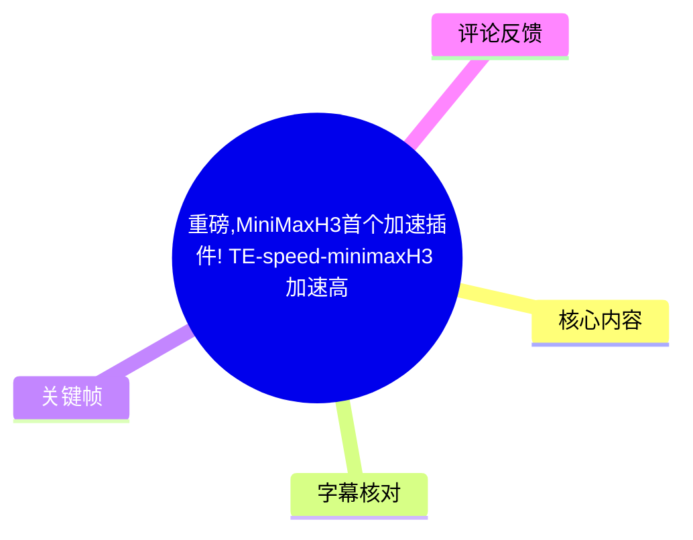
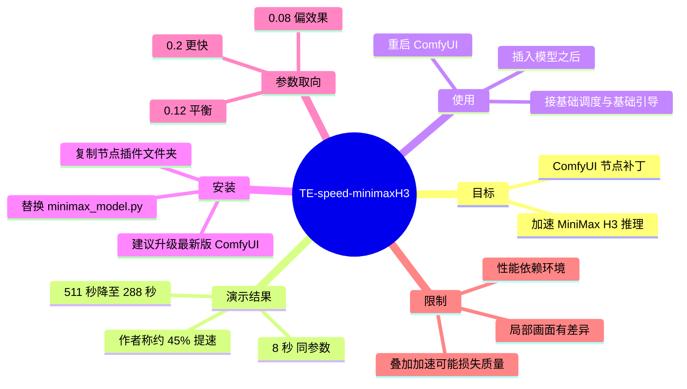
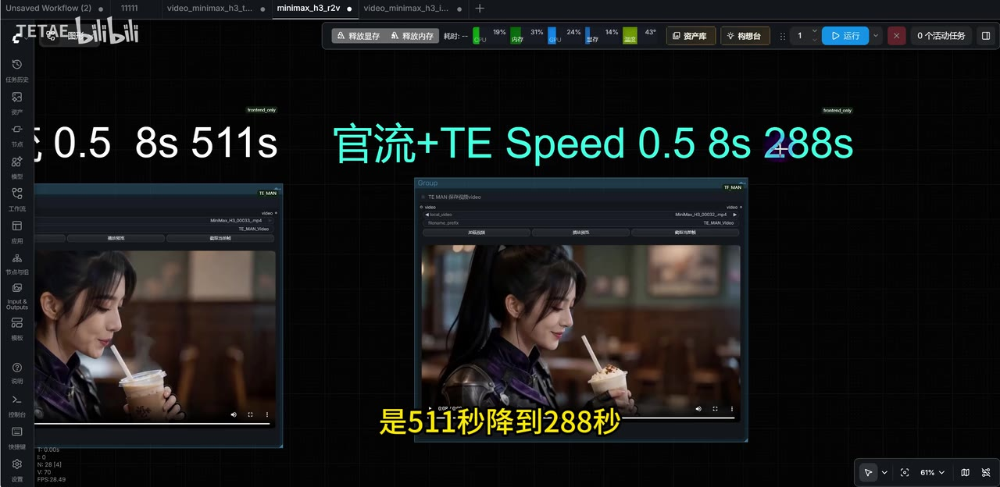
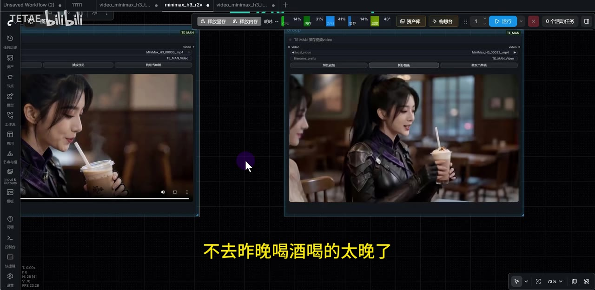
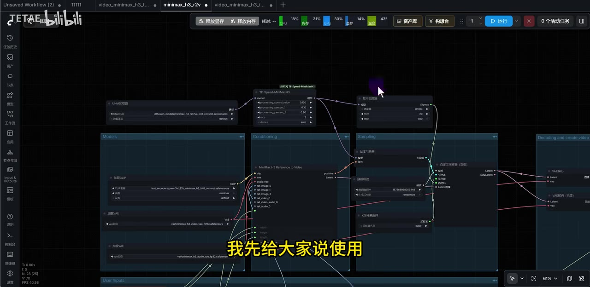
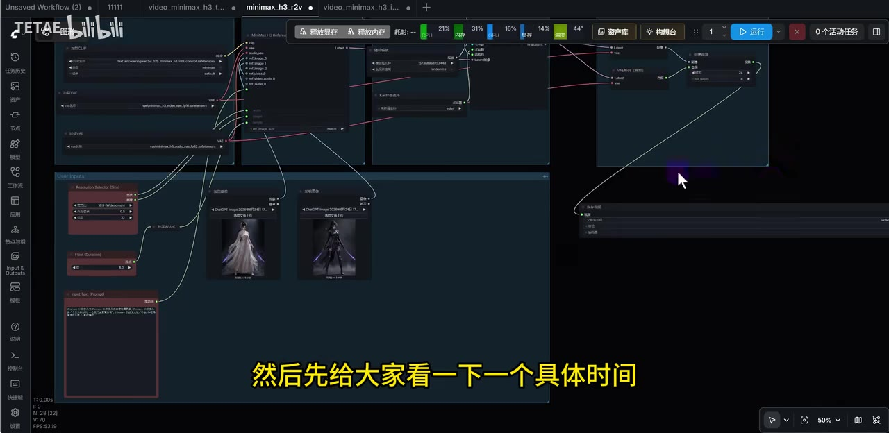

# 重磅,MiniMaxH3首个加速插件! TE-speed-minimaxH3 加速高达45%! 500s+到200s+的救赎!ComfyUI加速节点补丁.

> 来源：[Bilibili 视频](https://www.bilibili.com/video/BV1WYMR6mETN)  
> UP 主：TETAE｜发布时间：2026-08-04｜视频时长：04:08｜分辨率：2216×1080  
> 标签：AI、ComfyUI、教程、大模型、软件分享

## 小结

视频介绍了一个面向 **MiniMax H3** 的 ComfyUI 加速节点/补丁，名称为 **TE-speed-minimaxH3**。UP 主称其为社区中首个针对 H3 的加速节点，并表示经过当日下午测试，推理时间可缩短约 **45%**；该数字是作者的测试结论，不应视为所有硬件、模型和工作流下均可复现的固定结果。

视频中最直接的对照为：在同层数、参数 `0.5`、时长 `8 秒` 的条件下，画面中标示的“官流”从 **511 秒**降至 **288 秒**，约减少 223 秒、降幅约 43.6%。作者认为两份成片的动态和整体观感基本看不出差异，但也明确提到奶茶等局部存在些许不同。

使用方式是把 TE-speed-minimaxH3 节点插在 MiniMax H3 模型与后续基础调度/基础引导之间。安装涉及两项：替换 ComfyUI MiniMax 目录中的同名 `minimax_model.py` 文件，以及把节点插件文件夹复制到 ComfyUI 的节点目录，然后重启 ComfyUI。视频简介额外提示，应将 ComfyUI 更新至最新版。

节点参数方面，作者认为默认配置已调好，推荐以 **0.12** 作为速度与质量的平衡值；想进一步提速可尝试 **0.2**，更偏向效果可尝试 **0.08**。这些是作者给出的经验范围，视频没有提供全面的参数语义、版本兼容矩阵或失败回滚方案。

该内容适合已能运行 MiniMax H3 工作流、理解 ComfyUI 节点连接方式，并愿意备份文件后手动安装补丁的用户。需要注意：性能数据受显卡、显存、内存、时长、分辨率、采样设置、模型版本及是否叠加其他加速方案影响；热评中已出现叠加其他插件后噪点、提示词不遵从和一致性下降的反馈。

## 思维导图

## 目录

- [插件定位与基准演示](#插件定位与基准演示-000000)
- [成片对比与画质判断](#成片对比与画质判断-000052)
- [节点接线方法](#节点接线方法-000116)
- [安装补丁的步骤](#安装补丁的步骤-000140)
- [参数取舍与测试数据](#参数取舍与测试数据-000246)
- [结论、限制与时效性](#结论限制与时效性)
- [字幕比对](#字幕比对)
- [评论分析](#评论分析)
- [处理记录](#处理记录)

## [插件定位与基准演示](https://www.bilibili.com/video/BV1WYMR6mETN?t=0) `00:00:00`

作者开场介绍 **TE-speed-minimaxH3**，称其是针对 MiniMax H3 的加速节点，并表示自己花了一下午制作、测试。其核心主张是：在自身测试中，插件的提速“约 45% 左右”。

随后作者展示一组具体时长对比：

| 对比项 | 生成条件 | 耗时 | 视频中结论 |
| --- | --- | ---: | --- |
| 未加 TE Speed 的“官流” | 参数 `0.5`、8 秒、同层数 | 511 秒 | 基准 |
| “官流”加 TE Speed | 参数 `0.5`、8 秒、同层数 | 288 秒 | 明显加速 |
| 差值 | 同上 | 223 秒 | 耗时减少 |
| 按该组数据计算的降幅 | `(511 - 288) / 511` | 约 43.6% | 接近作者“约 45%”的说法 |

这里“官流”是视频画面和 ASR 中出现的表述；素材未给出其正式英文名称或完整工作流定义，因此不将其扩展解释为某个确定的官方项目。

> 图：画面左右明确标示“0.5 8s 511s”与“官流+TE Speed 0.5 8s 288s”，并各自展示对应视频预览。这是理解本视频核心性能主张最直接的关键帧；它同时确认了比较中可见的 `0.5`、`8s` 与两组耗时。

## [成片对比与画质判断](https://www.bilibili.com/video/BV1WYMR6mETN?t=52) `00:00:52`

作者播放两段使用相同参数生成的样片，台词内容为“今天太阳好大，一会我们去露营好吗？”、“不去，昨晚喝酒喝得太晚了，都没睡好”。作者的判断是：

- 两个成片“很相近”；
- 可从奶茶等局部细节看出“些许不同”；
- 就视频整体效果和动态而言，作者认为“基本上没有”区别，接近看不出来。

这属于基于该演示样例的主观质量评价，不能推导为所有提示词、人物、镜头运动或长视频都不存在质量损失。尤其是视频未展示逐帧差分、客观指标、不同分辨率或不同种子下的质量测试。

> 图：画面并列展示两份奶茶人物视频的不同帧。它用于说明作者并非只报运行时间，也尝试以同一题材成片比较视觉结果；画面中的人物构图和饮品细节也对应作者所说的局部细微差别。

## [节点接线方法](https://www.bilibili.com/video/BV1WYMR6mETN?t=76) `00:01:16`

作者将操作讲解置于安装说明之前。根据其说明，TE-speed-minimaxH3 的接线原则为：

1. 将加速节点直接接在 **MiniMax H3 模型之后**。
2. 在加速节点之后接入“基础调度”和“基础引导”。
3. 即，该节点作为模型输出与后续调度/引导链路之间的中间节点使用。
4. 作者称这种接法与其口述为“Seggetation”的接入方式相近；但又强调它虽然“有点类似 A-Cache”，作用方式和针对性“完全不一样”。

由于 ASR 对“Seggetation”的识别不稳定、视频未提供该名称的可核验拼写，本文保留转写原貌，不将其强行校正为其他第三方插件名称。A-Cache 也仅作为作者的类比对象，视频没有展开其机制，因此不能据此推定 TE-speed-minimaxH3 的具体缓存算法或内部实现。

> 图：关键帧展示 ComfyUI 工作流：模型加载区域的连线经过中间的 `TE-Speed-MiniMaxH3` 节点，再连接到右侧基础调度、采样等模块。该画面是判断“节点应插在哪一段”的主要视觉依据。

### 接线要点

- 不需要按视频所述去改动其余工作流数值后再获得基础加速效果。
- 视频没有展示完整工作流文件、节点下载地址、节点依赖列表或导入工作流的 JSON，因此不能仅凭本视频复原完整工作流。
- 接线前应备份现有工作流；加速节点引入后，应至少用同一提示词、同一参考图、同一时长复测速度与画质。

## [安装补丁的步骤](https://www.bilibili.com/video/BV1WYMR6mETN?t=100) `00:01:40`

作者表示会打包 T-Speed 加速补丁，并在包内附安装说明。视频口述可整理为以下顺序：

1. **获取补丁包与说明。** 作者称会把 T-Speed 加速补丁打包；视频简介写明，关注后私信发送“加速”可自动获取。
2. **替换模型文件。** 将补丁中的模型文件替换到 ComfyUI 的 MiniMax 相关目录中同名位置。ASR 能明确识别的路径片段为 `ComfyUI`、`LDM`、`minimax`，但完整路径在转写中反复失真，不能据此写成确定的本地目录。
3. **确认替换文件名。** 作者明确点名需替换 `minimax_model.py`，并称这是第一步。
4. **安装节点插件。** 将节点文件夹复制到 ComfyUI 的节点目录。
5. **重启 ComfyUI。** 重启后按前述位置将节点接入工作流。
6. **检查版本。** 视频简介提醒“记得更新 cofmyui 到最新版”；其中 `cofmyui` 为简介原文拼写，按语境指向 ComfyUI。

### 安装风险与建议

- 替换 `minimax_model.py` 属于覆盖已有文件的操作。应先备份原文件及记录版本号，以便插件不兼容、工作流报错或生成异常时回滚。
- 视频未给出补丁版本号、文件校验值、开源仓库地址、许可证、支持的 ComfyUI/MiniMax H3 精确版本范围，安装前无法仅据视频完成供应链与兼容性验证。
- “节点目录”的具体位置受 ComfyUI 安装方式与自定义节点结构影响。应以补丁包内的安装说明和实际目录结构为准，而不是把 ASR 中不完整路径当作可直接执行的命令。
- 视频没有演示错误日志、卸载步骤或冲突处理；与其他修改 attention、缓存或量化的插件混用时需单独验证。

> 图：画面展示包含模型、输入、采样和输出区域的完整 ComfyUI 工作流概貌，说明该插件是在现有 H3 工作流中插入使用，而不是独立的视频生成应用。图中可见节点连线较多，也提示用户需在自己的工作流中定位模型至调度链路。

## [参数取舍与测试数据](https://www.bilibili.com/video/BV1WYMR6mETN?t=166) `00:02:46`

作者称当前节点数值基本已调好，用户通常无需修改。对第一个参数，作者给出三档经验取向：

| 数值 | 作者给出的用途/判断 | 证据状态 |
| ---: | --- | --- |
| `0.12` | 作者认为是足够好的中间值，兼顾速度与质量 | 视频明确口述 |
| `0.2` | 若还想“再快一点”，可自行尝试 | 视频明确口述 |
| `0.08` | 若想要“效果更好一点”，可尝试 | 视频明确口述 |
| 其他节点数值 | 作者说不需要改变 | 未逐项解释 |

视频没有说明“第一个数字”的正式参数名、单位、作用机制及数值上下限。因此，上表只能作为该版本插件的调参经验，不能推定为通用质量阈值。

### 作者及群管理测试数据

作者表示，除自己测试外，也请群管理协助测试。口述中可辨识的结果如下；其中部分插件名被 ASR 转写为 “Sketention3”“T1”“Stigit”，原始素材未提供可确认拼写，故保持不确定性标注。

| 测试组合/表述 | 耗时 | 与 413 秒基准相比 | 备注 |
| --- | ---: | ---: | --- |
| 官方原版 | 413 秒 | 基准 | 作者口述 |
| “Sketention3” | 306 秒 | 少 107 秒，约快 25.9% | 名称转写不确定 |
| “T1” | 208 秒 | 少 205 秒，约快 49.6% | 名称转写不确定 |
| “注意力”方案加 “T1”（口述为“Stigit 加上 Te”） | 175 秒 | 少 238 秒，约快 57.6% | 作者称最快，组合名称不确定 |
| 5 秒测试 | 143 秒→94 秒 | 少 49 秒，约快 34.3% | 未说明完整硬件与配置 |
| 15 秒测试 | 1650 秒→约 931/930 秒 | 约少 719/720 秒，约快 43.6% | ASR 对末尾数字有轻微歧义 |

作者的归纳是：`0.12` 的速度与质量平衡已经足够好，质量“基本上没有太大影响”。但上述测试未提供显卡型号、显存、驱动、模型量化格式、分辨率、帧率、提示词、参考图、随机种子或重复次数，因而不能用作严格的跨设备性能基准。

## 结论、限制与时效性

### 可迁移的实践经验

1. **先固定变量再测加速。** 视频最有参考价值的一组对照保持了同层数、参数 `0.5` 和时长 `8 秒`，这是比较加速前后耗时和观感的基本前提。
2. **速度与画质需要共同验证。** 即使作者认为整体动态差异不大，局部细节仍可能不同。应至少检查人物脸部、手部、饮品/物件、镜头运动、提示词遵从和时间一致性。
3. **从默认值开始，小幅单变量调参。** 对视频所称第一个参数，可先保留 `0.12`，再分别试 `0.2` 与 `0.08`；一次只改变一个变量，记录耗时和样片。
4. **先备份再替换。** 该补丁要求替换模型 Python 文件，覆盖前备份是避免环境不可恢复的必要步骤。
5. **更新与兼容性应优先验证。** 作者建议更新至最新版 ComfyUI，但“最新版”是动态状态；更新可能修复兼容性，也可能改变自定义节点接口，需以实际补丁说明为准。

### 已知限制

- 约 45% 的提速是作者在特定条件下的测试结论，并非性能保证。
- 视频未给出插件源码、下载链接、版本号、依赖、许可证和哈希校验信息。
- ASR 未能可靠转写全部路径和第三方插件名称，不能据此直接执行不完整路径或认定特定技术实现。
- 视频仅以少量样片比较视觉效果，未进行系统化质量评测。
- 视频提到可与若干加速方案进行比较/组合，但没有给出足够可复现实验配置，也没有保证叠加后的稳定性。

### 时效性

该视频元数据记录的发布时间为 **2026-08-04**。ComfyUI、MiniMax H3 模型实现及第三方节点均可能持续更新；安装前应优先核对作者当时提供的补丁说明、当前 ComfyUI 节点接口与模型文件结构。视频简介中的获取方式依赖私信自动回复，是否仍可用无法由素材确认。

## 字幕比对

| 字幕来源 | 完整性 | 专有名词 | 时间轴 | 主要问题 |
| --- | --- | --- | --- | --- |
| Bilibili 站内字幕 `p01-ai-zh.srt` | 不完整，内容均为音乐标记 | 无法提供插件、参数、安装信息 | 有真实时间段，但仅覆盖零散音乐片段 | 全部可见条目均为“♪ 音乐 ♪”，无法用于正文事实整理 |
| 本次 ASR 字幕 | 较完整，诊断为 17 段、221.3 秒语音覆盖，覆盖率 89.42% | 存在明显音译/断词错误，如“Confi UI”“Seggetation”“Sketention3” | 有真实时间戳，首段 00:00:00.300，末段至 00:04:04.160 | 部分路径、节点名和测试组合名称无法可靠辨认；个别数字存在歧义 |

### 最终字幕选择与校正原则

- 本次素材的 ASR 诊断**没有** `noAudioStream=true` 标记，且识别到中文语音，说明源视频存在音轨；并非无音轨视频。
- 站内字幕已检查，但其内容仅为音乐提示，无法承载语义信息。
- 正文以**本次 ASR 的带时间戳分段**作为时间轴依据，并用已给出的关键帧核验画面中清晰可见的信息。
- 已按标题和画面统一采用 **TE-speed-minimaxH3**、**MiniMax H3**；这是由视频标题和工作流画面支持的名称。
- 对 `minimax_model.py`、`0.12`、`0.2`、`0.08`、`511 秒`、`288 秒`、`413 秒`、`175 秒` 等信息，ASR 语义较明确，予以保留。
- 对“Seggetation / Sketention3 / Stigit / T1”等无法由站内字幕或关键帧确认拼写的词，明确标注为 ASR 转写不确定，而不擅自替换为其他插件名。

## 评论分析

以下仅处理当前可获取的热评前三条。评论是用户自报测试或观点，不等同于已独立验证的事实。

### 1. 五音不全调琴师：低显存环境下的补充测试

该评论称测试环境为 **RTX 4060、8GB VRAM、40GB RAM**，生成规格为 **480p、5 秒**：

| 场景 | 无加速 | TE 加速节点默认值 | 评论者结论 |
| --- | ---: | ---: | --- |
| 文生视频 | 10 分钟 | 5 分 42 秒 | 提升明显 |
| 同提示词 + 单图参考 | 12 分钟 | 6 分 25 秒 | 提升明显 |

评论者称画面“无明显区别”，并总结提速 **43%–47%**。这与视频中约 45% 的主张方向一致，且补充了低显存 4060 设备信息，具有参考价值；但其没有给出模型版本、ComfyUI 版本、采样参数、重复次数及原始工作流，仍不能作为严格复现结论。

### 2. 靓仔李二柱：与 SOL-ATTN、NVFP4 的组合测试

该评论称同时测试了本视频插件和 GitHub 上的 SOL-ATTN，并说明 SOL-ATTN “只对 50 系显卡生效”。其自报环境为 **5070 Ti + 32GB 内存**，使用 **ING8 模型、10 秒、24 帧、480p**。评论中给出以下观察：

- 单开一个加速节点时：SOL-ATTN 为 220 秒，本视频节点为 260 秒；评论者认为 SOL-ATTN 更快、质量损失更少。
- 双开加速节点时：耗时可到 120 秒，但出现大量噪点、提示词不遵从和一致性差。
- 不开加速节点时：评论者称 NVFP4 格式模型相比 INT8 为 400 秒对 580 秒，且未见明显模糊。
- NVFP4 加双加速节点时：可在 109 秒出片，但评论者认为画面崩坏、一致性差。

这条评论的价值在于指出“可叠加提速”并不等于“可用成片”：速度收益可能伴随严重质量退化。不过，其中插件适配范围、模型格式表现和质量判断均为单一用户测试，且未展示完整日志、种子或样片，应作为风险线索而非定论。

### 3. vulne拘谨：单次重跑的耗时反馈

该评论称一段原本 **320 秒**完成的视频，在加节点、重启后再次运行仅 **183 秒**。按这组自报数据计算，减少约 137 秒，降幅约 **42.8%**，与视频及第一条热评的约 43%–47% 范围相近。

不过，该评论未提供硬件、分辨率、时长、模型版本、提示词和是否固定随机种子，无法排除缓存、环境状态或任务差异等影响。其意义主要是提供一条方向一致的使用者体验反馈。

## 处理记录

- **Worker ID**：`worker-mrj0wjed-b0c290ad`
- **模型**：`gpt-5.6-terra`
- **调用工具与素材**：视频元数据、Bilibili 站内字幕 `p01-ai-zh.srt`、音频提取结果 `audio/audio.wav`、本次 ASR 结果 `asr/asr-result.json` 与 `asr/transcript.srt`、关键帧目录 `frames/`、热评数据 `comments/comments.json`。
- **ASR 识别模型与运行信息**：`large-v3-turbo`；语言识别为中文，置信度 `0.99658203125`；CUDA 设备、`int8_float16` 计算类型；视频音频时长约 `247.48` 秒。
- **字幕选择**：已检查站内字幕与本次 ASR。站内字幕仅含音乐标记，故采用本次 ASR 的真实时间戳作为章节定位依据；对 ASR 无法确认的专名、路径和组合名保留不确定性说明，并以关键帧和视频标题校正 TE-speed-minimaxH3、MiniMax H3 等可验证名称。
- **关键帧选择依据**：选用 `frame-001` 展示整体 ComfyUI 工作流，`frame-002` 支撑 511 秒至 288 秒的直接性能对照，`frame-003` 支撑样片视觉比较，`frame-004` 支撑节点插入位置说明；未使用其余关键帧，避免在未提供画面内容说明的情况下作推断。
- **评论范围**：仅分析可获取热评前三条，未扩展到其他评论。
- **缓存清理**：素材未提供缓存清理日志或执行结果，无法确认是否已清理；本记录不虚构清理状态。
- **未解决问题**：补丁的正式下载地址、版本号、完整安装路径、源码/许可证、第三方加速方案的准确拼写、完整测试硬件与参数，以及不同版本 ComfyUI 的兼容性，均无法从当前素材中确认。
