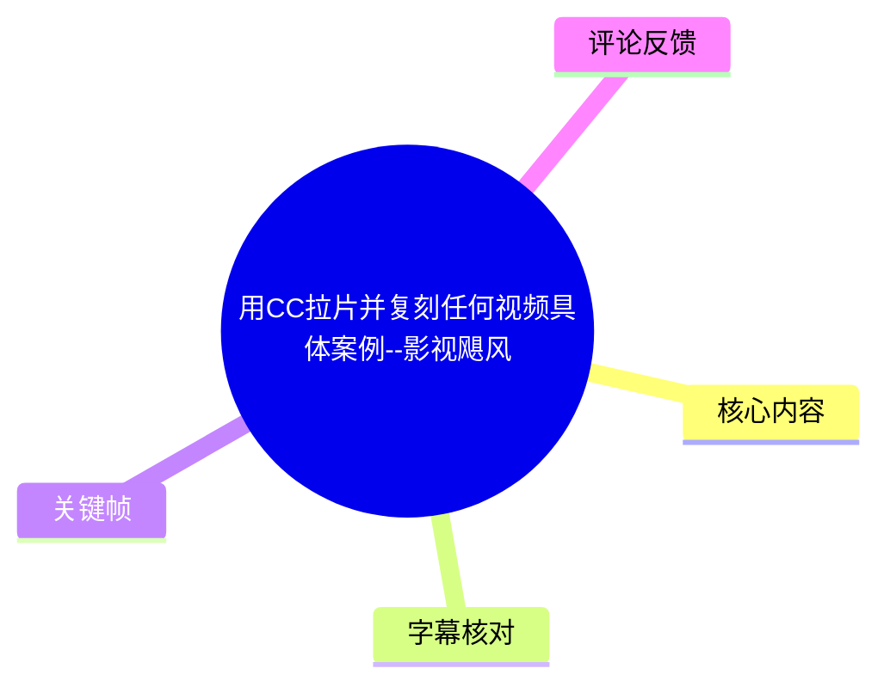
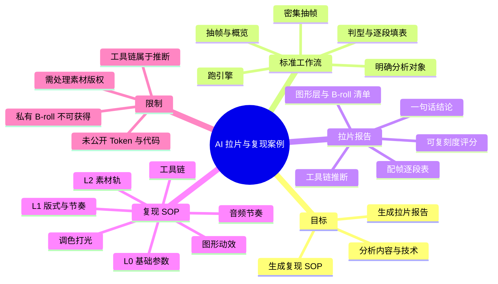
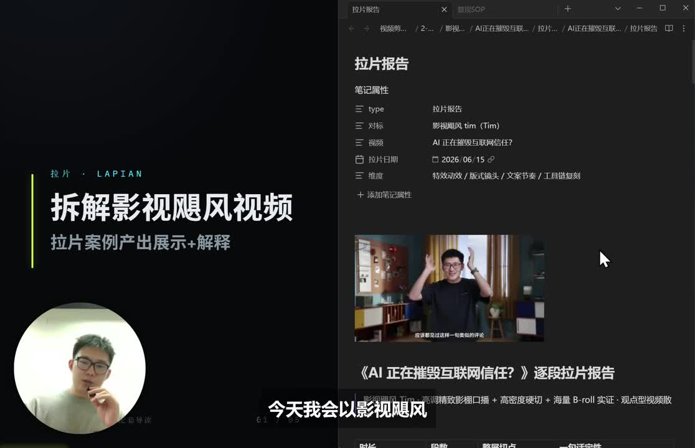
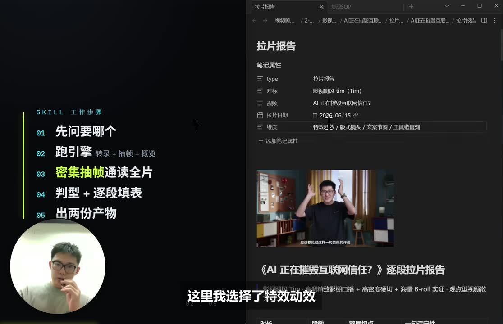
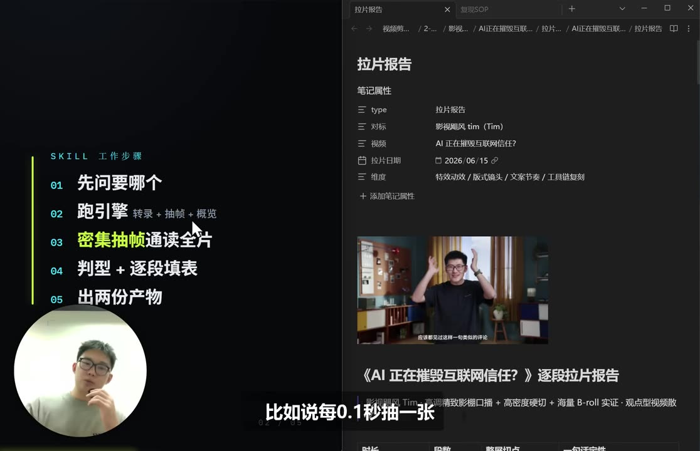
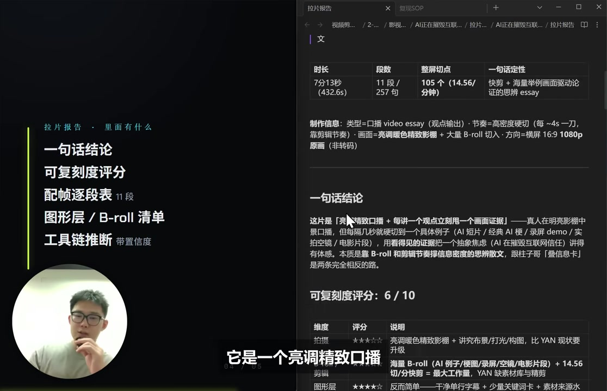

# 用CC拉片并复刻任何视频具体案例--影视飓风

> 来源：[Bilibili 视频](https://www.bilibili.com/video/BV1WPJG6oE8g)<br>
> UP 主：yan本人｜合集：AIcode｜视频时长：6 分 08 秒｜分辨率：2234 × 1440<br>
> 标签：人工智能、视频、AI、教程、影视、案例、干货、影视飓风

## 小结

视频以影视飓风 Tim 的口播视频为案例，展示作者此前分享的“拉片工作流 / 拉片 Skill”能够产出什么。其目标不是逐帧机械描述视频，而是把一个视频拆成内容结构、镜头与版式、B-roll、图形动效及可能的制作工具链，并进一步转化为可执行的复现 SOP。

工作流的关键是先明确分析问题，再运行 Skill：先以约每秒一帧的频率抽帧并让 AI Agent 识别画面连接关系；当遇到快速特效或转场时，针对局部提高到每 0.1 秒一帧。最终产出包括拉片报告、复现 SOP，以及保存抽取画面的引擎素材包。

拉片报告强调“视频是什么、为什么有效、技术上可能如何实现”。作者展示的报告包含一句话结论、可复刻度评分、按主题划分的配帧逐段表、图形层与 B-roll 清单，以及工具链推断。示例视频被概括为“亮调精致口播 + 每讲一个观点立刻给出画面证据”的观点型视频。

复现 SOP 则将报告转为执行路径：从基础视频参数、版式节奏、素材轨开始，再覆盖图形动效、调色打光、音频节奏和工具链。视频特别强调：复现不只是模仿视觉技术，也要复现“观点—证据画面”的表达节奏；同时应区分哪些部分值得学习、哪些部分不应照搬。

主要限制在于素材权属与可得性。原视频中的私有 B-roll、空镜等资产通常无法获得，因此只能使用合法可用的网络素材、自己拍摄的素材、录屏或图片作替代。视频中提及的 Claude Code、Remotion、Hyperframe、FFmpeg、PR、达芬奇、剪映等工具，是作者基于案例作出的制作链路推断或可选实现方式，不等同于已证实原视频确实使用了这些工具。

该视频发布于 2026 年；AI 工具能力、名称、价格、模型接口及可用性都可能后续变化。视频未披露单条视频的 Token 消耗、Skill 获取方式、具体提示词、代码、运行环境与版权处理方案，因此这些仍需另行确认。

## 思维导图





## 目录

- [案例背景与产出目标](#案例背景与产出目标-0000)
- [拉片 Skill 的标准工作流](#拉片-skill-的标准工作流-0045)
- [拉片报告：从视频描述到技术拆解](#拉片报告从视频描述到技术拆解-0140)
- [复现 SOP：七层执行路径](#复现-sop七层执行路径-0340)
- [实践步骤、参数与替代策略](#实践步骤参数与替代策略-0440)
- [限制、版权与时效性](#限制版权与时效性-0550)
- [字幕比对](#字幕比对)
- [评论分析](#评论分析)
- [处理记录](#处理记录)

## 案例背景与产出目标 [00:00](https://www.bilibili.com/video/BV1WPJG6oE8g?t=0)

作者说明，自己此前在网上分享过拉片工作流和拉片 Skill，并称该内容已获得“20 多万播放”。本期不再只介绍概念，而是选取影视飓风 Tim 的一条口播视频作为对象，演示实际拉片后能得到什么形式的成果。

本期展示的目标产物有三类：

1. **拉片报告**：对原视频内容结构、镜头、素材、特效和推测工具链进行分析。
2. **复现 SOP**：基于报告整理出的可执行制作路径。
3. **引擎素材包**：拉片过程抽出的画面帧会被保存到文件夹，供回看、校对和分析使用。

作者将案例中的目标视频称为影视飓风 Tim 的口播视频。画面中的报告页面标题可见为《AI 正在摧毁互联网信任？》逐段拉片报告；这应理解为**被拆解的案例视频标题**，并非本视频标题。



> 图：关键帧同时呈现“拆解影视飓风视频”的主题页与拉片报告页面，且右侧能看到案例视频画面。这张图的价值在于明确本期不是直接复刻成片，而是展示“报告 + SOP”两类分析产物。

### 视频对“复刻”的定义

作者的复刻并非只指画面风格相似，而包括两层：

- **技术层面的复现**：版式、B-roll 插入、文字卡、图形层、字幕、调色、剪辑等。
- **内容与表达层面的复现**：论点如何展开、何时抛出证据、节奏如何推进，以及观众为何会觉得表达方式接近原视频。

因此，最终 SOP 会给出“抄什么、不抄什么”的建议。这里的“抄”在视频语境中是拆解并借鉴方法；实际使用时仍应避免直接搬运原片素材、逐字复制文案或造成来源混淆。

## 拉片 Skill 的标准工作流 [00:45](https://www.bilibili.com/video/BV1WPJG6oE8g?t=45)

作者将合理的拉片标准流程概括为：先定义问题，再跑引擎抽帧与概览，必要时密集抽帧，随后判型并填写逐段表，最后输出两份核心文档。



> 图：左侧明确列出五步流程：“先问要哪个”“跑引擎：转录 + 抽帧 + 概览”“密集抽帧通读全片”“判型 + 逐段填表”“出两份产物”。它将口述流程压缩成可复用的操作清单，适合作为实际执行时的检查依据。

### 1. 先确定要分析什么

作者认为，第一步要确定“要拉视频里的什么内容”。案例中要求分析的维度包括：

- **内容与对应时间戳**：识别视频说了什么，并将内容定位到时间点。
- **特效 / 动效**：判断画面中特效如何出现、变化和退出。
- **版式与镜头**：包括口播画面、构图、画面切换和镜头组织。
- **文案与节奏**：分析观点如何表达、段落如何推进、切换是否服务于表达。
- **工具链复刻**：推测制作这一效果可能需要的工具及组合方式。

这一步的重点是避免“泛泛看视频”。例如，若关注的是动效，应优先追踪文字卡、评论卡、形状层与转场的变化；若关注的是内容结构，则需优先标出论点、证据、段落与钩子。

### 2. 跑引擎：转录、抽帧与概览

作者称运行 Skill 后会包括“转录、抽帧和概览”。其中，抽帧的默认策略是：

- **常规采样：约每秒抽取 1 张画面。**
- 将抽出的画面交由 AI Agent 进行全片分析。
- AI 根据相邻帧推测画面之间如何连接，以及镜头、素材或特效发生了什么变化。

每秒一帧适合先做全局浏览：它能较低成本地覆盖整片，并对大部分口播、静态画面、普通 B-roll 和较慢转场建立基础理解。

### 3. 对快速效果局部密集抽帧

作者指出，每秒一帧的采样率可能不足：快速特效可能在一秒内完成多个状态变化，AI 无法仅凭首尾两帧判断具体过程。因此，需要对复杂片段加密采样。

视频给出的示例参数为：

| 场景 | 抽帧策略 | 用途 |
| --- | --- | --- |
| 全片初读 | 每秒约 1 帧 | 快速建立内容、段落和镜头概览 |
| 快速特效 / 快速变化 | 每 0.1 秒约 1 帧 | 查看动画关键状态、转场路径、元素出现与消失 |
| 前 5 秒 | 倾向于更密集抽帧 | 重点判断开头钩子、信息密度和停留机制 |



> 图：画面直接展示“密集抽帧通读全片”的流程项，字幕提到“比如说每 0.1 秒抽一张”。其价值在于保留视频给出的唯一明确高频采样参数，并说明该策略面向特效复杂片段，而非默认覆盖全片。

### 4. 为什么特别关注前 5 秒

作者将前 5 秒视为影响观众是否点击、是否停留的重要区域，因此报告会倾向于在这一段抽取更多帧，分析：

- 开场说了什么；
- 采用何种画面方式呈现；
- 是否迅速抛出问题、结论或冲突；
- 是否有字幕、缩放、画面证据、评论卡或其他视觉提示帮助信息进入。

视频没有给出“前 5 秒具体抽多少帧”的固定数值；可以确认的是它比一般片段更受分析优先级关注。

## 拉片报告：从视频描述到技术拆解 [01:40](https://www.bilibili.com/video/BV1WPJG6oE8g?t=100)

作者称，拉片报告的主要作用是分析视频的**内容与技术**。报告以“先下判断、再给证据”的方式组织：先用一句话描述视频类型，再给出可复刻度、逐段表、素材和技术推断。



> 图：左侧列出报告模块“一句话结论、可复刻度评分、配帧逐段表、图形层 / B-roll 清单、工具链推断”；右侧页面可见案例制作信息、结论和“可复刻度评分：6 / 10”。它能将报告的组成与案例评分对应起来，是理解本段的核心证据画面。

### 一句话结论：识别视频表达公式

作者给出的案例结论大意是：

> 这是“亮调精致口播 + 每讲一个观点，立即甩出画面证据”的类型。

其对应的制作形式为：

- 先录制一段口播，即 **A-roll**；
- 再为不同观点补充素材作为 **B-roll**；
- 每当提出一个观点时，插入图片、空镜或视频等画面；
- B-roll 不只是装饰，而是承担“佐证观点”的任务。

作者将这种方式理解为观点型视频的表达结构：口播负责提出和串联论点，B-roll 负责把抽象论点转换为可见证据。

### 可复刻度评分：案例为 6 / 10

案例报告给出的可复刻度为 **6 分**。作者的解释是，较难复刻的关键障碍在 B-roll：

- 原案例可能使用影视飓风自身积累的私有资产；
- 外部创作者通常无法获得这些原始素材；
- 可替代的来源主要是合法可用的网络资产，以及创作者自己制作或拍摄的素材。

相对而言，作者认为以下部分更容易模仿：

- **工具链层**：可以借鉴相近的制作软件或自动化组合。
- **图形层**：案例视频未叠加大量复杂图形，主要仍是布景和实拍 / 素材画面，因而图形层的仿制难度较低。

评分是案例报告的主观判断，不是客观统一标准。它更适合作为“素材可得性比技术实现更难”的提示，而不应被视作准确工时或成功率预测。

### 配帧逐段表：按主题而非仅按时长切段

作者展示的“配帧逐段表”将整条目标视频按每句话的主题切分：若相邻几句话共同构成一个主题，就归入同一章节。作者口述的示例中：

- 第一段约为 **0—17 秒**；
- 第二段约为 **17—54 秒**；
- 之后按同一规则继续划分。

ASR 中出现“共组成了 7 分 13 秒”的说法，与本视频总时长 6 分 08 秒不一致。结合画面中报告所对应的是另一条被拆解的影视飓风案例视频，较合理的解释是：**7 分 13 秒指被分析的目标视频长度，而不是本视频时长**。这属于基于上下文的校正，视频素材未提供目标视频完整可核验时长。

每个章节在表中分析六项：

| 字段 | 用途 |
| --- | --- |
| 时间段 | 标明该段在目标视频中的起止位置 |
| 代表帧 | 用关键画面快速回忆该段视觉内容 |
| 版式 / 镜头 | 记录口播、B-roll、镜头变化及画面组织 |
| 台词 | 对应口播或文字表达 |
| 特效 / 图形层 | 记录叠加文字、卡片、图形、动效等 |
| B-roll | 说明插入了何种佐证性素材 |
| 内容作用 | 解释该段在论证、引入、转折或总结中的功能 |

需注意，作者在口述时说“六个东西”后，实际列举内容中还包括“内容作用”；画面与文字转录可能对字段计数存在压缩或遗漏。可靠的做法是以“视频明确列出的字段内容”为准，而不是机械认定数量。

### 图形层、B-roll 清单与工具链推断

报告还会拆解技术实现层：

- **B-roll 清单**：分析画面使用了什么素材，并推测可能从哪些网站或素材来源获得。
- **图形 / 特效层**：例如开头的悬浮评论卡、文字卡的出现与消失。
- **工具链推断**：从口播拍摄、素材获取、图形层生成、字幕烧录和最终剪辑五个环节反推可能工具。

作者提及的可能实现方式如下：

| 制作环节 | 视频中的推断或建议 |
| --- | --- |
| 口播录制 | 相机 + 影棚 |
| B-roll 采集 | 原作者空镜与网络素材；复现者可用网络素材、自制录屏和图片替代 |
| 图形层 | 可用 Claude Code 制作形状等元素，组成 MP4 后叠加 |
| 动效 | 可考虑 Claude Code + Remotion 或 Hyperframe |
| 字幕烧录 | Claude Code 配合 FFmpeg、Python 等 |
| 最终剪辑 | PR、达芬奇或剪映 |

以上是作者针对案例提出的**工具链推断 / 可行路径**。视频并没有提供原案例工程文件、元数据或创作者确认，因此不能据此断言影视飓风实际使用了任一特定工具。

## 复现 SOP：七层执行路径 [03:40](https://www.bilibili.com/video/BV1WPJG6oE8g?t=220)

作者说明，复现 SOP 建立在拉片报告之上，目标是提供“可执行路径”。报告回答“它是什么、怎么拆”，SOP 则回答“我应该怎样做出相近的表达与制作效果”。

视频将 SOP 分为从 **L0** 开始的多个层级。ASR 在层级终点处出现“从 L0 到 L0”的明显识别错误；随后作者实际列举了基础信息、版式节奏、素材轨、图形动效、调色打光、音频节奏与工具链推断，故可可靠记录为下列七个方向，而不额外编造其精确终止层级编号。

### L0：基础视频信息

基础层关注：

- 分辨率；
- 码率；
- 帧率。

目的不是保证画面内容完全相同，而是让复现作品在输出规格和基础质量上尽量接近原视频。视频未给出案例视频的具体码率、帧率或导出编码参数，因此不能从本素材推导出应使用的固定数值。

### L1：版式与节奏

作者用自己当前的讲解画面说明“切点密度”：

- 若持续口播、没有切换任何画面，切点密度可视为 **0**；
- 加入不同素材后，视角与画面信息会不断变化；
- 有时甚至保留同一段声音，但画面切换到户外拍摄内容或其他素材。

对于案例中的观点型口播，关键不是无目的地提高切换速度，而是在每个论点出现时及时配合一个证据画面。作者也用自己的演示方式说明：每讲一个点，屏幕会缩放或标示重点；相应的画面可能是空镜、采访片段或图片。

### L2：素材轨

素材轨关注“素材从哪里来、如何替代”。报告会推测原片的素材来源，但 SOP 的价值在于将不可获得的原素材转换成可执行替代方案：

| 原片可能素材 | 复现时的可用替代 |
| --- | --- |
| 原作者私有空镜 | 自行拍摄空镜 |
| 原作者私有拍摄素材 | 合法授权的素材库内容 |
| 演示界面 | 自己录制的屏幕操作 |
| 说明性图像 | 自制图片、公开可用图片或获得授权的图片 |
| 原视频片段 | 不直接搬运；以原创演示或获得授权的素材替换 |

### 后续层：图形、画面、声音与工具

作者口述的后续方向包括：

1. **图形动效层**：文字卡、评论卡、形状、动画出现与消失。
2. **调色打光层**：保持与案例接近的画面亮度、色彩倾向和灯光观感。
3. **音频节奏层**：使口播、切点和视听变化保持匹配。
4. **工具链推断层**：选择可完成对应环节的制作工具。

作者强调，SOP 不仅告诉创作者如何做出视觉效果，还试图让创作者在表达、内容组织和节奏上与案例形成相近感受。与此同时，SOP 最后会提出应借鉴与不应照搬的部分，避免把“形式复刻”理解为“素材和内容的原样复制”。

## 实践步骤、参数与替代策略 [04:40](https://www.bilibili.com/video/BV1WPJG6oE8g?t=280)

根据视频展示的方法，若要将该流程用于自己的项目，可按以下顺序执行。

### 步骤 1：写清楚分析任务

先明确本次拉片要回答的问题，而不是笼统要求“分析视频”：

- 内容：段落主题、论点、钩子、证据与结尾；
- 画面：口播构图、镜头变化、画面层级；
- 节奏：切点密度、何时插 B-roll、开头 5 秒的信息组织；
- 动效：卡片、文字、图形的关键状态；
- 工具：每个环节的可能实现方案；
- 替代：哪些原片素材不可用，计划以什么原创或授权素材替换。

### 步骤 2：先转录并做低频全片抽帧

对全片进行转录，并以约每秒一帧抽取画面，建立全局目录。此阶段主要输出：

- 初步时间段；
- 段落主题；
- 代表帧；
- 明显的镜头 / 版式变化；
- 需要回看的快速特效位置。

### 步骤 3：对重点片段补做密集抽帧

对以下区域提高采样密度：

- 前 5 秒；
- 字幕、评论卡、文字卡迅速出现或退出的位置；
- 转场、缩放、遮罩或复杂动效处；
- B-roll 突然切入并与口播形成对应的位置。

视频给出的参考是 **每 0.1 秒一帧**。这意味着每秒可能产生约 10 张图，因此应仅针对必要片段使用，以避免无意义地扩大分析量与计算成本。

### 步骤 4：按主题填写逐段表

不要只按固定秒数切块，应以一句或几句话是否共同服务于一个主题为依据。每段至少记录：

1. 起止时间；
2. 代表帧；
3. 口播 / 台词；
4. 版式与镜头；
5. 图形或特效；
6. B-roll；
7. 该段的内容功能。

这一步会把“我觉得这个视频做得好”变成可回溯的结构化证据。

### 步骤 5：先形成一句话公式，再定复现边界

以一句话归纳视频的“表达公式”。本案例是“亮调精致口播 + 观点后立即给画面证据”。随后区分：

- **可借鉴**：观点后补充可视证据、口播与 B-roll 的配合、镜头节奏、图形层的功能。
- **应替换**：原作者私有 B-roll、未授权片段、原文案、品牌识别元素。
- **需自行验证**：原片实际工具链、准确参数、素材来源与效果实现细节。

### 步骤 6：按层执行 SOP 并输出自己的成片

先锁定输出规格，再决定版式节奏和素材轨，最后处理图形、色彩、声音与剪辑。对本案例而言，一个可迁移的顺序是：

```text
口播录制
  -> 为每个观点列出证据画面
  -> 准备原创 / 授权 B-roll、录屏或图片
  -> 制作必要的文字卡与图形层
  -> 按观点节点插入 B-roll
  -> 处理字幕、声音、调色与最终剪辑
  -> 对照逐段表回查节奏和证据是否匹配
```

该流程是对视频所述逻辑的整理，不包含视频未公开的命令行、提示词、代码或工程配置。

## 限制、版权与时效性 [05:50](https://www.bilibili.com/video/BV1WPJG6oE8g?t=350)

### 素材可得性是复现的主要约束

作者明确指出，难点主要在 B-roll，尤其是原作者自己的私有资产。即便画面结构、文字卡或工具链可以模仿，也不能因此获得原始空镜、拍摄素材或授权权利。

因此，复现时应优先使用：

- 自己拍摄的空镜与实拍素材；
- 自己录制的屏幕演示；
- 自己制作的图表与图片；
- 已取得授权或具有明确许可范围的素材。

### 工具链属于推断，不是事实确认

视频提到 Claude Code、Remotion、Hyperframe、FFmpeg、Python、PR、达芬奇和剪映，但它们在案例中的定位是“可能如何实现”或“可能使用的工具链”。没有原工程、创作者说明或可验证制作记录时，不能将其写成原视频已确认使用的工具。

### 未披露的实施信息

本素材没有提供以下信息：

- 拉一条视频实际消耗多少 Token；
- 模型、上下文窗口、提示词与 Agent 配置；
- Skill 的获取链接、安装方式或源代码；
- 抽帧、转录和分析的实际耗时；
- 案例视频的精确编码参数；
- 图形动效的完整工程或模板；
- B-roll 的实际来源和授权状态。

评论中也有人询问 Token 消耗与 Skill 获取，进一步说明这些是观众关心、但视频尚未公开回答的问题。

### 时效性说明

本条视频元数据发布时间为 2026 年 6 月。涉及 AI Agent、Claude Code、Remotion、Hyperframe 等的功能、兼容性、成本与产品形态可能变化。本文仅记录视频中出现的说法与流程，不对这些工具在本文整理时是否仍可用作额外断言。

## 字幕比对

本次任务中**站内字幕未提供可用版本**；同时，**本次 ASR 已执行**，以下比较基于提供的字幕素材。

| 字幕来源 | 完整性 | 专有名词 | 时间轴 | 主要问题 |
| --- | --- | --- | --- | --- |
| Bilibili 站内字幕 | 未提供，无法比对完整性 | 无可用文本 | 无可用时间轴 | 站内未提供可用字幕，无法作为校对依据 |
| 本次 ASR 字幕 | 基本覆盖全片讲解内容 | 存在明显误识别或混写 | 提供的是连续文本，未附逐句时间戳 | 多处词语、层级编号和工具名识别不稳定，部分语句有重复或断裂 |

### 本文采用策略

本文以**本次 ASR 字幕为主**，并结合视频关键帧可见文字与上下文进行有限校正；未编造缺失内容，也不将推测工具链改写为已证实事实。

重点校正或保留不确定性的内容包括：

| ASR 表述 | 本文处理 | 依据 |
| --- | --- | --- |
| “拉篇”“拉片scale” | 统一表述为“拉片”“拉片 Skill” | 标题、上下文及关键帧中的“拉片报告”“SKILL 工作步骤” |
| “复兴 SOP”“复健 SOP” | 统一表述为“复现 SOP” | 视频语义为对原视频制作路径的复现 |
| “clock code” | 写作“Claude Code”，并注明属于作者推断的工具链 | ASR 发音接近；上下文与 AI 工具场景相符，但并无站内字幕可进一步核对 |
| “FNPEG” | 写作“FFmpeg” | 常见媒体处理工具名称与语义对应 |
| “Hyperframe scale” | 写作“Hyperframe” | ASR 可能将后续词汇连读；无法通过现有素材确认具体产品或版本 |
| “从 L0 到 L0” | 不强行修正终止编号，改为记录实际列出的七个方向 | 原 ASR 自相矛盾，视频未提供可验证的完整层级标签 |
| “一共组成了 7 分 13 秒” | 标注为被拆解案例视频的可能时长，不等同本视频时长 | 本视频元数据时长为 368 秒，且报告页面对应另一案例视频 |

## 评论分析

以下仅处理可获取的热评前三条。三条评论点赞数均为 0，且均为观众提问或索取资源，不能视为对工作流效果、成本或可用性的验证。

1. **苏溪青浅**：`@视频小助手 把skill发我`  
   - 观点：希望直接获得作者提到的 Skill。  
   - 反映的信息：观众对可直接复用的工具包有需求。  
   - 可信度与限制：评论没有提供 Skill 链接、来源或获取结果；视频本身也未公开具体分发方式。

2. **王者之心战斗**：`这流程下来拉一个视频花多少token啊`  
   - 观点：关注完整流程的 Token 成本。  
   - 反映的信息：密集抽帧、图像理解与 Agent 分析可能带来成本顾虑。  
   - 可信度与限制：这是提问而非数据。视频没有公布 Token 消耗、模型单价、帧数、上下文压缩策略或运行时长，因此无法据此估算实际成本。

3. **寻觅静静**：`求 skill`  
   - 观点：同样希望获得 Skill。  
   - 反映的信息：工作流的可获得性是用户的直接关注点。  
   - 可信度与限制：未附带使用反馈、链接或版本说明，不能据此判断 Skill 是否公开、是否可用或适用于何种环境。

## 处理记录

- **Worker ID**：worker-mrj0www4-e8d79408
- **模型**：gpt-5.6-terra
- **调用工具与素材**：使用任务提供的视频元数据、素材清单、ASR 文本、可获取热评前三条及关键帧路径进行整理；未提供站内字幕文件。
- **字幕选择**：站内字幕未提供可用版本；已执行本次 ASR，正文以 ASR 为主要依据，并以关键帧文字和上下文对“拉片 Skill”“复现 SOP”“Claude Code”“FFmpeg”等进行有限校正。对于无法可靠确认的层级编号和工具细节，保留不确定性说明。
- **关键帧选择依据**：
  - `frames/frame-001.jpg`：展示案例对象与“拉片报告”页面，适合说明视频目的与产物。
  - `frames/frame-002.jpg`：可见五步 Skill 工作流程，适合对应标准工作流章节。
  - `frames/frame-003.jpg`：直接呈现“密集抽帧”及“每 0.1 秒抽一张”的讲解语境，适合说明采样参数。
  - `frames/frame-004.jpg`：可见报告模块与“可复刻度评分：6 / 10”，适合说明报告结构和案例判断。
- **缓存清理**：未提供可执行的本地缓存清理工具或清理回执；本记录未声明已执行素材缓存删除。
- **未解决问题**：
  - Skill 的获取方式、代码、提示词与运行环境未提供。
  - 每条视频的 Token、时间与资金成本未披露。
  - 案例原视频实际使用的工具链、素材来源及授权信息无法由本素材确认。
  - 目标案例视频“7 分 13 秒”的时长仅来自 ASR 上下文，未获得独立元数据验证。
