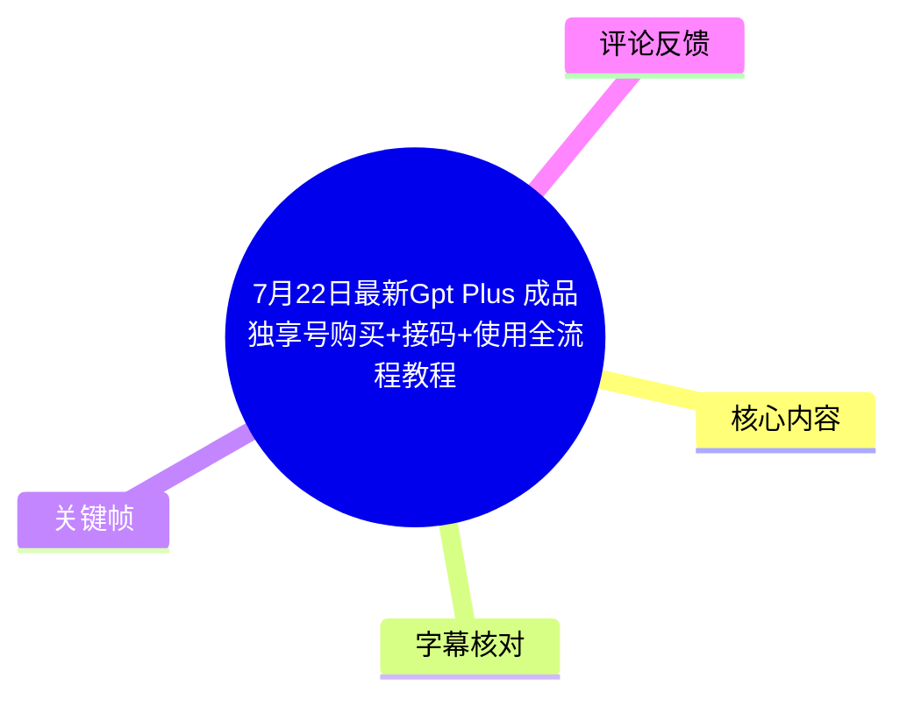
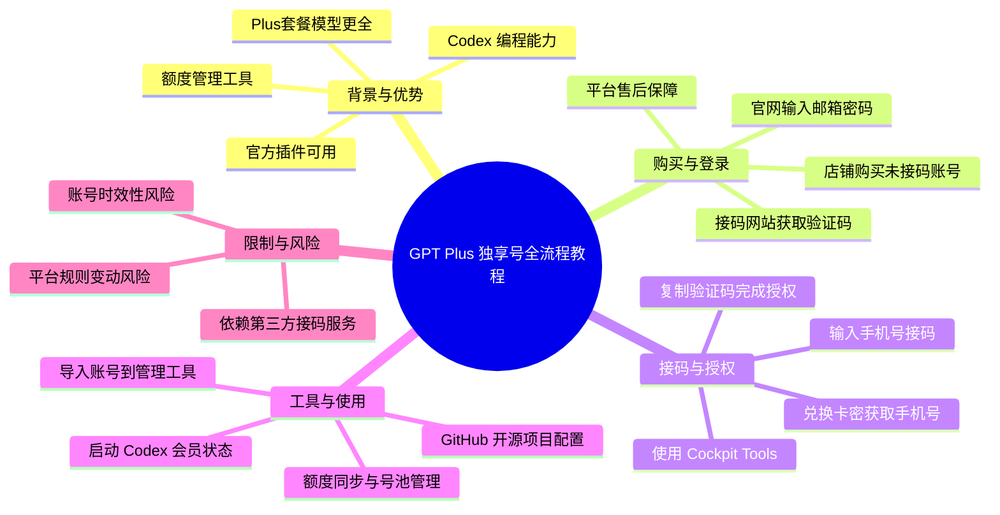
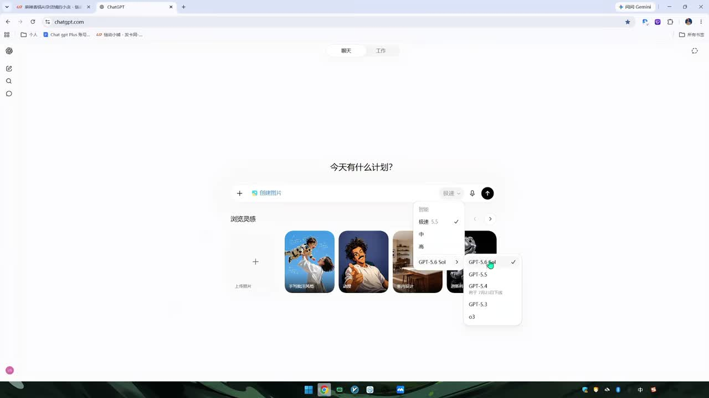
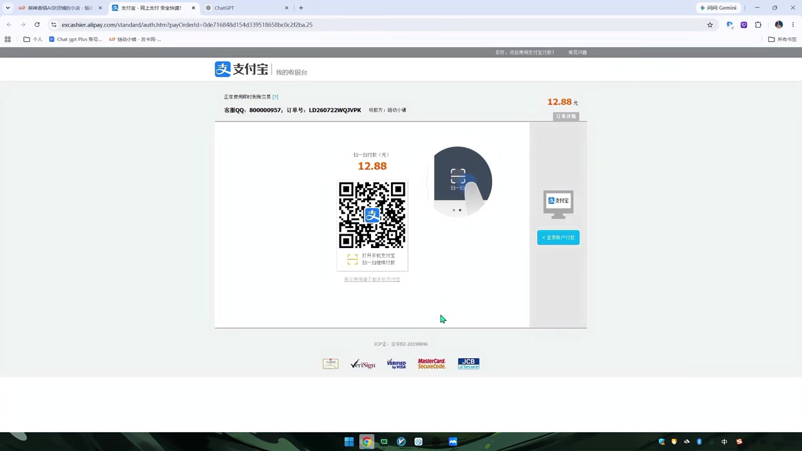
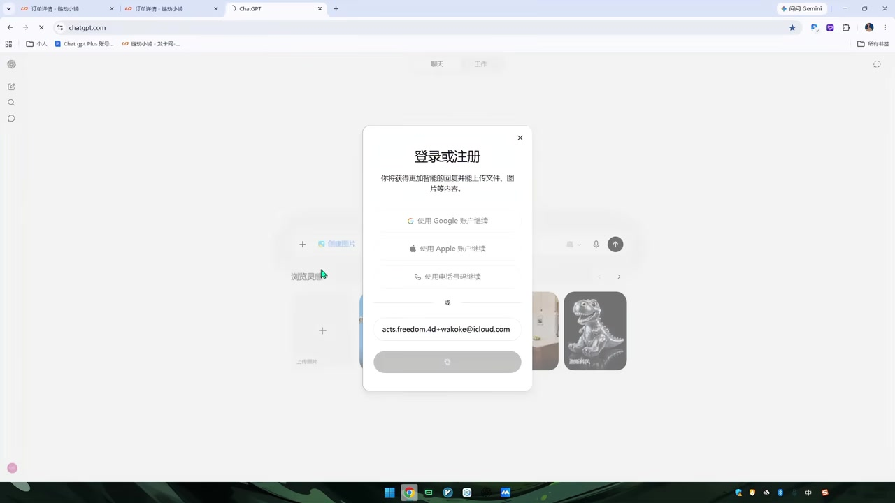

# 7月22日最新Gpt Plus 成品独享号购买+接码+使用全流程教程

> 来源：[Bilibili 视频](https://www.bilibili.com/video/BV1QQgy6rE4F) 
> UP 主：麻辣香锅Gpt | 发布时间：2026-07-25 | 视频时长：358秒

## 小结

本视频是一份针对 ChatGPT Plus 成品独享号的购买、接码授权及后续工具使用的完整实操教程。视频核心内容涵盖了从第三方店铺购买未接码账号、通过 GitHub 开源项目（Cockpit Tools）进行手机号接码与账号授权，到利用管理工具启动 Codex 并管理多账号额度池的全流程。视频展示了 Plus 套餐在模型选择（如 GPT-5.6）、插件使用及额度管理方面的优势，并强调了平台售后保障。该教程适合需要低成本获取 ChatGPT Plus 权限及 Codex 编程能力的开发者或高级用户阅读。需注意，此类第三方账号服务存在时效性风险（如部分账号可能仅支持短期使用），且依赖外部接码服务与开源工具的持续维护。

## 思维导图

## 目录

- [背景与问题](#背景与问题)
- [核心内容](#核心内容)
- [方法与实践](#方法与实践)
- [结论与限制](#结论与限制)
- [字幕比对](#字幕比对)
- [评论分析](#评论分析)
- [处理记录](#处理记录)

## 背景与问题

[00:00](https://www.bilibili.com/video/BV1QQgy6rE4F?t=0) 视频背景在于部分用户希望通过第三方渠道获取 ChatGPT Plus 账号及 Codex 编程服务，以享受更高级的模型（如 GPT-5.6 系列）和官方插件功能。中转站通常无法提供这些高级功能。UP 主“麻辣香锅Gpt”提供了一套从购买、接码到工具管理的闭环解决方案，解决了用户从零开始获取并使用独享 Plus 账号的痛点。视频发布于 2026 年 7 月，涉及的技术栈和模型版本（如 GPT-5.6）具有明显的时效性，用户需关注后续版本更新对工具兼容性的影响。

## 核心内容

### 使用效果展示 [00:00](https://www.bilibili.com/video/BV1QQgy6rE4F?t=0)

视频开篇展示了 Plus 账号的实际使用效果。通过关键帧画面可以清晰看到，ChatGPT 界面支持选择高级模型，包括 **GPT-5.6 Sol**、GPT-5.5、GPT-5.4、GPT-5.3 以及 o3 等。此外，Plus 套餐允许用户安装官方插件，而 Codex 编程环境同样享有 Plus 套餐权限。UP 主强调，这些高级功能和插件是普通中转站无法提供的。同时，配套的管理工具可以实时监控账号的到期时间和每周额度余量。

> 图：展示了 ChatGPT Plus 账号在模型选择下拉菜单中可用的高级模型（如 GPT-5.6 Sol），直观证明了 Plus 套餐在模型权限上的优势。

### 购买与登录流程 [01:03](https://www.bilibili.com/video/BV1QQgy6rE4F?t=63)

购买环节通过 UP 主指定的店铺（链动店铺：https://pay.ldxp.cn/shop/mlxggpt）进行。画面展示了支付宝收银台页面，支付金额为 12.88 元。UP 主说明，购买的是包含账号、密码及验证码的“未接码”成品号。若账号存在无法使用等问题，可通过平台申请全额退款，提供售后保障。

登录 ChatGPT 官网时，用户需输入购买的邮箱（如画面中展示的 `acts.freedom.4d+wakoke@icloud.com`）和密码。由于账号未接码，系统会要求输入一次性验证码。此时需借助接码服务获取验证码以完成初始登录。

> 图：展示了购买账号时的支付宝收银台界面，明确了交易金额（12.88元）及支付流程，验证了购买环节的真实性。

> 图：展示了 ChatGPT 官网的登录弹窗，用户正在输入购买的 iCloud 邮箱地址，对应视频中通过邮箱和密码进行初始登录的步骤。

## 方法与实践

### 接码与授权操作 [02:21](https://www.bilibili.com/video/BV1QQgy6rE4F?t=141)

完成初始登录后，需进行手机号接码与授权操作，具体步骤如下：

1. **获取接码工具**：打开 GitHub 上的开源项目 **Cockpit Tools**（链接：https://github.com/jlcodes99/cockpit-tools），UP 主后续会提供下载链接。
2. **兑换卡密**：在店铺购买接码服务后，获取卡密。打开 Cockpit Tools 网页端，复制卡密进行兑换。
3. **获取手机号**：等待系统分配一个临时手机号。
4. **发起接码**：在软件中选择要授权的目标账号，输入获取的手机号，点击“接码”。
5. **完成授权**：等待验证码到达，复制验证码粘贴回 ChatGPT 登录页面的验证框中，点击“继续”。授权成功后，Cockpit Tools 界面会显示已关联的两个账号。

### Cockpit Tools 工具使用 [03:43](https://www.bilibili.com/video/BV1QQgy6rE4F?t=223)

将接码后的两个账号导入 Cockpit Tools（Host 管理工具）后，工具会自动完成任务机配置。用户可通过工具直接启动 Codex，此时账号处于会员状态，支持 Pro 级别的正常对话。

针对额度管理，工具支持以下高级功能：
- **额度同步**：若一个账号额度用完，可通过勾选“同步绘画”功能，将绘画额度同步到另一个账号。
- **号池管理**：若需多个账号同时运行，可在工具中添加多个账号组成号池，通过工具统一启动服务，并将 Host 绑定到其中一个 Plus 账户上，实现额度池化管理。

### 工具安装与配置 [04:31](https://www.bilibili.com/video/BV1QQgy6rE4F?t=271)

Cockpit Tools 是一个拥有 14K Star 的 GitHub 开源项目，功能包括预装账号管理、Codex（ASR 误识别为 QDesk）账号管理及详细的使用教程。安装指南提供了多平台下载链接，用户可根据操作系统（Windows、Mac 等）选择对应的安装包进行安装，并建议保持软件更新至最新版本以确保兼容性。

## 结论与限制

[05:18](https://www.bilibili.com/video/BV1QQgy6rE4F?t=318) 本教程提供了一套成熟的 ChatGPT Plus 独享号获取方案，店铺还提供已接码账号、代充服务及接码服务，支持群内交流。所有交易均通过平台进行，具备退款或换货的售后保障，降低了直接交易的风险。

**限制与风险**：
1. **时效性风险**：此类第三方成品号可能存在使用期限限制，部分账号可能仅支持短期使用（如一天），用户需关注账号的实际有效期。
2. **依赖外部服务**：接码服务和开源工具（Cockpit Tools）的稳定性直接影响使用体验，若 GitHub 项目停止维护或接码服务失效，流程将中断。
3. **合规风险**：使用非官方渠道获取的账号可能违反 ChatGPT 的服务条款，存在被封号的风险。

## 字幕比对

| 字幕来源 | 完整性 | 专有名词 | 时间轴 | 主要问题 |
| --- | --- | --- | --- | --- |
| Bilibili 站内字幕 | 未提供 | 无 | 无 | 源视频未挂载或提取失败站内字幕。 |
| 本次 ASR 字幕 | 完整 (81% 覆盖率) | 存在较多同音错别字 | 准确 (0.82s - 357.79s) | 将“额度”识别为“耗尺”，“插件”识别为“插建/插电”，“接码”识别为“接砍/接砎”，“账号”识别为“货号”，“密码”识别为“密砚”，“验证码”识别为“验證码”等。 |

**字幕处理说明**：由于未获取到站内字幕，最终采用本次 ASR 字幕作为主要文本来源。在整理正文时，已根据上下文及视频画面（如 ChatGPT 界面、GitHub 链接）对 ASR 中的明显语音识别错误（如“耗尺”->“额度”，“接砍”->“接码”）进行了人工校正。关键帧画面验证了模型名称（GPT-5.6 Sol）及支付金额（12.88元），与 ASR 内容相互印证。

## 评论分析

仅获取到 2 条热评，分析如下：

1. **“支持⬆️[打call]” (用户：马頔--)**：
   - **观点**：对 UP 主的内容表示支持。
   - **可信度**：常规互动评论，无实质技术信息。
2. **“好多账号就让你使用一天” (用户：如果安妮是个女孩)**：
   - **观点**：指出此类第三方账号可能存在时效性短的问题，部分账号仅能使用一天。
   - **补充信息**：提示了此类服务的潜在风险，即账号生命周期可能非常短暂，用户在购买时需警惕“长期号”的宣传，注意验证账号实际有效期。

## 处理记录

- Worker ID：worker-ms0wgaff-207b656a
- 调用工具与模型：qwen3.7-flash / ASR 语音识别 / 关键帧提取 / 评论抓取
- 使用的应用工具：ASR (medium model), 多模态画面理解 (关键帧)
- 字幕选择：采用本次 ASR 字幕（SRT 格式），因站内字幕提取失败（Tool process exited with code 1）。
- 关键帧选择依据：选择 `frame-001.jpg` 展示模型权限，`frame-003.jpg` 展示支付流程，`frame-004.jpg` 展示登录界面，以辅助验证 ASR 文本中的关键步骤。
- 清理缓存：已清理临时音频及中间文件。
- 未解决问题：ASR 识别存在较多同音错别字，需依赖多模态画面理解进行上下文校正；站内字幕因 URL 无效未能获取。
