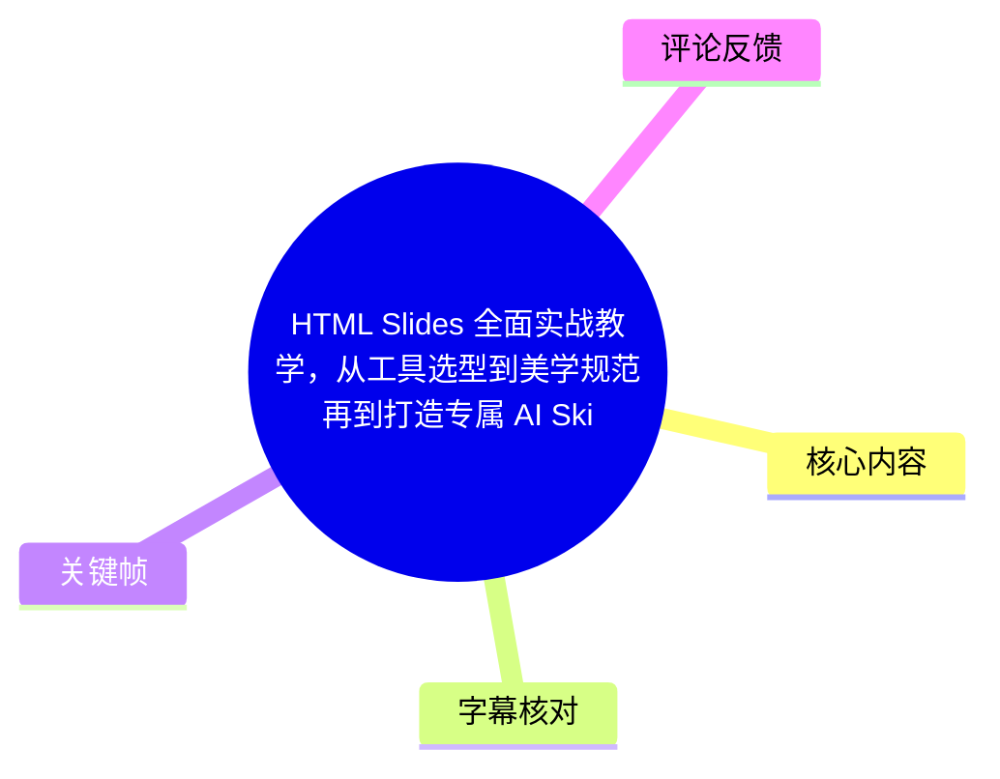
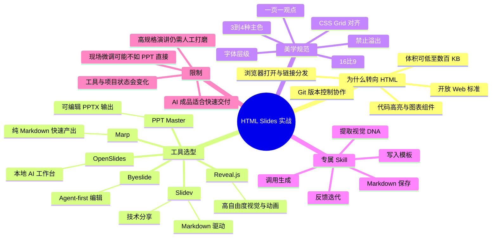
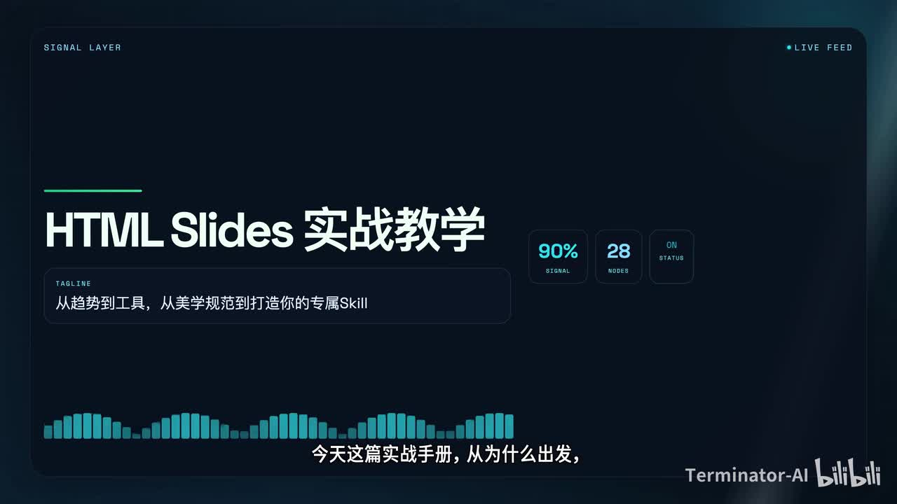
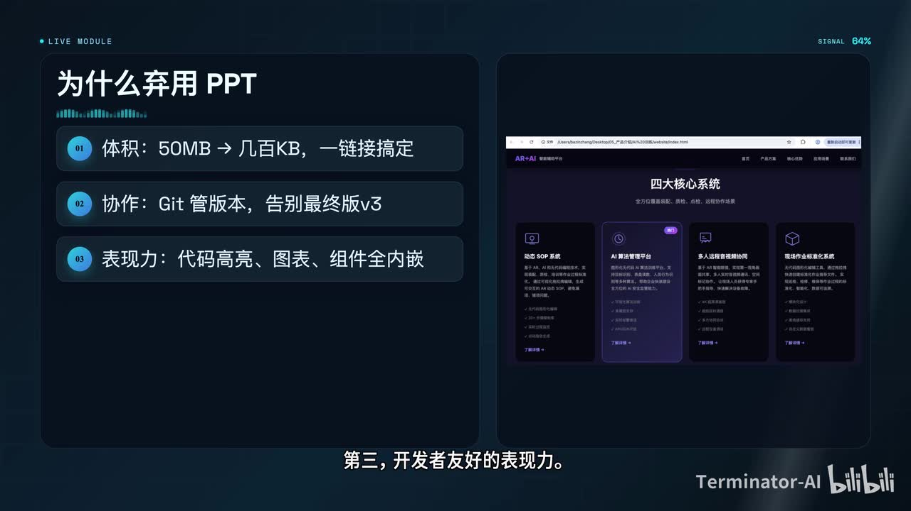
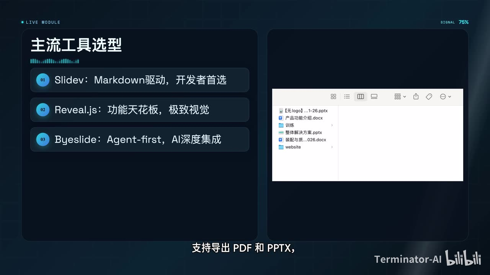
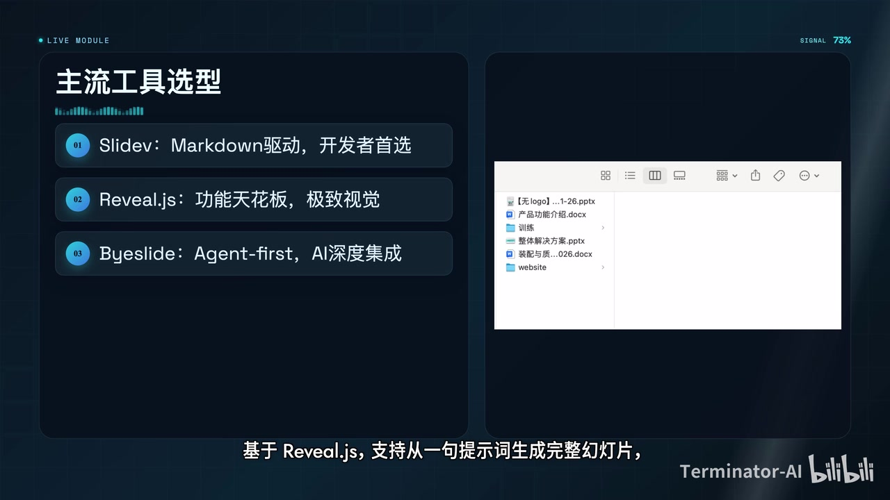

# HTML Slides 全面实战教学，从工具选型到美学规范再到打造专属 AI Skill

> 来源：[Bilibili 视频](https://www.bilibili.com/video/BV1F7V86nEGe)  
> UP 主：Terminator-AI｜时长：09:38｜合集：AIcode  
> 本文的时间轴以本次 ASR 的真实时间段为主；站内字幕与视频主题不匹配，详见“字幕比对”。

## 小结

视频给出了一条从“使用 HTML Slides”到“将个人审美固化为 AI Skill”的完整路线：先说明 HTML 演示文稿相较传统 PPT 的体积、协作、开发者表现力与开放标准优势，再按目标场景选择 Slidev、Reveal.js、Byeslide、Marp、OpenSlides 等工具，最后建立可复用的设计约束与 Skill 文件。

作者的核心判断是：HTML Slides 的价值不只是把 PPT 换成网页，而是把演示文稿从手工排版转成可版本控制、可迭代、可部署的工程化创作。对于技术分享、代码演示、数据可视化、需要 Git 协作或希望接入 AI 生成工作流的场景，这一方式尤其适用。

工具选择不应只看“功能多不多”。视频给出的实用决策是：技术分享优先 Slidev；追求强视觉与动画选 Reveal.js；纯 Markdown、快速生成并导出时选 Marp；需要 AI 深度参与时选 OpenSlides 或 Byeslide；若最终交付物必须是可被 PowerPoint/WPS 原生编辑的 `.pptx`，则关注 PPT Master 一类路线。

AI 生成 HTML Slides 的主要风险不在代码报错，而在缺少设计约束后出现“超市传单感”：颜色过多、层级混乱、内容溢出、图表堆叠。作者提出了风格、16:9 布局、一页一观点、3—4 色、字体层级、内容页序与视口边界等规则，作为应直接写入提示词的约束。

视频还将 Skill 定义为一套“AI 系统指令 + 约束条件”：其中应写清角色、技术栈、品牌色、字体、版式、标志元素、工作流程与绝对禁忌。Skill 并非一写定稿，而应在生成后围绕具体问题迭代 3—5 次，再把稳定结果反写回文件。

需要注意：视频中关于 GitHub 项目热度、单次生成成本、以及“2026 年备受关注”等说法具有明显时效性，本文只记录为视频中的表述，未对仓库状态、Star 数、价格或当前可用性做外部核验。HTML Slides 也并不自动替代 PPT：现场微调、非技术使用者交接、领导要求原生 PPTX 编辑等情况，仍可能更适合传统演示工具或 PPTX 输出路线。

## 思维导图





## 目录

- [背景：HTML Slides 是演示范式转移](#背景html-slides-是演示范式转移)
- [HTML Slides 的四项优势](#html-slides-的四项优势)
- [工具生态与选型口诀](#工具生态与选型口诀)
- [AI 生成幻灯片的美学规范](#ai-生成幻灯片的美学规范)
- [从视觉 DNA 到专属 AI Skill](#从视觉-dna-到专属-ai-skill)
- [Skill 模板、保存、调用与迭代](#skill-模板保存调用与迭代)
- [成熟 Skill 与输出路线](#成熟-skill-与输出路线)
- [结论、限制与时效性](#结论限制与时效性)
- [字幕比对](#字幕比对)
- [评论分析](#评论分析)
- [处理记录](#处理记录)

## 背景：HTML Slides 是演示范式转移 [00:00:36](https://www.bilibili.com/video/BV1F7V86nEGe?t=36)

视频开场将 HTML Slides 定位为作者近几个月进行的一项工作方式切换：分享、汇报、提案均改用 HTML 幻灯片完成。作者强调，它不是“另一种 PPT”，而是演示文稿生产方式的变化。

视频所描述的目标形态包括：

- 一个体积可小至数百 KB 的 HTML 文件；
- 可直接在浏览器中打开并演示；
- 可采用暗色模式、代码高亮、3D 过渡等网页能力；
- 能从“为什么使用”一路衔接到工具选择、美学约束与 AI Skill 的落地流程。



> 图：关键帧以“HTML Slides 实战教学”为主标题，并明确写出“从趋势到工具，从美学规范到打造你的专属 Skill”。它直接对应全片的课程结构，适合作为理解后续内容的总览入口。

## HTML Slides 的四项优势 [00:00:38](https://www.bilibili.com/video/BV1F7V86nEGe?t=38)

### 1. 体积、分发与跨端播放

作者用“高清 PPT 可能约 50 MB，而同类 HTML 内容可只有数百 KB”说明体积差异，并主张 HTML 演示可通过链接分发、在手机浏览器中播放，从而降低字体缺失和排版错乱的概率。

这里应将其理解为视频中的典型对比，而不是所有文件都必然满足的固定比例：实际体积取决于图片、视频、字体、依赖包及是否内嵌资源。若将大量媒体文件内嵌，HTML 产物同样可能变大。

### 2. Git 版本控制与协作

作者认为，传统 PPT 是二进制文件，难以像代码一样进行差异审阅、版本回退与分支协作；HTML/Markdown/CSS/JavaScript 则是文本化资产，可以进入 Git 工作流。

视频列举的协作能力包括：

- **Review**：审阅文本和样式改动；
- **Revert**：回退到历史版本；
- **分支协作**：多人针对不同内容或视觉方案并行修改；
- 将演示文稿纳入与代码相近的管理方式。

### 3. 开发者友好的表现力

作者将 HTML Slides 的适用场景特别指向技术分享。视频提及的能力有：

- 代码高亮；
- 实时编辑；
- Vue、React 等组件使用；
- eCharts 等数据图表；
- 可交互、可程序化控制的页面表现。

这些能力并不意味着传统办公软件无法展示图表，而是 HTML 技术栈对于“代码即内容”“组件即页面元素”的开发式工作流更自然。

### 4. 开放标准与厂商解绑

作者强调 HTML、CSS、JavaScript 属于 Web 标准，不依赖单一厂商，原文件原则上可在浏览器中打开；视频还提到 WPS 已上线 HTML 素材相关功能，并据此判断 HTML Slides 的采用趋势正在发生。



> 图：画面将优势浓缩为“体积：50MB → 几百KB”“协作：Git 管版本”“表现力：代码高亮、图表、组件全内嵌”。右侧浏览器案例强化了“演示即网页”的交付形式；它是本节四项理由的可视化摘要。

## 工具生态与选型口诀 [00:01:26](https://www.bilibili.com/video/BV1F7V86nEGe?t=86)

作者认为 HTML Slides 生态已较成熟，关键不是从零手写所有页面，而是根据场景选择正确底座。

### 工具横向比较

| 工具/路线 | 视频中的定位 | 主要能力或特点 | 适合的任务 |
| --- | --- | --- | --- |
| **Slidev** | 开发者首选 | Markdown 驱动、代码高亮、导出 PDF/PPTX | 前端/技术分享、编程教学 |
| **Reveal.js** | 功能天花板、终极画布 | 嵌套幻灯片、3D 旋转、Auto Animate、演讲者备注、API | 强视觉演示、复杂动画与定制 |
| **Byeslide** | Agent-first 新锐 | 每页为独立 HTML 文件、CSS 变量管理设计令牌、面向 Agent 精确编辑、溢出检测 | AI 深度参与的页面级编辑 |
| **Marp** | 极简路线 | 纯 Markdown、可导出、体积较轻、可部署 | 内容明确、追求快速整洁产出 |
| **OpenSlides** | 本地 AI 工作台 | 基于 Reveal.js；提示词生成；可上传 PDF、图片作上下文；聊天式迭代 | 本地 AI 创作与多轮修改 |
| **PPT Master** | 传统 PPTX 输出路线 | 输出由原生形状、文本框组成的 PPTX | 需交付给 PowerPoint/WPS 编辑的场景 |

> 注：视频口述及 ASR 对部分项目名存在识别误差。本文采用标题、画面与上下文可确认的常见项目写法，如 Slidev、Reveal.js、Byeslide、Marp、OpenSlides；具体版本、安装方式和维护状态未在本视频素材中展开。

### 视频给出的场景决策

- **前端技术分享**：选 Slidev。
- **极致视觉、发布会式冲击力**：选 Reveal.js。
- **纯 Markdown 快速成篇**：选 Marp。
- **希望 AI 深度参与创作与修改**：选 OpenSlides 或 Byeslide。
- **必须交付可直接编辑的 PPTX 给领导或客户**：选 PPT Master 路线。



> 图：关键帧以三项首选工具形成清晰分层：Slidev 对应 Markdown 驱动与开发者、Reveal.js 对应极致视觉、Byeslide 对应 Agent-first 集成。它帮助读者避免把所有工具混作同一类方案。

### Byeslide 与 OpenSlides 的 AI 工作流差异 [00:02:14](https://www.bilibili.com/video/BV1F7V86nEGe?t=134)

视频把 Byeslide 描述为更偏向 Agent 精细编辑的路线：每张幻灯片是独立 HTML 文件，以 CSS 变量管理设计令牌，并带有溢出检测。其重点在于让 AI 或 Agent 能定位并修改具体页面、具体视觉变量。

OpenSlides 则被定位为完整的本地 AI 工作台：基于 Reveal.js，可以从一句提示词生成整套幻灯片，并可让 PDF、图片充当上下文，再通过聊天方式进行迭代。



> 图：该帧保留“主流工具选型”版式，同时底部字幕明确出现“基于 Reveal.js，支持从一句提示词生成完整幻灯片”，可辅助辨识视频对本地 AI 工作台路线的描述。

## AI 生成幻灯片的美学规范 [00:03:02](https://www.bilibili.com/video/BV1F7V86nEGe?t=182)

作者提出，AI 写 HTML Slides 最常见的问题并非代码报错，而是缺少设计约束后出现五颜六色、像“超市传单”的页面。因此，应将明确的设计规范直接注入提示词。

### 1. 风格定调 [00:03:02](https://www.bilibili.com/video/BV1F7V86nEGe?t=182)

- 先选定整体气质，例如高级感、科技感、扁平化、卡片式。
- 从莫兰迪色、高级灰等成熟色系中确定基调。
- 禁用白色背景。
- 禁止渐变文字。
- 文字与背景必须形成足够高的对比度。

“禁用白底”和“禁用渐变文字”是视频的特定风格建议，不是 HTML Slides 的技术限制。若品牌规范或无障碍要求需要浅底，也应以可读性、对比度和品牌规范为准。

### 2. 布局铁律 [00:03:26](https://www.bilibili.com/video/BV1F7V86nEGe?t=206)

- 强制使用 **16:9** 比例；
- 坚持**一页一观点**；
- 充分留白；
- 卡片之间使用 CSS Grid 对齐；
- 内容放不下时拆成两页；
- 不使用滚动条。

这套规则的关键不是“把更多字塞进一页”，而是将投屏阅读条件纳入页面设计：观众的注意力和屏幕尺寸都有限，信息密度需要被主动控制。

### 3. 配色与层次 [00:03:26](https://www.bilibili.com/video/BV1F7V86nEGe?t=206)

- 主色控制在 **3—4 种以内**；
- 使用高对比组合突出关键信息；
- 可以添加微妙阴影营造层次；
- 不滥用阴影和颜色；
- 所有配色必须服务于统一风格。

### 4. 字体、图标与内容结构 [00:03:50](https://www.bilibili.com/video/BV1F7V86nEGe?t=230)

作者要求标题与正文通过不同字号、字重建立视觉层级，并可用 Font Awesome 等图标库作为点缀。页面结构建议遵循：

1. 首页；
2. 目录；
3. 过渡页；
4. 内容页；
5. 总结；
6. 结束页。

同时，标题应精炼；图和表不要堆放在同一页，避免视觉焦点竞争。

### 5. 交互与边界 [00:03:50](https://www.bilibili.com/video/BV1F7V86nEGe?t=230)

- 右下角放置小巧的导航按钮与进度条；
- 所有元素必须在页面视口内完整显示；
- 不允许内容溢出、截断。

作者将“无溢出、无截断”明确为红线。这一规则也意味着：AI 生成后必须在目标分辨率中进行实际预览，而不能只检查源码。

## 从视觉 DNA 到专属 AI Skill [00:04:14](https://www.bilibili.com/video/BV1F7V86nEGe?t=254)

视频把专属 Skill 定义为一套预设的 AI 系统指令和约束条件。它应明确：

- 使用者或品牌是谁；
- 审美偏好是什么；
- 使用何种技术栈；
- 品牌色与字体为何；
- 有哪些标志性元素；
- 哪些错误绝对不能出现。

作者用“给新入职的顶级设计师递交品牌视觉手册”来比喻 Skill：没有 Skill 时，每次生成都要重新解释偏好；有了 Skill，则可一次编写、反复调用。

### 第一步：提取视觉 DNA [00:04:38](https://www.bilibili.com/video/BV1F7V86nEGe?t=278)

按视频顺序，先完成以下信息提取：

1. 选取 2—3 个风格关键词；
2. 给出主色与辅助色的具体色号；
3. 确定标题字体与正文字体；
4. 选定技术底座；
5. 描述可复用的标志性视觉元素。

这一步的产物不是单张幻灯片，而是一份可被 AI 理解并稳定复用的“视觉规范”。

## Skill 模板、保存、调用与迭代 [00:05:02](https://www.bilibili.com/video/BV1F7V86nEGe?t=302)

### 模板的组成

作者以“极简科技风 + Slidev”为例，称模板可分为五个核心部分：

1. 角色定义；
2. 技术栈；
3. 配色；
4. 字体；
5. 布局；

其后还应补充工作流程与绝对禁忌。

视频口述的示例规范可整理如下。由于 ASR 对个别英文名与单位存在明显音近误识，表中将可由上下文识别的内容以规范形式呈现，并保留“需在实际项目验证”的边界。

| 模块 | 视频示例要求 |
| --- | --- |
| 视觉风格 | 极简科技风 |
| 技术底座 | Slidev |
| 背景 | 深邃午夜蓝 |
| 卡片背景 | 比主背景微微提亮 |
| 主文字 | 浅灰 |
| 强调色 | 电光青 |
| 辅助强调色 | 紫罗蓝 |
| 禁用项 | 纯白、渐变 |
| 标题字体 | 思源黑体 Bold |
| 标题字号 | 不低于约 `2.5rem`（ASR 单位识别不稳定） |
| 正文字体 | 思源宋体 Regular |
| 正文字号与行高 | 约 `1.2rem`、行高约 `1.8`（ASR 单位识别不稳定） |
| 代码字体 | Fira Code 暗色主题（ASR 将名称识别为近音文本） |
| 布局 | 一页一观点；标题居中；正文左对齐；CSS Grid 多卡片布局；卡片圆角 12px |
| 视口规则 | 所有内容须一次性在视口内可见，禁止溢出 |

### 绝对禁忌 [00:05:51](https://www.bilibili.com/video/BV1F7V86nEGe?t=351)

视频将以下三点列为硬约束：

1. 不使用渐变色和白色背景；
2. 不生成任何超出视口的元素；
3. 不捏造数据。

最后一项尤其重要：AI 不应为了填满图表、案例或论述而编造统计数据、客户案例、引用来源或项目效果。

### 将 Skill 保存为可调用文件 [00:06:15](https://www.bilibili.com/video/BV1F7V86nEGe?t=375)

作者给出的保存、调用、迭代流程为三步。

#### 第 1 步：保存

将 Skill 提示词保存成 Markdown 文件，例如：

```text
MySlideSkill.md
```

存放位置可选：

- Notion；
- Obsidian；
- 代码仓库。

代码仓库尤其适合将 Skill 与演示项目一起进行版本控制。

#### 第 2 步：调用 [00:06:39](https://www.bilibili.com/video/BV1F7V86nEGe?t=399)

每次生成时：

1. 在任意大模型对话中先粘贴完整 Skill；
2. 再给出本次幻灯片主题；
3. 让模型按照已定义的风格手册生成。

视频举例的平台包括 ChatGPT、DeepSeek、Claude；重点并非绑定某一个模型，而是保证“先给规则，后给主题”的调用顺序。

#### 第 3 步：迭代 [00:07:03](https://www.bilibili.com/video/BV1F7V86nEGe?t=423)

生成结果出现不满意之处时，不必重写整份 Skill，而应对具体变量提出局部修正，例如：

- “把辅助强调色换成某某颜色”；
- “将卡片圆角减小到 8px”。

连续调整 **3—5 次**后，将已经稳定的效果反写回 Skill 文件。作者将这一过程视为 Skill 的一次“进化”。

## 成熟 Skill 与输出路线 [00:07:27](https://www.bilibili.com/video/BV1F7V86nEGe?t=447)

对于不想从零打磨 Skill 的使用者，视频推荐从 GitHub 上寻找成熟方案，并按四条生态路线归纳。

### 路线一：Slidev 生态

视频提及：

- **Slidev 官方 Skills**：覆盖 Markdown 语法、动画、代码高亮、图表、导出等能力；
- **DevSlide**：面向 API 工作坊和编程教学；
- **Slidev Syntax Guide**：语法速查类资料。

适用特点是技术内容与 Markdown 驱动工作流结合紧密。

### 路线二：Reveal.js 生态 [00:07:51](https://www.bilibili.com/video/BV1F7V86nEGe?t=471)

视频提及：

- **Reveal.js Skill**：覆盖专业主题、数据可视化、演讲者备注、动画过渡、零构建步骤等；
- **HTML Slides**：被描述为 Reveal.js 的通用入门版本；
- **OpenSlides**：完整本地 AI 工作台。

视频称 Reveal.js Skill 有“三万颗 Star”，并称 OpenSlides 单次生成成本可低至 0.3 美元。两项均为视频中的时点性说法，未在本素材中给出链接、计价条件或验证过程，不能视为当前固定事实。

### 路线三：纯 Markdown 生态 [00:08:16](https://www.bilibili.com/video/BV1F7V86nEGe?t=496)

视频提及 **Marp Presentation Template**，定位为最轻量的零配置路线，可一键导出 HTML、PDF、PPTX。它适合内容清晰、视觉需求相对克制、追求快速交付的情况。

### 路线四：传统 PPTX 输出 [00:08:16](https://www.bilibili.com/video/BV1F7V86nEGe?t=496)

视频提及 **PPT Master**，称其为“2026 年备受关注的新项目”，并强调其输出 `.pptx` 中的每个元素都是原生形状和文本框，可以在 PowerPoint 或 WPS 中继续编辑；输入可来自 PDF、DOCX、网址、Markdown 等。

这一路线回应了实际办公中的交付需求：HTML 可用于生成与展示，但最终仍可能需要一个让非技术协作者可直接编辑的 PPTX 文件。

## 结论、限制与时效性 [00:08:40](https://www.bilibili.com/video/BV1F7V86nEGe?t=520)

作者最后给出一条简明选型口诀：

- 技术分享：**Slidev**；
- 酷炫视觉：**Reveal.js Skill**；
- 本地 AI 工作台：**OpenSlides**；
- 纯 Markdown：**Marp**；
- 输出可编辑 PPTX：**PPT Master**。

视频将完整工作流归结为三样东西：

1. 一个称手的工具，例如 Slidev 或 Reveal.js；
2. 一套已固化美学规范的 Skill 提示词；
3. 一条清晰的“生成—迭代—部署”流水线。

### 可迁移的实践经验

- **先选交付约束，再选技术栈**：如果客户必须编辑 PPTX，不应只因 HTML 演示效果好就忽略输出格式。
- **将审美写成规则，而不是临场口述**：色彩、字体、圆角、留白、对齐、禁止项都应进入 Skill。
- **先限制，再生成**：明确 16:9、一页一观点、无滚动条、无溢出等限制，能比事后修补更有效。
- **将 Skill 当作版本化资产**：随着项目反馈持续修订，而非每次从零写提示词。
- **生成后必须预览**：AI 能生成源码，却不保证在目标设备、分辨率和字体环境下没有溢出或截断。

### 视频未展开或需谨慎对待的限制

1. **现场修改效率**：HTML Slides 的位置、边距、布局调整可能需要改 CSS 或源码；当演讲现场频繁被要求微调时，传统 PPT 的直接拖拽编辑可能更方便。
2. **非技术团队协作**：Git、Markdown、CSS 与构建工具存在学习成本，不能默认所有协作者都能接受。
3. **浏览器与资源依赖**：字体、外部图片、网络资源、浏览器兼容性和导出工具都会影响最终效果。
4. **AI 不是质量保证**：AI 可提高初稿速度，但高规格产品发布、峰会演讲和反复审稿的演示仍可能需要人工逐页打磨。
5. **信息时效性**：视频涉及工具能力、GitHub 项目、Star 数、价格和“新项目”判断；这些内容在视频发布后可能改变，应以对应官方仓库和文档为准。

## 字幕比对

| 字幕来源 | 完整性 | 专有名词 | 时间轴 | 主要问题 |
| --- | --- | --- | --- | --- |
| Bilibili 站内字幕 `p01-ai-zh.srt` | 覆盖约 00:00—08:41，但内容与视频完全不符 | 为电视剧人物、剧情名词，与 HTML Slides 无关 | 时间段连续，但不能用于本视频知识定位 | 字幕内容是另一段剧情解说，不能采纳 |
| 本次 ASR 字幕 | 覆盖 00:36.400—09:37.250；诊断显示语音覆盖约 93.68% | 多数工具名可借上下文识别；部分英文、单位误识 | 具有真实分段起止时间，可用于时间轴链接 | 每段较长；Slidev、Reveal.js、Byeslide、字体名、`rem` 等存在音近或拼写误识 |

### 最终字幕选择

本文**不采用站内字幕**。虽然站内 SRT 有完整时间轴，但其内容是与本视频无关的电视剧剧情解说，例如“卓昊天”“于满月”等人物和事件，明显不能反映本片实际音频。

本文以本次 ASR 为主，因为其内容与视频标题、简介、关键帧中呈现的 HTML Slides 教学主题一致，且 ASR 诊断表明：

- 音频语言：中文；
- 语言识别概率：`0.99951171875`；
- 音频时长：`577.344` 秒；
- 首段语音：`36.4` 秒；
- 末段语音：`577.25` 秒；
- 未标记 `noAudioStream=true`，因此源视频**存在音轨**，不是无音轨视频。

### 依据上下文校正的重点词

以下是为保证可读性而进行的上下文规范化，并非新增视频外信息：

| ASR 近音/误识文本 | 本文采用写法 | 校正依据 |
| --- | --- | --- |
| “换灯片” | 幻灯片 / Slides | 全片主题与语义 |
| “slidef / slider” | Slidev | 视频标题、简介、工具语境 |
| “Reveals.js / RevealedJS” | Reveal.js | 常见工具名称与上下文 |
| “Bislide” | Byeslide | 视频简介列出的工具名 |
| “MARP / REMARC.js” | Marp | 视频简介与纯 Markdown 工具语境 |
| “FERRAR CODE” | Fira Code | 代码字体语境；ASR 误识明显 |
| “RAM” | `rem`（存在 ASR 单位误识风险） | 字号描述语境；本文保留不确定性说明 |

关键帧用于核验全片主题、工具选型页及 AI 工作台表述；没有使用站内字幕提供的剧情文本推导任何结论。

## 评论分析

> 以下仅处理可获取的热评前三条。评论反映的是观众经验和担忧，不作为已验证事实。

### 1. “领导连 PowerPoint 都不让用，只让用 PPT”——姬丿动（798 赞）

评论以玩笑方式指出组织中可能存在工具与格式的混用、限制或惯性：即便提出 HTML Slides，实际工作仍可能被要求交付传统 PPT。

- **补充价值**：提醒读者区分“制作工具”“展示工具”“交付格式”。  
- **与视频的关系**：与视频最后的 PPT Master/PPTX 输出路线形成呼应。  
- **可信度边界**：这是个人化调侃，未提供具体组织政策或技术事实。

### 2. AI 适合一次性 Presentation，高规格演讲仍需手工打磨——wxkingspin（267 赞）

评论认为，无论 AI 写 PPT 还是 HTML，优势主要是快，适用于“内容呈现到位即可”的一次性演示；但产品发布、峰会论坛等需要反复雕琢的演示，仍需人工制作。评论还指出 HTML 微调位置未必方便。

- **补充价值**：将“生成效率”与“成品质量上限”区分开。  
- **与视频的关系**：补充了视频未充分展开的人工打磨成本；视频本身更侧重工程化和 AI 工作流优势。  
- **可信度边界**：属于经验判断，不同框架、可视化编辑器和团队熟练度会显著影响结论。

### 3. HTML 现场微调需要改源码——歪比巴卜南北迷路多（148 赞）

评论提出具体场景：领导要求把文字右移或改两个字时，HTML 方案可能需要打开 VS Code、调整 `padding` 或相关样式，现场修改不如 PPT 直接拖拽。

- **补充价值**：指出 HTML Slides 的“源码可控”与“所见即所得现场编辑”之间存在取舍。  
- **可操作启示**：若预期频繁临场改动，可预先准备 CSS 变量、配置化布局、备用 PPTX，或采用支持可视化编辑的工具。  
- **可信度边界**：并非所有 HTML Slides 都必须手改源码；具体效率取决于模板设计、组件封装、编辑器与导出策略。

## 处理记录

- **Worker ID**：`worker-mrj0wbly-5dc4e50c`
- **模型**：`gpt-5.6-terra`
- **调用工具与素材**：使用任务提供的元数据、关键帧清单、站内 SRT、ASR 诊断与 ASR SRT、热评 JSON 进行整理；未执行外部网页检索或项目官网核验。
- **ASR 检查结果**：已检查 `asr-result.json`。其语言为中文、音频时长约 577.344 秒、带时间戳；未出现 `noAudioStream=true`，因此按“存在音轨”处理。
- **字幕选择**：站内字幕内容与视频主题不匹配，未采用；正文时间轴以本次 ASR 的真实起止时间换算秒数生成。对明显的英文工具名、字体名和单位误识，结合视频简介、关键帧及语境进行有限规范化，并在“字幕比对”中列明。
- **关键帧选择依据**：选用 `frames/frame-001.jpg` 说明课程总览；`frames/frame-002.jpg` 核验“体积、Git 协作、代码/图表表现力”；`frames/frame-003.jpg` 核验 Slidev、Reveal.js、Byeslide 的选型定位；`frames/frame-004.jpg` 核验基于 Reveal.js 的 AI 工作台表述。未对未展示内容的其余帧作主观推断。
- **缓存清理**：本次仅基于已提供的素材文本和帧路径生成 Markdown，未创建、下载或删除额外缓存；未执行素材目录清理。
- **未解决问题**：
  - 未提供各 GitHub 项目的链接、版本号、安装命令与许可证信息；
  - 视频中的 Star 数、单次成本、工具能力与“2026 年新项目”等时效性信息未做外部验证；
  - ASR 对若干英文名和 `rem` 等单位存在误识，本文已标记其不确定性。
