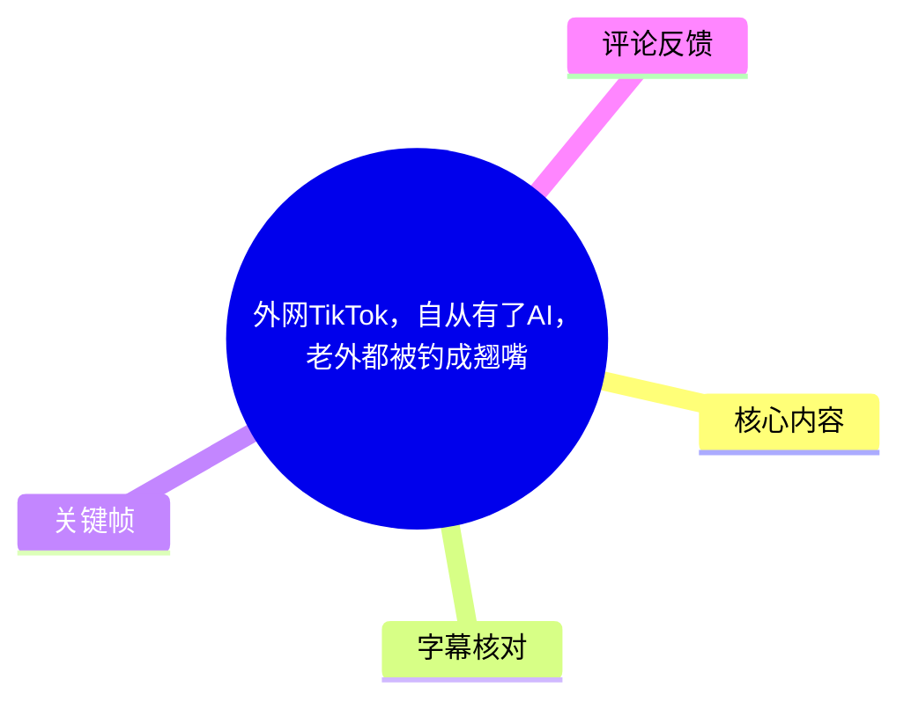
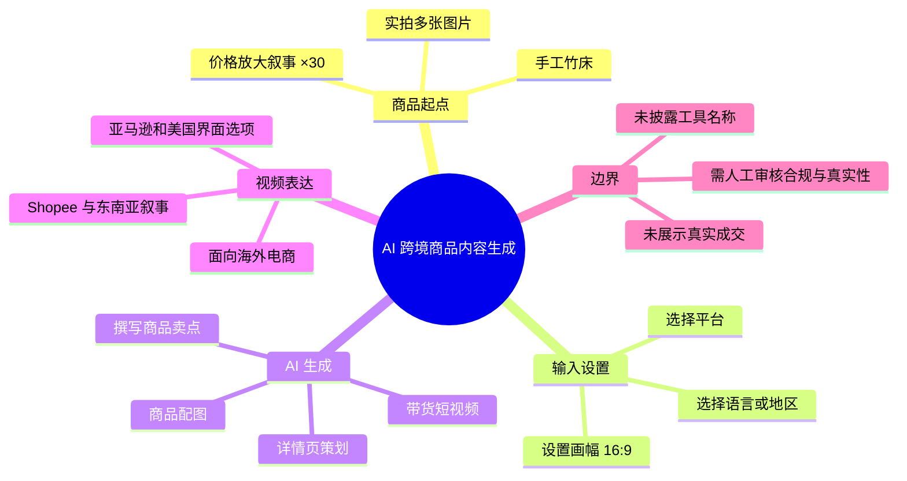
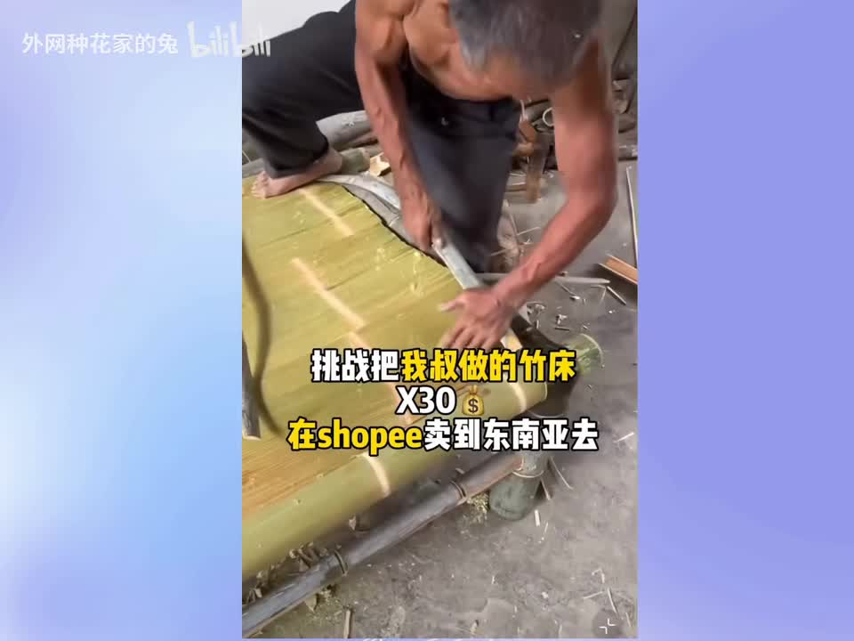
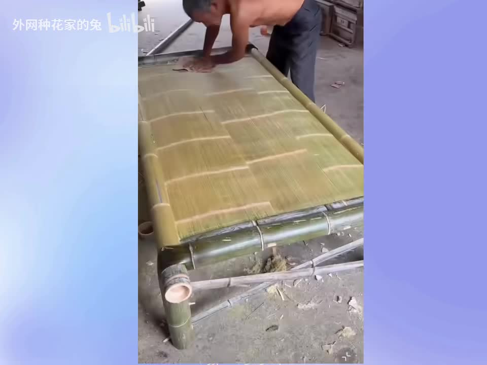

# 外网TikTok，自从有了AI，老外都被钓成翘嘴

> 来源：[Bilibili 视频](https://www.bilibili.com/video/BV1tNEy6pEHC)<br>
> UP 主：外网种花家的兔｜视频时长：48 秒｜分辨率：1440×1080

## 小结

视频以一张手工竹床为例，演示了将实拍商品素材交给一套 AI 电商内容生成界面后，快速产出跨境商品详情页与带货视频的流程。视频的叙事目标是把原本偏手工、低信息密度的商品，包装成适合海外电商销售的内容资产。

核心流程可概括为：**拍摄商品照片 → 上传图片 → 选择目标平台、语言/地区与画幅 → 由 AI 撰写卖点 → 自动生成详情页策划和配图 → 一键生成植入卖点的短剧情带货视频**。画面明确展示了“亚马逊”“美国”“16:9”等可选设置；开头字幕则提出将竹床以“×30”价格销售到东南亚、并提及 Shopee 的设想。

视频强调的是内容制作环节的自动化，而非已经证实的销售结果。它没有展示实际商品上架、物流、合规审核、投放数据、成交额或利润，因此“卖到东南亚”“把老外钓成翘嘴”均应理解为创作者的营销表达，而不能视作已验证的经营事实。

对跨境电商卖家、独立站运营人员、商品设计人员和 AI 内容制作从业者而言，视频的可迁移经验是：先保留真实商品实拍作为素材基础，再用目标市场、平台和画幅等结构化输入约束生成结果。AI 可以压缩文案、详情页和短视频初稿的制作时间，但不能替代产品真实性校验、当地语言润色、平台规则审核及供应链履约。

视频标题称“外网 TikTok”，但关键帧中可见的开头叙事字幕写有 Shopee，界面中又可见“亚马逊”“美国”等选项。素材不足以确认实际使用的是哪一个具体 AI 产品，也不能据此断言其支持范围、收费方式或最终发布渠道。内容具有明显时效性：发布于 2026 年 6 月前后，AI 工具功能、平台政策及跨境市场要求均可能变化。

## 思维导图





## 目录

- [背景：从手工竹床到海外商品内容 [00:00]](#背景从手工竹床到海外商品内容-0000)
- [操作流程：上传图片并配置生成条件 [00:00]](#操作流程上传图片并配置生成条件-0000)
- [AI 生成详情页：卖点、策划与配图 [00:12]](#ai-生成详情页卖点策划与配图-0012)
- [一键生成带货短视频 [00:34]](#一键生成带货短视频-0034)
- [可迁移方法、参数与限制 [00:00]](#可迁移方法参数与限制-0000)
- [结论与时效性 [00:34]](#结论与时效性-0034)
- [字幕比对](#字幕比对)
- [评论分析](#评论分析)
- [处理记录](#处理记录)

## 背景：从手工竹床到海外商品内容 [00:00](https://www.bilibili.com/video/BV1tNEy6pEHC?t=0)

ASR 在 00:00–00:11.240 的首句识别存在明显同音与断句错误，但结合画面上的大字信息，可较可靠地还原出视频的起点：创作者以手工制作的竹床为对象，提出“挑战把我叔做的竹床翻 30 倍再……卖到东南亚去”的设想。画面文字明确显示“挑战把我叔做的竹床 ×30 $ 在 shopee 卖到东南亚去”。

这里的“×30”是视频画面中出现的宣传性目标或定价倍率表达，**没有给出原价、目标价、币种、成本、运费或利润计算公式**。因此不能将其解释为实际售价已提升 30 倍，也不能据此推导项目可行性。



> 图：画面展示工人制作竹床，字幕提出“×30”“Shopee”“东南亚”的销售设想。该帧提供了商品原始形态与目标市场叙事，是理解后续 AI 内容生成用途的基础。



> 图：竹床完成后的实拍画面。它说明视频所说的“随手拍几张”并非纯文本生成，而是以真实商品照片作为后续生成素材的输入。

### 视频陈述与可验证边界

- **视频陈述**：手工竹床可通过 AI 包装成面向海外市场的商品内容，并以较高溢价销售。
- **画面可确认**：存在竹床制作和成品画面；存在 Shopee、东南亚与“×30”文字。
- **无法从素材确认**：店铺是否真实上线、是否确实发布至 Shopee 或 TikTok、是否有订单、用户评价、退款率、广告成本和跨境物流安排。

## 操作流程：上传图片并配置生成条件 [00:00](https://www.bilibili.com/video/BV1tNEy6pEHC?t=0)

ASR 在 00:00–00:11.240 表述：“先随手拍几张……把图片丢给它，选一下平台、语言和尺寸。”其中工具名被识别为近似“迪西丁品”，但关键帧未能清晰确认产品名称，故本文不采用该名称，也不将其与任何已知服务强行对应。

从画面和旁白可整理出以下实际操作顺序：

1. **准备商品图片**  
   对竹床进行多角度拍摄，至少形成可供系统选择的若干张实拍图。视频未说明最少张数、图片分辨率、文件格式、是否需要白底图或是否支持视频素材。

2. **上传/导入商品图片**  
   将实拍图交给 AI 内容生成界面。画面中可见两张竹床图片作为已选或待选素材，表明系统以图片作为商品识别与生成基础。

3. **选择销售平台或渠道**  
   界面“生成设置”区域可见下拉选项“亚马逊”。这说明演示工具至少在该画面中提供平台维度的模板或生成配置；但不能据此确认其还支持 Shopee、TikTok 或其他平台。

4. **选择语言或目标地区**  
   同一界面可见“美国”选项。旁白称需要选“平台、语言和尺寸”，但画面只能确认“美国”这一地区/市场选项，无法确定其与语言选项是否一一对应。

5. **设置内容尺寸**  
   画面显示画幅为 **16:9**。16:9 通常适合横向展示内容；但视频未说明它对应详情页横幅、广告素材还是带货视频，也没有展示其他比例。


> 图：界面中可见“生成设置”、平台“亚马逊”、地区“美国”及“16:9”。该帧是视频中最明确的参数证据，说明生成结果会受到目标平台/市场和画幅约束。

### 已展示参数与未披露参数

| 类别 | 素材可确认内容 | 素材未披露内容 |
| --- | --- | --- |
| 商品输入 | 竹床实拍图、多张图片选择 | 图片数量下限、格式、分辨率、是否支持抠图 |
| 平台 | 画面中出现“亚马逊” | 平台列表、各平台规则适配程度 |
| 市场/语言 | 画面中出现“美国”；旁白提到语言 | 实际输出语言、方言/本地化质量 |
| 画幅 | 16:9 | 其他比例、分辨率、帧率、时长 |
| 商品目标 | 东南亚、Shopee 出现在开头字幕 | 是否真正投放对应市场或店铺 |
| 价格 | “×30”宣传表达 | 原价、售价、币种、成本与利润 |

## AI 生成详情页：卖点、策划与配图 [00:12](https://www.bilibili.com/video/BV1tNEy6pEHC?t=12)

ASR 在 00:12.840–00:27.960 的内容为：“卖点就让 AI 写，然后想要什么图就选什么……它会自动生成详情页策划、生图，直接看成品，这效果，还有我美工什么事啊。”

这段演示将原本需要人工分工完成的商品内容工作压缩为生成链路，包含三个相连的输出层：

1. **商品卖点文案**  
   视频主张由 AI 根据商品及配置自动写卖点。画面中出现“AI 撰写”“AI 文案撰写中”字样。  
   不过，视频没有展示完整的生成文案，因而无法评估其是否准确描述竹材、承重、尺寸、耐久性或使用场景。

2. **详情页策划**  
   ASR 明确提到自动生成“详情页策划”。可将其理解为商品详情页的结构性内容规划，例如主卖点、场景、图文模块的排列；但视频没有完整展示实际详情页成品，无法确认模块数量、文本长度或是否符合电商平台审核规范。

3. **生图/商品视觉生成**  
   旁白称“想要什么图就选什么图”，并称 AI 会“生图”。这意味着用户可能通过选择希望获得的视觉类型来驱动生成。视频未展示提示词、风格选项、生成张数、图片真实性标记或人工编辑入口。


> 图：界面可见“AI 撰写”及“AI 文案撰写中”，字幕写有“卖点就让 AI 写”。该帧直接对应视频对自动生成商品卖点的主张，也提示生成过程仍可能存在等待状态。

### 对“美工被替代”说法的审慎理解

“还有我美工什么事啊”是视频的夸张式表达，反映其强调效率提升的立场，而不是对职业替代的实证结论。即使 AI 可生成初稿，以下工作仍未在视频中被证明可以省略：

- 核对生成图是否与真实竹床的材质、结构、尺寸和功能一致；
- 规避将 AI 生成效果图误当作实物承诺的风险；
- 校对目标市场的语言、计量单位、禁限售表述与商品安全声明；
- 针对平台模板、品牌调性和转化数据进行人工修改；
- 确认商品主图、详情图及广告图符合平台审核与知识产权要求。

## 一键生成带货短视频 [00:34](https://www.bilibili.com/video/BV1tNEy6pEHC?t=34)

ASR 在 00:34.800–00:42.240 表述：“产品卖点植入短期剧情，生成……这还不把老外钓成翘嘴啊。”其中“短期剧情”“生成吉项价”等词语识别不稳定；结合上下文，能够可靠确认的是：视频宣称可**一键生成带货视频**，并把商品卖点植入某种短剧情或叙事性内容中。无法确认具体视频模板名、生成指令、成片时长、配音语言或“吉项价”的实际含义。

该步骤相对于静态详情页的变化在于，商品卖点不再仅以文字和图片呈现，而是被嵌入短视频叙事。视频将此视为更容易吸引海外用户的内容形式，但并未提供完播率、点击率、转化率或销售数据支撑。

### 视频中可复用的内容生产链路

```text
真实商品制作/拍摄
        ↓
上传多张商品实拍图
        ↓
指定平台、目标市场/语言、内容画幅
        ↓
AI 输出卖点文案
        ↓
AI 生成详情页策划与配图
        ↓
将产品卖点植入短视频剧情/模板
        ↓
生成带货视频初稿
        ↓
人工核验商品真实性、语言、合规与发布配置
```

这里最后的人工核验是根据跨境商品内容发布的必要风险控制作出的整理，并非视频明确展示的操作步骤。视频仅展示到生成阶段，没有展示人工审核或正式发布。

## 可迁移方法、参数与限制 [00:00](https://www.bilibili.com/video/BV1tNEy6pEHC?t=0)

### 实操清单

若将视频方法用于真实商品内容制作，可按以下顺序执行，并将视频未覆盖的环节补齐：

1. **建立真实商品素材库**：拍摄全景、细节、尺寸参照、使用场景与包装素材；不要仅依赖 AI 生成图。
2. **明确发布目标**：在生成前确定实际平台、目标国家/地区、语言、币种、单位和内容比例。
3. **填写商品事实**：补充材质、规格、承重、适用人群、包装、产地和售后等可验证信息，避免让模型自行臆测。
4. **调用 AI 生成初稿**：生成卖点、详情页结构、场景图和视频脚本/成片。
5. **逐项审校**：将每句卖点与商品事实对照；检查图片中是否出现不存在的配件、错误结构或夸大功能。
6. **按平台规则调整**：核查主图规范、广告用语、禁限售要求、产品安全要求、版权与肖像权。
7. **小范围测试后迭代**：以真实投放或自然流量数据判断素材效果，而非以 AI 成片的视觉观感判断转化能力。

### 视频明确给出的关键参数

- 商品：手工竹床。
- 素材形式：多张实拍图片。
- 平台设置示例：亚马逊。
- 地区设置示例：美国。
- 内容比例：16:9。
- 叙事中提及的销售方向：Shopee、东南亚。
- 目标倍率文字：×30。

### 关键限制

1. **工具身份不明**：ASR 中疑似工具名的词语识别不清，画面无法证实产品名称，不能据此复现具体工具。
2. **生成质量未验证**：没有完整展示文案、详情页、生成图和带货视频的最终成品细节。
3. **经营效果未验证**：没有订单、投放、转化、履约或利润数据。
4. **平台信息存在并列而非一致关系**：标题提及 TikTok，开头字幕提及 Shopee 和东南亚，设置画面显示亚马逊与美国；它们可能分别是创作者的不同叙事或界面选项，不能合并推定为同一次真实上架路径。
5. **商品合规信息缺失**：未涉及运输体积、材质检验、产品安全、海关、税费、退货及售后问题。
6. **AI 幻觉风险未被处理**：视频没有展示对错误卖点、错误视觉细节或夸张宣传的审校机制。

## 结论与时效性 [00:34](https://www.bilibili.com/video/BV1tNEy6pEHC?t=34)

视频的实际价值不在于证明“AI 已经自动完成跨境电商”，而在于展示一种内容生产思路：以真实商品照片为锚点，用平台、市场/语言和画幅等输入约束 AI，再批量生成商品卖点、详情页素材和短视频初稿。

对于小团队或个体卖家，最具价值的环节是减少从“无内容素材”到“可编辑初稿”的时间；对于专业美工、运营和品牌团队，AI 更适合作为提效工具，而非免除审核责任的替代方案。商品事实、品牌策略、视觉一致性、目标市场本地化和发布合规仍需要人工负责。

本视频发布信息对应 2026 年 6 月前后。AI 电商工具的模型能力、可选平台、模板、价格、地区支持及平台审核规则都可能在后续改变；本文仅记录视频和所给素材中可确认的演示内容，不将其延伸为对当前工具能力或市场效果的保证。

## 字幕比对

| 字幕来源 | 完整性 | 专有名词 | 时间轴 | 主要问题 |
| --- | --- | --- | --- | --- |
| Bilibili 站内字幕 | 未提供可用字幕 | 无法评估 | 无法评估 | 素材明确说明未提供可用站内字幕，无法用于校对。 |
| 本次 ASR 字幕 | 覆盖 3 段语音，语音覆盖约 70.9% | 较弱 | 可用，含 00:00–11.240、00:12.840–27.960、00:34.800–42.240 | 存在“我书”“迪西丁品”“囿”“短期剧情”“吉项价”等明显误识别或断句问题。 |

### 最终字幕选择与校正原则

本次没有可用站内字幕，因此以 **本次 ASR 的真实时间段** 作为章节时间轴依据，并使用关键帧画面校正可见文字。ASR 结果没有标记 `noAudioStream=true`；相反，诊断显示音频时长约 47.67 秒、识别语言为中文、语音时长约 33.8 秒，因此应视为源视频存在可识别音轨，而非无音轨视频。

经关键帧校正或补充的重点信息如下：

- ASR 的“我书做的竹床”结合画面文字可理解为“我叔做的竹床”，但该人际关系仅来自画面可读字幕，未进一步验证。
- ASR 的“翻 30 倍再收屁”与画面“×30 $”“在 shopee 卖到东南亚去”不一致；本文保留为“×30 的宣传性表达”，不擅自补足具体价格含义。
- ASR 的工具名近似“迪西丁品”，画面不足以确认，本文不使用该名称。
- “选一下平台语言和尺寸”与画面中的“亚马逊”“美国”“16:9”相互支持；但“美国”究竟是语言还是地区设置，画面未完全说明。
- ASR 中“一键生成带货视频”语义清晰；后续“短期剧情”“吉项价”等不清晰部分不作扩写性还原。

## 评论分析

以下仅分析可获取的热评前三条。评论反映观众态度，不构成对视频工具能力、行业就业或商业成果的验证。

1. **海盗海鸥｜356 赞**  
   评论称：“连广告都 ai 自动生成吗，很难想以后从业人员得下岗成啥样”。  
   - 观点：将视频中的自动生成能力延伸到广告制作与就业替代焦虑。  
   - 补充价值：指出 AI 不只是生成详情页，也可能影响广告创意、文案和视频制作岗位。  
   - 可信度边界：视频演示的是内容生成，未提供从业人员替代率、岗位变化或实际广告效果数据，因此“下岗”属于情绪化推演。

2. **啦卟啦卟啦｜281 赞**  
   评论称：“还是土木好，AI代替不了打灰，代替不了坐牢”。  
   - 观点：以调侃方式对比数字内容岗位与线下体力劳动，表达部分实体工作暂不易被 AI 直接替代。  
   - 补充价值：提示讨论 AI 影响时，应区分数字化、可模板化工作与必须现场执行的工作。  
   - 可信度边界：该评论是网络玩笑，没有提供关于土木行业或 AI 自动化边界的事实论据。

3. **scp-机动特遣队｜213 赞**  
   评论称：“这个赛道终于来了竞争对手了[doge]”。  
   - 观点：认为 AI 自动化商品内容生成会加剧相关赛道的竞争。  
   - 补充价值：对应视频降低内容制作门槛的逻辑——当生成成本下降，更多卖家可能快速进入。  
   - 可信度边界：评论没有指明“赛道”具体指向，也没有数据证明竞争格局已经变化，宜视为对潜在趋势的调侃性判断。

## 处理记录

- **Worker ID**：worker-mrj0www4-e8d79408
- **整理模型**：gpt-5.6-terra
- **ASR 模型**：medium（CUDA / float16；自动识别语言为中文，语言置信度约 0.9448）
- **使用素材与工具产物**：视频元数据、音频提取产物 `audio/audio.wav`、ASR 结果 `asr/asr-result.json`、ASR SRT `asr/transcript.srt`、关键帧目录 `frames/`、热评数据 `comments/comments.json`。
- **字幕选择**：站内字幕未提供可用内容；已检查本次 ASR，采用其 SRT 的真实起止时间建立时间轴，并以关键帧可见文字修正明显误识别。未发现 `noAudioStream=true` 标记。
- **关键帧选择依据**：选用 `frame-001.jpg` 和 `frame-002.jpg` 展示竹床制作及成品实拍；选用 `frame-003.jpg` 作为平台、地区和 16:9 设置的视觉证据；选用 `frame-004.jpg` 作为 AI 撰写卖点状态的视觉证据。未将未展示内容的关键帧用于事实推断。
- **缓存清理**：提供的素材未包含缓存清理执行记录；本文不宣称已执行缓存删除。
- **未解决问题**：AI 工具名称无法从 ASR 与现有关键帧可靠确认；“×30”的具体价格含义不明；未提供完整生成成品、上架记录、成交数据、平台合规信息或实际投放效果。
