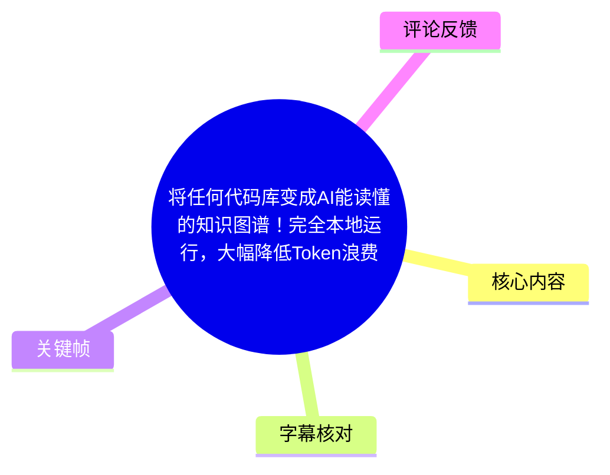
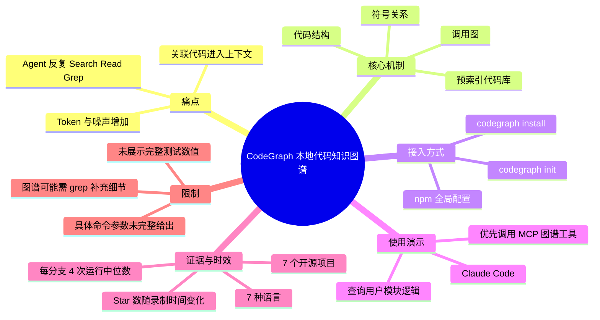
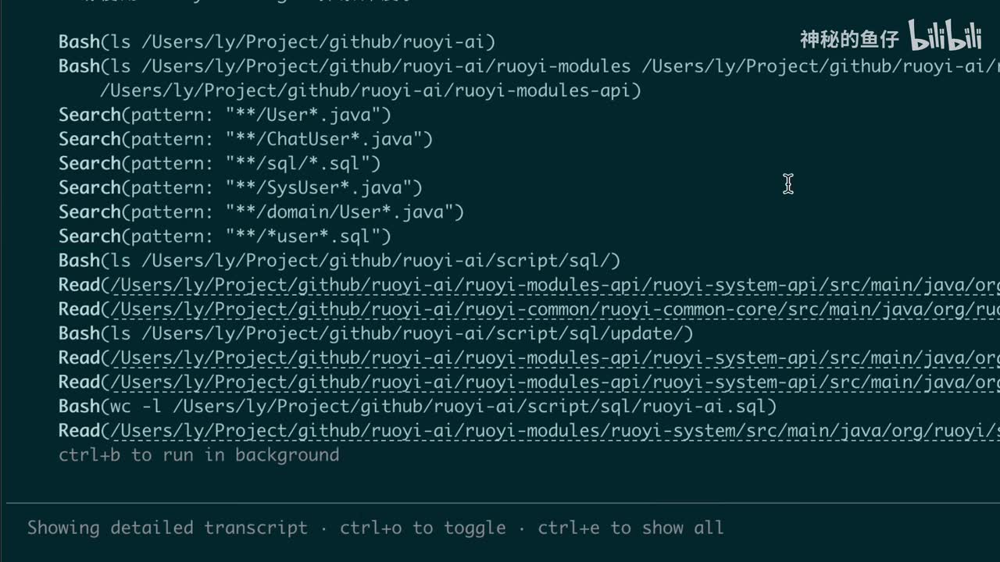
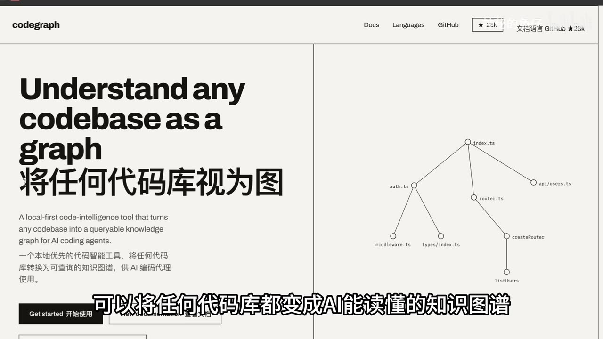
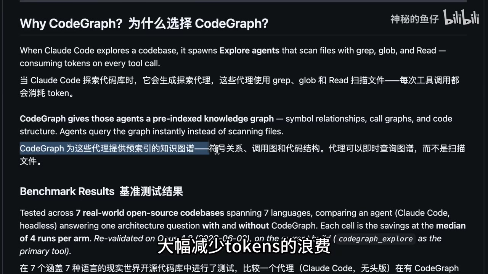
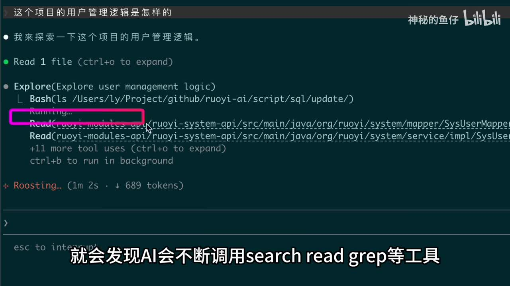

# 将任何代码库变成AI能读懂的知识图谱！完全本地运行，大幅降低Token浪费

> 来源：[Bilibili 视频](https://www.bilibili.com/video/BV1As796BEL5)  
> UP 主：神秘的鱼仔｜时长：83 秒｜合集：AIcode  
> 数据快照：抓取时视频显示 67,225 播放、8,596 收藏、4,143 点赞；这些平台数据会随时间变化。

## 小结

视频介绍开源项目 **CodeGraph**：它将本地代码库预先构建为可查询的知识图谱，供 AI 编程 Agent 使用。视频所要解决的问题是，Agent 在理解大型项目时常反复调用 `search`、`read`、`grep` 等工具，逐步搜集关联代码并塞入上下文；这会增加工具调用次数、上下文噪声与 Token 消耗。

CodeGraph 的核心思路不是让模型“直接读完整仓库”，而是向 Agent 提供已索引的符号关系、调用图和代码结构。Agent 因而可以先查询图谱定位相关内容，再在必要时读取具体文件。视频以 Claude Code 为例，展示其被询问“用户模块实现逻辑”时直接调用 CodeGraph MCP 工具，而非逐项使用 `Read` 或 `Search` 进行文件扫描。

视频给出的实践流程为三步：先通过 npm 做全局配置；再用 `codegraph install` 为本地 AI Agent 安装 MCP 配置；最后进入目标项目执行 `codegraph init` 构建知识图谱。初始化结束后，工具会展示图谱的节点数量与边数量，但视频素材未给出实际数值。

视频与画面声称该项目完全本地运行，并称其在 GitHub 获得约 **38.1k Star**；首页关键帧显示约 **28k** Star，二者存在录制时点差异，不能将其视为同一时刻的精确实时数据。基准测试部分提到 7 个真实开源代码库、7 种语言、每个实验分支取 4 次运行的中位数，但本视频未完整展示具体节省百分比或完整表格，不能据此量化实际收益。

适合接口众多、逻辑跨文件分散、需要频繁让 AI 理解模块关系的项目。它并不替代代码阅读：热评中的实际使用者也指出，模型仍会用 `grep` 补足图谱可能没有覆盖的连续代码细节；当需求描述本身模糊时，图谱定位同样可能不准确。

## 思维导图





## 目录

- [背景：代码探索的 Token 问题](#背景代码探索的-token-问题)
- [CodeGraph 的图谱查询机制](#codegraph-的图谱查询机制)
- [基准测试信息与证据边界](#基准测试信息与证据边界)
- [本地部署与初始化步骤](#本地部署与初始化步骤)
- [Claude Code 调用 MCP 的演示](#claude-code-调用-mcp-的演示)
- [卸载、适用范围与限制](#卸载适用范围与限制)
- [字幕比对](#字幕比对)
- [评论分析](#评论分析)
- [处理记录](#处理记录)

## 背景：代码探索的 Token 问题 [00:00:23](https://www.bilibili.com/video/BV1As796BEL5?t=23)

视频指出，AI 在回答“某个模块如何实现”之类的代码库问题时，通常会不断调用 `search`、`read`、`grep` 等工具，寻找所有关联代码后再把结果放入上下文。这一过程的成本不仅是工具调用本身，也包括大量文件内容和搜索结果进入模型上下文造成的 Token 消耗。

画面中可见 AI 的探索记录：先通过 `Bash` 列目录，再以多个 `Search(pattern: ...)` 搜索 `User`、`ChatUser`、SQL、`SysUser` 等关键字，之后再对多个 Java 文件执行 `Read`。这直观说明了视频所说的“逐步扫描—读取—再判断”的工作流。



> 图：画面列出多次 `Bash`、`Search` 和 `Read` 调用，展示 Agent 为理解用户相关逻辑而收集上下文的过程。它是理解 CodeGraph 试图减少何种重复工作的直接证据。

视频中的判断是：每一次工具调用都会消耗 Token。这里应区分两层含义：**工具调用及其返回内容会占用上下文**是视频的主要论点；至于某一次具体任务能节省多少 Token，则取决于仓库规模、问题类型、Agent 策略和图谱质量，视频未提供可用于复算的逐任务数据。

## CodeGraph 的图谱查询机制 [00:00:23](https://www.bilibili.com/video/BV1As796BEL5?t=23)

CodeGraph 被介绍为一个开源项目，可将任意代码库转成“AI 能读懂的知识图谱”。其网页画面将自身描述为 **local-first code-intelligence tool**，即本地优先的代码智能工具；视频标题与讲解将其定位为完全本地运行的方案。

根据视频展示的说明页，图谱至少包含以下可索引、可查询的信息：

- **符号关系（symbol relationships）**：代码中的符号及其关联；
- **调用图（call graphs）**：函数或方法间的调用关系；
- **代码结构（code structure）**：文件、模块或其他结构层级关系。

因此，AI Agent 的工作方式从“为每个问题扫描文件”转为“查询预先索引的图谱”。视频强调的是优先查询，而不是承诺从此完全不读取代码文件；后续 Claude Code 演示和评论中的使用反馈都表明，具体实现细节仍可能需要常规读取或搜索工具补充。



> 图：网页标题为“Understand any codebase as a graph / 将任何代码库视为图”，右侧用 `index.ts`、`auth.ts`、`router.ts`、`api/users.ts` 等节点展示关系网络。该画面直接呈现了“将仓库转为图谱”的产品定位与抽象形式。



> 图：页面说明 Claude Code 探索代码库时会用 `grep`、`glob`、`Read` 扫描文件；而 CodeGraph 提供预索引知识图谱，让 Agent 查询图谱而不是扫描文件。该图将问题与方案对应起来。

## 基准测试信息与证据边界 [00:00:25](https://www.bilibili.com/video/BV1As796BEL5?t=25)

视频称 CodeGraph 在 GitHub 上获得约 **38.1k Star**。但提供的首页关键帧右上角显示约 **28k**，说明这类数字受到录制、页面抓取或讲解时点影响；应仅将其理解为视频发布前后项目受关注程度的口径，不应作为实时数据引用。

基准测试部分由画面文字和 ASR 共同支持，视频披露了以下测试条件：

| 项目 | 视频展示的信息 |
| --- | --- |
| 测试对象 | 7 个真实世界开源代码库 |
| 覆盖范围 | 7 种编程语言 |
| 对比方式 | 比较 Agent 在“使用 / 不使用 CodeGraph”时回答一个架构问题的表现 |
| Agent | Claude Code，无头（headless）模式 |
| 聚合方法 | 每个实验分支运行 4 次，单元格取中位数节省值 |
| 示例项目 | ASR 提到 VSCode、Excelerate 等大型项目；ASR 专名存在识别误差，未据此扩展为完整名单 |

视频的结论性表述是，CodeGraph 可减少 Token 浪费并提高速度。然而，当前素材没有展示完整结果表、具体单位、各项目数值，也没有交代硬件、模型版本、仓库版本和问题集。因此可记录其**测试设置与作者结论**，但不能从视频推出普适的性能比例或保证所有项目均有效。

## 本地部署与初始化步骤 [00:00:30](https://www.bilibili.com/video/BV1As796BEL5?t=30)

视频按以下顺序给出使用方式：

1. **通过 npm 完成全局配置**  
   视频明确说“第一步通过 npm 完成全局配置”，但没有给出完整安装命令、包名、版本号或系统要求。为避免编造，不能擅自补写类似 `npm install -g ...` 的命令。

2. **将 CodeGraph MCP 加入本地 AI Agent**  
   视频称不需要手动编写配置文件，可使用：
   ```bash
   codegraph install
   ```
   该命令用于安装或写入 CodeGraph 的 MCP 接入配置。UP 主表示自己常用 Claude Code，因此演示只为 Claude Code 配置；素材未说明该命令是否默认识别客户端、是否需要指定客户端参数，或对其他 Agent 的完整适配流程。

3. **在目标代码库中初始化**  
   进入项目目录后执行：
   ```bash
   codegraph init
   ```
   视频说明此初始化过程会构建整个项目的知识图谱。完成后可以看到图谱包含的节点数与边数，但未展示具体数量，不能替读者预估索引规模、耗时或磁盘占用。

可将视频中可确认的最小操作序列整理为：

```bash
# 1. 先按项目文档通过 npm 完成全局配置（视频未展示确切命令）

# 2. 配置本地 AI Agent 的 CodeGraph MCP
codegraph install

# 3. 在目标项目根目录初始化图谱
codegraph init
```

### 操作边界

- 视频没有展示 npm 的精确包名、版本锁定或安装日志。
- 视频没有展示 `init` 的可选参数、支持的语言清单、失败处理或重新索引机制。
- “完全本地运行”是视频标题和项目页面定位，但素材未展示网络隔离测试、数据目录或隐私审计过程。
- 在生产仓库接入前，仍应以项目当时的官方文档确认客户端兼容性、语言支持、索引成本和数据保存位置。

## Claude Code 调用 MCP 的演示 [00:00:52](https://www.bilibili.com/video/BV1As796BEL5?t=52)

初始化之后，UP 主让 Claude Code 总结项目中“用户模块”的实现逻辑。视频称 Claude Code 会直接调用 CodeGraph 的 MCP 工具，不再像开头演示那样通过 `Read` 或 `Search` 一点一点查询完整代码。

这里的核心经验是：将“定位关系”的任务交给图谱，将“理解必要的局部实现细节”的任务留给 Agent 与原始代码。这样既能减少无目标的全仓扫描，也不会把图谱错误地当成源代码的完全替代品。

对比开头的工具记录，画面中紫色框标注了一处大量工具调用；其下方还显示 `+11 more tool uses`。这支持视频所述的传统探索在一次问题中可能带来多轮工具调用，但不等同于所有任务都必然出现同等数量的调用。



> 图：Claude Code 界面中，用户管理逻辑探索包含 `Read 1 file`、`Explore`、`Bash`、多个 `Read`，并显示“+11 more tool uses”。这张关键帧适合用于理解视频所对比的传统代码检索路径。

## 卸载、适用范围与限制 [00:01:14](https://www.bilibili.com/video/BV1As796BEL5?t=74)

视频最后表示，若不想在 Agent 中继续使用 CodeGraph，只需“一行命令”即可卸载；但没有口述或展示该卸载命令的完整文本。因此本文不补写具体命令，实际操作应以 CodeGraph 当时的官方文档或命令行帮助为准。

### 可迁移的使用经验

- 对跨模块、跨接口、调用关系复杂的任务，先利用图谱缩小检索范围，再读局部代码，可能比直接全仓检索更高效。
- 初始化是使用前置步骤：图谱的价值依赖于仓库已被索引，因而应把初始化成本、仓库更新后的图谱新鲜度纳入评估。
- 提问仍需明确。若只给出模糊的功能描述，工具无法准确判断需要向下追踪哪些关系，图谱和普通检索都会受影响。

### 视频未验证或未展开的事项

1. 未展示不同语言、不同仓库规模下的初始化时间与资源占用。
2. 未展示代码变更后图谱的增量更新机制、准确率或失效行为。
3. 未展示完整的 MCP 配置文件内容，无法验证配置细节。
4. 未提供基准测试完整结果，无法量化“Token 节省”与“速度提高”。
5. GitHub Star、CLI 命令、支持的 Agent 与语言均具有时效性，应以使用时项目文档为准。

## 字幕比对

站内未提供可用字幕，因此已检查并采用本次 ASR 作为时间轴的主要依据，同时以关键帧中的英文页面文字、终端界面和上下文对专有名词进行校正。

| 字幕来源 | 完整性 | 专有名词 | 时间轴 | 主要问题 |
| --- | --- | --- | --- | --- |
| Bilibili 站内字幕 | 未提供 | 无法核验 | 无法使用 | 素材明确标注“未提供可用站内字幕”。 |
| 本次 ASR 字幕 | 覆盖约 57.23 秒语音；识别从 23.29 秒开始，至 81.86 秒结束 | 多处误识别，如 `toggs`、`AI Agency`、`cloud code`、`Viscode`、`Excelerate` | `asr-result.json` 的分段时间与 83 秒视频时长一致；SRT 第 4、5 段结束时间却延伸至 74.22、81.86 秒之后的 01:14、01:21，存在累积时间偏移 | 单段文本过长、断句不足、夹杂乱码；SRT 时长与 JSON 分段不一致。 |

### 最终字幕与时间轴选择

- **采用依据**：优先采用 `asr/asr-result.json` 中的起止时间，而不是有明显错位的 SRT 显示时间。
- **时间段**：23.29–25.13 秒为痛点和 CodeGraph 介绍；25.13–28.78 秒为 Star 与测试引入；30.12–52.08 秒为安装流程；52.08–74.22 秒为初始化与 Claude Code 演示；74.22–81.86 秒为卸载与结束语。
- **校正词语**：根据页面和视频标题，将 ASR 的“Codegraph”统一记为 **CodeGraph**；“cloud code”校正为 **Claude Code**；“toggs”按上下文校正为 **Token / tokens**；“AI Agency”按上下文记为 AI Agent，但原始 ASR 并不稳定。
- **不可校正内容**：ASR 所称的部分测试项目名无法仅凭当前素材完全确认拼写，故仅记录为“ASR 提及”，不扩展为确定的项目清单。
- **音轨状态**：ASR 诊断未标记 `noAudioStream=true`，且给出了中文语音段落、语言概率 1，因此源视频具备可识别音轨；这不是无音轨视频。

## 评论分析

仅处理当前可获取的热评前三条。评论是用户体验或提问，不构成对工具性能的独立验证。

| 热评 | 观点与补充 | 可信度与争议 |
| --- | --- | --- |
| 开心鲁鲁（124 赞）：“上周试试了，感觉用处不大，agent 和模型已经很强了” | 提出反向体验：当 Agent 与模型本身已足够强时，额外图谱工具未必带来可感知收益。 | 这是单一项目、单一任务和未说明版本配置的个人体验；可作为“并非普适增益”的提醒，无法推翻或验证视频的测试结论。 |
| anweat（98 赞）：“目前用了2周……接口比较多、逻辑散落的项目里非常好用……” | 提供两周使用反馈：工具像“批量、无需编写条件的 grep”，可减少模型工具调用、上下文噪声；同时称模型仍会用 `grep` 获得图谱可能缺少的连续代码信息。 | 与视频的定位高度一致，并补充了适用条件和混合使用方式；但仍是未附项目数据的个人经验。“革命性”等表述应视为主观评价。 |
| 你怎么还不睡觉-\_-（90 赞）：“可以看到生成的图谱不，感觉这玩给人看比给ai看更有用” | 关心图谱是否可视化、是否也适合人类开发者理解项目。 | 视频展示的是网页关系示意图和节点/边统计，但未展示针对目标仓库的交互式图谱可视化界面，无法据此确认可视化能力或人类阅读体验。 |

## 处理记录

- Worker ID：`worker-mrj0wbly-5dc4e50c`
- 模型：`gpt-5.6-terra`
- 素材与工具结果：读取任务元数据、视频信息、关键帧清单与图像、站内字幕状态、`asr/asr-result.json`、ASR SRT、热评前三条。
- 字幕选择：站内无可用字幕；检查本次 ASR 后，以 `asr-result.json` 的真实分段时间作为时间轴依据。由于 SRT 的后两段时间与 JSON、视频总时长存在错位，未直接使用其显示的 01:14/01:21 分段端点。
- 关键帧选择依据：
  - `frames/frame-001.jpg`：展示用户逻辑探索中的多次工具调用；
  - `frames/frame-002.jpg`：展示连续 `Bash`、`Search`、`Read` 的传统扫描流程；
  - `frames/frame-003.jpg`：展示 CodeGraph“将代码库视为图”的主页定位与关系图；
  - `frames/frame-004.jpg`：展示图谱预索引与文件扫描的文字对比、测试方法说明。
- 缓存清理：本任务提供的素材清单未包含可执行的缓存清理日志或结果；未据此虚构已清理状态。
- 未解决问题：
  - 未提供 CodeGraph 的精确 npm 安装命令、卸载命令和完整 MCP 配置；
  - 未提供完整基准测试表格与可复算指标；
  - ASR 对部分专有项目名存在误识别；
  - 关键帧未附逐帧精确时间戳，正文时间轴仅依据 ASR 分段。
