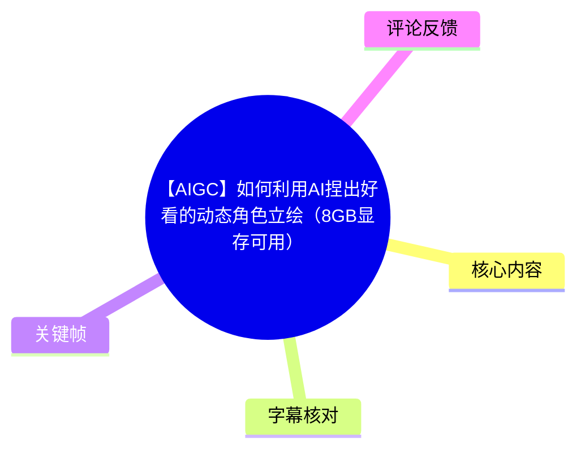
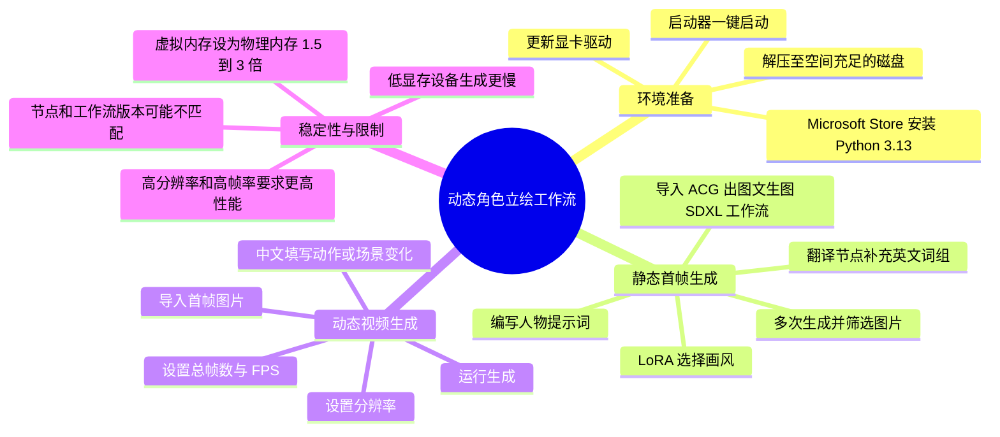
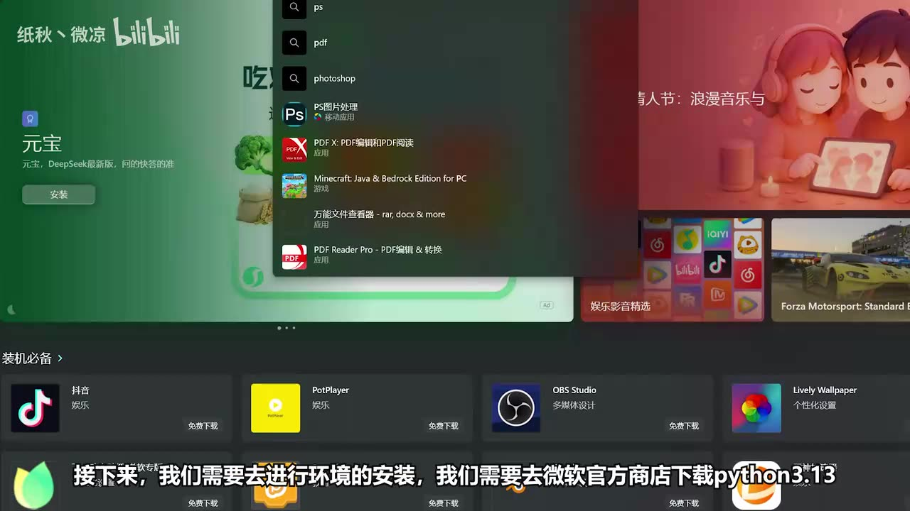
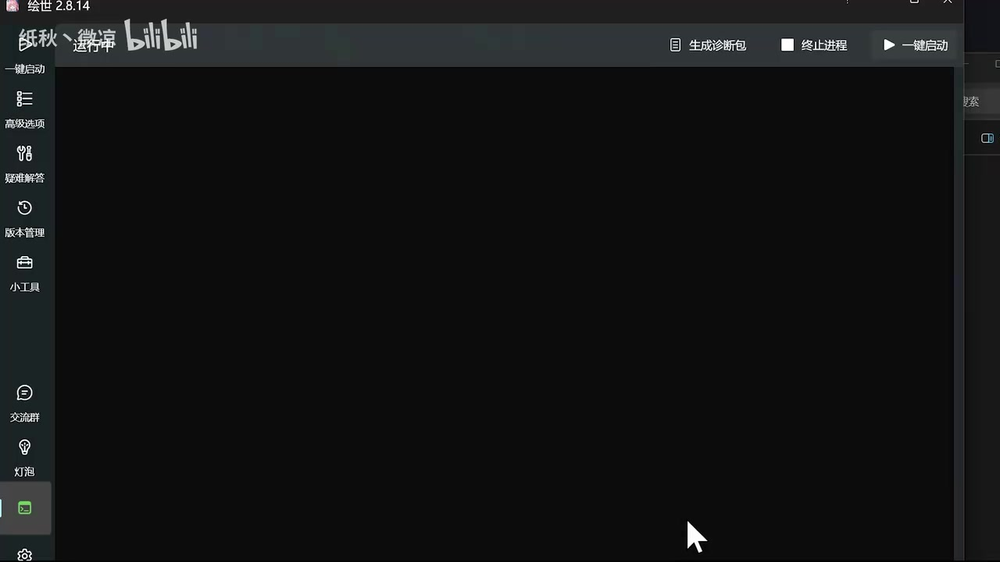
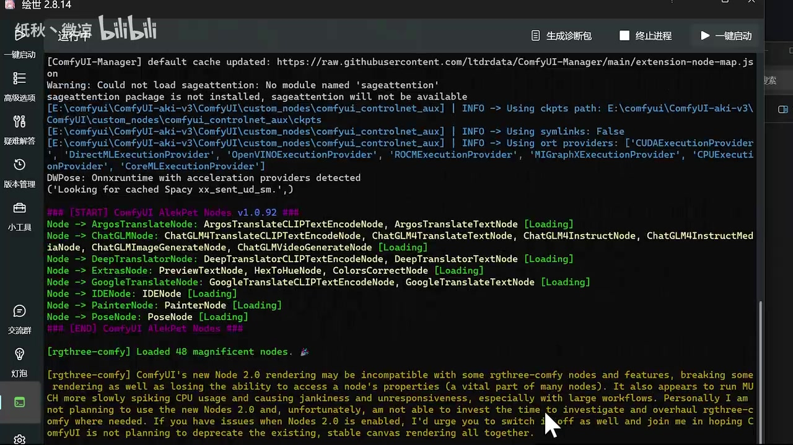

# 【AIGC】如何利用AI捏出好看的动态角色立绘（8GB显存可用）

> 来源：[Bilibili 视频](https://www.bilibili.com/video/BV1KVcjzkEAj)  
> UP 主：纸秋丶微凉｜时长：5 分 40 秒｜分辨率：1920×1080  
> 视频简介称提供了素材合集与整合包下载链接，并邀请观众分享成品；本文仅整理视频中可确认的操作信息，不验证外部链接内容与安全性。

## 小结

这是一份使用 **ComfyUI** 制作二次元角色动态立绘的快速教程。视频的工作流分为两段：先通过“ACG 出图文生图 SDXL”工作流生成静态角色首帧，再将挑选出的图片放入视频生成工作流，结合动作或场景变化描述，输出动态角色图。

环境部分的明确前提包括：将显卡驱动更新至最新版本、从微软官方商店下载 Python 3.13、解压整合包到剩余空间较大的磁盘，并通过启动器的一键启动功能打开环境。视频画面显示启动日志中存在 `sageattention` 未安装的警告，但旁边同时提示该包“not available”，不能据此直接判断教程无法运行。

静态图阶段的关键经验是：人物外貌、服饰、表情、动作和场景可由提示词编辑器组合；如使用翻译节点补充提示词，最终输入需要是**英语词组**。视频明确警告中文输入可能导致无法生图或没有效果。画风则通过右侧 LoRA 区域选择，作者称预置了三种画风。

动态视频阶段，时长由“总帧数 ÷ FPS”决定。作者示例为 **5 秒、16 FPS**，对应 **80 帧**；视频提示分辨率与帧率过高都会显著增加性能需求。动作/场景变化描述则在右侧文本框中以中文填写，形成与静态生图提示词语言要求不同的输入规则。

运行前最关键的稳定性建议是设置 Windows 虚拟内存：建议为物理内存的 **1.5～3 倍**。视频称未调整可能导致软件闪退；视频生成耗时较长，且低显存设备需要等待更久。标题虽标注“8GB 显存可用”，但素材中没有给出显卡型号、实际显存占用、生成时长或成功率，因此不能将其理解为对全部 8GB 显卡与所有参数的性能保证。

本教程具有较强时效性：ComfyUI、节点、LoRA、模型、Python 版本及整合包内容均可能迭代。热评已出现节点字段、UNet 加载器、LoRA、CLIP 对应项不一致等问题，说明复现时应优先检查工作流、插件和整合包的版本匹配关系。

## 思维导图





## 目录

- [目标、工具与适用边界](#目标工具与适用边界)
- [环境安装与启动](#环境安装与启动)
- [静态角色首帧：导入工作流与提示词](#静态角色首帧导入工作流与提示词)
- [画风选择、运行与选图](#画风选择运行与选图)
- [动态立绘：首帧、时长与分辨率](#动态立绘首帧时长与分辨率)
- [动作描述、虚拟内存与生成](#动作描述虚拟内存与生成)
- [完整操作清单](#完整操作清单)
- [限制、风险与时效性](#限制风险与时效性)
- [字幕比对](#字幕比对)
- [评论分析](#评论分析)
- [处理记录](#处理记录)

## 目标、工具与适用边界 [00:04](https://www.bilibili.com/video/BV1KVcjzkEAj?t=4)

视频开场说明目标是“捏出属于自己的二次元动态人物立绘”，并承诺按步骤演示。实际使用的核心工具为 ComfyUI；视频在后续展示中将流程拆成静态角色图生成与基于首帧的动态视频生成两部分。


> 图：画面并列展示多张二次元人物图，字幕说明将指导制作人物动态立绘。它说明教程预期产物的视觉方向，但并未展示这些角色的完整生成参数或全部动态效果。

标题中的“8GB 显存可用”是视频标题的主张，而非视频中逐项测试后公开的硬件基准。ASR 内容未提供显卡型号、模型量化方式、实际峰值显存、生成分辨率或生成耗时，实践时应将其视为作者的适用声明，而不是可直接复现的性能承诺。

## 环境安装与启动 [00:28](https://www.bilibili.com/video/BV1KVcjzkEAj?t=28)

作者给出的环境准备顺序如下：

1. 将显卡驱动更新至最新版本。
2. 前往微软官方商店下载 **Python 3.13**。
3. 找到并解压素材/整合包压缩文件；建议选择可用空间较大的硬盘。
4. 打开解压后的文件夹，选择启动器。
5. 双击启动器并选择“一键启动”，等待启动完成。



> 图：该帧显示微软商店搜索界面，画面字幕明确写有“去微软官方商店下载 python3.13”。它为 Python 版本和获取途径提供了画面佐证。



> 图：该帧展示名为“绘世 2.8.14”的启动器界面，右上角可见“一键启动”。它对应视频所说的通过启动器打开环境，但不能据此推断所有版本的整合包界面、名称或功能都相同。

启动日志画面中可见 ComfyUI 与多个自定义节点正在加载；同时出现类似 `Warning: Could not load sageattention: No module named 'sageattention'` 的提示，并显示“sageattention package is not available”。这只是该录制环境中可见的日志状态；视频未说明是否需要手动修复，也未展示错误对最终结果的影响。



> 图：该帧可见 ComfyUI Manager、自定义节点和模型相关日志，以及 `sageattention` 加载警告。其价值在于提示实际环境依赖较多，复现时不能只关注 Python 本身，还要观察节点与依赖的加载状态。

### 安装段的素材缺口 [01:02](https://www.bilibili.com/video/BV1KVcjzkEAj?t=62)

本次 ASR 在 01:02.150 至 01:38.020 间存在约 35.87 秒无语音文本的较大空档。根据给定素材，不能确认这段是否包含下载、解压、首次安装依赖或浏览器访问地址等具体操作。因此本文不补写未被字幕或关键帧证实的命令、文件路径、端口号或下载来源。

## 静态角色首帧：导入工作流与提示词 [01:38](https://www.bilibili.com/video/BV1KVcjzkEAj?t=98)

启动完成后，作者要求在解压后的文件中找到名称被 ASR 识别为 **“ACG 出图文生图 SDXL”** 的文件，并将其拖入浏览器窗口，以加载对应工作流。由于该名称来自 ASR 且未提供该时段工作流画面关键帧，本文保留其语义，不扩展为未经证实的确切文件扩展名或模型名称。

作者将左侧称为数据输入区，表示其中有三个节点；最左侧节点用于输入提示词。人物描述可通过下方的“提示词编辑器”填写或编辑。视频列举的可控内容包括：

- 人物外貌；
- 衣着；
- 表情；
- 动作；
- 场景。

作者已在工作流内预留一组提示词和多种可选描述，供没有明确构思时作为参考。这一设计的作用是降低从零编写提示词的门槛，但视频没有在可用字幕中给出完整预置提示词文本，因此无法逐字复录。

### 翻译节点与语言限制 [02:26](https://www.bilibili.com/video/BV1KVcjzkEAj?t=146)

如果预留描述中没有想要的效果，作者建议通过上方翻译节点补充内容。其明确限制是：

- 此处只应提交**英语词组**；
- 不能识别英语以外的语言；
- 输入中文可能导致无法生图，或即使运行也没有预期效果。

这里需要区分两类文本框：静态生图提示词区要求英语词组；后续动态视频工作流的动作/场景描述文本框则允许中文输入。不要将这两项规则混为一谈。

## 画风选择、运行与选图 [02:43](https://www.bilibili.com/video/BV1KVcjzkEAj?t=163)

右侧的 LoRA 区域用于选择画风。作者称已经提供了 **三种画风** 供选择，但在字幕和可见关键帧素材中没有给出三种 LoRA 的具体文件名、权重、触发词或授权信息，不能进一步推定。

在完成提示词和画风选择后，点击右侧运行按钮开始生图。作者建议在此阶段“多跑几张”，从生成结果中选择喜欢的图片，再进入下一阶段。该建议反映出首帧筛选的重要性：动态生成以选定的静态角色图为基础，首帧的角色外观、构图和清晰度会直接影响后续动态立绘的观感。

## 动态立绘：首帧、时长与分辨率 [03:05](https://www.bilibili.com/video/BV1KVcjzkEAj?t=185)

作者说明，存储文件中第一个名为 **Video** 的文件是输出视频文件。随后将文件夹中一张名称被 ASR 识别为“1 是屏幕偶”的图片拖入浏览器；结合上下文，这一步是在视频工作流中导入首帧图片，但该图片的精确文件名无法由现有 ASR 确认。

动态工作流左侧包含视频数据区与首帧图片区域，可设置：

- 视频总长度；
- 每秒帧数（FPS）；
- 视频分辨率。

视频明确给出时长换算关系：

```text
视频总时长（秒）= 总帧数 ÷ 每秒帧数（FPS）
```

作者已设置的示例参数为：

| 项目 | 视频示例值 | 含义 |
| --- | ---: | --- |
| 视频时长 | 5 秒 | 输出动态片段长度 |
| 帧率 | 16 FPS | 每秒生成 16 帧 |
| 对应总帧数 | 80 帧 | 5 × 16 的计算结果 |
| 分辨率 | 未在 ASR 中识别出数值 | 可使用作者推荐值或自行设置 |

视频特别提醒，过高的分辨率与帧数会提高性能要求，因此不应在未评估硬件负载的情况下盲目上调。该提醒与标题中“8GB 显存可用”并不矛盾：可用不等于所有分辨率、所有帧数和所有工作流配置均可稳定运行。

## 动作描述、虚拟内存与生成 [03:51](https://www.bilibili.com/video/BV1KVcjzkEAj?t=231)

右侧文本框用于描述角色动作或场景变化。作者明确表示，这一文本框可以**用中文输入**，也可以使用其预设内容。可填写内容的例子类型包括：

- 希望角色做出的动作；
- 希望画面发生的场景变化。

视频未展示具体中文示例、动作强度参数、随机种子、采样器或运动控制节点配置，因此不能从“中文输入”进一步推断任意中文动作描述都具有稳定可控的生成效果。

### Windows 虚拟内存设置建议 [04:00](https://www.bilibili.com/video/BV1KVcjzkEAj?t=240)

作者提示，在点击运行前需要重新设置 Windows 虚拟内存，否则软件可能闪退。建议值为：

```text
虚拟内存大小 = 物理内存的 1.5 倍 ～ 3 倍
```

例如，若设备物理内存为 16GB，按照视频的比例范围计算，虚拟内存可考虑设置为 24GB～48GB；这只是对视频公式的算术举例，并非视频给出的固定配置，也不代表所有系统都应采用该数值。

完成设置后即可点击运行。作者指出：

- 视频生成所需时间较长；
- 实际耗时取决于设备配置；
- 低显存设备的生成等待时间更长。

### 结果查看 [05:20](https://www.bilibili.com/video/BV1KVcjzkEAj?t=320)

运行结束后，即可查看生成的动态角色图。视频在这一段仅确认产物可被看到，没有在可用 ASR 文本中说明导出格式、文件夹完整路径、编码器、是否带音频或如何二次剪辑。视频全长约 340 秒，但最后一段有声字幕在 05:24.180 结束，之后至视频结束的内容未形成可用 ASR 文本。

## 完整操作清单 [00:28](https://www.bilibili.com/video/BV1KVcjzkEAj?t=28)

以下清单严格按视频可确认的顺序整理：

1. 更新显卡驱动至最新版本。
2. 从微软官方商店获取 Python 3.13。
3. 将整合包解压到剩余空间充足的磁盘。
4. 打开启动器并执行一键启动，等待环境加载。
5. 在解压目录中找到“ACG 出图文生图 SDXL”工作流文件，拖入浏览器窗口。
6. 在左侧提示词输入区描述人物。
7. 使用预留提示词作为灵感或起点，组合外貌、服装、表情、动作、场景等描述。
8. 如需经翻译节点补充静态生图提示词，提交英语词组，不要直接输入中文。
9. 在 LoRA 区域选择画风；视频中称有三种预置风格。
10. 点击运行生成多张静态角色图，筛选满意的首帧。
11. 找到 Video 输出文件相关内容，并将准备好的首帧图片拖入视频工作流。
12. 设置总帧数、FPS 和分辨率；时长按“总帧数 ÷ FPS”计算。
13. 参考作者示例设置 5 秒、16 FPS，即 80 帧；分辨率按硬件能力谨慎选择。
14. 在右侧文本框用中文描述动作或场景变化，或使用预设。
15. 在运行前设置 Windows 虚拟内存，建议为物理内存的 1.5～3 倍。
16. 点击运行，等待视频生成完成。
17. 查看生成的动态角色图。

## 限制、风险与时效性 [04:27](https://www.bilibili.com/video/BV1KVcjzkEAj?t=267)

### 视频已明确说明的限制

| 类别 | 内容 |
| --- | --- |
| 静态提示词语言 | 翻译节点处仅支持英语词组；中文可能无效或导致无法生图。 |
| 动态工作流性能 | 分辨率和帧数过高会提高性能要求。 |
| 生成耗时 | 视频生成时间较长，并随设备配置变化；低显存设备更慢。 |
| 稳定性 | 未调整 Windows 虚拟内存可能出现闪退。 |
| 画风资源 | 视频只说预置三种画风，未在字幕中提供 LoRA 名称、版本或权重。 |
| 硬件承诺 | 标题称 8GB 显存可用，但未披露实测硬件和完整参数，无法外推为普遍结论。 |

### 复现时的版本风险

关键帧中的启动日志表明该环境依赖 ComfyUI、管理器和多个自定义节点。此类工作流通常依赖节点名称、模型文件与版本兼容关系；热评亦反馈了加载器、LoRA、CLIP 或 Primitive 节点字段不一致的问题。视频没有提供针对这些问题的官方诊断路径，遇到错误时不宜凭空替换模型或删除节点，而应先核对：

1. 使用的是否为视频对应的整合包或工作流版本；
2. 工作流所需模型是否完整存在；
3. ComfyUI 前端、后端与自定义节点版本是否匹配；
4. 节点升级后是否发生输入/输出字段变动；
5. 磁盘空间、显存、物理内存与虚拟内存是否满足实际任务。

### 时效性说明

元数据显示视频发布于 2026-02-14；素材抓取时间为 2026-07-16。ComfyUI 的节点接口与整合包内容可能已发生变化，评论时间也晚于发布日。本文记录的是该视频素材所展示的方法，不构成对当前最新版 ComfyUI、Python 3.13 或任何第三方整合包兼容性的保证。

## 字幕比对 [00:04](https://www.bilibili.com/video/BV1KVcjzkEAj?t=4)

| 字幕来源 | 完整性 | 专有名词 | 时间轴 | 主要问题 |
| --- | --- | --- | --- | --- |
| Bilibili 站内字幕 | 未提供可用字幕 | 无法核验 | 无法使用 | 素材清单显示字幕工具因 `Invalid URL` 退出，未取得站内字幕。 |
| 本次 ASR 字幕 | 共 17 段，语音覆盖约 175.55 秒，占视频约 51.76% | 部分词存在同音或误识别 | 可用，含精确 SRT 起止时间 | 有 4 处较大无字幕空档；工作流/文件名等专有词不完全可靠。 |

本次任务**没有站内字幕可供比较**，但已检查本次 ASR。ASR 使用 `medium` 模型、中文识别，语言置信度为 0.9970703125，带时间戳；诊断中**没有** `noAudioStream=true` 标记，且提供了音频文件与有效语音片段，因此本视频并非“没有音轨”的情况。

最终以本次 ASR 的 SRT 时间轴作为章节定位依据，并按上下文及可见关键帧谨慎校正少量明显词形：

| ASR 原文/近似识别 | 本文采用表述 | 校正依据与置信度 |
| --- | --- | --- |
| “人物动态力会” | 动态立绘 | 标题、开场字幕画面和上下文一致；高。 |
| “Laura 介面” | LoRA 区域 | AIGC 工作流常见术语，且语境为选择画风；中高。 |
| “ACG出图文聲图SDXL” | “ACG 出图文生图 SDXL”工作流 | 基于语义整理；未见对应文件画面，不确定精确文件名。 |
| “1是屏幕偶” | 用作视频工作流首帧的图片 | 上下文明确是拖入图片，但原始文件名无法确认；低。 |
| “啟發完成” | 启动完成 | 结合启动器“一键启动”语境；高。 |

ASR 的较大空档包括：01:02.150～01:38.020、04:07.760～04:27.540、04:39.660～05:20.980，以及开场后的 00:16.920～00:28.420。本文未将这些空档中的画面顺序或可能操作写成确定事实。

## 评论分析 [04:27](https://www.bilibili.com/video/BV1KVcjzkEAj?t=267)

仅处理本次可获取的热评前三条；评论代表个人设备与版本环境，不能视为已验证的普遍结论。

1. **-言_依（1 赞）**：“很好的视频，使我的电脑似乎遇到了一些问题。”  
   - 观点：认可教程，但在本机运行中遇到问题。  
   - 补充价值：与视频关于性能、虚拟内存和生成耗时的提醒相呼应。  
   - 局限：未说明报错、硬件、系统配置或操作阶段，无法定位是显存、内存、依赖还是节点问题。

2. **永旅鸟（0 赞）**：“UNet加载器、LoRA、CLIP没有对应的，我必须得把你整个全下载下来吗？”  
   - 观点：其本地环境缺少工作流所对应的 UNet 加载器、LoRA 和 CLIP 资源。  
   - 补充价值：提示工作流可能并非只导入 JSON 即可使用，还存在模型资源与节点匹配问题。  
   - 局限：评论未说明使用的是哪一版本工作流，也没有作者回复；“必须整个下载”是提问，不能据此断言整合包是唯一解决方案。

3. **虾夏二次元（0 赞）**：“Primitive节点没显示value和生成后控制两个选项怎么搞？内核和插件版本都最新了。”  
   - 观点：即使自称内核和插件已更新，Primitive 节点仍缺少教程中预期字段。  
   - 补充价值：说明“升级到最新版”未必能复现旧工作流，反而可能因接口变更导致字段不一致。  
   - 局限：未附截图、版本号、工作流文件或报错日志，不能确定是节点改版、前端缓存、缺少扩展还是配置差异。

## 评论分析

- 热评 1：很好的视频，使我的电脑似乎遇到了一些问题
- 热评 2：UNet加载器、LoRA、CLIP没有对应的，我必须得把你整个全下载下来吗[难过]
- 热评 3：Primitive节点没显示value和生成后控制两个选项怎么搞？内核和插件版本都最新了[约战4_不解]

以上内容是观众反馈摘录，只用于补充理解视频反响，不作为正文事实依据。

## 处理记录

- Worker ID：`worker-mrj0wjed-b0c290ad`
- 模型：`gpt-5.6-terra`
- 可用素材与工具结果：视频元数据、关键帧、音频文件、ASR SRT、ASR 诊断结果、热评 JSON；站内字幕抓取工具返回 `Invalid URL`，未获得可用站内字幕。
- 字幕选择：未提供站内字幕，因此采用本次 ASR 的 17 个带时间戳片段作为时间轴依据；针对“LoRA”“动态立绘”等明显误识别项，结合标题、上下文与关键帧进行有限校正，并保留无法确认的文件名不确定性。
- 关键帧选择依据：选用 `frame-001.jpg` 展示教程目标、`frame-002.jpg` 佐证 Python 3.13 获取方式、`frame-003.jpg` 佐证启动器一键启动、`frame-004.jpg` 呈现 ComfyUI 节点/依赖加载状态；其余关键帧虽在路径清单中列出，但未在给定画面素材中呈现内容，不据此编造说明。
- 热评处理：仅分析已获取的前三条热评，未扩展至其他评论。
- 缓存清理：未提供缓存清理工具的执行记录或回执，无法确认是否已清理；本文不虚构清理结果。
- 未解决问题：整合包具体版本与来源、工作流精确文件名、模型/LoRA/CLIP 清单及权重、输出编码参数、8GB 显存实测配置，以及评论中节点不匹配问题的解决方案，均未被现有素材充分证实。
