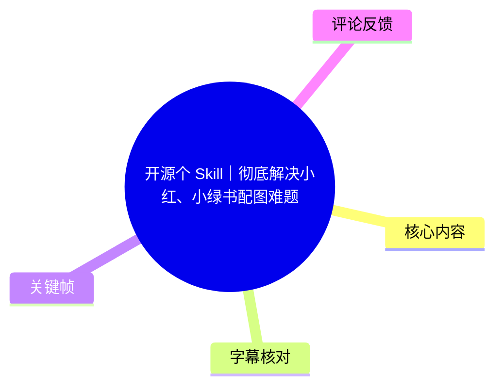
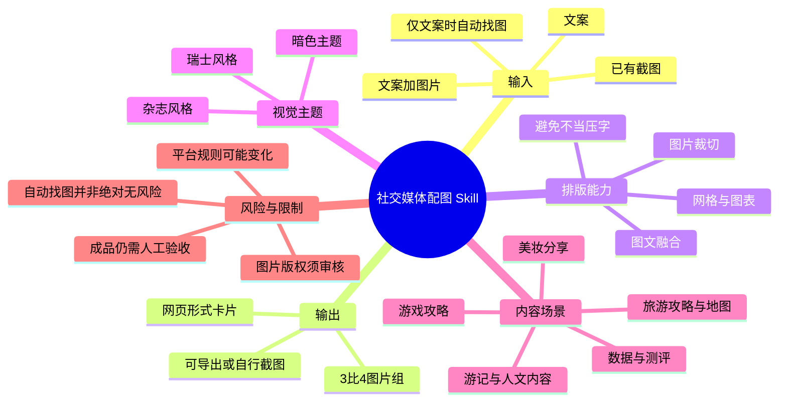
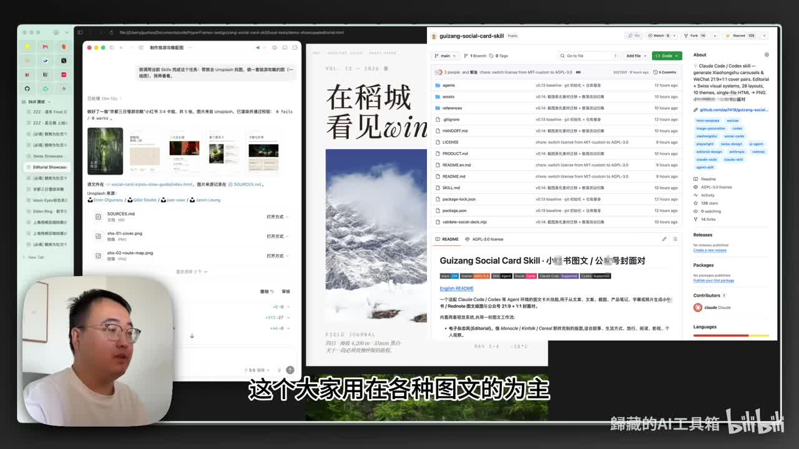
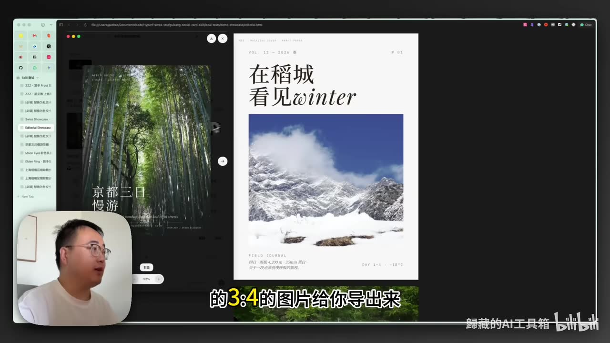
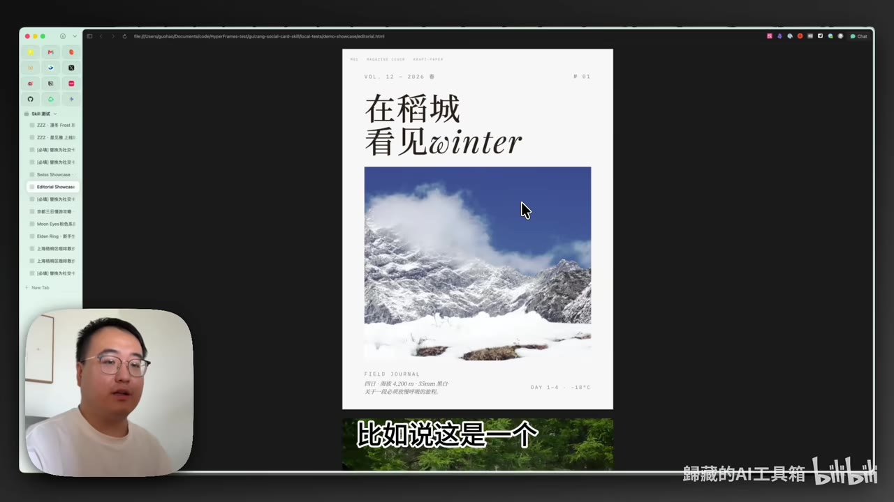

# 开源个 Skill｜彻底解决小红、小绿书配图难题

> 来源：[Bilibili 视频](https://www.bilibili.com/video/BV1CFGQ67EbX) 
> UP 主：歸藏的AI工具箱｜视频时长：5 分 21 秒｜合集：AIcode 
> 项目地址：<https://github.com/op7418/guizang-social-card-skill>

## 小结

视频介绍了一个开源的社交媒体图文配图 Skill，目标是把用户提供的文案、图片，或仅有文案的素材，排版为适合图文平台发布的 **3:4 比例图片组**。UP 主将其定位为对过往 PPT Skill 的补充：PPT 更偏重文本，而此工具将图片质量、裁切、图文融合和平台化内容模板作为重点。

其核心流程是：在可安装该 Skill 的 Agent 环境中提出生成需求；若用户没有提供图片，工具会先寻找与主题匹配的图片；再生成网页形式的图文卡片，并导出已截好的图片。视频明确说明，成品本质是网页，用户也可以自行打开网页截图。

工具展示了两类视觉主题：**杂志风格**更强调封面感、图片裁切与人文叙事；**瑞士风格**以无衬线字体、网格和数据卡片为主，适合攻略、数据、测评和纯文字内容。视频还展示了旅游、美妆、游戏攻略、截图美化等适配场景。

值得注意的是，视频关于“自动找图”“官方图片”“版权风险提示”“自动选择风格”等内容均为 UP 主演示或功能声明，并非对所有输入、所有平台及所有素材都已验证的保证。尤其是版权状态、平台的 AI 内容识别规则及生成结果质量，仍需发布者自行审核。

项目描述中列出其当时具备 **2 套主题、28 个版式、9 套配色，以及对 8 类小红书主流内容类别的适配**。这些属于视频发布时的项目资料；开源项目的功能、安装方式、许可证和版本均可能后续变动，应以仓库当前文档为准。

## 思维导图

## 目录

- [项目定位：解决图文平台的排版与配图问题](#项目定位解决图文平台的排版与配图问题)
- [使用流程：从文案到 3:4 图文卡片](#使用流程从文案到-34-图文卡片)
- [图文融合与杂志风格案例](#图文融合与杂志风格案例)
- [瑞士风格、版式与数据表达](#瑞士风格版式与数据表达)
- [场景适配：旅游、美妆与地图](#场景适配旅游美妆与地图)
- [游戏攻略、版权提示与暗色主题](#游戏攻略版权提示与暗色主题)
- [截图美化与按内容目的选风格](#截图美化与按内容目的选风格)
- [可复用操作步骤与参数清单](#可复用操作步骤与参数清单)
- [限制、时效性与发布前检查](#限制时效性与发布前检查)
- [字幕比对](#字幕比对)
- [评论分析](#评论分析)
- [处理记录](#处理记录)

## 项目定位：解决图文平台的排版与配图问题 [00:00:29](https://www.bilibili.com/video/BV1CFGQ67EbX?t=29)

UP 主开场说明，本次开源的是面向图文平台的社交媒体配图 Skill。用户向它提供：

1. 一段文案；或
2. 文案与图片；

即可让其协助排版并生成一组 **3:4 图文图片**。UP 主认为，这种纵向比例适合以图文为主的社交媒体平台，也可用于朋友圈发布。

视频提出的痛点并不是“单纯生成文字卡片”，而是已有高质量照片却不会排版、手工排版费力，或者没有合适配图。与此前偏文字表达的 PPT Skill 相比，这次的重点被放在图片质量与图片在版面中的地位上。

> 图：画面同时展示了 Skill 项目仓库、Agent 侧的操作界面和右侧的成品卡片。它说明该工具不是独立的传统设计软件，而是可由 Agent 调用、以网页卡片形式产出内容的工作流。

## 使用流程：从文案到 3:4 图文卡片 [00:00:55](https://www.bilibili.com/video/BV1CFGQ67EbX?t=55)

视频以未提供图片的情况演示了基本链路。UP 主表示，若安装在 Codex 等可安装 Agent Skill 的环境中，可以直接让 Agent“生成一组图”。

### 视频展示的执行顺序

1. **安装并调用 Skill**
   - 视频以 Codex 为例；
   - UP 主补充称，它可安装在“任何 Agent 平台”，但没有在视频中逐一展示具体平台、安装命令或兼容版本。

2. **提交素材需求**
   - 可给文案；
   - 也可同时给文案和自有图片；
   - 演示中没有给图片，因此系统进入找图环节。

3. **检索或选择配图**
   - 工具会依据主题寻找图片；
   - 找图完成后再开始生成版面。

4. **生成网页卡片并导出**
   - 输出是图文 3:4 图片；
   - UP 主特别说明，其本质上生成的是网页，只是已替用户完成网页截图导出；
   - 因此也可自行打开网页后截图。

5. **检查图文关系**
   - 设计逻辑包括判断何时在图上叠字、何时避免压字，以及何时裁切图片、何时不应再裁切。
   - 这些判断是该 Skill 声称重点优化的部分，实际结果仍应结合不同素材验收。

> 图：画面中输出的卡片采用纵向 3:4 构图，标题位于上部留白，雪山图片承载主体视觉信息。它直观呈现“网页生成后导出图片”的目标形式。

## 图文融合与杂志风格案例 [00:01:19](https://www.bilibili.com/video/BV1CFGQ67EbX?t=79)

UP 主称工具包含两类主要主题：**杂志风格**与**瑞士风格**。前者在视频中首先展示。

杂志风格的重点是封面式层级、照片与文字的协调，以及对图片主体的保护。UP 主以一张随手拍摄的露营照片为例，称工具会裁掉画面下方较混乱的树枝等部分，仅保留主体用于排版。这里体现的不是机械等比例缩放，而是尝试根据画面内容完成裁切。

对于没有图片、只有文字的输入，视频展示该主题仍可以通过网格和文字层级建立版面。UP 主列举的可覆盖形式包括：

- 纯文字摘抄、摘录；
- 列表式内容；
- 多图四宫格；
- 单图内容。

> 图：该帧更清晰地呈现杂志式封面的层级：大标题、英文花体字、主图和底部信息被分置于不同区域。其价值在于说明“杂志风格”并不只是套滤镜，而是通过留白、字号和图片区块组织视觉重点。

### 杂志风格的适用理解

根据视频最后的判断，可将杂志风格优先用于：

- 游记；
- 人文内容；
- 需要凸显个人照片或叙事氛围的内容；
- 以封面感和图像质感作为主要吸引力的图文组。

这是一种内容表达倾向，不代表工具无法用于其他类型题材。

## 瑞士风格、版式与数据表达 [00:02:07](https://www.bilibili.com/video/BV1CFGQ67EbX?t=127)

瑞士风格在视频中被描述为以**无衬线字体**为主要排版方案的模板。相较于杂志风格，其侧重点是更清晰的结构、网格、数字和信息表达。

UP 主认为它主要适合：

- 数据内容；
- 纯文字内容；
- 攻略分享；
- 早餐、阅读等生活分享；
- Web Coding 分享；
- 装修、旅行、健身等可搭配图片的主题。

视频特别展示其可使用图表模板配合卡片呈现数据，因此对于带有数值对比、清单、指标或结构化结论的内容，瑞士风格可能更符合“先读信息、再看装饰”的阅读需求。

### 两类主题的区别

| 维度 | 杂志风格 | 瑞士风格 |
| --- | --- | --- |
| 主要视觉重点 | 图片氛围、封面感、叙事感 | 文字结构、数据、网格 |
| 字体倾向 | 视频强调视觉化标题与杂志感 | 以无衬线字体为主 |
| 适合内容 | 游记、人文、摄影、感受表达 | 攻略、测评、数据、纯文字 |
| 图片角色 | 适合突出高质量照片 | 可加图片，但信息表达优先 |
| 视频中的选择逻辑 | 人文游记偏向此主题 | 测评等内容偏向此主题 |

## 场景适配：旅游、美妆与地图 [00:02:31](https://www.bilibili.com/video/BV1CFGQ67EbX?t=151)

视频称，除图文基本排版外，此次还针对社交媒体常见的 3:4 图文类别做了适配。旅游攻略是其中重点展示的场景。

### 旅游攻略与地图

旅游内容高度依赖图片。UP 主的逻辑是：当用户本身拥有好看的照片时，工具不应过度干预或“强烈裁切”图片；而旅游攻略常需要地图，直接使用地图截图通常不够美观，因此工具内置地图能力，可根据用户提供的路线：

- 在地图中标注路线；
- 将点位标到对应位置；
- 增加信息卡片。

视频没有展示地图数据来源、地名覆盖范围、路径规划算法、坐标精度标准或离线能力。因此，“精准标到对应点位”是演示中的功能说法，实际用于出行发布前应人工核对地点、路线和营业信息。

### 美妆内容

UP 主称工具也适配美妆分享：可将对应主题元素放入版面，并与用户拍摄的照片结合。视频没有提供具体的美妆品类识别准确率或品牌素材授权说明，故不宜将其理解为自动识别、自动核验商品信息的能力。

## 游戏攻略、版权提示与暗色主题 [00:03:20](https://www.bilibili.com/video/BV1CFGQ67EbX?t=200)

游戏攻略是视频中另一个较完整的应用案例。工具可寻找相应游戏角色图片，并为角色配合数值与介绍信息，形成不同于常见攻略图的排版。

### 图片版权：视频给出的处理逻辑

UP 主说明，工具找图时会**优先寻找版权没有问题的图片**。同时，他也承认工具可能找到版权存在问题的图片；在这种情况下，工具会询问用户是否在意版权风险：

- 若是普通朋友圈发布，用户可自行决定是否使用；
- 若发布平台对版权敏感，或用户运营较大的账号，则应谨慎，并根据提示选择不用。

这段内容的关键不在于“可以随意使用有版权问题的图片”，而是明确存在风险分支。发布者仍需自行确认授权范围、署名义务、二创规则、游戏平台素材政策和发布平台规范。所谓“系统会询问”也不能替代法律审核。

### 暗色主题示例

视频展示了一套暗色主题，并以虚构的《艾尔登法环》攻略为例。UP 主称示例中选用的是官方图片，因此“没什么版权问题”，并以暗色排版呈现攻略内容。

该案例只能说明视频当时所用素材的来源判断，不能推导为所有搜索到的同类游戏素材都为官方授权素材。

## 截图美化与按内容目的选风格 [00:04:08](https://www.bilibili.com/video/BV1CFGQ67EbX?t=248)

除找图和排版外，视频还展示了“已有截图”的处理方式。UP 主先展示未经美化的截图：背景 UI 外露，整体观感较杂乱；再展示通过 Skill 处理后的结果，称其可清理截图、补充更协调的背景，使画面更高级。

### 视频中可复用的截图美化思路

1. 准备已有截图；
2. 明确告诉 Agent：已有截图，希望进行美化；
3. 让工具处理截图中不美观的界面残留或背景；
4. 为截图补充与内容匹配的背景与版式；
5. 检查关键信息是否因清理、裁切或遮罩而缺失。

其中第 5 步尤为必要。视频证明了视觉效果示例，但没有说明界面清理是通过裁切、遮罩、重绘还是其他方式实现；涉及游戏数值、操作界面、订单、地址或其他需保真的截图时，应保留原图并逐项核对。

### 同一地点因发布目的不同而选择不同风格

视频最后给出一个实用判断：即便地点和内容素材相同，发布目的不同，自动选择的风格也可能不同。

- 若做**测评**，更适合选瑞士风格；
- 若写**游记、人文表达**，更适合选杂志风格。

这可以抽象为一条人工审核原则：先确定内容是“帮助读者获取信息”，还是“让读者感受场景”，再决定信息密度、图表比例、文字层级和图片占比。

## 可复用操作步骤与参数清单 [00:04:32](https://www.bilibili.com/video/BV1CFGQ67EbX?t=272)

以下整理严格基于视频和项目描述中出现的信息，不补充未展示的命令、API 参数或平台配置。

### 操作步骤

1. **准备 Agent 环境**
   - 在支持安装该类 Skill 的 Agent 平台中使用；
   - 视频示例为 Codex；
   - 其他平台的具体兼容性、安装流程须查询项目仓库。

2. **准备输入**
   - 最低输入：文案；
   - 更可控的输入：文案 + 自有图片；
   - 可选输入：已有截图，并明确提出“美化截图”的目标；
   - 旅游场景可补充路线信息，以便生成带标注的地图。

3. **明确内容类型和目标**
   - 例如旅游攻略、美妆分享、游戏攻略、数据卡片、测评、游记；
   - 同时说明发布目的：信息型、测评型、攻略型或人文叙事型。

4. **选择或让工具匹配风格**
   - 杂志风格：照片、人文、游记、氛围表达；
   - 瑞士风格：数据、攻略、纯文字、测评；
   - 暗色主题：视频展示其适合游戏攻略等暗色视觉需求。

5. **处理配图**
   - 有高质量自有照片时，重点检查主体是否被误裁；
   - 无图时，检查自动找图是否真正符合主题及使用权要求；
   - 涉及地图、角色、商品时，逐项核对事实信息与素材来源。

6. **导出与验收**
   - 目标输出为 3:4 图文图片；
   - 生成物本质为网页，可直接导出或自行截图；
   - 发布前检查文字错字、裁切、数字、地名、地图点位、版权与平台规范。

### 视频和项目描述中明确出现的参数/规格

| 项目 | 内容 |
| --- | --- |
| 视频时长 | 321 秒 |
| 成品比例 | 3:4 |
| 主要主题 | 杂志风格、瑞士风格 |
| 额外展示主题 | 暗色主题 |
| 项目描述中的主题数量 | 2 套 |
| 项目描述中的版式数量 | 28 个 |
| 项目描述中的配色数量 | 9 套 |
| 项目描述中的适配类别 | 8 类小红书主流内容类别 |
| 已展示内容类型 | 旅游攻略、美妆、游戏攻略、数据/攻略、测评、游记、人文内容 |
| 输出载体 | 网页生成后导出/截图的图片 |

### 与此前 PPT Skill 的关系

UP 主表示，此前开源的 PPT Skill 在 25 天内达到 14,000 使用量，并称这次将从 PPT Skill 获得的经验复制到社交媒体卡片 Skill。该数据为视频中的自述，未提供可供本视频核验的统计链接或口径，例如“使用量”是安装次数、用户数还是调用次数，故应按宣传背景理解。

## 限制、时效性与发布前检查 [00:04:56](https://www.bilibili.com/video/BV1CFGQ67EbX?t=296)

### 已明确的限制

- **没有展示完整安装命令**：视频只展示了在 Codex 等 Agent 环境中的使用概念，未给出详细环境依赖、系统要求、授权方式或失败排查。
- **找图不等于取得授权**：视频已明确承认可能遇到版权有问题的图片；即使工具提示风险，最终使用责任仍在发布者。
- **自动判断不等于绝对准确**：裁切、压字位置、地图点位、风格选择及截图清理均可能不符合实际内容重点。
- **仅展示样例，不代表全品类稳定性**：旅游、美妆、游戏、测评等案例是功能演示，并未提供规模化测试、成功率或对比数据。
- **网页导出仍需审稿**：图片最终由网页渲染和截图/导出得到，字体替换、浏览器差异、长文本溢出等问题未在视频中讨论。

### 时效性说明

视频元数据的发布时间为 2026 年 5 月 28 日，素材抓取时间为 2026 年 7 月 16 日。项目描述中有关主题、版式、配色和内容类型适配的数字应视为该时间段的项目状态。开源仓库可能更新版本、文件结构、模型依赖、许可证、图片来源策略或支持平台，因此实际使用前应先阅读仓库当前 README 与许可证。

### 发布前检查清单

- [ ] 文案中的事实、数字、游戏角色名、产品名称是否正确；
- [ ] 图片是否为自有、已授权、官方允许使用或符合平台规则；
- [ ] 重要主体是否被裁切，文字是否压住关键画面；
- [ ] 地图路线、地点名称和标点是否准确；
- [ ] 截图美化后是否遮挡或改变了应保留的信息；
- [ ] 3:4 图片在目标平台预览中是否出现压缩、溢出或字体异常；
- [ ] 是否已根据内容目的选择“信息表达优先”或“视觉叙事优先”的风格。

## 字幕比对

| 字幕来源 | 完整性 | 专有名词 | 时间轴 | 主要问题 |
| --- | --- | --- | --- | --- |
| Bilibili 站内字幕 | 未提供可用字幕 | 无法评估 | 无法评估 | 素材记录显示字幕工具报 `Invalid URL`，未获得可用站内字幕。 |
| 本次 ASR 字幕 | 较完整，覆盖 29.02 秒至 320.55 秒，语音覆盖约 90.89% | 存在较多同音/错词 | 可用，含 13 个真实 SRT 时间段 | 多处“图片、裁切、瑞士、版权、游戏名”等被识别为错别字或近音词；单段较长，断句不足。 |

### 最终字幕选择与校正

本次没有可用的 Bilibili 站内字幕，因此正文以**本次 ASR 的带时间戳 SRT**作为时间轴依据。ASR 诊断显示：

- 语言：中文；
- 模型：`medium`；
- 音频时长：320.76 秒；
- `noAudioStream` 未标记为 `true`，说明素材存在可识别音轨；
- 首段语音从 29.02 秒开始，视频开头约 29 秒没有被 ASR 识别为有效语音；
- 无大间隔警告。

结合视频标题、项目地址、元数据描述和关键帧画面，对正文中的以下明显 ASR 错词进行了语义校正：

| ASR 原文或近似识别 | 正文采用 | 校正依据 |
| --- | --- | --- |
| “图骗”“图屏”“囿片” | 图片 | 上下文为配图、找图、图文融合；关键帧显示图片卡片 |
| “杂质风格” | 杂志风格 | UP 主后文与画面均指向杂志封面式设计 |
| “非称限字体” | 无衬线字体 | 与瑞士风格排版描述相符 |
| “三倍速图片” | 3:4 图片 | 视频反复说明 3:4 图文图片，且关键帧为竖版卡片 |
| “瑞士风格”相关误识别 | 瑞士风格 | 视频明确对比杂志风格与瑞士风格 |
| “绝区0” | 《绝区零》 | 游戏名称常规写法；ASR 将“零”识别为数字 0 |
| “艾儿灯法玮” | 《艾尔登法环》 | ASR 同音误识别；视频语境为游戏攻略示例 |
| “webcoding” | Web Coding | ASR 英文连读，保留其所表达的网页/编程分享类别 |

以上校正用于提升可读性，不改变视频原意；对于未能通过画面或上下文确认的细节，未额外扩写。

## 评论分析

仅分析素材中可获取的热评前三条。评论属于用户观点或体验反馈，不作为功能、效果或版权结论的验证依据。

1. **@是白泽大人呐（8 赞）**
   - 观点：质疑为何不直接让 GPT 或 Codex 找图，并把裁切和判断规则写入记忆。
   - 讨论价值：该评论指出了“通用 Agent + 提示词/记忆”与“封装为专门 Skill”之间的产品边界问题。
   - 可得出的谨慎结论：视频强调的差异在于预置版式、主题、图片处理和场景适配流程；但视频没有进行与纯提示词方案的量化对比，因此无法仅凭演示证明专用 Skill 在所有任务上更优。

2. **@貓貓貓貓頭人（6 赞）**
   - 观点：从其他平台关注到 B 站，表达对 UP 主的支持。
   - 补充信息：反映 UP 主可能具有跨平台传播，但没有提供工具安装、质量或使用效果方面的可验证信息。
   - 可信度边界：属于情感支持评论，不应用来判断项目技术能力。

3. **@粉嫩粉嫩的间谍活动（5 赞）**
   - 观点：称在 X 平台看到该项目，并表示“确实好用”。
   - 补充信息：提供了一条个人使用体验的正向反馈。
   - 可信度边界：未说明测试素材、使用版本、Agent 环境、生成次数、失败案例或版权审核方式，因而只能视为个体主观体验。

## 处理记录

- Worker ID：`worker-mrj0wjed-b0c290ad`
- 模型：`gpt-5.6-terra`
- 调用工具与素材：视频元数据、关键帧提取结果、音频 ASR 结果（`medium`，CUDA/float16）、ASR SRT 时间轴、热评抓取结果。
- 使用的应用工具：素材编排流程输出了 `merged.mp4`、`audio/audio.wav`、`frames/`、`asr/transcript.srt`、`asr/asr-result.json` 和 `comments/comments.json`；站内字幕抓取曾返回 `Invalid URL`，未产生可用字幕。
- 字幕选择：未提供可用 Bilibili 站内字幕；已检查本次 ASR，采用带真实起止时间的 ASR SRT 作为章节时间轴依据，并以标题、元数据、项目地址和关键帧校正明显同音错词。
- 关键帧选择依据：选用 `frame-001.jpg` 说明项目仓库、Agent 工作流与成品关系；选用 `frame-003.jpg` 展示 3:4 导出结果；选用 `frame-004.jpg` 展示杂志风格的排版层级。图片均以相对路径嵌入，且与对应论述时间段相匹配。
- 缓存清理：提供的素材中未包含缓存清理执行记录，无法确认是否已清理；因此不将其表述为已完成。
- 未解决问题：
  - 未获得站内字幕，无法做逐句交叉校验；
  - 视频未展示具体安装命令、依赖版本和完整的失败处理；
  - 视频中的版权筛选、地图精度、截图清理机制及各版式数量未做独立复核；
  - 开源仓库在视频发布后可能更新，本文不替代当前项目文档。
