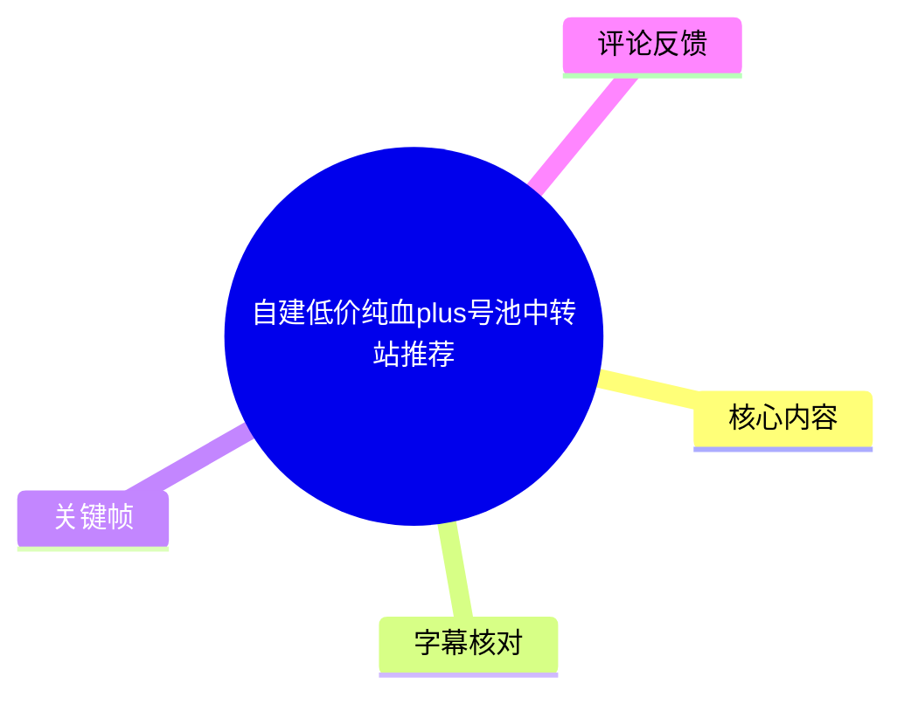
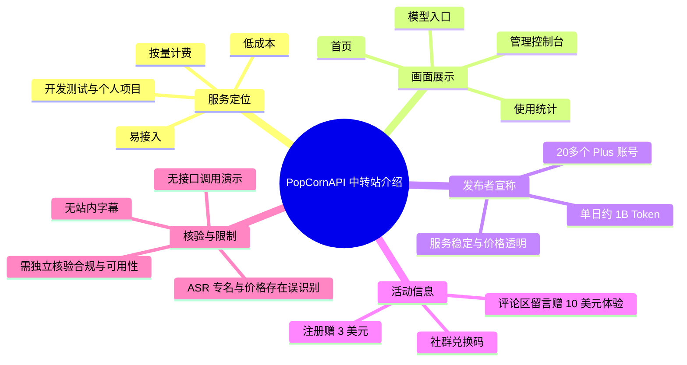
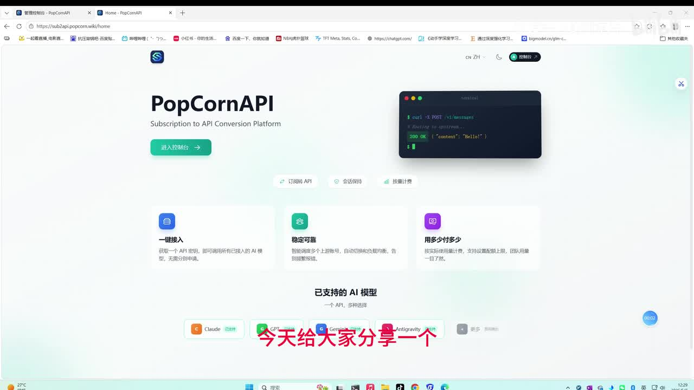
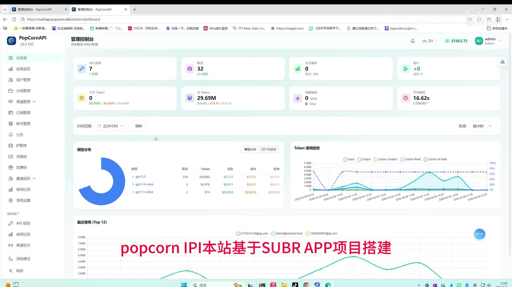
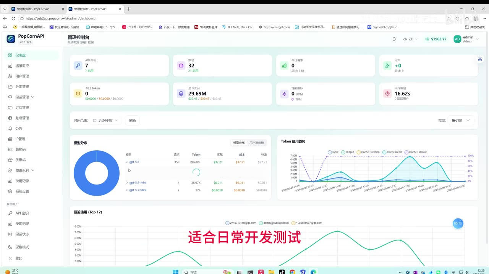
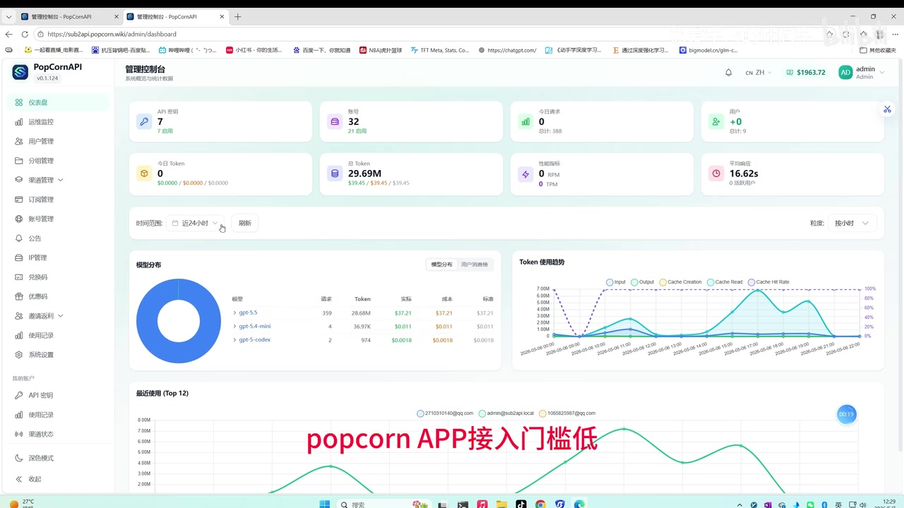

# 自建低价纯血plus号池中转站推荐

> 来源：[Bilibili 视频](https://www.bilibili.com/video/BV11rdFBSESi) 
> UP 主：热爱学习的叶同学｜发布时间：2026-05-07｜视频时长：01:12

## 小结

视频介绍了一个名为 **PopCornAPI** 的 API 中转服务。UP 主将其定位为基于某个“SUBR APP”（画面文字如此显示，项目名称拼写待核）的项目搭建的低成本、易接入、按量计费的平台，面向日常开发测试、个人项目，以及较高频率的模型调用需求。

视频画面展示了 PopCornAPI 的首页和管理控制台：首页标注“Subscription to API Conversion Platform”，并列出 Claude、GPT、Gemini、Antigravity 等模型入口；控制台则包含 API 密钥、渠道管理、用户管理、兑换码、优惠码、邀请返利、使用记录和渠道状态等菜单。该画面只能证明视频录制时界面呈现这些功能入口，**不能单独证明各模型、账户来源或服务稳定性**。

UP 主在口播中宣称：服务由“20 多个纯血 Plus 账号”支撑，单日可提供约 **1B Token**；并称注册赠送 **3 美元**、评论区留言可获 **10 美元体验额度**。其中“账号数量、Token 供给、稳定性、价格透明”等均为发布者自述，未见独立监测数据或服务条款佐证。

ASR 对计费关键句识别质量不佳：可辨内容包含“0.08 刀”“按 1 倍率计费”“……Token 约 0.77 刀”，但模型名称、计费对象及数字之间的对应关系不清，不能据此整理为可靠价格表。视频简介明确给出主站 `https://sub2api.popcorn.wiki/`、注册赠 3 美元、交流群及群内兑换码信息；它与口播的注册赠送信息基本一致，但“评论区 10 美元”需要以实际活动页面为准。

这是一则短时长推广/推荐视频，而非完整接入教程。适合想了解该服务宣传定位、后台形态与活动信息的读者；若计划接入生产环境，应先自行核验模型可用性、接口兼容性、限流、退款/余额规则、数据处理方式及账号合规风险。

## 思维导图

## 目录

- [视频定位与页面概览](#视频定位与页面概览-0000)
- [后台能力与适用场景](#后台能力与适用场景-0029)
- [发布者的供给与计费说法](#发布者的供给与计费说法-0031)
- [活动、入口与实际操作](#活动入口与实际操作-0055)
- [关键帧索引](#关键帧索引-0000)
- [结论、限制与时效性](#结论限制与时效性-0055)
- [字幕比对](#字幕比对)
- [评论分析](#评论分析)
- [处理记录](#处理记录)

## 视频定位与页面概览 [00:00](https://www.bilibili.com/video/BV11rdFBSESi?t=0)

视频开头展示 PopCornAPI 首页。页面主标题为“PopCornAPI”，副标题为“Subscription to API Conversion Platform”，并提供“进入控制台”按钮。页面以“订阅转 API”“会话保持”“按量计费”为卖点文案；下方可见已支持模型区域，画面中能辨认出 Claude、GPT、Gemini、Antigravity 等标签。

这些内容反映的是前台宣传页面，不等同于模型实际可调用范围、上游来源、速率限制或服务等级协议。特别是视频标题中的“纯血 plus 号池”属于 UP 主的营销/描述性表述，视频没有展示账户授权、采购来源或合规证明。

> 图：开场首页展示了平台名称、控制台入口、宣传卖点和部分模型标签。这是理解视频所推荐对象及其“订阅转 API”定位的直接画面证据。

## 后台能力与适用场景 [00:29](https://www.bilibili.com/video/BV11rdFBSESi?t=29)

ASR 在 `00:29.940` 开始识别到口播。UP 主称该站“整体定位是低成本、易使用、计费清晰”，适用于：

1. 日常开发测试；
2. 个人项目；
3. 高频或高强度的应用调用；
4. 希望降低模型使用成本，或需要备用中转服务的用户。

与此同时，控制台画面可见如下功能模块：

- 仪表盘与运维监控；
- 用户管理、分组管理；
- 渠道管理、订阅管理、账号管理；
- 公告、IP 管理、兑换码、优惠码；
- 邀请返利、使用记录、系统设置；
- API 密钥、渠道状态等账户相关入口。

仪表盘中还展示了 API 密钥数量、账号数量、今日请求、用户、今日 Token、总 Token、性能指标及平均响应时长等统计卡片，以及模型分布和 Token 使用趋势图。画面中出现的数值是录屏时刻的后台快照，不应外推为当前运营数据或性能承诺。

> 图：该帧显示 PopCornAPI 管理控制台及侧边栏模块，支持“平台具备渠道、账号、兑换码和用量管理界面”的描述；它没有展示具体 API 请求、鉴权流程或成功响应。

> 图：画面覆盖文字写有“适合日常开发测试”，与 ASR 中的使用场景表述相互印证；后台统计图也说明视频在用量监控界面进行宣传。

## 发布者的供给与计费说法 [00:31](https://www.bilibili.com/video/BV11rdFBSESi?t=31)

在 `00:31.200—00:55.240` 的 ASR 片段中，UP 主进一步作出以下陈述：

- 该服务比“复杂的平台”接入门槛更低、使用更直观；
- 后续会持续维护和优化站点体验，尽量保证服务稳定、价格透明、使用方便；
- 当前“持有/耗持”20 多个“纯血 Plus”账号；
- 单日可提供约 **1B Token**。

上述是视频内的发布者承诺或运营陈述。应注意：

- 视频未说明“纯血 Plus 账号”的具体定义、账号授权关系、故障切换机制或上游服务政策；
- “单日约 1B Token”未给出测量周期、并发条件、模型构成、输入/输出 Token 口径或可用性数据；
- “稳定”“价格透明”没有配套 SLA、状态页、故障历史或退款条款；
- 虽然后台画面展示了“渠道管理”“账号管理”和曲线图，但这只能辅助理解其运营架构，不能验证供给规模。

关于价格，ASR 原文出现“……定价为 0.08 刀”“按照一倍率计费”“……Token 仅需约 0.77 刀”等内容，但前半句模型/单位发生明显误识别，“EMTOKENS”等词也不可靠。故本笔记只保留其存在**低价与倍率计费宣传**这一事实，不将其整理为可执行报价。使用前应以站点实时价目表、模型列表和结算页为准。

> 图：该帧的覆盖文字为“popcorn APP接入门槛低”（大小写与名称按画面保留）。它是 UP 主“接入门槛低”观点的视觉补充，但不构成兼容性或迁移成本的实测结论。

## 活动、入口与实际操作 [00:55](https://www.bilibili.com/video/BV11rdFBSESi?t=55)

`00:55.240—00:58.960` 的口播称：

- 注册赠送 **3 美元**；
- 在评论区留言可获 **10 美元体验额度**；
- 链接放在评论区。

视频简介提供了更具体的站外信息：

- 主站：<https://sub2api.popcorn.wiki/>
- 注册活动：注册送 3 刀体验；
- 交流群：`2161050113`；
- 群内会不定时发放余额兑换码；
- 注册后在评论区留下账号，可获赠余额。

### 可依据素材执行的最小操作路径

1. 访问视频简介所列主站，而非仅依据评论中的第三方注册链接。
2. 注册后核对新用户余额是否实际到账，以及赠送金额的适用范围、过期时间与可用模型。
3. 若参与评论区赠送，按简介要求留下账号；避免公开提交密码、API Key、验证码或其他敏感信息。
4. 进入控制台后，查看模型清单、价格/倍率、充值、渠道状态、API 密钥及用量记录。
5. 用低风险测试请求验证模型名称、OpenAI/Anthropic 等接口兼容性、首 Token 延迟、错误率、限流与余额扣费。
6. 在投入较大余额或接入生产业务前，保存价格页和活动规则截图，并确认退款、封禁、数据留存与隐私政策。

### 视频没有提供的关键步骤

视频未展示注册流程、API Key 创建过程、Base URL、请求端点、鉴权头、模型 ID、SDK 配置、充值步骤或完整调用示例。因此不能从该视频推导出可直接复制的代码、命令或接口参数。

## 关键帧索引 [00:00](https://www.bilibili.com/video/BV11rdFBSESi?t=0)

| 关键帧 | 画面内容 | 正文使用价值 |
| --- | --- | --- |
| `frames/frame-001.jpg` | PopCornAPI 首页、控制台入口、卖点与模型标签 | 确认推荐对象的前台名称和宣传定位。 |
| `frames/frame-002.jpg` | 管理控制台、侧边栏运营模块、统计面板 | 说明视频实际展示了后台管理界面。 |
| `frames/frame-003.jpg` | 控制台与“适合日常开发测试”覆盖文字 | 将页面画面与口播使用场景建立对应。 |
| `frames/frame-004.jpg` | 控制台与“接入门槛低”覆盖文字 | 作为 UP 主主观判断的画面依据。 |

其余关键帧路径已提供，但当前素材中未附带可核读的画面内容描述；为避免根据文件序号臆测，正文未引用它们。

## 结论、限制与时效性 [00:55](https://www.bilibili.com/video/BV11rdFBSESi?t=55)

这段视频的核心价值是快速传达一个 API 中转平台的宣传定位、后台外观和促销入口，而不是提供可复现的技术接入方案。可迁移的经验是：评估中转服务时，不能只比较表面倍率或赠送额度，还应以实际调用测试和规则核验为准。

建议将以下问题作为接入前检查清单：

- 是否提供明确的模型 ID、接口文档、兼容协议及限流说明；
- 所谓“倍率”“低价”对应哪个模型、输入/输出 Token、缓存 Token 和计费单位；
- 是否有余额有效期、最低充值、退款、封号和异常扣费规则；
- 服务稳定性是否有状态页、历史故障记录、并发/速率承诺；
- 账号池或订阅转 API 的实现是否符合相关上游平台规则；
- 请求数据是否会被记录、保存、用于训练或转交给第三方；
- 是否适合承载生产数据、商业代码或敏感信息。

时效性方面，视频发布时间为 2026-05-07，素材抓取时间为 2026-07-16。赠送余额、价格、模型支持范围、账号数量、Token 供给和社群兑换码均可能随运营策略变化；本笔记不将这些内容视为长期有效承诺。

## 字幕比对

| 字幕来源 | 完整性 | 专有名词 | 时间轴 | 主要问题 |
| --- | --- | --- | --- | --- |
| Bilibili 站内字幕 | 未提供可用字幕 | 无法评估 | 无法使用 | 字幕抓取过程报 `Invalid URL`，素材中没有可供对照的站内字幕。 |
| 本次 ASR 字幕 | 覆盖 `00:29.940—00:58.960`，识别到约 29.02 秒语音 | 较差，API、项目名、Plus、Token 等存在混淆 | 可用，含 3 段真实 SRT 时间范围 | 前 29.94 秒及末尾无口播转写；3 个长片段切分粗；多个专有名词和价格单位误识别。 |

最终采用策略如下：

- **时间轴**：采用本次 ASR SRT 的真实分段时间，即 `00:29.940`、`00:31.200`、`00:55.240` 和 `00:58.960`；开场画面章节使用视频起点 `00:00`。
- **文本内容**：以 ASR 为口播事实来源，但对明显不可靠词语保留原始不确定性，不强行“校正”为确定参数。
- **画面校正**：根据关键帧可将 `IPI` / `POP CORN API` 统一表述为画面中可见的 **PopCornAPI**；将 ASR 中“萨包API项目”对应到画面覆盖文字“基于SUBR APP项目搭建”，但该项目的准确英文名称仍未得到独立确认。
- **音轨诊断**：ASR 结果未标记 `noAudioStream=true`，且提供了音频文件与带时间戳的识别结果，说明源视频存在可识别音轨；站内字幕缺失不是“无音轨”的证据。

## 评论分析

仅获取到 2 条热评，少于“前三条”的上限；以下不将评论中的链接、价格或稳定性描述视为已验证事实。

1. **阿木AIGC**（0 赞）：称“自用的中转，有需要的可以动态自取”。  
   - 补充信息：评论者声称存在可从其动态获取的中转资源。  
   - 可信度与风险：没有给出具体服务说明、测试数据或身份关联证明，且与视频主体服务没有明确关系；应避免因“自用”表述直接信任。

2. **天星剪**（0 赞）：发布第三方注册链接，并称“稳定不注水，最低 0.03 倍率”。  
   - 补充信息：提供的是 `pixel.try-chatapi.com` 域名注册链接，非视频简介列出的 `sub2api.popcorn.wiki` 主站。  
   - 可信度与风险：这是另一服务或推广链接的可能性较高；“稳定”“不注水”“最低 0.03 倍率”均无证据支撑。若要使用，应独立核对域名归属、活动规则与安全性，不应把它误认为 PopCornAPI 官方入口。

## 处理记录

- Worker ID：`worker-mrj0wjed-b0c290ad`
- 模型：`gpt-5.6-terra`
- 调用工具与素材：视频元数据、关键帧提取结果、音频 ASR 结果（`medium` / CUDA / float16）、ASR SRT、评论抓取结果。
- 字幕选择：站内字幕未提供可用结果，且抓取警告为 `Invalid URL`；已检查并采用本次 ASR 的带时间戳 SRT 作为口播时间轴来源，同时结合关键帧校正平台名称和页面文字。
- 关键帧选择依据：优先选取当前素材中实际可核读的 `frame-001` 至 `frame-004`，分别覆盖首页、后台模块、开发测试定位与低门槛宣传；未根据未展示内容的关键帧文件名或序号推测画面。
- 评论处理：仅分析可获取的 2 条热评，未虚构第 3 条评论。
- 缓存清理：未提供缓存清理执行日志；本记录不宣称已完成缓存删除。
- 未解决问题：平台底层项目准确名称、价格表中的模型与单位对应关系、账号池来源与合规性、模型实时可用性、实际限流和促销活动规则，均需访问官方页面或通过小额测试进一步核验。
