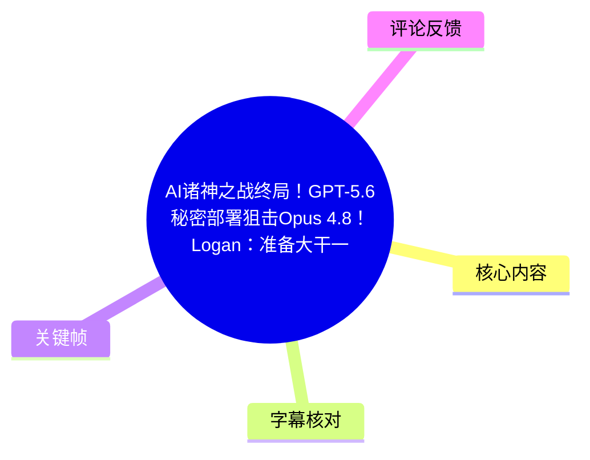
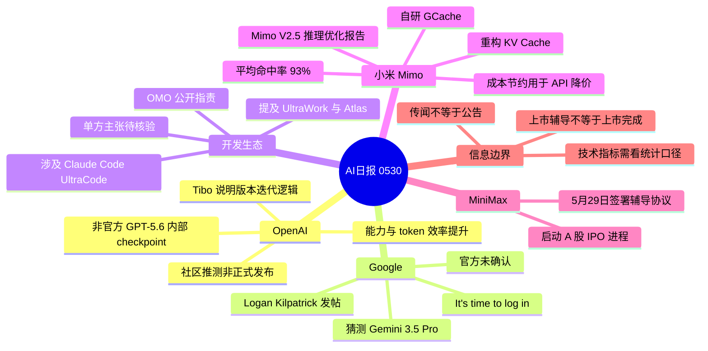
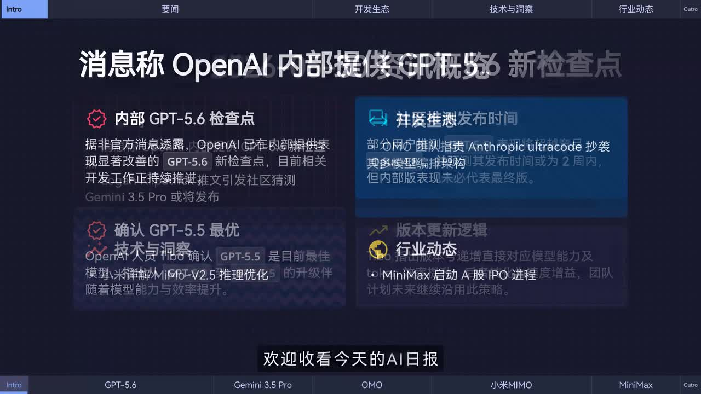
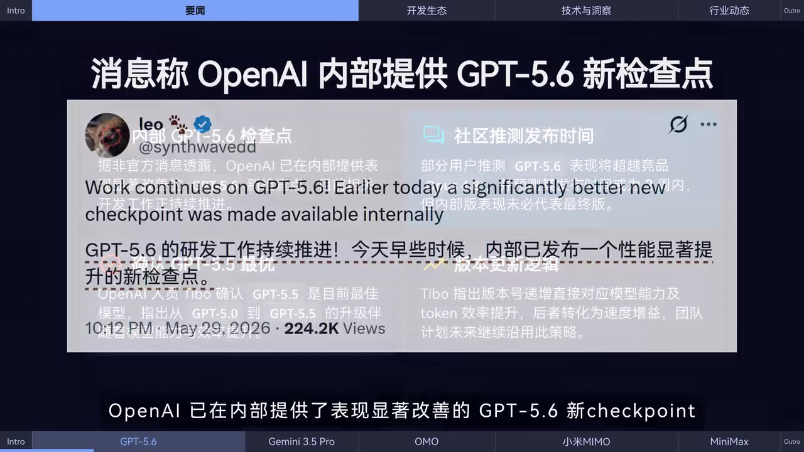
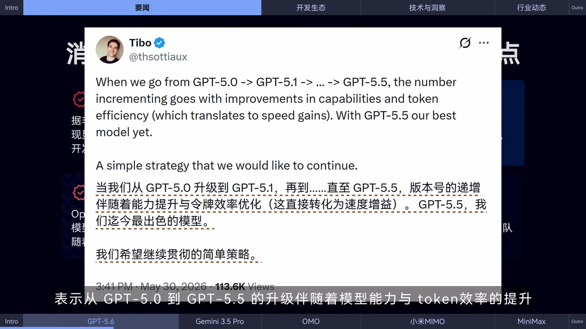
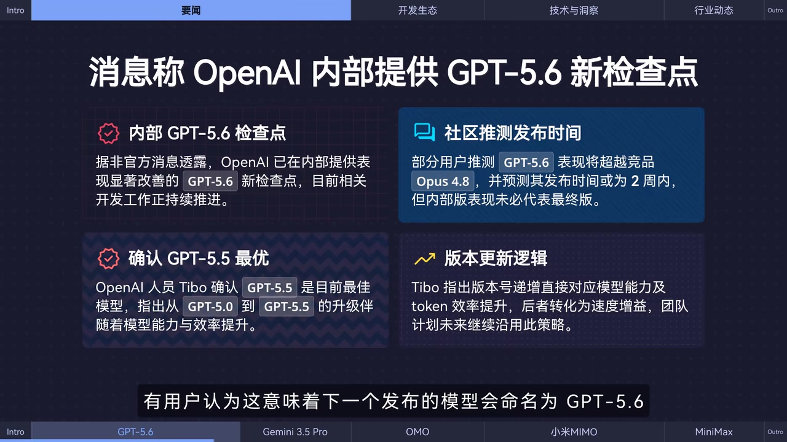

## 小结

这是一则时长约 88 秒的 AI 行业日报，聚焦 OpenAI、Google、Anthropic 生态、小米 Mimo 与 MiniMax 的模型、技术和产业动态。视频的核心价值在于快速汇总多源信息；其中既有员工公开帖文、团队技术报告与媒体报道，也有非官方消息和社区猜测，阅读时必须按证据等级区分。

OpenAI 部分称，**非官方消息**显示 GPT-5.6 的一个性能显著改善的新 checkpoint 已在内部提供；OpenAI 人员 **Tibo** 的公开表述则说明，从 GPT-5.0 至 GPT-5.5 的版本递增伴随模型能力和 token 效率提升。视频没有给出 GPT-5.6 的正式发布日期、开放范围、定价或基准测试；“超过 Opus 4.8”“两周内发布”均只是社区推测。

Google 方面，视频转述团队成员 **Logan Kilpatrick** 发出 “It’s time to log in”，社区据此猜测可能涉及 Gemini 3.5 Pro；但视频明确表示官方尚未确认发布计划。Anthropic 相关内容则是 OMO 团队对 Claude Code UltraCode 模式的公开相似性指责，属于单方主张，不能直接等同于已证实的抄袭结论。

技术信息中，小米 Mimo 团队发布 Mimo V2.5 系列推理优化报告，视频称其通过重构 **KV Cache**、引入自研分布式缓存 **GCache**，使线上服务端 KV Cache 平均命中率达到 **93%**，并将节省成本用于 API 降价。该指标缺少统计口径、延迟分位数、成本数字等完整实验信息，不能直接推导为所有场景的性能提升。

产业方面，视频称 MiniMax 于 5 月 29 日与中信证券签署辅导协议，启动 A 股 IPO 进程，并提及其此前已于当年 1 月在港交所上市。辅导协议只代表上市筹备环节，不等于已经完成发行或挂牌。本视频适合关注模型迭代、推理服务优化和 AI 产业动态的读者作为线索清单使用。

## 思维导图

## 目录

- [新闻范围、来源与时效性](#新闻范围来源与时效性)
- [OpenAI：GPT-56 checkpoint 与版本迭代逻辑](#openai-gpt-56-checkpoint-与版本迭代逻辑)
- [Google：Logan 帖文与 Gemini 猜测](#google-logan-帖文与-gemini-猜测)
- [开发生态争议：OMO 对 UltraCode 的公开指责](#开发生态争议omo-对-ultracode-的公开指责)
- [小米 Mimo：KV Cache、GCache 与 93% 命中率](#小米-mimo-kv-cachegcache-与-93-命中率)
- [MiniMax：A 股 IPO 辅导消息](#minimax-a-股-ipo-辅导消息)
- [信息核验步骤与技术限制](#信息核验步骤与技术限制)
- [结论与限制](#结论与限制)
- [字幕比对](#字幕比对)
- [评论分析](#评论分析)
- [处理记录](#处理记录)

## 新闻范围、来源与时效性 [00:00](https://www.bilibili.com/video/BV1TSVV6WEd6?t=0)

视频以连续旁白形式播报以下五类信息：

1. OpenAI 内部 GPT-5.6 新 checkpoint 的非官方消息；
2. Tibo 对 GPT-5.0 至 GPT-5.5 版本升级逻辑的解释；
3. Logan Kilpatrick 帖文引发的 Gemini 3.5 Pro 猜测；
4. OMO 团队对 Anthropic/Claude Code UltraCode 模式的相似性指责；
5. Mimo V2.5 推理缓存优化与 MiniMax A 股 IPO 辅导消息。

| 主题 | 视频中的来源表述 | 应采用的事实等级 |
| --- | --- | --- |
| GPT-5.6 内部 checkpoint | “据非官方消息透露” | 未获正式公告确认 |
| Tibo 的版本解释 | OpenAI 人员发文 | 有画面帖文作为旁证 |
| Gemini 3.5 Pro | 社区用户推测 | 推测，Google 未确认 |
| UltraCode 相似性争议 | OMO 团队公开指责 | 单方主张，待独立证据验证 |
| Mimo V2.5 缓存指标 | 团队报告、官方称 | 官方技术宣称，需核对原始报告 |
| MiniMax IPO | 据媒体报道 | 需以公司、券商或监管披露为准 |

> 图：该帧呈现视频的日报版式及 GPT-5.6、Gemini 3.5 Pro、OMO、小米 Mimo、MiniMax 等栏目。其价值在于确认视频是多条行业短讯的汇总，并非单一产品的正式发布内容。

视频标题中的“终局”“秘密部署狙击”等属于较强叙事表达；从旁白和画面证据看，正文更多是模型传闻、社区讨论、技术报告及产业报道的汇集。相关状态可能在视频发布后发生变化，应将其视作当时的信息快照。

## OpenAI：GPT-5.6 checkpoint 与版本迭代逻辑 [00:00](https://www.bilibili.com/video/BV1TSVV6WEd6?t=0)

### 非官方的内部 checkpoint 消息 [00:00](https://www.bilibili.com/video/BV1TSVV6WEd6?t=0)

旁白称，OpenAI 已在内部提供一个表现显著改善的 **GPT-5.6 新 checkpoint**，相关研发仍在推进。画面中展示的英文帖文写道：

> Work continues on GPT-5.6! Earlier today a significantly better new checkpoint was made available internally.

这只能说明视频引用的消息指向“内部可用的新检查点”。**内部 checkpoint 不等于公开上线**：它不必然意味着 ChatGPT、API 或所有用户可以使用，也不能据此推断最终模型的能力、名称、价格或发布日期。

> 图：该帧保留了视频引用的英文原帖及中文整理信息，是“内部提供新 checkpoint”说法的画面依据。它同时说明该内容没有呈现正式产品页或公开发布公告。

画面信息卡还整理了“部分用户推测 GPT-5.6 将超越 Opus 4.8、发布时间或为两周内”。对此应严格保留边界：

- 与 Opus 4.8 的比较没有展示统一任务集、提示词、采样参数或评分；
- “两周内”是社区发布时间预测；
- 内部版本与最终公开版本可能不同；
- 视频未提供 OpenAI 官方确认。

### Tibo：能力与 token 效率是版本迭代的关联指标 [00:12](https://www.bilibili.com/video/BV1TSVV6WEd6?t=12)

视频引用 Tibo 的帖文，称从 GPT-5.0 升级至 GPT-5.1、再至 GPT-5.5 时，版本号递增伴随模型能力与 token 效率改善；其中 token 效率改善会转化为速度增益。帖文还称 GPT-5.5 是当时“最好的模型”，并表示希望延续这一简单策略。

> 图：该帧展示 Tibo 的英文原帖和视频中的中文翻译，是理解“能力提升 + token 效率优化”这一版本策略的直接画面证据。

可从视频中确认的技术关系如下：

| 概念 | 视频表达 | 可得出的结论 | 不能得出的结论 |
| --- | --- | --- | --- |
| 模型能力 | 版本增长伴随能力提升 | 版本升级目标包含能力改善 | 不知道具体在哪些 benchmark 上提升多少 |
| token 效率 | 会转化为速度增益 | 效率是性能体验的重要方向 | 不知道采用了何种训练、推理或服务优化手段 |
| GPT-5.5 | “目前最好的模型” | 这是 Tibo 在帖文中的表述 | 不能延伸为其在所有任务或所有竞品中绝对领先 |
| GPT-5.6 命名 | 用户据版本序列推测 | 这是社区推断 | 不构成官方命名确认 |

> 图：该帧将内部 checkpoint、社区发布时间猜测、GPT-5.5 表述和版本更新逻辑并列呈现，有助于区分“原始帖文”“视频整理”和“社区推测”三种不同证据层级。

## Google：Logan 帖文与 Gemini 猜测 [00:24](https://www.bilibili.com/video/BV1TSVV6WEd6?t=24)

视频称，Google 团队成员 **Logan Kilpatrick** 发文：

> It’s time to log in.

这则短帖引发社区对新一代模型的讨论；视频提到，有用户推测可能涉及 **Gemini 3.5 Pro**。但旁白明确说明：**官方尚未确认任何发布计划。**

因此，当前可稳妥记录的内容仅包括：

- 视频转述 Logan Kilpatrick 发布了上述短句；
- 社区将其解读为潜在新模型信号；
- Gemini 3.5 Pro 并未在视频中被作为已经正式发布的产品陈述。

如需进一步核验，应按以下顺序处理：

1. 查看原帖是否有后续回复、链接或补充说明；
2. 查询 Google、Google DeepMind、Gemini 官方博客及开发者文档；
3. 若出现模型页面，再核对模型名称、地区、上下文窗口、价格与 API 标识；
4. 在正式文档出现前，不将社交平台短句当作产品路线图。

## 开发生态争议：OMO 对 UltraCode 的公开指责 [00:48](https://www.bilibili.com/video/BV1TSVV6WEd6?t=48)

视频称，开源框架 **OMO 团队**在 X 上公开指责 Anthropic 随 Opus 4.8 推出的 Claude Code **UltraCode 模式**，称其多模型编排架构与 OMO 团队去年开发的 **UltraWork**、**Atlas** 高度相似。

视频没有展示双方的完整代码、提交记录、产品发布时间线、架构设计文档、许可证说明或 Anthropic 的回应。因此，以下表述是准确边界：

- **可以记录：**OMO 团队提出了公开相似性指责；
- **不能断定：**Anthropic 或 UltraCode 已构成抄袭、侵权或未经授权复用；
- **需要补充：**具体功能比对、源代码相似性、首次公开时间、许可证和双方回应。

多模型编排通常指在同一任务流中，基于能力、成本、延迟、上下文或任务类型，将多个模型、工具或代理角色进行路由和协作。模型路由、多代理协作、回退机制等本身可能是通用设计理念；是否构成不当复制，需要进入具体实现和证据层面判断。

## 小米 Mimo：KV Cache、GCache 与 93% 命中率 [00:48](https://www.bilibili.com/video/BV1TSVV6WEd6?t=48)

视频称，小米 Mimo 团队发布 **Mimo V2.5 系列模型推理优化技术报告**。旁白描述的技术路径是：

1. 重构 **KV Cache** 系统；
2. 引入自研分布式缓存 **GCache**；
3. 释放 Hybrid SWA 架构的效率潜力；
4. 使线上服务端 KV Cache 平均命中率达到 **93%**；
5. 将由此节省的成本通过 API 降价回馈用户。

### 参数与信息边界

| 项目 | 视频提供的信息 | 限制 |
| --- | --- | --- |
| 报告对象 | Mimo V2.5 系列模型推理优化 | 未提供报告链接、模型规模或完整实验数据 |
| 优化对象 | KV Cache 系统 | 未说明具体缓存粒度、容量与失效策略 |
| 分布式缓存 | GCache | 未说明一致性、跨节点路由、容灾或淘汰机制 |
| 架构名称 | Hybrid SWA | 视频未解释完整技术定义和窗口参数 |
| 核心指标 | 平均命中率 93% | 未给出统计周期、样本分布及命中率分母 |
| 商业结果 | API 降价 | 未披露具体降幅、产品 SKU 或生效时间 |

**KV Cache** 是 Transformer 推理中对历史 token 的 Key/Value 状态进行复用的机制。若请求上下文与已有缓存可复用，通常可减少前文重复计算，从而有机会改善首 token 延迟、吞吐量或单位推理成本。

但“平均命中率 93%”不应被直接解释为“所有用户响应速度提升 93%”或“成本下降 93%”。实际体验还取决于请求上下文重合度、缓存对象大小、网络传输、并发、模型结构、未命中比例和服务端调度。

## MiniMax：A 股 IPO 辅导消息 [01:12](https://www.bilibili.com/video/BV1TSVV6WEd6?t=72)

视频称，据媒体报道，**MiniMax 于 5 月 29 日与中信证券签署辅导协议，正式启动 A 股 IPO 进程**；旁白同时提及公司已于当年 1 月在港交所上市。

应注意上市流程的阶段差异：

| 阶段 | 含义 |
| --- | --- |
| 签署辅导协议 / 启动辅导 | 上市前筹备与规范阶段 |
| 递交材料 | 公司向相关机构提交申报文件 |
| 受理与审核 | 监管或交易所审核阶段 |
| 发行与挂牌 | 完成发行并实际上市交易 |

因此，视频中的“启动 A 股 IPO 进程”可理解为进入上市筹备程序，**不等于已经提交招股书、获得受理、完成发行或挂牌**。拟上市板块、募资规模、具体时间表等信息均未在提供素材中出现，仍需以公司、券商、交易所或监管披露为准。

## 信息核验步骤与技术限制 [00:00](https://www.bilibili.com/video/BV1TSVV6WEd6?t=0)

本视频并未提供可执行的安装命令、代码示例、模型 API 配置或复现实验流程。其可迁移的实践价值主要是对 AI 快讯进行信息分层和验证。

### 核验模型发布传闻的步骤

1. **标记来源。**区分官方产品页、官方员工个人账号、媒体、社区转述与匿名爆料。
2. **区分状态。**内部 checkpoint、测试、灰度、研究预览、API 上线和正式公开不是同一状态。
3. **要求对比条件。**涉及“超越竞品”时，需检查测试任务、模型版本、提示词、采样参数、成本与测试日期。
4. **寻找一手文档。**优先核对模型卡、API 文档、价格页、发布博客或官方公告。
5. **避免从命名推导发布。**版本序列的逻辑可以提供线索，但不构成正式产品承诺。

### 核验推理优化指标的步骤

1. 确认 KV Cache 命中率的分母是缓存查询、请求数还是 token 数；
2. 区分线上全量数据、特定业务数据与压测数据；
3. 同时考察首 token 延迟、端到端延迟、吞吐量、P95/P99 和单位成本；
4. 判断高命中率是否来自重复上下文较多的特定业务；
5. 对 API 降价，以正式价格页、SKU 和生效日期为准。

## 结论与限制 [01:12](https://www.bilibili.com/video/BV1TSVV6WEd6?t=72)

本期日报将下一代模型传闻、推理系统优化、开源生态争议和资本市场动态压缩在短视频内。对于技术观察者，Mimo V2.5 的 KV Cache/GCache 方向值得持续追踪；对于产品观察者，GPT-5.6 和 Gemini 相关讨论反映了市场对模型迭代的关注。

但视频中存在明确的信息边界：

- GPT-5.6 内部 checkpoint 来自非官方消息，不等同于正式发布；
- GPT-5.6 超越 Opus 4.8、两周内发布，以及 Gemini 3.5 Pro 均为社区推测；
- OMO 对 UltraCode 的指责属于单方公开主张，尚无视频内的独立证据闭环；
- Mimo 的 93% 是视频转述的官方指标，缺少完整测量口径和横向对照；
- MiniMax 的上市动态来自媒体报道，辅导阶段并不代表最终上市完成。

最稳妥的使用方式，是把本视频作为后续检索官方公告、技术报告和监管披露的线索索引，而不是作为模型能力、发布计划、技术归属或资本市场结果的最终证明。

## 字幕比对 [00:00](https://www.bilibili.com/video/BV1TSVV6WEd6?t=0)

| 字幕来源 | 完整性 | 专有名词 | 时间轴 | 主要问题 |
| --- | --- | --- | --- | --- |
| Bilibili 站内字幕 `p01-ai-zh.srt` | 覆盖约 00:00.120–01:02.760，但内容与本片不匹配 | 未出现 OpenAI、GPT、Mimo、MiniMax 等核心名词 | SRT 起止时间有效 | 内容为生活感悟文案，如“无法改变现状，那就享受当下”，与实际视频新闻旁白不符 |
| 本次 ASR | 诊断显示语音覆盖约 99.27%，覆盖 00:00.270–01:26.920 | 主体可辨，但存在人名、公司名和技术术语误识 | `asr-result.json` 的分段秒数与 88 秒视频时长一致 | 分段过长；ASR SRT 第 3、4 段显示为 01:12、01:26，和诊断 JSON 的 72.42、86.92 秒存在格式性不一致 |

### 最终字幕选择

最终采用**本次 ASR 的内容与 `asr-result.json` 时间戳**作为正文时间轴依据，站内字幕不采用。原因是站内字幕虽有真实时间段，却与视频音频和画面主题完全不一致。

本次 ASR 诊断未标记 `noAudioStream=true`。相反，结果显示检测到中文音频，音频时长约 **87.28 秒**、语音覆盖率约 **99.27%**，因此本片不是无音轨视频。

### 关键术语校正

| ASR 原始转写 | 正文采用写法 | 校正依据 |
| --- | --- | --- |
| `Teebo` | Tibo | 关键帧帖文账号名 |
| `GPt5.0`、`GP t5.5`、`GP T5.6` | GPT-5.0、GPT-5.5、GPT-5.6 | 画面与上下文 |
| `Cloud Code UltraCode` | Claude Code UltraCode | Anthropic 产品上下文 |
| `KVCash` | KV Cache | 推理技术术语 |
| `Gcash` | GCache | 视频所称自研分布式缓存 |
| `亚米Memo` | 小米 Mimo | 画面栏目文字与旁白语义 |
| `社匯讨论` | 社群讨论 | 语义校正，无法从现有素材进一步确定具体平台 |

## 评论分析 [00:00](https://www.bilibili.com/video/BV1TSVV6WEd6?t=0)

仅分析本次可获取的热评前三条。评论体现观众态度，不作为已验证事实使用。

### 1. Gemini 的产品体验批评

- **评论者：**灼燃志-ReFireAgain
- **获赞：**281
- **观点：**评论者认为 Gemini 存在能力落后、审查敏感和表现随机下降的问题。
- **分析：**这反映一部分用户对现有 Gemini 使用体验的负面感受，也与视频中社区对 Gemini 3.5 Pro 的期待形成对照。
- **可信度边界：**评论未说明具体模型版本、地区、任务、提示词或测试时间，不能据此得出 Gemini 整体性能结论。

### 2. 对 UltraCode 相似性争议的支持性立场

- **评论者：**fjqz177
- **获赞：**260
- **观点：**评论者称自己去年已使用 `opencode + omo`，认同对 Ultra 模式的质疑，并批评 Anthropic 在蒸馏问题上存在双重标准。
- **分析：**评论提供了潜在的用户使用时间线，也显示部分观众倾向把此次争议放进开源工具、模型蒸馏和平台治理的长期冲突中理解。
- **可信度边界：**个人使用经历、功能相似性判断和“蒸馏别人”的指控均未附代码、版本、日期或原始证据，属于个人立场。

### 3. 对更新时点的反馈

- **评论者：**鹿头可爱捏
- **获赞：**201
- **观点：**“今天这么晚”。
- **分析：**该评论只反映观众对本期日报发布时间的感知，不涉及新闻真实性、模型能力或技术实现。
- **可信度边界：**没有提供频道既往更新频率或时段对比，不能据此判断更新策略发生变化。

## 处理记录 [00:00](https://www.bilibili.com/video/BV1TSVV6WEd6?t=0)

- **Worker ID：**worker-mrj0wbly-5dc4e50c
- **模型：**gpt-5.6-terra
- **使用工具与产物：**视频元数据、音频 `audio/audio.wav`、ASR 结果 `asr/asr-result.json`、ASR 字幕 `asr/transcript.srt`、站内字幕 `subtitles/p01-ai-zh.srt`、关键帧 `frames/`、热评 `comments/comments.json`。
- **字幕选择：**已检查站内字幕与本次 ASR。站内字幕内容与本片新闻旁白不符，故未采用；正文采用 ASR 内容和诊断 JSON 的真实秒数，并结合画面校正术语。
- **时间轴依据：**采用 `asr-result.json` 中的真实分段起点 0.27、24.36、48.39、72.42 秒；这些数值与视频总时长 88 秒一致。
- **关键帧依据：**使用 `frame-001` 说明日报总览；使用 `frame-002` 说明 GPT-5.6 内部 checkpoint 消息；使用 `frame-003` 说明 Tibo 的版本逻辑；使用 `frame-004` 说明信息分层。未对未被提供画面内容支撑的其他帧作推断性描述。
- **缓存清理：**未提供缓存清理执行日志；未虚构缓存清理已完成。
- **未解决问题：**未提供 GPT-5.6、Gemini 3.5 Pro、UltraCode、Mimo V2.5 报告与 MiniMax IPO 的完整原始链接或官方文件，无法独立验证传闻、性能比较、争议归属及上市状态。

## 评论分析

- 热评 1：Gemini：喜欢我落后一代+超绝敏感肌审查+所有时间随机降智吗
- 热评 2：claude经典双标了，我去年就在用opencode+omo了，之前a÷封禁他们的时候我就觉得很搞笑，现在抄袭ultra模式我一点也不意外，之前还指责国模“蒸馏攻击”，结果现在opus4.7 4.8蒸馏别人，降本增效就不说话了
- 热评 3：今天这么晚

以上内容是观众反馈摘录，只用于补充理解视频反响，不作为正文事实依据。
