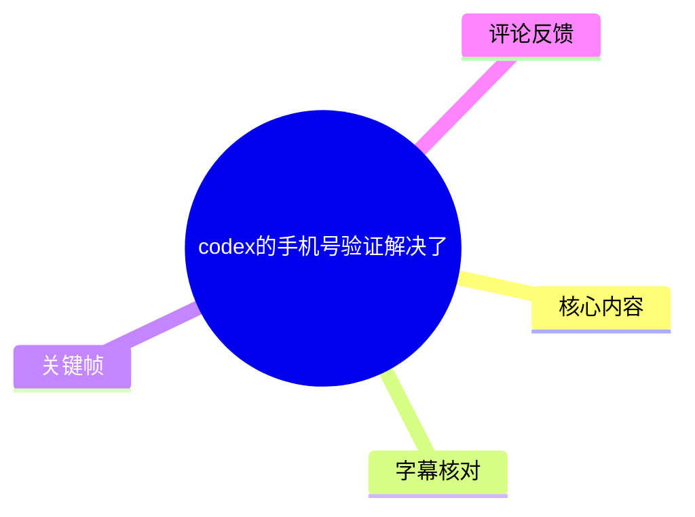
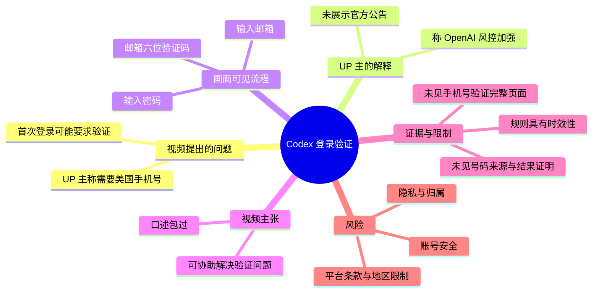
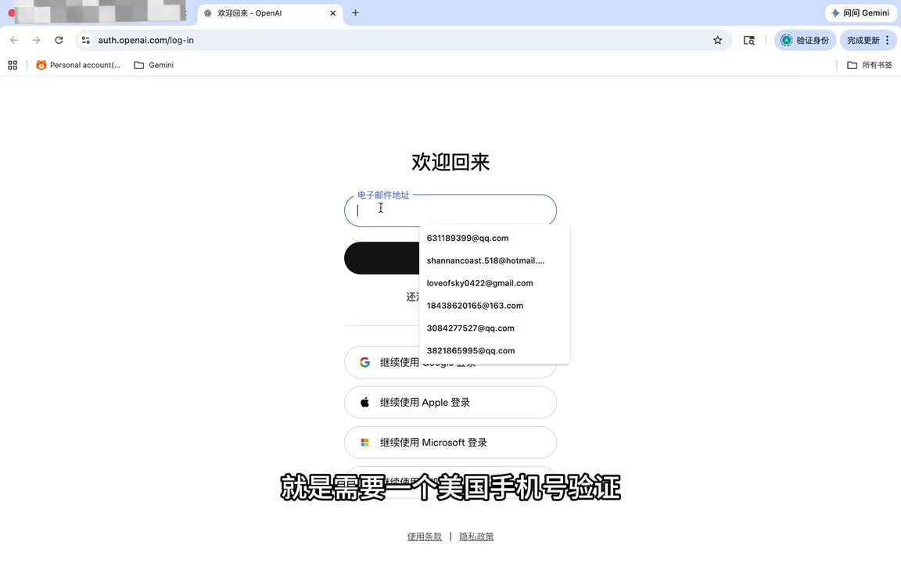
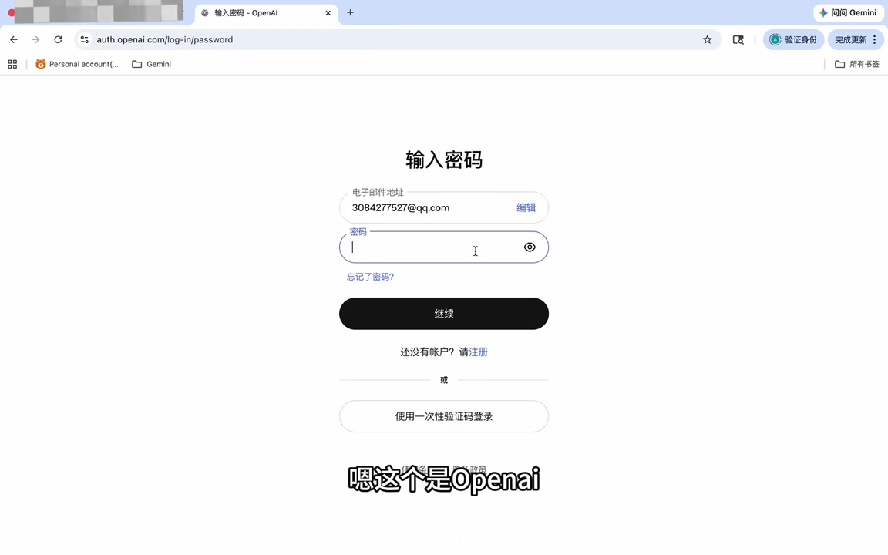
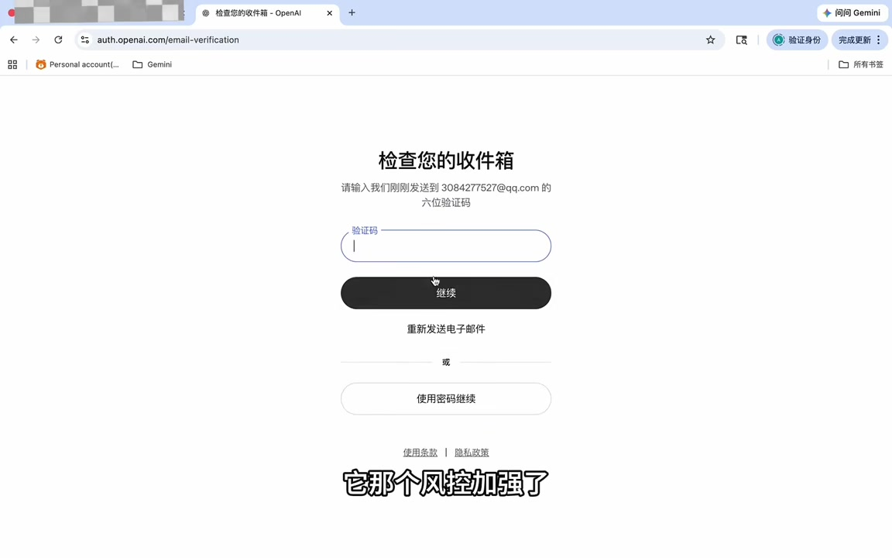

# codex的手机号验证解决了

> 来源：[Bilibili 视频](https://www.bilibili.com/video/BV1poRrBoE7o) 
> UP 主：为了美梦｜发布时间：2026-05-05｜视频时长：28 秒｜分辨率：1728×1080

## 小结

视频讨论的是登录 **Codex** 时可能出现的验证门槛。UP 主称，部分用户首次登录时会被要求进行“美国手机号验证”，并将这一变化归因于 OpenAI“风控加强”。

视频以浏览器中的 OpenAI 登录页面为例，依次展示了输入邮箱、输入密码、检查邮箱并输入六位验证码的流程。UP 主口述称其可协助解决手机号验证问题，并以“包过”描述结果。

需要区分两类信息：**“首次登录需美国手机号验证”“系 OpenAI 风控加强所致”是 UP 主的个人陈述**，视频未展示 OpenAI 的官方公告、具体风控规则、手机号验证页面、号码来源或实际完成手机号验证的完整证据。所给画面中较明确可见的是邮箱登录与邮箱六位验证码验证。

该内容不提供可复现的手机号验证绕过、代验或第三方号码使用方法。验证规则涉及账号安全、地区限制与平台条款；使用他人号码、临时号码或委托代验可能带来账号归属、隐私、封禁及支付纠纷风险。

适合遇到 Codex/OpenAI 登录验证提示、希望了解视频具体主张和证据边界的读者。由于登录策略、地区可用性和风控要求可能随时调整，视频中的现象仅能代表其录制时所见，不能据此推断为所有账号的通用规则。

## 思维导图

## 目录

- [问题背景与视频主张](#问题背景与视频主张)
- [登录页面与验证流程](#登录页面与验证流程)
- [UP 主提供的结论与证据边界](#up-主提供的结论与证据边界)
- [操作信息、参数与合规限制](#操作信息参数与合规限制)
- [关键帧索引](#关键帧索引)
- [结论与时效性](#结论与时效性)
- [字幕比对](#字幕比对)
- [评论分析](#评论分析)
- [处理记录](#处理记录)

## [问题背景与视频主张](https://www.bilibili.com/video/BV1poRrBoE7o?t=0)

站内字幕在 **00:00:00.100—00:00:05.450** 记录，UP 主询问观众最近登录“Codex”是否遇到问题，并称问题是“需要一个美国手机号验证”。

随后在 **00:00:05.450—00:00:10.450**，UP 主将该现象解释为“OpenAI 风控加强了”，并称首次登录需要验证。这个解释是视频中的口述判断，而非视频内已被官方材料证实的政策说明。

> 图：画面显示 OpenAI“欢迎回来”登录页，中央为邮箱地址输入框，并非手机号输入界面。它能帮助辨别视频所处的登录阶段，但不能单独证明该账号必然会被要求进行美国手机号验证。

### 视频所说的对象与范围

- **对象**：视频口述为“CodeX/Codex”登录过程，浏览器地址栏和页面视觉内容指向 OpenAI 认证页面。
- **触发条件（UP 主说法）**：首次登录。
- **验证类型（UP 主说法）**：美国手机号验证。
- **画面实际可见的验证类型**：邮箱登录后的六位验证码验证。
- **未给出的信息**：受影响账号类型、地区、网络环境、订阅状态、是否所有首次登录都会触发、手机号验证的具体表单与官方错误提示。

因此，视频能说明 UP 主遇到或描述过登录验证障碍，但不足以建立“所有 Codex 用户均须美国手机号验证”的普遍结论。

## [登录页面与验证流程](https://www.bilibili.com/video/BV1poRrBoE7o?t=10)

### [进入账号并出现验证提示](https://www.bilibili.com/video/BV1poRrBoE7o?t=10)

在 **00:00:10.450—00:00:16.890**，UP 主称“我这个号”“一进来他就需要验证一下”，并表示可以解决该问题。该时间段没有在现有字幕或所给关键帧中提供可核验的手机号填写、短信接收或号码归属信息。

> 图：画面显示 OpenAI 的“输入密码”页面，可见邮箱、密码输入框、“继续”按钮，以及“使用一次性验证码登录”选项。这说明视频至少展示了账号密码登录路径；页面本身并未展示美国手机号验证控件。

### [输入验证码并继续](https://www.bilibili.com/video/BV1poRrBoE7o?t=16)

在 **00:00:16.890—00:00:22.030**，UP 主口述“输入进去继续收到验证码，然后输入进去就可以了”。站内字幕将其明确分段为：

1. **00:00:16.890—00:00:20.190**：输入后继续，收到验证码；
2. **00:00:20.190—00:00:21.330**：输入验证码即可；
3. **00:00:21.330—00:00:22.030**：称流程“非常简单”。

> 图：画面显示“检查您的收件箱”页面，提示输入发送至邮箱的“六位验证码”，并提供“继续”“重新发送电子邮件”“使用密码继续”等选项。它是视频中最直接的验证步骤证据，但其性质是**邮箱验证码**，不能与手机号短信验证码混同。

### 可从画面确认的操作顺序

以下仅整理视频可见的通用登录步骤，不包含任何规避或代办验证的操作：

1. 在 OpenAI 登录页输入邮箱地址；
2. 进入密码输入页，输入账号密码，或选择页面提供的一次性验证码登录方式；
3. 出现“检查您的收件箱”页面后，从账号邮箱取得六位验证码；
4. 将验证码填入页面并点击“继续”。

视频没有展示上述步骤完成后进入 Codex 的界面，也没有展示手机号验证表单或短信验证码输入。因此，流程的可验证终点是“存在邮箱验证码验证页”，而不是“手机号验证已经完成”。

## [UP 主提供的结论与证据边界](https://www.bilibili.com/video/BV1poRrBoE7o?t=22)

在 **00:00:22.030—00:00:26.440**，UP 主两次表示“大家找我”“我可以帮大家解决这个问题”，并在结尾说“包过的包过”。

### 视频明确表达的承诺

- UP 主声称能够协助解决其所述的验证问题；
- UP 主以“包过”作结果性表述；
- 视频未说明服务方式、费用、所需资料、隐私处理规则、失败条件、售后安排或责任边界。

### 不应从视频推出的结论

以下内容均未被视频证明，不应视为既成事实：

- OpenAI 已正式对所有 Codex 首次登录强制实施美国手机号验证；
- 该限制只与“风控加强”有关；
- UP 主的方式符合 OpenAI 的服务条款；
- “包过”适用于所有账号、地区和时间；
- 使用第三方协助不会产生账号安全、身份验证或隐私风险。

## [操作信息、参数与合规限制](https://www.bilibili.com/video/BV1poRrBoE7o?t=16)

### 视频中出现的可确认参数

| 项目 | 内容 | 证据状态 |
| --- | --- | --- |
| 视频总时长 | 28 秒 | 视频元数据 |
| 画面分辨率 | 1728×1080 | 视频元数据 |
| 登录站点 | OpenAI 认证页面 | 浏览器画面可见 |
| 登录输入项 | 邮箱、密码 | 关键帧可见 |
| 邮箱验证码长度 | 六位 | 邮箱验证页文字可见 |
| 视频声称的手机号地区 | 美国 | UP 主口述/站内字幕 |
| “首次登录需验证” | UP 主的描述 | 未见官方规则或完整触发证据 |
| “包过” | UP 主承诺 | 未提供可复核条件 |

### 账号安全与合规边界

手机号验证是服务方用于账号安全、地区资格或滥用防控的机制之一。对于视频中“代解决”“包过”一类表述，应保持审慎：

- 不应向不可信第三方提供账号密码、邮箱验证码、会话令牌、恢复码或身份材料。
- 不应把他人接收的短信/邮箱验证码转交给第三方；验证码可能直接授予登录或账号恢复权限。
- 应优先使用 OpenAI 官方登录、支持渠道和符合账户所在地要求的验证方式。
- 如果账号页面明确要求某类验证，应核对服务条款、地区可用性与账号信息是否一致；视频未提供可替代的合规方案。
- 任何“保证通过”的承诺都缺少可验证条件，且平台规则改变后可能失效。

## [关键帧索引](https://www.bilibili.com/video/BV1poRrBoE7o?t=0)

| 关键帧 | 正文用途 | 画面价值 |
| --- | --- | --- |
| `frames/frame-002.jpg` | 说明视频从 OpenAI 登录页开始 | 可验证页面是邮箱登录页，并帮助区分“口述手机号验证”与“画面中的邮箱输入” |
| `frames/frame-003.jpg` | 说明账号密码登录阶段 | 可见密码输入框及一次性验证码登录选项，补足操作路径 |
| `frames/frame-004.jpg` | 说明视频实际展示的验证形式 | 清楚显示“检查您的收件箱”和“六位验证码”，是判断验证类型的重要依据 |

未将其余关键帧强行纳入正文：当前提供的可辨识画面已覆盖登录、密码和邮箱验证码三个核心节点；对无法从素材明确确认内容的帧，不作推断性引用。

## [结论与时效性](https://www.bilibili.com/video/BV1poRrBoE7o?t=24)

这是一条以短演示形式发布的登录验证经验视频：UP 主称 Codex 首次登录可能会触发美国手机号验证，并称能够处理该问题。视频画面确实呈现了 OpenAI 登录及邮箱六位验证码步骤，但没有完整呈现其声称的手机号验证障碍和解决结果。

可迁移的经验是：遇到登录验证时，先识别页面要求的是密码、邮箱验证码、短信验证还是身份验证，避免把不同验证机制混为一谈；再通过官方渠道确认账号与地区资格。对第三方“代验”“包过”宣传，应避免交付敏感账号凭证。

时效性方面，视频发布于 **2026-05-05**；OpenAI 的登录策略、验证码方式、地区支持和风控触发条件均可能在之后变化。本文不将 UP 主的个案描述视为当前通行规则，也不对其服务效果作背书。

## [字幕比对](https://www.bilibili.com/video/BV1poRrBoE7o?t=0)

| 字幕来源 | 完整性 | 专有名词 | 时间轴 | 主要问题 |
| --- | --- | --- | --- | --- |
| Bilibili 站内字幕 | 较完整，共 14 个细分片段，覆盖约 00:00:00.100—00:00:26.440 | 将产品写作“code叉”，需结合标题和语境校正为 Codex | 精细，可直接用于章节定位 | 个别口语停顿较多；“验证码”的接收渠道未在字幕中严格区分 |
| 本次 ASR 字幕 | 内容整体覆盖，1 个长分段，覆盖 00:00:00.000—00:00:25.980；诊断语音覆盖率 93.24% | 识别为“CodeX”，与标题对应较好 | 仅一个长时间段，难用于细粒度章节定位 | “首次登际”“验種板”等词存在明显误识别；缺少句级切分 |

### 最终字幕选择

正文以**站内字幕的分段时间轴**作为时间链接依据，因为其时间段细、可直接定位；语义上参考本次 ASR 对“CodeX”的识别，并结合视频标题统一写作 **Codex**。

本次 ASR 已实际检查：识别模型为 `medium`，语言为中文，语言置信度约 `0.9624`，音频时长约 `27.864` 秒。诊断中**没有** `noAudioStream=true` 标记，且未报告大间隔，因此本视频存在可识别音轨，不属于“无音轨视频”。

关键校正如下：

- 站内“code叉”与 ASR“CodeX”，结合标题“codex的手机号验证解决了”，正文统一为 **Codex**；
- ASR 的“首次登际”按站内字幕校正为“首次登录”；
- ASR 的“验種板”按站内字幕和上下文校正为“验证码”；
- 画面中的“检查您的收件箱”“六位验证码”用于确认所展示的是**邮箱验证码**步骤，而非直接可见的短信手机号验证步骤。

## [评论分析](https://www.bilibili.com/video/BV1poRrBoE7o?t=24)

仅分析当前可获取的热评前三条，不将评论内容视为已验证事实。

1. **LY轩星（2 赞）**  
   评论发布了一个“codex系列教程”的夸克网盘链接，并提示及时保存。该内容属于外部资源推广，未对本视频所称手机号验证问题提供可核验的技术说明；链接安全性、资源真实性、版权和是否仍有效均未验证，访问时应谨慎。

2. **为了美梦（3 赞）**  
   UP 主评论“包过”，与视频结尾口述一致，进一步强化其服务承诺。但评论同样未给出实现方式、限制条件或可重复验证证据，不能据此判断成功率或合规性。

3. **AI检索（1 赞）**  
   评论内容为“11”，未包含可用于判断视频准确性、操作条件或风险的信息。

整体看，前三条热评没有提供 OpenAI 官方政策来源，也没有补足手机号验证触发条件或解决过程的证据。

## [处理记录](https://www.bilibili.com/video/BV1poRrBoE7o?t=0)

- Worker ID：`worker-mrj0www4-e8d79408`
- 模型：`gpt-5.6-terra`
- 调用工具与模型：素材管线已提供合并视频、WAV 音频、关键帧、站内字幕、评论与 ASR 结果；ASR 模型为 `medium`，运行设备为 CUDA，计算类型为 `float16`。
- 使用的应用工具：基于已生成的 `asr/transcript.srt`、`asr/asr-result.json`、站内 `p01-ai-zh.srt`、`frames/` 和 `comments/comments.json` 进行整理；未补充调用外部网页或官方政策查询。
- 字幕选择：以站内字幕的 14 段真实起止时间制作时间轴；以本次 ASR 交叉核对内容和专有名词，并对 ASR 误识别词进行校正。
- 关键帧选择依据：选取 `frame-002`、`frame-003`、`frame-004`，分别对应邮箱登录、密码输入、邮箱六位验证码三个可辨识节点；尤其用最后一帧限定“实际展示的是邮箱验证”的证据范围。
- 缓存清理：提供的素材中没有缓存清理执行记录；本整理未获得可执行文件系统操作权限，不能声称已清理缓存。
- 未解决问题：未提供手机号验证页面、短信接收记录、官方风控公告、实际登录成功后的 Codex 页面，故无法验证 UP 主对触发原因、适用范围与“包过”结果的主张。

## 评论分析

- 热评 1：我用夸克网盘分享了「codex系列教程（手机夸克APP及时保存，避免失效，点击订阅可更新）」，点击链接即可保存。打开「夸克网盘APP」，无需下载在线播放视频，畅享原画5倍速，支持电视投屏。 链接：https://pan.quark.cn/s/1ae9e1151f20
- 热评 2：包过
- 热评 3：11

以上内容是观众反馈摘录，只用于补充理解视频反响，不作为正文事实依据。
