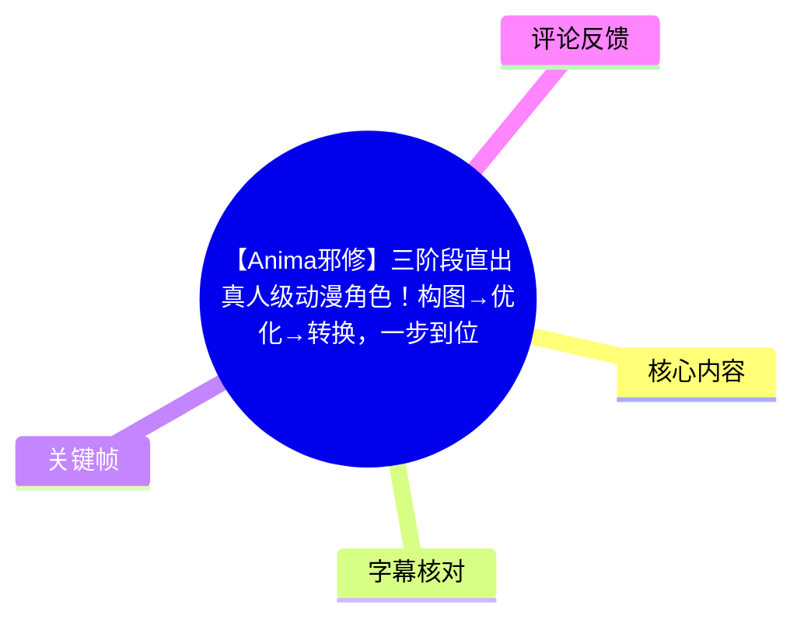
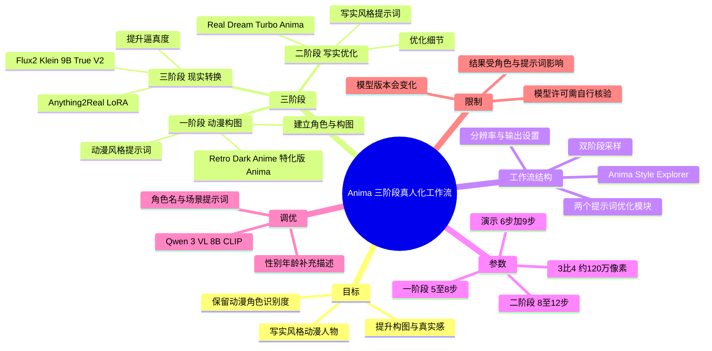
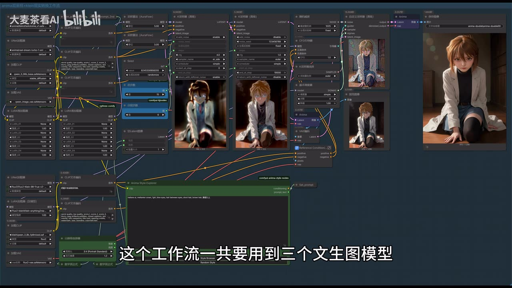
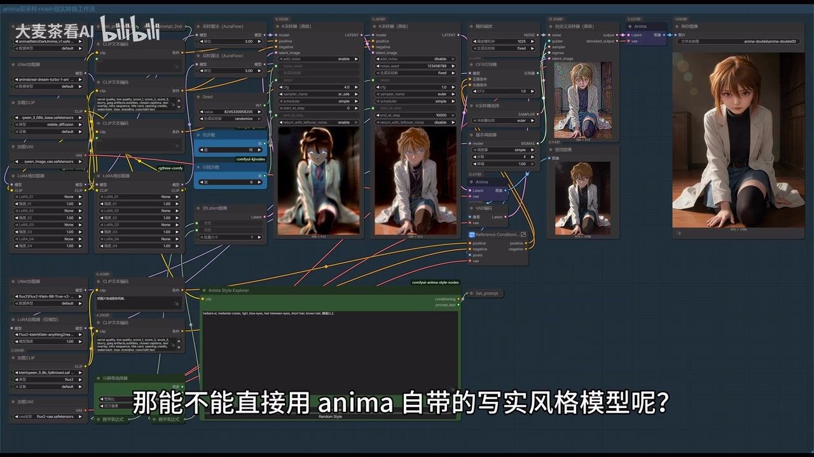
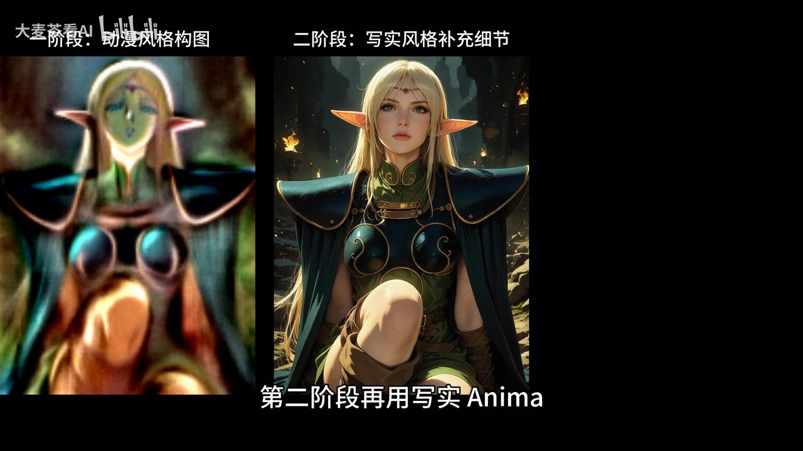
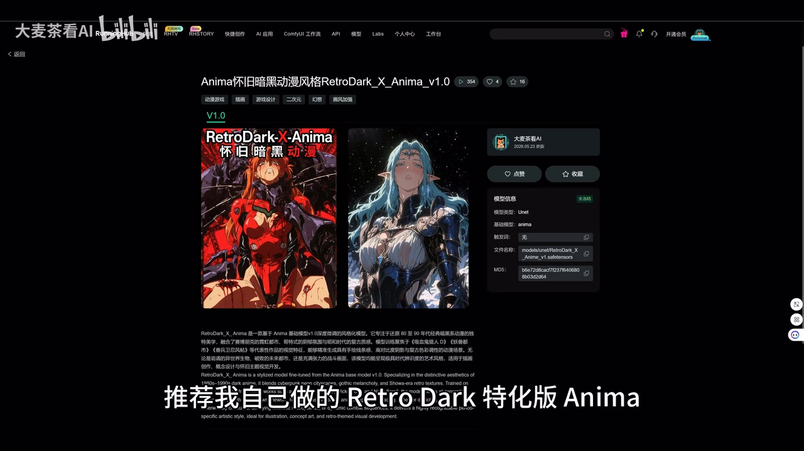
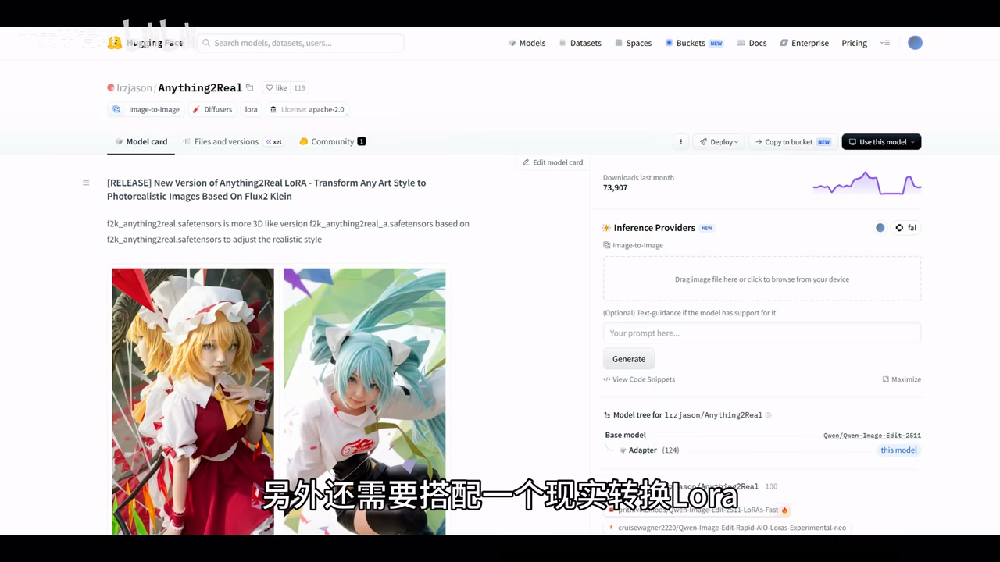
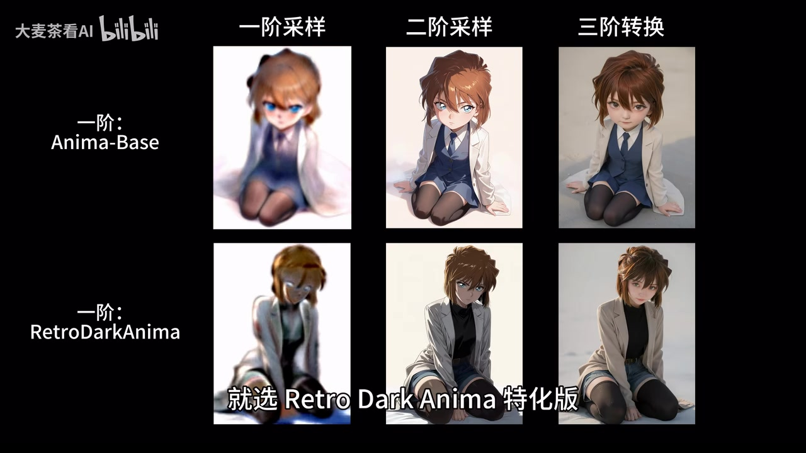

# 【Anima邪修】三阶段直出真人级动漫角色！构图→优化→转换，一步到位

> 来源：[Bilibili 视频](https://www.bilibili.com/video/BV1vAJp6MEtZ)  
> UP 主：大麦茶看AI｜分区合集：AIcode｜视频时长：04:08  
> 视频页面数据抓取时：播放 5017、收藏 503、点赞 210、投币 112、评论 35。数据会随时间变化。

## 小结

- 本视频讲解一个用于生成“偏写实真人感动漫角色”的 ComfyUI 三阶段工作流：**先用动漫模型建立角色与构图，再用写实向 Anima 模型优化细节，最后用 Klein 模型进行现实风格转换**。
- 作者的核心判断是：Anima 对动漫角色的识别能力较强，因此不建议一开始就完全抛弃动漫阶段；若直接套用 Anima 自带的写实风格，画面可能出现构图较单调、写实感有限、偏 3D 动画质感的问题。
- 工作流涉及三类主模型及一个 LoRA：一阶段推荐 `Retro Dark Anime` 特化版 Anima；二阶段推荐 `Real Dream Turbo Anima`；最终现实转换使用 `Flux2-Klein-9B-True-V2`，并搭配 `Anything2Real` LoRA。
- 提示词被拆成两个优化方向：动漫风格描述服务于一阶段采样，现实风格描述服务于二阶段采样。最终 Klein 转换阶段还可以附加人物性别、年龄、地域等描述，以减少性别或年龄跑偏。
- 参数上，作者建议一阶段采样 **5–8 步**、二阶段 **8–12 步**；演示配置为总计 **15 步**，其中一阶段 **6 步**、二阶段 **9 步**。示例画面使用 **3:4** 比例与约 **120 万像素**。
- 本方法适合已有 ComfyUI 基础、希望把动漫 IP/动漫角色转为真人化视觉的创作者。它是作者展示的模型组合与经验配置，不构成对所有角色、提示词、显卡环境或模型版本都稳定复现的保证。
- 视频中涉及模型、网盘工作流、RunningHub 页面与第三方模型库地址，均具有时效性；应以视频简介及模型发布页实际可访问状态、许可证和当前版本为准。

## 思维导图

## 目录

- [背景、目标与三阶段策略](#背景目标与三阶段策略)
- [模型选择与原版对比](#模型选择与原版对比)
- [工作流结构：提示词优化与画面生成](#工作流结构提示词优化与画面生成)
- [采样参数、CLIP 选择与人物纠偏](#采样参数clip-选择与人物纠偏)
- [实操示例：角色、分辨率与输出](#实操示例角色分辨率与输出)
- [资源、经验边界与时效性](#资源经验边界与时效性)
- [关键帧索引](#关键帧索引)
- [字幕比对](#字幕比对)
- [评论分析](#评论分析)
- [处理记录](#处理记录)

## 背景、目标与三阶段策略 [00:40](https://www.bilibili.com/video/BV1vAJp6MEtZ?t=40)

视频要解决的问题是：如何生成兼顾**动漫角色辨识度、画面构图、动态感与真人化质感**的写实风格动漫人物。

作者将流程拆为三个连续阶段，而不是直接用单一模型出图：

1. **一阶段：动漫风格采样**
   - 使用 Anima 动漫方向模型。
   - 搭配动漫风格提示词。
   - 主要职责是确定角色识别、人物比例倾向、画面构图与动漫叙事感。

2. **二阶段：写实风格采样**
   - 使用 Anima 写实方向模型。
   - 搭配写实风格提示词。
   - 在已确定的构图基础上进一步优化画面细节与写实倾向。

3. **三阶段：现实转换**
   - 使用 Klein 9B 方向模型处理现实风格转换。
   - 目标是进一步提高最终画面的逼真程度。

作者给出的逻辑是：目前 Anima 对动漫角色的识别度较高，因此动漫阶段不宜绕开；但如果直接使用其写实风格模型，可能会牺牲构图丰富度，且写实程度未必足够。因此以“**动漫构图 → 写实细化 → 现实转换**”分工，试图同时取得角色辨识、构图和真实感。

> 图：该关键帧展示了工作流的完整节点布局，并在右侧显示多阶段的中间图与最终结果。它能帮助理解“三阶段”不是三个孤立模型，而是前一阶段输出继续参与后一阶段生成的串联设计。

### 为什么不直接使用写实 Anima [01:04](https://www.bilibili.com/video/BV1vAJp6MEtZ?t=64)

作者展示并解释了不直接采用 Anima 自带写实风格模型作为唯一生成步骤的原因：

- 强行写实化后，画面构图相对于动漫模型更单调；
- 写实程度表现一般；
- 成果更容易接近 3D 动画感，而不是目标中的真人级现实感。

这是一项基于视频展示效果的作者经验判断，不代表所有提示词、种子、角色或模型版本下都必然出现同样结果。实际生成结果还会受到提示词强度、采样配置、分辨率、LoRA 权重与模型版本的共同影响。

> 图：该帧对应作者讨论“能否直接使用 Anima 写实风格模型”的位置。画面同时保留工作流和结果预览，有助于将“单阶段直出”与后文的多阶段策略联系起来。

## 模型选择与原版对比 [01:28](https://www.bilibili.com/video/BV1vAJp6MEtZ?t=88)

作者在视频中推荐的模型组合如下。模型全称以视频简介提供的下载/原始地址为准；ASR 对英文专有名词存在明显音译与识别误差，已在下表中校正。

| 阶段 | 视频推荐组件 | 作用 | 作者给出的选择理由 |
| --- | --- | --- | --- |
| 一阶段动漫采样 | `Retro Dark Anime` 特化版 Anima | 建立动漫角色、人物姿态与构图 | 作者称该特化版人物比例更接近正常真人比例 |
| 二阶段写实采样 | `Real Dream Turbo Anima` | 细化并增强写实方向 | 作者认为它在 Anima 系列中属于写实风格表现较好的选择 |
| 三阶段现实转换 | `Flux2-Klein-9B-True-V2` | 将画面向现实视觉进一步转换 | 作者称其现实转换能力较强 |
| 三阶段辅助 LoRA | `Anything2Real` | 配合现实转换 | 用于增强现实化处理 |

视频简介列出的原始模型地址包括：

- `anima-base`：`https://huggingface.co/circlestone-labs/Anima`
- `real-dream-turbo-1-anima`：`https://civitai.red/models/153568/real-dream?modelVersionId=3000170`
- `Flux2-Klein-9B-True-V2`：`https://huggingface.co/wikeeyang/Flux2-Klein-9B-True-V2`
- `anything2real`：`https://huggingface.co/lrzjason/Anything2Real`

### 原版 Anima 与特化版的取舍 [02:16](https://www.bilibili.com/video/BV1vAJp6MEtZ?t=136)

作者对一阶段采样的选择给出了明确分支：

- **追求更写实、更逼真的人物比例**：选择 `Retro Dark Anime` 特化版。
- **希望保留更多动漫味，同时带有一定写实感**：原版 Anima 也可以使用。

换言之，一阶段模型不是绝对优劣关系，而是决定最终画面的风格基线。特化版更倾向降低夸张的动漫人物比例；原版则可能保留更显著的动漫化特征。

> 图：该帧位于模型对比说明附近，右侧中间结果与最终图可帮助观察：工作流把人物从较明显的动漫形态逐步推向写实外观，而非仅靠一次生成完成转换。

## 工作流结构：提示词优化与画面生成 [02:32](https://www.bilibili.com/video/BV1vAJp6MEtZ?t=152)

作者将工作流划分为左右两个功能区。

### 左侧：两个提示词优化模块

左侧包含两个不同目标的提示词优化模块：

1. **动漫风格提示词优化**
   - 将基础提示词优化成动漫风格描述；
   - 输出接入一阶段采样的正向提示词输入。

2. **现实/写实风格提示词优化**
   - 将基础提示词优化成偏现实风格的描述；
   - 输出接入二阶段采样的正向提示词输入。

这样做的意义在于，同一个角色或场景概念，在不同阶段不使用完全相同的风格约束：第一阶段关注“动漫角色如何成立”，第二阶段再关注“如何朝写实视觉演化”。

### 右侧：画面生成与转换链路

右侧是实际图像生成部分，串联了：

- 一阶段采样；
- 二阶段采样；
- Klein 现实转换；
- LoRA 加载；
- CLIP 文本编码；
- VAE 与最终输出等相关节点。

视频画面展示的是一份已搭建完成的 ComfyUI 工作流，并非从零开始逐节点连线教学。对初学者而言，复用作者提供的工作流后，仍需自行确认本地是否安装了相应模型、节点扩展及其依赖。

> 图：这张图适合用于理解模块分工：左侧是模型、CLIP 与 LoRA 等输入，中部是采样与中间画面，右侧是输出结果，体现“提示词优化—双采样—转换”的完整数据流。

## 采样参数、CLIP 选择与人物纠偏 [02:57](https://www.bilibili.com/video/BV1vAJp6MEtZ?t=177)

### CLIP 模型选择

作者特别提到 Klein 9B 使用的 CLIP 模型会影响效果，并比较了：

- 原版 **Qwen 3 8B**；
- **Qwen 3 VL 8B**。

作者的判断是后者的“写实度”更高。这里的“更高”属于视频作者对展示结果的主观经验，未给出固定种子、相同提示词下的量化测试、对比图参数或多轮统计，因此应作为优先尝试方向，而不是普遍性能结论。

### 双阶段采样步数

作者给出的步数建议与演示设置如下：

| 项目 | 建议/演示值 |
| --- | --- |
| 一阶段采样步数 | 建议 5–8 步 |
| 二阶段采样步数 | 建议 8–12 步 |
| 总采样步数 | 演示为 15 步 |
| 演示一阶段 | 6 步 |
| 演示二阶段 | 9 步 |

可将其理解为一个起始参数区间：一阶段花较少步数确定动漫构图，二阶段投入更多步数完成写实优化。视频没有提供不同步数所对应的耗时、显存占用、采样器名称、CFG、去噪强度或 LoRA 权重的完整可读参数表，因此不能据此推导精确的硬件要求或最优配置。

### Klein 现实转换中的人物属性纠偏 [03:21](https://www.bilibili.com/video/BV1vAJp6MEtZ?t=201)

Klein 现实转换提示词的默认意图是“把图片变成现实风格”。作者补充了一个实用的纠偏方式：

- 如果转换后出现**性别错误**；
- 或者人物**年龄偏差**；

可以在默认提示词后追加具体人物描述，例如：

- `亚洲女性`
- `欧美中年男性`

这类补充并非只用于设定外貌，而是向现实转换阶段明确输入目标人物属性。它的作用是降低转换模型在重新解释人物时改变性别、年龄层或地域外观的概率，但不能保证完全消除偏差。

> 图：该帧对应参数与转换调优段落。它的价值在于展示教程讨论的不是抽象模型名称，而是可在 ComfyUI 节点图中定位的采样、文本条件和输出链路。

## 实操示例：角色、分辨率与输出 [03:45](https://www.bilibili.com/video/BV1vAJp6MEtZ?t=225)

### 使用 Anima Style Explorer 选择角色

视频使用 **Anima Style Explorer** 节点作为提示词输入框。作者说明该节点可直接搜索、选择动漫角色；其更详细用法可参考作者上一期视频。

同时，该节点也可以像普通提示词节点一样手动输入描述。因此它不是限制角色创作的唯一入口，而是提供了一个便于检索动漫角色的辅助方式。

### 演示提示词与分辨率

作者给出的演示内容为：

- 角色/主体：`最终幻想7里的蒂法`
- 场景动作：`在打篮球`
- 画面比例：`3:4`
- 像素量：约 `120 万像素`

然后点击运行，获得最终生成结果。作者评价该结果的动态感和真实度“都还不错”。

这里需要区分：

- “蒂法打篮球”“3:4”“120 万像素”是视频明确给出的演示输入与参数；
- “动态感和真实度都还不错”是作者对该次结果的评价；
- 视频没有披露固定随机种子与完整参数，因此其他用户即使采用相同文字提示，也不应预期得到完全一致的图像。

> 图：该帧展示最终输出样张。它可作为本教程目标风格的视觉参考：保留人物的动漫化特征，同时强化肤质、服装材质、光照与真人摄影感。

## 资源、经验边界与时效性 [04:06](https://www.bilibili.com/video/BV1vAJp6MEtZ?t=246)

作者表示已将工作流和模型上传至网盘，并提示链接见视频评论区；视频简介同时给出了夸克网盘、百度网盘、RunningHub 工作流页面及模型原始页面地址。

### 可迁移的工作流经验

1. **先处理角色识别与构图，再追求写实化**  
   对动漫角色任务而言，早期过强的现实化可能破坏原角色轮廓、比例或姿态叙事。分阶段处理可将“角色是否像”与“材质是否真”拆开控制。

2. **按阶段改变提示词风格目标**  
   同一基础概念需要被分别转为动漫风格描述、现实风格描述，避免让单一提示词同时承担相互牵制的风格要求。

3. **转换阶段保留可控属性描述**  
   性别、年龄、地域外观等容易在现实转换中漂移，应在转换提示中补充约束，而不是只依赖前序图像。

4. **将步数作为阶段资源分配，而非只看总步数**  
   演示中的 6 步与 9 步并非单纯追求更高总步数，而是体现“构图阶段较短、细化阶段较长”的分工。

### 限制与风险

- **模型/节点时效性**：视频发布后，模型仓库、下载链接、节点名称、依赖版本与接口兼容性都可能变化。
- **模型许可**：视频提供了模型来源，但未在口播中展开各模型的商用权限、二次分发条件和人物/角色 IP 使用边界；实际使用前需分别查看模型页许可证。
- **结果非确定性**：视频未给出完整可复现实验条件，例如完整工作流 JSON、所有节点版本、显存规格、随机种子、采样器、CFG、去噪值、LoRA 权重等。
- **角色版权与肖像风险**：示例采用既有游戏角色。用于公开发布或商业项目时，还需自行判断相关角色 IP、品牌标识、衍生创作和平台规则。
- **硬件信息缺失**：视频标签含 GPU，但未说明最低显存、生成时长、CPU/显卡型号或多模型同时加载的资源需求，不能据此估算部署门槛。
- **“真人级”属于标题表述**：视频展示的是偏写实动漫角色生成效果；“真人级”不是经过客观标准或盲测验证的技术指标。

## 关键帧索引

| 关键帧 | 正文位置 | 画面内容 | 选用价值 |
| --- | --- | --- | --- |
| [frame-003.jpg](frames/frame-003.jpg) | 三阶段策略 | 完整 ComfyUI 节点图与阶段输出 | 直接证明教程采用多模型串联，而非单模型生成 |
| [frame-004.jpg](frames/frame-004.jpg) | 直接写实化问题 | 工作流与样张同屏 | 对应作者讨论的单阶段写实化取舍 |
| [frame-005.jpg](frames/frame-005.jpg) | 模型选择与对比 | 中间图、最终图及节点 | 有助于理解原版与特化版的风格选择 |
| [frame-006.jpg](frames/frame-006.jpg) | 工作流结构 | 提示词、采样、模型加载、输出全链路 | 适合作为节点分区说明的视觉依据 |
| [frame-007.jpg](frames/frame-007.jpg) | 参数与纠偏 | 采样/条件节点与阶段图 | 对应步数、CLIP 与现实转换提示词讨论 |
| [frame-008.jpg](frames/frame-008.jpg) | 实操输出 | 偏写实动漫人物成图 | 用于呈现视频所追求的最终视觉方向 |

## 字幕比对

| 字幕来源 | 完整性 | 专有名词 | 时间轴 | 主要问题 |
| --- | --- | --- | --- | --- |
| Bilibili 站内字幕 | 未提供可用字幕 | 无法核验 | 无法使用 | 本次素材中没有可用的站内 SRT/字幕文本 |
| 本次 ASR 字幕 | 较完整，覆盖 00:40.500–04:06.960；诊断语音覆盖率 82.26% | 存在多处英文模型名音译/错识别 | 完整提供 9 个带起止时间的 SRT 分段 | 前 40.5 秒没有可用口播转写；部分“动漫/写实/采样”等词及模型名称出现错字或近音字 |

### 最终字幕选择与校正

本笔记采用**本次 ASR 的带时间轴 SRT**作为章节时间定位依据。原因是站内字幕未提供，而 ASR 识别到有效中文音轨，语言识别置信度为 `0.9990234375`，并且提供了精确的分段起止时间。

ASR 没有标记 `noAudioStream=true`；相反，素材中存在音频文件且 ASR 成功识别出约 203.47 秒语音。因此不存在“源视频没有音轨”的情况。

结合视频简介中的原始模型地址、关键帧工作流文字与上下文，对 ASR 中的重要名称作如下校正：

| ASR 近似识别 | 本文采用的校正名称 | 校正依据 |
| --- | --- | --- |
| Anima 动漢/动漠 | Anima 动漫模型 | 上下文为动漫角色生成；“动漢/动漠”为近音错识别 |
| 写时/写诗 | 写实 | 视频语义为写实风格与现实转换 |
| Kline / Cline 9B | Flux2-Klein-9B-True-V2 / Klein 9B | 视频简介明确提供该模型名称与链接 |
| Real Dream Turbo Anima | Real Dream Turbo Anima | 视频简介列出 `real-dream-turbo-1-anima` |
| Wake Young | wikeeyang | 视频简介中 Flux2-Klein 模型 Hugging Face 链接的发布者名称 |
| Anything to Real | Anything2Real | 视频简介明确列出模型名称 |
| 千问 38B | Qwen 3 8B | ASR 将 “3 8B” 连读识别为“38B” |
| 千问 3VL8B | Qwen 3 VL 8B | 依 ASR 分词及视频所述视觉语言模型语义整理 |

## 评论分析

本次仅获取到 **2 条热评**，少于“热评前三条”的上限，因此仅分析可获取内容，不补造第三条评论。

1. **david3d（1 赞）**：`做得很好[吃瓜]`
   - 观点：对视频制作和内容给出正向评价。
   - 补充信息：没有提供模型安装、参数复现、生成质量或资源可用性等具体信息。
   - 可信度与价值：这是主观支持性反馈，可说明该评论者认可内容，但不能证明工作流稳定性或教程可复现性。

2. **污妖王ぅ（1 赞）**：`[doge]已投币，[笑哭]看好你的加油`
   - 观点：表达对 UP 主的支持与鼓励，并称已投币。
   - 补充信息：未涉及工作流技术细节，也未报告实际使用结果。
   - 可信度与价值：反映观众态度积极，但不能视为对模型效果、网盘资源或参数正确性的验证。

## 处理记录

- Worker ID：`worker-mrj0wjed-b0c290ad`
- 整理模型：`gpt-5.6-terra`
- 素材处理涉及的工具/产物：
  - 视频素材：`merged.mp4`
  - 音频素材：`audio/audio.wav`
  - 关键帧目录：`frames/`
  - ASR 结果：`asr/asr-result.json`、`asr/transcript.srt`、`asr/asr-transcript.txt`
  - 评论数据：`comments/comments.json`
- ASR 配置与诊断：
  - 模型：`medium`
  - 语言：中文（`zh`）
  - 设备：CUDA
  - 计算精度：`float16`
  - 视频有效时长：247.362 秒
  - ASR 语音覆盖：203.47 秒，约 82.26%
  - 首段语音：00:40.500；末段语音：04:06.960
- 字幕选择：
  - 检查结果：未提供可用 Bilibili 站内字幕。
  - 最终采用：本次 ASR 的 SRT 时间轴。
  - 校正策略：以视频简介中的模型原始链接、关键帧节点文字和上下文，校正 ASR 对模型名及“动漫/写实”等词的错识别；未将无法确认的信息扩展为事实。
- 关键帧依据：
  - 选取 `frame-003` 至 `frame-008`，原因是这些画面覆盖完整工作流、模型/阶段图、参数节点和最终输出；
  - 未将片头拼贴图作为技术证明，因为其更适合展示风格样张，缺少工作流参数信息。
- 评论处理：
  - 按要求仅处理可获取的热评前三条；
  - 实际仅取得 2 条，已如实记录。
- 缓存清理：
  - 提供的素材清单未包含缓存清理操作或清理结果日志；
  - 本记录不将“未提供清理证据”表述为已完成清理。
- 未解决问题：
  - 未提供完整工作流 JSON、种子、采样器、CFG、去噪、LoRA 权重与硬件配置；
  - 无法仅依据视频确认所有模型、节点和网盘链接在当前时间仍可下载或兼容；
  - 视频未提供原版 Anima 与特化版的严格同条件量化对比。
