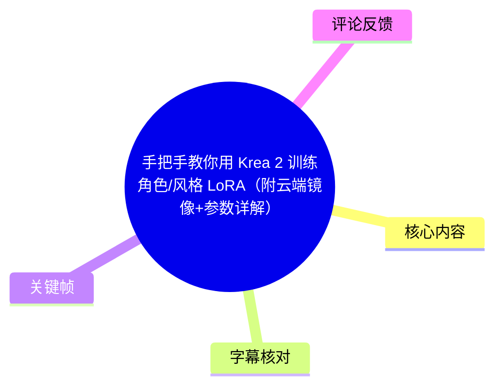
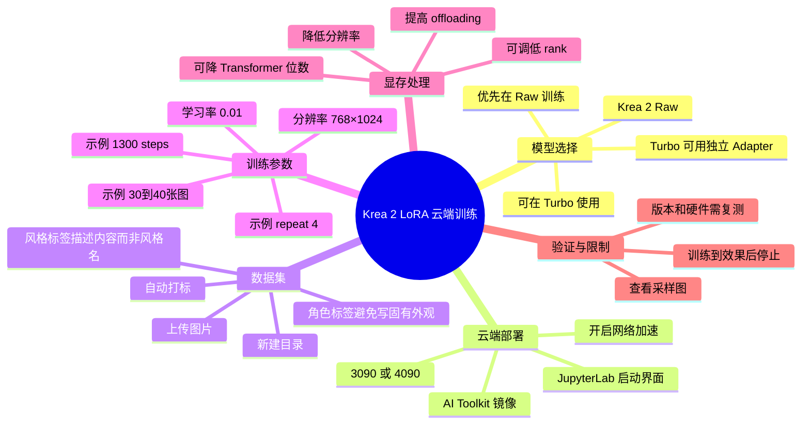
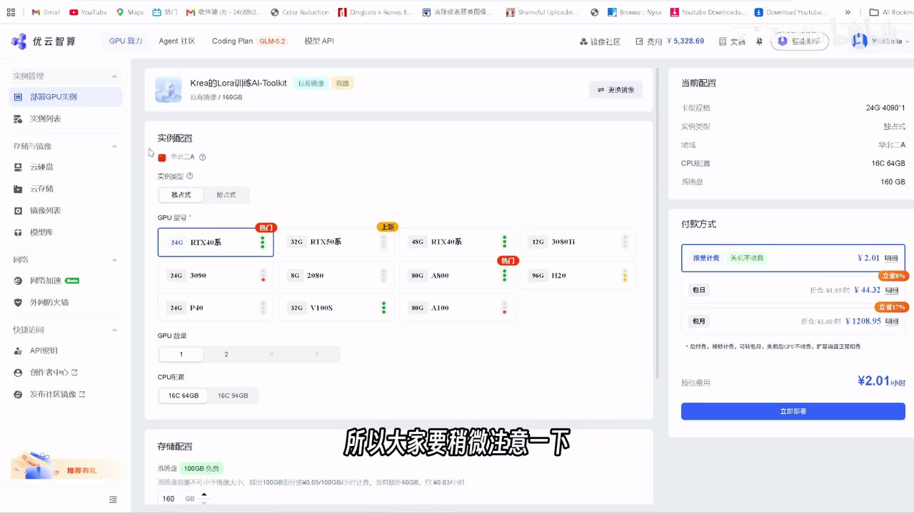
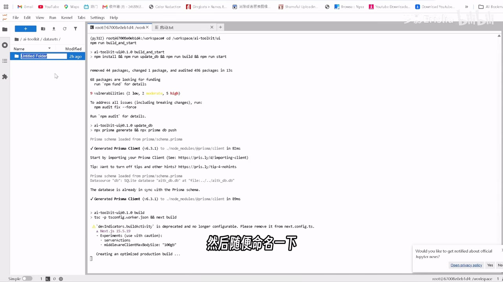
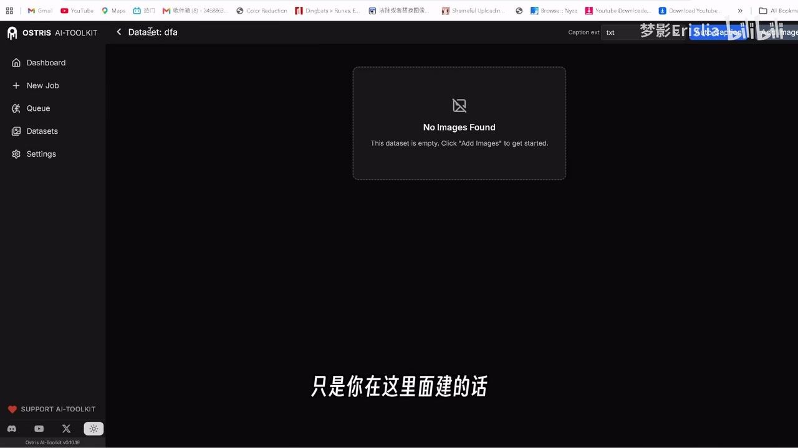
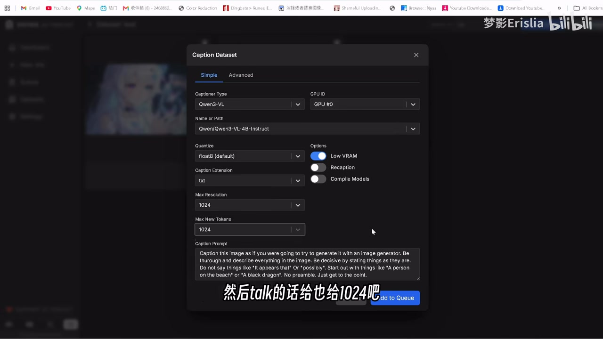
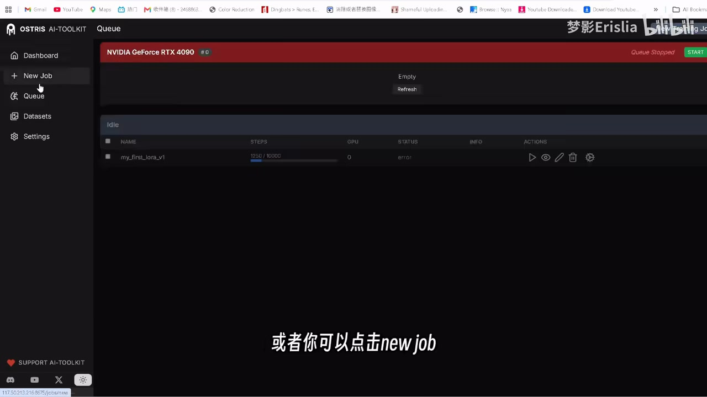
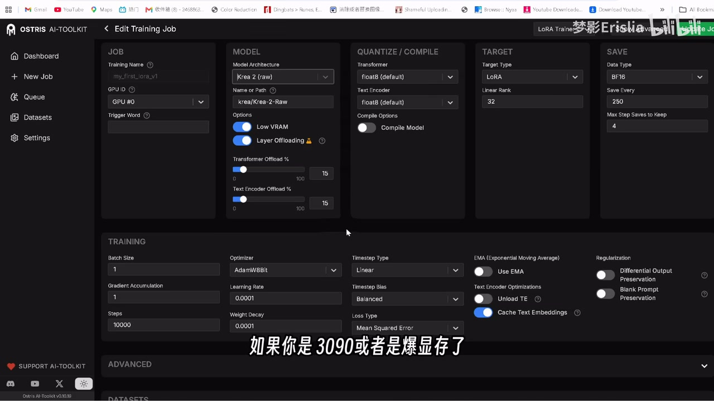

# 手把手教你用 Krea 2 训练角色/风格 LoRA（附云端镜像+参数详解）

> 来源：[Bilibili 视频](https://www.bilibili.com/video/BV13j7W6hEc9)  
> UP 主：梦影Erislia｜时长：6 分 46 秒｜分辨率：1920×1080  
> 视频简介提供了 Krea-2-Raw、`ostris/ai-toolkit` 与优云智算镜像链接；本笔记仅整理视频与所给素材中实际出现的信息。

## 小结

- 本视频演示在云端镜像中使用 **AI Toolkit** 为 **Krea 2** 训练角色或风格 LoRA 的完整基本流程：部署实例、建立并上传数据集、自动打标、套用/修改训练预设、启动训练、查看采样结果，以及在显存不足时调整配置。
- UP 主的核心建议是：LoRA 应优先在 **Krea 2 Raw**（视频中也称“原生模型”“Raw”）上训练，而不是直接在 Turbo 上训练。其理由是 Raw 更适合微调与训练；视频称 Raw 训练出的 LoRA 可用于 Turbo。若必须面向 Turbo 训练，AI Toolkit 有单独的 Adapter 支持，但视频判断其效果不如在 Raw 上训练。
- 云端部署示例选择了 **RTX 4090 24GB**；UP 主也表示可使用 **RTX 3090 24GB**，但其预设以 3090 为基准时“刚好可训练”，且自己曾发生显存溢出。因此，显存余量是本教程最重要的实际限制。
- 数据集示例约有 **30～40 张**图片，并将 `repeat` 设为 **4**；视频没有给出普遍适用的图片数量或训练步数公式，强调应随自己的数据集调整。示例训练到 **1300 steps**，显示速度约 **3.46**，总耗时约 **2 小时**。
- 视频建议的常规训练分辨率为 **768×1024**；采样分辨率示例为 **1024×1024**。若 OOM（显存不足），应优先提高 offloading、降低分辨率，必要时降低 Transformer 量化位数或 LoRA rank；视频倾向于先调 Text Encoder，通常不改 Transformer。
- 这是面向特定云端镜像、AI Toolkit 与 Krea 2 当前界面的操作演示。模型、镜像、预设字段、网络要求和显存占用均可能随版本改变；评论中还出现了 batch size 与 Turbo 显存的用户反馈，均应在自己的环境复测。

## 思维导图





## 目录

- [背景、模型选择与适用范围](#背景模型选择与适用范围)
- [云端镜像部署与数据集准备](#云端镜像部署与数据集准备)
- [自动打标：角色 LoRA 与风格 LoRA 的差异](#自动打标角色-lora-与风格-lora-的差异)
- [训练预设与参数详解](#训练预设与参数详解)
- [启动训练、采样与显存排错](#启动训练采样与显存排错)
- [可复用操作清单](#可复用操作清单)
- [结论、限制与时效性](#结论限制与时效性)
- [字幕比对](#字幕比对)
- [评论分析](#评论分析)
- [处理记录](#处理记录)

## [背景、模型选择与适用范围](https://www.bilibili.com/video/BV13j7W6hEc9?t=0)

视频开场说明主题为 Krea 2 的 LoRA 训练，重点使用 Krea 2 的 **Raw 原生模型**，不以 Turbo 为训练底座。

### Raw 与 Turbo 的关系

UP 主给出的操作性判断如下：

1. **训练底座选择：优先 Raw。**  
   视频称 Krea 2 Raw 是适合微调/训练后处理的基础版本，并表示这是官方推荐路线。Raw 本身不以快速推理为主，而 Turbo 已经过相应的加速/蒸馏处理，推理速度快。

2. **训练后使用：Raw 训练的 LoRA 可用于 Turbo。**  
   视频明确表示，先在 Raw 上完成训练后，也可以在 Turbo 上使用该 LoRA。这正是选择 Raw 训练、Turbo 推理的主要工作流逻辑。

3. **Turbo 也可训练，但不是本视频首选。**  
   若确实希望在 Krea 2 Turbo 上训练，AI Toolkit 据视频说明提供单独的 Adapter；但 UP 主认为在 Raw 上训练效果更好，因此本教程配置的是 Raw。

4. **先更新工具。**  
   视频提示先将 **AI Toolkit 更新到最新版本**。但素材没有给出具体版本号、更新命令或提交号，因此不能据此推导固定安装方法。


> 图：关键帧显示 Krea-2-Raw 的模型页面，并能看到其“适合作为微调/训练 LoRA 基础、不是主要推理用途”的页面说明。它直接支撑了视频选择 Raw 而非 Turbo 作为训练底座的理由。


> 图：该帧聚焦模型说明中与 Krea 2 Turbo 的关系，配合视频字幕“也可以在 Turbo 上面进行一个使用”，有助于区分“训练底座”与“最终推理模型”并非必须相同。

### 前置条件

按视频实际内容，开始前至少需要：

- 可用的云端 GPU 实例；
- 已配置的 Krea 2 LoRA 训练镜像/AI Toolkit 环境；
- 角色或风格训练图片；
- 可访问模型或依赖资源的网络环境；
- 对显存不足、分辨率、数据集重复次数等基本训练概念有一定接受度。

视频简介给出的关联资源包括：

- Krea 2 Raw：<https://huggingface.co/krea/Krea-2-Raw>
- AI Toolkit：<https://github.com/ostris/ai-toolkit>
- 优云智算镜像部署链接：视频简介中提供。

## [云端镜像部署与数据集准备](https://www.bilibili.com/video/BV13j7W6hEc9?t=54)

### 1. 选择实例并部署

视频在优云智算界面演示部署 Krea LoRA 训练的 AI Toolkit 镜像。GPU 选择方面：

- **推荐/示例：RTX 4090 24GB。**
- **可用：RTX 3090 24GB。**
- **风险：3090 需要调整设置。** UP 主说明默认配置是在 4090 上使用；自己首次训练也出现过爆显存，因此提醒谨慎配置。
- **网络加速：建议开启。** 视频称若不启用，可能出现联网相关报错；未进一步说明具体报错文本、网络端点或替代方案。
- 完成选择后点击“立即部署”。



> 图：该帧展示镜像部署页和 GPU 规格选择，右侧可见当前配置为 24G 4090。它说明视频中的显存建议来自实际云端实例配置，而不是抽象参数建议。

### 2. 进入 JupyterLab 并启动训练界面

实例启动后，视频操作顺序为：

1. 打开 **JupyterLab**。
2. 在环境中复制并执行镜像提供的启动指令。
3. 等待服务启动。
4. 服务就绪后，点击/打开训练界面。

素材只显示了“复制指令并启动”的过程，**没有提供可完整核验的命令文本**。因此，不应将画面中模糊或未完整呈现的 shell 内容抄写为可执行命令。



> 图：该帧展示 JupyterLab 文件浏览区位于 `/ai-toolkit/datasets/`，并正在创建目录。其价值在于明确数据集在镜像内可通过文件系统管理，而非只能在训练网页中上传。

### 3. 创建数据集目录并上传图片

视频展示两种等效方式：

- **方式 A：在 JupyterLab 文件区创建文件夹。**  
  在 `datasets` 下新建目录并命名，该目录即为训练集路径；随后直接把训练图片拖入。

- **方式 B：在训练界面 Data Sets 中新建数据集。**  
  进入训练网页后，点击 `Data Sets`，选择刚刚创建的文件夹，或通过 `New Data Set` 新建文件夹后上传图片。

UP 主的偏好是方式 A：在 JupyterLab 中建立目录并拖入图片会更快；在网页内新建/上传“稍微慢一点”。若图片已有标签文件，视频建议一并全部拖入。

## [自动打标：角色 LoRA 与风格 LoRA 的差异](https://www.bilibili.com/video/BV13j7W6hEc9?t=130)

训练图片上传后，视频使用训练界面的自动标注（auto captioning）功能处理未打标数据。

### 自动打标示例设置

视频中提到的设置为：

| 项目 | 视频示例/建议 | 说明 |
| --- | ---: | --- |
| 自动打标模型 | `Qwen 2.5 VL` | ASR 对模型名存在识别混乱；结合上下文整理为 Qwen 2.5 VL。 |
| 模型规格 | `4B` | 视频选择 4B。 |
| 图像尺寸/相关参数 | `1024` | 视频口述“给 1024”，界面字段名在素材中无法完整核验。 |
| Token | `1024` | 视频明确建议给 1024。 |
| Caption Prompt | 按 LoRA 类型改写 | 用于约束标注内容。 |
| 执行操作 | `Add to Queue` | 将自动打标任务加入队列。 |

### 角色 LoRA：不要把要学习的恒定角色特征写死

视频特别强调：如果训练的是**角色 LoRA**，不要在标签中标注该角色希望由 LoRA 学习的核心外观特征，例如：

- 眼睛颜色；
- 头发颜色；
- 其他需要作为角色身份固化的视觉属性。

其逻辑是：这些关键角色属性正是训练目标，若在 caption 中直接以文字条件固定，可能改变模型把属性归因到触发词、文本标签或 LoRA 本身的方式。视频没有给出通用 caption 模板，也没有量化这种影响，因此这里应理解为该 UP 主在本工作流中的经验建议，而非已在视频内被严格实验验证的定律。

### 风格 LoRA：不重复写目标风格名

对于**风格 LoRA**，视频举例说，如果目标是二次元风格，不需要在标签里写“这是二次元”，而是进行正常的图像内容打标。也就是说，caption 应主要描述画面内容，让训练去吸收所需风格特征，而非反复把目标风格名称作为显式条件。

这一做法与角色 LoRA 的建议共享一个原则：**不要把希望 LoRA 自身承担的核心概念，简单地作为每张图的重复文字标签。** 不过，具体是否加入触发词、如何控制标签粒度，视频未展开，需自行进行对照训练。

## [训练预设与参数详解](https://www.bilibili.com/video/BV13j7W6hEc9?t=196)

数据集完成后，视频进入队列/训练创建页面，用户可以新建任务或使用 UP 主的预设，再点击顶部“修改”进入参数配置。

### 基础训练配置

视频配置的是 **Krea 2 Raw LoRA**。若模型需要自动下载，UP 主再次提醒要开启网络加速，否则可能报错。

| 参数/项目 | 视频中的值或建议 | 作用与边界 |
| --- | ---| ---|
| 基础模型 | Krea 2 Raw | 本视频训练底座。 |
| GPU 参考 | 3090 24GB 预设、4090 24GB 示例 | 3090 是“刚好可训”的水平；不代表所有数据集和参数组合都能稳定运行。 |
| 常规训练分辨率 | 768×1024 | 视频建议的默认优先值；不是唯一允许的分辨率。 |
| 采样分辨率示例 | 1024×1024 | 可按需求修改。 |
| LoRA rank | 默认值；必要时可改为 16 | 视频称默认值通常足够，但 ASR 将具体默认数字误识别为“三手”，无法可靠还原，故不虚构数值。 |
| Transformer | 通常不改 | 显存不足时可调低量化位数，视频举例 `6 bits`。 |
| Text Encoder | 优先调整对象 | 视频称一般主要改 Text Encoder，而不是 Transformer；具体字段数值未完整给出。 |
| 训练步数 | 配置可填 10000；示例实际训至 1300 | UP 主建议看到效果后就停止，不要求跑满 10000。 |
| 学习率 | `0.01` | 视频称其余参数主要沿用默认值。 |
| offloading | 出现 OOM 时提高 | 示例使用约 `0.15`；可提高到 `50`，但视频未说明该字段单位或取值范围，需以实际界面为准。 |

### 数据集与 repeat

视频的训练集约为 **30～40 张图片**，设置：

```text
repeat = 4
```

UP 主解释设为 4 是因为其图片数量较少，希望训练时获得更多重复；用户自己的数据可设为 `1` 或 `2`，应依据数据集实际规模决定。

若有多个训练集，视频称可为不同数据集分别设置：

- 分辨率；
- `repeat` 数；
- 其他对应参数（ASR 末尾字段识别不稳定，无法可靠确定具体名称）。

因此，本教程并不要求把所有来源、尺寸或主题不同的图片强制混在一个统一配置中。

### 采样提示词

视频将采样（sample）提示词视为检查训练效果的主要工具：

- 可直接写 Krea 2 提示词；
- UP 主的示例是二次元角色，因此采用自己的“触发词/提示词”；
- 用户应按自己的角色、风格和测试目标修改；
- 采样尺寸如 `1024×1024` 可更改。



> 图：关键帧展示训练界面中套用预设并进入修改的流程位置。它帮助读者理解参数不是在 JupyterLab 终端中逐项输入，而是在 AI Toolkit 的任务配置界面中调整。



> 图：该帧对应视频讲解模型、显存与分辨率等配置的阶段。其价值是将“3090 可能 OOM、需要改配置”的口头提醒放回实际配置页面的上下文中。

## [启动训练、采样与显存排错](https://www.bilibili.com/video/BV13j7W6hEc9?t=303)

### 启动与观察训练

修改完成后点击 `Update`，进入任务界面，随后点击开始训练按钮。

视频给出的一个实际运行样例：

| 观测项 | 视频示例 |
| --- | ---|
| 训练步数 | 1300 steps |
| 界面显示速度 | 3.46 |
| 总训练时长 | 约 2 小时 |
| 训练对象 | 角色 LoRA |
| 观察方式 | 查看训练过程中逐渐出现的角色特征与采样结果 |

“3.46”在 ASR 中没有附带明确单位，不能武断写为 `it/s`、`s/it` 或其他性能单位；这里只保留视频口述/界面读数。



> 图：该帧位于训练完成度与效果观察段落，适合说明本教程并非只配置参数，也要求通过中间采样判断角色特征是否逐步形成。

### OOM（爆显存）的排错优先级

UP 主明确说自己未开启某项 offloading 设置时曾直接爆显存，随后使用约 `0.15` 的 offloading；也建议显存仍不足时提高该项。依照视频内容，可按下列顺序尝试：

1. **提高 offloading。**  
   视频建议显存不够时把 offloading 开得更高，并举例可调至 `50`。由于素材未明确字段单位、上限或是否为百分比，务必依照当前 UI 的合法输入范围填写。

2. **降低训练分辨率。**  
   如果仍然 OOM，降低分辨率。原视频的常规推荐是 768×1024，但这并不意味着所有 24GB 显存场景都能承受。

3. **降低 Transformer 配置。**  
   视频举例将 Transformer 改为更低规格，例如 `6 bits`。不过 UP 主同时表示通常主要调整 Text Encoder，而非 Transformer；应把这一步视为更激进的显存换取手段。

4. **降低 LoRA rank。**  
   视频提到可以将 rank 改为 `16`。这意味着容量与显存之间需要取舍，但视频没有给出不同 rank 的质量对比或推荐的默认具体数值。

5. **使用更高显存 GPU。**  
   UP 主建议角色训练尽可能使用 4090；若用 3090，则更依赖 offloading、分辨率等节省显存的配置。

### 关于“训练到多少步停止”

视频没有要求固定步数，而是建议“看到效果后直接下阵/停止训练”。因此：

- 配置中的 `10000` steps 更像允许的上限或计划值，而非必须跑满；
- 1300 steps 是 UP 主这一套角色数据与参数下的案例；
- 数据集数量、图片一致性、目标是角色还是风格、分辨率与重复次数均会改变合适的停止点；
- 应通过采样图判断，而不能只照搬 1300 或 10000。



> 图：该帧适合放在“采样验证”部分，强调训练完成并不等于质量合格；视频的实际判断标准是查看输出中角色特征是否逐步出现。

## [可复用操作清单](https://www.bilibili.com/video/BV13j7W6hEc9?t=80)

以下将视频流程整理为可执行检查单；其中没有素材支撑的命令、文件名和参数默认值均不补写。

### A. 部署前

- [ ] 准备 Krea 2 LoRA 训练镜像与云端 GPU。
- [ ] 优先准备 4090 24GB；若使用 3090 24GB，预留调整 offloading 和分辨率的空间。
- [ ] 开启网络加速，避免模型/依赖下载时发生网络相关报错。
- [ ] 将 AI Toolkit 更新至视频所称的最新版本。
- [ ] 确认训练目标是角色 LoRA 还是风格 LoRA，以决定 caption 策略。

### B. 数据集准备

- [ ] 在 JupyterLab 的 `datasets` 目录下创建数据集文件夹，或在训练网页的 `Data Sets` 中新建数据集。
- [ ] 将训练图片拖入目录；已有标签时可连同标签文件一起上传。
- [ ] 若未打标，使用自动打标队列。
- [ ] 视频示例中选择 Qwen 2.5 VL 4B，并使用 `1024` Token。
- [ ] 角色 LoRA：避免在标签中反复描述希望 LoRA 固化的发色、瞳色等角色核心特征。
- [ ] 风格 LoRA：不要只重复目标风格名；按画面内容进行正常标注。

### C. 创建训练任务

- [ ] 创建新任务或套用预设，然后进入“修改”页。
- [ ] 基础模型选择 Krea 2 Raw。
- [ ] 常规训练分辨率可从 `768×1024` 起步。
- [ ] 按图片数量配置 `repeat`；视频约 30～40 张图片时使用 `4`，更多图片可考虑 `1` 或 `2`。
- [ ] 设置符合测试目的的采样提示词与采样分辨率；视频示例为 `1024×1024`。
- [ ] 视频示例学习率为 `0.01`，其余大多使用默认参数。
- [ ] 保存/更新配置后启动训练。

### D. 训练中与训练后

- [ ] 通过采样图观察角色或风格是否出现。
- [ ] 不必机械跑满 10000 steps；效果达到预期后可以停止。
- [ ] 遇到 OOM：先提高 offloading，再降分辨率；仍不行时再考虑 Transformer 位数、rank 或升级显存。
- [ ] 训练完成后查看第一个 LoRA 的效果。视频未演示 LoRA 文件下载路径或导出步骤，不能从本教程推断具体下载方式。

## [结论、限制与时效性](https://www.bilibili.com/video/BV13j7W6hEc9?t=370)

### 可迁移经验

1. **训练与推理分工。**  
   本视频最重要的思路是以 Raw 作为 LoRA 训练底座，再将结果用于 Turbo 推理；不要因为 Turbo 快就默认直接在 Turbo 训练。

2. **数据标签应服务于训练目标。**  
   对角色和风格这两类 LoRA，caption 不能一概而论。视频的经验是避免重复显式标记需要由 LoRA 本身学习的核心属性。

3. **显存配置必须与数据和参数联合考虑。**  
   24GB 显存不是“无条件可训练”的保证。分辨率、offloading、量化、rank、数据集及批处理设置都会影响是否 OOM。

4. **采样比固定步数更重要。**  
   视频示例在 1300 steps、约两小时内得到可观察的效果，但并不构成其他任务的统一最优值；应通过采样图判断停止时机。

### 未覆盖或未验证事项

- 视频未展示完整启动命令，不能据此复现命令行操作。
- 视频未展示训练结果 LoRA 的下载、文件位置、命名规则或导出格式。
- 视频没有给出数据集版权、肖像权、角色 IP 授权或商用许可建议。
- 视频未比较 Raw 训练、Turbo Adapter 训练的客观质量指标，所谓“Raw 效果更好”是 UP 主的推荐和经验陈述。
- `offloading=0.15` 与“可调 50”的字段单位/格式在提供素材中不明确，不能混用或直接假定为百分比。
- 模型页、AI Toolkit、云端镜像与 GPU 价格/库存均是动态信息。元数据抓取时间为 2026-07-13，后续界面、版本、显存占用和可用参数可能变化，操作前应以当前官方说明和实例界面为准。

## [字幕比对](https://www.bilibili.com/video/BV13j7W6hEc9?t=0)

本次任务中，**站内字幕与视频主题完全不一致**：站内字幕内容讨论新能源汽车电池起火、泄压阀和小米 SU7，与本视频的 Krea 2 LoRA 云端训练无关。因此，不能采用站内字幕作为本视频知识整理依据。

本次 **ASR 已执行**，其内容与画面和视频标题一致，覆盖了 Krea 2、Raw/Turbo、AI Toolkit、云端部署、数据集、打标、训练参数及 OOM 排错等主要流程；但存在中英混杂专有名词误识别、个别数值/字段不稳定的问题。

| 字幕来源 | 完整性 | 专有名词 | 时间轴 | 主要问题 |
| --- | --- | --- | --- | --- |
| Bilibili 站内字幕 | 对当前视频无效 | 与汽车话题相关，和 Krea 2 无关 | 未提供逐句时间戳 | 疑似串片/错配字幕，不能用于本文。 |
| 本次 ASR 字幕 | 覆盖主要讲解流程 | 有误识别，但可由标题、上下文与关键帧校正 | 未提供逐句时间戳；按内容顺序整理 | 如“kara2”“Carrier 2”“劳拉”“Low”“三手”等识别错误或含混表达。 |

### 最终字幕选择与校正

本文以**本次 ASR 为主**，并用视频标题、描述、关键帧中可见页面和上下文进行有限校正；站内字幕不采纳。主要校正如下：

| ASR 原文/问题表达 | 本文采用 | 校正依据 |
| --- | --- | --- |
| `kara2`、`Carrier 2`、`KARATE2` | Krea 2 | 视频标题、描述链接及关键帧中的 Krea-2-Raw 页面。 |
| `劳拉`、`捞拉` | LoRA | 视频标题与 AI 绘画训练语境。 |
| `Law`、`Low`、`肉模型` | Raw 原生模型 | Krea-2-Raw 模型页与上下文。 |
| `J1MG特步` | 未保留 | 该类比专名无法由素材可靠核验，不影响操作流程。 |
| `千万三VL` | Qwen 2.5 VL | 自动打标语境及该类视觉语言模型命名；属于基于语境的谨慎校正。 |
| `三手绝对够用` | 未保留具体默认 rank 数值 | 原始数值不可靠；视频仅可确定“默认值通常够用、可改 16”。 |
| `Op.15` | 约 `0.15` 的 offloading 设置 | 上下文明确指 offloading，但字段拼写及单位仍未核验。 |

## [评论分析](https://www.bilibili.com/video/BV13j7W6hEc9?t=390)

以下仅处理任务中可获取的热评前三条。评论属于用户反馈，不等同于经过视频或官方文档验证的结论。

1. **澳洲土聋瞎（3 赞）**  
   - 观点：该用户称“貌似这个模型不能动 batch size，只能默认 1”，否则结果会变差。  
   - 补充价值：提示 batch size 可能是 Krea 2/当前训练实现中的敏感项。视频本身未讲 batch size，因此这是重要但未验证的补充线索。  
   - 可信度与处理：评论使用“貌似”，并未展示配置、日志、数据集或对照结果；应先以 batch size=1 做基线，再自行进行小规模对照，而不能直接视作普适限制。

2. **牛X天下（2 赞）**  
   - 观点：用户实测称 Krea 2 Turbo 显存占用约 26GB，2080 Ti 22GB 不够。  
   - 补充价值：与视频强调 3090/4090 显存压力的内容相呼应，并特别指出 Turbo 也可能有较高显存门槛。  
   - 可信度与处理：该数据没有说明推理或训练场景、分辨率、batch size、量化方式、版本和是否启用 offloading；因此可作为硬件规划警示，不可当作所有环境下的固定显存基准。

3. **狗熊玩家3（0 赞）**  
   - 观点：询问使用 UP 主镜像训练后如何下载 LoRA。  
   - 补充价值：指出本视频工作流的一个实际缺口：视频讲了训练启动和效果检查，但没有演示训练产物下载。  
   - 可信度与处理：这是问题而非事实陈述。本文不能在没有素材的情况下编造 LoRA 输出目录或下载按钮位置；实际应向镜像维护者、UP 主或当前 AI Toolkit 文档确认。

## [处理记录](https://www.bilibili.com/video/BV13j7W6hEc9?t=0)

- **Worker ID**：`worker-mrj0wbly-5dc4e50c`
- **模型**：`gpt-5.6-terra`
- **素材与工具范围**：基于任务提供的视频元数据、视频素材清单、12 张关键帧、站内字幕、本次 ASR 字幕及可获取热评前三条完成整理；未调用未提供的外部页面内容来补全操作细节。
- **字幕选择**：本次 ASR 已执行并作为正文主依据；站内字幕因内容为新能源汽车话题、与本视频完全错配而弃用。ASR 中的 Krea 2、Raw、LoRA、Qwen 2.5 VL 等术语根据标题、描述、关键帧与上下文做了审慎校正；无法验证的命令、默认 rank 数值和 offloading 单位未补造。
- **关键帧选择依据**：选用 `frame-001.jpg`、`frame-002.jpg` 说明 Raw/Turbo 模型关系；`frame-003.jpg` 说明云端 GPU 部署；`frame-004.jpg` 说明 JupyterLab 数据集目录；`frame-005.jpg`、`frame-006.jpg` 说明训练预设/参数入口；`frame-007.jpg`、`frame-008.jpg` 说明训练与效果检查。其余帧未在素材描述中获得足够可核验信息，未强行引用。
- **缓存清理**：任务提供的素材清单未包含缓存清理命令、执行日志或清理结果；为避免编造，无法确认是否已执行缓存清理。
- **未解决问题**：
  - AI Toolkit 具体版本、镜像版本及完整启动命令未提供；
  - LoRA 训练产物的目录、下载方法和导出格式未在视频中演示；
  - batch size 是否只能为 1、Turbo 是否固定占用约 26GB，均仅有评论反馈，尚未验证；
  - 动态模型/镜像参数与界面可能在视频发布后变化。

## 评论分析

本次流程未获取到可用热评，因此不推断观众态度或额外结论。
