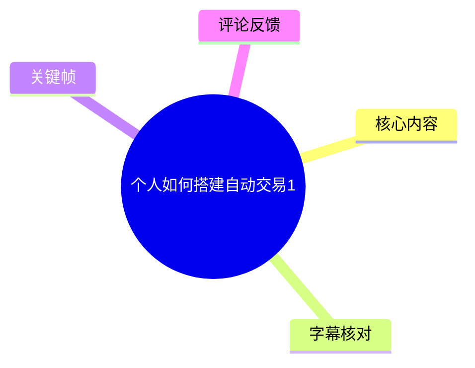
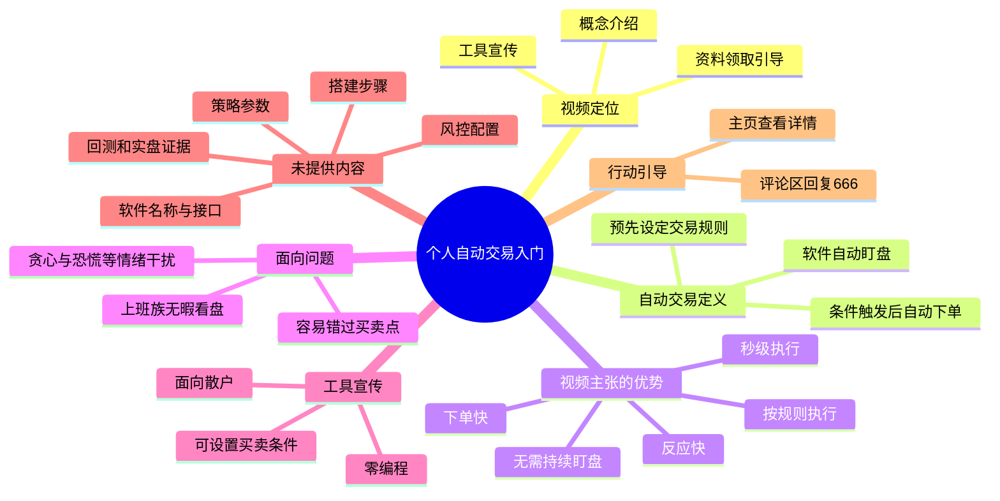
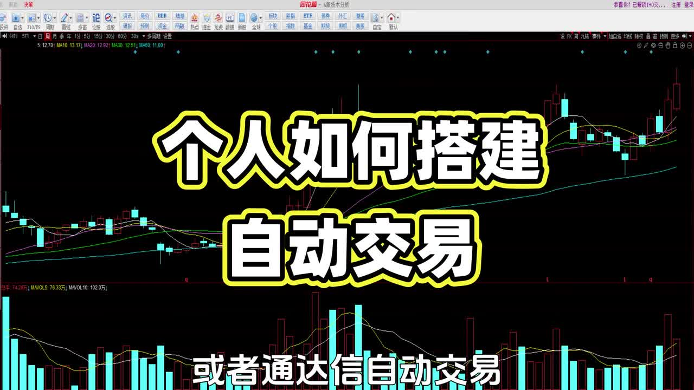
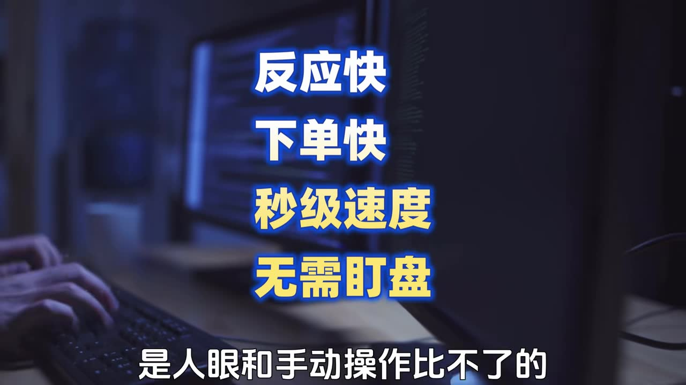

# 个人如何搭建自动交易1

> 来源：[Bilibili 视频](https://www.bilibili.com/video/BV1h2Eq63EpT) 
> UP 主：老刘讲量化｜视频时长：01:07｜画面规格：1920×1080 
> 数据抓取时记录：播放 1,431、点赞 306、收藏 188、评论 5（会随时间变化）

## 小结

视频以“同花顺或者通达信自动交易”为引子，面向没有时间持续看盘的普通投资者，解释其所称“自动交易”的基本含义：预先设置交易规则，由软件持续监控条件，并在触发时自动下单。

UP 主强调的核心价值有两类：一是响应和下单速度快，画面进一步将其概括为“反应快、下单快、秒级速度、无需盯盘”；二是按既定规则执行，以减少因贪心、恐慌等情绪造成的操作偏差，并缓解上班族无法盯盘、容易错过买卖点的问题。

视频随后宣传一款面向散户的“简易自动交易工具”，声称其支持零编程、可自由设置买卖条件；设置完成后由软件自动盯盘，在条件触发时自动下单。视频没有展示软件名称、下载渠道、交易接口、券商兼容性、策略配置界面、实盘运行记录或风控设置。

就“搭建”而言，本片实际提供的是概念介绍与资料领取引导，而非可复现的搭建教程。可从视频中提炼的流程仅为“设定规则 → 软件监控 → 条件触发 → 自动下单”；具体规则、参数、代码、回测方法和异常处理均未给出。

自动交易并不等同于盈利保证。视频中的“完美避开这些问题”“精准自动下单”等表述属于宣传性主张，未附回测、成交滑点、网络中断、策略失效、交易所/券商规则等证据。观看者如考虑使用相关工具，仍应自行核验交易权限、下单边界与风险控制。

## 思维导图

## 目录

- [视频定位与适用问题](#视频定位与适用问题-000034)
- [自动交易的定义与执行链路](#自动交易的定义与执行链路-000034)
- [视频强调的优势与适用对象](#视频强调的优势与适用对象-000034)
- [工具宣传、资料领取与缺失信息](#工具宣传资料领取与缺失信息-000059)
- [可从视频提炼的实践流程](#可从视频提炼的实践流程-000034)
- [限制、风险与时效性](#限制风险与时效性-000059)
- [字幕比对](#字幕比对)
- [评论分析](#评论分析)
- [处理记录](#处理记录)

## 视频定位与适用问题 [00:00:34](https://www.bilibili.com/video/BV1h2Eq63EpT?t=34)

标题为“个人如何搭建自动交易1”，但当前 67 秒内容并未进入具体的软件部署、账户连接或策略编写环节。已识别语音的主体从 `00:00:34,700` 开始，内容采用问答式结构，先提出“什么是自动交易”，再针对普通上班族“没空看盘、错过买卖点、容易受情绪影响”的场景给出产品化答案。

画面开头的标题文字为“个人如何搭建 自动交易”，下方提及“或者通达信自动交易”。这表明视频把讨论语境放在个人投资者可使用的交易软件或工具上；但画面与语音都没有确认该能力由同花顺、通达信原生提供，亦未说明与它们的具体集成关系。因此，不能据此推断任何平台已支持某种自动化下单方案。

> 图：关键帧以K线、均线和成交量背景展示“个人如何搭建自动交易”的主题，并出现“或者通达信自动交易”字样。它有助于确认视频讨论的是个人投资场景下的自动交易概念，但不构成对任何具体软件功能的证明。

## 自动交易的定义与执行链路 [00:00:34](https://www.bilibili.com/video/BV1h2Eq63EpT?t=34)

视频对自动交易的定义可以整理为以下链路：

1. **提前设定交易规则**：使用者先定义何时买入、何时卖出或满足何种条件时行动。
2. **软件自动监控**：视频称软件会“全程自动盯盘”。这里的“盯盘”是持续观察行情或规则状态的口语化表达。
3. **触发条件**：当预设条件满足时，进入执行环节。
4. **自动下单**：软件按设定执行下单，视频将其表述为“精准自动下单”。

这一定义强调的是自动执行，不涉及策略本身是否有效。也就是说，“自动交易”解决的是规则执行和时效问题，而不是替使用者创造交易逻辑。买卖条件若本身缺乏优势，自动化只会更稳定、更快速地执行同样的规则。

> 图：画面字幕写有“就是提前设定好交易规则”，与语音中对自动交易的定义一致。该帧是理解视频执行链路起点的直接视觉依据。

### 视频未披露的实现细节

视频没有提供以下决定实际可用性的技术信息：

| 类别 | 视频是否提供 | 说明 |
| --- | --- | --- |
| 软件或工具名称 | 未提供 | 仅称“这款软件”“简易自动交易工具”。 |
| 交易品种与市场 | 未提供 | 未说明适用于股票、基金、期货或其他市场。 |
| 行情数据来源 | 未提供 | 未说明数据频率、延迟或断线后的处理。 |
| 券商/交易通道 | 未提供 | 未说明如何取得下单权限、是否支持实盘。 |
| 规则配置方式 | 未提供 | 未给出条件编辑器、公式、代码或示例策略。 |
| 下单参数 | 未提供 | 未说明价格类型、数量、有效期、撤单逻辑等。 |
| 风险控制 | 未提供 | 未说明止损、仓位上限、单日限额或熔断机制。 |
| 验证证据 | 未提供 | 未展示回测、模拟盘、实盘成交或稳定性测试。 |

因此，本视频不能被当作某个自动交易系统的部署说明书。

## 视频强调的优势与适用对象 [00:00:34](https://www.bilibili.com/video/BV1h2Eq63EpT?t=34)

视频提出自动交易相对人工操作的三项主要卖点：

- **响应快、下单快**：UP 主认为自动化能以“秒级”完成触发后的执行，人工观察与手动操作难以相比。
- **减少盯盘需求**：工具被描述为能在规则设定完成后自行监控，适合无法长期看盘的人群。
- **降低情绪化操作影响**：视频认为普通人可能因“贪心、恐慌”做出错误操作，而程序会严格按规则执行。

> 图：画面集中列出“反应快、下单快、秒级速度、无需盯盘”，是视频对自动化优势的视觉概括；它反映的是UP主主张，而不是对实际延迟或成交质量的测试结果。

### 适用对象：视频所描绘的“上班族”场景

视频中的提问者自述“平时工作忙没空看盘，经常错过买卖点位”，并担心情绪影响决策。按该叙述，目标人群是：

- 无法在交易时段持续观察行情的人；
- 已有明确买卖规则、希望减少人工执行环节的人；
- 希望将交易纪律固化为可执行条件的人。

不过，视频没有讨论这类用户在自动化后可能遇到的风险，例如触发条件误设、行情剧烈变化时的滑点、流动性不足、系统故障或账户安全问题。故“适合上班族”应理解为其产品定位，而非经过验证的普遍结论。

## 工具宣传、资料领取与缺失信息 [00:00:59](https://www.bilibili.com/video/BV1h2Eq63EpT?t=59)

视频承认，许多自动交易工具可能存在“需要写代码、调参数”等门槛，继而宣传一款“专为散户打造”的简易工具。其明确宣称的特征包括：

- **全程零编程**；
- **新手也能上手**；
- **可自由设置买卖条件**；
- **设定后软件自动盯盘**；
- **触发条件后自动下单**。

结尾表示“工具和完整使用手册都整理打包好了”，并要求希望获取资料的观众在评论区回复“666”。

> 图：该帧再次显示“反应快、下单快、秒级速度、无需盯盘”，底部字幕强调其相对人工操作的速度优势。画面并未展示实际软件界面、下单确认页面或策略配置参数，因而不能替代产品实测。

### 资料领取动作与可验证边界

| 项目 | 视频内容 | 当前可验证性 |
| --- | --- | --- |
| 工具 | 称已整理打包 | 未展示工具名称、文件、版本或下载方式。 |
| 使用手册 | 称有“完整使用手册” | 正片未展示手册内容。 |
| 获取方式 | 评论区回复“666” | 这是视频明确的引导动作。 |
| 后续入口 | 热评中UP主称“点我主页查看详情” | 为评论中的补充信息，尚未验证主页内容。 |

由于本片没有公开工具身份、授权方式、费用、隐私权限或交易风险提示，领取或安装任何外部资料前，应先核验来源、文件安全性、账户权限范围及是否存在付费或营销条件。

## 可从视频提炼的实践流程 [00:00:34](https://www.bilibili.com/video/BV1h2Eq63EpT?t=34)

以下是视频明确表达的**概念性流程**，不是视频实际演示过的操作教程：

1. **明确买卖规则**  
   视频要求“提前设定好交易规则”。在实际执行前，规则至少应能够被清楚地写成可判断的条件；但本片没有给出任何规则样例。

2. **将条件设置到软件中**  
   视频称用户可“自由设置买卖条件”。至于通过图形化界面、公式语言还是代码完成设置，视频未说明。

3. **让软件自动盯盘**  
   设置完成后，工具按视频所述持续监控条件。其监控频率、运行环境、是否需要保持电脑开机及断网后的行为均未披露。

4. **条件触发后自动下单**  
   视频称触发后会“精准自动下单”。这里没有给出委托价格、委托数量、失败重试、成交确认和撤单策略，因此不能将“自动下单”理解为必然成交。

5. **通过评论区索取工具及手册**  
   视频结尾的唯一具体获取动作是回复“666”。该动作只是领取资料的入口提示，不等同于完成搭建或验证工具可用。

### 本片未出现的参数

视频未给出任何可记录的数值型交易参数，例如：

- 买入/卖出阈值；
- 仓位比例与最大持仓；
- 止盈、止损或回撤阈值；
- 触发周期、行情刷新频率；
- 委托价格类型和数量；
- 最大下单次数、撤单等待时间；
- 回测区间、收益率、胜率、最大回撤。

因此，无法基于本片复刻策略或评估该工具的风险收益特征。

## 限制、风险与时效性 [00:00:59](https://www.bilibili.com/video/BV1h2Eq63EpT?t=59)

### 内容限制

本片是一个约 67 秒的概念和营销引导视频。它没有完成标题所称“搭建自动交易”的关键教学环节，也没有展示产品实操。观众能获得的是自动交易的基础定义、预期优势与资料领取方式，而非可部署的技术方案。

### 自动交易的现实风险

以下风险并非视频所展示的功能，而是评价任何自动化下单方案时需要额外核验的边界：

- **策略风险**：严格执行错误规则不会改善规则本身的收益能力。
- **成交风险**：触发条件满足不代表可按理想价格成交；市场波动、流动性和委托规则都可能影响结果。
- **技术风险**：网络、行情、软件、交易通道或设备异常可能造成漏单、重复下单、延迟或无法撤单。
- **权限与安全风险**：连接交易账户或安装第三方工具前，需要确认权限范围、数据处理方式和软件来源。
- **合规与规则风险**：不同市场、券商和账户类型对程序化交易、委托频率及接口使用可能有不同要求，须以当时的正式规则为准。

### 时效性

任务素材记录的发布时间为 **2026-06-11**，抓取时间为 **2026-07-15**。视频中的工具、领取方式、主页内容、评论状态以及任何第三方软件能力都可能在发布后变化。视频未提供版本号或官方网址，无法确认其在整理时仍可获取或仍支持所声称的功能。

视频内没有新闻事件、政策更新或市场行情结论；其时效性主要体现在工具可用性和资料领取入口，而非新闻事实。

## 字幕比对

| 字幕来源 | 完整性 | 专有名词 | 时间轴 | 主要问题 |
| --- | --- | --- | --- | --- |
| Bilibili 站内字幕 | 不可用 | 无法核验 | 无可用分段 | 素材明确标记“未提供可用站内字幕”。 |
| 本次 ASR 字幕 | 覆盖诊断为 47.74%，记录语音 31.86 秒 | “同花顺”“通达信”可识别；“盯盘”等词存在转写误差 | 提供 3 个SRT分段，范围 `00:00:34,700` 至 `00:01:06,560` | 第1段仅0.4秒却包含长文本，第2段亦为长句，分句粒度明显不足；部分词语有同音/错字。 |

本次已检查 ASR 结果：识别语言为中文，模型记录为 `medium`，音频时长 `66.7341875` 秒，带时间戳。诊断中**未标记** `noAudioStream=true`，因此不能把本片视为无音轨视频。

由于没有站内字幕，正文以本次 ASR 的时间轴为主要依据；章节时间点分别采用首段起点 `00:00:34,700`（链接取第 34 秒）和末段起点 `00:00:59,240`（链接取第 59 秒）。ASR 分段内部文本过长，不能将其中每一句精确定位到段内某一秒。

通过画面字幕与语境作出的必要校正如下：

| ASR 原词 | 采用表述 | 校正依据 |
| --- | --- | --- |
| “自动钉盘下单” | “自动盯盘、下单” | 语义为监控行情；关键帧画面明确出现“无需盯盘”。 |
| “操做” | “操作” | 常规文字校正，不改变含义。 |
| “零门卡不用代砍” | “零门槛、不用代码” | 结合上下文“需要写代码调参数”及随后“全程零编程”判断；此处为ASR误识别，未将其作为逐字引文。 |
| “软建” | “软件” | 结合上下文“设定完成后……就会自动盯盘”校正。 |

关键帧只用于确认其可见的标题、字幕和行情/电脑画面，不用于补造未显示的产品功能或操作步骤。

## 评论分析

仅处理本次可获取的热评前三条。评论是用户表达或UP主引导，不是已经验证的工具事实。

1. **老刘讲量化｜2 赞｜“点我主页查看详情”**  
   这是UP主给出的后续入口引导，与视频结尾“回复666领取资料”的营销动作一致。它没有披露工具名称、价格、功能边界或风险信息；主页具体内容未包含在素材中，无法验证。

2. **多一些随意｜1 赞｜“已经领了”**  
   该评论表明至少有用户声称已领取资料，但没有展示收到的文件、手册内容或使用结果。不能据此确认资料有效、免费、完整或安全。

3. **东花开了｜1 赞｜“这会不会不太好呀”**  
   该评论表达了对该做法的疑虑，但没有说明其担忧是合规性、账户安全、策略风险还是营销方式。它提示观众应保持审慎，却不能单独构成对工具问题的证据。

## 处理记录

- Worker ID：`worker-mrj0wbly-5dc4e50c`
- 模型：`gpt-5.6-terra`
- 调用工具与模型：基于任务提供的 Bilibili 元数据、视频关键帧、ASR 输出、SRT 时间轴与评论 JSON 进行整理；ASR 诊断记录的识别模型为 `medium`，设备为 `cuda`，计算类型为 `float16`。
- 使用的应用工具：素材包中记录的合并视频 `merged.mp4`、音频 `audio/audio.wav`、关键帧目录 `frames/`、ASR 文件 `asr/transcript.srt` / `asr/asr-result.json`、评论文件 `comments/comments.json`；本次未获得可用站内字幕。
- 字幕选择：站内字幕不可用，采用本次 ASR 为主时间依据；对“盯盘”“零门槛、不用代码”“软件”等少量明显误识别词，依据关键帧可见字幕和上下文进行了标注式校正。未发现 `noAudioStream=true` 标记。
- 关键帧选择依据：选用 `frames/frame-001.jpg` 确认视频主题与“通达信自动交易”字样；选用 `frames/frame-002.jpg` 确认“提前设定好交易规则”；选用 `frames/frame-003.jpg`、`frames/frame-004.jpg` 确认“反应快、下单快、秒级速度、无需盯盘”的画面宣传语。未将未展示的软件界面或参数补写为事实。
- 缓存清理：素材中未提供缓存清理执行日志；本次整理未记录额外缓存删除操作。
- 未解决问题：工具名称、版本、领取后文件内容、收费情况、交易通道、市场与券商兼容性、策略参数、风控能力、回测及实盘表现均未在视频或可获取评论中得到验证。
