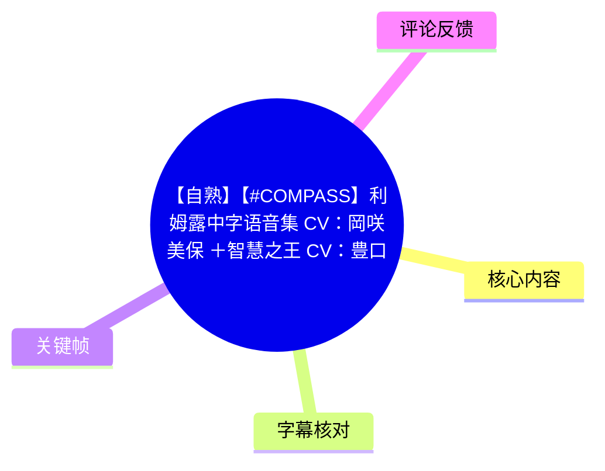
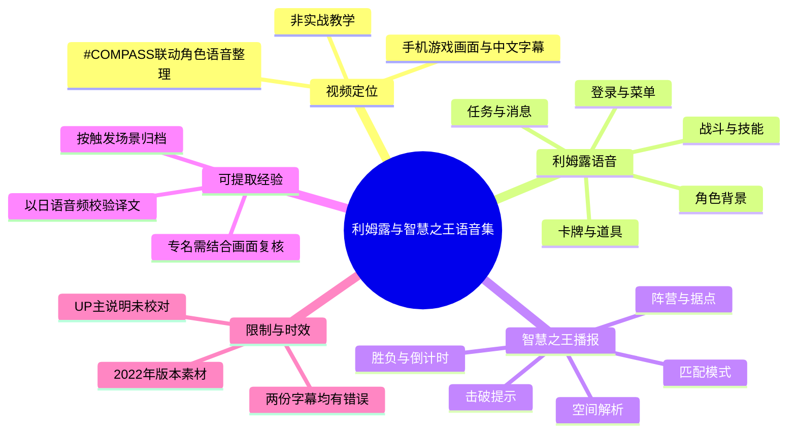
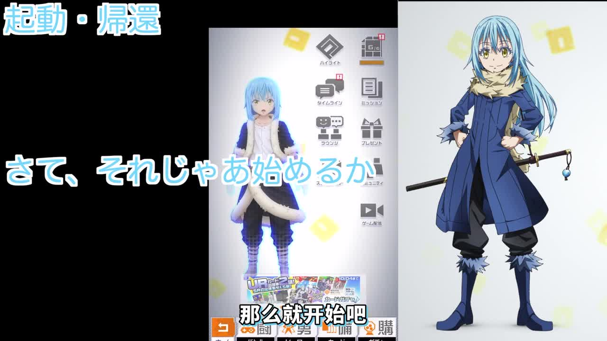
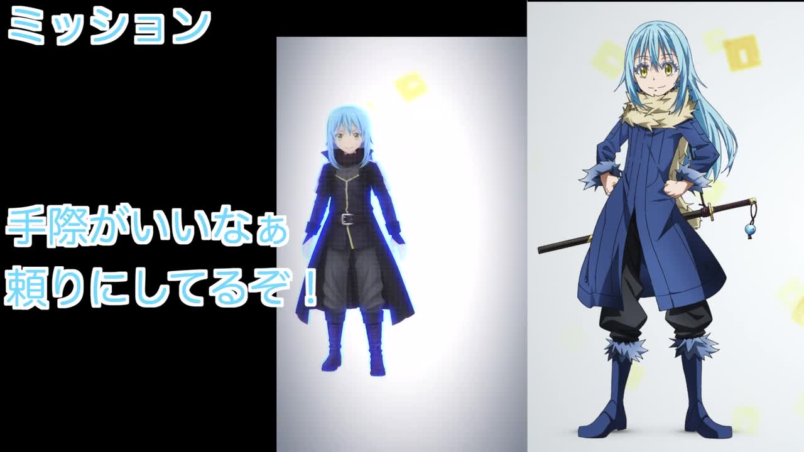
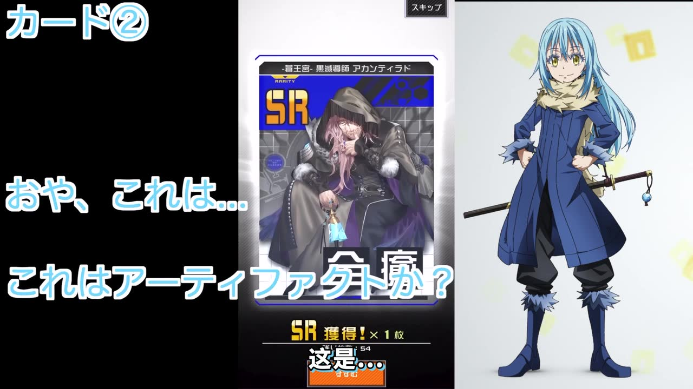
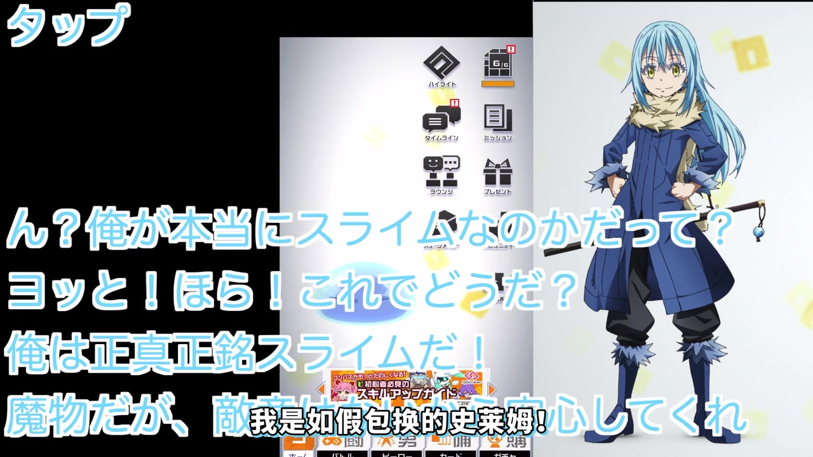

# 【自熟】【#COMPASS】利姆露中字语音集(CV：岡咲美保)＋智慧之王(CV：豊口めぐみ)）

> 来源：[Bilibili 视频](https://www.bilibili.com/video/BV1Ne4y167Y7) 
> UP 主：厚蛋烧忍者｜发布时间：2022-10-07｜视频时长：09:28 
> 原视频地址：<https://youtu.be/9Z9iVRcHpG4>；视频简介注明原作者为「つきかわ 老师」，且 UP 主表示赶时间制作、**未逐条校对字幕**。

## 小结

这是一期《#COMPASS 战斗天赋解析系统》与《关于我转生变成史莱姆这档事》联动角色**利姆露＝坦派斯特**的日语语音整理视频。视频以手机端游戏画面配合角色立绘、日文大字和中文字幕，按游戏触发场景连续播放语音；后段加入“智慧之王／拉斐尔”系统声线。标题所列配音为：利姆露由岡咲美保配音，智慧之王由豊口めぐみ配音。

内容可分为三层：前约 2 分 57 秒是登录、菜单、任务、抽卡、角色背景与《#COMPASS》世界观相关语音；约 2 分 58 秒至 6 分 43 秒是战斗中据点、技能、卡牌、回复、妨害与撤退等触发语音；约 6 分 43 秒后集中展示智慧之王的系统播报，包括匹配模式、阵营分配、据点 A/B/B2/C/D/D2/E 状态、胜负结果、倒计时和击破提示。

视频最有价值的信息不在于讲解角色数值、卡组或打法，而在于保留了联动角色与系统语音的**触发语境**。例如，利姆露会把《#COMPASS》称为“战斗数据的集积及解析に特化した空間”（专门汇集、分析战斗数据的空间），并对此表达警惕；智慧之王则直接以系统语音播报匹配、占点与战局事件。

对想检索利姆露台词、辨认智慧之王系统播报、制作二创或补全角色语音档案的观众，本视频具有参考价值。若目的是学习实战配卡、机制数值、角色平衡或当前版本环境，则本片并未提供相关数据和操作教学，不能据此推导具体强度结论。

字幕可靠性需要特别保留：站内中文字幕存在大量机器转写式错译、错名和断句问题；本次日语 ASR 的语言判断可信度为 `0.9985`，覆盖约 `477.19` 秒语音，但对专有名词与技能名亦有误识别。下文以日语 ASR 的时间轴为主，结合站内时间轴、画面日文大字和上下文作谨慎中文释义；无法完全确认的原词不扩写为既定事实。

本片发布于 2022 年。游戏界面、联动可用状态、匹配模式名称、据点提示音和系统文案均可能在后续版本更新中变动；本文仅记录该视频所呈现的当时素材，不等同于当前版本资料。

## 思维导图

## 目录

- [视频定位与素材边界](#视频定位与素材边界)
- [登录、任务、道具与角色背景语音](#登录任务道具与角色背景语音)
- [关键帧：启动与菜单场景](#关键帧启动与菜单场景)
- [《#COMPASS》空间设定与战斗开场](#compass空间设定与战斗开场)
- [战斗触发语音：据点、技能、回复与妨害](#战斗触发语音据点技能回复与妨害)
- [智慧之王：匹配、据点、结果与战况播报](#智慧之王匹配据点结果与战况播报)
- [可复用的语音整理方法](#可复用的语音整理方法)
- [限制、参数与时效性](#限制参数与时效性)
- [字幕比对](#字幕比对)
- [评论分析](#评论分析)
- [处理记录](#处理记录)

## 视频定位与素材边界 [00:00:00](https://www.bilibili.com/video/BV1Ne4y167Y7?t=0)

本片是语音合集，不是官方公告、角色攻略或完整剧情。画面采用竖屏手机游戏录屏居中展示，左右区域长期放置利姆露全身立绘；关键触发语音以日文大字覆盖在画面上，下方提供中文翻译。

从元数据可确认的基础信息如下：

| 项目 | 内容 |
| --- | --- |
| 视频时长 | 568 秒（约 09:28） |
| 分辨率 | 1920 × 1080 |
| 所属作品 | 《#COMPASS 战斗天赋解析系统》与《转生史莱姆》联动相关素材 |
| 利姆露声优 | 岡咲美保 |
| 智慧之王声优 | 豊口めぐみ |
| 视频来源说明 | UP 主转载/自制中文字幕整理；简介附原视频链接与原作者信息 |
| 校对状态 | UP 主明确表示赶时间制作，“没校对” |
| 本次 ASR 音频情况 | 检测到日语音轨；并非无音轨视频 |

因此，本文不会把台词中的角色自述、游戏系统台词或评论区说法，当作现实新闻或当前版本公告；也不会补充视频未展示的角色数值、技能倍率、卡牌效果和联动日期。

## 登录、任务、道具与角色背景语音 [00:00:04](https://www.bilibili.com/video/BV1Ne4y167Y7?t=4)

### 启动、返回与开始 [00:00:04](https://www.bilibili.com/video/BV1Ne4y167Y7?t=4)

ASR 从 00:00:04.750 开始捕捉利姆露语音。开场可辨认的内容包括：

- “こっちの姿の方が話をしやすいか”：大意为“用这个姿态更方便说话吗？”
- 自我介绍为“リムルだ／リムル＝テンペスト”（利姆露／利姆露·坦派斯特）。
- 询问此处负责人是谁，并说“那么开始吧”。
- 其后是“回来了啊，等得我好苦”“准备万全，干一场吧”“要去吗”等简短触发语音。

这些语句对应启动、返回或开始操作等轻量场景。由于 ASR 把称号部分误识为“名手”等词，站内字幕也出现“天鼠疫”等明显错误，本文不据此确定完整日文称号，只保留可稳定识别的人名“利姆露·坦派斯特”。

### 任务、活动、信件与消息 [00:00:42](https://www.bilibili.com/video/BV1Ne4y167Y7?t=42)

00:00:42.590 至 00:01:22.850 以菜单交互场景为主，台词涵盖：

1. **活动与任务**
   - 利姆露注意到环境嘈杂，询问是否在举办活动或祭典。
   - 他表示可以去看看情况，并说自己欢迎热闹的活动。
   - 又评价对方“干得不错”，甚至说“想把你招到我们国家来”。

2. **通知与邮件**
   - 出现“手纸来了，最好确认一下”“有联络，确认详情”“似乎收到消息”等提示性语音。
   - 这些是面向游戏内邮件、消息入口的语境，不包含邮件内容或奖励数值。

3. **使用物品的反馈**
   - “ありがたく使わせてもらうよ”（那我就感激地使用了）。
   - “うん、いい感じだ”（嗯，感觉不错）。

### 卡牌、魔法道具与角色自述 [00:01:31](https://www.bilibili.com/video/BV1Ne4y167Y7?t=91)

00:01:31.750 至 00:02:26.800，视频切换到卡牌/抽取及人物背景相关语音：

- 利姆露对道具作出“这是强化身体的魔法道具吗”“这附近魔素很浓”“不错的东西”“哦，是宝物吗”等评价。
- 画面中的高稀有度卡牌场景对应“これはアーティファクトか”（这是神器/古代遗物吗）。这里的 **artifact** 应理解为台词中的日语外来语“アーティファクト”；视频没有进一步定义它在游戏内的稀有度、属性或效果。
- 角色背景自述中，利姆露说自己原本是人类、原本是日本人，死亡后转生到异世界成为史莱姆，并反问对方是否不相信。
- 他邀请对方到自己的国家，提醒那里可能有很多魔物、但大家都是好人；随后提到“ジュラ・テンペスト連邦国”（鸠拉·坦派斯特联邦国）。
- 对“我真的是史莱姆吗”的疑问，他以“看，这样如何”“我是货真价实的史莱姆”“虽然是魔物，但不用担心”作答。

以上为角色设定性台词的整理。它与原作设定存在对应关系，但本视频本身没有讲述完整剧情，也未说明这些语音在游戏内的全部解锁条件。

## 关键帧：启动与菜单场景 [00:00:21](https://www.bilibili.com/video/BV1Ne4y167Y7?t=21)

> 图：画面同时呈现手机端《#COMPASS》主菜单、利姆露的游戏内模型、右侧全身立绘，以及“那么就开始吧”的日文/中文字幕。它直接说明本片的呈现结构：中间录屏对应触发场景，左右立绘和大字用于强调正在播放的台词。

> 图：中间手机画面高亮“ミッション”（任务）入口，左侧大字为“手除かいいなぁ 頼りにしてるぞ！”一类委托/期待语境。该帧有助于将抽象的语音合集对应回具体菜单行为，而非误读成战斗内对白。

> 图：画面显示一张标有“SR”的卡牌及获得提示，日文大字写有“これはアーティファクトか？”；这为“artifact”一词提供了明确的抽卡/卡牌画面上下文，同时也表明视频没有展示该卡具体效果说明。

## 《#COMPASS》空间设定与战斗开场 [00:02:28](https://www.bilibili.com/video/BV1Ne4y167Y7?t=148)

### 利姆露对“COMPASS”的解析请求 [00:02:28](https://www.bilibili.com/video/BV1Ne4y167Y7?t=148)

在 00:02:28.820 至 00:02:57.280 的连续语音中，利姆露先再次表明自己是史莱姆，随后说“这是不可思议的地方”，并向“ラファエルさん”（拉斐尔/智慧之王）询问能否解析此处。

智慧之王的核心说明为：

> 名称はコンパス。戦闘データの集積及び解析に特化した空間のようです。  
> 名称为 COMPASS。这里似乎是专门用于汇集并解析战斗数据的空间。

利姆露随即回应，大意是“战斗数据的收集与解析，听起来总觉得不太妙/让人在意”。这段是视频里最明确的世界观衔接：它把《#COMPASS》概括为以战斗数据收集、分析为特征的空间。注意，这是角色与系统对游戏世界的台词表达，非对游戏后端技术架构的可验证披露。

### 从对话到交战 [00:02:58](https://www.bilibili.com/video/BV1Ne4y167Y7?t=178)

00:02:58.820 后，语气转向对抗：

- “どうしてもやり合うつもりか”：无论如何都打算交手吗？
- “やるだけやってみるとしますか”：那就先试试看吧。
- “穏便には済まなそうだ”：看来无法和平解决。
- 00:03:13.350 起出现“这里制压就行了吧”“话说不通”“要接招吗，打中会很痛”“黑色闪电，落下”等战斗语境的句子。

该段没有展示操作按键、伤害数值、角色面板或胜负条件的系统讲解，只能确认它是对据点争夺和攻击触发的配音集合。

## 战斗触发语音：据点、技能、回复与妨害 [00:03:13](https://www.bilibili.com/video/BV1Ne4y167Y7?t=193)

### 攻击、吸收与自动战斗 [00:03:13](https://www.bilibili.com/video/BV1Ne4y167Y7?t=193)

00:03:13.350 至 00:04:19.240 的内容覆盖夺点、攻击、能力发动和系统辅助：

| 时间 | 可辨认语音/术语 | 可确认的语境 |
| --- | --- | --- |
| [03:13](https://www.bilibili.com/video/BV1Ne4y167Y7?t=193) | “这里制压就行了吧” | 据点压制/占领相关 |
| [03:38](https://www.bilibili.com/video/BV1Ne4y167Y7?t=218) | “别期待我手下留情”“不像是能手下留情的对手” | 正面交战 |
| [03:48](https://www.bilibili.com/video/BV1Ne4y167Y7?t=228) | “食らいつくせ、ベルゼビュート” | 发动“别西卜”（ベルゼビュート）相关招式的台词 |
| [03:52](https://www.bilibili.com/video/BV1Ne4y167Y7?t=232) | “我要认真了”“吃饱了”“愿意听我说了吗”“借用一点你的力量” | 技能命中/吸收类表现；具体机制与数值未展示 |
| [04:11](https://www.bilibili.com/video/BV1Ne4y167Y7?t=251) | “轮到我了，拉斐尔小姐/先生”“オートバトルモードへ移行します” | 呼叫拉斐尔并进入“自动战斗模式” |
| [04:22](https://www.bilibili.com/video/BV1Ne4y167Y7?t=262) | “黒煙” | 技能名或攻击喊招，ASR稳定识别为“黑烟” |
| [04:28](https://www.bilibili.com/video/BV1Ne4y167Y7?t=268) | “アイシクルショット” | “冰柱射击/Icicle Shot” |
| [04:30](https://www.bilibili.com/video/BV1Ne4y167Y7?t=270) | “フレアサークル” | “火焰圆环/Flare Circle” |
| [04:38](https://www.bilibili.com/video/BV1Ne4y167Y7?t=278) | “これは空間転移か” | 对空间转移效果的评价 |

“自动战斗模式”是语音文本明确出现的词，但视频没有展示其启用条件、算法逻辑、能否由玩家手动切换、持续时长或游戏内实际功能，不能将其扩展解释为完整的自动战斗系统说明。

### 防御、药水、强化与推进 [00:04:44](https://www.bilibili.com/video/BV1Ne4y167Y7?t=284)

00:04:44.660 至 00:05:31.160 的台词呈现一串典型战斗状态：

1. **位移和防御**：利姆露说“抱歉，我在你后面”“先张开结界，以防万一”。
2. **消耗品与恢复**：有“使用药水”“再坚持一下”“恢复（リカバリー）吗，得救了”等表达。
3. **团队推进**：随后出现“强化魔法吗”“现在开始一口气进攻”等台词，之后是一段连续攻击呼喊。
4. **战术结果反馈**：约 05:38 有“按作战计划进行”“惊险/勉强赶上了”的反馈。

这段可提炼的实战语境是：遭遇战中会触发位移、结界、药水、恢复与强化后的强攻台词。但视频并没有提供“药水回复多少”“结界减伤多少”“强化如何叠加”“据点优先级”等参数，因此不能作为机制攻略。

### 控制、妨害、撤退与再战 [00:05:54](https://www.bilibili.com/video/BV1Ne4y167Y7?t=354)

00:05:54.200 至 00:06:42.880 出现更加完整的受控—反制—失败/撤退语音链：

- “动不了，难道是……菲尔德/Field？”——ASR 对中间专名识别不稳，无法确认技能全称。
- “暂时撤退也是一种办法”“使用药水”“再撑一下”。
- “检测到妨害魔法，请求无效化。”
- “敌人使用妨害魔法，交给你了，拉斐尔小姐/先生。”
- “妨害魔法已阻止。”“干得好，拉斐尔小姐/先生。”
- “看来我小看你了”“没有谈判余地吗”“再来一次”“抱歉，我马上回来”“似乎需要别的策略”。
- “我可不能轻易输掉，怎么说也是一国之主/盟主。”最后的称号词在 ASR 中有误识别，故不将其写作唯一确定原文。

> 图：画面以“我真的是史莱姆吗？看，这样如何？我是货真价实的史莱姆”为主字幕，手机画面仍处于菜单层。它能帮助区分本片中的角色背景语音与后续实战语音：前者并非战斗对白，而是角色资料/互动类触发语音。

## 智慧之王：匹配、据点、结果与战况播报 [00:06:42](https://www.bilibili.com/video/BV1Ne4y167Y7?t=402)

### 匹配与战斗准备 [00:06:42](https://www.bilibili.com/video/BV1Ne4y167Y7?t=402)

约 06:42.880 起，声线切换为智慧之王的系统性播报。可稳定辨认的内容包括：

- “检测到名为 COMPASS 的空间存在。”
- “可以与世界各地的玩家战斗。”
- “在 Battle Arena 开始匹配。”
- “在 Free Battle 开始匹配。”
- “开始 2 on 2 匹配。”  
  此处 ASR 将模式文本识别为“ツーオン2”等不规范形式，依据语义仅记录为“2 on 2”相关播报，不确认当前官方模式中文名。
- “为确认战力，建议模拟战斗。”
- “检测到多个战术/战略。”
- “建议准备战斗。”
- “检测到高浓度魔素。”

这一组台词说明智慧之王承担了将异世界术语（魔素、战力、妨害魔法）与《#COMPASS》匹配、战斗界面提示连接起来的作用。

### 阵营分配、据点状态与战斗结果 [00:07:20](https://www.bilibili.com/video/BV1Ne4y167Y7?t=440)

07:20.450 至 08:40.330 是占点事件与赛果播报。视频中依次可听到：

| 时间 | 智慧之王播报 | 说明 |
| --- | --- | --- |
| [07:20](https://www.bilibili.com/video/BV1Ne4y167Y7?t=440) | 分配至蓝队 | 阵营分配提示 |
| [07:25](https://www.bilibili.com/video/BV1Ne4y167Y7?t=445) | 分配至红队；战斗开始 | 另一阵营与开战提示 |
| [07:31](https://www.bilibili.com/video/BV1Ne4y167Y7?t=451) | 获得 A | 占领 A 点 |
| [07:35](https://www.bilibili.com/video/BV1Ne4y167Y7?t=455) | 获得 B | 占领 B 点 |
| [07:39](https://www.bilibili.com/video/BV1Ne4y167Y7?t=459) | 获得 B2、C | 占领 B2、C 点 |
| [07:47](https://www.bilibili.com/video/BV1Ne4y167Y7?t=467) | 获得 D、D2、E；A/B/B2 被夺走 | 据点获得与失守 |
| [08:09](https://www.bilibili.com/video/BV1Ne4y167Y7?t=489) | C 被夺走 | 据点失守 |
| [08:14](https://www.bilibili.com/video/BV1Ne4y167Y7?t=494) | D 被夺走 | 据点失守 |
| [08:17](https://www.bilibili.com/video/BV1Ne4y167Y7?t=497) | D2 被夺走 | 据点失守 |
| [08:21](https://www.bilibili.com/video/BV1Ne4y167Y7?t=501) | E 被夺走；确认战斗结束；胜利/败北 | 结束及结果提示 |
| [08:36](https://www.bilibili.com/video/BV1Ne4y167Y7?t=516) | 平局；建议重新审视作战 | 平局后的策略建议 |

视频列出的据点代号包括 **A、B、B2、C、D、D2、E**。这可用于检索对应的语音片段；但片中没有解释这些点位的地图布局、计分规则或不同模式是否都会出现，不能从代号本身推导地图机制。

### 倒计时、击破与战力评价 [00:08:41](https://www.bilibili.com/video/BV1Ne4y167Y7?t=521)

最后约 44 秒为局内高频提示：

- 08:41：“剩余 2 分钟。”
- 08:45：“剩余 1 分钟。”
- 08:49：“剩余 30 秒。”
- 08:52：“剩余 10 秒。”
- 08:57 起：“友军被击倒”“击破敌人”“连续击破敌人”“进一步确认敌人被击破”。
- 随后有“压倒/占据优势”“确认击破 10 人”等播报。ASR 对“压倒”前后的助词以及“10 人”所在句有一定噪声，但“连续击破”“10 人击破确认”是可辨认的核心信息。
- 09:22.890 至 09:25.170：“敌我战力差明显。”

这些提示表现出智慧之王不仅播报操作事件，也对剩余时间与战局优势进行判断。不过视频没有展示它的判断阈值、战力计算公式或提示触发条件。

## 可复用的语音整理方法 [00:00:04](https://www.bilibili.com/video/BV1Ne4y167Y7?t=4)

本视频本身不是制作教程，但从其组织方式及字幕误差可以总结出适用于“游戏角色语音档案”的整理流程：

1. **先按触发场景切段，而非只按台词顺序抄录**
   - 本片可划分为启动/菜单、任务/消息、卡牌/道具、角色资料、战斗技能、系统播报六类。
   - 场景分类比单纯罗列台词更有检索价值，例如要找“据点失守”时可直接定位智慧之王的 07:47—08:21 段。

2. **保留原语言关键词，并单列中文释义**
   - 对“アーティファクト”“オートバトルモード”“アイシクルショット”“フレアサークル”“ベルゼビュート”等术语，应优先保留日文或外来语原貌。
   - 中文应标注为释义，而非假装是官方译名。这样可避免把机器字幕中的“乌永”“克莱尔樱花”等错误词固化为资料。

3. **用时间轴定位，而不是依文字顺序估算**
   - 本文时间均来自 ASR/站内 SRT 的真实起止时间，例如智慧之王第一句系统播报从 06:42.880 开始。
   - 对台词密集、ASR 合并较长的段落，可给出段落级定位，而不虚构逐字级时间点。

4. **把“能确认”与“无法确认”分开**
   - 可以确认：视频确有日语音轨、存在利姆露与智慧之王两类声线、展示了占点与倒计时提示。
   - 无法从视频确认：卡牌数值、技能伤害、自动战斗具体逻辑、当前版本模式名称、语音解锁条件。
   - 专名出现识别冲突时，应保留原始不确定性，而不是按既有作品知识强行改写。

5. **以画面复核高风险专名**
   - 例如“アーティファクト”既能在 ASR 中听到，也能由卡牌关键帧上的大字确认。
   - 对某些技能、称号和控制效果，画面未提供足够清晰文字、ASR 又有误识别时，只记录可确定的语境，不将推测写入正式词条。

## 限制、参数与时效性 [00:09:22](https://www.bilibili.com/video/BV1Ne4y167Y7?t=562)

### 视频中明确出现的可量化/可枚举信息

| 类别 | 视频中可确认内容 |
| --- | --- |
| 视频时长 | 568 秒 |
| ASR 音频时长 | 567.445 秒 |
| ASR 语音覆盖 | 477.19 秒，覆盖率约 84.09% |
| ASR 语音首末位置 | 00:00:04.750 至 00:09:25.170 |
| 倒计时提示 | 2 分钟、1 分钟、30 秒、10 秒 |
| 据点代号 | A、B、B2、C、D、D2、E |
| 阵营提示 | 蓝队、红队 |
| 对战/匹配语境 | Battle Arena、Free Battle、2 on 2、模拟战斗 |
| 结果提示 | 胜利、败北、平局、建议重新审视作战 |
| 击破相关 | 友军被击倒、敌人击破、连续击破、击破 10 人确认 |

### 未提供或不能据此推断的内容

- 角色基础属性、攻击/防御/生命数值。
- 技能冷却、伤害倍率、范围、卡牌效果与具体配装。
- 任何模式的实时规则、地图结构、据点计分方式。
- “自动战斗模式”是否为实际可操作功能、其完整工作机制及可用范围。
- 联动角色在当前版本是否仍能获得、语音是否仍保持不变。
- 中文字幕是否为官方翻译。结合视频简介的“没校对”说明，不能视为可靠官方文本。

### 时效性说明

视频发布于 2022 年 10 月，记录的是当时存在的联动语音与界面素材。至本次素材抓取时间，元数据只提供视频静态信息，未提供官方版本公告或游戏当前客户端验证。因此：

- 可以将本文作为**该视频版本的语音检索索引**；
- 不应将其作为 2026 年或其他时间点的角色可用性、模式列表、界面状态或平衡性证据；
- 若用于二创、翻译或资料库，建议再以当前游戏客户端、官方公告或原始日文语音文件复核。

## 字幕比对 [00:00:04](https://www.bilibili.com/video/BV1Ne4y167Y7?t=4)

| 字幕来源 | 完整性 | 专有名词 | 时间轴 | 主要问题 |
| --- | --- | --- | --- | --- |
| Bilibili 站内字幕 `p01-ai-zh.srt` | 覆盖从 00:00:04.960 至 00:09:24.890，分段细 | 大量失真，如“Vegol”“天鼠疫”“乌永”“克莱尔樱花”；“COMPASS”等词偶有可辨内容 | 有真实毫秒级起止时间，可用于辅助定位 | 中文表达多处不通，人物名、技能名、据点状态和句间关系错误明显 |
| 本次 ASR `medium`（日语） | 49 段，覆盖 477.19 秒语音；首段 04.750 秒，末段 565.170 秒 | 对“リムル”“ラファエル”“コンパス”“ベルゼビュート”等较有帮助；仍误识别称号、部分技能与系统词 | 有真实时间戳；与站内字幕整体对齐良好 | 长段合并多个短句；背景音/喊招导致局部漏字、错字，如控制技能全称和若干据点相关词 |

### 最终字幕采用策略

本文以**本次日语 ASR 的时间轴和可辨日文语义为主**，原因是其语言识别为日语的概率达 `0.99853515625`，且能够更可靠地恢复台词的语气、专有名词和句子关系；站内 SRT 则用于交叉核验段落位置及确认视频具有中文翻译层。

重要校正/保留项如下：

| 原始材料表现 | 本文处理 |
| --- | --- |
| 站内字幕将角色名转为“Vegol”“天鼠疫”等 | 不采用；结合标题与日语音频，统一写为“利姆露·坦派斯特” |
| ASR 中“俺はテンペストの名手”等称号不稳定 | 不据此确定完整称号；仅保留稳定的人名和“鸠拉·坦派斯特联邦国” |
| 站内字幕出现“名称是指南针” | 结合 ASR“名称はコンパス”，写作“名称为 COMPASS”，不把普通名词“指南针”当正式系统名 |
| 站内字幕的“克莱尔樱花” | 不采用；ASR 可辨为“フレアサークル”，以“Flare Circle／火焰圆环”为谨慎释义 |
| 站内字幕把据点状态频繁写成“国家” | 按 ASR 的 `A/B/B2/C/D/D2/E を獲得／奪われました`，校正为据点获得/被夺走 |
| “ホイーフィルド”等控制技能 | ASR 不稳定、画面不足以复核全称，保留为“疑似某种 Field 类控制效果”，不强造官方名 |

本次 ASR 诊断中**没有** `noAudioStream=true` 标记；音频文件存在且识别到日语语音。因此，本案不是源视频无音轨，也不是工具识别失败，而是两种字幕来源都需要进行术语与语义复核的情况。

## 评论分析 [00:08:57](https://www.bilibili.com/video/BV1Ne4y167Y7?t=537)

以下仅分析可获取的热评前三条，不将评论内容当作已验证事实。

1. **SellingMathes｜23 赞**
   - 评论认为“直接篡改系统音”可以算联动角色中很强的“被动”，并用“结月缘：欢……／智慧之王：起开，让我说！”制造角色系统声被智慧之王抢占的玩笑。
   - 该评论的观察点与视频后半段相符：智慧之王确实连续承担匹配、占点、计时和击破播报，使系统提示具有鲜明角色声线。
   - “最强被动”是戏谑性评价，不是游戏平衡数据，也不能推导为实战强度结论。

2. **韩晨曜｜6 赞**
   - 评论称自己此前才知道还有“连杀和压制”的机制/语音。
   - 视频末段确实出现连续击破、优势/压制性评价、击破人数等相关播报，因此该评论反映了合集对冷门系统语音的发现价值。
   - 但评论没有说明其所指“压制”是具体机制名、系统文本还是对战况的泛称；加上字幕存在误识别，不能仅依评论定义术语。

3. **Raleidoscope｜2 赞**
   - 评论仅写“miho”，应是在提及利姆露配音岡咲美保（Miho Okasaki）。
   - 这与视频标题中“CV：岡咲美保”的信息一致，但评论本身没有补充语音触发、游戏机制或翻译证据。

## 评论分析

- 热评 1：我要宣布直接篡改系统音是联动角色里最强被动[doge] 结月缘：欢…… 智慧之王：起开，让我说！
- 热评 2：我才知道還有連殺和壓制的機制和語音[笑哭]
- 热评 3：miho[tv_色]

以上内容是观众反馈摘录，只用于补充理解视频反响，不作为正文事实依据。

## 处理记录

- Worker ID：`worker-mrj0wjed-b0c290ad`
- 模型：`gpt-5.6-terra`
- 调用工具与素材：视频元数据、站内字幕 `p01-ai-zh.srt`、本次 ASR 结果 `asr/asr-result.json`、ASR SRT `asr/transcript.srt`、关键帧目录 `frames/`、热评数据 `comments/comments.json`。
- ASR 检查结果：识别语言为日语（`ja`），语言概率 `0.99853515625`；使用 `medium` 模型、CUDA、`float16`；存在正常音频流，未标记 `noAudioStream=true`。
- 字幕选择：以本次日语 ASR 的真实时间戳和语义为主；以站内 SRT 辅助定位；对站内中文中明显的错名、错译不直接采用。中文表述为基于日语原声的谨慎释义。
- 关键帧选择依据：选用 `frames/frame-001.jpg` 展示启动/主菜单与视频版式，`frames/frame-002.jpg` 对应任务入口语境，`frames/frame-003.jpg` 复核“アーティファクト”卡牌场景，`frames/frame-004.jpg` 展示利姆露自述为史莱姆的互动/菜单语音。图片均服务于正文的场景辨认，不用于推断未展示的游戏参数。
- 评论处理：仅使用可获取热评前三条，按“观点—可对照视频之处—不可作为事实的部分”分析。
- 缓存清理：本任务提供的素材清单未包含可执行的缓存清理回执；未对原始媒体、音频、ASR、字幕或关键帧文件作删除性声明。
- 未解决问题：少数利姆露称号、控制类技能名及末段个别战况用语在 ASR 中存在误识别；由于站内字幕同样不可靠且给定关键帧无法逐项复核，本文未将这些词强行确定为官方译名。
