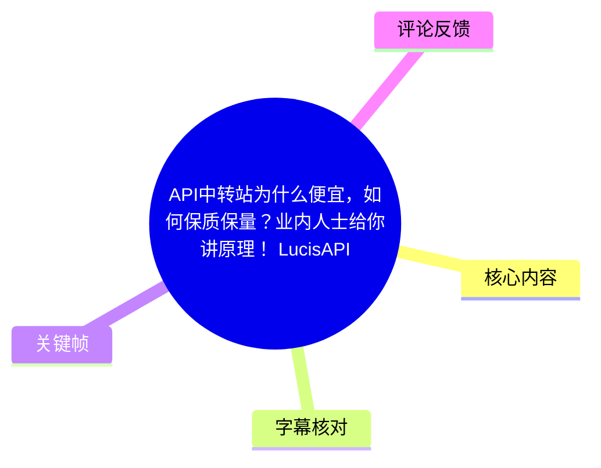
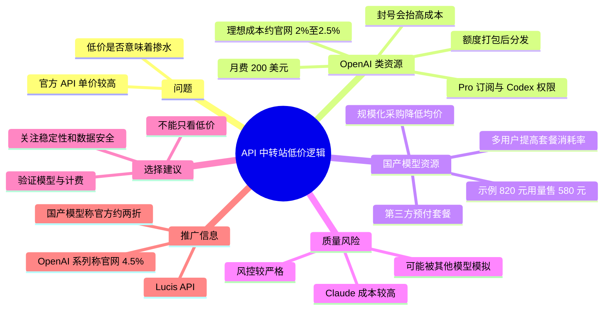
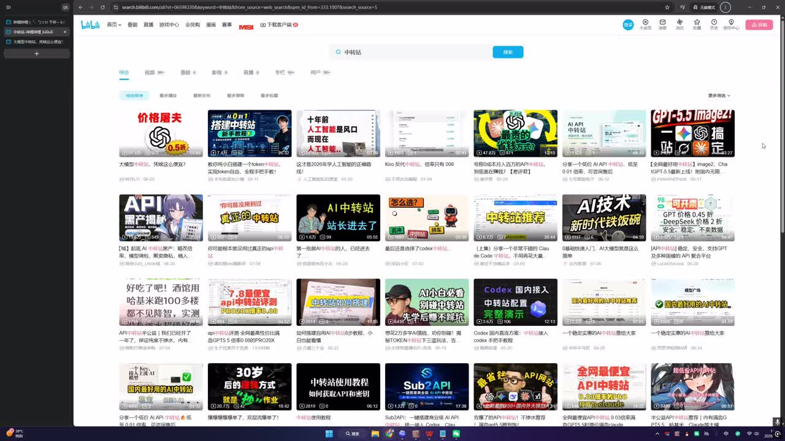
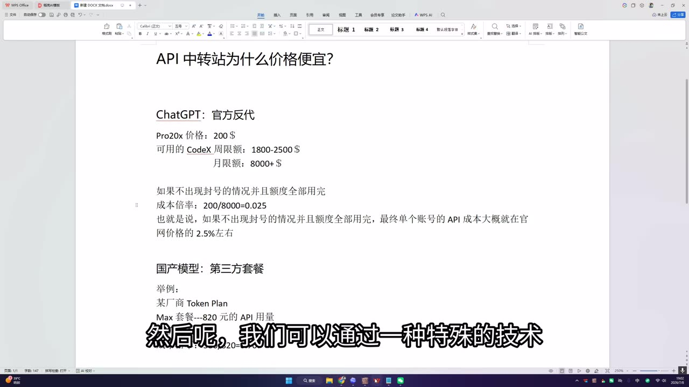
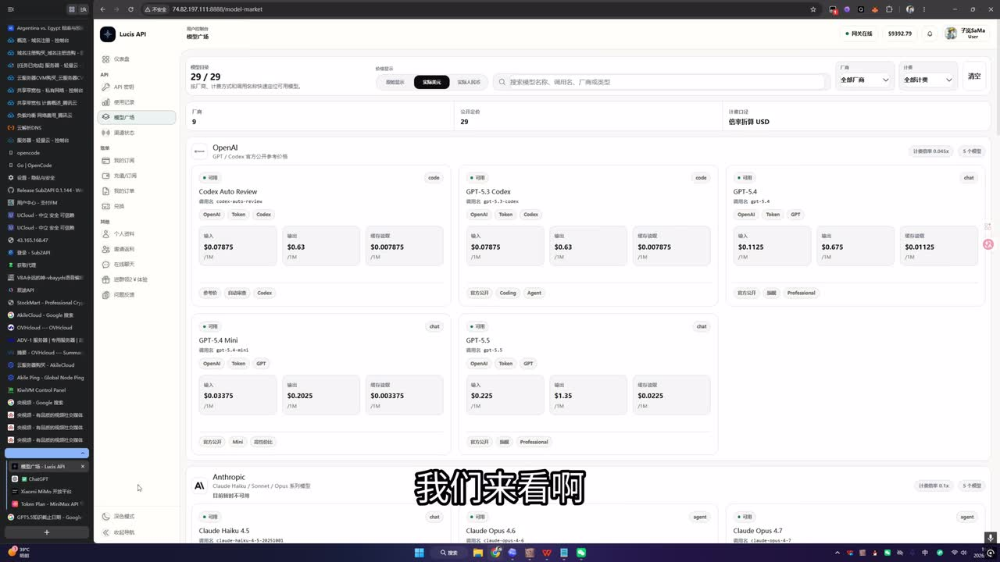

# API中转站为什么便宜，如何保质保量？业内人士给你讲原理！[LucisAPI]

> 来源：[Bilibili 视频](https://www.bilibili.com/video/BV1zKNB6nEAP)<br>
> UP 主：隔却江山｜视频时长：05:09｜合集：AIcode  
> 视频内容含对 UP 主自营 Lucis API 的推广；其中价格、模型可用性与运营方式均应视为发布时点的陈述，不构成对服务质量、合规性或安全性的独立验证。

## 小结

视频从中转站运营者的角度解释：中转 API 的低价不必然代表“掺水”或替换了模型，核心是把原本适合单人使用、但存在额度或有效期限制的订阅/套餐资源集中采购、打包并分发给大量请求使用，从而提高额度消耗率、摊薄平均成本。

对于视频中所称的 OpenAI/ChatGPT 一类服务，UP 主给出的模型是：以每月 200 美元的 Pro 订阅为例，若其附带的 Codex 额度能被充分消耗，可能折合约 8,000—10,000 美元 API 用量；在“不封号且额度用尽”的理想前提下，成本约为官网 API 价格的 2%—2.5%。这是视频的运营测算，不是官方承诺，也没有披露“特殊技术”的具体实现方式。

国产模型部分的逻辑是第三方预付套餐折扣：视频举例称某套餐含 820 元用量、售价 580 元，采购成本约为面值七折。普通个人用户未必能在有效期内用完套餐，而中转站可凭汇聚的高并发、多用户请求加速消耗，因此即便以八折或更低折扣转售，仍可能保留利润空间。

UP 主特别将 Claude 服务列为相对高风险区域：其说法是 Claude 成本高、风控严，部分平台可能为了压低成本，用其他模型配合提示词优化去模拟 Claude 的效果。相对地，视频认为 GPT 中转及许多国产模型通常没有强烈的“掺水”经济动机；但这只是作者基于成本结构作出的判断，不能替代对具体服务商、具体请求和具体模型输出的逐项验证。

面向使用者的可迁移经验是：不能仅按“价格是否远低于官方”判断质量；应进一步核查模型标识、计费规则、稳定性、上下文/缓存口径、异常处理、数据政策和服务条款。视频没有提供可复现实验、接口抓包或第三方审计，因此无法据此确认任一平台实际调用的底层模型。

## 思维导图





## 目录

- [问题、立场与适用边界](#问题立场与适用边界)
- [OpenAI 类资源：订阅额度的打包与分发](#openai-类资源订阅额度的打包与分发)
- [国产模型：套餐折扣与规模化消耗](#国产模型套餐折扣与规模化消耗)
- [“掺水”风险判断：为何特别提示 Claude](#掺水风险判断为何特别提示-claude)
- [选择中转站的核查步骤](#选择中转站的核查步骤)
- [视频中的 Lucis API 推广与价格口径](#视频中的-lucis-api-推广与价格口径)
- [结论、限制与时效性](#结论限制与时效性)
- [关键帧索引](#关键帧索引)
- [字幕比对](#字幕比对)
- [评论分析](#评论分析)
- [处理记录](#处理记录)

## 问题、立场与适用边界 [00:01](https://www.bilibili.com/video/BV1zKNB6nEAP?t=1)

视频针对的核心疑问是：为什么官方 API 很贵，而一些 API 中转站能够提供显著更低的计费价格；低价是否就等于模型被替换、降级或“掺水”。

UP 主在 [00:28](https://www.bilibili.com/video/BV1zKNB6nEAP?t=28) 明确披露自身既搭建也运营 AI 中转站，因此后续内容属于业内运营者的经验说明，同时也带有利益相关方视角。视频的论证重点不是公开某种技术细节，而是解释成本结构：

1. 把订阅或套餐中的可用额度转化为可按量分发的资源；
2. 借助大量用户请求提升额度利用率；
3. 通过预付套餐折扣、集中采购等方式降低平均成本；
4. 将封号、风控、额度没用完等损耗纳入实际成本。

视频未展示中转的具体协议、账号体系、转发架构、模型验证方法或与上游厂商的授权关系。因此，“特殊技术”“打包”“分发”只能按视频原话理解为运营机制描述，不能延伸为对其技术实现或合规状态的确认。



> 图：画面显示 Bilibili 站内对“中转站”的搜索结果，说明视频从市场上大量相关内容与用户疑问切入；它有助于理解本期并非 API 接入教程，而是对中转站定价逻辑的解释。

## OpenAI 类资源：订阅额度的打包与分发 [00:28](https://www.bilibili.com/video/BV1zKNB6nEAP?t=28)

### 官方 API 与站点报价的对照 [00:28](https://www.bilibili.com/video/BV1zKNB6nEAP?t=28)

UP 主先口述一组官方 API 单价：输入每 100 万 Token 5 美元、输出每 100 万 Token 30 美元。由于 ASR 将模型名称识别为“GPC”，画面及上下文更接近 GPT/ChatGPT 一类服务；但视频没有在该口述片段中清晰给出可核验的具体模型版本，故不应将这组数字泛化到所有 OpenAI 模型。

随后在 [00:52](https://www.bilibili.com/video/BV1zKNB6nEAP?t=52)，UP 主称其站点价格约为官网的 **4.5%**。这一比例是站点方报价口径，并不是视频通过独立成本审计得出的结论。

### 视频给出的理想成本测算 [01:03](https://www.bilibili.com/video/BV1zKNB6nEAP?t=63)

UP 主以“Pro 20x”订阅作为示例，口述信息包括：

| 项目 | 视频中的说法 |
| --- | --- |
| 订阅月费 | 200 美元 |
| 订阅权益 | 具有 Codex 使用权限 |
| 可折合的 API 额度 | ASR 为约 8,000—10,000 美元 |
| 理想条件 | 不发生封号，且额度全部用完 |
| 理论成本 | `200 ÷ 8000 = 0.025`，即约为官网价格的 2.5%；口述又概括为约 2% |

视频画面中的文档还写有“可用的 Codex 周限额：1800—2500 $”“月限额：8000+ $”。因此，应将“8,000—10,000 美元”视为 UP 主在口述中使用的估算区间；其上限、额度计算方式、是否按不同模型区别、是否受地区或账户行为影响，均未由视频证实。

成本公式可以按视频逻辑整理为：

```text
理论成本倍率 = 订阅月费 ÷ 可被完全消耗的 API 等价额度

示例：
200 美元 ÷ 8,000 美元 = 0.025 = 2.5%
```

这个公式只反映理想资源利用率下的名义采购成本，**没有天然包含**服务器与带宽、支付通道、售后、人力、税费、坏账、失败请求、风控损失、账户损失以及利润。



> 图：文档集中展示“Pro20x 价格 200 美元”“Codex 周/月额度”及 `200/8000=0.025` 的计算。这是视频最关键的定价论据载体，也同时提示这些数值是讲述者制作的说明材料，而非平台官方报价页。

### 封号与额度损耗 [01:27](https://www.bilibili.com/video/BV1zKNB6nEAP?t=87)

UP 主接着补充，现实中会发生封号，从而“变相增加成本”。这也构成前述理想成本模型的关键限制：

- 账号在额度消耗前失效，实际单位成本会上升；
- 套餐不能完全消耗，折扣带来的理论优势会缩水；
- 风控越严、账号损耗越高，运营方越难长期维持极低售价；
- 因此，不能仅用“月费 ÷ 理论额度”推导某一中转站必然可持续的真实成本。

视频没有公布封号比例、账户平均存活时间、风控规则、损耗成本或实际毛利，不能据此计算该站或行业的实际利润率。

## 国产模型：套餐折扣与规模化消耗 [01:52](https://www.bilibili.com/video/BV1zKNB6nEAP?t=112)

UP 主将国产模型的低价来源概括为“使用第三方套餐”。其示例是：某厂商套餐标称 820 元 API 用量，售价 580 元，等于以约七折采购资源。

| 视频示例 | 数值 |
| --- | ---:|
| 套餐内 API 用量 | 820 元 |
| 套餐售价 | 580 元 |
| 名义采购成本率 | `580 ÷ 820 ≈ 70.7%` |

普通个人用户购买这类套餐时，存在一个典型问题：有效期内不一定能用完，未消耗的额度会让实际使用成本高于标称折扣。中转站汇集多名用户的请求后，能够更快消耗套餐余额；在该前提下，UP 主认为运营方即使按八折甚至更低比例销售，仍可能有利润空间。

这一机制可抽象为：

```text
个人购买套餐：
  套餐折扣 × 未用完风险 → 实际成本未必低

中转站集中使用套餐：
  套餐折扣 × 高消耗率 × 多用户分摊 → 平均成本可能下降
```

视频在 [02:40](https://www.bilibili.com/video/BV1zKNB6nEAP?t=160) 表示，其站点的国产模型也只使用“其他大厂的这种套餐”，并强调这只是举例。未提供厂商名称、套餐条款、调用范围或采购凭证。



> 图：画面展示 Lucis API 的模型市场页面，包含 OpenAI、Anthropic 等分组及按百万 Token 计的价格卡片。其价值在于说明视频讨论的最终落点是一个实际的聚合计费界面，但该页面本身不能证明其上游来源或模型一致性。

## “掺水”风险判断：为何特别提示 Claude [02:53](https://www.bilibili.com/video/BV1zKNB6nEAP?t=173)

UP 主承认市场上存在质量有问题的平台，并将 Claude 服务称为相对容易出现问题的区域。其给出的逻辑链是：

1. Claude 的成本相对高；
2. Claude 的风控相对严格；
3. 在低成本压力下，部分平台可能改用其他模型；
4. 再通过“提示词优化”去模拟 Claude 的输出效果。

这里的“使用其他模型模拟 Claude”是 UP 主对行业风险的描述，视频没有展示任何具体平台、模型调用日志、对照测试或证据链。因此可将其作为风险提示，而不能视为对某个平台的事实指控。

在 [03:16](https://www.bilibili.com/video/BV1zKNB6nEAP?t=196)，UP 主的另一项判断是：

- GPT 中转站及国产模型“几乎不会掺水”，因为其“货源价钱不贵”；
- 对“GPT 中转掺豆包”的调侃，UP 主反驳称：按其计算，购买豆包 API 反而可能比中转 GPT 的进货价更高；
- Claude 则被再次概括为高风险区域。

这些判断均依赖特定时点的上游价格、套餐、账户资源和风控环境。任何一项变化都可能改变经济激励，故不能把“价格低”或“某类模型一般不掺水”当作永久规律。

## 选择中转站的核查步骤 [03:16](https://www.bilibili.com/video/BV1zKNB6nEAP?t=196)

视频直接给出的建议是：不要只因价格便宜，就断定模型质量有问题；反过来，也不能只因为价格便宜便认定服务可信。结合视频暴露出的成本假设，使用者可按以下顺序进行核查：

1. **确认计费单位与口径**  
   区分输入、输出、缓存命中、图片/音频等不同计费项；不要只比较首页的单一“倍率”。

2. **核对模型名称与版本**  
   要求服务商明确模型 ID、版本、上下文窗口、是否支持工具调用、推理/缓存机制等。仅以“GPT”“Claude”等营销名无法确认具体模型。

3. **小额验证真实行为**  
   用对模型能力有区分度的任务进行小额测试，例如结构化输出、工具调用、长上下文一致性、复杂代码修复等；测试只能反映当次结果，不是永久担保。

4. **观察稳定性和错误处理**  
   记录限流、超时、429/5xx 错误、重试机制、退款或补偿规则。视频也承认封号和风控会改变供给成本，稳定性不能只从价格推断。

5. **审阅数据与隐私政策**  
   API 请求可能包含提示词、代码、业务数据或用户信息。应确认日志保留、数据用途、存储位置、访问控制和删除机制。视频描述页中称只有触发风控时会记录本次提示词且不包括上下文，但这是 UP 主单方说明，未见独立审计材料。

6. **核实服务条款与业务适配性**  
   企业或生产环境应重点检查账单、售后 SLA、发票、服务中断预案和上游授权/条款风险。视频未提供这些材料。

## 视频中的 Lucis API 推广与价格口径 [04:04](https://www.bilibili.com/video/BV1zKNB6nEAP?t=244)

在总结成本逻辑后，UP 主转入自营站点 Lucis API 的推广。按视频口述、画面和简介，发布时点的主要信息如下：

| 项目 | 视频/简介中的陈述 |
| --- | --- |
| OpenAI/ChatGPT 分组计费倍率 | 约官网价格的 4.5% |
| 某画面中的 GPT 价格 | 约 3.9%（ASR 识别为“0.039 / 3.9%”，具体对应模型不清晰） |
| Claude | 因风控严重，视频称“最近没有做” |
| 国产模型 | 视频称约官方两折；简介给出“官方 API 调用价的 20%—25%” |
| xAI/Grok | 简介标示计费倍率 0.075x |
| 充值比例 | 简介标示 `1 元 = 0.15 美元` |
| 站点地址 | 简介中提供 `www.lucisapi.ai` |
| 图像生成 | 简介声称“不限次的图像生成功能” |
| 客服/社群 | 简介提供交流群号；不在此重复扩散联系方式 |

需要特别注意：简介与口述的国产模型口径存在“20%”和“20%—25%”的范围差异；这可能来自模型分组差异或价格更新，但素材不足以确定原因。视频发布后的模型清单、价格、可用性和优惠规则也都可能调整，使用前应以服务商当时的书面计费页和条款为准。


> 图：该界面展示了不同模型分组的价格卡片，是核对“宣传倍率”与实际按量计费项目是否一致时应重点查看的页面类型；但画面截帧不能替代实时价格页，也不能验证实际调用链路。

## 结论、限制与时效性 [03:40](https://www.bilibili.com/video/BV1zKNB6nEAP?t=220)

视频的核心结论是：中转站的低价可由资源打包、套餐采购和更高利用率解释，并不必然意味着模型变差。其论证最有价值之处，是把“个人套餐用不完”与“平台聚合需求能用满”之间的利用率差异指出来。

但该结论成立依赖多项条件：

- 订阅或套餐资源可以按视频所称方式稳定获得和分发；
- 额度实际能被充分消耗；
- 封号、风控和失效损耗处于可承受范围；
- 服务商没有用其他模型替代宣称模型；
- 上游价格、套餐条款和可用政策未发生变化。

视频没有提供对“保质保量”的量化定义，也没有给出模型一致性验证、可用性 SLA、成功率、延迟、故障率、数据安全审计或第三方成本证明。因此，它适合作为理解中转站**可能的成本结构**的入门材料，不适合作为对任何具体站点的质量、隐私、安全、合规性或长期可持续性的背书。

时效性方面，本视频时长 309 秒，元数据抓取于 2026-07-17；模型价格、订阅额度、风控策略、套餐有效期和站点可用性变化很快。所有“官网百分比”“约两折”“最近没有做 Claude”等描述都应限定为素材对应时点的信息。

## 关键帧索引

| 关键帧 | 正文位置 | 画面内容 | 选用价值 |
| --- | --- | --- | --- |
|  | 问题、立场与适用边界 | Bilibili 搜索“中转站”相关内容 | 交代视频从行业讨论和用户疑问出发。 |
|  | 国产模型、推广价格 | Lucis API 模型市场与计费卡片 | 对应视频的实际站点界面和价格讨论。 |
|  | OpenAI 类资源 | 200 美元订阅、Codex 额度、成本公式 | 直接承载“2%—2.5% 理想成本”这一核心论据。 |

## 字幕比对

| 字幕来源 | 完整性 | 专有名词 | 时间轴 | 主要问题 |
| --- | --- | --- | --- | --- |
| Bilibili 站内字幕 `p01-ai-zh.srt` | 与本视频不匹配 | 不匹配 | 分段完整，但对应另一段“核聚变/戴森球”内容 | 全文主题、人物与时长内容均与本视频不一致，不能采用。 |
| 本次 ASR 字幕 | 覆盖约 296.62 秒，语音覆盖率约 96.05% | 多处误识别 | 有效，首段 00:01.040，末段 05:07.160 | 将 GPT/ChatGPT、Claude、套餐、Token 等词识别为“GPC”“Cloud”“中轢站”“套衩”等；部分数字和模型名需结合画面与简介审慎校正。 |

### 最终字幕选择与校正原则

最终以**本次 ASR 的真实时间轴**作为章节定位依据，并结合关键帧、视频简介和上下文进行有限校正；未采用站内字幕，因为其内容明确属于另一视频，尽管其时间轴格式完整。

本次 ASR 诊断显示：

- 识别模型：`medium`
- 识别语言：中文，概率 `0.99755859375`
- 音频时长：`308.8254375` 秒
- 带时间戳：是
- `noAudioStream`：素材未标记为 `true`；且已提供 `audio/audio.wav` 和有效 ASR 分段，因此不能将其视为无音轨视频。

主要校正规则如下：

- ASR 的“GPC/GPD”结合标题、画面中的 OpenAI/ChatGPT 分组及上下文，统一表述为“GPT/ChatGPT 一类服务”，不擅自指定某个确切模型版本。
- ASR 的“Cloud”结合画面中的 Anthropic 分组和上下文，校正为“Claude”。
- “Pro20x”“特殊技术”等保留视频表述；视频没有解释技术细节，不补充猜测。
- “8,000—10,000 美元额度”以 ASR 口述为主，同时标注关键帧中仅清晰出现“月限额：8000+ $”，不把两者伪装成同一精确数值。
- 站内字幕的核聚变内容未进入任何正文结论。

## 评论分析

仅获取到 2 条热评，少于“前三条”的上限；以下不将评论内容视为已验证事实。

1. **詺风｜1 赞**  
   评论描述看到“自动检测 GPT 账号”的网站，称其以 180 元开 Plus、要求粘贴一段代码并支持微信付款，询问是否为骗子。  
   - 这反映出用户对账号代充、代码粘贴与第三方支付链路的安全担忧。  
   - 评论没有提供网站域名、代码内容、付款结果或证据，无法据此判定该服务是否诈骗。  
   - 从风险控制角度，此类涉及账号凭据、授权代码或支付的操作应避免在未核实来源前执行；尤其不应向不可信页面粘贴可能具有登录、会话或授权能力的代码。

2. **YAKUSUKA｜2 赞**  
   评论为“很棒诶！”。  
   - 属于正向反馈，没有提供关于中转原理、价格真实性、模型质量或安全性的可核验补充信息。

## 处理记录

- Worker ID：`worker-mrj0wbly-5dc4e50c`
- 模型：`gpt-5.6-terra`
- 参考素材与工具产物：视频元数据、`audio/audio.wav`、本次 ASR 结果与 SRT、站内字幕 `p01-ai-zh.srt`、12 张关键帧、热评抓取结果、视频简介。
- ASR 检查：已检查 `asr/asr-result.json`；识别语言为中文，具备时间戳，未出现 `noAudioStream=true` 标记。
- 字幕选择：弃用与视频主题完全不符的站内字幕；采用本次 ASR 时间轴，并以关键帧、简介和上下文校正明显的专有名词误识别。
- 关键帧依据：选择了能分别呈现视频讨论背景、实际模型市场界面与核心成本公式的 `frame-001.jpg`、`frame-003.jpg`、`frame-004.jpg`；未把未能从素材明确识别内容的帧强行用于论证。
- 评论范围：按可获取热评处理；实际仅返回 2 条，未虚构第 3 条。
- 缓存清理：提供的素材未包含缓存清理执行记录；本文不声称已执行或完成缓存清理。
- 未解决问题：
  - 视频所谓“特殊技术”的具体技术路径、授权状态与合规边界未披露；
  - 订阅额度、封号率、实际成本与利润率无独立验证；
  - 站点是否始终调用其宣称的底层模型、数据如何处理，无法仅凭本视频和关键帧确认；
  - 价格及模型供应具有强时效性，需以使用当日的实时页面和书面条款复核。
