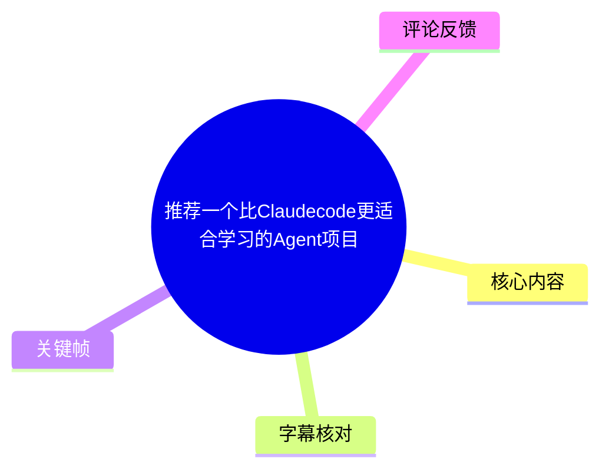
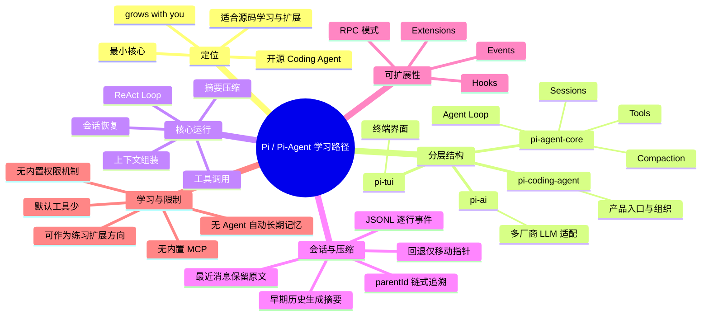
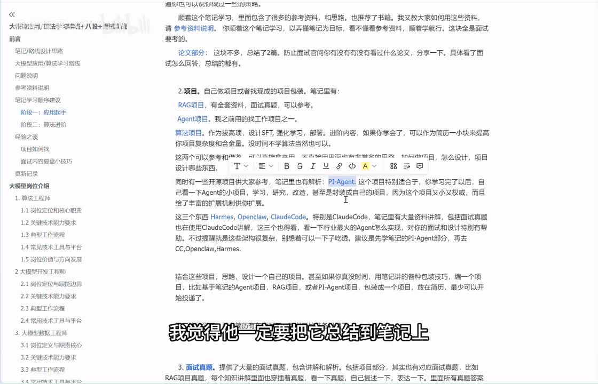
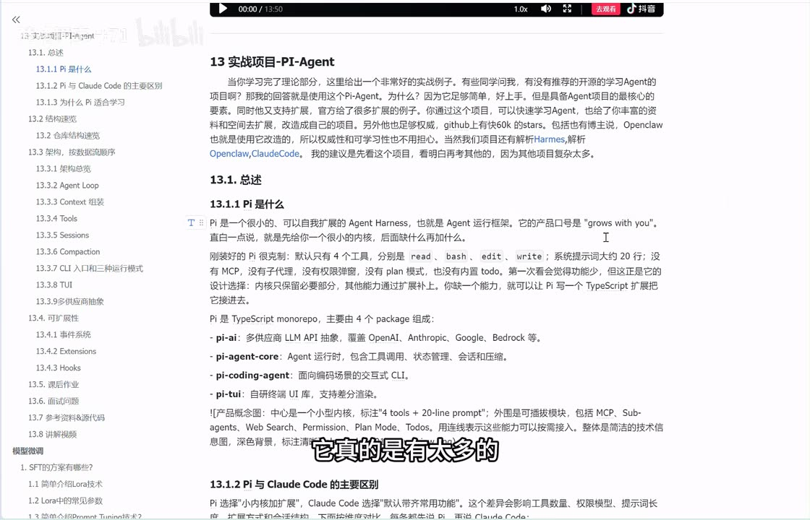
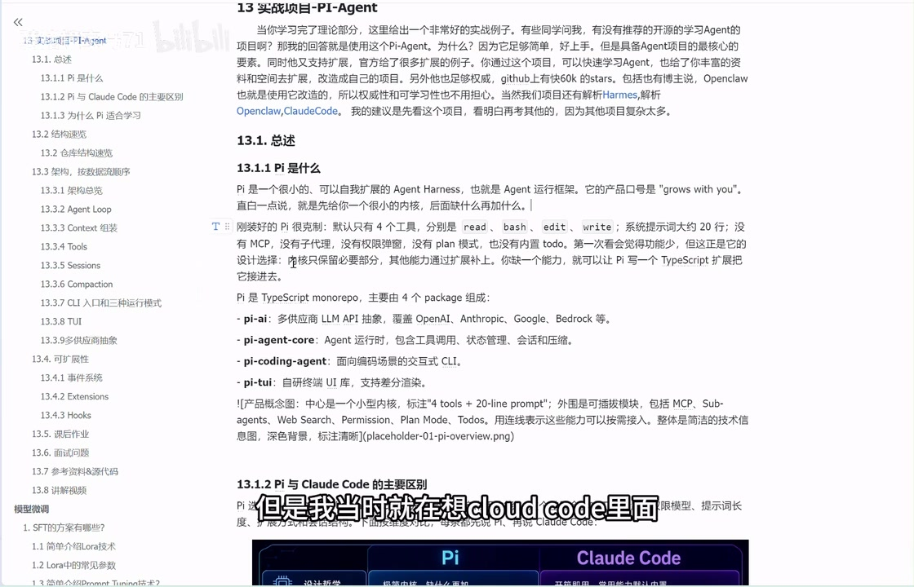
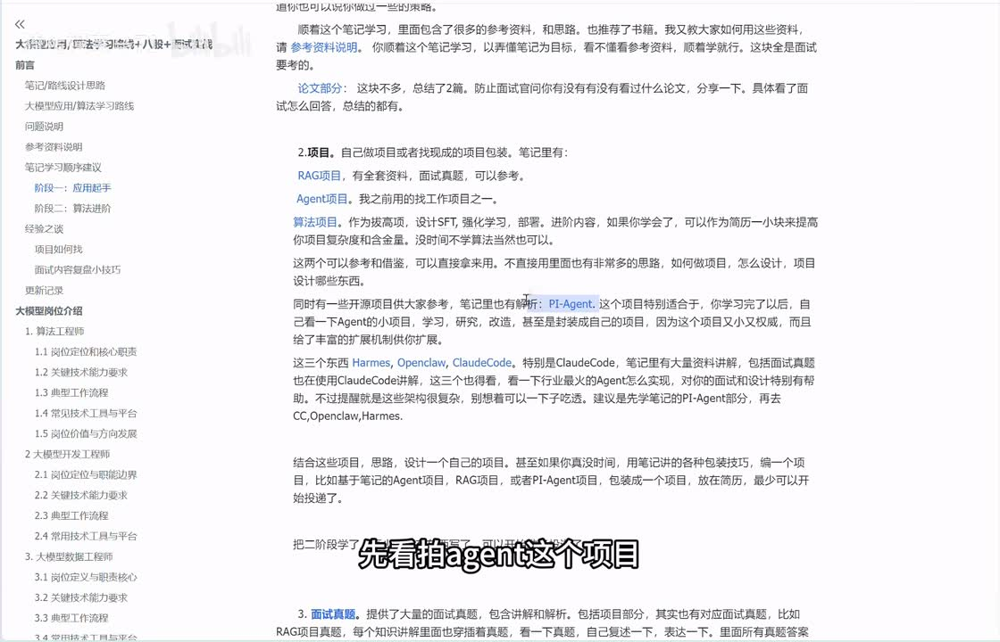

# 推荐一个比Claudecode更适合学习的Agent项目

> 来源：[Bilibili 视频](https://www.bilibili.com/video/BV1Bijf66Efs)<br>
> UP 主：骑猪撞宝马71｜时长：47:31｜合集：AIcode  
> 主题：以 **Pi / Pi-Agent** 为例，理解一个最小可扩展 Coding Agent 的架构、会话、上下文压缩与扩展机制。

## 小结

视频推荐了一个被称为 **Pi / Pi-Agent** 的开源 Coding Agent 项目。作者的核心判断是：相较于 Claude Code 这类功能完整、内部模块较多的产品，Pi 的默认内核更小，保留了 Agent 学习与面试中最关键的模块，因此更适合作为初学者阅读源码、手写复现与二次开发的入口。

作者将其设计理念概括为 **“grows with you”**：核心仅提供必要能力，其他能力通过插件、Hooks、事件与扩展机制逐步加入。视频强调，这并不等于项目是“玩具”；按作者陈述，其 GitHub star 约为 64k，且网络资料中有“OpenClaw 在其基础上改造”的说法，但后者仅为作者转述，不能据此当作已独立验证的事实。

视频重点拆解了 Pi 的分层结构：`pi-ai` 负责多模型适配，`pi-agent-core` 承担 Agent Loop、工具、会话与压缩，`pi-coding-agent` 组织 Coding Agent 产品入口，`pi-tui` 处理终端界面。核心运行逻辑仍是典型 **ReAct Loop**：组装上下文 → 请求模型 → 判断是否调用工具 → 执行工具并回填结果 → 继续推理，直到模型给出最终回复。

对于工程学习，视频尤其强调四类高频主题：上下文中应包含什么、JSONL + 父节点指针如何保存会话、上下文超限时如何做摘要压缩、如何通过 RPC 与 Extensions 把最小 Agent 接入其他系统。作者还提示 Pi 默认缺少 Agent 自维护的长期记忆、权限机制、MCP 等能力；这些既是限制，也是适合练习扩展的方向。

本视频是架构讲解与学习建议，不是可直接复制执行的安装教程。ASR 中部分专有名词存在识别错误，本文以视频画面中的 “PI-Agent”、标题与上下文进行谨慎校正；涉及项目具体版本、star 数、生态集成状态及可用模型范围，均具有时效性，实践前应以项目官方仓库与文档为准。

## 思维导图





## 目录

- [背景、定位与学习建议](#背景定位与学习建议)
- [Pi 的分层结构与 Claude Code 对比](#pi-的分层结构与-claude-code-对比)
- [Agent 核心架构：ReAct Loop 与上下文](#agent-核心架构react-loop-与上下文)
- [工具调用、会话存储与回退](#工具调用会话存储与回退)
- [上下文压缩机制](#上下文压缩机制)
- [CLI、模型适配与可扩展性](#cli模型适配与可扩展性)
- [学习任务、面试重点与限制](#学习任务面试重点与限制)
- [关键帧索引](#关键帧索引)
- [字幕比对](#字幕比对)
- [评论分析](#评论分析)
- [处理记录](#处理记录)

## 背景、定位与学习建议

### 为什么先学 Pi，再读复杂 Coding Agent？[00:00](https://www.bilibili.com/video/BV1Bijf66Efs?t=0)

作者提出的学习路线调整是：在深入 Claude Code、OpenClaw、Hermes 等较复杂项目之前，先阅读 Pi-Agent。理由不在于 Pi 功能更多，而在于它用较小的实现覆盖了 Coding Agent 的关键构件，便于建立“Agent 到底由什么构成”的底层认识。

视频将 Pi 描述为一个 Coding Agent，并指出其学习价值主要来自以下三点：

1. **内核小、组织清楚**：关键模块集中，初学者更容易从代码中找到 Agent Loop、上下文、工具、会话和压缩逻辑。
2. **核心要素齐全**：虽然功能较少，但作者认为它覆盖了 Agent Loop、Context、Tool、Session 等面试与工程讨论中的基础概念。
3. **扩展空间大**：默认未实现的能力可由使用者以插件或扩展方式补足，因此适合把“阅读源码”转化为“完成一个具体功能”。

作者以自己复盘面试时遇到的 Session / 会话存储问题为例：复杂项目的资料有时不会完整解释某个核心模块，阅读最小实现可以更容易反向理解其原理。这里的结论是作者的学习经验，并非对所有项目文档质量的普遍评价。



> 图：画面展示作者笔记中“实践项目—PI-Agent”附近的学习建议，以及“先看 Pi-Agent 再看复杂 Agent”的观点。它有助于理解视频的出发点：不是比较单一功能强弱，而是比较学习路径的进入成本。

### 项目定位、成熟度与时效性 [03:42](https://www.bilibili.com/video/BV1Bijf66Efs?t=222)

作者反复提醒观众不要因代码量较少就把 Pi 看成玩具项目。视频中提出两项依据：

- 作者称该项目 GitHub star 在讲解时约为 **64k**；
- 作者称自己在网络资料中看到“OpenClaw 基于它进行改造”的说法。

这两项都属于视频中的陈述，其中第二项是间接信息。项目热度、star 数、下游项目关系都会随时间变化，不能将它们视作不变的技术事实。更稳妥的学习判断标准应是：源码是否可读、核心边界是否明确、扩展接口是否稳定，以及你是否能完成一个可验证的改造任务。

视频的目标不是从零部署 Pi，而是帮助观众：

- 理解 Pi 是什么以及它为何适合入门；
- 认识其核心架构与模块关系；
- 理解可扩展性如何实现；
- 对照常见面试题准备 Agent 项目表述；
- 以权限、记忆、MCP、回退文件等功能为后续实践方向。

## Pi 的分层结构与 Claude Code 对比

### 四个 Package 的职责 [07:08](https://www.bilibili.com/video/BV1Bijf66Efs?t=428)

视频将 Pi 说明为一个 TypeScript monorepo，并按职责分为四个主要 package：

| Package | 视频中的职责描述 | 在整体中的位置 |
| --- | --- | --- |
| `pi-ai` | 对多厂商 LLM API 做抽象和适配 | 最底层模型访问层 |
| `pi-agent-core` | 处理 Agent 运行时核心能力，如工具调用、状态、会话与压缩 | Agent 内核 |
| `pi-coding-agent` | 面向编码场景组织产品入口与逻辑 | 上层应用 |
| `pi-tui` | 自研终端 UI 库，负责终端界面渲染 | 可选界面层 |

依赖关系可概括为：

```text
pi-coding-agent
 ├─ pi-agent-core
 │   └─ pi-ai
 └─ pi-tui
```

其中，左侧链路 `pi-coding-agent → pi-agent-core → pi-ai` 可以构成不依赖 UI 的核心执行路径；`pi-tui` 则负责交互界面。这样的拆分意味着同一套 Agent 内核可以被终端 UI 使用，也能在没有 UI 的情况下以其他方式调用，这是后文 RPC 模式可复用性的基础。



> 图：画面中的笔记明确列出 `pi-ai`、`pi-agent-core`、`pi-coding-agent`、`pi-tui` 四个模块及职责。该帧比口述更适合用来建立模块边界，避免将 UI、Agent 内核与模型适配层混为一谈。

### Pi 与 Claude Code：默认能力的取舍 [10:06](https://www.bilibili.com/video/BV1Bijf66Efs?t=606)

作者并未认为 Pi 在所有场景都优于 Claude Code；视频中的“更适合学习”指向的是**最小内核可理解性与可改造性**。对比重点如下。

| 维度 | Pi（视频描述） | Claude Code（视频描述） | 对学习的含义 |
| --- | --- | --- | ---|
| 设计哲学 | 只保留必要能力，随使用扩展 | 默认提供较多开箱能力 | Pi 更容易先建立主干模型 |
| 默认工具 | 普通读写模式下强调 4 个基础工具 | 工具较多，包含更复杂能力 | Pi 的工具面更小 |
| 系统提示词 | 约 20 行 | 多类功能有较多提示词 | Pi 更容易追踪提示词作用 |
| 权限 | 默认不内置复杂权限策略 | 视频称其具备沙箱、权限确认等机制 | 权限可作为 Pi 的扩展练习 |
| MCP | 默认未集成 | 视频认为其生态能力更丰富 | Pi 需自行接入 Adapter |
| 子 Agent | 默认不强调此能力 | 可将子 Agent 作为工具使用 | 多 Agent 会增加理解复杂度 |
| 自动长期记忆 | 没有 Agent 自维护的 Memory | 视频称 Claude Code 有对应机制 | Pi 需依赖用户维护文件或自行实现 |
| 回退文件 | 会话可回退，默认不回滚文件 | 视频认为回退会覆盖到文件层面 | Pi 留出插件式补足空间 |
| Agent Loop | 从零手写、轻量 | 依赖其框架与更多封装 | Pi 适合读到循环细节 |

需要注意两个边界：

- 上表是视频作者的架构性概括，不应替代两者的官方版本文档；
- “简单”不代表生产能力必然不足，“复杂”也不代表不适合学习。若目标是直接获得成熟工作流，功能完整的 Agent 可能更合适；若目标是理解机制并改造，Pi 的小内核更有利。



> 图：画面进入 Pi 与 Claude Code 的对比章节。该帧的价值在于呈现视频比较的上下文：作者比较的是设计哲学、工具、提示词、权限和扩展方式，而不是简单宣称某个产品全面更强。

## Agent 核心架构：ReAct Loop 与上下文

### 总览：输入层、循环层、会话层 [14:37](https://www.bilibili.com/video/BV1Bijf66Efs?t=877)

视频将典型 Coding Agent 的整体架构概括为三类工作：

1. **输入与运行方式适配**：用户输入可以进入交互式终端界面，也可以经由一次性命令或 RPC 后端模式进入。
2. **Agent Loop**：在模型推理、工具调用、工具结果回填之间循环，是 Agent 的核心控制流。
3. **会话状态处理**：运行中和运行结束后保存必要信息，以支持恢复、回退、分支和上下文重建。

作者还把 Pi 与 OpenClaw 进行抽象层面的对照：OpenClaw 可能需要 Gateway 来处理飞书、Telegram 等多渠道消息，输入适配层更复杂；但在“接收输入 → 运行 Agent Loop → 保存会话”这一主干上，结构仍然相似。

### ReAct Loop：模型与工具如何形成闭环 [17:22](https://www.bilibili.com/video/BV1Bijf66Efs?t=1042)

视频将 Pi 的 Agent Loop 归为标准 ReAct 范式。可以按如下顺序理解：

1. 接收用户输入；
2. 组装系统提示词、工具定义、历史消息等上下文；
3. 调用模型进行推理；
4. 若模型返回工具调用请求，则执行工具；
5. 将工具执行结果写回上下文；
6. 模型基于新信息继续推理；
7. 当模型不再请求工具时，输出最终回答并结束当前循环。

```text
用户输入
   ↓
组装 Context
   ↓
LLM 推理 ── 不调用工具 ──→ 最终回复
   │
   └─ 调用工具
         ↓
      执行工具
         ↓
      工具结果回填
         └──────────────→ LLM 推理
```

作者指出，这类 Loop 是 Agent 面试中常见的讨论点。回答“如何工程化实现 Agent Loop”时，关键不只是说“模型会调用工具”，还要说清：

- 工具调用是循环继续的条件；
- 工具结果必须成为后续模型推理的上下文；
- 无工具调用或满足终止条件时，才结束循环；
- 会话写入与压缩可发生在循环的特定阶段。

### Context：一次模型调用中包含什么 [19:15](https://www.bilibili.com/video/BV1Bijf66Efs?t=1155)

作者列举了 Pi 语境下上下文组装的主要组成部分：

| 上下文组成 | 作用 | 视频中的定位 |
| --- | --- | --- |
| 系统提示词（System Prompt） | 定义 Agent 身份、行为规则与工作范围 | 基础角色约束 |
| `AGENTS.md` | 由用户维护的规则、项目约定等 | 用户维护的长期信息 |
| Skills 描述 | 告诉模型有哪些技能可用及大致用途 | 渐进披露的索引层 |
| 工具描述 | 声明工具名、用途、参数与调用方式 | 让模型能选择工具 |
| 历史摘要 | 在历史较长时保留早期关键事实 | 压缩后的上下文 |
| 当前历史消息 | 保留近期对话、工具调用及结果 | 当前任务的直接依据 |

视频特别区分了两种“长期信息”：

- `AGENTS.md`、Skill 等可以被视为用户维护或预先沉淀的长期规则、知识；
- **Agent 自动长期记忆（Memory）**则指 Agent 根据持续对话自行提炼并写入的用户偏好、长期事实等。

按作者的讲解，Pi 缺少后一种自动维护机制：它不会自行从多轮对话中记住“用户是程序员”或“用户要求避免某类做法”等事实，除非用户将规则写入 `AGENTS.md`，或开发者另行实现记忆模块。这是功能限制，也是合理的二开入口。

### Skill 的渐进式加载 [22:39](https://www.bilibili.com/video/BV1Bijf66Efs?t=1359)

视频解释了 Skill 不必一开始把全文塞入上下文的原因与过程：

1. 初始 Context 先提供每个 Skill 的描述或索引；
2. 模型根据当前任务推理是否需要某个 Skill；
3. 如果需要，则通过诸如 `read` 的工具读取对应 Skill 正文；
4. 读取结果再被加入上下文；
5. Agent 继续下一轮推理。

这是一种**渐进式披露（progressive disclosure）**思路：先给模型足够用于“发现能力”的摘要，再按需加载详细内容。它能减少无关文本占用上下文窗口，但前提是 Skill 描述足够清晰，且读取工具可用。

## 工具调用、会话存储与回退

### 默认工具与只读模式差异 [24:17](https://www.bilibili.com/video/BV1Bijf66Efs?t=1457)

视频称 Pi 在普通可读写情形下默认强调四个工具：

- `read`：读取文件内容；
- `bash`：执行命令；
- `edit`：编辑已有文件；
- `write`：写入文件。

作者解释，普通模式下没有额外提供 `grep`，是因为 Agent 可以通过 `bash` 执行对应搜索命令。但在**只读模式**下，若不允许执行 Bash，就需要专门提供搜索类能力，因此该模式下工具集合会有所不同。

这说明工具设计不能只看“工具数量”，还要看权限边界：当通用执行工具被禁用时，原本由它覆盖的读取、搜索能力是否需要被更细粒度的工具补上。

### Sessions：JSONL 与父节点指针 [26:15](https://www.bilibili.com/video/BV1Bijf66Efs?t=1575)

作者将 Session / 会话存储视为高频面试与实际工程问题：当进程中断、用户重新进入时，系统如何恢复此前对话上下文？

视频的核心描述为：

- 会话使用 **JSONL** 保存；
- JSONL 即“每一行是一条 JSON 记录”；
- 一条记录可表示用户输入、模型输出、工具调用或其他会话事件；
- 每个节点保存 `parentId`，指向父节点；
- 当前节点沿 `parentId` 向上追溯，可恢复当前分支的历史链路。

抽象示例：

```text
A(根输入) → B(模型回复) → C(用户输入) → D(模型回复)
```

如果当前指针位于 `D`，则按照 `D → C → B → A` 反向追溯，重建当前会话所需的上下文；实现时再按正向顺序组织给模型。作者将其形容为保存父节点的“类似单向链表”结构。

视频没有给出精确文件路径、完整 JSON Schema 或落盘时机的源码细节，只说明写入可以按业务选择：可在每轮结束时写，也可在每条消息、模型回复或压缩节点产生时写入。

### 分支、回退与数据保留 [29:54](https://www.bilibili.com/video/BV1Bijf66Efs?t=1794)

视频用 `A → B → C → D` 说明会话分支：

- 正常连续对话形成一条线性链；
- 若用户从较早节点 `B` 回退并输入新内容 `E`，则形成 `A → B → E`；
- 原有 `C → D` 不必删除；
- 整个会话因而成为树状结构，当前指针决定使用哪一条分支。

```text
A → B → C → D
     └→ E
```

回退的核心操作不是删除旧数据，而是**将当前指针移动到指定历史节点**，之后的新输入基于该节点生成新的子分支。旧分支仍可保留，因此可以在之后再次访问。

作者特别指出 Pi 的一个取舍：它可以回退对话节点，但默认不随之回退工作区文件。相比于将对话状态与文件系统状态强绑定的做法，这降低了内核复杂度，但也可能造成“对话退回了，代码文件却仍保持后续修改”的不一致。视频称官方提供了插件 / 扩展接口与示例，可由使用者实现文件回退能力；具体 API 和可用示例需以官方仓库当前版本核实。

## 上下文压缩机制

### 压缩为什么重要 [33:44](https://www.bilibili.com/video/BV1Bijf66Efs?t=2024)

视频将压缩视为影响 Agent 长对话质量的关键模块。上下文长度有限，若完整保留所有历史消息，最终会超出模型窗口；若粗暴丢弃历史，则模型会遗忘已完成的工作、用户约束与关键决策。

作者的观点是：不同 Agent 在长对话里“越聊越聪明”或“越聊越笨”的体感差异，往往与压缩策略有关。Pi 采用的策略相较复杂 Agent 更朴素，因而也更适合先理解其基本原理。

### 何时触发、保留什么 [35:09](https://www.bilibili.com/video/BV1Bijf66Efs?t=2109)

视频提到 Pi 的压缩可能在两个时机检查或触发：

1. Agent 向用户返回结果之后；
2. 用户输入新一轮对话之后。

关于阈值，作者用“默认至少预留 16K 上下文”的思路解释：如果可用剩余上下文不足约 **16K**，则开始压缩。这里的“16K”是视频讲解中提到的参数级信息；具体计算方式、默认值与项目版本可能变化，实施时应以代码或配置为准。

压缩范围遵循“**保留最近原文，摘要早期历史**”的原则。例如当前已积累 `A` 至 `I` 的历史，系统可能保留靠近当前任务的 `E` 至 `I` 原文，对更早的 `A` 至 `D` 做摘要。最近消息通常更容易与当前任务直接相关，因此优先保持原始细节。

### 不能随意切断工具调用和回合 [37:05](https://www.bilibili.com/video/BV1Bijf66Efs?t=2225)

视频强调压缩切分存在工程约束，而非按消息条数机械截断：

1. **工具调用与工具结果必须成对**  
   如果一条消息是“调用工具 X”，紧接着一条是“工具 X 返回结果”，二者不应被切到摘要边界两侧，否则模型可能看到结果却不知道其来源，或看到调用却不知道结果。

2. **不能把完整回合切成难以理解的两段**  
   如果压缩边界将一轮相关对话拆开，系统需要调整边界，或额外对被切开的部分先做一次补充摘要，使保留区与摘要区都保持语义完整。

这是面试中可体现工程理解的细节：压缩不是只做 Token 截断，而是要维护消息之间的结构与因果关系。

### 摘要应保存的关键信息 [39:02](https://www.bilibili.com/video/BV1Bijf66Efs?t=2342)

作者总结了摘要提示词应尽量保留的内容：

- 用户目标；
- 约束条件；
- 当前进度；
- 关键决策及“为什么这样做”；
- 下一步计划；
- 关键上下文，如已使用的工具、重要数据、涉及的文件或引用信息。

可以将其整理为一个通用摘要模板：

```text
任务目标：
约束与偏好：
已完成进展：
关键决策及理由：
工具调用与重要结果：
当前未解决问题：
建议的下一步：
```

视频认为摘要本质上仍通过大模型与专用提示词生成。摘要质量取决于模板是否覆盖任务状态，也取决于模型是否能正确区分“已完成”“待完成”和“不可违反的约束”。

### 有压缩节点时如何恢复上下文 [40:17](https://www.bilibili.com/video/BV1Bijf66Efs?t=2417)

当会话中发生压缩，视频以新增摘要节点 `K` 说明恢复策略：

```text
A → B → C → D → K → E
```

其中：

- `K` 记录此前历史已经发生摘要；
- 早期内容如 `A、B` 被浓缩成摘要；
- 最近内容如 `C、D` 保留原文；
- 新消息 `E` 位于当前分支。

因此恢复 `E` 的上下文时，不必再无限追溯并加载所有原始节点，而是读取：

```text
历史摘要 + 保留的最近原文 + 当前新消息
```

这正是会话树、当前指针与压缩节点需要协同设计的原因：它既要支持恢复，也要避免恢复时重新引入已被压缩的全部历史。

## CLI、模型适配与可扩展性

### 三种运行入口：交互、RPC、Print [41:31](https://www.bilibili.com/video/BV1Bijf66Efs?t=2491)

视频将 Pi 的运行方式概括为三类：

| 模式 | 含义 | 适用情形 |
| --- | --- | --- |
| Interactive | 提供交互式终端界面，由 TUI 支持 | 人直接在终端中使用 Agent |
| RPC | 将核心能力作为后端接口供其他程序调用 | 接入其他应用或 Agent 系统 |
| Print / Stdio | 一次输入、一次输出 | 脚本化、简单命令式调用 |

作者重点推荐从架构角度理解 RPC：如果 Agent 核心不与 UI 强耦合，就可以不启动终端界面，而让其他系统以函数式 / 远程调用式方式复用其 Coding 能力。视频以将 Pi 接入 OpenClaw 类系统为例说明这一点。

### `pi-ai`：统一多模型差异 [43:02](https://www.bilibili.com/video/BV1Bijf66Efs?t=2582)

视频认为模型适配层的意义在于：上层 Agent 不需要关心不同模型供应商的请求细节。不同厂商可能存在以下差异：

- HTTP Endpoint、URL 路径与请求格式不同；
- Chat / Responses / Completion 等接口形态不同；
- 工具定义、工具调用请求和工具结果回填的协议不同；
- Token 用量、停止原因等返回字段不同；
- 支持的模型能力和约束不同。

`pi-ai` 的目标是将这些差异封装到统一接口后面，使 `pi-agent-core` 以一致方式调用模型。作者将这种思路概括为策略模式与工厂模式的组合：上层按统一接口发起调用，底层根据 Provider 路由到具体实现。

### Events、Hooks 与 Extensions [44:12](https://www.bilibili.com/video/BV1Bijf66Efs?t=2652)

视频把 Pi 的“grows with you”落实为事件与扩展机制：

1. Agent 在关键生命周期节点发出事件，例如 Agent 开始运行、一轮会话开始、工具执行等；
2. Hook 或 Extension 订阅这些事件；
3. 扩展代码在特定时机注入行为、修改状态或增加功能；
4. 默认内核保持精简，复杂能力在外层按需加载。

这种方式适合将以下能力从内核中解耦：

- 启动欢迎语；
- 文件回退；
- 权限确认；
- MCP Adapter；
- 计划模式、待办机制；
- 自定义主题；
- 长期记忆；
- 审计、日志或外部系统集成。

视频没有展示具体 Extension 源码、接口签名或配置命令，因此不能将这些任务视为已经在视频中给出的可直接运行实现；它们是作者建议的学习方向。

## 学习任务、面试重点与限制

### 建议的二次开发顺序 [45:06](https://www.bilibili.com/video/BV1Bijf66Efs?t=2706)

作者建议先理解最小核心，再从单点功能开始扩展。可按难度渐进安排：

1. **阅读与验证基础链路**
   - 跟踪输入如何进入 Agent Loop；
   - 找到模型调用、工具调用、工具结果回填的位置；
   - 观察 Session 如何写入及恢复。

2. **实现低风险扩展**
   - 在启动事件中输出欢迎语；
   - 增加自定义主题或 TUI 行为；
   - 为工具增加日志、耗时与结果审计。

3. **补齐 Agent 工程能力**
   - 实现权限确认或只读策略；
   - 实现 MCP Adapter；
   - 实现 Plan Mode、Todo 等任务管理能力；
   - 实现文件回退与会话回退协同。

4. **实现更复杂状态能力**
   - 增加自动长期记忆；
   - 设计记忆提取、写入、检索与过期策略；
   - 将 Pi 通过 RPC 接入其他 Agent / 应用系统；
   - 适配不同模型或本地模型。

作者提到可接入本地模型及不同供应商模型，但具体可用性受项目当前 Provider 支持、模型工具调用能力、认证方式和部署环境制约，应以实际测试为准。

### 面试表述可覆盖的主题 [46:01](https://www.bilibili.com/video/BV1Bijf66Efs?t=2761)

作者表示已在配套笔记中整理约六七类常考问题。根据视频实际讲解，围绕该项目准备面试时至少应能回答：

1. **Agent Loop 如何工作？**  
   说明模型推理、工具调用、结果回填与终止条件构成循环。

2. **Context 包含哪些内容？**  
   说明系统提示词、用户规则文件、Skill 描述、工具描述、历史摘要和近期消息的职责。

3. **Session 如何存储与恢复？**  
   说明 JSONL、事件记录、`parentId`、当前指针和沿父链恢复当前分支。

4. **为什么要压缩上下文？如何避免语义损失？**  
   说明 Token 限制、近期原文保留、早期摘要、工具调用与结果配对、回合边界保护。

5. **Pi 的扩展机制是什么？**  
   说明事件、Hooks、Extensions 的订阅与注入模式。

6. **多模型适配如何设计？**  
   说明统一接口屏蔽 HTTP、消息格式、工具协议、Token 统计等 Provider 差异。

7. **Pi 相对于复杂 Agent 的优缺点是什么？**  
   优点是内核小、学习与改造友好；限制是默认功能少，权限、MCP、自动记忆、文件回退等可能需要自行补齐。

### 结论与限制 [47:12](https://www.bilibili.com/video/BV1Bijf66Efs?t=2832)

视频最可迁移的经验不是“必须选择 Pi”，而是以下工程学习方法：

- 先选择一个能完整跑通核心闭环的最小项目；
- 按“输入—上下文—模型—工具—状态”顺序阅读；
- 对每个抽象补一个可运行扩展，而不是只停留在概念层；
- 区分“用户维护的规则文件”和“Agent 自动维护的长期记忆”；
- 在实现回退、压缩、权限时，重点维护状态一致性与可恢复性。

同时应保留以下限制意识：

- 视频未提供完整安装命令、仓库链接、版本号和可复现源码片段；
- 项目名称在 ASR 中有多种误识别，本文以画面和标题中的 **PI-Agent / Pi** 为准；
- GitHub star、生态集成和默认功能集会随版本变化；
- 作者提到的 OpenClaw 关联为网络资料转述，未在素材中给出独立证据；
- Pi 的极简设计意味着生产使用时应自行评估安全性、权限控制、文件回退、模型稳定性、上下文成本与观测能力。

## 关键帧索引

| 关键帧 | 对应正文 | 图片价值 |
| --- | --- | --- |
|  | 背景、定位与学习建议 | 直接呈现作者笔记中的项目学习路线和推荐语境。 |
|  | 背景、定位与学习建议 | 画面字幕强调“先看 PiAgent 这个项目”，可辅助确认视频主张。 |
|  | Pi 的分层结构 | 清楚列出 `pi-ai`、`pi-agent-core`、`pi-coding-agent`、`pi-tui` 的职责。 |
|  | Pi 与 Claude Code 对比 | 呈现对比章节入口，帮助读者理解“适合学习”的比较维度。 |

> 未将其余关键帧强行插入正文：当前素材中没有逐帧时间码、画面文字转录或对应截图描述。为避免把画面内容、时间位置与结论错误绑定，仅选取能由已提供画面直接确认且与正文主题高度相关的帧。

## 字幕比对

本次任务中**站内字幕与 ASR 均已获取并执行比对**。站内字幕内容与视频主题完全不符，呈现借钱、拍照、洗澡、饮酒、歌曲歌词等片段，无法用于本视频知识整理；本次 ASR 虽有大量同音词和专名误识别，但内容与视频讲解的 Pi-Agent、Claude Code、Session、Context、压缩和扩展机制一致。

| 字幕来源 | 完整性 | 专有名词 | 时间轴 | 主要问题 |
| --- | --- | --- | --- | --- |
| Bilibili 站内字幕 | 与本视频主题不匹配，无法覆盖讲解内容 | 几乎没有 Agent 相关术语 | 未提供可用的逐句时间码 | 疑似错误字幕或串片字幕，内容为日常对话与歌词 |
| 本次 ASR 字幕 | 基本覆盖从项目推荐到总结的完整讲解 | 有较多误识别，但可由上下文校正 | 素材未提供逐句时间码，本文时间轴按视频结构估算 | 中英混用、同音词替换、项目名与术语识别不稳定 |

### 最终字幕选择与校正原则

- **最终采用：本次 ASR 为主，结合标题、视频描述和关键帧进行人工语义校正。**
- **不采用站内字幕**：其内容与视频实际主题明显无关。
- 本文不会把 ASR 无法可靠确认的词语扩写成具体实现细节。

| ASR 原文或近似识别 | 本文采用写法 | 校正依据 |
| --- | --- | --- |
| “PyAgent”“派 Agent”“Python 的” | Pi / Pi-Agent | 视频标题、关键帧中的“PI-Agent”与上下文一致 |
| “Cloud Code”“Clock Code”“Claw Code” | Claude Code | 标题、视频描述及上下文多次对比 Coding Agent |
| “Sesson”“SysN” | Session / 会话存储 | 前后内容明确讨论 JSONL、父节点与会话恢复 |
| “Contacts” | Context / 上下文 | 后续列举系统提示词、工具描述、历史消息等 |
| “RBC” | RPC | 后文解释为作为后端供其他程序调用 |
| “TOI / TWI” | TUI | 关键帧与语义均指终端 UI |
| “Grip” | `grep` | 语境是文件关键字搜索命令 |
| “Jason I / Jason L” | JSONL | 明确解释为每行一个 JSON |
| “gross with you / Growthless” | grows with you | 视频及关键帧中的产品口号语境 |

## 评论分析

仅处理可获取的热评前三条。三条评论均未提供对项目技术事实的有效补充，主要反映观众希望获得笔记或视频摘要。

| 排名 | 用户 | 点赞 | 评论概括 | 可采纳信息与可信度 |
| --- | --- | ---: | --- | --- |
| 1 | 别打我会偷出来 | 2 | 询问“怎么获取笔记” | 说明笔记获取方式是观众关注点；未包含技术事实，也未见作者回复，因此无法确认获取渠道。 |
| 2 | blackzer0 | 1 | 建议“用 claude 总结，发我邮箱” | 是对视频内容整理方式的个人请求或建议，不构成对 Pi、Claude 或项目机制的事实陈述。 |
| 3 | 大漠孤烟crazy | 1 | 请求总结视频重点并发送邮箱 | 反映对摘要资料的需求；没有补充项目来源、版本、代码或实践经验。 |

结论：现有热评没有围绕 Pi 的功能、性能、安装或作者“OpenClaw 改造”说法提出可验证证据，因此不应将评论内容用于增强正文事实结论。

## 处理记录

- **Worker ID**：`worker-mrj0wbly-5dc4e50c`
- **模型**：`gpt-5.6-terra`
- **任务素材**：Bilibili 元数据、视频描述、站内字幕、已执行的 ASR 字幕、可获取热评前三条、12 个关键帧路径及其中提供的画面。
- **调用工具与处理方式**：基于任务提供的素材清单进行文本、元数据、关键帧和评论综合整理；未在素材外检索项目仓库、star 数或第三方生态关系。
- **字幕选择**：站内字幕与视频主题不匹配，判定不可用；本次 ASR 已执行并作为正文主来源。对 `Pi-Agent`、`Claude Code`、`Session`、`Context`、`RPC`、`TUI`、`JSONL` 等术语，使用关键帧、标题、描述和上下文进行校正。
- **关键帧选择依据**：优先选取能够直接确认视频结构、项目名、四层 Package 和对比主题的 `frame-001.jpg` 至 `frame-004.jpg`；其余帧缺乏逐帧文本与时间对应信息，未臆测插用。
- **评论范围**：严格限制为可获取热评前三条，未扩展分析其他评论。
- **缓存清理**：未产生可操作的本地缓存清理记录；素材清单仅提供已生成的媒体、字幕、ASR 与评论输出路径，未提供删除执行结果。
- **未解决问题**：
  - 素材未给出逐句字幕时间码，章节时间轴依据视频讲解顺序与总时长做结构化估算；
  - 未提供项目官方仓库 URL、精确版本、完整配置或代码，文中不将视频口述扩展为可验证的实现事实；
  - GitHub star 数、“OpenClaw 基于 Pi 改造”等均按视频作者陈述保留时效与证据限制。
