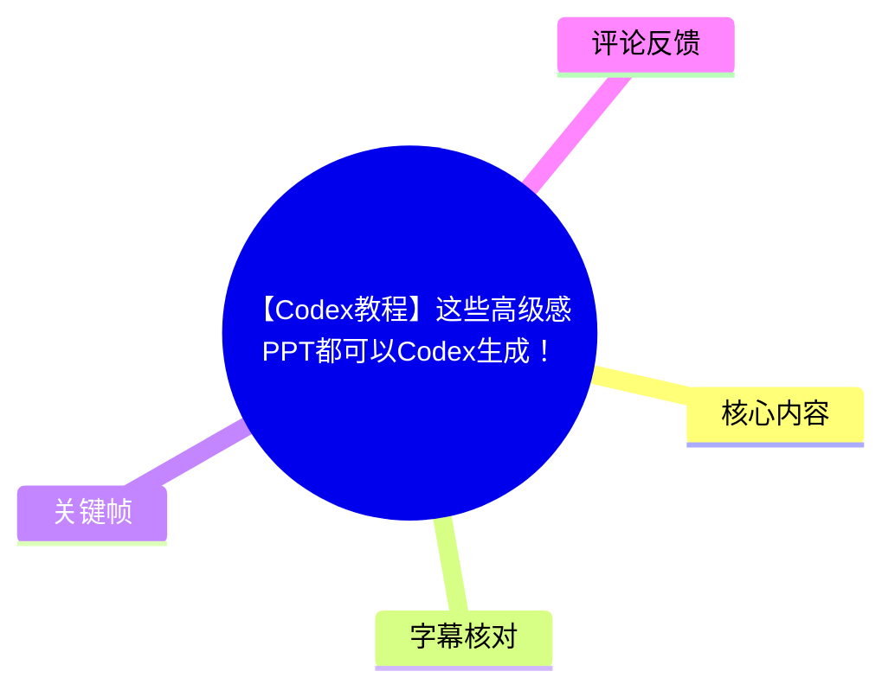
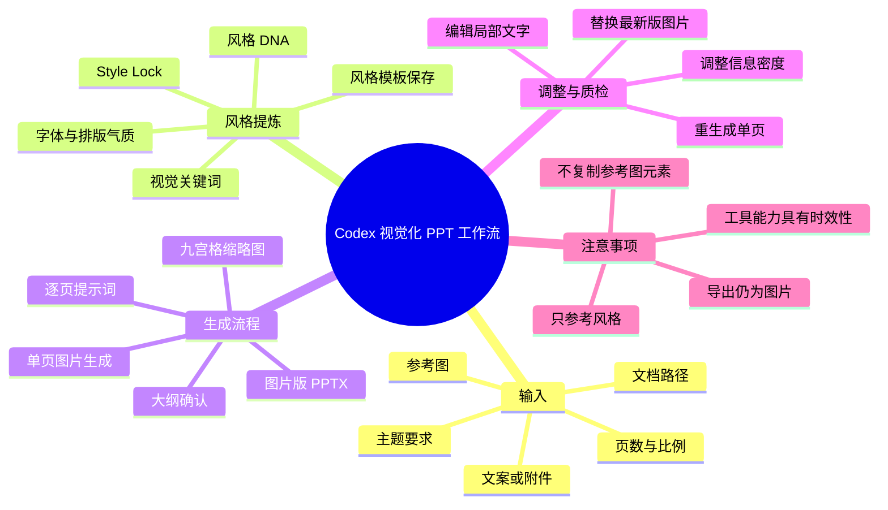
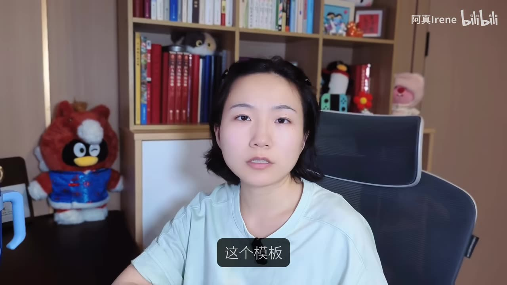
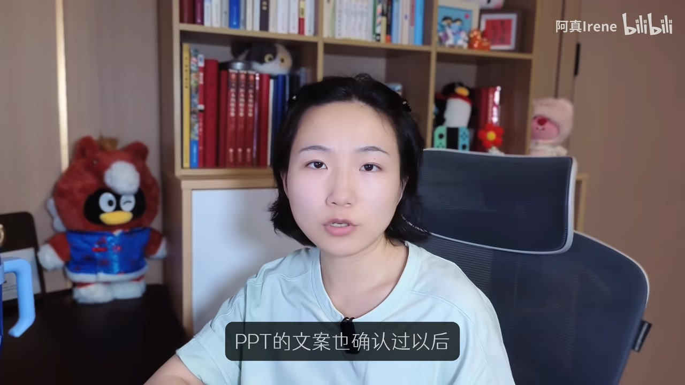

## 小结

这支视频讲解如何在 Codex 中调用 `visual-style-ppt-skill`，将参考图的视觉特征提炼为可复用的风格文档，再根据已有文案或主题生成图片版 PPT。视频简介提供的项目地址为：[irenerachel/visual-style-ppt-skill](https://github.com/irenerachel/visual-style-ppt-skill)。

核心工作流不是直接得到可自由编辑的原生 PPT，而是：**参考图/资料输入 → 风格提炼与锁定 → 生成大纲和逐页提示词 → 九宫格缩略图统一风格 → 逐页出图 → 单页修改 → 导出图片版 PPTX 或压缩包**。其中，大纲确认和逐页检查是避免返工的关键环节。

UP 主演示了两类输入：一是使用默认的“终端科技杂志风格”生成学习路径 PPT；二是从参考图提取“儿童节晴空气球风”，并将其迁移到夏季驱虫活动策划案。满意的风格草案可以保存为模板，后续还可用于海报、文章插图或小红书图等任务。

视频强调，多页 PPT 先出九宫格/缩略图，主要是为了提升副标题、页面标题、小字、色调、框架等元素的一致性；直接逐页生成也可以，但跨页统一性可能较差。信息密度、页数和画幅需要在生成前明确提出，例如可要求 3:4 的小红书比例或 16:9 的演示比例。

限制也很明确：最终 PPT 内仍然是图片，而不是可逐对象编辑的文字、形状和图表。发现问题时，应通过对话重生成单张图片，或按视频所示在“Low art”中局部编辑图片文字后再替换导出。工具名称、模型能力、接口与模式可能随版本变化，不能将视频中的界面和功能视为长期不变的保证。

## 思维导图

## 目录

- [视频目标与输入条件](#视频目标与输入条件)
- [参考图反推风格与模板复用](#参考图反推风格与模板复用)
- [Skill 的完整生成流程](#skill-的完整生成流程)
- [默认风格：学习路径 PPT 演示](#默认风格学习路径-ppt-演示)
- [参考图风格：活动策划案演示](#参考图风格活动策划案演示)
- [模板保存、海报复用与改字](#模板保存海报复用与改字)
- [案例复盘与质量控制](#案例复盘与质量控制)
- [导出、限制与时效性](#导出限制与时效性)
- [字幕比对](#字幕比对)
- [评论分析](#评论分析)
- [处理记录](#处理记录)

## 视频目标与输入条件 [00:00](https://www.bilibili.com/video/BV192LX61E2d?t=0)

视频标题为“【Codex教程】这些高级感PPT都可以Codex生成！”，UP 主为阿真Irene，视频时长 735 秒，即 12 分 15 秒。视频围绕此前已分享过的一个 Skill 展开，重点是演示其使用方式，而不是讲解传统 PPT 软件中的手工排版。

可向 Skill 提供的内容包括：

1. **参考图**：用于提炼视觉风格；
2. **已有文案、附件或文档路径**：让工具基于既有内容规划 PPT；
3. **仅有主题要求**：如果没有文案，也可让工具自行规划内容；
4. **页数要求**：可直接告诉工具需要多少页；
5. **比例要求**：视频举例可指定 3:4，也演示了 16:9；
6. **内容密度偏好**：例如更简约、文字更少，或文字和图片细节更丰富。

> 图：画面展示“我们应该在 Codex 中做些什么？”以及输入区域，适合作为视频工作方式的起点说明。它表明本教程采用对话式任务交付，而非进入传统幻灯片编辑器后逐对象排版。

视频简介中给出的 GitHub 地址是 Skill 的直接获取线索：

- <https://github.com/irenerachel/visual-style-ppt-skill>

## 参考图反推风格与模板复用 [00:35](https://www.bilibili.com/video/BV192LX61E2d?t=35)

UP 主说明，给工具一张参考图后，它会尝试提炼该图的“风格 DNA”、相关视觉信息，以及用于复现的提示词。视频将这种结果称为可复用的视觉风格草案或风格文档。

该能力最初以 PPT 框架为目标，但视频明确提到也可用于：

- 文章插图；
- 小红书图；
- 海报；
- 其他配图类 Skill 的改造与调用。

### 风格草案包含的内容

以视频中的“儿童节晴空气球风”为例，工具会从参考图中整理出：

- 风格关键词；
- 字体与排版气质；
- 面向 PPT 的适配方式；
- 锁定风格所需的关键元素；
- 对风格的命名；
- 后续图片生成可调用的风格提示词。

视频的关键经验是：**满意时保存风格文档，不满意则不保存。** 保存后，下次只需重新提供该文档，即可继续调用相近的风格规则。

> 图：画面中的字幕为“这个模板”，对应将可复用风格保存为模板的概念。该帧的价值在于强调：最终可积累的不是某一套单次生成 PPT，而是一份可以重复调用的视觉风格资产。

### 参考图使用边界

UP 主特别提醒：参考图与最终输出的 PPT 不要过于相近，并且应明确要求工具：

> 只参考风格，不参考参考图的元素。

也就是说，应当迁移色彩、颗粒感、圆角矩形、字体层级、版面密度、框架感等抽象视觉规律，而非复用原图的具体物体、主题、文案、构图或高度可辨识的元素。

## Skill 的完整生成流程 [01:50](https://www.bilibili.com/video/BV192LX61E2d?t=110)

视频展示的完整链路可整理为以下步骤。

### 1. 读取资料与风格文件

工具首先读取用户提供的资料，例如学习路径文档、附件或文档路径；若用户未指定视觉风格，则使用默认风格文件。

视频中存在一个默认的“终端科技杂志风格”。当用户没有明确视觉方向时，可以直接采用这一默认风格。

### 2. 生成页数建议、大纲与图片提示词

Skill 会先生成：

- 建议页数；
- PPT 内容大纲；
- 各页的文案方向；
- 用于生成图片的提示词；
- 对应的生成参数。

视频中将“大纲”解释为 PPT 的文案大纲，将“提示词”解释为后续生成图片的输入。此阶段应优先检查内容逻辑、页数和信息密度，而不是急于出图。

### 3. 确认文案后再生成图片

UP 主强调，确认本轮 PPT 文案后，工具才会开始生成图片。若大纲信息过少、过多、结构不完整，或表达不符合需求，应在这里继续要求修改。

> 图：画面字幕明确写着“PPT 的文案也确认过以后”。该帧直接对应流程中的内容确认节点，说明先定文案再出图是本视频推荐的操作顺序，可减少后期因内容错误带来的整页重做。

### 4. 生成九宫格或缩略图图版

工具会先生成九宫格或缩略版图板，再逐页生成幻灯片图片。UP 主解释，这一步是为了尽量统一多页之间的：

- 副标题；
- 页面标题；
- 小字风格；
- 框架；
- 色调；
- 整体视觉语言。

视频也说明，不经过九宫格、直接输出图片不是不可以，但风格一致性可能会相对差一些。

### 5. 逐页生成幻灯片图片

在视频演示中，UP 主继续使用 `image2` 出图。界面会提示选择 A 模式或 B 模式；若不使用 Codex，视频提到可接入图片 API。由于素材未解释 A/B 模式、“API K”以及 `image2` 的具体技术差异，本文不对其功能、服务商或接口方式作额外推断。

### 6. 检查、改单页、导出

图片生成完后，应逐页检查。若个别页面有问题，可复制该页图片，并要求工具基于该图修改或重新生成。全部确认无误后，再要求其导出图片版 PPTX 或压缩包。

## 默认风格：学习路径 PPT 演示 [02:50](https://www.bilibili.com/video/BV192LX61E2d?t=170)

UP 主首先测试默认的“终端科技杂志风格”。她让工具读取一份学习路径资料和默认风格文件，再由工具提出页面建议、大纲与提示词。

工具对该资料的判断是：这是一个**五阶段学习路径**，适合做成包含以下内容的图片版 PPT：

- 路径图；
- 操作节点；
- 系统搭建框架。

该案例中，工具提炼出 **8 页** 页面内容及生成参数。这里的 8 页仅为该示例的规划结果，并不是此 Skill 的固定页数限制。

### 比例参数

视频给出的一个具体参数例子是：

| 目标用途 | 可提出的比例要求 |
| --- | --- |
| 小红书图片 | 3:4 |
| 演示型 PPT | 16:9 |

UP 主表示，如果需要调整比例，例如希望做成适合小红书的 3:4，可以在生成大纲和提示词的这一轮直接说明。若未提出修改，则按当前任务或默认设置继续生成。

### 九宫格的作用

默认风格的演示中，缩略版图板生成后，工具开始逐页制作封面和后续页面。UP 主观察到，在该次结果中，页面色调和框架具有较高一致性，但也指出“终端”风格未必符合所有人的偏好，因此转而测试参考图提炼风格的流程。

## 参考图风格：活动策划案演示 [05:10](https://www.bilibili.com/video/BV192LX61E2d?t=310)

第二个演示中，UP 主选取一张参考图，交给 `visual style PPT` 提炼风格草案。工具将该风格命名为“儿童节晴空气球风”。

随后，UP 主要求使用这一风格生成“夏季驱虫活动策划案”。这一演示说明，参考图的视觉特征可以迁移到不同主题：参考图本身的内容不必与最终 PPT 的主题相同。

### 没有文案时的处理方式

该案例中，UP 主当时没有提供相关文案，因此直接让工具规划 PPT 内容。她同时说明，若已有文案，可以：

- 上传附件；
- 提供文档；
- 给出文档路径；
- 要求工具基于已有文案进行 PPT 规划。

### 视频展示的大纲结构

活动策划案的大纲包含：

1. 封面页内容与视觉锚点；
2. 核心观点；
3. 活动目标；
4. 目标人群与主张；
5. 活动玩法与机制；
6. 传播与内容节奏；
7. 门店物料、执行与预算；
8. KPI 与收束。

UP 主个人更倾向简约型 PPT，因此认为该例中的内容不算特别多。若用户希望页面更丰富，可以继续修改大纲和提示词；反之，也可以要求减少文字、降低信息密度。

### 缩略图比例与最终比例

该案例目标为 16:9，但缩略图预览看起来接近正方形。UP 主明确表示，在此次演示中这不影响后续逐页生成：最终单张图片仍会纠正为 16:9。

这应理解为视频中该次流程的观察结果，而不是适用于所有模型、所有版本和所有提示词的通用保证。最终仍需要检查导出的单页图片尺寸与版式。

## 模板保存、海报复用与改字 [08:35](https://www.bilibili.com/video/BV192LX61E2d?t=515)

### 保存视觉风格为模板

当整套 PPT 图片确认无误后，UP 主要求工具“保存这个视觉风格为模板”。保存后，风格细节和提示词会保留在风格文档中，后续可重新调用以锁定类似的视觉效果。

视频建议的保存条件是：

- 图片整体效果已满意；
- 多页风格一致；
- 已检查字体、小字、色调和框架；
- 没有待修正的页面问题；
- 该风格具有继续复用的价值。

### 复用到海报生成

UP 主随后用刚保存的风格文档生成“今天的世界杯战绩”海报。她提醒，需要明确让工具“生成图片”，否则它可能会以 HTML 方式生成。

视频中生成的海报与前述 PPT 风格相似，但文字内容仍需要修改。这说明风格模板可跨 PPT 与海报复用；但视频没有验证其对全部内容类型、所有画幅和所有复杂度需求的稳定性。

### 使用“Low art”局部编辑文字

视频提到一个名称在站内字幕中写作“Low art”的工具，并演示其“编辑文字”功能。操作过程为：

1. 点击“编辑文字”；
2. 工具识别图片中的文字；
3. 根据识别结果定位需要修改的文字区域；
4. 仅改动指定文字；
5. 点击“立即使用”；
6. 检查其他区域是否被保留；
7. 导出更新后的图片，再用于 PPT 导出。

UP 主展示的当次效果是：局部文字修改完成后，其他区域未改变，字体效果仍被保留，图片看起来更清晰。该结论仅对应演示样本，具体文字识别准确率、中文字体保留程度及图片局部变化情况仍需按实际输出检查。

## 案例复盘与质量控制 [09:45](https://www.bilibili.com/video/BV192LX61E2d?t=585)

### 单页错误：多余序号

第一个完成案例中，有一页出现了序号，但其他页面没有。UP 主的处理方式是要求工具去掉第二页序号，并重新输出该页。

重新输出后，后续导出 PPT 时会使用最新版本的图片。由此可以整理出较实用的检查与修正流程：

1. 逐页核对页码、数字、标题和正文；
2. 明确指出有问题的页面；
3. 说明要删除、保留或替换的元素；
4. 只重生成该单页；
5. 导出前确认新版图片已经替换旧版。

### 信息密度需明确控制

第二个案例带有植物系视觉感。UP 主此前提出了“图片和文字更丰富”的要求，因此该组页面呈现为较满的版式，图片细节与文字内容均较多。

若希望简约，则应明确要求：

- 页面更简约；
- 文字内容更少；
- 减少图片细节；
- 降低每页的信息点；
- 在大纲阶段减少结构层级。

视频经验表明，视觉风格与信息密度是两个不同控制维度：即使风格相同，内容多寡也会显著影响最终观感。

### 参考图只迁移视觉语言

视频还展示了带胶片感、杂色和特定色调的参考图。生成的 PPT 保留了这种氛围，但排版和内容已不再与原参考图相同。

UP 主观察到的跨页一致元素包括：

- 数字序号；
- 标题与小字层级；
- 圆角矩形处理；
- 色调；
- 图形框架；
- 小图标细节。

视频还评价 `GPT image 2` 在图像细节及小图标处理方面表现不错。这属于 UP 主基于示例结果的主观评价，并非受控测试结论；模型版本、语言、提示词和接口条件变化都可能影响实际表现。

## 导出、限制与时效性 [11:40](https://www.bilibili.com/video/BV192LX61E2d?t=700)

### 最终导出方式

当所有页面修改完成后，可以直接要求生成 PPT 文件。UP 主明确说明：

> 导出的 PPT 里面依然是图片。

因此，较稳妥的收尾步骤是：

1. 检查是否所有页面均为最终版本；
2. 核对文字、数字、页序和画面比例；
3. 对仍有问题的页面进行单页重生成；
4. 或在“Low art”中修改文字并导出更新图；
5. 全部确认后，再生成 PPT 文件。

### 适用场景

根据视频展示，该方法较适合：

- 学习路径图；
- 框架型演示稿；
- 活动策划案；
- 视觉统一要求较高的图像型 PPT；
- 文章插图；
- 小红书图；
- 海报及其他社交媒体图片。

### 关键限制

| 限制 | 视频依据 | 影响 |
| --- | --- | --- |
| 导出内容为图片 | UP 主明确说明 PPT 内仍是图片 | 不等同于原生可编辑的文本框、图表、形状或矢量元素 |
| 需要人工审核 | 演示中出现单页多余序号 | 不能将首轮生成直接作为无误成稿 |
| 信息密度依赖指令 | 丰富与简约效果由前置要求决定 | 不说明内容偏好，可能导致页面过满或过空 |
| 缩略图不是最终页 | 演示中缩略预览比例与最终比例不同 | 不能只凭缩略图判断最终画面尺寸与细节 |
| 参考图可能过度相似 | UP 主要求只参考风格 | 需避免直接复用原图元素、主题和构图 |
| 外部工具存在变化 | 视频涉及 Codex、图片模式、图片 API 与外部编辑工具 | 界面、功能、模型、价格、接口和导出能力都可能发生变化 |

### 时效性说明

视频元数据抓取时间为 2026-07-13，视频内容涉及的 Codex、`image2`、A/B 模式、图片 API、`GPT image 2` 和“Low art”等能力均具有明显时效性。素材没有提供这些服务的版本号、价格、权限、地区可用性或 API 文档，因此不能据此确认当前仍可按完全相同的方法复现。

## 字幕比对 [12:00](https://www.bilibili.com/video/BV192LX61E2d?t=720)

本次任务中，**Bilibili 站内字幕和本次 ASR 字幕均已提供；本次 ASR 已执行**。正文以站内字幕为主，并以 ASR 作覆盖范围与关键语义的交叉核对。

| 字幕来源 | 完整性 | 专有名词 | 时间轴 | 主要问题 |
| --- | --- | --- | --- | --- |
| Bilibili 站内字幕 | 较完整，覆盖开场、流程、案例与结尾 | 相对稳定，出现 `Codex`、`Skill`、`visual style PPT`、`image2`、`style lock` 等表述 | 未提供逐句秒级时间戳 | 个别英文名称仍存在拼写或产品指代歧义，如“low art”“API K” |
| 本次 ASR 字幕 | 基本覆盖全片，但多处重复、断裂或漏字 | 识别误差较多 | 未提供逐句秒级时间戳 | 将 `Skill` 识别为“scale”，将“反推”识别为“反对”，将 `PPT` 识别为“PVT”，并出现 `ImgR`、`GPD image 2`、`LowWatt` 等不稳定写法 |

### 合并与校正原则

1. 采用站内字幕的叙述顺序与主要术语；
2. 利用本次 ASR 确认不存在大段内容缺失；
3. 无法由素材确认的外部工具名称，不补写官方全称；
4. 章节时间轴依据视频叙述顺序定位，非逐句精确字幕时间戳。

重点校正如下：

| ASR 表述 | 本文采用的表述 | 校正依据 |
| --- | --- | --- |
| “反对他的提示词” | “反推它的提示词” | 站内字幕与上下文 |
| “scale” | `Skill` | 站内字幕与语境 |
| “PVT” | `PPT` | 视频主题与站内字幕 |
| “ImgR” | `image2` | 站内字幕 |
| “GPD image 2” | `GPT image 2` | 站内字幕与上下文 |
| “LowWatt” | “Low art” | 站内字幕写法；未验证官方名称 |

## 评论分析 [12:10](https://www.bilibili.com/video/BV192LX61E2d?t=730)

仅分析当前可获取的热评前三条，不将评论内容视为已验证事实。

1. **Forrest_G（1 赞）**：`@MilkyAi 总结信息发我邮箱`
   - 观点：希望获取视频内容的总结或转发。
   - 补充信息：没有补充 Skill 的实际使用条件、效果或技术细节。
   - 可信度与限制：仅体现该用户有获取整理资料的需求，无法据此判断教程质量或工具可用性。

2. **洛必达实验室（1 赞）**：`作者这次讲得很扎实，对第一次接触的人帮助很大。看得出作者准备得非常充分！`
   - 观点：认为视频对初次接触该流程的用户有帮助，且讲解准备充分。
   - 补充信息：与视频从风格提炼、生成流程、案例、修改和导出的完整演示结构相符。
   - 可信度与限制：属于个人主观评价，不能替代对生成成功率、稳定性或效率的测试。

3. **element911（2 赞）**：`麻烦大点声 我听不见！！！`
   - 观点：认为音量或人声清晰度不足。
   - 补充信息：观看操作教程时，字幕、耳机或提高播放音量可能有帮助。
   - 可信度与限制：这是单一用户的观看体验，不能据此确认视频整体音轨存在普遍技术问题。

## 处理记录 [12:15](https://www.bilibili.com/video/BV192LX61E2d?t=735)

- Worker ID：`worker-mrj0wjed-b0c290ad`
- 模型：`gpt-5.6-terra`
- 素材与工具：Bilibili 视频元数据、视频素材清单、站内字幕、本次 ASR 字幕、热评数据、关键帧目录 `frames/`。
- 视频中涉及的应用工具：Codex、`visual-style-ppt-skill`、`image2`、A/B 模式、图片 API、`GPT image 2` 与“Low art”。其中具体产品归属、版本、接口与可用状态均未由素材完整验证。
- 字幕选择：站内字幕为正文主要依据；本次 ASR 已执行，用于交叉核对。由于 ASR 在专有名词、断句和个别语义上误识别较多，未作为主要文本来源。
- 关键帧选择依据：
  - `frames/frame-001.jpg`：展示 Codex 任务输入区域，支持说明对话式输入和任务发起方式；
  - `frames/frame-002.jpg`：字幕指向“这个模板”，支持说明风格文档可保存为模板；
  - `frames/frame-003.jpg`：字幕为“PPT 的文案也确认过以后”，直接支持“先确认内容、再生成图片”的核心步骤。
- 缓存清理：素材清单记录了 `merged.mp4`、音频、关键帧、字幕、ASR 与评论等输出，但未提供可核验的缓存清理日志；因此不宣称已执行缓存清理。
- 未解决问题：
  - 两份字幕均未提供逐句秒级时间戳，文中时间轴为章节级定位；
  - `image2`、A/B 模式、“API K”及“Low art”的准确产品名称与技术机制未在素材中充分说明；
  - 未提供实际导出的 PPTX 文件，无法独立检查其内部图片结构、文本可编辑性及跨版本复现效果。

## 评论分析

本次流程未获取到可用热评，因此不推断观众态度或额外结论。
