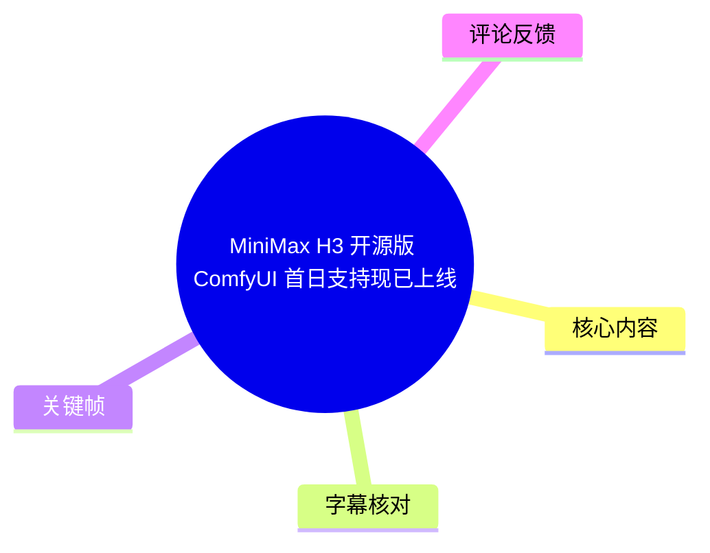
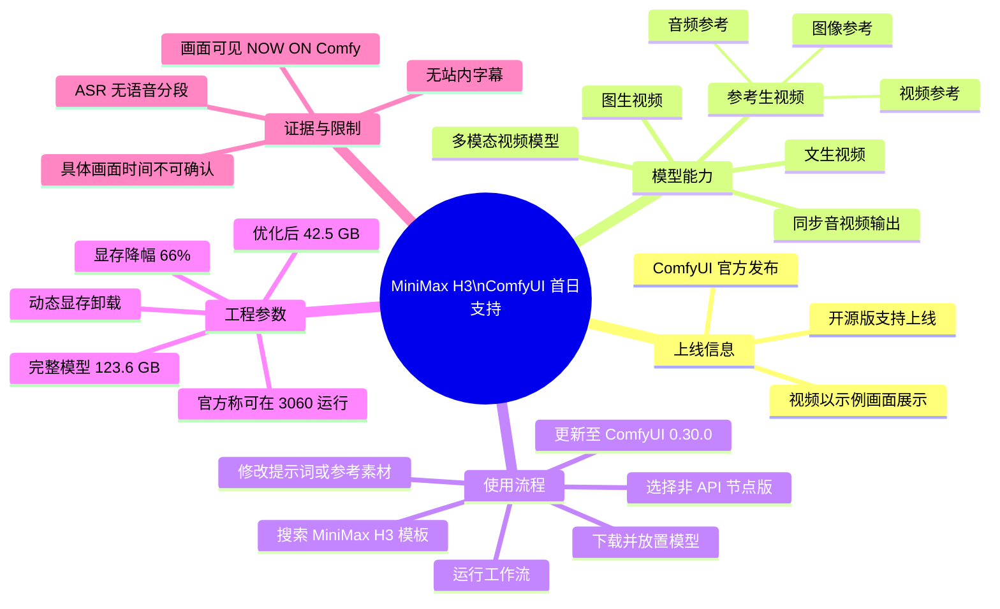

# MiniMax H3 开源版 ComfyUI 首日支持现已上线

> 来源：[Bilibili 视频](https://www.bilibili.com/video/BV1wKMQ6zE2r)  
> UP 主：ComfyUI官方｜视频时长：67 秒｜标签：视频生成、MiniMax、ComfyUI、开源、AI 视频  
> 注：站内未提供可用字幕；本次 ASR 也未识别出可用语音分段。因此，以下时间轴仅使用可确认的视频起点 `00:00`，不对各画面或说明的具体出现秒数作无依据推断。

## 小结

这是一则由 ComfyUI 官方发布的产品支持公告：**MiniMax H3 开源版已在 ComfyUI 获得首日支持**。视频本身以多个高质感示例画面和 “NOW ON Comfy” 标识传达上线信息；更完整的能力、硬件与使用说明来自投稿简介。

根据官方简介，MiniMax H3 被定位为 MiniMax 的首个开源多模态视频模型，原生支持同步音视频输出，并覆盖文生视频、图生视频和参考生视频三类工作流。其中，参考生视频可使用图像、音频、视频作为原生参考素材。

落地使用的关键前置条件是将 ComfyUI 更新至 **0.30.0** 或更高版本，然后在模板库搜索 **“MiniMax H3”** 的**非 API 节点版**模板；按模板提示下载模型并放入指定位置，再替换提示词或参考素材运行工作流。

显存是本公告最重要的工程信息：官方称，经 ComfyUI 模型优化后，轻量化版本显存降幅达到 **66%**；完整模型精度下显存需求为 **123.6 GB**，优化后为 **42.5 GB**。同时，结合 ComfyUI 动态显存卸载，官方称可在 RTX 3060 上运行。这里的“可运行”不等于有充裕显存、快速生成或适合所有参数组合，实际速度、分辨率、时长与稳定性仍需以本机测试为准。

该内容适合已使用或准备使用 ComfyUI 的视频生成创作者、希望进行本地多模态参考驱动视频生成的开发者，以及关注大模型显存优化路线的读者。视频与简介均属于上线时点的公告信息，模板、模型文件、显存占用和版本兼容性可能在后续更新中变化。

## 思维导图





## 目录

- [公告背景与可确认画面](#公告背景与可确认画面0000)
- [模型能力与工作流类型](#模型能力与工作流类型0000)
- [部署与运行步骤](#部署与运行步骤0000)
- [显存参数与工程限制](#显存参数与工程限制0000)
- [时效性、结论与待验证项](#时效性结论与待验证项0000)
- [字幕比对](#字幕比对)
- [评论分析](#评论分析)
- [处理记录](#处理记录)

## 公告背景与可确认画面：[00:00](https://www.bilibili.com/video/BV1wKMQ6zE2r?t=0)

视频标题直接声明“MiniMax H3 开源版 ComfyUI 首日支持现已上线”。发布者为 ComfyUI 官方账号，简介进一步明确：该支持“现已正式发布”。

在所提供的关键帧中，右上角持续可见 “NOW ON Comfy” 标识。这是画面中能够直接核实的上线传播信息。画面主体则是雪地巨龙、暗色机械/城市结构、碎裂粒子，以及工业熔炉等电影感场景，可作为模型视频生成表现的展示素材来理解；但由于没有字幕、旁白转写或逐帧时间标注，不能将某一画面进一步断言为特定工作流、具体提示词或参数的生成结果。


> 图：画面展示雪地环境中的巨龙与人物，右上角有清晰的 “NOW ON Comfy” 标识。它直观承载“已上线 Comfy”的公告主题，并展示视频选取的高细节奇幻场景，但未提供对应提示词、模型参数或生成方式。


> 图：画面为工业环境中的熔炉、操作人员与火光，右上角同样带有 “NOW ON Comfy” 标识。其价值在于补充视频的视觉示例覆盖并非单一奇幻题材；但仅凭画面不能证明其使用了图生、文生或参考生视频中的哪一种路径。

## 模型能力与工作流类型：[00:00](https://www.bilibili.com/video/BV1wKMQ6zE2r?t=0)

以下能力来自 ComfyUI 官方投稿简介，而非空白 ASR 的转录内容：

| 能力/工作流 | 官方描述 | 使用含义 | 当前素材可确认的边界 |
| --- | --- | --- | --- |
| 同步音视频输出 | 模型原生支持同步音视频输出 | 目标输出不仅限于无声视频，也包含音频与视频同步生成能力 | 简介未给出音频长度、格式、采样率、控制方式或同步评测数据 |
| 文生视频（T2V） | 支持文生视频 | 以文本提示词驱动视频生成 | 未提供示例提示词、采样器、步数、分辨率或时长参数 |
| 图生视频（I2V） | 支持图生视频 | 以输入图像作为视觉起点或条件生成视频 | 未说明图像尺寸、参考强度或运动控制参数 |
| 参考生视频（R2V） | 支持参考生视频 | 使用参考素材约束/引导视频生成 | 未披露多参考素材如何组合、优先级如何设定 |
| 原生图像参考 | 参考生视频支持 | 可将图像作为参考素材 | 具体节点输入与权重未知 |
| 原生音频参考 | 参考生视频支持 | 可将音频作为参考素材 | 是否生成口型、节拍匹配或仅做音频条件，素材未说明 |
| 原生视频参考 | 参考生视频支持 | 可将视频作为参考素材 | 参考视频时长、帧率、内容限制未披露 |

官方将其称为 MiniMax 的“首个开源多模态视频模型”。这里应区分两层信息：

1. **公告事实**：发布者明确使用了“开源”“多模态视频模型”“同步音视频输出”等表述，并提供了本地 ComfyUI 模板链接。
2. **尚不能由本素材推出的结论**：开源许可条款、可商用范围、模型权重获取渠道、不同硬件性能、输出质量对比，以及音画同步能力在复杂场景下的可靠性，均未在所给视频内容、字幕或简介中展开。

## 部署与运行步骤：[00:00](https://www.bilibili.com/video/BV1wKMQ6zE2r?t=0)

官方简介给出的开始使用流程如下。由于视频没有可用语音转写，这些步骤依据简介原文整理，未补充未出现的命令、目录名或参数。

### 1. 更新 ComfyUI

将 ComfyUI 更新至最新的 **0.30.0 版本**。

- 这是官方明确给出的版本门槛。
- 素材未说明低于 0.30.0 时会出现何种兼容问题，也没有给出升级命令或安装方式。
- “最新 0.30.0”是公告发布时的表述；后续 ComfyUI 版本可能已变化，应以当前官方发布页为准。

### 2. 在模板库搜索对应模板

在模板库中搜索：

```text
MiniMax H3
```

需要选择的是**非 API 节点版**模板。该限定很重要：官方说明所指的是可下载模型并本地配置的工作流，而不是 API 节点工作流。

官方提供了三个工作流模板：

| 工作流 | 模板链接 | 用途 |
| --- | --- | --- |
| 图生视频（I2V） | [video_minimax_h3_i2v.json](https://github.com/Comfy-Org/workflow_templates/blob/main/templates/video_minimax_h3_i2v.json) | 用图像作为生成输入/条件 |
| 文生视频（T2V） | [video_minimax_h3_t2v.json](https://github.com/Comfy-Org/workflow_templates/blob/main/templates/video_minimax_h3_t2v.json) | 用文本提示词生成视频 |
| 参考生视频（R2V） | [video_minimax_h3_r2v.json](https://github.com/Comfy-Org/workflow_templates/blob/main/templates/video_minimax_h3_r2v.json) | 用图像、音频或视频等参考素材生成 |

### 3. 下载并放置模板要求的模型文件

按照模板内提示下载相应模型，并保存到模板要求的位置。

这一环节不能省略：工作流 JSON 仅描述节点连接和配置，不等于本地已有模型权重。素材未提供模型文件名、下载地址、校验值、磁盘占用或准确目录结构，因此不应自行猜测路径。

### 4. 填入内容并运行

完成模型准备后：

1. 更新文本提示词，或替换图像、音频、视频等参考素材；
2. 检查工作流中的输入节点是否已经指向有效文件；
3. 运行工作流；
4. 根据显存与结果，结合 ComfyUI 的动态显存卸载能力调整实际执行策略。

官方简介仅说明“更新提示或者参考素材，运行工作流”，未给出推荐的分辨率、帧数、生成时长、随机种子、推理步数、CFG、参考权重或导出编码参数。因此，上述参数不应被视为已由本视频确认。

## 显存参数与工程限制：[00:00](https://www.bilibili.com/video/BV1wKMQ6zE2r?t=0)

公告给出了较明确的显存数字，适合用于初步硬件评估：

| 配置状态 | 官方给出的显存需求 | 相对完整模型变化 |
| --- | ---: | ---:|
| 完整模型精度 | 123.6 GB | 基准 |
| 经 ComfyUI 优化后的轻量化版本 | 42.5 GB | 官方称显存降幅达 66% |
| 搭配 ComfyUI 动态显存卸载 | 官方称可在 RTX 3060 上运行 | 未披露具体显存容量、生成设置与速度 |

按两个绝对值直接计算，显存差为 `123.6 - 42.5 = 81.1 GB`；以完整模型精度需求为基数，降幅约为 `81.1 / 123.6 ≈ 65.6%`，与官方“66%”的表述在四舍五入口径下相符。

但硬件评估时需要注意以下限制：

- **“42.5 GB”不是所有场景下的显存上限承诺。** 视频时长、分辨率、批量大小、参考素材、启用模块和运行时缓存策略都可能影响实际占用；这些具体关联在素材中没有展开。
- **“可在 3060 上运行”不等于原生完整加载。** 官方同时提到“动态显存卸载”，因此可以合理理解为运行依赖内存/显存调度机制；但素材没有提供 3060 的具体显存规格、执行耗时、CPU 内存需求或是否需要磁盘卸载。
- **生成速度未披露。** 即使流程可以启动，也不能据此推导互动式预览、批量生产或长视频生成的效率。
- **精度代价未披露。** 素材称其为“轻量化版本”，但没有说明量化方式、精度策略，以及与完整模型在画质、稳定性和音画同步上的差异。


> 图：画面呈现暗色环境下的碎片/粒子效果，并带有 “NOW ON Comfy” 标识。它可用于理解公告以多种风格的动态视觉片段展示支持上线；但画面不包含显存、工作流节点或性能数值，显存结论仍应以官方简介中的 123.6 GB、42.5 GB 与 66% 为准。

## 时效性、结论与待验证项：[00:00](https://www.bilibili.com/video/BV1wKMQ6zE2r?t=0)

本视频的核心价值在于提供了 MiniMax H3 接入 ComfyUI 的首日可用信号，以及三条清晰的工作流入口：文生视频、图生视频、参考生视频。对本地工作流用户而言，最具操作性的路径是：先更新到 ComfyUI 0.30.0，再从模板库加载非 API 节点版模板，按模板下载模型后替换提示词或参考素材。

工程层面，应优先将 **42.5 GB 优化后显存需求**视为高显存直接运行的参考指标，将 **3060 + 动态显存卸载可运行**视为官方主张的兼容性方向，而不是性能保证。低显存显卡用户应额外预留时间验证内存占用、卸载行为与推理速度。

以下项目在当前素材中没有答案，属于后续实践或查阅官方文档时应重点核验的事项：

- 模型许可证、商用条件及权重获取要求；
- 具体模型文件、目录结构、依赖项与版本锁定情况；
- 不同显卡、显存容量和系统内存下的实测速度；
- 支持的分辨率、视频长度、帧率与输出格式；
- 图像、音频、视频三类参考输入的具体节点参数与推荐素材规格；
- 轻量化版本相对于完整精度版本的质量损失；
- 同步音视频输出在口型、节拍和复杂音效场景下的可靠性；
- 对敏感内容或成人内容的模型、平台及工作流限制。

更详细的官方说明入口为：[ComfyUI 官方公众号文章](https://mp.weixin.qq.com/s/CNXRcUIt9cKOanYMualVlg)。

## 字幕比对

| 字幕来源 | 完整性 | 专有名词 | 时间轴 | 主要问题 |
| --- | --- | --- | --- | --- |
| Bilibili 站内字幕 | 未提供可用字幕 | 无法核验 | 无可用分段 | 无法用于逐句转录、时间定位或术语校对 |
| 本次 ASR 字幕 | 空 | 无法识别 | ASR 具备时间戳输出能力，但实际 `segments` 为空 | `large-v3-turbo` 自动识别为英语的概率为 0.6005859375，识别到 0 个语音分段、0 秒语音覆盖；诊断提示未识别到语音 |

本次 ASR 已被检查，结果为空。诊断中**没有** `noAudioStream=true` 标记，且素材清单中存在 `audio/audio.wav`，因此不能把情况表述为“源视频没有音轨”。准确结论是：已提取音频，但 ASR 未识别出可转录的语音内容；可能是无口语、音乐/音效为主，或音轨中的语音不满足当前识别条件，现有素材无法进一步确认。

最终未采用任何字幕作为正文依据，而是采用以下证据层级：

1. 视频标题与 ComfyUI 官方投稿简介：用于记录功能、版本、显存数字与工作流链接；
2. 提供的关键帧：用于确认画面中反复出现的 “NOW ON Comfy” 标识及示例画面类型；
3. 空 ASR 结果：用于明确不能将视频解读为存在已转录的口播说明。

“MiniMax H3”“ComfyUI”“0.30.0”“123.6 GB”“42.5 GB”“66%”等术语与数值均来自元数据简介，而不是 ASR 校正结果。由于没有站内 SRT 或 ASR 分段，无法为这些信息建立精确的片内出现时间点。

## 评论分析

以下仅分析当前可获取的热评前三条；评论反映的是用户态度或提问，不构成已验证的产品事实。

| 热评 | 点赞 | 观点与补充 | 可信度与需要核验之处 |
| --- | ---: | --- | --- |
| `dkhfnxmdkf`：“开源永不为奴[打call]” | 29 | 表达对“开源”定位的积极态度，说明开源属性是观众关注点。 | 属于价值判断，不补充许可、权重开放范围或商用条款；不能据此推导具体开源政策。 |
| `水人叔叔`：“seedance桂霞！” | 8 | 文字较短，可能是在表达对其他视频生成产品/模型的联想、调侃或比较。 | 评论未说明“seedance桂霞”的具体含义、比较维度或证据，无法据此进行模型性能比较。 |
| `wole擦擦擦`：“支持nfsw么？” | 2 | 提出了对敏感内容/成人内容支持范围的疑问。 | 视频标题、关键帧、简介和可用字幕均没有对此作答；不能将提问误写成支持或不支持的结论，需以模型许可证、平台政策与工作流规则为准。 |

## 处理记录

- Worker ID：`worker-mrj0wbly-5dc4e50c`
- 模型：`gpt-5.6-terra`
- 调用工具与素材：Bilibili 元数据、视频素材清单、关键帧、ASR 诊断与结果、热评数据。
- 使用的应用工具：ASR 模型 `large-v3-turbo`，设备 `cuda`，计算类型 `int8_float16`；ASR 输出具备时间戳能力，但结果为 0 个分段。
- 字幕选择：站内字幕未提供可用文件；本次 ASR 已检查且为空，未采用虚构转录。正文以官方标题、简介和关键帧多模态画面为依据。
- 关键帧选择依据：选用 `frames/frame-001.jpg`、`frames/frame-003.jpg`、`frames/frame-004.jpg`，因为画面均可见 “NOW ON Comfy” 标识，且分别展示奇幻生物、抽象粒子与工业熔炉三类视觉内容。未将帧序号或文字顺序擅自映射为秒数。
- 时间轴依据：无站内 SRT，ASR 无有效起止分段；所有章节仅链接至可确认的视频起点 `t=0`，避免编造片内时间位置。
- 缓存清理：未提供缓存清理执行日志；不对清理是否完成作无依据声明。
- 未解决问题：无逐句字幕与精确画面时间；未提供模型许可证、下载文件细节、工作流参数、性能基准及敏感内容政策。
