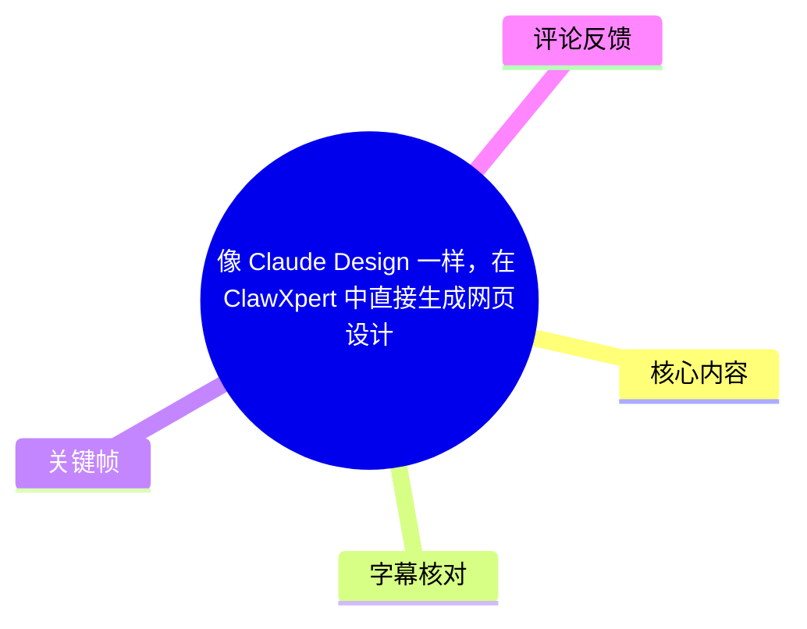
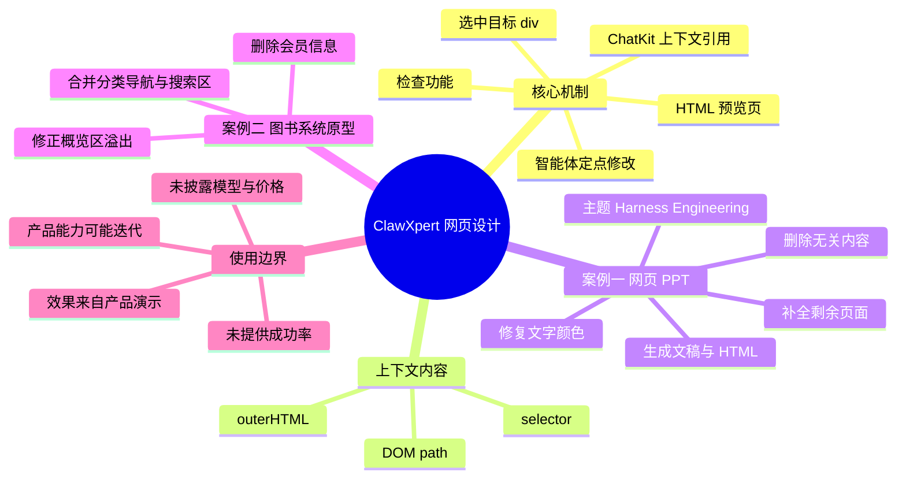
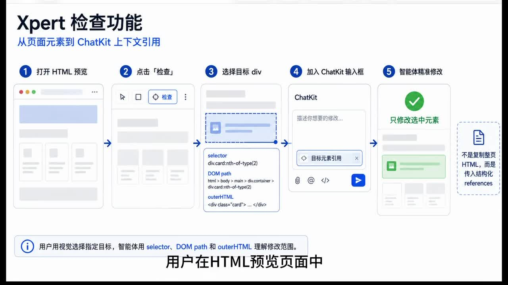
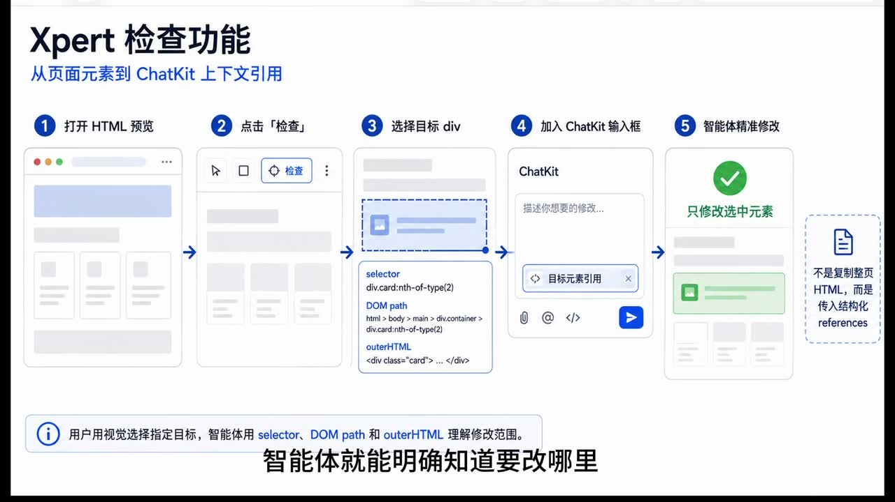
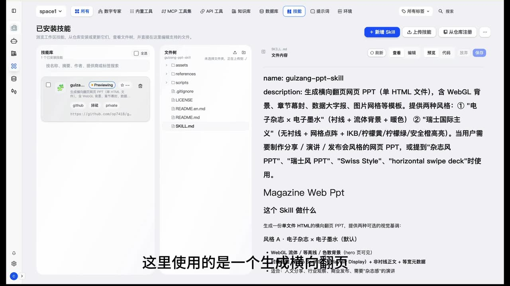
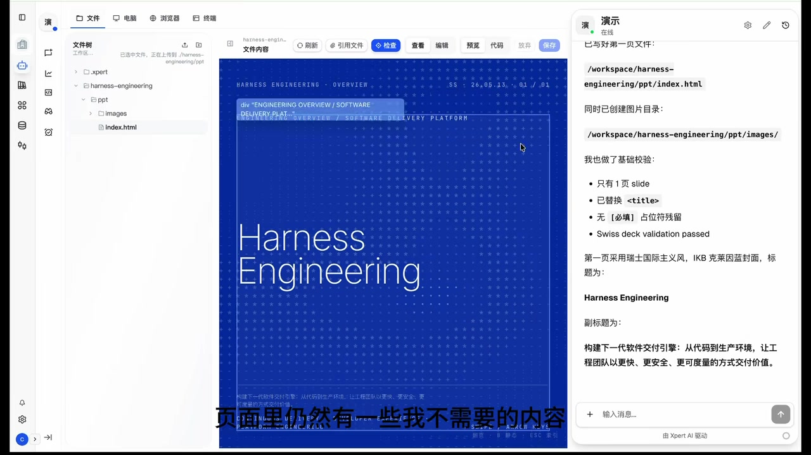

# 像 Claude Design 一样，在 ClawXpert 中直接生成网页设计

> 来源：[Bilibili 视频](https://www.bilibili.com/video/BV1cW5k6ZEde) 
> UP 主：XpertAI_元数信息技术｜时长：4 分 23 秒｜合集：AIcode  
> 视频主题：演示 XpertAI / ClawXpert 环境中，围绕 HTML 预览页面进行“选中元素—引用上下文—让智能体定点修改”的网页设计与原型调整流程。

## 小结

视频核心介绍的是 XpertAI 平台中的“检查”能力：用户不必只靠自然语言描述“页面上方那个模块”或“某一段文字”，而是在 HTML 预览页直接选中目标元素（示例为 `div`）。系统会将该元素的选择器、DOM 路径和关键 HTML 片段组织为结构化引用，带入 ChatKit 输入框，再由智能体围绕明确范围完成修改。

该能力解决的主要问题不是“从零生成 HTML”，而是**生成之后的可控迭代**。视频认为，大模型已较适合生成 HTML 界面，但实际原型开发中，用户常难以精确告诉 AI 应修改哪一个节点；可视化选取把模糊的页面描述转换为可定位的上下文，减少智能体在整份代码中猜测修改对象的需要。

第一个案例将 HTML 用作横向翻页网页 PPT：先生成关于 “Harness Engineering” 的讲解文稿与首页 HTML，再删除无关内容；随后生成第二页“什么是技能”的内容，并修复白色文字造成的可读性问题。视频还提到可直接查看、编辑代码，或通过引用文件定位后继续让智能体修改，最终补全余下页面。

第二个案例是图书系统原型的局部调整，分别处理：首页概览区超出容器范围、图书分类导航与搜索区域的合并、订单中心会员信息的删除。视频展示的结论是，用户可像使用可视化编辑器一样选中问题区域，再用智能体完成定点修改。

需要注意，视频展示的是产品能力演示，而非独立第三方评测：没有给出模型名称、收费方式、执行耗时、生成成功率、支持的浏览器范围、版本号或复杂项目中的修改准确率。因此，“更高效”“更美观”“更专业”等效果应视为演示中的主张，不能外推为所有项目的确定结果。

内容具有时效性。视频元数据发布时间为 2026 年 5 月，抓取时间为 2026 年 7 月；产品名称、入口位置、技能库内容、交互控件与底层模型均可能在后续版本中变化。实践时应以当前 XpertAI / ClawXpert 产品界面和官方文档为准。

## 思维导图

## 目录

- [背景：从 HTML 生成走向可定位修改](#背景从-html-生成走向可定位修改)
- [检查功能：把页面元素转为 ChatKit 上下文](#检查功能把页面元素转为-chatkit-上下文)
- [案例一：用 HTML 制作横向翻页网页 PPT](#案例一用-html-制作横向翻页网页-ppt)
  - [生成首页并删除无关内容](#生成首页并删除无关内容)
  - [生成第二页并修复文字可读性](#生成第二页并修复文字可读性)
  - [代码、文件引用与页面补全](#代码文件引用与页面补全)
- [案例二：图书系统原型的三类局部修改](#案例二图书系统原型的三类局部修改)
  - [修正首页概览区的布局溢出](#修正首页概览区的布局溢出)
  - [合并分类导航和搜索区域](#合并分类导航和搜索区域)
  - [删除订单中心会员信息](#删除订单中心会员信息)
- [可复用操作流程、参数与限制](#可复用操作流程参数与限制)
- [结论与时效性](#结论与时效性)
- [字幕比对](#字幕比对)
- [评论分析](#评论分析)
- [处理记录](#处理记录)

## 背景：从 HTML 生成走向可定位修改 [00:00:30](https://www.bilibili.com/video/BV1cW5k6ZEde?t=30)

视频提出的使用背景是：随着大模型生成能力增强，用户在制作网页、系统原型或演示页面时，可能直接要求智能体生成 HTML。然而生成后的调整仍有一个实际障碍：

1. 用户需要反复打开 HTML 页面寻找问题位置；
2. 虽然能看出哪里不对，却难以准确描述对应的 DOM 元素；
3. 单凭自然语言让 AI 在整份页面代码中判断修改目标，容易产生范围不清的问题。

视频给出的处理方式，是在平台 HTML 预览页面内启动“检查”功能，直接点选要处理的页面元素。演示中明确以 `div` 为例；系统把元素相关的信息带入 ChatKit，供后续对话引用。

> 图：关键帧展示了完整的五步流程：打开 HTML 预览、点击“检查”、选择目标 `div`、加入 ChatKit 输入框、由智能体精确修改。其价值在于明确本功能并非复制整页 HTML 到对话中，而是传递针对选中元素的引用信息。

## 检查功能：把页面元素转为 ChatKit 上下文 [00:00:30](https://www.bilibili.com/video/BV1cW5k6ZEde?t=30)

视频和流程画面共同说明，检查功能的工作链路如下：

1. **打开 HTML 预览**：在平台中进入已生成或已有的 HTML 页面预览。
2. **点击“检查”**：进入可选择页面元素的状态。
3. **选择目标 `div`**：用户在可视化页面中点选需要删除、移动、合并或调样式的节点。
4. **自动加入 ChatKit 输入框**：系统带入该元素的目标索引引用。
5. **描述修改需求并提交**：用户仍需输入修改意图；智能体据此修改对应范围。

画面中的信息卡显示，系统可向智能体传递的上下文包括：

| 上下文项 | 视频画面所示含义 | 对修改的作用 |
| --- | --- | --- |
| `selector` | CSS 选择器，例如 `div.card:nth-of-type(2)` | 指向目标元素的选择规则。 |
| `DOM path` | 元素在 HTML DOM 层级中的路径 | 辅助识别节点的页面位置及父子关系。 |
| `outerHTML` | 目标节点及其内容对应的 HTML 片段 | 使智能体了解局部结构，而不是只看到一句位置描述。 |

视频的表述是：智能体利用 `selector`、DOM path 和 `outerHTML` 理解修改范围，从而“明确知道要改哪里”。这是一种**带结构化页面上下文的提示方式**；它不等同于传统可视化编辑器中完全确定性的拖拽编辑，最终改动仍由智能体生成并应由用户复核。

> 图：该帧强调“只修改选中元素”以及“不是复制整页 HTML，而是传输结构化 references”。它直接解释了视频相较于纯文本提示的差异：修改目标带有可机器识别的页面定位信息。

## 案例一：用 HTML 制作横向翻页网页 PPT [00:00:35](https://www.bilibili.com/video/BV1cW5k6ZEde?t=35)

视频第一个实践是制作讲解文稿。作者选择以 HTML 而非传统 PPT 文件来实现，理由是“当前大模型更擅长直接生成 HTML”；视频还认为这种方式操作相对简单、呈现效果较美观。

这里调用的是一个“生成横向翻页网页 PPT”的技能，适用场景在视频中包括：

- 分享；
- 演讲；
- 发布会风格的网页 PPT。

关键帧显示，技能名称为 `guizang-ppt-skill`，其说明为“生成横向翻页网页 PPT（单 HTML 文件）”。画面还列出了两类可选视觉风格：

- **电子杂志 × 电子墨水**：衬线、流体背景、暖色；
- **瑞士国际主义**：无衬线、网格点阵、IKB / 柠檬黄 / 柠檬绿 / 安全橙等高亮色。

这些是画面中该技能文档列出的设计选项，不代表视频证明所有风格、模板或效果在每次生成时都可稳定复现。

> 图：该帧展示技能库和 `guizang-ppt-skill` 的说明，说明第一个案例不是直接手写页面，而是在平台技能支持下生成单 HTML 文件形式的横向翻页网页 PPT。

### 生成首页并删除无关内容 [00:00:59](https://www.bilibili.com/video/BV1cW5k6ZEde?t=59)

讲解文稿主题为 **Harness Engineering**。视频中的制作顺序是：

1. 先让智能体生成第一页文稿；
2. 再生成对应 HTML；
3. 获得首页页面预览；
4. 发现存在不需要的内容；
5. 在预览中用检查功能定位到相应 `div`；
6. 要求智能体删除或修改；
7. 删除无关内容，让首页更简洁。

画面中的首页使用大面积蓝色背景、网格点阵和 “Harness Engineering” 标题，属于视频中展示的视觉结果。右侧对话区域同时显示了文件路径与已完成页面的文字说明，表明平台工作流可围绕工作区中的 HTML 文件进行操作。

> 图：该帧同时呈现文件树、HTML 预览、顶部“检查”按钮和右侧对话区，可用于理解“生成—预览—选取元素—继续调整”在同一工作界面中的衔接关系。

### 生成第二页并修复文字可读性 [00:01:23](https://www.bilibili.com/video/BV1cW5k6ZEde?t=83)

接下来视频制作第二页，主题是“什么是技能”。操作逻辑与首页一致：

1. 先生成第二页的文稿；
2. 再转为第二页网页 PPT；
3. 检查生成页面的细节；
4. 发现页面下方文字原本为白色、内容不清晰；
5. 让智能体修复此处样式；
6. 修改后文字变为黑色，可读性提高。

这一段体现的不是结构删除，而是局部 CSS / 样式问题修复。视频未展示具体 CSS 属性、具体提示词或修改前后的代码 diff，因此只能确认“白色文字被调整为黑色”，无法据此断定智能体采用了何种 CSS 写法或如何判断背景对比度。

### 代码、文件引用与页面补全 [00:01:47](https://www.bilibili.com/video/BV1cW5k6ZEde?t=107)

视频说明，除在预览页修改外，平台还支持：

- 直接查看代码；
- 编辑代码；
- 通过“引用文件”定位到具体位置；
- 再让智能体进行修改。

最后，作者让智能体完成剩余若干页面，并认为最终演示文稿“美观专业”。这说明视频展示的工作模式不是只对单页面元素进行修改，也可将文件引用纳入对话式迭代。

但视频没有说明：

- 多页面如何组织路由或翻页逻辑；
- 每一页的数量；
- 生成所用模型、上下文窗口和调用次数；
- 引用文件是否支持跨文件依赖分析；
- 智能体修改后是否自动运行测试或校验 HTML。

因此，适合把它理解为一套可视化辅助的原型生产流程，而非已展示完整工程化交付保障的流程。

## 案例二：图书系统原型的三类局部修改 [00:02:12](https://www.bilibili.com/video/BV1cW5k6ZEde?t=132)

第二个案例转向已生成的图书系统界面原型。视频指出，在系统原型的实际调整中，用户经常能识别页面问题，却难以把精确位置描述给 AI；检查功能让用户先在预览页选中目标元素，再要求智能体围绕该元素修改。

这一案例连续展示了三种典型的网页迭代需求：

| 页面区域 | 初始问题或目标 | 视频中的操作 | 视频展示的结果 |
| --- | --- | --- | --- |
| 首页概览 | 内容超出原容器范围，布局需调整 | 选中有问题的 `div`，让 ChatKit 中的智能体修改 | 布局恢复正常，页面间距更合理。 |
| 图书分类页 | 希望将分类导航合并入搜索图书区域 | 选中分类导航对应 `div` 后提出修改 | 分类导航进入搜索框区域，层级更清晰。 |
| 订单中心 | 希望删除会员信息 | 选中对应 `div` 后提出修改 | 会员信息被删除，页面更聚焦订单管理。 |

### 修正首页概览区的布局溢出 [00:02:41](https://www.bilibili.com/video/BV1cW5k6ZEde?t=161)

视频展示的第一个问题是：首页概览部分超出原本容器范围，导致布局仍需调整。作者的操作是：

1. 在已生成的界面原型中识别溢出区域；
2. 打开检查功能；
3. 选中发生问题的 `div`；
4. 在 ChatKit 中要求智能体修改；
5. 查看修改后预览。

视频称修改完成后布局恢复正常、页面间距更加合理。由于没有展示 DOM 结构、盒模型参数、`overflow` / `padding` / `margin` / `width` 等具体代码，不能将该案例简化为某个确定的 CSS 修复方案；其可迁移经验是：**先选中视觉问题所在的节点，再将布局意图与节点上下文一并交给智能体。**

### 合并分类导航和搜索区域 [00:03:05](https://www.bilibili.com/video/BV1cW5k6ZEde?t=185)

在图书分类页面，作者希望将分类导航合并至搜索图书区域，使页面结构更集中。视频中的操作步骤为：

1. 选中分类导航对应的 `div`；
2. 在 ChatKit 中提出合并需求；
3. 由智能体修改页面；
4. 在预览中确认分类导航已进入搜索图书框区域。

这类修改涉及页面层级和组件关系变化，通常比改颜色、删文字更具风险：目标节点可能需要移动到新父容器、调整布局规则并保持交互可用。视频展示了视觉结果，但未演示搜索、筛选、导航点击等交互是否仍正常，因此该结果只验证了演示画面中的结构呈现，未验证完整功能回归。

### 删除订单中心会员信息 [00:03:29](https://www.bilibili.com/video/BV1cW5k6ZEde?t=209)

订单中心页面的需求最直接：删除会员信息区域。视频操作是选中对应 `div` 后，让智能体进行修改；随后页面中会员信息被成功移除，作者认为页面内容更聚焦订单管理。

该案例说明“检查”可用于局部删除。但在实际项目中，删除 UI 节点前仍应确认：

- 该区域是否承载必要业务信息；
- 是否存在与该节点相关的数据请求、事件处理或状态逻辑；
- 删除后是否留下空白间距、失效样式或无用代码；
- 是否需要同步调整移动端布局及无障碍语义。

视频未展示这些验证过程，因此它提供的是界面级修改示例，而非完整的生产变更审查流程。

## 可复用操作流程、参数与限制 [00:03:53](https://www.bilibili.com/video/BV1cW5k6ZEde?t=233)

### 实操步骤

根据视频演示，可整理出以下适用于 HTML 原型、网页 PPT 和可视化页面的流程：

1. **先生成或准备 HTML 页面**
   - 可让智能体从需求、文稿或产品描述生成 HTML；
   - 对网页 PPT，视频采用“先生成文稿，再生成对应 HTML”的两阶段方式。

2. **进入 HTML 预览**
   - 在可视化预览中检查页面的布局、内容、文字颜色、组件位置和信息密度。

3. **启动检查并选择最小目标范围**
   - 点击“检查”；
   - 尽量选中与问题直接对应的元素，如问题模块的 `div`，而不是笼统描述整个页面。

4. **确认结构化上下文已进入 ChatKit**
   - 视频画面显示的引用包括 `selector`、DOM path 与 `outerHTML`；
   - 这些内容用于帮助智能体锁定修改范围。

5. **补充清晰的修改意图**
   - 例如删除无关内容、将文字改为黑色、调整溢出布局、把分类导航合并到搜索区域；
   - 选中元素解决“改哪里”，自然语言仍需说明“改成什么样”。

6. **查看预览结果并继续迭代**
   - 对视觉效果、信息层级、间距和可读性进行复核；
   - 必要时继续选择新的目标元素，或进入代码 / 文件引用模式进一步调整。

7. **在重要项目中补充工程验证**
   - 视频未展示自动测试；实际使用时应检查页面功能、响应式布局、浏览器兼容性、无障碍和版本差异。

### 视频明确出现的技术要素

| 类别 | 内容 |
| --- | --- |
| 页面形态 | HTML 页面、网页原型、横向翻页网页 PPT。 |
| 目标元素示例 | `div`。 |
| 选中上下文 | `selector`、DOM path、`outerHTML`。 |
| 对话入口 | ChatKit 输入框。 |
| 文件能力 | 可查看代码、编辑代码、引用文件定位。 |
| 网页 PPT 技能 | `guizang-ppt-skill`；画面说明为单 HTML 文件的横向翻页网页 PPT。 |
| 典型改动 | 删除内容、修改文字颜色、修正布局、合并区域、删除信息模块。 |
| 视频时长 | 元数据为 263 秒；ASR 音频时长诊断为 262.687375 秒。 |

### 使用限制与风险

1. **本质是 AI 辅助修改，不是无条件精确编辑**  
   页面元素引用能缩小范围，但视频未提供复杂嵌套 DOM、重复组件、跨文件样式或动态渲染页面中的准确率数据。

2. **选中范围会影响结果**  
   如果选中的是过大的父容器，可能扩大修改面；若选中的是过小的子节点，则可能无法完成需要重组布局的需求。视频没有给出最佳粒度规则。

3. **视觉成功不等于功能正确**  
   视频主要用预览画面确认结果，没有展示自动化测试、接口联调、表单交互、搜索逻辑、权限控制或数据持久化验证。

4. **专有名词存在字幕识别误差**  
   ASR 多处将 XpertAI / ClawXpert、ChatKit、HTML 等识别为“Exper”“Expert”“ChatKids”“HTLM”等。正文已结合标题、元数据、关键帧文字校正，但未擅自补充视频未提供的产品架构细节。

## 结论与时效性 [00:03:53](https://www.bilibili.com/video/BV1cW5k6ZEde?t=233)

视频最终将该能力概括为：HTML 页面不再只是静态预览结果，而是可直接检查、引用和修改的对象。对于需要快速制作网页原型、演示文稿及其他可视化页面的用户，这种“在预览页点选元素 + 对话式生成修改”的方式，确实提供了比纯文本描述更明确的沟通路径。

可迁移的方法可以归纳为两点：

- **把视觉问题先转化为可定位的 DOM 目标**：避免让 AI 在全量页面代码中猜测对象。
- **将“结构化定位”与“意图描述”结合**：元素引用说明范围，用户提示说明期望的状态，两者缺一不可。

不过，视频没有展示以下关键信息：功能开通条件、平台版本、底层模型、价格或额度、修改可撤销机制、代码版本管理、失败处理、复杂工程兼容性与实际成功率。因此，在生产环境中仍应保留人工审查和测试环节，不应仅凭预览效果直接发布。

截至素材抓取时间（2026-07-16），本视频页面统计为约 10,108 次播放、150 次收藏、45 次点赞、2 条回复；这些数据会随时间变化。产品 UI、技能库和功能命名也可能更新，本文记录的是该视频素材展示时的能力与界面，不构成对当前版本的功能承诺。

## 字幕比对

| 字幕来源 | 完整性 | 专有名词 | 时间轴 | 主要问题 |
| --- | --- | --- | --- | --- |
| Bilibili 站内字幕 | 未提供可用站内字幕，无法比较具体文本 | 无法评估 | 无可用分段 | 素材明确标注“未提供可用站内字幕”。 |
| 本次 ASR 字幕 | 共 12 段，语音覆盖约 223.98 秒，占视频约 85.26%；首段从 00:00:30.480 开始，末段至 00:04:21.590 | 存在较多误识别 | 可用，SRT 提供毫秒级起止时间 | 产品名、HTML、ChatKit、修正/修改等词多处误识别；每段文字偏长，断句有限。 |

### 最终字幕选择与校正说明

最终采用**本次 ASR 的 SRT 时间轴**作为章节定位依据，因为没有可用站内字幕。ASR 诊断显示：

- 识别语言：中文；
- 语言置信度：0.9990234375；
- 模型：`medium`；
- 推理设备：CUDA；
- 计算类型：`float16`；
- 未标记 `noAudioStream=true`，且素材中提供了 `audio/audio.wav`，因此可确认源视频有可供识别的音轨；
- 诊断未报告大段语音空缺，`largeGapCount` 为 0。

结合视频标题、元数据、关键帧中的可见文字与上下文，本文作了以下保守校正：

| ASR 原文或近似误识别 | 正文采用写法 | 校正依据 |
| --- | --- | --- |
| Exper / Expert 平台 | XpertAI 平台或 Xpert 平台 | UP 主名称为 XpertAI_元数信息技术；关键帧标题为“Xpert 检查功能”。 |
| HTLM / HTml | HTML | 上下文均为网页文件、HTML 预览及 HTML 页面。 |
| ChatKids | ChatKit | 关键帧输入框明确显示 “ChatKit”。 |
| 检察 | 检查 | 关键帧按钮文字为“检查”。 |
| 修感 / 修简 | 修改或修复 | 结合句意及前后结果描述校正；不补充具体代码实现。 |
| Harness Engineering | Harness Engineering | ASR 对该英文标题识别基本可辨，关键帧页面标题可见。 |

## 评论分析

素材中按“热评前三条”请求获取到 **1 条**评论，未获取到第 2、3 条，因此仅分析可得内容，不把评论视为已验证事实。

| 排名 | 用户 | 点赞 | 评论内容 | 分析 |
| --- | --- | ---: | --- | --- |
| 1 | 20刀可开票 | 0 | “签到成功” | 属于常规互动或打卡式留言，没有补充产品功能、使用效果、争议、价格、兼容性或教程步骤的信息，无法作为评价该功能效果的依据。 |

其余两条热评未在提供素材中出现，无法分析其观点或可信度。

## 处理记录

- **Worker ID**：worker-mrj0www4-e8d79408
- **模型**：gpt-5.6-terra
- **调用工具与素材产物**：视频元数据、`audio/audio.wav`、ASR 结果 `asr/asr-result.json`、时间轴字幕 `asr/transcript.srt`、关键帧目录 `frames/`、评论文件 `comments/comments.json`。
- **ASR 工具参数与诊断**：ASR 模型为 `medium`，语言自动识别为中文，CUDA 推理、`float16` 计算；音频时长 262.687375 秒；未出现 `noAudioStream=true` 标记。
- **字幕选择**：站内无可用字幕；检查并采用本次 ASR SRT 的真实起止时间制作时间轴。对产品名与界面术语仅依据标题、元数据和关键帧作必要校正。
- **关键帧选择依据**：选用 `frame-001.jpg`、`frame-002.jpg` 展示检查到结构化引用的机制；选用 `frame-003.jpg` 说明网页 PPT 技能；选用 `frame-004.jpg` 说明 Harness Engineering 案例中的工作区、预览和检查入口。图片均以其对正文流程的直接证据价值为准，而非仅作装饰。
- **评论处理范围**：按要求最多处理热评前三条；实际可获取 1 条。
- **缓存清理**：提供素材中没有缓存删除或清理日志，无法确认是否执行缓存清理；本记录不将其表述为已完成。
- **未解决问题**：未提供产品版本、功能开通条件、模型与价格信息、提示词原文、代码 diff、自动化验证结果及站内字幕；因此未对这些内容作推断。
