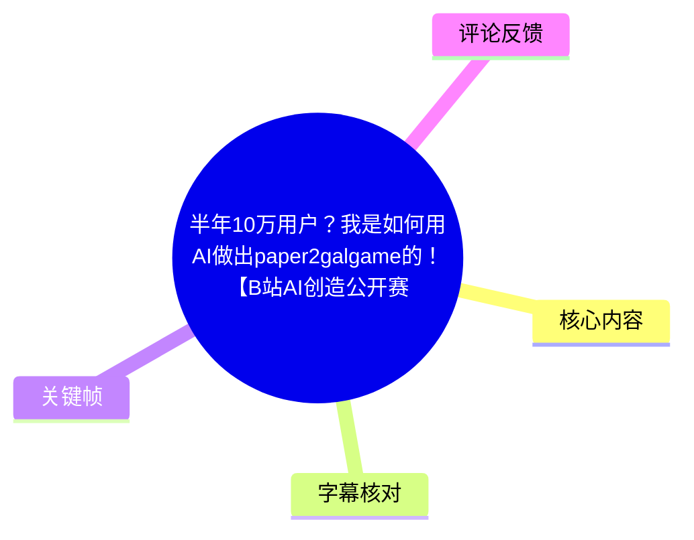
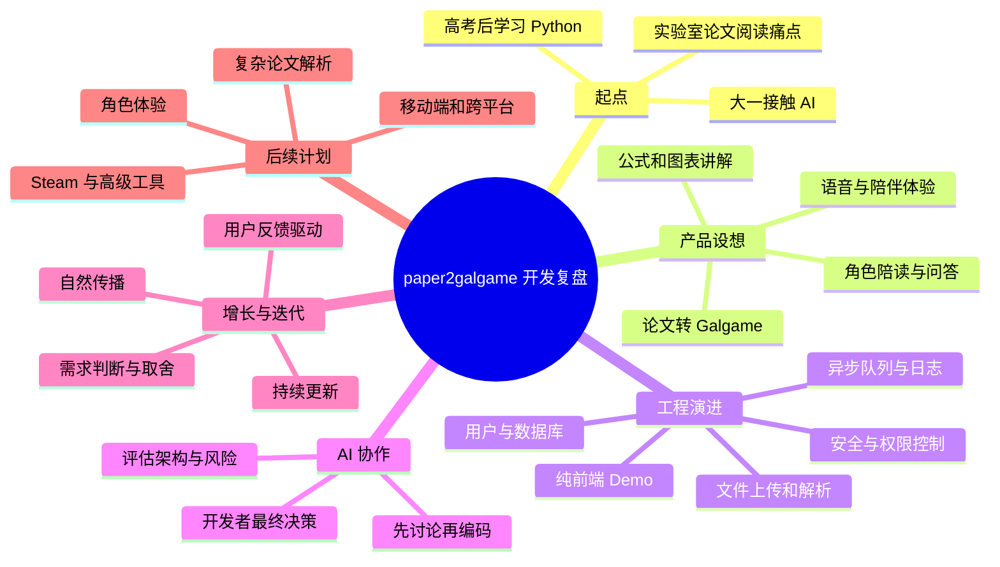

# 半年10万用户？我是如何用AI做出paper2galgame的！【B站AI创造公开赛】

> 来源：[Bilibili 视频](https://www.bilibili.com/video/BV1ZmMw64ED3)  
> UP 主：TamikiP｜合集：AIcode｜时长：16 分 41 秒  
> 视频简介提及项目地址：`paper2gal.com`  
> 数据抓取时视频统计：约 6.0 万播放、6,411 点赞、2,641 收藏、127 评论。统计会随时间变化。

## 小结

视频是开发者 TamikiP 对 **paper2galgame** 半年开发历程的复盘。该产品试图把论文或文档的阅读过程改造成带角色、对话、语音与互动的“AI 学习 Galgame”体验：角色可以解释背景、公式和图表，用户也能在阅读时直接追问。作者称项目已获得 **10 万用户**，并计划推进 Steam 版本；这些均为视频中的作者陈述，未在本素材中提供独立经营数据或 Steam 上架页面佐证。

最重要的开发经验是：AI 能大幅加快原型开发，却不能替代系统设计与工程判断。作者早期以“让 AI 写一版、先跑起来”为主，产品从纯前端 Demo 演进到包含用户体系、数据库、文件上传、论文解析、角色与权限、语音资源、异步消息队列、错误追踪与安全防护的后端系统。真实用户、不同格式 PDF、网络和浏览器环境、恶意请求与漏洞扫描，才让这些工程问题集中暴露。

作者对 “vibe coding” 的理解并非“向 AI 下命令后复制代码”，而是先与 AI 讨论架构、性能、安全、边界条件、替代方案与故障定位，再由开发者作最终决策。其可迁移方法是：从小版本验证需求，围绕具体用户群体和具体痛点持续迭代，认真理解用户反馈背后的问题，而不是机械实现每一条功能请求。

产品增长方面，作者明确表示没有投放广告，主要依靠用户自然传播与持续更新。语音稳定性、公式显示、移动端体验、角色表现、语言支持和开发者工具等方向来自用户反馈；但需求是否实施仍需根据产品阶段、复杂度与真实问题进行取舍。

本视频适合独立开发者、AI 应用开发者、希望从 Demo 走向可运营产品的人，以及关注“学习陪伴型 AI”产品的人阅读。它不是完整技术实现教程：未公开技术栈、模型、云服务、队列实现、成本、留存、活跃用户、Steam 审核状态与安全方案细节。因此其中的增长、工程规模与产品效果应视为作者经验分享，而非可直接复用的量化结论。

## 思维导图





## 目录

- [项目背景：从编程入门到论文阅读痛点](#项目背景从编程入门到论文阅读痛点)
- [产品构想：把论文阅读变成角色陪伴体验](#产品构想把论文阅读变成角色陪伴体验)
- [从 Demo 到产品：真实用户带来的工程挑战](#从-demo-到产品真实用户带来的工程挑战)
- [后端、安全与运维：可上线产品的必要组成](#后端安全与运维可上线产品的必要组成)
- [作者的 vibe coding 方法：与 AI 共同定义问题](#作者的-vibe-coding-方法与-ai-共同定义问题)
- [独立开发与增长：聚焦具体人群、持续听取反馈](#独立开发与增长聚焦具体人群持续听取反馈)
- [后续路线、行动建议与限制](#后续路线行动建议与限制)
- [关键帧索引](#关键帧索引)
- [字幕比对](#字幕比对)
- [评论分析](#评论分析)
- [处理记录](#处理记录)

## 项目背景：从编程入门到论文阅读痛点 [00:30](https://www.bilibili.com/video/BV1ZmMw64ED3?t=30)

作者回顾，自己真正开始接触编程是在高考结束后的暑假，当时从网络教程与 Python 基础学起。早期困难包括：

1. 看不懂报错；
2. 环境无法配置；
3. 教程中的代码可以运行，自己改写后却无法运行；
4. 对代码架构、安全性和长期维护尚无完整概念。

进入大学后，作者开始接触 AI，并意识到大模型可能改变软件开发方式。早期做法较为朴素：把代码发给 GPT、获得回复后再复制粘贴回来；同时让 AI 协助分析报错、解释概念。作者还做过 AI Gal、AI 主播、类似 Neuro 的小项目，但回看认为当时大多数功能只是“勉强跑起来”。

项目灵感来自实验室的论文阅读任务。作者就读机械设计专业，自述该专业与计算机、人工智能关联较少；实验室要求阅读论文并在周会交流。其感受到的阅读障碍包括：

- 论文常有数十页；
- 包含公式、图表、专业术语和大量前置知识；
- 阅读耗时很长，但理解收获有限；
- 复杂推导容易导致注意力下降；
- 仅依赖翻译工具的辅助效果不明显。

这里的核心需求不是“缺少一份摘要”，而是**传统论文阅读难以坚持、互动不足、认知负担高**。作者据此提出：既然 AI 能理解论文内容，能否用一个角色陪伴用户阅读，而非让用户独自从头到尾阅读 PDF。

## 产品构想：把论文阅读变成角色陪伴体验 [03:10](https://www.bilibili.com/video/BV1ZmMw64ED3?t=190)

paper2galgame 的目标是将论文或文档转成带有角色互动的学习体验。按作者描述，其产品定位不只是“上传 PDF 后自动生成摘要”，而是让角色在阅读路径中承担解释和陪伴职责：

- 解释论文研究背景；
- 讲解公式与图表；
- 对不理解的内容提供直接问答；
- 借助角色、对话与语音，降低学习材料的冰冷感；
- 让用户更愿意持续阅读，而不是只得到一次性总结。


> 图：该画面直观展示视频所说的“角色陪读”并非单纯文本摘要：角色形象、场景、对话框和阅读控制共同构成 Galgame 式交互界面，有助于理解产品将学习体验游戏化、陪伴化的具体形式。

视频中的界面示例以角色 **Neuro_sama** 对话展示知识解释。画面文本围绕道德语言的跨文化差异展开，说明该模式可以将较抽象的研究内容拆解为连续的角色台词。需要注意的是，画面仅能证明视频中展示了此类交互样式，不能单独证明所有论文类型均能获得同等质量的解释。


> 图：该帧展示同一知识主题通过多轮台词持续展开，而不是只输出一段总结；它对应作者对“陪着一起读”和“更容易坚持”的产品表达。

### 第一版的状态与问题 [04:20](https://www.bilibili.com/video/BV1ZmMw64ED3?t=260)

作者承认，paper2galgame 第一版非常简陋：界面不好看、功能较少、解析效果一般，很多部分只是“能跑”。具体问题包括：

- 论文公式可能显示混乱；
- 图片可能丢失；
- 角色可能没有配音；
- 文档解析不稳定。

即便如此，作者认为第一版的价值在于完成了最关键的验证：把脑海中的产品想法变成了可以完整体验的东西。随后产品被发布，有用户用它读论文、教材和技术文档；作者还提及有海外用户将其分享到 Reddit、X、Discord 等社区。

这一阶段体现的步骤是：

1. 从自身可感知的痛点出发；
2. 做一个范围很小、但能完成完整体验闭环的版本；
3. 尽早发布，而不是等待功能完美；
4. 观察真实用户是否愿意使用；
5. 让真实使用场景反向决定工程建设优先级。

## 从 Demo 到产品：真实用户带来的工程挑战 [05:10](https://www.bilibili.com/video/BV1ZmMw64ED3?t=310)

用户增长后，原先在单人使用阶段不明显的问题集中出现。作者列举的变量包括：

- 用户上传的论文和文档格式不同；
- PDF 内部结构可能复杂或异常；
- 用户浏览器、设备和语言环境不同；
- 网络环境可能不稳定；
- 手机浏览器可能存在兼容性问题；
- 产品还涉及语音、登录、角色、数据库、文件存储和权限管理。

作者的经历表明：一个功能是否“写完”，不取决于开发者本地能否运行，而在于它能否在**真实用户、真实环境、真实流量**中持续稳定运行。

他提到的典型故障现象包括：

- 每天查看服务器后台都能发现新报错；
- 上午修复一个 Bug，下午可能出现多个新问题；
- 很小的改动可能导致整条解析流程崩溃；
- 用户侧能稳定复现的问题，开发者本地却无法复现；
- 大量时间花在日志排查和推断上，而不只是新增功能。

这也是作者从“会做页面和可点击功能”转向“理解产品开发”的分界点：开发不止是功能实现，也包括监控、诊断、恢复、兼容性和持续维护。

## 后端、安全与运维：可上线产品的必要组成 [06:35](https://www.bilibili.com/video/BV1ZmMw64ED3?t=395)

作者称，paper2galgame 最初更接近纯前端应用，许多操作放在浏览器中完成。这样做的原因是先降低实现复杂度、快速验证是否存在需求；但用户变多后，纯前端架构已经不足以支撑产品。

视频列出的系统能力可整理如下：

| 能力类别 | 视频提及的组成 | 解决的问题 |
| --- | --- | --- |
| 用户与数据 | 用户体系、数据库 | 身份、数据持久化与用户状态管理 |
| 文档处理 | 文件上传、论文解析任务 | 接收并处理用户提交的论文或文档 |
| 角色系统 | 角色管理、权限控制 | 区分可用角色与用户操作权限 |
| 媒体资源 | 语音资源处理 | 支持角色的语音体验 |
| 异步执行 | 消息队列 | 处理不适合同步执行的任务、应对流量 |
| 可观测性 | 完整操作日志、错误追踪 | 定位线上问题、辅助复现与排查 |
| 安全防护 | 权限、限制、校验、接口调整 | 防止滥用、恶意访问和不当操作 |

作者强调的后端判断标准不是“页面是否好看”。AI 已能较快生成看起来不错的页面，而真正困难的是建立可服务用户的完整系统：安全地存取数据，处理文件和论文解析，管理权限，处理语音，并通过队列和日志应对流量与异常。

### 安全事件与应对思路 [07:40](https://www.bilibili.com/video/BV1ZmMw64ED3?t=460)

作者称项目经历过接口被刷、恶意请求、漏洞扫描以及尝试绕过限制等情况。素材没有给出攻击时间、流量规模、漏洞类型或损失，因此不能进一步推断其安全等级；但视频明确表达了以下经验：

1. 上线不等于开发完成，安全、稳定性与运维属于产品本身；
2. 接口可能被高频请求，需要限流；
3. 文件上传需要检查；
4. 前端校验不能代替服务端的安全设计；
5. 某些耗时任务不应同步执行；
6. 日志、错误记录与接口设计是排查和加固的基础；
7. 不熟悉的安全问题可以借助 AI 分析日志，并结合有经验者的建议进行验证与修正。

作者采取的处理方向包括：分析日志、讨论风险点、增加权限、增加限制和校验、调整接口设计、优化后台错误记录。视频没有披露具体框架、规则、阈值、WAF、认证方案或部署方式，因此这些只能作为工程原则，而不能直接当成可部署配置。

## 作者的 vibe coding 方法：与 AI 共同定义问题 [09:00](https://www.bilibili.com/video/BV1ZmMw64ED3?t=540)

视频将 “vibe coding” 理解为一种与 AI 深度协作的开发方法，而不是让 AI 生成代码后直接复制粘贴。作者认为，对需要长期维护、面向大量用户的产品而言，真正关键的工作在编码之前。

作者与 AI 讨论的问题包括：

- 这个功能应如何设计；
- 是否存在更优架构；
- 方案是否存在安全隐患；
- 用户量增长后是否有性能问题；
- 当前方案的缺点是什么；
- 是否有替代实现；
- 当前 Bug 可能有哪些原因；
- 如果从头设计，系统应如何组织。

作者给出的时间分配示例是：与 AI 讨论约半小时，真正写代码可能只需十分钟。此处不是可普遍量化的开发效率承诺，而是强调“定义问题、判断方案和考虑边界”的时间价值。

### 可复用的 AI 协作流程

根据视频表述，可将其方法整理为以下顺序：

1. **明确目标与约束**：先说明功能解决谁的什么问题，而非只要求“写一个功能”。
2. **讨论设计方案**：让 AI 提供架构、数据流、替代方案与优缺点。
3. **主动追问风险**：重点检查安全、性能、扩展性、边界条件和故障处理。
4. **基于证据排错**：结合日志、复现条件和现象让 AI 帮助提出排查假设。
5. **由开发者验证与决策**：AI 可能给出“看似合理但有问题”的结论，最终责任仍在开发者。
6. **把 AI 当作技术伙伴与老师**：持续追问概念、例子和方案比较，建立系统认知，而不仅获取代码片段。


> 图：该帧与作者早期项目经历相呼应，画面中的文本明确出现 AI Gal、AI 主播和 Neuro 等关键词，帮助定位其产品灵感并非从零开始，而是建立在既有 AI 角色项目经验上。

## 独立开发与增长：聚焦具体人群、持续听取反馈 [11:05](https://www.bilibili.com/video/BV1ZmMw64ED3?t=665)

面对 AI 产品大量出现、开发门槛下降的环境，作者的答案是：**抓住足够具体的用户群体，解决足够具体的痛点。**

他不建议一开始就做所有人都能使用的大平台，也不建议只因某项 AI 技术流行而制作泛化工具。原因是同类产品很多，泛化定位难以回答“用户为什么一定要使用你”。

paper2galgame 的具体切入点是论文阅读：作者本人经历过看不懂公式、面对数十页 PDF 的压力，也理解学生、研究者和开发者并非不愿学习，而是阅读体验枯燥且难以持续。Galgame、角色和语音在此并非仅作表面包装，而是围绕同一个目标：增加陪伴感，降低学习过程的冰冷感，促使用户继续阅读。

### “10 万用户”背后的作者归因 [12:40](https://www.bilibili.com/video/BV1ZmMw64ED3?t=760)

作者称项目没有投放广告，增长主要来自用户自然传播和持续更新，并把重点归纳为两项：

1. **坚持更新**；
2. **认真听取用户反馈**。

视频中提及的用户反馈方向包括：

- 语音不稳定；
- 公式显示效果不好；
- 手机端体验不舒适；
- 希望角色有更强表现力；
- 希望支持更多语言；
- 希望有更方便的开发者工具。

作者同时强调，用户反馈不等于每项请求都应照做。某项功能可能不适合当前阶段、可能显著增加产品复杂度，也可能只是用户对问题提出的一个解决方案，而不是问题本身。因此，开发者应识别反馈背后的真实需求，再进行优先级判断和取舍。

这一段可总结为一个产品迭代闭环：

```text
发布可用版本
  → 获取真实使用与反馈
  → 区分“表面功能请求”与“底层痛点”
  → 评估阶段、复杂度和收益
  → 更新产品
  → 由用户继续使用、反馈和传播
```

作者将 10 万用户视为对需求存在性的提醒，而非单纯数字：看似“把论文变成 Galgame”的非传统想法，确实被一部分用户需要。

## 后续路线、行动建议与限制 [14:05](https://www.bilibili.com/video/BV1ZmMw64ED3?t=845)

### 作者公布的后续方向

视频中提到的计划包括：

| 方向 | 具体内容 |
| --- | --- |
| 论文解析 | 提升复杂公式、图表、多模态内容、长文档结构理解的稳定性 |
| 角色体验 | 表情、语音、角色记忆、更自然互动、角色局外养成系统 |
| 跨平台 | 优化手机、平板、桌面快捷方式与 App 等场景 |
| Steam | 推进 Steam 版本，承载更多游戏化内容 |
| 高级用户工具 | 推进 paper2gal CLI，并考虑自动化、批量管理、社区创作能力 |


> 图：该帧展示角色以自然语言解释研究内容及其局限，且保留阅读控制按钮；它有助于理解作者所说的“不是把论文简单总结成对话”，而是将内容讲解和交互过程结合起来。

这些均为视频发布时的规划，不代表已经实现、已上线或已通过 Steam 审核。尤其是 Steam 版本、App、CLI、角色记忆、局外养成、自动化和社区创作功能，在本素材中都未提供发布日期、开发进度、收费模式或可用性信息。

### 给独立开发者的行动建议 [15:25](https://www.bilibili.com/video/BV1ZmMw64ED3?t=925)

作者在结尾给出的建议是：

- 技术和经验不足时，可以从很小的版本开始；
- 不要一开始追求完美；
- 先让想法运行起来；
- 在实践中不断提问、学习和修改；
- AI 不能替人走完整条路，但可以协助迈出第一步。

### 适用范围与关键限制

1. **项目数据为作者陈述**：10 万用户、自然增长、被攻击多次及 Steam 计划均来自视频口述，素材未提供后台截图、第三方统计或上架链接。
2. **没有公开可复现技术实现**：未给出前后端框架、数据库、对象存储、消息队列、模型供应商、Prompt、解析管线、部署架构、价格或运营成本。
3. **公式解析仍是待优化方向**：作者自己提到第一版公式会乱，并将复杂公式与图表解析列入后续优化；热评也提出 LaTeX 公式渲染困难。
4. **AI 输出需要人工判断**：作者明确警惕 AI “一本正经地胡说八道”。涉及论文、技术内容、权限或安全的输出，不能因为语言通顺就直接信任或上线。
5. **时效性有限**：视频发布时间为 2026 年 7 月，产品功能、用户规模、网站状态、Steam 推进情况和视频统计均可能已变化。应以项目官网、正式更新公告或 Steam 页面为准。

## 关键帧索引

| 关键帧 | 正文位置 | 画面信息 | 选用价值 |
| --- | --- | --- | --- |
| `frames/frame-001.jpg` | 产品构想 | 图书馆场景中的角色、对话框与控制按钮 | 最完整呈现“论文转 Galgame”的产品交互形态 |
| `frames/frame-002.jpg` | 产品构想 | 对话连续解释跨文化道德维度 | 说明内容可按台词分段推进，而不仅是单段摘要 |
| `frames/frame-003.jpg` | vibe coding 方法 | 字幕出现 AI Gal、AI 主播、Neuro 等 | 对应作者的早期项目与兴趣背景 |
| `frames/frame-004.jpg` | 后续路线 | 角色解释翻译中语义信息丢失问题 | 展示角色解释研究概念与交互控制结合的形式 |

## 字幕比对

本次任务同时获得 Bilibili 站内字幕与本次 ASR 字幕；**本次 ASR 已执行**。两份字幕均没有提供词级或句级时间码，因此正文时间轴依据视频时长、叙事段落顺序和关键帧内容进行近似定位。

| 字幕来源 | 完整性 | 专有名词 | 时间轴 | 主要问题 |
| --- | --- | --- | --- | --- |
| Bilibili 站内字幕 | 较完整，覆盖开场、开发历程、工程问题、增长与未来计划 | 质量相对较好，但多次将 `paper2galgame`、`Galgame`、`vibe coding` 等识别为相近错误形式 | 未提供可用逐句时间码 | 有口语断句、错别字和项目名变体，如“PAPO高game”“web coding”等 |
| 本次 ASR 字幕 | 大体覆盖视频，但有明显缺字、乱码、断裂与重复 | 项目名及术语误识别较严重，如 `PubToe高game`、`Puppy Toggle Game`、`Paper Argo Game`、`WipeCoding` | 未提供可用逐句时间码 | 繁简混杂，出现截断字符；“公式”多被识别为“工序”，“日志”被误识别为“日记”等 |

### 最终字幕选择与校正原则

正文以 **Bilibili 站内字幕为主、本次 ASR 为交叉核对**，并结合视频标题、简介、关键帧画面文字和上下文修正术语。主要统一如下：

| 校正后写法 | 校正依据 |
| --- | --- |
| `paper2galgame` | 视频标题、简介中的 `paper2gal.com`、站内字幕上下文与 ASR 多种相近误识别形式共同指向 |
| `Galgame` | 视频标题与作者对“把论文变成 Galgame”的多处叙述 |
| `vibe coding` | 站内字幕多处显示为 “web coding”，ASR 有 “VibroCoding”“WipeCoding”等变体；结合上下文应为常见术语 `vibe coding` |
| `公式` | 站内字幕、ASR 多处误识别为“工序”；论文阅读、复杂推导、LaTeX 热评及后续“复杂公式图表”语境均支持校正 |
| `日志` | ASR 多处写作“日记”；与服务器报错、错误追踪、排查语境对应的是日志 |
| `Neuro` / `Neuro_sama` | 关键帧画面中角色名清晰显示为 `Neuro_sama`，作者提及 AI 主播类似 Neuro |

## 评论分析

以下仅处理可获取的热评前三条。评论是用户观点或功能诉求，不构成项目功能、技术能力或市场表现的独立事实。

### 1. 公式渲染诉求

- 评论者：春光明媚的乡路
- 获赞：3
- 观点：认可项目完成度，同时指出 LaTeX 公式较多时可能难以渲染，希望作者尝试改善。
- 分析：这条评论与视频中“第一版公式可能会乱”以及未来将提升复杂公式、图表解析的说法一致，说明公式处理是用户关注点。但评论没有提供复现论文、输入格式、浏览器环境或错误截图，不能据此判断问题发生范围、原因或当前版本是否仍存在。

### 2. “总结发邮件”功能建议

- 评论者：Hs@小bai
- 获赞：1
- 观点：以“@MilkyAi 总结发邮件”提出简短功能设想。
- 分析：这可能指向将总结结果通过邮件发送的需求，属于自动化或工作流整合方向，与视频中未来考虑自动化、高级用户工具的表述有一定关联。但原评论上下文不足，无法确认是明确产品建议、对其他用户的回复，还是已有功能的询问；不应将其视为项目计划。

### 3. 对“vibe coding 可完全替代程序员”的反驳

- 评论者：巉岩可攀援
- 获赞：63
- 观点：认为 UP 主的学习和开发经历有力反驳了“vibe coding 可以完全替代程序员”的看法。
- 分析：该评论抓住了视频主线：AI 可以加速开发，但后端架构、安全、运维、问题定位和需求判断仍需要开发者学习、验证与负责。它是对作者观点的认同，而非对“程序员是否会被替代”的实证结论；视频本身也没有比较 AI 与开发者在不同任务中的量化表现。

## 处理记录

- Worker ID：`worker-mrj0wbly-5dc4e50c`
- 模型：`gpt-5.6-terra`
- 调用工具与素材：视频元数据、Bilibili 站内字幕、本次 ASR 字幕、关键帧目录、热评 JSON；未使用外部网页检索补充事实。
- 字幕选择：已执行本次 ASR；以站内字幕作为主文本，以 ASR 交叉核对；项目名、`Galgame`、`vibe coding`、`公式`、`日志`、`Neuro_sama` 等按标题、简介、画面和上下文校正。
- 关键帧选择依据：优先选取可直接呈现产品交互、角色陪读形式、连续知识讲解和术语背景的画面；正文采用 `frame-001` 至 `frame-004`，避免为没有视觉证据的后端、安全和增长叙述配图。
- 时间轴依据：源字幕未提供逐句时间码，按 1,001 秒总时长、叙事顺序与关键帧内容估算章节起点；链接用于快速跳转，不应视为逐字级定位。
- 评论处理：仅分析可获取热评前三条，未扩展到其他评论。
- 缓存清理：素材任务已完成；本次整理未生成或保留额外临时缓存文件，未报告待清理缓存。
- 未解决问题：无法从现有素材确认产品的实际技术栈、当前可用功能、用户规模口径、付费情况、解析准确率、LaTeX 渲染实现、Steam 上架状态及未来功能的具体发布时间。
