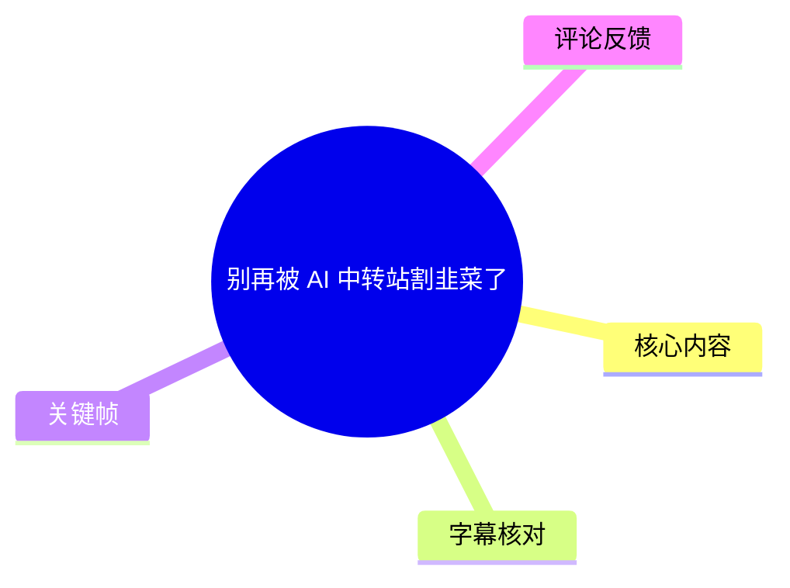
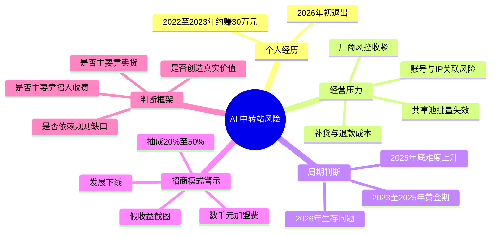

# 别再被 AI 中转站割韭菜了

> 来源：[Bilibili 视频](https://www.bilibili.com/video/BV1snSZBZEwt) 
> UP 主：方鑫三个金｜发布时间：2026-04-06｜视频时长：04:32｜标签：中转站、token

## 小结

视频是 UP 主基于个人从业经历，对 AI 模型“中转站”生意风险的一次劝退分析。其自述在 2022—2023 年间靠该业务获得约 30 万元收入，但已于 2026 年初退出；核心理由不是主观上不愿继续，而是账号、IP、支付/接码及售后等环节的风险和成本上升，使低价中转模式难以持续。

UP 主将变化归因于模型厂商风控收紧：一旦识别到批量注册痕迹，或 IP 与账号归属不匹配，账号可能被集中处理。以其提到的 Claude Code 为例，会员可能短期内失效；共享账号池一夜失效七八成时，经营者既要补货，也要承担用户无法使用后的退款与解释压力。

视频最重要的判断是：2026 年仍被宣传得“很火”的，不一定是中转服务本身，而可能是“出售做中转站机会”的代理招商。UP 主警惕的模式包括虚构收益截图、收取数千元加盟费、教授发展下线，以及按下级收入抽成约 20%—30%、部分达到 50%。在该叙事中，真正的利润重心从 token 服务转向代理费与培训/加盟费。

可迁移的经验是判断收入来源：一门生意究竟来自真实用户持续购买的产品价值，还是来自规则空隙、不断招募新加入者和收取入门费用。视频不反对所有短期机会，但强调规则型套利高度依赖平台政策，规则一变，原本的“缺口”与业务可能同时消失。

本视频主要是个人经验与观点表达，不是对 OpenAI、Anthropic、Claude Code 或所有 API 聚合服务的官方政策说明，也没有给出可审计的经营数据。文中涉及“2026 年”“今年年初”“3 月下旬”等时间判断均具有强时效性，应以相关平台当下服务条款、风控规则、价格与当地法律要求为准。

## 思维导图

## 目录

- [个人经历与退出原因](#个人经历与退出原因)
- [风控收紧、共享池失效与成本变化](#风控收紧共享池失效与成本变化)
- [行业周期：从黄金期到生存问题](#行业周期从黄金期到生存问题)
- [“卖中转机会”：代理费模式的风险](#卖中转机会代理费模式的风险)
- [从卖产品到卖机会：商业模式降级](#从卖产品到卖机会商业模式降级)
- [类比案例与规则缺口判断](#类比案例与规则缺口判断)
- [实践：如何识别高风险的“赚钱项目”](#实践如何识别高风险的赚钱项目)
- [结论、限制与时效性](#结论限制与时效性)
- [字幕比对](#字幕比对)
- [评论分析](#评论分析)
- [处理记录](#处理记录)

## [个人经历与退出原因](https://www.bilibili.com/video/BV1snSZBZEwt?t=0)

### [从约 30 万收入到退出](https://www.bilibili.com/video/BV1snSZBZEwt?t=0)

UP 主自述，其在 **2022—2023 年**依靠 AI 中转站业务获得了约 **30 万元**收入，同时强调这在其所称的行业“大体量参与者”面前并不算多。至“今年年初”（结合视频发布于 2026 年，语境指 2026 年初），其选择退出。

退出逻辑被概括为：**业务不再赚钱**。这里的“中转站”在视频语境中，是向用户提供模型 token/API 调用能力的转售或中转服务；其可持续性依赖上游账号、网络环境、供给稳定性以及用户端的可用性。

> 图：画面字幕为“我退出了这个生意”。该关键帧直接对应视频的开场立场：内容不是招商或教学，而是基于退出经历解释风险，因此有助于界定全文的讨论基调。

### [风控成为底层变量](https://www.bilibili.com/video/BV1snSZBZEwt?t=15)

UP 主认为，亏损或难以维持的底层原因，是 OpenAI、Anthropic 等上游厂商开始收紧风险控制。视频所述触发因素包括：

- 检测到批量注册痕迹；
- IP 与账号归属关系不匹配；
- 账号环境或使用模式被识别为异常。

其观点是，触发后可能不是单个账号轻微受限，而是“直接一锅端”，即批量账号或共享资源同时失效。需要注意：这是 UP 主对其经营环境的描述，并非平台官方公布的统一处置标准或可保证复现的规则。

## [风控收紧、共享池失效与成本变化](https://www.bilibili.com/video/BV1snSZBZEwt?t=29)

### [Claude Code 的集中失效现象](https://www.bilibili.com/video/BV1snSZBZEwt?t=29)

视频特别提到 Claude Code。UP 主称，使用者可能遇到“昨天刚开的会员、今天就被封”的情况；从 **3 月下旬**开始，Claude Code 出现“集体中招”的现象。该说法用于说明低价中转服务为什么会频繁中断。

由此形成的经营链条是：

1. 上游账号或会员失效；
2. 低价中转站无法继续提供稳定调用；
3. 服务方需要补充新资源；
4. 新资源短期内再次失效；
5. 最终由经营者承担用户投诉、退款与信誉损失。

视频没有提供 Claude Code 的具体官方公告、封禁数据或账号样本，因此“集体中招”应视为个人观察与行业经验，而不应直接外推为全部用户的普遍情况。

### [共享池一夜失效七八成](https://www.bilibili.com/video/BV1snSZBZEwt?t=50)

UP 主举出自己退出时遇到的共享池案例：其此前囤积的一个共享池中，卡号“一夜之间挂了七八成”；用户在使用中被锁定，继而要求退款。这里揭示了共享资源模式的一个结构性问题：**单个上游风险会被多个下游用户共同承受**。

> 图：画面字幕为“这是我以前囤的”。该关键帧位于共享池案例前后，能够将抽象的“共享池失效”与讲述者的亲历描述关联起来；画面本身未展示账号清单或经营数据，因此不能据图推断具体资源数量。

### [成本参数：从几毛钱到几块钱](https://www.bilibili.com/video/BV1snSZBZEwt?t=64)

视频给出了两个成本层级的口述参数：

| 成本项目 | 过去 | 视频所述当前状态 | 含义 |
| --- | ---: | ---: | --- |
| 单个补货资源成本 | 几毛钱一个 | 未单独量化 | 低成本阶段可承受较高失效率 |
| 干净住宅网络资源 + 接码平台 | — | 几块钱 | 上游资源成本明显提高 |

UP 主据此指出，问题已不只是“利润是否下降”，而是补货频率、账号失效、退款压力叠加后，业务是否还能活下去。视频还提到过去可能“躺着”获得收益，如今则需持续关注风控日志、更换 IP 池、养号；这些是风险压力的描述，**不构成规避平台风控的操作建议**。

## [行业周期：从黄金期到生存问题](https://www.bilibili.com/video/BV1snSZBZEwt?t=85)

### [UP 主的周期划分](https://www.bilibili.com/video/BV1snSZBZEwt?t=85)

UP 主对 AI 中转行业给出如下阶段判断：

| 时间 | 视频中的判断 |
| --- | --- |
| 2023—2025 年 | 黄金期 |
| 2025 年底 | 已开始变得难做 |
| 2026 年 | 基本“搞不了”，重点从赚钱转为能否存活 |

> 图：画面字幕出现“2026 年这个中转站生意”。它对应视频对当前阶段的判断，适合用于提示读者：该视频的结论明确绑定 2026 年初至发布时的市场与风控环境，而非永久规律。

这不是行业统计报告，而是 UP 主的经验性判断。影响实际情况的变量至少包括：具体模型厂商、账号类型、地区与支付条件、是否有正式授权、用户规模、合规资质、资源采购成本和售后能力。因此，不能将“2026 基本搞不了”理解为对所有 API 服务商或合规聚合平台的绝对结论。

## [“卖中转机会”：代理费模式的风险](https://www.bilibili.com/video/BV1snSZBZEwt?t=97)

### [火的是代理招商，而非 token 服务](https://www.bilibili.com/video/BV1snSZBZEwt?t=97)

UP 主提出一个反直觉判断：近期热度上升的未必是中转服务的真实需求，而是“卖中转机会”的机会。其描述的典型宣传路径包括：

- 在闲鱼等渠道展示“日入几千”“月入几万”的盈利截图；
- 将项目包装成 AI 时代门槛低、来钱快的机会；
- 以教程、账号、加盟和代理机制降低新人的心理门槛；
- 引导加入者继续发展下线。

视频认为，这些收益截图与教程本身可能就是商业模式的一部分，而非对 token 服务利润能力的独立证明。尤其在 token 转售本身难以获利时，出售“如何做中转站”的资格、教程或代理权，可能成为更主要的收入来源。

### [加盟费与抽成参数](https://www.bilibili.com/video/BV1snSZBZEwt?t=137)

UP 主列出的代理模式参数包括：

| 项目 | 视频所述 |
| --- | --- |
| 加盟费 | 数千元 |
| 提供内容 | 账号、教程、话术，并教授发展下线 |
| 上级抽成 | 常称 20%—30% |
| 更高抽成案例 | 有的达到 50% |
| UP 主判断的核心利润 | 新加入者缴纳的加盟费，而非 token |

这些参数来自视频口述，不代表全部市场报价，也不构成对具体商家的指认。判断此类项目时，不能只看宣传收益，需要追问收入结构：若大量收入来自新代理缴费、培训费与下级抽成，而非终端用户为稳定服务持续付费，风险会显著升高。

## [从卖产品到卖机会：商业模式降级](https://www.bilibili.com/video/BV1snSZBZEwt?t=162)

### [三层递进：产品、机会与下级代理](https://www.bilibili.com/video/BV1snSZBZEwt?t=162)

UP 主将其观察到的模式概括为逐步“降级”：

1. **卖真实产品**：有真实用户为 token/API 等服务付费。
2. **卖做生意的机会**：产品难卖后，向希望快速赚钱的人出售加盟、教程或代理资格。
3. **继续向下发展代理**：代理不再以获取终端用户为重点，而是进一步寻找下级代理。

其中的判断逻辑是：每向下一层，收入越可能脱离真实使用需求，越依赖新加入者。UP 主的警示标准是：当一门生意主要靠招人而不是卖货维持时，它已偏离正常的产品服务经营逻辑。

### [为什么“教会别人”值得警惕](https://www.bilibili.com/video/BV1snSZBZEwt?t=189)

UP 主提出一个检验问题：如果某项业务本身确实供不应求、利润稳定，经营者为什么要大量教别人进入并制造竞争者？

视频给出的回答是：除非“教别人做”本身比卖 token 更赚钱，否则持续大规模教学会稀释原本的机会。由此，教程、加盟和代理费可能在实际上成为“收学费”的形式。这一逻辑是启发式风险判断，而不是对所有培训、代理或渠道合作的否定；关键仍是看是否存在真实、可持续、可验证的终端服务收入。

## [类比案例与规则缺口判断](https://www.bilibili.com/video/BV1snSZBZEwt?t=198)

### [金融杂志同事的类比](https://www.bilibili.com/video/BV1snSZBZEwt?t=198)

UP 主讲述一则过往同事案例：其在金融杂志出版社工作的同事据称通过股票赚到很多钱。该同事解释，杂志每次向大量读者推荐某个方向或股票时，恰是自己准备卖出的时候。

这个案例在视频中并非投资建议，而是用于表达信息传播与退出时点之间可能存在的不对称：当一个机会被大量公开推广时，早期参与者未必仍在继续加仓，也可能正准备退出。由于该故事未提供杂志名称、荐股记录、交易凭证和完整时间线，不能将其视为已验证事实或用于投资决策。

### [中转站卖的是“规则缺口”](https://www.bilibili.com/video/BV1snSZBZEwt?t=229)

视频的最终论点是：中转站卖的不是自身创造的价值，而是平台规则造成的缺口。该模式依赖上游规则、账号体系及风控边界，一旦规则变化，缺口消失，业务也可能随之消失。

UP 主强调自己并非反对赚快钱，而是要求参与者先分清收入性质：

- 是提供了用户愿意持续付费的真实价值；
- 还是利用一个随时可能被平台堵上的短期窗口；
- 风险和售后成本最终由谁承担；
- 当规则改变时，是否有可转移的能力、产品或客户关系。

其借用《天道》中的比喻，认为应在机会仍存在时进入，并在监管或规则收紧前退出；对于 2024—2025 年进入中转站的人，UP 主认为当时仍可能获利，但在 2026 年再以同一逻辑入场，风险已明显更高。

## [实践：如何识别高风险的“赚钱项目”](https://www.bilibili.com/video/BV1snSZBZEwt?t=145)

以下不是视频中的规避风控教程，而是根据视频论证整理的审查步骤，适用于评估“AI 中转”“代理加盟”“副业培训”等项目。

### 1. 先核对收入真正来自哪里

将项目收入按来源拆分：

| 检查项 | 较健康的信号 | 高风险信号 |
| --- | --- | --- |
| 主要付费者 | 持续使用服务的终端用户 | 不断加入的新代理/学员 |
| 收入内容 | 产品、服务、交付和售后 | 加盟费、培训费、拉新奖励 |
| 复购基础 | 使用价值、稳定性、服务能力 | 继续发展下线 |
| 利润证明 | 可核验的订单、成本、退款数据 | 模糊收益截图与口头承诺 |

若对方无法区分 token/服务收入与代理费收入，或回避退款率、失效率、成本与售后问题，则不能仅凭“高收益”宣传作判断。

### 2. 将上游规则变化计入成本

视频显示，中转服务的关键风险并非只有服务器或 API 单价，还包括：

- 账号或会员失效；
- IP、归属关系与异常使用模式引发的限制；
- 共享资源批量失效；
- 资源补充成本上涨；
- 用户无法使用后产生的退款、投诉与信誉损失。

评估时应把这些项目纳入保守预算，而不是只用“售价减 token 成本”计算利润。对于依赖第三方账号、共享资源或违反上游条款的模式，尤其应审慎核对合规性；本文不提供任何规避或对抗平台风控的方法。

### 3. 识别“宣传越热、业务越弱”的反向信号

视频中的警示信号包括：

- 用“躺着赚钱”“门槛极低”“日入几千”吸引加入；
- 以截图替代完整收入、成本和退款证明；
- 收费后提供账号、教程、话术，并要求发展下线；
- 上级持续从下级抽成；
- 产品服务本身不稳定，却把重心转为代理招生。

这些信号不能单独证明项目违法或必然欺诈，但意味着应提高尽调门槛，要求可验证的交付、合同责任、退款规则及上游授权信息。

## [结论、限制与时效性](https://www.bilibili.com/video/BV1snSZBZEwt?t=242)

### 结论

视频的核心结论可归纳为三点：

1. **AI 中转站的可用性风险正在上升。** 上游风控、账号失效与共享池批量故障会直接转化为经营成本和售后风险。
2. **“卖代理资格”需要比“卖 token”更严格地审查。** 当项目收入主要来自加盟费和下级抽成，而非真实服务交付时，参与者可能处于利润链条末端。
3. **规则型机会不等于长期商业价值。** 平台规则、价格与账号体系一变，原来的套利空间可能迅速消失。

### 限制与未验证事项

- “约赚 30 万”“共享池一夜挂七八成”“成本从几毛升至几块”等均为 UP 主个人陈述，素材未附原始账目、订单或账号样本。
- 视频提到 OpenAI、Anthropic、Claude Code 的风控变化，但未引用官方公告；不应将其表述为这些厂商对所有地区、所有用户的统一政策。
- 视频没有定义“中转站”的完整技术架构，也没有区分获得正式授权的 API 聚合平台与依赖共享账号、规避规则的服务模式；两者不宜混为一谈。
- 视频中的行业周期判断截至 2026 年发布前后。模型服务政策、官方 API 可用性、价格、合规要求和替代平台均可能快速变化。
- 视频观点不构成商业、投资、法律或合规建议。任何收费代理、账号服务或跨境模型调用安排，应自行核对服务条款、授权关系、数据安全与所在地法律。

## 字幕比对

| 字幕来源 | 完整性 | 专有名词 | 时间轴 | 主要问题 |
| --- | --- | --- | --- | --- |
| Bilibili 站内字幕 | 覆盖 00:00:00.140—00:04:31.560，分句细，内容完整 | “ARTHROPIC”“cloud”“cloud code”等大小写及拼写不规范，但上下文可辨识 | 约 1—3 秒级细粒度，适合章节定位 | 个别口语转写、标点和术语拼写不规范 |
| 本次 ASR 字幕 | 覆盖 00:00:00.460—00:04:31.280；诊断语音覆盖率 99.72%，无大间隔 | “Arserapic”“托根”“中软站”“省余”等误识别较多 | 12 个约 24 秒长段，适合粗定位 | 专有名词与同音词错误较多；“2025 年底”误为“2024 年底”；缺少细粒度句切分 |

### 最终字幕选择与校正

正文以 **Bilibili 站内字幕**为主，因为其时间切分更细，且与视频话语内容的对应更稳定；本次 ASR 已完成检查，用于确认音频存在、整体语音覆盖连续，并与站内字幕进行交叉比对。

本次 ASR 诊断中**未标记 `noAudioStream=true`**：源视频存在音轨，ASR 语言识别为中文，语言概率为 0.9966，语音覆盖率为 99.72%。

依据站内字幕、ASR 上下文及关键帧画面，对以下内容进行了保守规范化：

- 站内字幕中的“ARTHROPIC”、ASR 中的“Arserapic”统一按上下文记为 **Anthropic**；这是对厂商名称的文本规范化，不表示对视频所述风控结论的额外验证。
- “cloud code”统一写为 **Claude Code**；两份字幕的发音和上下文均指向该名称。
- ASR 中的“托根”“中软站”“省余”分别按站内字幕和语境校为 **token**、**中转站**、**闲鱼**。
- 关于周期节点，采用站内字幕的“**2025 年底已经开始难搞**”；ASR 在同一位置误识别为“2024 年底”。
- 章节时间均优先采用站内 SRT 的真实起始时间换算为秒数，而非按文字顺序估计。

## 评论分析

以下仅分析可获取的热评前三条；评论代表用户观点，不等同于已验证事实。

1. **一直很love｜59 赞**  
   评论认为抖音上大量出现“教别人建中转站、躺着赚钱”的内容，恰好说明中转站本身可能已不赚钱。该观点与视频“火的是卖机会，而非卖 token”的核心判断一致。  
   **可信度边界：** 评论未列出具体账号、收费模式或经营数据，只能视为对平台内容生态的个人观察。

2. **_Dreemurr_逐梦｜7 赞**  
   评论提出疑问：若要调用海外模型，已有硅基流动、Ofox 等 API 聚合平台，为何还需要使用中转站？该评论补充了视频未展开的一个关键区分：用户可能存在官方 API、授权聚合平台与非正规中转服务等不同选择。  
   **可信度边界：** 评论提到的平台是否可用、支持哪些模型、价格与合规状态，会随时间变化；视频本身未比较这些平台，不能据此得出其优劣结论。

3. **一朵小散花｜3 赞**  
   评论认为中转本来就是“取巧”的事，退出是正确选择。它与视频“规则缺口”观点一致，强调模式的脆弱性。  
   **可信度边界：** “取巧”是价值判断，未区分合规 API 聚合、授权转售与违反上游规则的账号共享等不同业务形态，解释范围较宽。

## 处理记录

- Worker ID：`worker-mrj0www4-e8d79408`
- 模型：`gpt-5.6-terra`
- 调用工具与素材：视频元数据、站内字幕 `p01-ai-zh.srt`、本次 ASR 结果 `asr/asr-result.json`、ASR SRT `asr/transcript.srt`、关键帧目录 `frames/`、热评数据 `comments/comments.json`。
- 字幕选择：优先采用站内 SRT 的细粒度真实时间轴；同步检查本次 ASR。ASR 有音轨且覆盖率 99.72%，但存在较多专有名词、同音词与年份误识别，因此不作为正文逐字依据。
- 关键帧选择依据：选用 `frames/frame-001.jpg`、`frames/frame-003.jpg`、`frames/frame-004.jpg`。它们分别对应“退出生意”“此前囤积的共享池”“2026 年中转站生意”的画面字幕与主题节点；未将人物画面延伸解读为未出现的经营证据。
- 时间轴依据：章节链接优先取站内 SRT 起始时间，例如 00:00:00.140 对应 `t=0`、00:00:29.100 对应 `t=29`、00:01:37.240 对应 `t=97`。
- 评论范围：仅处理素材中可获取的热评前三条，未扩展检索其他评论。
- 缓存清理：未提供可执行的缓存清理日志或结果，无法确认是否已清理；本文不虚构清理状态。
- 未解决问题：缺少上游平台官方风控公告、账号失效样本、成本账本、退款数据及代理合同，故视频中的经营规模、失效比例和行业判断均保留为 UP 主个人陈述。
