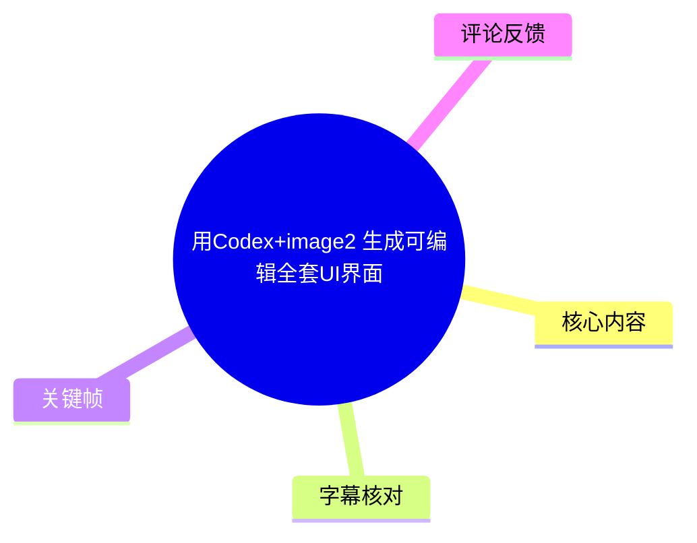
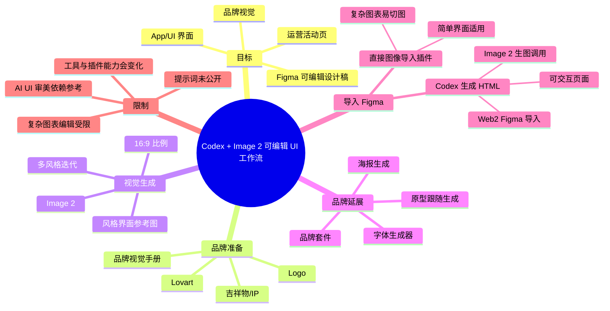
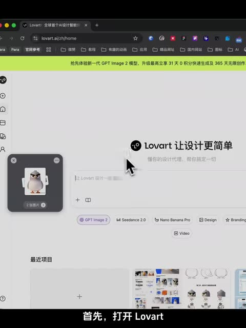
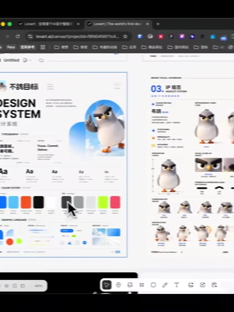
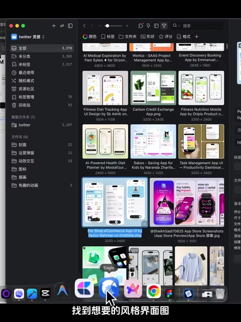
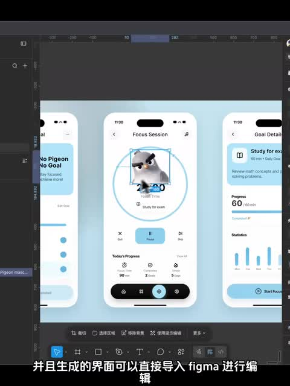

# 用 Codex + Image 2 生成可编辑全套 UI 界面

> 来源：[Bilibili 视频](https://www.bilibili.com/video/BV1PX5K6AEMG) 
> UP 主：派大鑫｜时长：03:30｜合集：AIcode  
> 视频简介称：使用 Codex 与 Image 2 生成 UI、App 界面、运营活动页，并导入 Figma 编辑。

## 小结

视频展示了一条从品牌资产出发、经由 AI 生成界面视觉、再转为可编辑设计稿的工作流。核心链路是：先在 **Lovart** 中用吉祥物与 Logo 建立品牌视觉规范，再通过 **Image 2** 结合风格参考图生成 UI 视觉稿，最后按界面复杂度选择不同方式导入 Figma。

作者特别强调，决定生成 UI 质量的关键并不只是提示词，而是提供明确的**风格界面参考图**。其判断是，AI 对 UI 审美与版式的自主理解有限；缺乏参考图时，即使提示词写得详细，也可能难以达到预期。因此，参考图、IP/吉祥物、Logo 与品牌规范共同构成生成的控制条件。

在 Lovart 中，作者先让 Agent 基于 Logo 与吉祥物产出品牌手册，再将这些资产与参考图交给 Image 2 生成 16:9 界面图。随后可将确定的品牌图、界面图沉淀至“品牌套件”，用于继续延展页面、跟随原型生成，以及制作海报等物料，以保持视觉一致性。

视频比较了两条“图转 Figma”路径：直接使用 Figma 插件，可快速导入较简单的 UI，但复杂图表可能变成不可编辑的切图；另一条是将界面图与吉祥物交给 Codex，生成可交互 HTML，再经 Web2 Figma 类插件导入 Figma。作者认为后一方式可得到可编辑图层与自动布局，较适合制作完整可编辑页面。

需要注意：视频没有展示完整提示词原文、插件确切名称/版本、Codex 配置、生成成本、生成耗时或导入后的逐层编辑验证过程；“还原度还行”“基本一致”等属于作者在视频中的主观演示结论。相关工具、模型入口和插件能力具有时效性，应以当前产品界面和官方文档为准。

## 思维导图

## 目录

- [背景、目标与适用范围](#背景目标与适用范围-0000)
- [阶段一：在 Lovart 建立品牌视觉手册](#阶段一在-lovart-建立品牌视觉手册-0024)
- [阶段二：以 Image 2 和参考图生成 UI](#阶段二以-image-2-和参考图生成-ui-0048)
- [阶段三：沉淀品牌套件并延展设计](#阶段三沉淀品牌套件并延展设计-0136)
- [阶段四：海报元素与字体处理](#阶段四海报元素与字体处理-0200)
- [阶段五：两种导入 Figma 的路径](#阶段五两种导入-figma-的路径-0220)
- [操作清单与参数汇总](#操作清单与参数汇总-0024)
- [限制、风险与时效性](#限制风险与时效性-0112)
- [字幕比对](#字幕比对)
- [评论分析](#评论分析)
- [处理记录](#处理记录)

## 背景、目标与适用范围 [00:00](https://www.bilibili.com/video/BV1PX5K6AEMG?t=0)

作者开场提出的目标是：只提供一个 IP（视频语境中主要指吉祥物形象）及相关品牌资产，完成品牌视觉、界面设计、活动页面等生成，并将生成结果导入 Figma 编辑。

视频将 Image 2 描述为已经上线一段时间、讨论热度较高的图像生成能力。作者基于自己的测试，给出一套从零搭建的 UI 生成工作流。该工作流的输出不止是一张静态界面图，还包括：

1. 品牌视觉手册；
2. 多种风格的 UI 视觉方案；
3. 可复用的品牌套件；
4. 运营活动页、App Store 商店图、海报等延展物料；
5. 可转入 Figma 的界面文件；
6. 通过 HTML 中转后得到的、声称具有可编辑图层和自动布局的设计稿。

适合人群包括：已有 Logo、吉祥物或品牌 IP，需要快速探索界面视觉方向的产品设计师、品牌设计师、独立开发者与 AI 辅助设计实践者。若目标是高度精确的复杂数据可视化、生产级设计系统或严格可访问性规范，视频给出的演示流程不能替代人工设计与工程验收。

## 阶段一：在 Lovart 建立品牌视觉手册 [00:24](https://www.bilibili.com/video/BV1PX5K6AEMG?t=24)

作者的第一步是在 Lovart 中上传品牌基础素材。根据画面与口述，素材至少包括：

- 吉祥物 / IP 形象；
- Logo；
- 用于要求生成品牌规范的提示词（视频未展示可完整抄录的提示词文本）。

作者在模型选择处关闭“自动”选项，并选择画面中标注为 **GPT Image 2 Auto** 的模型，然后发起生成。视频称，Lovart 的 Agent 会依据 Logo 与 IP 形成一套较详细的品牌视觉手册。

这一步的定位不是直接做最终 UI，而是先建立后续生成的“参考物料”：色彩、形象、品牌气质与视觉元素有了相对统一的来源后，后续产品界面更容易与 IP 保持一致。

> 图：关键帧展示 Lovart 首页、左下角已加入的企鹅吉祥物素材，以及画面中的 GPT Image 2 入口。它说明本流程的起点是上传可识别的品牌资产，而非仅用纯文本描述品牌。

> 图：画面中可见设计系统/品牌资料页面、企鹅形象、色彩条和多种吉祥物姿态。这张图直观体现了“先生成品牌手册，再做界面”的中间产物及其可复用价值。

### 本阶段经验

- **输入资产越明确，后续一致性越容易控制。** 视频实际使用了吉祥物和 Logo，而不只是一个抽象品牌名称。
- **品牌手册是中间层。** 它将一次性的素材输入转为可重复引用的视觉约束。
- **提示词是必要输入，但视频未公开原文。** 因此不能依据本视频复现其具体措辞，只能复现“上传资产—选择模型—生成品牌资料”的结构。

## 阶段二：以 Image 2 和参考图生成 UI [00:48](https://www.bilibili.com/video/BV1PX5K6AEMG?t=48)

完成品牌资料后，作者新建图像生成器，将前一步生成的规范与 IP 加入输入，并把模型切换为 **Image 2**。视频明确提到的画面比例参数为：

| 参数项 | 视频中的设置 |
| --- | --- |
| 图像模型 | Image 2 |
| 生成比例 | 16:9 |
| 品牌输入 | 品牌规范、IP/吉祥物 |
| 风格输入 | 目标风格的界面参考图 |

作者认为最关键的动作是：**找到符合目标审美的 UI 界面图，并把它拖入作为参考。** 其解释是，当前 AI 对 UI 界面“美感理解”不足，参考图能为 AI 提供更明确的布局、色彩、组件密度与视觉风格方向。

> 图：关键帧展示素材库/图片管理界面中的多组 App UI 缩略图，画面字幕为“找到想要的风格界面图”。它是本流程最重要的控制变量之一：参考图帮助模型锁定风格方向，而非依赖模糊文字要求。

### 为什么不能只依赖提示词？ [01:12](https://www.bilibili.com/video/BV1PX5K6AEMG?t=72)

作者明确给出的经验判断是：没有参考图时，提示词即使写得很好，生成结果也可能偏离目标，难以稳定达到想要的效果。视频以生成失败或不符合预期的示例画面说明这一点。

因此，推荐的迭代顺序是：

1. 先准备吉祥物、Logo、品牌规范；
2. 搜集符合预期的风格界面作为参考；
3. 将规范、IP、参考图共同放入 Image 2 的任务中；
4. 生成多种风格界面；
5. 从结果中筛选最接近目标风格的一组；
6. 把选定风格继续沉淀为品牌套件，服务后续页面延展。

视频还提到，这种方式不限于产品主界面，也可用于生成：

- 运营活动页；
- App Store 商店图；
- 其他需要与品牌 IP 保持一致的视觉物料。

## 阶段三：沉淀品牌套件并延展设计 [01:36](https://www.bilibili.com/video/BV1PX5K6AEMG?t=96)

当生成并确认了目标风格后，作者回到 Lovart 首页进入“品牌套件”页面，将已确定风格的品牌图片与界面图全部导入。视频称，系统会根据这些图片生成一整套可复用的品牌视觉资产。

之后打开项目，在提示词/任务中引用该品牌套件，即可在既有风格基础上继续延展界面。此处的关键变化是：输入不再只是零散的 Logo 或单张参考图，而是已经筛选过、具有统一审美的资产集合。

### 原型约束与一致性 [01:36](https://www.bilibili.com/video/BV1PX5K6AEMG?t=96)

作者还给出两种延展使用方式：

- **按品牌套件直接生成界面：** 适合探索同一品牌下的新页面或新活动物料。
- **提供已画好的界面原型：** 让 AI 参考原型图生成。作者称，这种情况下输出界面的布局“几乎跟原型一致”。

视频同时称，基于品牌套件生成海报时，IP 形象仍能保持一致性。这里的“一致”是作者对演示结果的描述，不表示所有复杂场景均可稳定复现。

### 可迁移方法

品牌套件的本质是把“已验证的视觉选择”转化为后续任务的共享上下文。对于多页产品而言，建议将以下资产放进统一的可复用集合：

- 已确认的品牌色与配色组合；
- 吉祥物主形象与常用姿态；
- 已确认的 UI 风格图；
- 典型组件和页面布局；
- 可接受的海报与运营物料风格。

这样做的收益是减少每页重新描述品牌风格的成本，也降低不同页面风格漂移的概率。

## 阶段四：海报元素与字体处理 [02:00](https://www.bilibili.com/video/BV1PX5K6AEMG?t=120)

视频继续展示了海报编辑和字体补全两项能力。

### 分解并调整海报元素

作者表示，点击“编辑元素”后，可以把海报上的元素拆解出来再调整。视频没有提供元素拆分后是否全部转成矢量、是否保留图层命名、以及复杂效果如何处理等细节，因此只能确认其演示了编辑入口与“可调整元素”的用途。

### 字体文件丢失时的处理方式

作者给出的步骤是：

1. 截图需要使用的字体；
2. 打开字体生成器；
3. 粘贴字体截图；
4. 让 AI 自动分析并生成字体文件；
5. 在字体选项中切换至“我的字体”后使用。

这一方式适用于作者所描述的“字体文件丢失”场景，但视频没有说明生成字体的字库覆盖范围、字形版权归属、商用授权或识别准确率。将截图生成的字体用于公开发布、商业项目或品牌资产前，应自行确认原字体的授权与再生成文件的使用权限。

## 阶段五：两种导入 Figma 的路径 [02:20](https://www.bilibili.com/video/BV1PX5K6AEMG?t=140)

视频将“生成界面图到 Figma”分为两条路线，核心差异在于是否经过 HTML 这一中间层。

### 路径 A：直接使用 Figma 图像导入插件 [02:20](https://www.bilibili.com/video/BV1PX5K6AEMG?t=140)

作者的演示步骤为：

1. 将生成的界面图拖进 Figma；
2. 打开一个 Figma 插件；
3. 选中该界面图；
4. 点击“生成”；
5. 将界面转换并导入 Figma 进行编辑。

> 图：关键帧显示 Figma 画布中的三张手机界面，以及中间界面中被选中的企鹅元素。它可用于理解“图像导入后可尝试编辑”的目标，也对应视频中“可直接导入 Figma 进行编辑”的展示。

作者对该路径的评价是“还原度还行”，但指出其限制：**复杂图表效果可能被识别为切图显示**。这意味着它适合导入结构相对简单的界面，而不适合把复杂图表、精细插画或复杂视觉特效稳定转成可独立编辑的原生组件。

### 路径 B：Codex 生成 HTML，再导入 Figma [02:44](https://www.bilibili.com/video/BV1PX5K6AEMG?t=164)

针对直接导入的限制，作者推荐使用 AI 编程工具，其中明确推荐 **Codex**，理由是其支持调用 Image 2 生图。

操作链路如下：

1. 打开 Codex；
2. 拖入已经生成的界面图；
3. 同时拖入吉祥物素材；
4. 输入提示词（视频未提供完整文本）；
5. Codex 分析界面内容；
6. 作者称 Codex 会对吉祥物进行单独切图并引用；
7. 打开生成的 HTML 文件，检查页面效果；
8. 使用作者此前分享的 Web2 Figma 插件，将 HTML 页面导入 Figma。

作者在视频中展示并声称，生成的 HTML 页面在视觉上“基本与界面一致”，且页面具有交互性；通过 Web2 Figma 导入后，整页为可编辑图层，并自动完成了自动布局。

### 两条路径的对比

| 维度 | 直接图像导入 Figma | Codex 生成 HTML 后导入 |
| --- | --- | --- |
| 起始输入 | 生成的界面图 | 界面图 + 吉祥物 |
| 中间产物 | 图像转设计元素 | HTML 页面 |
| 操作复杂度 | 较低 | 较高，需要 AI 编程工具与 HTML |
| 视频中的适用判断 | 简单界面 | 需要更完整可编辑结构的页面 |
| 复杂图表 | 可能转为切图 | 视频未对复杂图表做独立验证 |
| 可交互性 | 视频未强调 | 作者称生成的 HTML 可交互 |
| Figma 结果 | 可进行一定编辑 | 作者称有可编辑图层与自动布局 |

需要区分的是：视频确实展示了这两条流程及作者评价，但没有给出用于 Codex 的完整提示词、HTML 源码、Web2 Figma 插件的准确链接或版本，也没有量化对齐误差。因此，实际导入质量仍需使用者针对自身项目测试。

## 操作清单与参数汇总 [00:24](https://www.bilibili.com/video/BV1PX5K6AEMG?t=24)

以下清单严格按视频展示的顺序整理，不补写素材中未出现的提示词内容。

### A. 构建品牌视觉基础

1. 打开 Lovart。
2. 上传吉祥物/IP 与 Logo。
3. 输入要求生成品牌视觉手册的提示词。
4. 关闭自动模型选择。
5. 选择 **GPT Image 2 Auto**。
6. 生成品牌视觉手册。

### B. 生成 UI 视觉稿

1. 新建图像生成器。
2. 加入品牌规范与 IP 素材。
3. 将模型设为 **Image 2**。
4. 设置画面比例为 **16:9**。
5. 加入目标风格 UI 参考图。
6. 输入生成提示词。
7. 多次生成、筛选，直到获得目标风格。

### C. 固化品牌套件并继续延展

1. 进入品牌套件页面。
2. 将确认风格后的品牌图与界面图加入品牌套件。
3. 在新项目中引用该品牌套件。
4. 按需求直接延展新界面，或先提供界面原型再生成。
5. 如需运营物料，可用品牌套件生成海报等内容。

### D. 生成字体与编辑海报

1. 在海报中点击“编辑元素”，拆分并调整可编辑元素。
2. 若字体文件缺失，截取字体样式。
3. 将截图粘贴到字体生成器。
4. 等待 AI 分析并生成字体文件。
5. 在字体菜单中选择“我的字体”。

### E. 输出为可编辑 Figma 设计稿

**简单界面：**

1. 拖入 Figma。
2. 使用图像导入类插件。
3. 选中界面后点击生成。
4. 检查图表等复杂区域是否被保留为切图。

**追求 HTML 中间层与自动布局：**

1. 在 Codex 中上传界面图与吉祥物。
2. 使用提示词要求分析并复刻界面。
3. 打开生成的 HTML 文件，检查视觉与交互。
4. 使用 Web2 Figma 插件导入。
5. 在 Figma 检查图层是否可编辑、是否生成自动布局，以及图表/装饰元素是否需要人工重建。

## 限制、风险与时效性 [01:12](https://www.bilibili.com/video/BV1PX5K6AEMG?t=72)

### 视频已明确说明的限制

1. **缺少参考图时，UI 生成质量不稳定。** 作者认为单靠提示词很难达到目标审美。
2. **直接图像转 Figma 不适合复杂界面。** 复杂图表可能被视为切图，而不是可编辑图层。
3. **需要多轮生成与筛选。** 视频提出通过批量生成多种风格，逐步选到理想方案，而非一次生成成功。

### 素材未能证实的部分

以下内容在视频素材中没有给出，不能视为已验证事实：

- Lovart、Image 2、Codex 与相关插件的价格、积分消耗和速率限制；
- 完整提示词与可直接复刻的指令模板；
- Codex 所生成 HTML 的技术栈、响应式策略、无障碍支持和代码质量；
- Web2 Figma 导入的具体插件名称、版本、文件兼容性及长期可用性；
- 字体截图生成字体文件的版权、商用与授权条件；
- 大型项目、多页面设计系统、复杂数据图表的导入成功率；
- 自动布局、组件化、图层命名是否在所有页面中稳定生成。

### 时效性说明

视频元数据发布时间为 2026-05-12；素材抓取时间为 2026-07-16。视频涉及的 Image 2、Lovart、Codex、Figma 插件与 Web-to-Figma 转换能力都可能持续更新，模型名、入口、功能权限、计费方式和输出质量可能已发生变化。实践时应以各工具当前界面与官方说明为准，并对重要设计稿保留原始 Figma 文件、HTML 文件与图片资产。

## 字幕比对

| 字幕来源 | 完整性 | 专有名词 | 时间轴 | 主要问题 |
| --- | --- | --- | --- | --- |
| Bilibili 站内字幕 | 未提供可用字幕 | 无法核验 | 无法使用 | 素材包中没有可用站内字幕文件。 |
| 本次 ASR 字幕 | 较完整；语音覆盖约 92.84%，共 10 段 | 有多处音近字、乱码和误识别 | 可用；带 SRT 起止时间 | 术语识别不稳定，且 03:12.610—03:23.500 存在约 10.89 秒大间隔。 |

本次 ASR 已检查：识别语言为中文，语言概率约 `0.9995`；音频时长约 `209.37` 秒；ASR 末段到 `03:29.240`。诊断中**未标记** `noAudioStream=true`，因此本视频存在可供识别的音轨，并非无音轨源视频。

由于没有可用站内字幕，正文采用本次 ASR 的真实 SRT 时间段作为时间轴基础，并结合标题、视频简介与关键帧画面校正少量明显术语。主要校正如下：

| ASR 原文/异常识别 | 正文采用写法 | 校正依据 |
| --- | --- | --- |
| “Lovit” | Lovart | 关键帧浏览器地址与页面品牌文字显示 `lovart.ai` / Lovart。 |
| “贝格马” | Figma | 标题、视频画面及口述语境均指向 Figma。 |
| “EY 界面” | UI 界面 | 标题和视频主题均为 UI 界面生成。 |
| “工座流” | 工作流 | 中文语境及上下文校正。 |
| “参卡图” | 参考图 | 上下文为拖入风格界面图作为生成参照。 |
| “Web2 Figma” | Web2 Figma（按 ASR 保留） | 视频口述可辨为该名称，但未提供插件链接、准确拼写或版本，故不进一步扩展。 |
| 03:08 后“并起吉…” | 未强行补全 | ASR 文本截断，后续画面与字幕未提供足够证据恢复原句。 |

## 评论分析

本次仅获取到 2 条热评，未达到三条；以下不将评论内容视作已验证事实。

### 1. 德来-全不费工夫：补充另一种 HTML 转设计稿工具

> 点赞 9：建议将 Codex 生成的 HTML 页面导入 Figma、MasterGo 等设计工具时，可使用 “Refore HTML to Figma”，并附带链接。

这条评论提供了视频外的替代工具信息，和视频的“HTML → Figma”路径高度相关。其价值在于提示读者：HTML 转设计稿不一定只能依赖视频中提及的 Web2 Figma 方案。

但该评论只是用户建议，未展示导入质量、自动布局保留程度、数据安全、价格、版本兼容性或插件可信度；链接与工具能力应由使用者自行核验，不能据此认定其优于视频方案。

### 2. 小鳄鱼在此呀：询问悬浮工具

> 点赞 6：询问视频里悬浮的工具是什么。

该评论反映出视频演示界面中存在未被明确说明的悬浮工具/控件，可能影响观众复现操作。视频素材与现有评论没有给出作者回复或工具名称，因此无法确认其具体身份、用途或是否为 Lovart 自带功能。

## 处理记录

- Worker ID：`worker-mrj0www4-e8d79408`
- 模型：`gpt-5.6-terra`
- 调用工具与素材：基于任务提供的 Bilibili 元数据、媒体合并文件信息、音频提取产物、ASR 结果/`transcript.srt`、关键帧目录、评论 JSON 与封面素材清单进行整理；未获得可用站内字幕文件。
- ASR 检查：已检查 `asr-result.json` 的语言、时长、分段、覆盖率与空档诊断；未出现 `noAudioStream=true`。
- 字幕选择：站内字幕不可用；以本次 ASR SRT 的真实起止时间作为正文时间轴来源，并用关键帧、标题和简介校正明显的专有名词误识别；对无法证实的截断文本不补写。
- 关键帧选择依据：  
  - `frames/frame-002.jpg`：显示 Lovart、吉祥物素材和模型入口，支撑工作流起始步骤；  
  - `frames/frame-003.jpg`：显示设计系统/品牌视觉资料，支撑品牌手册与资产沉淀；  
  - `frames/frame-004.jpg`：显示 UI 风格参考图集合，支撑“参考图是关键控制条件”的论述；  
  - `frames/frame-001.jpg`：显示 Figma 画布中的导入界面，支撑 Figma 编辑路径说明。  
  其余关键帧虽在目录清单中列出，但任务未提供对应可见画面内容，未据此编造说明。
- 评论处理：仅分析可获取热评的前两条；素材未提供第三条，故明确标注未获取。
- 缓存清理：素材中未提供缓存清理命令、执行日志或结果，无法确认是否已执行缓存清理。
- 未解决问题：完整提示词、各插件准确名称和版本、Codex HTML 源码、生成成本、字体授权、复杂图表导入质量与长期兼容性均未在素材中得到验证。
