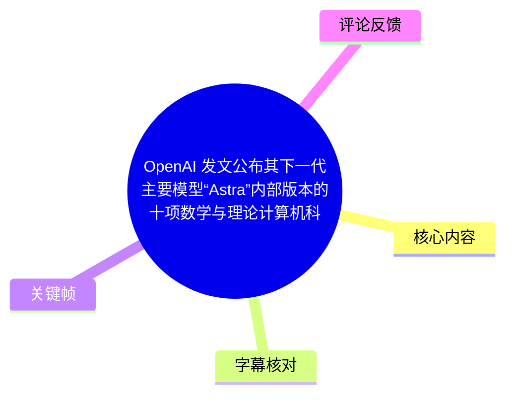
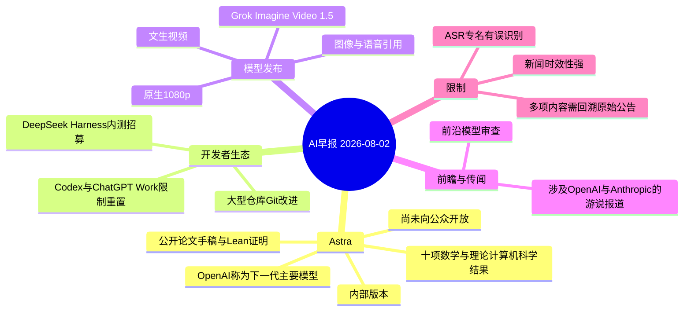
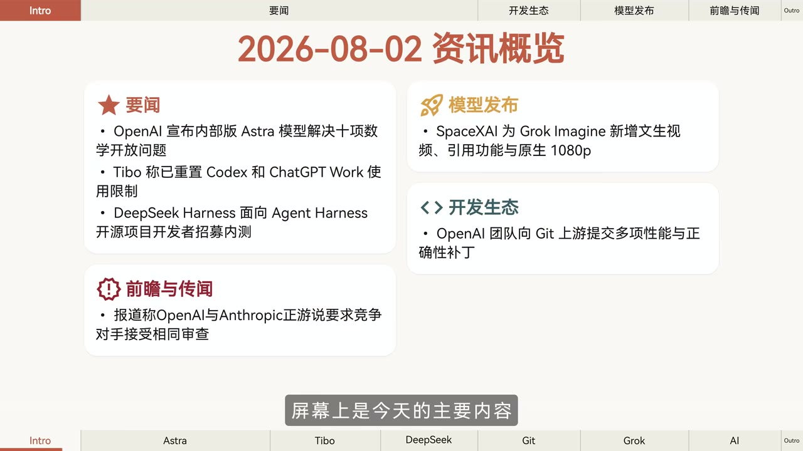
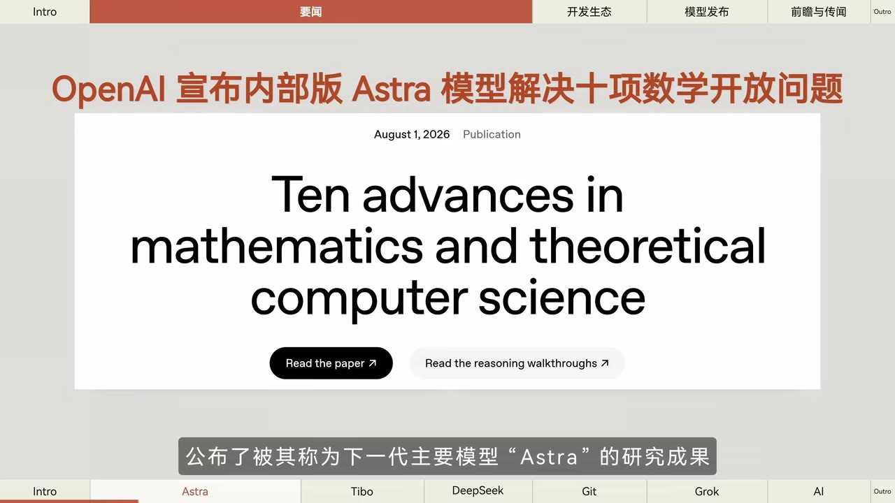
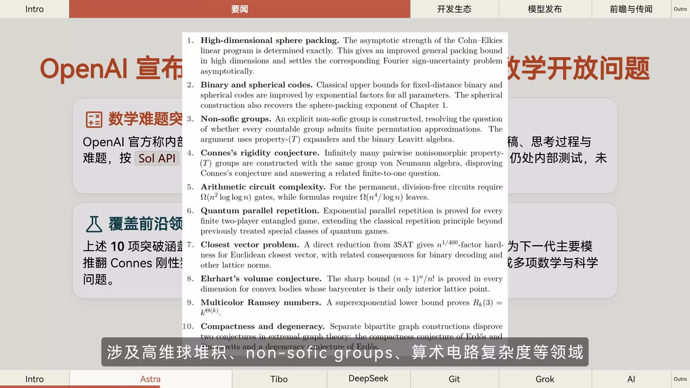
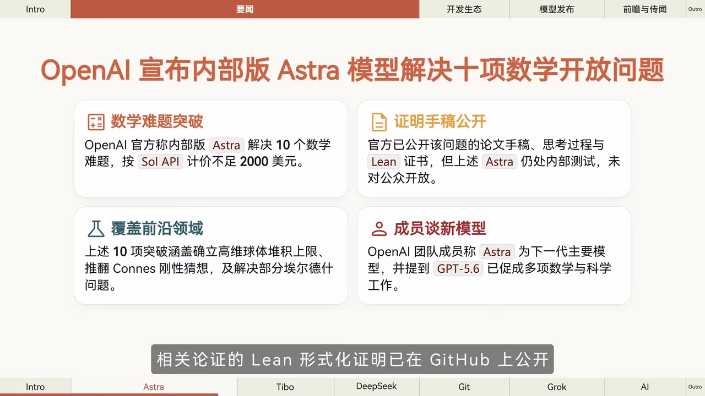

# OpenAI 发文公布其下一代主要模型“Astra”内部版本的十项数学与理论计算机科学成果【AI 早报 2026-08-02】

> 来源：[Bilibili 视频](https://www.bilibili.com/video/BV1XD3D68ETR) 
> UP 主：橘鸦Juya｜发布时间：2026-08-02｜视频时长：93 秒

## 小结

这是一则 2026 年 8 月 2 日的 AI 早报，核心新闻是：OpenAI 公开介绍了一个被称作下一代主要模型 **Astra** 的内部版本，并称其在数学和理论计算机科学的长期开放问题上产出 **10 项新结果**。视频列举的方向包括高维球堆积、非 soft 群（Non-soft groups）与算术电路复杂度等。

视频画面进一步给出重要限定：Astra 仍处于内部测试阶段，尚未向公众开放；公开的是论文手稿、推理过程及相关的 Lean 形式化证明材料，而非模型本体。画面还称，相关问题按 Sol API 计价的计算成本不足 2,000 美元；这一金额属于视频转述，应以原始材料为准。

其余快讯涵盖：Codex 与 ChatGPT Work 使用限制重置、DeepSeek Harness 招募 Agent Harness 开源项目开发者内测、OpenAI 推进面向大型仓库的 Git 性能与正确性改进、SpaceXAI 的 Grok Imagine Video 1.5 新增文生视频/引用/原生 1080p，以及 OpenAI、Anthropic 据报道推动对竞争对手实施相近的前沿模型审查。

适合关注前沿模型能力、形式化验证、AI 编程工具及 AI 治理动态的读者。由于视频是短时新闻播报，专有名词存在 ASR 误识别，且部分消息使用“据报道”“相关负责人表示”等归因措辞，不能直接视为独立核验后的事实。

## 思维导图

## 目录

- [资讯总览与时效范围](#资讯总览与时效范围)
- [Astra：十项数学与理论计算机科学成果](#astra十项数学与理论计算机科学成果)
- [Codex、DeepSeek Harness 与 Git 开发生态](#codexdeepseek-harness-与-git-开发生态)
- [Grok Imagine Video 15 与前沿模型审查传闻](#grok-imagine-video-15-与前沿模型审查传闻)
- [可执行的跟进步骤](#可执行的跟进步骤)
- [结论与限制](#结论与限制)
- [字幕比对](#字幕比对)
- [评论分析](#评论分析)
- [处理记录](#处理记录)

## 资讯总览与时效范围 [00:00](https://www.bilibili.com/video/BV1XD3D68ETR?t=0)

视频以“2026-08-02 资讯概览”开场，画面将内容分为四类：

1. **要闻**：Astra 的十项数学开放问题成果、Codex/ChatGPT Work 使用限制重置、DeepSeek Harness 内测招募。
2. **开发生态**：OpenAI 向 Git 上游提交大型仓库场景下的性能与正确性补丁。
3. **模型发布**：画面写作 SpaceXAI 为 Grok Imagine 新增文生视频、引用功能与原生 1080p。
4. **前瞻与传闻**：有关 OpenAI 与 Anthropic 游说美国政府、要求竞争对手接受相同审查的报道。

> 图：总览页明确列出本期新闻分类与条目，是校对后续 ASR 中多个专有名词、确认视频议题范围的关键画面依据。

本期属于新闻汇总而非技术教程：播报没有展示可复现代码、模型调用命令或实测数据。因此，读者应将其作为追踪原始公告与项目页面的索引，不宜把视频概述替代为论文或产品文档本身。

## Astra：十项数学与理论计算机科学成果 [00:00](https://www.bilibili.com/video/BV1XD3D68ETR?t=0)

### OpenAI 对 Astra 的定位 [00:08](https://www.bilibili.com/video/BV1XD3D68ETR?t=8)

视频称 OpenAI 发文公布了其称为下一代主要模型 **Astra** 的研究成果。画面展示英文页面标题为 **“Ten advances in mathematics and theoretical computer science”**，日期为 **August 1, 2026**。

> 图：画面直接呈现英文成果页面标题、发布日期及“Read the paper”“Read the reasoning walkthroughs”入口，支持“公开研究材料”的表述；它并不证明 Astra 已公开提供使用。

视频画面概括了四点：

- OpenAI 称 Astra 内部版本解决了 10 个数学难题；
- 按画面文字，Sol API 计价的计算成本“不足 2,000 美元”；
- 官方公开了问题的论文手稿、思考过程与 Lean 证书；
- Astra 仍是内部测试版本，尚未对公众开放。

其中，“下一代主要模型”与“内部版本”是视频及画面转述的定位，不等同于 OpenAI 已正式发布面向公众的产品。画面还提到 OpenAI 团队成员将 Astra 称为下一代主要模型，并出现“GPT-5.6 已促成多项数学与科学工作”的说法；视频未展示该成员身份、完整原话或可独立验证的上下文。

### 涉及领域与十项结果 [00:12](https://www.bilibili.com/video/BV1XD3D68ETR?t=12)

ASR 提到的代表性领域为：

- 高维球堆积（high-dimensional sphere packing）；
- Non-Sophie Groups：该词为 ASR 结果，但关键帧英文原文显示为 **Non-soft groups**；
- 算术电路复杂度（arithmetic circuits complexity）。

> 图：该帧列出了十项成果的英文标题，可用于纠正 ASR 的“Non-Sophie Groups”误识别，并显示视频所称“十项”并非仅限于三个领域。

从画面可辨识的十项主题依次包括：

1. 高维球堆积；
2. 二元与球面码；
3. 非 soft 群；
4. Connes 刚性猜想；
5. 算术电路复杂度；
6. 量子并行重复；
7. 最近向量问题；
8. Ehrhart 体积猜想；
9. 多色 Ramsey 数；
10. 紧致性与退化性。

视频画面的中文概括特别指出：这些突破涵盖“确立高维球体堆积上限、推翻 Connes 刚性猜想，以及解决部分埃尔德什问题”。不过，短视频没有讲解每个问题的精确定义、前提条件、证明路线、同行评审状态或结论边界。尤其数学命题中的“解决”“推翻”具有严格含义，应回到论文、推理 walkthrough 与 Lean 仓库核验具体定理陈述。

### Lean 形式化证明的意义与边界 [00:24](https://www.bilibili.com/video/BV1XD3D68ETR?t=24)

视频称相关论证的 Lean 形式化证明已在 GitHub 公开，可进行机器验证。Lean 是用于形式化数学与程序证明的证明助手；若某份证明在给定定义、定理陈述和可信内核下通过检查，可降低人工推理过程中的形式错误风险。

> 图：画面将“数学难题突破”“证明手稿公开”“覆盖前沿领域”“成员谈新模型”并列，也明确写出 Astra 仍在内部测试、未对公众开放，是理解成果与产品可用性差异的关键帧。

但需要区分以下层次：

| 层次 | 视频所称内容 | 不能据此直接推出的结论 |
| --- | --- | --- |
| 研究结果 | 10 项新结果及论文/推理材料公开 | 所有数学界专家均已接受或已完成同行评审 |
| 形式化验证 | 相关 Lean 证明在 GitHub 公开、可机器验证 | 所有背景定义、建模选择与研究意义均无争议 |
| 模型能力 | 内部版 Astra 参与相关工作 | 公众已可使用 Astra，或可稳定复现全部成果 |
| 成本信息 | 画面称 Sol API 计价不足 2,000 美元 | 完整训练成本、人工审阅成本和所有实验成本均低于该数值 |

## Codex、DeepSeek Harness 与 Git 开发生态 [00:24](https://www.bilibili.com/video/BV1XD3D68ETR?t=24)

### Codex 与 ChatGPT Work 限制重置 [00:24](https://www.bilibili.com/video/BV1XD3D68ETR?t=24)

视频称，北京时间 8 月 1 日中午，Codex 负责人 **Tibo** 表示已重置 Codex 与 ChatGPT Work 的使用限制。ASR 随后出现“庆祝小绿洲”“本周末运行 10 万个 Luna 任务绘画”等不连贯转写；提供的关键帧没有覆盖这段，因此无法据现有素材可靠校正其准确对象、具体限额、活动名称或适用套餐。

可确认的最小事实是：视频报道了“使用限制已重置”这一消息。对于实际使用者，仍应在产品控制台、套餐说明或官方公告中确认：

1. 重置的是周期性配额还是临时额度；
2. 涉及 Codex、ChatGPT Work 的哪些地区与订阅层级；
3. 额度重置的开始/结束时间；
4. 是否存在并发数、速率、任务类型或滥用防护限制。

### DeepSeek Harness 内测招募 [00:48](https://www.bilibili.com/video/BV1XD3D68ETR?t=48)

视频称 **DeepSeek Harness** 处于内测阶段，相关负责人表示，**Agent Harness 相关开源项目**的开发者可联系参与内测，并需附上 GitHub ID 与开源代表作。

这是一项准入信息，不是公开可用承诺。视频未提供报名链接、联系渠道、筛选规则、保密条款、测试权限范围、API 限额或正式上线日期。若计划申请，较稳妥的准备顺序为：

1. 确认自己参与过与 Agent Harness 相关的开源项目；
2. 整理可公开访问的 GitHub ID；
3. 选择最能体现贡献的代表作，并说明个人具体贡献；
4. 通过视频所指向的官方渠道核实招募是否仍有效；
5. 在获得资格前，不假定产品能力、价格或数据处理规则。

### 面向大型仓库的 Git 改进 [00:48](https://www.bilibili.com/video/BV1XD3D68ETR?t=48)

视频称 OpenAI 正持续推进面向大型仓库的 Git 改进，以提升性能与正确性；其中一部分已合入上游主分支，官方表示优化也将提升 Codex 应用的 Git 使用效率。

视频没有说明具体补丁编号、上游项目名称、提交哈希、性能基准、适用操作系统、仓库规模阈值或“正确性”所指问题类型。因此不能把它解读为所有 Git 操作在任意大型仓库中都已显著提速。可迁移的工程经验是：对于 AI 编程工具，版本控制操作的可靠性与性能是 Agent 能否在大型代码库中稳定工作的基础能力；验证应以目标仓库上的 clone、status、diff、merge/rebase、文件变更检测和错误恢复测试为准。

## Grok Imagine Video 1.5 与前沿模型审查传闻 [01:12](https://www.bilibili.com/video/BV1XD3D68ETR?t=72)

### Grok Imagine Video 1.5 功能更新 [01:12](https://www.bilibili.com/video/BV1XD3D68ETR?t=72)

视频称 **SpaceXAI** 升级 **Imagine Video 1.5**，新增或强化：

- 文生视频；
- 图像引用；
- 语音引用；
- 原生 1080p 支持；
- 功能正陆续上线官方各平台。

需要注意，画面总览写作“SpaceXAI 为 **Grok Imagine** 新增文生视频、引用功能与原生 1080p”，而 ASR 写作“SpaceX AI 宣布升级 Imagine Video 1.5”。两者共同指向的是视频中的同一条模型更新，但现有素材无法确认产品的最终官方命名、各功能在具体平台的开放顺序、区域可用性、生成时长、帧率、价格或内容政策。

“图像与语音引用”在视频中只是功能名级别的概述，未解释是使用上传素材作为参考、角色/风格一致性控制，还是对外部内容进行引用标注，不能擅自延伸其实现方式。

### 对竞争对手实施前沿模型审查的报道 [01:12](https://www.bilibili.com/video/BV1XD3D68ETR?t=72)

视频最后称：**据报道**，OpenAI 和 Anthropic 正悄悄敦促美国政府，要求 Meta、SpaceXAI 等竞争对手接受与两家公司相同的前沿模型审查。

这里至少有三重限制：

- “据报道”说明视频是在转述外部报道；
- 视频未给出报道原始出处、政府部门、审查制度文本、审查标准或游说过程证据；
- “相同审查”可能涉及模型规模、部署风险、评估流程、报告义务等不同维度，视频没有展开。

因此，这条新闻可用于跟踪 AI 治理竞争态势，但不能据此断言已经形成强制政策，也不能断言视频点名的所有公司已被正式纳入某项统一审查机制。

## 可执行的跟进步骤 [00:08](https://www.bilibili.com/video/BV1XD3D68ETR?t=8)

本视频没有演示软件操作；以下步骤是基于其公开材料线索整理的核验与跟进流程，而非视频展示的命令教程：

1. **优先定位 Astra 原始材料**  
   从画面中的论文与 reasoning walkthroughs 入口进入，记录论文版本、作者、发布日期及每项结果的精确表述。

2. **核验 Lean 仓库**  
   查看 GitHub 仓库的提交状态、许可证、依赖版本、构建说明和 CI 结果。机器验证应以可复现的构建结果为准，而非仅依据“提供 Lean 证书”的新闻描述。

3. **区分成本口径**  
   对“不足 2,000 美元”的表述，确认它指推理 token/API 调用、单次实验、某个证明过程，还是其他口径；不要将其外推为模型训练或完整研究项目的总成本。

4. **跟踪产品可用性**  
   Codex/ChatGPT Work 的限额、DeepSeek Harness 内测与 Imagine Video 1.5 的上线范围都会快速变化，应以访问当日的官方产品页、控制台和公告为准。

5. **对治理报道回溯信源**  
   找到“据报道”的原始新闻，区分企业立场、游说诉求、监管草案与正式生效政策。

## 结论与限制 [01:12](https://www.bilibili.com/video/BV1XD3D68ETR?t=72)

本期最重要的信息不是“Astra 已经公开可用”，而是视频称 OpenAI 公开了与内部版 Astra 有关的一组数学和理论计算机科学成果材料，且包含可机器检查的 Lean 形式化证明。对研究者而言，最有价值的下一步是阅读每项定理及其形式化代码；对产品用户而言，则要避免将研究展示直接等同于模型发布。

视频提供的新闻在发布日期附近有效，但具有显著时效性：内测资格、使用限额、平台上线范围及监管讨论都可能在短时间内改变。并且，ASR 对多个专有名词与句子边界存在误识别；应以关键帧、原始公告和项目文档为最终依据。

## 字幕比对

| 字幕来源 | 完整性 | 专有名词 | 时间轴 | 主要问题 |
| --- | --- | --- | --- | --- |
| Bilibili 站内字幕 | 与视频主题完全不符 | 大量内容为无关口语与歌词 | 分段存在，但内容不可用 | 如“跟同学聚会”“输入法”等，明显不是本视频音频 |
| 本次 ASR 字幕 | 较高；诊断语音覆盖率 99.15%，覆盖约 00:00.3—01:32.09 | 有部分误识别 | 有真实起止段；最终 SRT 一段时间显示异常 | “Non-Sophie Groups”“Teebo”“SpaceX AI”等需结合画面校正，后半段也有词语粘连 |

最终采用 **本次 ASR 的时间轴与主体语义**，并以关键帧进行专有名词和事实边界校正；站内字幕不作为内容依据。

重要校正如下：

- 站内字幕与视频内容无关，完全弃用。
- ASR 的 “Non-Sophie Groups” 与关键帧英文清单不一致，正文按画面记为 **Non-soft groups**。
- ASR 将末段主体写作 “SpaceX AI”，总览画面写作 **SpaceXAI**，并写有 **Grok Imagine**；正文保留视频画面用词，同时不对公司/产品正式名称作超出素材的断言。
- ASR 中 “Teebo”“小绿洲”“Luna 任务绘画”等转写缺乏关键帧或其他素材交叉支持，除“限制重置”外不将其细节作为可靠事实展开。
- `asr-result.json` 未标记 `noAudioStream=true`；相反，识别到约 92.578 秒音频并给出四个带时间戳分段，因此本视频存在音轨。
- 提供的 ASR SRT 最后一段写为 `00:01:12,520 --> 00:01:32,090`，结束时间早于开始时间；正文时间轴改按 ASR JSON 的真实末段 `72.52—92.09`，章节链接使用 72 秒。

## 评论分析

仅处理可获取的热评前三条，评论观点不视为已验证事实。

1. **QQEat（158 赞）**  
   评论质疑：若 OpenAI 和 Anthropic 要求 Meta、SpaceXAI 接受相同模型审查，为何未提及 Google，并以玩笑语气追问是否“歧视谷歌”。这指出了视频报道中竞争对手列举并不完整的问题。由于视频本身未给出原始报道或完整名单，该疑问合理，但不能据此推断 Google 被排除、被豁免或存在差别对待。

2. **大帅比是也qwe（198 赞）**  
   评论仅含表情“[脱单doge]”，未提供与视频新闻相关的观点、事实补充或可分析的技术信息。

3. **就像外星人（176 赞）**  
   评论询问“梁文锋是看橘鸦还是看黑鸦啊？”。这是围绕 UP 主名称展开的玩笑式互动，与 Astra、开发者工具或模型审查新闻无直接事实关联，未提供可核验信息。

## 处理记录

- Worker ID：`worker-mrj0wbly-5dc4e50c`
- 模型：`gpt-5.6-terra`
- 调用工具与模型：素材编排环境提供的视频元数据、关键帧、站内 SRT、ASR 结果（`large-v3-turbo`）与评论 JSON；正文基于所给真实素材整理。
- 使用的应用工具：未额外调用外部网页检索、下载或代码执行工具。
- 字幕选择：检查站内字幕与本次 ASR 后，弃用内容明显错配的站内 SRT；采用本次 ASR 的时间位置和主体内容，并以关键帧校正专有名词及限制条件。
- 关键帧选择依据：`frame-001` 用于确认资讯全貌；`frame-002` 确认 Astra 英文页面与材料入口；`frame-003` 核对十项成果及 “Non-soft groups”；`frame-004` 确认内部测试、Lean 证明、成本及成员表述等边界信息。
- 缓存清理：未产生可由本记录清理的额外下载缓存；仅使用任务已提供的 `frames/`、`asr/`、字幕与评论素材。
- 未解决问题：Astra 的正式产品命名与发布计划、十项结果的完整证明状态、Sol API 成本计算口径、Codex/ChatGPT Work 重置的精确规则、DeepSeek Harness 报名渠道，以及 Imagine Video 1.5 的官方命名与参数，均需回溯原始公告核验。
