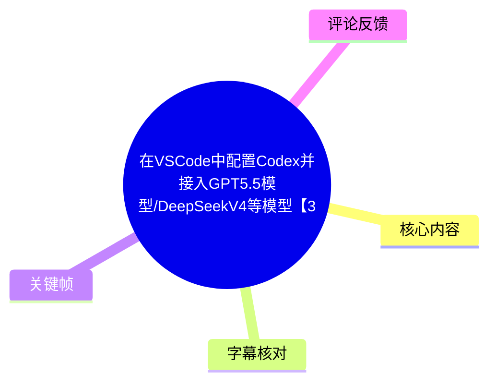
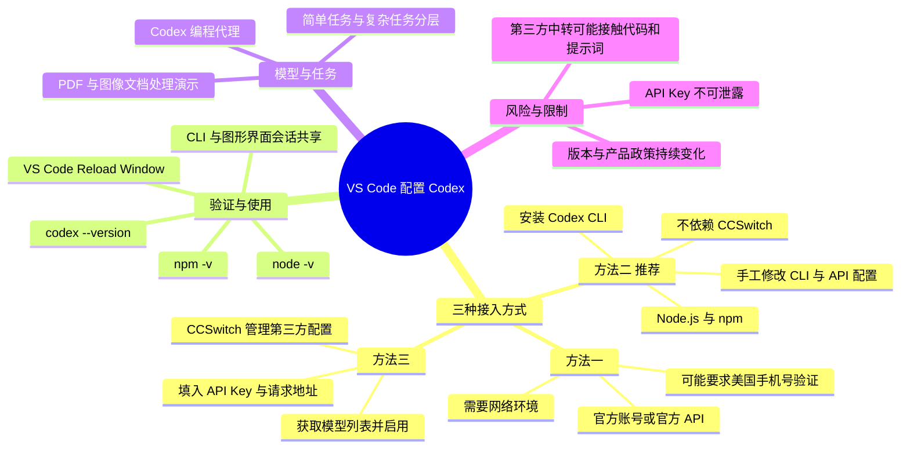
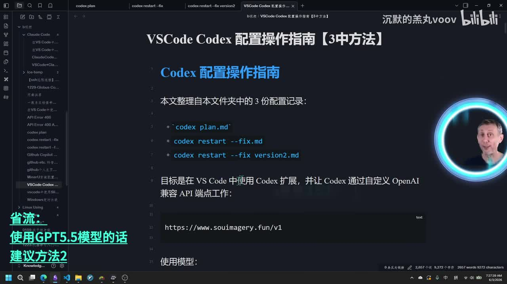
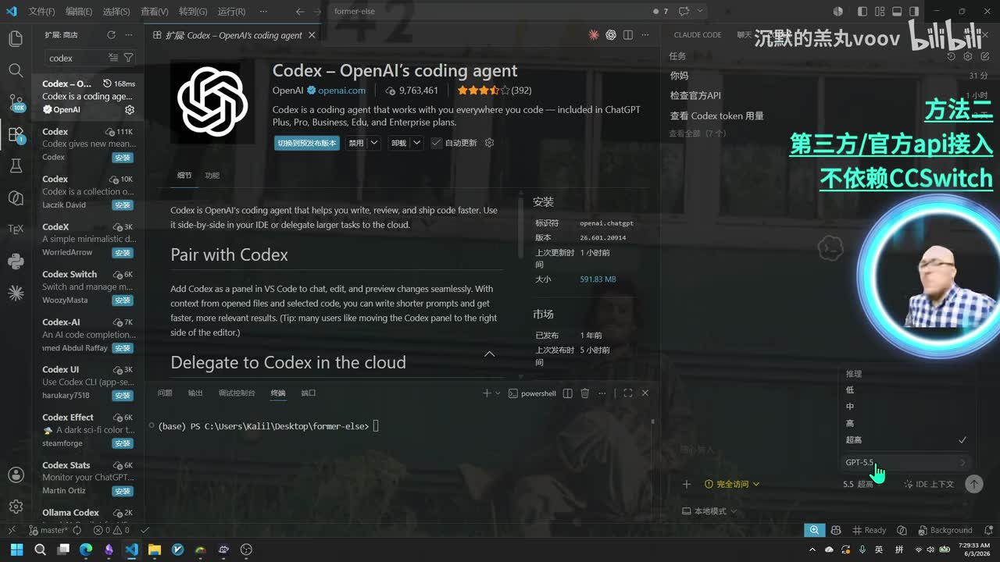
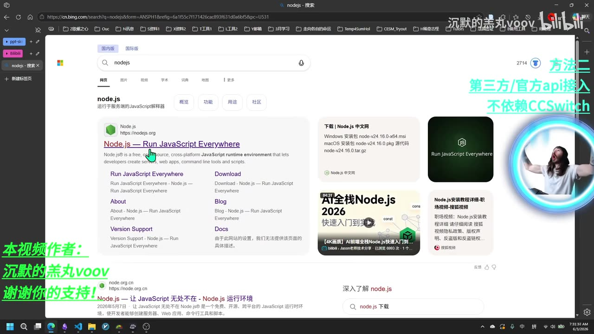
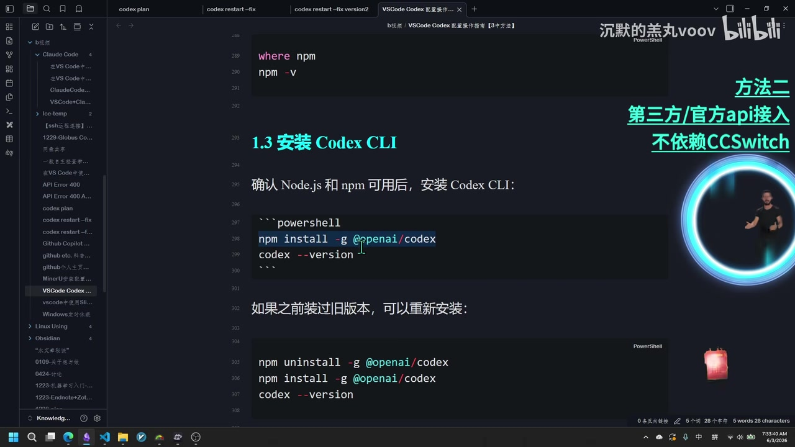

# 在 VS Code 中配置 Codex 并接入官方 / 第三方 API：三种路径整理

> 来源：[Bilibili 视频](https://www.bilibili.com/video/BV1CqV266E18)  
> UP 主：沉默的羔丸voov｜时长：26 分 46 秒｜合集：AIcode  
> 本文只整理视频中出现的配置思路、命令、风险提示与演示结果；模型能力、产品套餐、插件行为和第三方服务均可能随时间变化。

## 小结

视频讲解如何在 VS Code 中安装并使用 OpenAI 发布的 Codex 扩展，并给出了三种接入路径：**官方账号 / 官方 API 登录**、**手工修改 Codex CLI 配置以接入第三方或中转 API**、以及借助 **CCSwitch** 管理第三方 API 配置。作者个人明确推荐第二种：不额外依赖 CCSwitch，直接维护本地 CLI、配置文件和 API 凭据。

第二种方案的核心不是只安装 VS Code 扩展，而是先在本地安装并跑通 **Node.js、npm 与 Codex CLI**，再让 CLI 与 VS Code 中的 Codex 图形界面共享同一套配置与会话状态。视频中的关键安装命令为 `npm install -g @openai/codex`，并通过 `codex --version` 验证 CLI 可用。

对于第三方或中转 API，作者强调其本质风险：中转服务提供方理论上可接触请求内容，包括本地 Agent 发出的代码、提示词与返回内容。因此不应因为价格低廉而使用来源不明的服务；视频演示所用服务被作者称为学校实验室提供的平台，但这只是作者的说明，并不构成对任意中转站安全性的验证。

配置层面，视频将问题拆为两部分：**Codex CLI 的模型 / Provider / Base URL 配置**，以及 **API 鉴权配置**。鉴权信息可能位于 Codex 目录下的授权 JSON 文件，也可能通过环境变量文件提供；具体路径与字段会因 Codex 版本、操作系统及服务商实现而异，视频未完整展示所有配置文本，因此不应凭空补全。

作者还用 PDF 文档分析演示 Codex 的执行效果：要求其读取一个包含图片和文字的训练计划 PDF，并在当前文件夹创建 Markdown 总结文件。演示中结果显示新增了 133 行内容。作者据此表达了对 Codex / OpenAI 视觉能力的偏好；这属于作者的主观评价，不等同于独立基准结论。

视频发布时点的模型、产品和额度信息具有强时效性。例如视频口述了“GPT 5.5”“xHi”“Opus 4.8”“DeepSeek V4 Pro”等名称和能力判断，也提及 Copilot 额度与学生计划变化。这些说法应视为视频录制时的个人观察，实际可用模型、价格、鉴权流程、手机号限制、插件版本及 API 兼容性均需以服务商当前文档为准。

## 思维导图





## 目录

- [视频背景、适用对象与三种方案](#视频背景适用对象与三种方案)
- [方法一：官方账号或官方 API 登录](#方法一官方账号或官方-api-登录)
- [方法二：手工配置 Codex CLI 与第三方 API](#方法二手工配置-codex-cli-与第三方-api)
  - [准备 Node.js 与 npm](#准备-nodejs-与-npm)
  - [安装并验证 Codex CLI](#安装并验证-codex-cli)
  - [安装 VS Code 官方 Codex 扩展](#安装-vs-code-官方-codex-扩展)
  - [配置模型、Provider、Base URL 与 API Key](#配置模型providerbase-url-与-api-key)
  - [重载窗口与联通性验证](#重载窗口与联通性验证)
- [模型能力、视觉处理与 PDF 演示](#模型能力视觉处理与-pdf-演示)
- [故障排查、配置检查与资源限制](#故障排查配置检查与资源限制)
- [方法三：使用 CCSwitch 配置第三方服务](#方法三使用-ccswitch-配置第三方服务)
- [可迁移经验、风险与时效性](#可迁移经验风险与时效性)
- [字幕比对](#字幕比对)
- [评论分析](#评论分析)
- [处理记录](#处理记录)

## 视频背景、适用对象与三种方案 [00:00:00](https://www.bilibili.com/video/BV1CqV266E18?t=0)

视频目标是在 VS Code 中配置 Codex 插件，并接入官方 API 或第三方 API。作者在开头说明本期提供三种方法，并在后文表示个人更推荐第二种方案。

三种方法的定位如下：

| 方法 | 起始时间 | 核心思路 | 视频中说明的条件与取舍 |
| --- | ---: | --- | --- |
| 方法一 | 00:01:06 | 使用 Codex 官方账号或官方 API 登录 | 网络环境要求较高；需要官方账号；作者称可能需要美国手机号验证 |
| 方法二 | 00:03:08 | 本地安装 Codex CLI，手动配置 Provider、Base URL 和 API 鉴权 | 不依赖 CCSwitch；作者重点讲解并推荐 |
| 方法三 | 00:23:50 | 使用 CCSwitch 填写第三方服务信息并自动写入相关配置 | 更省去手动改文件的步骤，但需额外安装软件 |

作者提到，之所以提供不依赖 CCSwitch 的路径，是考虑到额外软件会增加后台进程、内存或磁盘占用。这是面向本机资源有限、希望控制配置细节的用户的取舍建议，而不是对 CCSwitch 功能或安全性的普遍否定。



> 图：画面展示了作者在 VS Code 内整理的“Codex 配置操作指南”，并列出 `codex plan.md`、`codex restart --fix.md`、`codex restart --fix version2.md` 等文件。它说明视频配套文档存在，但正文中未完整公开全部文件内容，实际操作仍应结合当前版本文档核对。

## 方法一：官方账号或官方 API 登录 [00:01:55](https://www.bilibili.com/video/BV1CqV266E18?t=115)

作者演示的第一种方式较直接：

1. 在 VS Code 扩展市场搜索 `Codex`。
2. 找到 OpenAI 发布的 Codex 扩展并安装。
3. 安装后，在扩展提示界面中选择官方登录，或输入 API Key 登录。
4. 完成登录后即可在扩展中使用可用模型。

作者同时说明了这条路径的几个门槛：

- 对网络环境有要求；
- 需要 Codex 官方账号；
- 作者建议账号具备 Plus 等权益以获得较多额度；
- 视频录制时，作者观察到登录可能要求手机号验证，并称“好像需要一个美国的手机”。

其中“Plus”“手机号验证”“美国手机号”等均为视频作者对录制时流程的陈述。鉴权规则与地区策略可能变化，应以 OpenAI / Codex 当前登录页面和官方帮助文档为准。



> 图：画面中可见扩展名为“Codex – OpenAI’s coding agent”，发布者显示为 OpenAI；右侧叠加文字标注“方法二：第三方/官方 api 接入，不依赖 CCSwitch”。该画面可帮助区分应安装的官方扩展与搜索结果中名称相近的第三方扩展。

## 方法二：手工配置 Codex CLI 与第三方 API [00:03:08](https://www.bilibili.com/video/BV1CqV266E18?t=188)

第二种方案是视频的重点。作者的逻辑链为：

1. 选择一个可信、适合自己的 API 服务；
2. 在本机安装 Codex CLI；
3. 修改 Codex CLI 的模型与服务端配置；
4. 填入 API Key 或环境变量；
5. 在 VS Code 安装官方 Codex 扩展；
6. 重载 VS Code 后，让图形界面复用 CLI 配置并进行测试。

### 第三方 API 与中转站的安全前提 [00:03:07](https://www.bilibili.com/video/BV1CqV266E18?t=187)

作者明确警告，不应随意使用“莫名其妙”、价格异常低廉或来源不清楚的中转站。视频给出的风险逻辑是：

- 本地 Agent 向模型发送命令时，请求可能包含代码、上下文和提示词；
- 中转服务在链路中可接触这些信息；
- 返回内容也可能在中间环节被改写、附加广告或额外配置；
- 用户未必能察觉中转服务实际加入了什么参数或行为。

因此，如果项目包含私有代码、密钥、业务数据、论文原稿或个人隐私，不应仅以价格判断服务可信度。更稳妥的原则是：

- 优先使用官方服务或有明确主体、隐私政策、日志策略与资质说明的服务；
- 对 API Key 设置配额、权限范围与轮换周期；
- 不将真实密钥截图、粘贴进公开对话或提交到 Git 仓库；
- 重要仓库使用最小化上下文和隔离测试环境。

作者称演示所用平台来自学校实验室，因此其个人认为“相对安全”。这一点仅是视频中的背景说明，不能外推为对其他服务或该平台当前状态的安全背书。

### 准备 Node.js 与 npm [00:04:44](https://www.bilibili.com/video/BV1CqV266E18?t=284)

作者说明，安装 Codex CLI 前需要具备 Node.js 环境，原因是后续通过 npm 包管理器安装 CLI。

视频提到三类获取 Node.js 的方式：

1. 使用 `winget` 下载；
2. 使用 PowerShell 下载官方相关内容；
3. 直接打开 Node.js 官网下载安装包。

作者个人更倾向于第三种图形化下载安装方式，理由是操作直接。完成安装后，重点不是采用哪一种下载方式，而是确认命令行可识别版本号。

可在 PowerShell 中检查：

```powershell
node -v
npm -v
```

视频还提到可以进一步查看安装位置，但没有在字幕中可靠给出具体命令文本或完整输出；因此本文不补写未展示的命令。



> 图：画面展示作者通过浏览器搜索 Node.js，并将 Node.js 官网作为下载入口。这对应“安装前置运行环境”的步骤，强调应在安装 Codex CLI 前先确认 Node.js 可用。

### 安装并验证 Codex CLI [00:06:17](https://www.bilibili.com/video/BV1CqV266E18?t=377)

在 Node.js 与 npm 已可用的前提下，视频展示了全局安装 Codex CLI 的命令：

```powershell
npm install -g @openai/codex
```

安装完成后，用以下命令确认 CLI 是否可被识别：

```powershell
codex --version
```

作者的判断标准是：如果命令能输出版本号，通常表示 CLI 已成功安装并可被系统识别。

视频中还演示了直接输入 `codex` 进入命令行交互界面，并表示 CLI 内的使用体验可与 VS Code 中的 Codex 图形界面相互对应。作者在已配置的环境中输入“你好”并询问模型信息，演示环境返回其所称的 GPT 5.5 xHi 模式结果。



> 图：画面明确显示 `npm install -g @openai/codex` 与 `codex --version`。同时，文档还展示了先执行 `npm uninstall -g @openai/codex` 再重新安装的旧版本重装思路，这对排查版本残留有参考价值。

视频中出现的旧版本重装流程如下：

```powershell
npm uninstall -g @openai/codex
npm install -g @openai/codex
codex --version
```

是否需要卸载重装，应以实际错误、当前 CLI 版本与官方迁移说明为依据；不要在没有问题时盲目删除已有可用环境。

### 安装 VS Code 官方 Codex 扩展 [00:08:26](https://www.bilibili.com/video/BV1CqV266E18?t=506)

CLI 安装完成后，作者回到 VS Code：

1. 打开扩展面板；
2. 搜索 Codex；
3. 选择 OpenAI 发布的插件；
4. 点击安装；
5. 安装后，从 VS Code 顶部或侧边的 Codex 界面进入对话。

视频演示表明，CLI 与图形界面会显示相同或可关联的聊天记录。例如，作者在 CLI 中发出的“你好，请介绍一下你的模型”，随后可以在 VS Code 的 Codex 界面看到相应历史记录。视频据此得出的结论是：两端“通用匹配”。

这里应注意，CLI 与扩展之间是否共享配置、会话、缓存或凭据，可能取决于当前 Codex 产品版本、登录方式、操作系统用户目录和工作区状态。演示结果只能说明作者当时环境中二者已联通。

### 配置模型、Provider、Base URL 与 API Key [00:09:43](https://www.bilibili.com/video/BV1CqV266E18?t=583)

作者将配置拆成两部分：

| 配置部分 | 视频中的描述 | 作用 |
| --- | --- | --- |
| Codex CLI 配置 | 模型、Model Provider、第三方网站、Base URL 等 | 指定请求应发送到哪个兼容服务以及使用哪个模型 |
| API 配置 | 授权模式、API Key；可能是授权 JSON 或环境变量文件 | 让客户端具备调用服务的鉴权凭据 |

作者表示，Codex CLI 的配置文件通常可在 C 盘相关目录中找到，但视频并未在可可靠转写的字幕中给出统一、完整、可复制的绝对路径。作者建议用户可以询问 AI 工具定位本机文件。由于不同版本和系统可能有差异，本文不将某一路径断言为通用路径。

视频口述的配置字段包含：

- 模型名称，例如作者演示环境中使用的“GPT 5.5”；
- `Model Provider`，作者示例称为 OpenAI；
- 第三方服务的网站或 API 地址；
- `Base URL`；
- 授权模式；
- API Key。

作者称 API 鉴权文件一般可能位于 Codex 目录下的某个授权 JSON 文件中，也可能以 Environment 文件形式存在。视频没有完整公开真实密钥，也没有完整展示所有字段和文件内容，这一做法符合密钥保护原则。

> **API Key 安全要求：** 视频强调不要随意分享 API Key。实际操作中，应使用环境变量、受权限保护的本地配置或密钥管理工具；避免写入仓库、提交到 Git、放入截图或发送给陌生人。

配置完成后，作者通过以下操作让 VS Code 重载：

```text
Ctrl + Shift + P
Reload Window
```

## 重载窗口与联通性验证 [00:13:08](https://www.bilibili.com/video/BV1CqV266E18?t=788)

视频中，填写 API Key 并完成扩展配置后，作者执行 `Reload Window`。重载后的验证点包括：

1. Codex 面板能够正常打开；
2. 之前 CLI 中的聊天内容可在图形界面中看到；
3. 图形界面能够返回模型介绍或执行请求；
4. `codex --version` 可用于检查 CLI 版本；
5. 启动或使用过程中如出现更新提示，可根据需要更新。

这是一套较实用的分层排查顺序：

```text
Node.js / npm 是否可用
    ↓
Codex CLI 是否安装并能输出版本
    ↓
CLI 是否能启动
    ↓
API 配置是否已写入正确位置
    ↓
VS Code 官方扩展是否安装
    ↓
Reload Window 后扩展是否可用
    ↓
发送低风险测试请求验证模型与返回内容
```

如果出现 `404 Not Found` 等问题，作者建议对照其整理的报错清单，检查“对应的位置”并修改配置。由于视频未完整展示该清单的具体条目和字段映射，不能据此断定 404 的唯一原因。常见方向通常包括请求地址、路径后缀、模型名、Provider 类型、鉴权头或兼容协议不匹配，但具体仍应以实际错误响应和服务商文档定位。

## 模型能力、视觉处理与 PDF 演示 [00:13:32](https://www.bilibili.com/video/BV1CqV266E18?t=812)

这一段包含作者对模型能力的个人评价，以及一个 PDF 文档处理演示。

### 作者的模型判断

作者认为，视频录制时 GPT 5.5 与 Claude Code 所使用的 Opus 4.8 属于第一梯队，并认为 DeepSeek 相比之下有较大差距。这是视频作者的主观看法，未提供评测集、任务定义、成本、延迟、上下文长度、版本号或可复现实验，因此不应作为客观排名结论。

作者还认为 OpenAI 模型在视觉处理和图像生成上表现突出，并将此作为推荐 Codex 用于批量读取图像、处理含图 PDF 的理由。视频中“断崖式领先”等表述同样属于个人体验判断。

### DeepSeek、MinerU 与多阶段处理的讨论 [00:14:20](https://www.bilibili.com/video/BV1CqV266E18?t=860)

作者回顾此前在 VS Code 中使用 Claude Code 接入 DeepSeek API 的经验，并称 DeepSeek 缺少视觉多模态能力，因此难以直接分析 PNG、PDF 或复杂 Word 文档。为此，作者提到使用 MinerU 作为文档视觉处理工具，将包含图文的 PDF 转为 Markdown，再交由模型处理。

作者指出，这种“文档 → 转换工具 → 模型”的多阶段链路会引入中间环节，可能造成信息损失或偏差。这个判断在工程实践上具有可迁移性：

- 原始版式、表格、图片坐标、公式、页眉页脚和扫描质量会影响文档解析；
- 每多一个格式转换或模型解释步骤，错误可能累积；
- 对高准确性任务，应保留原文核查、抽样验证和可追溯引用；
- 对隐私文档，多阶段服务还意味着更多数据处理节点。

### PDF 总结任务演示 [00:17:33](https://www.bilibili.com/video/BV1CqV266E18?t=1053)

作者让 Codex 分析一个名为“临时性三分化计划”的 PDF，并要求将总结输出为当前文件夹中的 Markdown 文件。视频口述的任务意图可整理为：

```text
读取一个 PDF 文档
→ 分析内容
→ 生成“我的近期锻炼计划.md”
→ 输出到当前文件夹
```

随后在约 00:22:47，作者展示执行结果：工具读取了 PDF，并显示新增了 **133 行**，生成一份训练计划 Markdown 文档。作者打开侧边预览，认为整理效果较好，并进一步指出该工作流可用于整理论文等文档。

演示能证明作者环境中完成了一次 PDF 到 Markdown 的任务，但不能据此保证：

- 任意 PDF 都能被正确读取；
- 所有图像、表格、公式与排版均能无损保留；
- 第三方 API 都支持同样的视觉输入；
- 输出内容一定符合原文或学术引用规范。

对于论文、合同、医疗资料、源代码设计文档等高风险内容，应额外进行人工逐段核对。

## 故障排查、配置检查与资源限制 [00:18:36](https://www.bilibili.com/video/BV1CqV266E18?t=1116)

作者提到已将多次尝试后汇总的报错解决方案、扩展配置、缓存清理、全局安装目录和注册表等内容整理到配套文档，并放在评论区置顶 / 网盘供取用。视频描述中可确认的内容包括：

- 存在针对 `404 Not Found` 的排查提示；
- 作者整理了检查清单；
- 清单适合按步骤打勾执行；
- 未完成的步骤可进一步询问 AI；
- 视频末尾展示有参考文件与相关网站地址。

但由于本次素材没有提供置顶文档正文、网盘链接或完整错误清单，本文不能补写具体修复命令、注册表字段或缓存目录。

建议按以下原则进行实际排查：

1. **先保留错误原文。** 包括 HTTP 状态码、请求时间、扩展日志、终端输出。
2. **确认安装层。** `node -v`、`npm -v`、`codex --version` 是否分别正常。
3. **确认扩展来源。** 使用 OpenAI 发布的 Codex 扩展，避免误装同名插件。
4. **确认服务层。** Base URL、模型名、API Key、授权方式是否与服务商当前文档一致。
5. **确认配置生效。** 修改配置后执行 `Reload Window`，必要时重新启动 VS Code。
6. **先做低敏感测试。** 使用“你好”“介绍模型”等测试，而非直接发送私有仓库或密钥文件。
7. **再处理缓存与重装。** 缓存清理、重装、注册表操作具有破坏性，应先备份原配置。

## 方法三：使用 CCSwitch 配置第三方服务 [00:23:50](https://www.bilibili.com/video/BV1CqV266E18?t=1430)

第三种方式通过 CCSwitch 减少手动修改文件的工作量。视频中的操作顺序为：

1. 打开 CCSwitch；
2. 点击右上角加号；
3. 选择服务来源；
4. 若选官方 OpenAI，作者称通常无需额外配置；
5. 若选第三方服务，则填写该服务提供的 API Key 与 API 请求地址；
6. 点击获取模型列表；
7. 由工具测试并列出可用模型；
8. 选择模型、添加并启用；
9. 回到 VS Code，通过命令面板执行 `Reload Window`；
10. 重载后使用 Codex。

作者以 “Lemon Data” 作为随手点击的示例，且明确说自己没有使用过列表中的服务。因此，示例服务名称不应被理解为推荐、验证或安全背书。

视频中还提到：

- 输入正确 API Key 后，CCSwitch 可以尝试获取可用模型列表；
- 可测试模型是否可用；
- 对部分服务可查询用量余额；
- 可查看延迟；
- 作者用的是随意编写的测试 API Key，因此无法实时测试模型；
- 工具会帮助写入 API Key 相关文件以及 Codex CLI 的 TOML 等配置。

最后，作者再次表示主要推荐方法二，因为其已对 JSON、TOML、Environment 等变量做过个性化修改，所以没有针对方法三进行完整的真实调用测试。

因此，方法三的边界是：

| 优点 | 局限与风险 |
| --- | --- |
| 操作集中，可自动列出模型、写入部分配置 | 需要额外安装与维护 CCSwitch |
| 对不熟悉配置文件的用户更友好 | 自动写入不等于配置一定正确，仍需验证 |
| 可辅助检查模型、额度、延迟 | 可用功能取决于服务商 API 是否支持 |
| 减少手动编辑错误 | 仍需将 API Key 交给本机工具及所选 API 服务 |

## 可迁移经验、风险与时效性 [00:25:51](https://www.bilibili.com/video/BV1CqV266E18?t=1551)

### 1. 优先明确“接入层”与“模型层”

视频的实用价值不只在于某一条命令，而在于把配置拆解为：

```text
VS Code 扩展
+ 本地 Codex CLI
+ 模型 Provider
+ API Base URL
+ 鉴权方式 / API Key
+ 重载与验证流程
```

出现问题时，不要笼统地认为“Codex 坏了”，而应定位是安装、路径、网络、模型名、接口兼容性还是鉴权问题。

### 2. 先验证 CLI，再验证 VS Code

视频采用“先本地 CLI、后 VS Code 图形界面”的路线。这样可以缩小故障范围：

- CLI 都无法运行：优先处理 Node.js、npm、全局安装路径或 Codex 安装；
- CLI 能运行但扩展不行：检查扩展、窗口重载、登录状态、配置读取位置；
- 两者都能打开但请求失败：检查 API Key、Base URL、模型名、额度与网络；
- 能返回但内容异常：检查提示词、模型能力、第三方中转可靠性与上下文输入。

### 3. 不要把 API Key 当作普通文本

视频多次强调 API Key 重要。实际应至少做到：

- 不在视频、截图、论坛、公开仓库暴露；
- 使用 `.env` 等本地文件时，加入 `.gitignore`；
- 设置调用额度上限；
- 怀疑泄露后立即删除或轮换；
- 不与不可信第三方共享；
- 不用个人主力 Key 对未知中转服务做高权限测试。

### 4. 按任务复杂度分配模型是作者的成本策略

作者在讨论 Copilot 与第三方 API 时提出一种组合思路：日常、简单任务使用成本较低的模型；复杂任务再使用更高能力模型。该思路可降低总体成本，但实际可行性取决于：

- 模型质量与任务类型；
- API 价格、并发、速率限制；
- 是否需要视觉、工具调用、长上下文或代码执行；
- 数据敏感等级；
- 团队对输出可复核性的要求。

### 5. 视频中的产品信息已具有时效性

下列信息均应视为录制时描述，不应直接当作当前事实：

- “GPT 5.5”“xHi”“Opus 4.8”“DeepSeek V4 Pro”“Memo”等模型或版本名称；
- OpenAI / Codex 的登录方式与手机号要求；
- Plus 等套餐可用额度；
- Copilot 的学生计划、Token / Model Plan 与对话额度消耗；
- VS Code 扩展界面、Codex CLI 文件位置与配置格式；
- CCSwitch 支持的服务商、模型列表、额度与延迟检测能力。

在真正部署前，应重新查阅官方文档、插件市场页面、服务商定价页、隐私条款与当前 API 参考。

## 字幕比对

| 字幕来源 | 完整性 | 专有名词 | 时间轴 | 主要问题 |
| --- | --- | --- | --- | --- |
| Bilibili 站内字幕 | 与本视频主题完全不符 | 内容为健身分化训练，未包含 Codex、VS Code、API 等视频主题术语 | 虽有 00:00:00—00:03:45 时间轴，但只覆盖约 3 分 45 秒且属于另一内容 | 明显错配，不能用于本视频事实整理或定位 |
| 本次 ASR 字幕 | 覆盖约 1508.06 秒语音，约占 1605.31 秒时长的 93.94% | 可识别 Codex、VS Code、Node.js、npm、CCSwitch、MinerU、Copilot 等；部分英文和模型名存在误识别 | 共 81 段，具有可直接使用的真实起止时间 | 存在“JUI”“JPG 5.5”“DeepSec”“TOMO”等听写误差，少量停顿和口语段不完整 |

### 最终字幕选择

最终以**本次 ASR 时间轴字幕**为主，因为其语言识别为中文，置信度为 `0.99365234375`，并且内容与视频主题、关键帧画面一致；站内字幕则被判定为错配的健身视频字幕，未用于事实与时间定位。

本次 ASR 诊断未标记 `noAudioStream=true`，且显示源视频存在音频：语音覆盖约 93.94%，首段语音位于 00:00:00.640，末段语音位于 00:26:34.070。因此不存在“源视频无音轨”的情况。

结合关键帧、视频标题和上下文，对 ASR 中的重要术语作如下保守校正：

| ASR 转写 | 本文采用写法 | 校正依据 |
| --- | --- | --- |
| redcode / Vesco / WestCode | VS Code | 视频标题、扩展界面关键帧、上下文一致 |
| JUI | GUI / 图形界面 | 上下文指 CLI 与 VS Code 图形界面的对应关系 |
| JPG 5.5 / JPT5.5 | GPT 5.5 | 视频标题与多处上下文；是否为正式现行模型名仍需以官方资料核验 |
| DeepSec | DeepSeek | 视频标题与上下文中的 DeepSeek V4 |
| TOMO 文件 | TOML 文件 | 关键帧和配置语境指向 TOML |
| Scale | Skill | 上下文为安装扩展能力或工具；该词仍存在 ASR 不确定性 |
| Image2Image 2 | 原样保留为作者口述的名称描述 | 无法仅凭当前素材确认具体正式产品名，未将其扩展为确证事实 |

## 评论分析

本次仅获取到 2 条热评，未达到“热评前三条”的数量，因此只分析可获取内容，不补造第三条。

1. **Bili花桑｜57 赞｜“？？？”**  
   - 观点：没有提供可解析的技术观点、补充步骤或具体质疑。  
   - 价值：只能反映该评论者对视频某处内容感到困惑、惊讶或不解，无法据此推断对教程有效性、模型能力或配置步骤的评价。  
   - 可信度：不包含可验证信息，不作为事实依据。

2. **沉默的羔丸voov｜16 赞｜“\\😭/鲸震恩我不是故意放弃你的，谁叫GPT 5.5的视觉功能太强了呢，想让我回来就快快把视觉多模态做好吧”**  
   - 观点：UP 主再次表达了对 GPT 5.5 视觉能力的偏好，并以此解释自己对另一工具或模型的取舍。  
   - 补充信息：与正文中作者对视觉多模态、PDF 和图像处理的偏好一致。  
   - 限制：评论没有说明“鲸震恩”具体指向、视觉任务样本、比较标准或测试条件；因此只能作为作者立场补充，不能证明不同模型间存在确定能力排名。

## 处理记录

- Worker ID：`worker-mrj0wbly-5dc4e50c`
- 调用模型：`gpt-5.6-terra`
- 素材与工具产物：视频元数据、ASR 结果与 SRT 时间轴、站内 SRT、关键帧目录、热评 JSON；未使用未提供的外部网页内容补全事实。
- 字幕选择：检查了站内字幕与本次 ASR。站内字幕内容为健身训练且与本视频错配，弃用；采用本次 ASR 的真实分段时间作为章节时间轴依据，并结合视频标题、关键帧和上下文校正明显术语误识别。
- ASR 音频判断：ASR 结果显示存在音频，语音覆盖率约 `93.94%`；未出现 `noAudioStream=true` 标记。
- 关键帧选择依据：
  - `frames/frame-001.jpg`：展示配置指南及配套文档线索；
  - `frames/frame-002.jpg`：展示 VS Code 中 OpenAI 发布的 Codex 扩展；
  - `frames/frame-003.jpg`：展示 Node.js 安装入口；
  - `frames/frame-004.jpg`：展示 Codex CLI 的安装、卸载重装与版本验证命令。
- 热评处理：仅分析实际获取到的 2 条热评；未编造不存在的第 3 条。
- 缓存清理：本次为素材整理任务，未执行本地 Node/npm/Codex/VS Code 缓存清理；视频中虽提及其配套文档包含缓存清理内容，但素材未提供具体命令，未予补写。
- 未解决问题：
  - 视频未提供完整、可验证的 Codex 配置文件路径与字段全文；
  - 未提供配套网盘文档、置顶评论链接及完整错误清单；
  - 模型名称、套餐、额度、手机号验证、第三方平台可用性均可能已变化；
  - ASR 对少数英文术语与模型名存在不确定性，已在正文中避免将其未经验证地扩展为确定事实。
