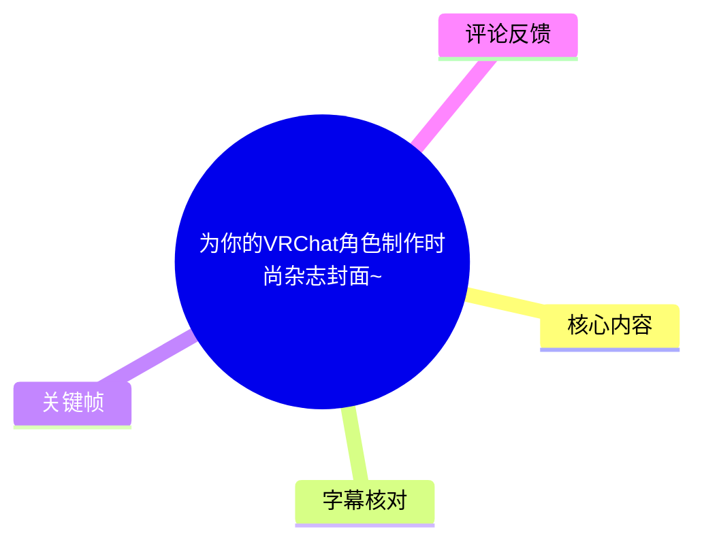
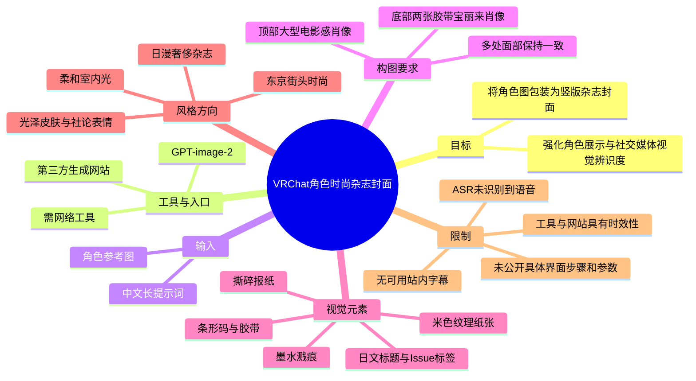
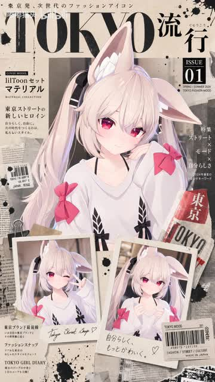
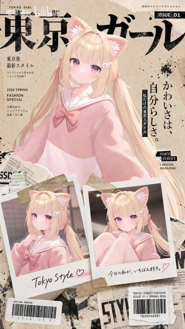

# 为你的VRChat角色制作时尚杂志封面~

> 来源：[Bilibili 视频](https://www.bilibili.com/video/BV1TZEj6VEF3)<br>
> UP 主：嘟嘟猫头｜发布时间：2026-06-09｜视频时长：1 分 41 秒｜分区/标签：VR、可爱、VRChat、AI生成

## 小结

本视频展示了一个面向 VRChat 角色形象包装的 AI 生图思路：以角色参考图作为身份依据，使用 **GPT-image-2** 生成带有日系时尚杂志排版感的竖版封面。视频描述提供了完整的中文提示词，以及一个需网络环境访问的生成网站链接。

该方法的核心不只是生成单张角色肖像，而是要求模型同时组织一张“大型电影感主肖像”和两张以胶带固定的宝丽来小肖像，并让三处脸部保持一致；同时叠加米色纸张、报纸撕页、条形码、墨水飞溅、日文标题等平面设计元素，形成“东京街头时尚 / 日漫奢侈杂志”的成品风格。

关键画面显示，成品采用竖向杂志封面构图：上方为醒目的大字号标题与期号信息，中部是角色主视觉，下方放置两张拍立得风格照片，并以胶带、剪报、票据和条码等素材强化拼贴感。画面案例包括兔耳角色与猫耳角色，说明此提示词可用于不同外观的二次元角色形象。

需要注意的是：站内未提供可用字幕，本次 ASR 也未识别出任何语音片段。因此，本文关于操作方式、工具名与提示词的事实依据主要来自视频元数据描述、关键帧画面和素材清单，而不是对白转写；无法据此还原视频内每个界面点击位置、具体生成耗时、模型参数或作者口述的额外技巧。

视频发布于 2026 年 6 月，所提及的 GPT-image-2、第三方网站入口及其可用性、功能、额度、隐私政策均可能随时间变化。将 VRChat 角色参考图上传至第三方服务前，应自行确认角色资产授权、肖像/版权边界与平台数据政策。

## 思维导图





## 目录

- [视频定位与证据范围](#视频定位与证据范围)
- [成品画面：杂志封面的构图语言](#成品画面杂志封面的构图语言)
- [核心提示词与参数性要求](#核心提示词与参数性要求)
- [复现流程：从角色参考图到封面](#复现流程从角色参考图到封面)
- [适用条件、限制与时效性](#适用条件限制与时效性)
- [字幕比对](#字幕比对)
- [评论分析](#评论分析)
- [处理记录](#处理记录)

## 视频定位与证据范围 [00:00](https://www.bilibili.com/video/BV1TZEj6VEF3?t=0)

视频标题为“为你的VRChat角色制作时尚杂志封面~”，时长 101 秒，定位是以 AI 生成方式为 VRChat 角色制作时尚杂志风格视觉海报/封面。UP 主在描述中明确写明：

- 使用的模型/能力名称：`GPT-image-2`；
- 生成入口：`http://labnana.com?aff=3992547558684dfb`；
- 使用条件提示：“需网络工具”；
- 描述中附有一段可按个人需求修改的中文提示词。

由于没有可用的站内字幕，ASR 输出也为空，无法以实际字幕分段为依据，确定诸如“导入参考图”“输入提示词”“点击生成”等操作分别发生在哪一秒。除本节标注的视频起点外，后续章节不虚构时间轴位置；内容按元数据与画面证据归纳，而非将文字顺序误作视频时间顺序。

## 成品画面：杂志封面的构图语言

### 主封面案例：兔耳角色与拼贴式东京杂志风



> 图：该关键帧展示以兔耳二次元角色为主视觉的杂志封面成品。画面同时出现主肖像、两张下方宝丽来照片、大号“Tokyo”式标题、期号标签、报纸拼贴与黑色墨迹，直接对应提示词中的构图与材质要求，适合用于理解最终交付形态。

从画面可辨认的设计结构包括：

1. **纵向移动端封面比例**  
   成品为窄而高的竖版版式，适合在手机端以封面、动态配图或角色展示卡形式传播。视频元数据中的画面尺寸为 `1512 × 2688`，属于竖屏画幅。

2. **中心主角色肖像**  
   角色位于版面中央，主体占据明显视觉面积。角色具有浅色长发、兔耳、粉色眼睛与粉色蝴蝶结等外观特征；这些是该案例角色本身的造型，不应理解为提示词强制要求。

3. **底部双拍立得照片**  
   封面底部叠放两张白边宝丽来风格照片，并以半透明/纸质胶带模拟固定效果。两张照片中的角色与主肖像保持相近的脸部与发型特征，体现了提示词对“所有图像中的面部保持一致”的约束目标。

4. **杂志化平面元素**  
   可见大号拉丁字标题、日文文本区、`ISSUE 01` 标签、条码样式区域、剪报纸张、票据式小标签及黑色喷溅痕迹。这些元素让画面不只是“角色照片拼贴”，而是具有编辑设计感的模拟杂志封面。

5. **克制的配色关系**  
   背景以偏米色、灰黑色纸材纹理为主，角色服装与眼睛的粉色作为主要点缀色。这种“低饱和纸面 + 角色高辨识度色彩”的组合，有利于将人物从复杂拼贴背景中分离出来。

### 第二种角色适配示例：猫耳角色



> 图：该关键帧展示同类版式应用到猫耳、金发、粉色服装的另一角色。它的价值在于说明：视频呈现的并非只适合某一位兔耳角色的固定模板，而是可在保留“主肖像 + 双拍立得 + 拼贴背景”结构的前提下替换角色参考形象。

第二个案例保留了相同的核心方法，但替换了角色视觉资产：

- 主体为猫耳、金发、粉色眼睛的角色；
- 主视觉服装为粉色系，与米色背景形成柔和的低对比配色；
- 下方仍使用两张小型角色照片，维持“封面主肖像 + 照片记录”的叙事；
- 标题、期号、剪报、黑色墨迹、胶带和条码仍然存在，说明这些是可迁移的版式语言；
- 画面中的日文标题和英文小字主要承担视觉排版功能。除可见的 `ISSUE 01`、`TOKYO` 等字符外，不宜将生成图片中的小字号文字视为可靠、可校对的真实杂志信息。

## 核心提示词与参数性要求

视频描述将下面内容称为“焚决”，结合上下文可判断其用途是生成提示词；原文中的该词按素材保留，不额外纠正为其他名称。提示词如下：

```text
创建8K超电影感高级日本时尚封面，使用参考图像作为准确身份。顶部为大型电影感肖像，底部为两张胶带粘贴的宝丽来肖像，所有图像中的面部保持一致。米色纹理纸张背景，黑色墨水溅痕，撕碎的报纸，条形码贴纸，胶带，杂志叠加层，东京街头时尚美学，柔和的室内光线，光泽的皮肤，社论表情。粗体日文标题，Issue 01标签，日漫奢侈杂志品质。
```

可将其拆解为以下可复用的控制层：

| 控制层 | 提示词中的要求 | 对结果的作用 | 证据状态 |
| --- | --- | --- | --- |
| 清晰度与质感 | `8K`、`超电影感`、`高级` | 指向高细节、摄影感和精致材质表达 | 来自视频描述；不代表必然输出原生 8K 文件 |
| 身份保持 | “使用参考图像作为准确身份” | 要求模型以角色参考图为外观依据 | 来自视频描述 |
| 多图一致性 | “所有图像中的面部保持一致” | 约束主肖像与两张宝丽来照片之间的身份一致性 | 来自视频描述与关键帧案例 |
| 主体构图 | 顶部大型电影感肖像 | 建立封面的主视觉重心 | 来自视频描述 |
| 辅助构图 | 底部两张胶带粘贴的宝丽来肖像 | 增加角色动作/表情信息与拼贴层次 | 来自视频描述与关键帧案例 |
| 背景材质 | 米色纹理纸张、撕碎报纸、杂志叠加层 | 建立纸本、剪贴与旧刊物质感 | 来自视频描述与关键帧案例 |
| 装饰元素 | 黑色墨水溅痕、条形码贴纸、胶带 | 丰富版面并突出街头拼贴感 | 来自视频描述与关键帧案例 |
| 光线与人物表现 | 柔和室内光线、光泽皮肤、社论表情 | 决定人像的摄影与时尚编辑感 | 来自视频描述 |
| 字体/版头 | 粗体日文标题、`Issue 01` 标签 | 赋予作品杂志封面识别度 | 来自视频描述与关键帧案例 |
| 风格锚点 | 东京街头时尚美学、日漫奢侈杂志品质 | 将平面设计方向聚焦到日系潮流与二次元融合 | 来自视频描述 |

### 应如何理解“8K”

“8K”是提示词中的质量诉求，而非素材中已验证的输出分辨率参数。视频元数据只明确给出了原视频画幅 `1512 × 2688`，没有提供：

- AI 成图的原始像素尺寸；
- 是否确实以 8K 分辨率导出；
- 平台是否支持原生 8K；
- 是否使用后期放大；
- 图像生成轮数、种子、采样参数或固定角色一致性功能。

因此，复现时可保留“8K”作为风格/清晰度关键词，但不应承诺生成服务一定输出可用于印刷的 8K 文件。

## 复现流程：从角色参考图到封面

以下流程依据视频描述的工具说明、完整提示词和关键帧成品归纳。涉及平台界面、按钮名称、上传数量和生成参数的部分，素材未提供直接证据，因此不作虚构补充。

### 1. 准备角色参考图

准备一张能清楚呈现 VRChat 角色外观的参考图，建议优先保证以下信息可见：

- 脸部轮廓与五官；
- 发型、发色、瞳色；
- 兽耳、角、饰品等高度识别性特征；
- 常用服装或角色代表性配色。

这是因为提示词明确提出“使用参考图像作为准确身份”，且最终封面中同一角色要在主肖像与两张小照片中保持一致。参考图本身越清晰、角色特征越稳定，越有利于模型理解目标身份。

### 2. 进入生成服务并上传参考图

视频描述给出的生成网站为：

<http://labnana.com?aff=3992547558684dfb>

描述中同时标注“需网络工具”。这只能说明作者提供的入口依赖联网访问；素材没有说明该网站是否必须登录、是否收费、是否需要 API、是否支持区域访问，也没有提供其当前状态。

上传角色图时，应确认所使用服务支持“参考图像”或“图像输入”。如果服务没有身份参考能力，仅输入文字提示词，通常难以稳定复现特定 VRChat 角色的脸部与服装特征——这是由提示词要求和多图一致性目标推得的实践风险，不是视频中已公开的功能说明。

### 3. 输入完整提示词

将描述中的提示词作为基线。若只需要替换角色而不改变版式，优先保留以下结构性语句：

```text
使用参考图像作为准确身份
顶部为大型电影感肖像
底部为两张胶带粘贴的宝丽来肖像
所有图像中的面部保持一致
```

这些语句负责定义“谁是主角”以及“一张图内有哪些人物视图”。而下列部分主要负责风格：

```text
米色纹理纸张背景
黑色墨水溅痕
撕碎的报纸
条形码贴纸
胶带
杂志叠加层
东京街头时尚美学
柔和的室内光线
光泽的皮肤
社论表情
粗体日文标题
Issue 01标签
日漫奢侈杂志品质
```

若想按个人需求修改，较稳妥的方式是替换局部，而不是删除整个构图骨架。例如：

- 想改主题城市：替换“东京街头时尚美学”，但保留杂志、拼贴与主/副肖像结构。
- 想换颜色：补充角色主题色或背景色，但避免与“米色纹理纸张”产生互相冲突的要求。
- 想改变服装：增加服装描述，同时保留“使用参考图像作为准确身份”，以降低角色辨识度漂移。
- 想更少文字：可弱化“粗体日文标题”，但生成图中的细小文字仍可能出现不可读、错字或无意义字符。

### 4. 检查成图是否满足四项核心验收标准

依据关键帧，建议至少检查：

1. **角色一致性**：主肖像和两张拍立得小图是否属于同一角色，耳朵、瞳色、发型和服装是否明显漂移。
2. **构图完整性**：是否同时存在一个大主肖像和两张底部小肖像，而非只生成普通单人海报。
3. **杂志元素可辨性**：是否有标题、期号、剪报/纸张、胶带、条码或类似视觉层，且没有遮挡角色脸部。
4. **风格协调性**：角色是否在米色纸张与黑色拼贴元素中保持清晰；人物亮度、皮肤质感和纸面背景是否协调。

### 5. 对文字与品牌元素进行后期审查

关键帧表明成图包含大量日文与英文字样、期号标签及条码式图形。AI 生成图中的排版文字可能仅具装饰性质，因此应在发布前检查：

- 日文、英文是否确实可读；
- 是否误生成不适宜或无意义文本；
- 是否出现真实品牌、刊物名称或商标近似元素；
- 条码、价格、票据编号是否会造成误导；
- 若用于商业发布，是否需要在图中明确“AI生成”或自制刊物属性。

视频素材没有展示后期修图步骤，也未说明商业使用授权；上述审查属于根据成品视觉特征提出的发布前风险控制建议。

## 适用条件、限制与时效性

### 适用场景

该方法尤其适合：

- 为 VRChat 角色制作角色介绍图、头像延展图或社交媒体封面；
- 为二次元虚拟形象建立统一的“时尚编辑”视觉主题；
- 快速制作带有角色主视觉、角色表情小图和叙事性拼贴素材的单页海报；
- 想以参考图维持既有角色身份，而不是从零设计新人物的创作者。

### 已知限制

1. **无语音可验证的操作细节**  
   站内没有可用字幕，本次 ASR 也没有识别出语音分段。本文无法确认视频内是否演示了具体界面、是否展示过失败案例，或是否口述了额外参数。

2. **多图脸部一致性并非绝对保证**  
   提示词明确要求所有照片的面部保持一致，关键帧也显示出相对一致的成品方向；但素材未提供生成模型的身份锁定机制、重绘流程或多轮筛选策略。不同服务和不同批次可能发生脸部、手部、服装或配饰漂移。

3. **生成文字不可直接当作正确排版**  
   封面大量依赖日文标题、英文小字、条码和标签。即使整体视觉效果合格，细小文本仍应人工检查或后期替换。

4. **第三方入口存在变化风险**  
   描述中的网站链接为作者提供的外部入口，可能发生域名变更、服务下线、登录要求调整、计费变化或地区限制。本文不对其安全性、可用性、价格或模型实际部署状态作保证。

5. **资产与隐私边界需自行确认**  
   VRChat 角色模型、角色立绘、委托图及参考照片可能受作者协议或版权约束。上传前应确认拥有可用于 AI 服务处理和发布的权限。

### 时效性说明

- 视频元数据显示发布时间为 **2026-06-09**。
- `GPT-image-2`、外部网站入口和模型可用能力均属于可能变化的信息。
- 视频描述未记录版本号、费用、额度、账户条件和输出设置；在后续时间点复现时，应以实际服务页面的最新说明为准。

## 字幕比对

| 字幕来源 | 完整性 | 专有名词 | 时间轴 | 主要问题 |
| --- | --- | --- | --- | --- |
| Bilibili 站内字幕 | 未提供可用字幕 | 无法核对 | 无可用分段 | 无法作为内容或时间轴依据 |
| 本次 ASR 字幕 | 为空，识别到 0 个语音片段 | 未能转写 `GPT-image-2`、VRChat 等词 | 无时间戳分段可用 | 诊断显示无语音识别结果；语言自动判断为英语、置信度 0.541，但没有任何有效文本 |

本次 ASR 已实际检查。ASR 诊断信息显示：

- 音频时长约 `100.008` 秒；
- 识别语言自动判断为英语，置信度 `0.541015625`；
- 语句数 `0`；
- 语音时长 `0` 秒；
- 语音覆盖率 `0`；
- 未生成任何分段。

ASR 结果中**未标记** `noAudioStream=true`：素材清单中存在 `audio/audio.wav`，因此不能将本视频表述为“源视频没有音轨”。更准确的表述是：本次抽取到音频文件，但 ASR 未识别到可转写的语音内容；这可能与视频无口述、语音极弱、音乐/环境声为主或识别条件有关，素材不足以进一步判定。

最终内容依据选择如下：

1. **工具名、网站和提示词**：采用视频描述中的明确文本；
2. **封面构图、角色示例与视觉元素**：采用关键帧多模态画面；
3. **视频时长、发布时间、分辨率、互动数据**：采用视频元数据；
4. **逐秒教程步骤、口述经验、界面操作**：因无有效字幕和 ASR 文本，不作补写。

通过关键帧可校正/确认的关键概念包括：竖版杂志封面、主肖像、两张宝丽来照片、胶带、米色纸张、黑色墨迹、报纸拼贴、条码样式标签与 `ISSUE 01` 视觉标签。`GPT-image-2` 和生成网站地址则来自视频描述，画面本身未提供足以独立核验其拼写的文字证据。

## 评论分析

仅获取到热评前三条，均为简短正向反馈，未提供操作补充、模型参数、网站可用性或版权信息，不能作为方法有效性的额外证据。

| 排名 | 用户 | 点赞 | 评论内容 | 可得观点与可信度 |
| --- | --- | ---: | --- | --- |
| 1 | 琪露诺coffeicial | 3 | “好看” | 对最终视觉效果持正面态度；未提供可复现信息或具体评价维度。 |
| 2 | 夏羽綾理 | 2 | “不错～” | 肯定成品观感；没有涉及工具、提示词效果或角色一致性问题。 |
| 3 | rrtech05 | 1 | “:)” | 表达轻度友好/正向互动；信息量很低，不能据此推导技术结论。 |

评论区未出现对模型版本、网站安全性、收费方式、提示词修改方式或 VRChat 资产授权的可验证补充，也未出现争议性观点。现有互动只能说明部分观众对成品视觉表现有积极反馈。

## 处理记录

- Worker ID：`worker-mrj0wbly-5dc4e50c`
- 整理模型：`gpt-5.6-terra`
- 已用素材/工具结果：视频元数据、视频描述、关键帧列表、音频 ASR 诊断与输出、热评前三条。
- ASR 模型与配置：`medium`，CUDA，`float16`，自动语言识别；结果为 0 个语音分段。
- 字幕选择：站内字幕未提供可用内容；本次 ASR 已检查但输出为空。最终以视频描述、关键帧和元数据作为事实依据，不以虚构字幕补足。
- 时间轴处理：无站内 SRT、无有效 ASR 时间戳分段；仅“视频定位与证据范围”使用可确认的视频起点 `00:00`。其余章节未根据文字顺序猜测对应秒数。
- 关键帧选择依据：`frames/frame-001.jpg` 用于展示兔耳角色的主案例与完整杂志拼贴结构；`frames/frame-004.jpg` 用于展示猫耳角色案例，以验证该版式可迁移至不同角色外观。两帧均能直观呈现主肖像、双宝丽来照片、胶带、纸张、标题及期号等核心元素。
- 缓存清理：提供的素材中未包含缓存清理执行记录；本文不虚构已清理结果。
- 未解决问题：无法从现有素材确认视频内具体网页操作、生成轮次、模型参数、原始成图分辨率、服务费用/可用性，以及视频音频中是否存在难以识别的非语音内容。
