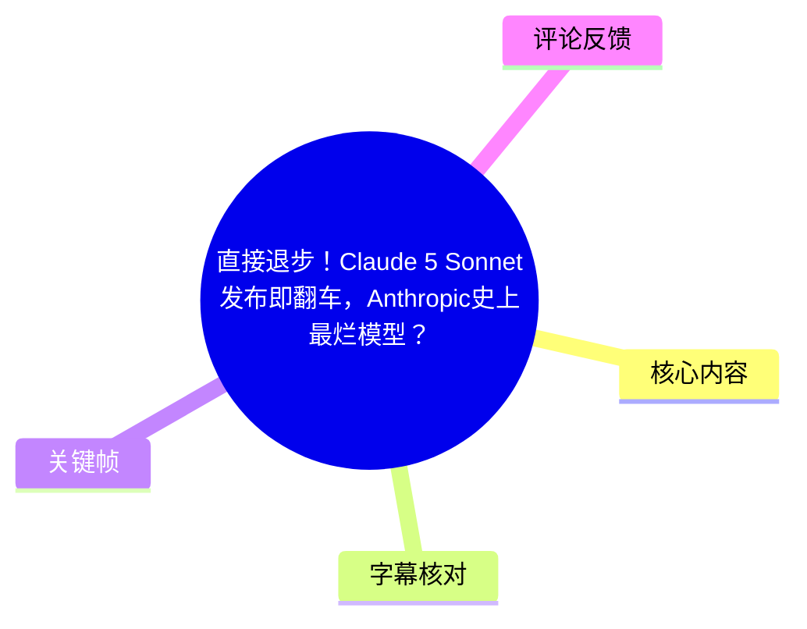
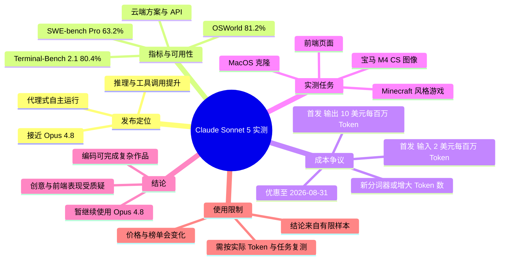
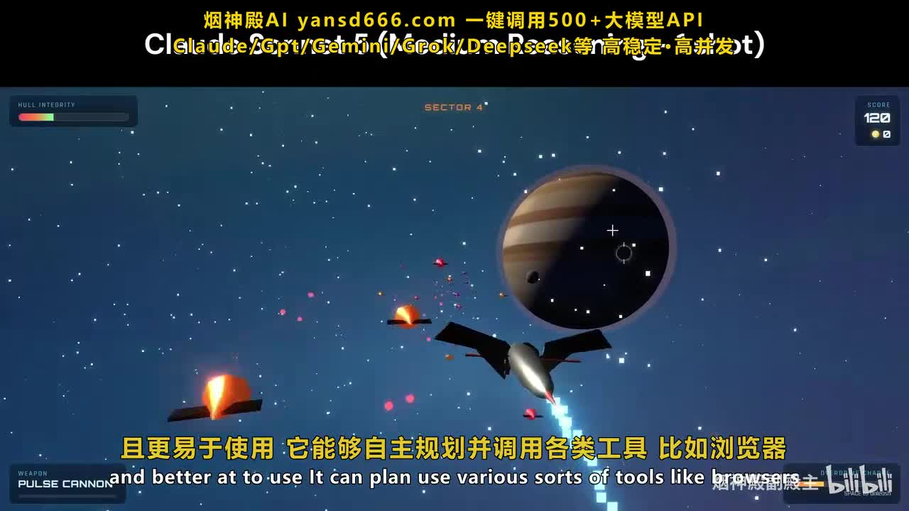
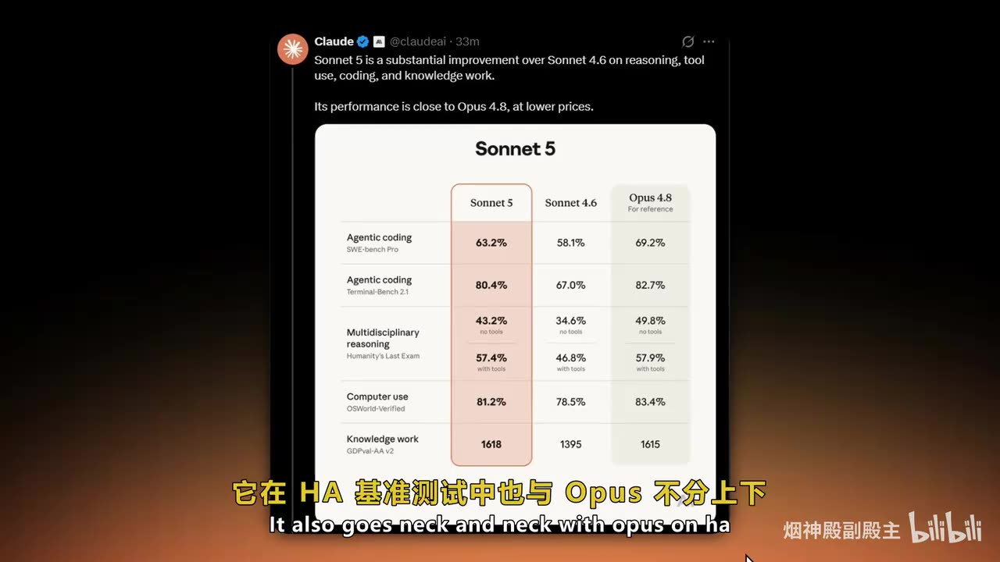
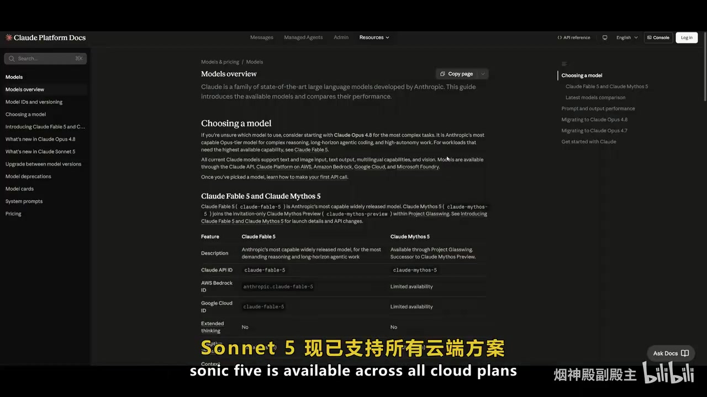
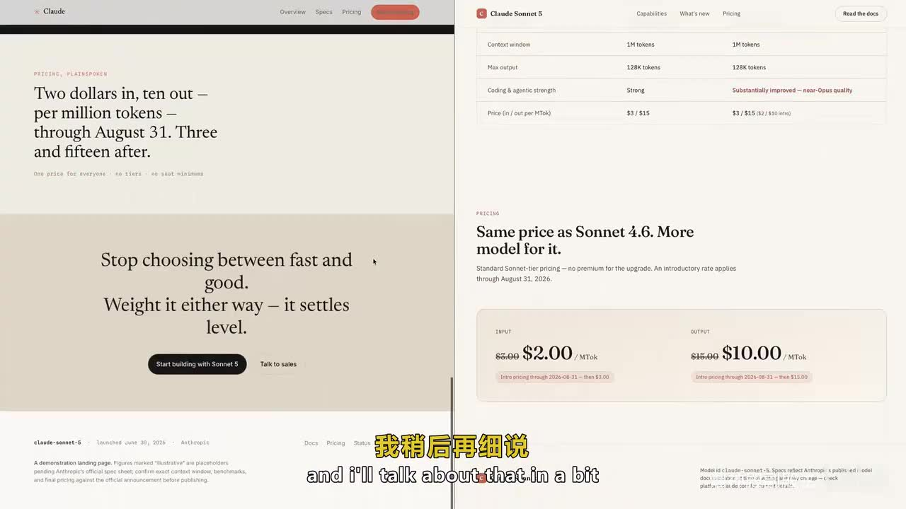

# 直接退步！Claude 5 Sonnet发布即翻车，Anthropic史上最烂模型？全方位实测

> 来源：[Bilibili 视频](https://www.bilibili.com/video/BV1ubT86nEE3)<br>
> UP 主：烟神殿副殿主｜分 P：中文配音、双语字幕（各 12 分 14 秒）｜素材总时长：24 分 28 秒<br>
> 视频性质：AI 技术搬运翻译；原视频链接见视频简介。本文以实际提取的 ASR、关键帧和元数据为依据整理。

## 小结

视频围绕 **Claude Sonnet 5** 的发布宣传、定价与实测表现展开。视频转述的官方定位是：该模型在逻辑推理、工具调用、代理式编码和通用知识工作上较 Sonnet 4.6 提升，并以较低价格接近 Opus 4.8；它支持自主规划、调用浏览器等工具，面向日常 AI 与编程任务。

作者的核心质疑不在于 Sonnet 5 “完全不能用”，而在于其**性价比叙事可能被新的分词器改变**：首发标称输入价格为每百万 Token 2 美元、输出价格为每百万 Token 10 美元，但视频称新分词器会令相同文本产生约 1.3 倍 Token。若该观察在实际工作负载中成立，表面单价下降未必等于总账单下降，且 Sonnet 相比 Opus 的价格优势会被压缩。

实测部分覆盖了 MacOS 克隆、Minecraft 风格网页游戏、前端页面、SVG/图像创作等任务。视频认为，Sonnet 5 在较复杂的代理式编码中能完成可运行的 MacOS 风格应用和 FPS 小游戏，但耗时约 40 分钟且消耗大量 Token；Minecraft 测试仅达到基础可玩状态；前端与图像/SVG 相关结果则被评价为明显不如预期。

视频最终给出明显主观的购买建议：在其观察到的价格、Token 消耗和生成质量条件下，暂不建议从 Opus 4.8 切换到 Sonnet 5。需要注意，这一结论是原视频作者基于有限任务与当时模型版本得出的判断，不等同于跨场景、可重复的独立基准结论。

本视频具有很强时效性：价格优惠截至视频所述的 **2026 年 8 月 31 日**，模型版本、云端可用性、排行榜成绩、模型路由策略和实际 Token 计费都可能随后调整。阅读时应将其中的数字视为视频发布时点的陈述，并以 Anthropic 当前文档、控制台价格页和自己的真实调用日志复核。

## 思维导图





## 目录

- [发布背景、定位与基准成绩](#发布背景定位与基准成绩)
- [价格、分词器与性价比争议](#价格分词器与性价比争议)
- [实测一：MacOS 克隆与代理式编码](#实测一macos-克隆与代理式编码)
- [实测二：Minecraft 风格游戏](#实测二minecraft-风格游戏)
- [实测三：前端、SVG 与图像生成](#实测三前端svg-与图像生成)
- [视频结论、适用建议与限制](#视频结论适用建议与限制)
- [复现实测的步骤与记录参数](#复现实测的步骤与记录参数)
- [字幕比对](#字幕比对)
- [评论分析](#评论分析)
- [处理记录](#处理记录)

## 发布背景、定位与基准成绩

### [00:00](https://www.bilibili.com/video/BV1ubT86nEE3?t=0) 发布主张：更强代理能力、面向日常主力任务

视频开场将 Sonnet 5 描述为 Anthropic 的重磅更新，主张包括：

1. **幻觉更少**；
2. **代理（Agent）能力更强**；
3. 模型可以自主规划并调用多类工具，例如浏览器；
4. 在逻辑推理、工具调用、代码编写、通用知识工作方面，较 Sonnet 4.6 有提升；
5. 在成本更低的前提下，能力接近 Opus 4.8。

这里需要区分两层信息：

- “更少幻觉”“更强”“接近 Opus 4.8”是视频转述的产品/官方性能主张；
- 是否能稳定获得这些收益，仍取决于任务类型、工具环境、提示词、上下文长度、采样参数与后续模型更新，不能只凭宣传语推导为普遍结论。



> 图：关键帧以运行中的游戏画面配合“能够自主规划并调用各类工具，例如浏览器”的字幕，直观对应视频对代理能力的介绍。它有助于理解本视频讨论的并不只是聊天回答质量，还包括模型完成多步骤、可执行任务的能力。

### [01:02](https://www.bilibili.com/video/BV1ubT86nEE3?t=62) 视频列举的基准测试成绩

视频展示并转述了一组 Sonnet 5、Sonnet 4.6 与 Opus 4.8 的对比数据。画面中的具体数值如下：

| 评测项目 | Sonnet 5 | Sonnet 4.6 | Opus 4.8（参考） | 视频中的含义 |
| --- | ---: | ---: | ---: | --- |
| SWE-bench Pro，Agentic coding | 63.2% | 58.1% | 69.2% | 代理式软件工程/编码任务 |
| Terminal-Bench 2.1，Agentic coding | 80.4% | 67.0% | 82.7% | 终端环境中的代理式编码任务 |
| Humanity’s Last Exam，无工具 | 43.2% | 34.6% | 49.8% | 多学科推理 |
| Humanity’s Last Exam，使用工具 | 57.4% | 46.8% | 57.9% | 工具辅助多学科推理 |
| OSWorld-Verified，Computer use | 81.2% | 78.5% | 83.4% | 计算机使用能力 |
| GDPval-AA v2，Knowledge work | 1618 | 1395 | 1615 | 知识工作评分 |

ASR 中对部分名称存在识别错误，例如将 Sonnet、SWE-bench、OSWorld 等识别为近音词；表格以关键帧中可见英文为准。视频口述还提到 Chatbot Arena 约 **1619 分**、模型榜单排名第五，但该口述与画面中 GDPval-AA v2 的 **1618** 并非同一评分体系，不能混为一个指标。



> 图：画面展示多个基准项目的并列数值，是理解视频“基准很漂亮，但实用性仍值得质疑”这一叙事转折的核心证据。表中 Sonnet 5 整体高于 Sonnet 4.6，但多数项目仍略低于 Opus 4.8。

### [02:01](https://www.bilibili.com/video/BV1ubT86nEE3?t=121) 可用性与默认模型说法

视频称 Sonnet 5 已支持各类云端方案，并提到免费用户默认模型、Pro 用户、API 和聊天产品中的使用途径。关键帧展示的文档页则可见“Choosing a model”及模型可用性相关内容。

由于这类信息随账户地区、订阅层级、云服务商、产品灰度发布与模型退役策略变化很快，实际使用前应核对：

- Anthropic Console 中的模型 ID、地区与账户权限；
- API 文档中是否仍列出目标模型；
- AWS Bedrock、Google Cloud 等第三方云平台的区域可用性；
- 免费版、Pro/Max 或团队/企业方案中实际可选模型；
- 是否有默认路由、请求限额、上下文窗口或工具调用限制。



> 图：文档画面用于说明模型并非只通过单一网页入口使用，而涉及 API、云平台和产品方案。它也提醒读者：视频中的“已支持所有云端方案”属于时点性陈述，应以当前文档为准。

## 价格、分词器与性价比争议

### [02:35](https://www.bilibili.com/video/BV1ubT86nEE3?t=155) 首发价格与优惠期限

视频展示的定价页面写明：

| 项目 | 视频展示的首发价格 | 视频展示的后续价格/说明 |
| --- | ---: | --- |
| 输入 | 2 美元 / 百万 Token | 2026-08-31 后为 3 美元 / 百万 Token |
| 输出 | 10 美元 / 百万 Token | 视频画面未清晰呈现后续输出价，仅应以实际价目表核验 |
| 优惠期 | 至 2026-08-31 | 优惠结束后价格上调 |
| 上下文窗口 | 画面可见 1M tokens | 需注意不同产品、模式与账户的实际限制 |

视频的论点是：这个定价表面上具有吸引力，但不能仅看“每百万 Token 单价”。成本核算至少应分为输入、输出、缓存读写（如服务商另行计费）、工具调用、重试、失败回合与上下文膨胀等部分。



> 图：该帧直接展示视频讨论的优惠价格和截止日期，是成本分析的原始视觉依据。其价值在于将“便宜”具体化为输入、输出单价及限时条件，而不是仅保留笼统评价。

### [03:25](https://www.bilibili.com/video/BV1ubT86nEE3?t=205) 新分词器可能改变实际账单

视频称 Sonnet 5 使用了不同于此前版本的新分词器，并提出：同一段文本在新分词规则下，Token 数可能达到原先约 **1.3 倍**，实际比例依内容而定。

这意味着应使用以下形式评估成本，而不是直接比较单价：

\[
\text{实际成本} =
\frac{\text{输入 Token}}{1{,}000{,}000} \times \text{输入单价}
+
\frac{\text{输出 Token}}{1{,}000{,}000} \times \text{输出单价}
\]

若新模型对同一输入产生的 Token 数为旧模型的 \(1.3\) 倍，则在其他条件相同的简化情形下：

\[
\text{等效输入成本倍率} = 1.3 \times \frac{\text{新输入单价}}{\text{旧输入单价}}
\]

因此，“Token 数增加 1.3 倍”不自动等于总成本增加 30%，还必须结合新旧价格、输出长度、缓存命中率与任务成功率。反过来，若模型能以更少轮次完成任务，也可能抵消部分 Token 增长。视频没有提供完整调用日志、输入输出 Token 明细或跨任务统计，因此该部分应视为值得复核的成本假设，而非已被本文独立验证的普遍结论。

### [04:20](https://www.bilibili.com/video/BV1ubT86nEE3?t=260) 与 Opus 的比较：为何作者认为 Sonnet 定位被削弱

视频认为 Sonnet 系列的传统吸引力在于：相对 Opus 更快、更便宜，同时保有较强能力。但作者观察到：

- 在 Cursor 相关榜单中，Sonnet 5 仅排第 13；
- 若按新分词器后的实际 Token 消耗核算，Sonnet 5 与 Opus 的成本差可能不大；
- 当价格差被缩小、性能却仍落后于 Opus 4.8 时，直接使用 Opus 4.8 可能更合理。

这是一个决策框架，而不是无条件定律。适合做模型选型的指标应包括：

1. **任务完成率**：一次成功率、人工返工率、修复回合数；
2. **端到端成本**：不只看单轮 Token 价格；
3. **延迟**：首 Token 延迟、完整任务时长、并发吞吐；
4. **工具稳定性**：浏览器、终端、文件系统和结构化输出的成功率；
5. **质量维度**：代码正确性、设计质量、事实准确性、可维护性；
6. **风险承受度**：生产任务是否需要更稳定或可审计的模型表现。

## 实测一：MacOS 克隆与代理式编码

### [05:40](https://www.bilibili.com/video/BV1ubT86nEE3?t=340) 完成度较高的 MacOS 风格应用

视频首先展示一个由模型生成的 MacOS 克隆/仿制项目。作者指出其中已有：

- 通知系统；
- 设置系统；
- 顶部菜单栏；
- 显示设置；
- 深色/浅色外观切换；
- 壁纸切换；
- 底部 Dock；
- 启动台与 Safari；
- Messenger、照片、日历、备忘录、提醒事项、地图、音乐等应用；
- 可运行的 FPS 射击小游戏；
- 文本编辑器。

视频对这一任务给出了相对正面的评价：多个组件与应用看起来可以运行，说明模型能够产出一定规模的界面和交互代码，而不是只生成静态截图。

但作者也明确表示，它的效果不如此前的 Opus 结果；这说明“能完成”与“同类模型中最好”是两件事。对于代理式编码，评价时至少要检验项目是否能安装、构建、启动、交互、持久化、处理异常，并通过真实浏览器或自动化测试，而不能仅凭录屏中的局部演示判断。

### [07:20](https://www.bilibili.com/video/BV1ubT86nEE3?t=440) 完成项目的代价：时间与 Token

视频称，该 MacOS 克隆任务在工作台（ASR 近音识别为“工作台”）中约花费 **40 分钟**，并在最大模式下消耗了大量 Token。作者认可项目“把活干完了”，但认为效率不高。

这个案例给出的可迁移经验是：

- 对长程代理任务，应同时记录**结果质量、耗时和 Token 消耗**；
- 复杂 UI 作品容易出现“演示可用、边角失效”的问题，需逐个验证菜单、窗口、组件与跨页面状态；
- 大型一次性生成应拆成可测试的阶段：需求、架构、基础 UI、功能模块、测试与修复；
- 若模型在最大推理/输出模式下才完成任务，成本与响应时间必须计入模型选型，而不是只比较最终成品。

## 实测二：Minecraft 风格游戏

### [08:25](https://www.bilibili.com/video/BV1ubT86nEE3?t=505) 材质、生物与基础方块交互

视频第二个测试是 Minecraft 风格网页游戏。作者观察到：

- 有不同材质包/视觉风格；
- 水流效果看起来尚可；
- 出现村民、苦力怕等生物；
- 可以破坏和放置方块；
- 作品可运行且有一定原创性。

这说明模型能够围绕一个较具体的游戏主题生成场景、资源风格和部分互动机制。视频对其创意性和材质差异给予了一定认可。

### [09:28](https://www.bilibili.com/video/BV1ubT86nEE3?t=568) 缺失玩法系统，作者评分 6.5/10

视频指出该游戏仍有明显缺陷：

- Bug 较多；
- 不像正式游戏般完整、细致；
- 没有背包系统；
- 除放置、破坏方块外，缺少其他真正玩法交互；
- 作者原本期待洞穴与矿石系统，但演示中未看到完整洞穴系统；
- 最终给出约 **6.5 分**的主观评分。

该案例的重点不是“模型会不会生成 Minecraft”，而是：**题材元素出现不代表核心循环成立**。测试游戏生成能力时，应把需求拆为可验证清单，例如移动、碰撞、世界生成、方块状态、库存、合成、存档、敌对生物 AI、任务目标、性能与错误处理。若只验证画面和单个交互，容易高估实际完成度。

## 实测三：前端、SVG 与图像生成

### [10:20](https://www.bilibili.com/video/BV1ubT86nEE3?t=620) 前端页面：有设计风格，但渲染不完整

视频展示了一个此前提示词生成的前端页面，要求包括软件类页面、多个依赖包、不同排版样式和滚动交互。作者认为结果较简陋，主要问题包括：

- 左上角等部分组件没有完整渲染；
- 页面不能正常实际运行；
- 虽有一定 Anthropic 风格的设计语言和滚动交互痕迹，但整体完成度不足；
- 作者认为 Gemini 1.5 等模型可生成更好的前端结果。

这里反映了前端评测中常被忽略的区分：

| 层级 | 应检查的问题 |
| --- | --- |
| 视觉稿 | 布局、字体、留白、色彩、响应式是否合理 |
| 渲染 | 控制台是否报错、组件是否完整挂载、资源是否加载 |
| 交互 | 滚动、弹窗、表单、路由、状态切换是否有效 |
| 工程 | 依赖是否可安装、构建是否通过、代码是否可维护 |
| 可访问性 | 键盘操作、语义标签、对比度与移动端适配 |

视频主要基于展示结果作判断，未提供完整仓库、报错日志或固定提示词全文，因此不能据此精确量化与其他模型的性能差距。

### [11:10](https://www.bilibili.com/video/BV1ubT86nEE3?t=670) 宝马 M4 CS 图像测试与创意任务批评

视频要求模型生成宝马 M4 CS 测试图，并认为结果“勉强能看”，但未体现应有的车身比例、姿态和整体特征；作者称 Opus 至少更能生成可被一眼识别为宝马的主体。

基于此，视频将图像、SVG 与创意生成归为 Sonnet 5 最令人失望的领域之一，并认为其设计审美落后于 Gemini 系列。这里应保留三个限制：

1. 单张或少量样本不能充分代表模型的图像能力；
2. 提示词细节、是否使用参考图、模型是否原生支持图像生成、后处理流程都会显著改变结果；
3. “审美”“像不像”具有主观性，最好配合品牌特征匹配、构图、文本准确性、细节一致性等可观察标准。

## 视频结论、适用建议与限制

### [11:45](https://www.bilibili.com/video/BV1ubT86nEE3?t=705) 作者的最终判断

作者的结论可以整理为以下三点：

- Sonnet 5 并非没有能力：代理式编码和较复杂项目生成仍能产出可运行结果；
- 它没有带来作者预期中的重大突破，尤其前端、SVG、设计与图像结果被认为较弱；
- 在价格、Token 效率与 Opus 4.8 的对比下，作者建议暂时继续使用 Opus 4.8，不推荐将 Sonnet 5 作为优先选择。

视频还提到期待 Anthropic 重新发布某个“3.5”版本，但 ASR 对具体型号识别不稳定，且站内字幕与视频主题无关，无法可靠确认该型号名称。因此本文不将其扩写为确定产品信息。

### [12:04](https://www.bilibili.com/video/BV1ubT86nEE3?t=724) 如何理性使用这份测评

对于准备选型的开发者或团队，这支视频更适合作为“需要自行复测的风险提示”，而非最终结论。建议按自身任务建立小型评测集：

1. 选取真实任务：修 Bug、写测试、重构、浏览器操作、报表生成、UI 页面、图像/SVG 等；
2. 固定模型版本、提示词、工具权限、上下文和采样设置；
3. 对 Sonnet 5、Sonnet 4.6、Opus 4.8 或其他候选模型进行盲测；
4. 记录输入、输出、缓存、重试、人工修复产生的全部 Token 与费用；
5. 记录首次可运行耗时、任务成功率和人工验收结果；
6. 以业务价值而非单项榜单决定上线策略；
7. 对价格优惠结束后的成本重新计算，并持续监控版本更新。

## 复现实测的步骤与记录参数

### [05:40](https://www.bilibili.com/video/BV1ubT86nEE3?t=340) 建议的复测流程

视频没有给出完整提示词、代码仓库、调用命令或 API 参数，因此无法原样复现。根据视频涉及的任务，可采用以下不虚构具体命令的复测流程：

1. **明确任务验收标准**  
   为 MacOS 克隆、Minecraft 游戏、前端页和图像任务分别写出必须完成与加分项。  
   例如，MacOS 克隆不只要求“有 Dock”，还要验证点击启动、窗口行为、主题切换和设置生效。

2. **固定实验条件**  
   固定目标模型、调用日期、产品入口、是否启用工具、运行环境、提示词版本、上下文内容和最大迭代次数。

3. **分别记录输入与输出**  
   每轮保留输入 Token、输出 Token、模型响应时间、工具调用次数、错误信息、修复轮数和最终运行状态。  
   这是检验“分词器导致实际成本上升”所必需的数据。

4. **同时做功能与质量验收**  
   - 编码：构建、单元测试、端到端测试、控制台错误、代码可维护性；
   - 前端：渲染完整度、响应式、交互可用性、依赖安装；
   - 游戏：核心玩法循环、库存/存档、碰撞、性能、Bug；
   - 图像：主体识别、比例、关键特征、提示词遵从度。

5. **核算端到端成本**  
   将失败重试、人工修复和工具调用均纳入成本。对于“更便宜的模型”，若需要更多轮修复，其最终项目成本可能反而更高。

6. **保留可审计证据**  
   保存提示词、生成文件、Git diff、构建日志、测试报告和调用账单。没有这些材料的录屏只能用于经验参考，难以支撑严格的横向排名。

### 视频中明确出现或提及的参数

| 参数/条件 | 视频内容 | 使用时的注意事项 |
| --- | --- | --- |
| 输入价格 | 2 美元 / 百万 Token（优惠期内） | 需核对当前价格页 |
| 输出价格 | 10 美元 / 百万 Token（优惠期内） | 输出较长时影响显著 |
| 优惠截止 | 2026-08-31 | 到期后需重新计算成本 |
| 上下文窗口 | 画面显示 1M tokens | 不代表所有入口、账户均相同 |
| 新分词器影响 | 同文本 Token 或约为旧模型 1.3 倍 | 视频观察，需用真实日志验证 |
| MacOS 测试耗时 | 约 40 分钟 | 未给出硬件、网络、并发和完整任务规模 |
| Minecraft 主观评分 | 6.5/10 | 属作者个人评价，不是标准化评分 |
| 基准分数 | 见前文对比表 | 需确认评测版本、日期、工具设置与榜单更新 |

## 字幕比对

本次处理**已执行 ASR**。同时，素材中提供了 Bilibili 站内字幕，但其内容从开头即为冬季“温度差”导致心脑血管风险的健康科普案例，与视频标题、关键帧、AI 模型定价页面和模型评测内容完全不一致，属于明显错配字幕，不能作为本视频正文依据。

| 字幕来源 | 完整性 | 专有名词 | 时间轴 | 主要问题 |
| --- | --- | --- | --- | --- |
| Bilibili 站内字幕 | 文本段落较完整，但与本视频内容不匹配 | 出现火锅、桑拿、脑出血等健康话题词 | 未提供可核对的分段时间信息 | 主题完全错配，不能用于 Claude Sonnet 5 视频整理 |
| 本次 ASR 字幕 | 覆盖了发布、定价、基准、实测与结论的大部分顺序 | 专有名词误识别较多，如 Sonnet、Opus、SWE-bench、OSWorld、Anthropic | 提供顺序文本，但原始材料未附逐句时间戳 | 存在中英混杂、近音误识别、个别型号与产品名不确定 |

最终采用策略：

- **正文主依据：本次 ASR 的语义顺序 + 关键帧中可见英文和数字 + 视频元数据。**
- **站内字幕：判定为错配，仅在字幕比对中记录，不用于事实提取。**
- **重要校正：**
  - “Tool-out Sunnet”“Sony 5”“Sunny”等 ASR 近音词，结合标题与关键帧，统一按 **Claude Sonnet 5** 表述；
  - “Opera/Open”在相关上下文中按关键帧校正为 **Opus 4.8**；
  - “SWA Bank”按关键帧校正为 **SWE-bench Pro**；
  - “HA 基准”按画面中的项目校正为 **Humanity’s Last Exam**；
  - “计算机使用能力 81.5%”以关键帧表格的 **OSWorld-Verified 81.2%** 为准；
  - 某些无法由画面或上下文可靠确认的型号名称不作强行修正。

## 评论分析

可获取热评数量为 **0 条**。任务素材中的热评接口结果为：

```json
{
  "limit": 3,
  "items": []
}
```

因此，没有可分析的热评内容。本文不以普通评论、弹幕、推测性讨论或视频作者的推广文案替代热评，也不将未获取到的观点补写为用户反馈。

## 处理记录

- Worker ID：`worker-mrj0wbly-5dc4e50c`
- 模型：`gpt-5.6-terra`
- 调用工具与素材：基于任务提供的视频元数据、素材清单、站内字幕文本、本次 ASR 字幕、热评 JSON 与关键帧目录进行整理；未引入未提供的外部网页检索结果。
- 使用的应用工具：素材包中的音频提取、关键帧提取、字幕读取、ASR 转写与评论获取结果均已提供；本次整理使用这些产物进行交叉核对。
- 字幕选择：站内字幕与本视频主题完全错配，未采用；本次 ASR 已执行并作为主要语义来源。专有名词和指标以关键帧可见文字校正。
- 关键帧选择依据：
  - `frames/frame-001.jpg`：展示代理能力说明，适用于发布定位；
  - `frames/frame-002.jpg`：展示输入/输出价格及优惠截止日期，适用于成本讨论；
  - `frames/frame-003.jpg`：展示 Sonnet 5、Sonnet 4.6、Opus 4.8 的基准对比，适用于指标核验；
  - `frames/frame-004.jpg`：展示 Claude 文档与模型可用性页面，适用于产品入口与时效性说明。
- 缓存清理：本任务仅使用已提供的素材引用路径与文本产物，未新增可清理的临时缓存；未对 `frames/`、`audio/`、`subtitles/`、`asr/` 等原始交付素材执行删除。
- 未解决问题：
  - ASR 没有提供逐句时间戳，正文时间轴按视频叙事顺序与总时长进行近似定位；
  - 视频未提供完整提示词、代码、调用日志、Token 明细与可下载工程，无法独立复算全部成本或严格复现测试；
  - 视频所称模型名称、价格、排行榜与云端可用性均为强时效信息，后续应以官方当前页面和实际调用结果为准。
