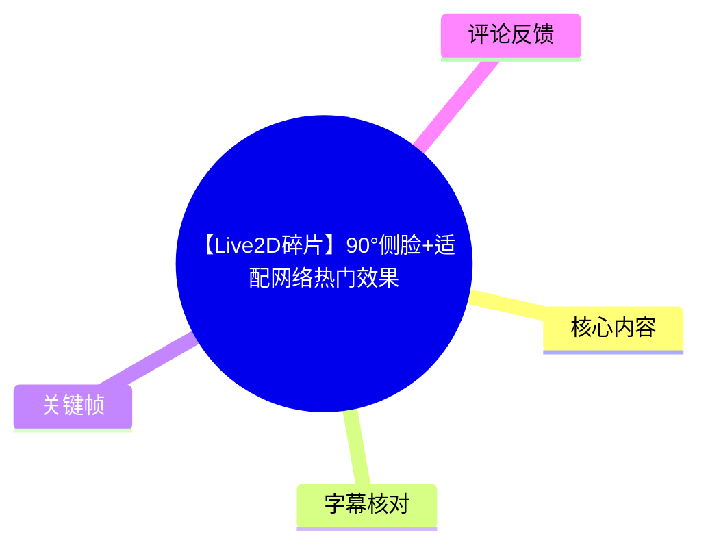
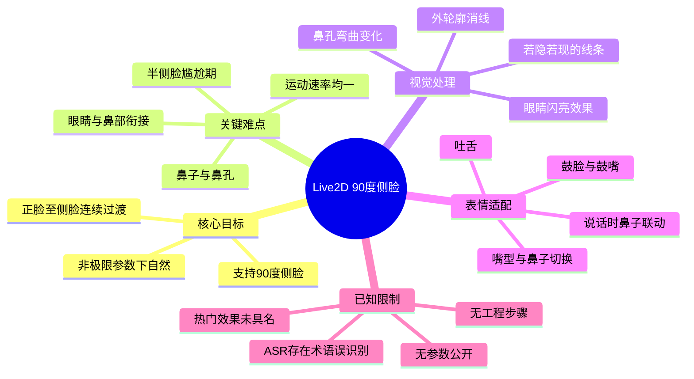
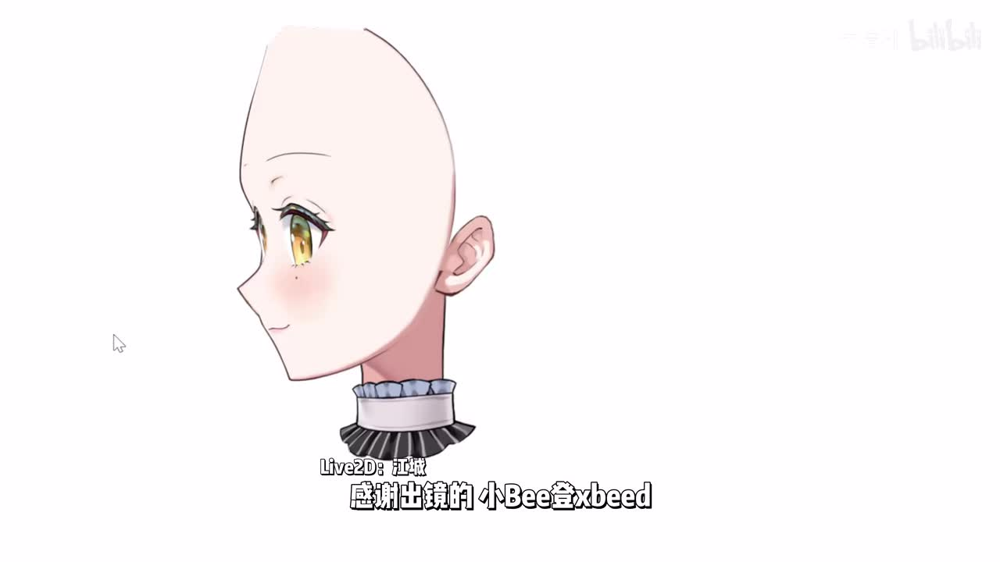
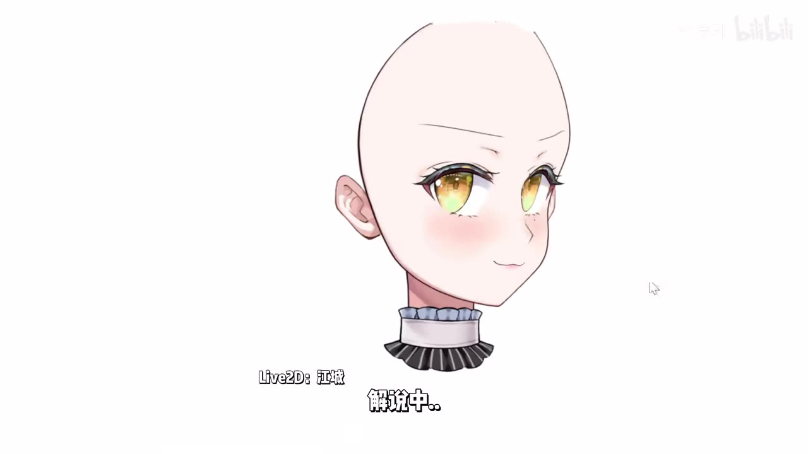
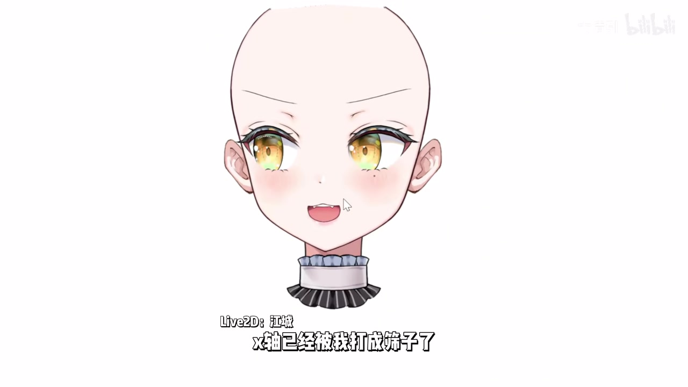
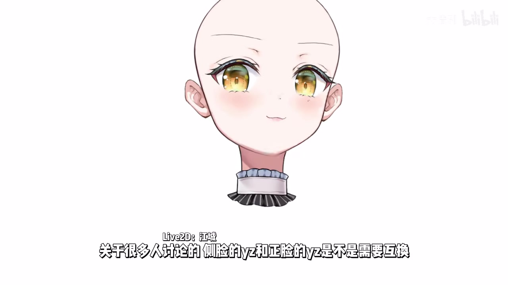

# 【Live2D碎片】90°侧脸+适配网络热门效果

> 来源：[Bilibili 视频](https://www.bilibili.com/video/BV1VHLS6KE6f) 
> UP 主：太清引｜发布时间：2026-05-20｜视频时长：03:35｜画面规格：3840×2160 
> 标签：`Live2D`、`live2d工程`、`虚拟主播`、`VUP`、`90°`

## 小结

视频是一次 Live2D 模型效果展示与制作经验说明。UP 主围绕“可达到 90°的侧脸”展示头部从正面到侧面的过渡，重点并非单纯把头转到侧面，而是处理正侧之间眼睛、鼻孔、鼻子、嘴型和外轮廓线条的连续性。

视频提出的核心判断是：90°侧脸的难点集中在鼻子及其与眼睛、鼻孔的衔接。UP 主强调，转头过程应保持运动速率均一，避免常见模型从正脸接近侧面时突然“跳转”或缺少中间过渡的问题；即使不把头部参数推到极限，日常使用时也应自然。

在表现细节上，作者展示了外轮廓“消线”、正侧脸眼睛的高亮效果、鼻孔随转头产生的弯曲变化，以及正面说话时鼻子随口型联动等设计。其中，“若隐若现”的消线是作者明确偏好的视觉风格，用来避免清晰可见的线稿断口。

后半段集中验证复杂表情的兼容性：鼓脸、鼓嘴、吐舌，以及“嘴 X / 嘴 S”等口型过程中的鼻子层级或遮挡切换。作者认为鼓嘴转向另一侧时能自然消失，以及吐舌能从正面适配至侧面，均是较难处理的部分。

这不是从建模、切片、参数设置到导出的完整教程。视频没有公开 Live2D Cubism 的具体参数范围、变形器层级、网格拆分方法、物理配置数值或工程文件；其价值主要在于提供验收目标与问题清单，适合已经具备 Live2D 基础、正在优化大角度转头和口鼻联动的模型师参考。

信息具有项目展示的时效性：视频发布于 2026-05-20，所展示的是该模型在当时版本下的效果。标题中的“适配网络热门效果”未给出具体热门效果名称、来源或实现步骤，因此不能据此推导通用的热门模板或平台兼容结论。

## 思维导图

## 目录

- [背景、目标与验收重点](#背景目标与验收重点)
- [90°侧脸的连续转头处理](#90侧脸的连续转头处理)
- [轮廓消线与眼鼻细节](#轮廓消线与眼鼻细节)
- [口型、表情与鼻子层级适配](#口型表情与鼻子层级适配)
- [可复用的检查步骤](#可复用的检查步骤)
- [限制、时效性与结论](#限制时效性与结论)
- [字幕比对](#字幕比对)
- [评论分析](#评论分析)
- [处理记录](#处理记录)

## 背景、目标与验收重点 [00:00:02](https://www.bilibili.com/video/BV1VHLS6KE6f?t=2)

视频开头，UP 主表示自己“终于还是做到了侧脸”，结合标题与后续演示，此处所说的目标是 Live2D 模型支持 90°侧脸，而不是静态立绘的单张侧面图。

从画面可见，演示对象为一个头部模型：保留了眼睛、耳朵、颈部与领口等部件，背景简洁，便于观察脸部转向和表情变化。该展示方式直接将注意力集中在大角度头部旋转时最容易露出破绽的位置。

> 图：该关键帧呈现接近完整侧面的头部状态。它的价值在于说明本视频验证的是可见五官与轮廓在侧向姿态中的完整呈现，而非只展示正面表情。

视频约 00:00:14 起明确指出，难点在“鼻子的部分”。这一定义了后续评价重点：模型是否自然，不能只看侧脸是否出现，还要看鼻子在转头、说话和嘴型切换时是否与周围部件保持合理关系。

## 90°侧脸的连续转头处理 [00:00:20](https://www.bilibili.com/video/BV1VHLS6KE6f?t=20)

UP 主在 00:00:20—00:00:56 说明其对转头连续性的要求：

1. **眼睛与鼻孔衔接自然**：转至侧面时，眼睛与鼻孔之间的视觉关系不能断裂或突兀。
2. **避免半侧脸“尴尬期”**：作者将常见问题概括为半侧脸阶段的不协调；素材未提供其精确定义，但语境指正脸与侧脸之间的中间角度不自然。
3. **运动速率均一**：正脸转向侧面应有完整过程，不能在接近侧面时突然“咻”地跳过去。
4. **非极限使用也自然**：即便用户不把头部转向参数拉到极限，过渡仍应保持自然，而不是只有 90°终点可看。

这里的“均一”是作者对观感的描述，不等同于已经公开了具体的插值曲线、参数曲线或帧速率设置。对于制作实践而言，它可转化为一个测试标准：拖动头部 X 向旋转参数时，应检查整个参数区间，而非仅对比正面与终点侧面两张状态。

> 图：中间偏侧姿态是检验“半侧脸尴尬期”的关键状态。它比单独查看正脸或纯侧脸更能帮助观察轮廓、五官和面部朝向是否连续。

## 轮廓消线与眼鼻细节 [00:00:59](https://www.bilibili.com/video/BV1VHLS6KE6f?t=59)

### 外轮廓消线 [00:00:59](https://www.bilibili.com/video/BV1VHLS6KE6f?t=59)

UP 主表示外轮廓做了“消线”，并认为这项处理“蛮难做”。作者不喜欢消线时留下非常明显的线条断口，因此采用的是线条“若隐若现”的处理方式。

可从中提炼出两层经验：

- 消线不是简单地让线稿从“有”变“无”；如果消失位置形成清晰硬边，反而会让观众注意到切换痕迹。
- 作者偏好保留一定的线条存在感，让轮廓在不同角度间平滑弱化。这是审美取向和实现目标，不代表唯一正确方案。

素材未说明消线使用的是透明度参数、遮罩、绘制顺序切换、ArtMesh 变形还是其他 Cubism 技术，因此不应把该效果归因于某一种特定实现。

### 眼睛高亮与鼻孔弯曲 [00:01:30](https://www.bilibili.com/video/BV1VHLS6KE6f?t=90)

UP 主称，正侧脸眼睛的“物理”做了非常闪亮的效果；这里“物理”应理解为演示中的视觉动态效果描述，视频没有提供物理参数、摆动幅度或绑定关系。

随后，作者演示鼻子进入侧面时，鼻孔会有“弯”的过程。其关键不是在某一帧直接替换鼻孔，而是在朝向变化中让鼻孔形态逐渐改变，从而服务于前文所述的连续转头。

> 图：该关键帧处于接近正面的状态，双眼的亮色细节和鼻部位置清晰可见，可作为与侧面状态比较时的视觉基准。

## 口型、表情与鼻子层级适配 [00:02:01](https://www.bilibili.com/video/BV1VHLS6KE6f?t=121)

### 说话、鼓脸与鼓嘴 [00:02:01](https://www.bilibili.com/video/BV1VHLS6KE6f?t=121)

UP 主称，正脸说话时鼻子会跟着动，并认为这样“比较好看”。这说明鼻子并非完全独立于口部动画：至少在作者展示的正面说话状态中，鼻子会参与口型变化带来的局部形变或位移。

接着作者重点提及侧脸的“嘴 X”适配、鼓脸和鼓嘴。ASR 对术语的识别不稳定，后半段同时出现“嘴 X”“嘴 S”等表达；结合画面中的字幕与语境，可以确认这是作者对口部相关参数或嘴型状态的称呼，但素材未给出这些名称对应的准确 Cubism 参数名，不能擅自等同为标准命名。

作者指出，鼓嘴转到另一侧时，相关效果能够自然消失是难点。这涉及大角度转头下表情部件的可见性管理：一侧可见的鼓嘴形态在转向另一侧时，不应以错误的层级或残影继续存在。

### 吐舌与切换点 [00:02:29](https://www.bilibili.com/video/BV1VHLS6KE6f?t=149)

作者展示吐舌效果，并说明正面到侧面都能适配，且可以适配完整。此处可理解为吐舌这一表情不是仅为正面单独绘制，而是在转头时仍保持可用。

约 00:02:42 起，作者将注意力放到“切换的点”以及鼻子的切换位置。之后说明做“嘴 X”没有问题，并在另一嘴型过程里展示鼻子“完全卡上”“闪开”、以及“嘴上”“嘴下”“抿嘴”等状态。ASR 在这一段有较多同音和断句问题，以下仅保留可由时间轴、画面字幕和上下文共同支持的结论：

- 鼻子与口型并非始终固定在同一绘制关系中；
- 在不同嘴部状态、特别是侧脸和转向过程中，需要检查鼻子是否正确遮挡、露出或切换；
- 作者将鼻子切换点视为口型适配的关键难点之一；
- 视频展示了“吐舌、嘴上、嘴下、抿嘴”等口部状态，但未解释其完整参数结构。

> 图：该关键帧展示张嘴口型下鼻子、嘴与脸部轮廓的邻接关系。它有助于理解为什么嘴型变化不能只处理嘴部本身，还必须同步验证鼻部的遮挡和切换。

## 可复用的检查步骤 [00:00:20](https://www.bilibili.com/video/BV1VHLS6KE6f?t=20)

以下不是视频逐步教学中直接给出的软件操作流程，而是依据作者实际演示顺序整理出的**效果验收步骤**。没有公开的参数值和工程结构不能补造，应由制作者结合自己的模型实现。

1. **先建立正面与 90°侧面的对照**
   - 检查正面五官位置是否稳定。
   - 检查侧面是否仍具备合理的眼睛、鼻子、鼻孔、下颌与耳朵关系。
   - 不要仅以“能转到侧面”作为完成标准。

2. **逐段拖动正面至侧面的转头参数**
   - 重点观察 1/3、1/2、2/3 等中间角度。
   - 检查是否出现五官突然跳位、鼻孔突现、眼睛与鼻部脱节等现象。
   - 观察过渡速率是否平滑、均一；视频没有要求某一种固定曲线，但明确反对缺少过程的突然切换。

3. **专项检查外轮廓消线**
   - 查看线稿淡出或被遮挡时是否露出明显断口。
   - 若采用消线效果，评估“完全消失”是否比“若隐若现”更符合角色画风。
   - 该项属于作者个人偏好较强的视觉处理，应以模型整体风格为准。

4. **在转头时测试眼睛和鼻子**
   - 观察眼睛高亮在正侧变化中是否保持合理。
   - 观察鼻孔是否随鼻子转向逐步弯曲或变化。
   - 验证鼻部与眼睛间的空间关系是否连续。

5. **叠加口型和表情进行压力测试**
   - 正面说话时检查鼻子是否需要联动。
   - 分别测试鼓脸、鼓嘴、吐舌、张嘴、嘴上、嘴下、抿嘴等状态。
   - 每个状态都要从正面拖到侧面，并反向拖回，检查残留、错误遮挡和突变。

6. **专门验证鼻子切换点与绘制层级**
   - 在侧脸口型变化中，观察鼻子何时应遮挡嘴、何时应让出嘴部。
   - 若鼻子出现“卡住”、闪现或层级错误，应回到切换点与相关部件的可见性逻辑排查。
   - 视频没有给出具体修复方法；这一部分只能确认其为作者强调的难点，而不能推断使用了何种层级方案。

## 限制、时效性与结论 [00:03:17](https://www.bilibili.com/video/BV1VHLS6KE6f?t=197)

这支视频的结论是：高质量的 Live2D 90°侧脸是一个系统性的适配问题，需要同时处理转头连续性、线稿消隐、眼鼻细节和口部表情，而不能仅靠增加一个侧脸终点形态完成。

视频的主要限制如下：

- **缺少工程细节**：未展示 Cubism 版本、PSD 分层、网格、变形器、参数 ID、参数范围、关键帧曲线、物理设置或导出配置。
- **缺少可量化指标**：作者使用“自然”“均一”“闪亮”“完全适配”等主观或展示性表述，没有给出可复现的数值标准。
- **术语存在歧义**：ASR 将部分口型术语识别为“嘴 X”“嘴 S”，画面可确认其是口部状态讨论，但不能确认其标准技术名称。
- **“网络热门效果”未展开**：标题提到该方向，但视频主体没有说明具体热门效果、参考来源、适配平台或制作方法。
- **模型适用范围未知**：本视频展示一个特定画风和结构的头部模型；不同脸型、厚涂风格、写实风格、多层头发或复杂饰品模型的适配难度可能不同。
- **时效性**：发布信息对应 2026-05-20；其效果与工作流仅代表当时的展示版本，不构成对后续 Live2D 软件版本、插件或平台表现的保证。

## 字幕比对

| 字幕来源 | 完整性 | 专有名词 | 时间轴 | 主要问题 |
| --- | --- | --- | --- | --- |
| Bilibili 站内字幕 | 未提供可用字幕 | 无法评估 | 无法评估 | 素材中没有可用的站内字幕文件。 |
| 本次 ASR 字幕 | 有 20 个分段，覆盖约 133.8 秒语音；语音覆盖率约 62.23% | 一般，部分口型术语与“消线”等词存在误识别 | 可用，提供 00:00:02.450—00:03:18.620 的真实时间分段 | 存在同音字、断句和词义不明问题，如“消纤/消红”“鼻涕”“正侁脸”“嘴 X/嘴 S”等。 |

### 最终字幕选择与校正

最终以**本次 ASR 时间轴**作为章节跳转依据，因为没有可用的 Bilibili 站内字幕。ASR 诊断显示音频语言为中文，识别模型为 `medium`，语言置信度为 `0.99267578125`，且存在正常音频流；诊断中**未标记** `noAudioStream=true`，因此不存在“源视频没有音轨”的情形。

在不超出素材证据的前提下，结合关键帧中的画面字幕和上下文，对以下内容作了保守校正：

- ASR 中的“消纤”“消红”统一按上下文表述为“消线”；这是作者在讨论外轮廓线条淡化处理。
- “鼻涕是会跟着动的”按语义校正为“鼻子会跟着动”；原识别显然不合语境。
- “正侁脸”按语境理解为“正侧脸”或正脸、侧脸的对照讨论，不将其作为术语引用。
- “嘴 X”“嘴 S”保留原有字母式称呼，并明确其准确参数含义未获素材证实。
- 关键帧画面中可见“X轴已经被我打成筛子了”及关于“侧脸的 y 轴和正脸的 y 轴是否需要互换”的讨论字幕，但 ASR 未完整覆盖或稳定识别这些句子。因此本文仅将其视为画面中出现的讨论线索，不据此推导具体参数方案。

ASR 在 00:01:49.540—00:02:01.420 存在约 11.88 秒的最大无语音间隔；结合视频性质，该间隔可能主要为效果演示，但没有额外字幕可补足其具体内容，故不作延伸转写。

## 评论分析

本次仅获取到 2 条热评，未达到“热评前三条”的数量；以下仅分析可获取的两条，不补造第三条评论。

1. **爱凡fanfan｜点赞 10**
   - 原文：“我滴妈 完美侧脸！”
   - 观点：评论者对侧脸效果给予强烈正面评价，关注点与视频核心展示一致。
   - 补充信息：未提供技术细节、使用环境或对比样本。
   - 可信度边界：这是观感反馈，可佐证展示效果获得认可，但“完美”属于主观评价，不能当作工程质量的客观认证。

2. **九霄环配｜点赞 6**
   - 原文：“老师好厉害，我看前都力竭了[笑哭]”
   - 观点：评论者以夸张表达认可作者的制作能力，并侧面反映观众认为该工作具有较高难度。
   - 补充信息：没有说明“力竭”具体指哪一项技术问题，也未提供制作方法。
   - 可信度边界：该评论反映情绪和社区赞赏，不构成对 90°侧脸实现成本、工期或技术路线的可验证结论。

整体来看，可获取热评均为正向赞赏，没有出现具体技术质疑、参数补充或争议讨论。评论不能替代对模型工程结构与适配边界的验证。

## 处理记录

- Worker ID：`worker-mrj0www4-e8d79408`
- 生成模型：`gpt-5.6-terra`
- 音频识别模型：`medium`，设备 `cuda`，计算类型 `float16`
- 使用的素材与工具结果：视频元数据、音频 ASR 分段及 SRT 时间轴、12 张关键帧、热评抓取结果；未提供可用 Bilibili 站内字幕。
- 字幕选择：检查了本次 ASR，且确认未提供站内字幕；采用 ASR 的真实起止时间生成时间轴链接，并通过关键帧画面字幕与上下文对明显误识别进行保守说明。
- 关键帧选择依据：
  - `frames/frame-001.jpg`：展示完整侧面，适合说明 90°侧脸目标；
  - `frames/frame-002.jpg`：展示中间偏侧状态，适合观察连续过渡；
  - `frames/frame-003.jpg`：展示正面眼睛高亮、鼻部与嘴部基准；
  - `frames/frame-004.jpg`：展示张嘴状态，辅助理解口鼻邻接与遮挡问题。
- 缓存清理：提供的素材清单未记录缓存清理操作或结果，无法确认是否已执行；不将其表述为已完成。
- 未解决问题：
  - 未获得 Live2D 工程文件、参数表、网格和层级结构；
  - “嘴 X / 嘴 S”的准确技术含义无法由现有素材确认；
  - 标题所称“网络热门效果”没有具体名称或实现说明；
  - 未获取到第三条热评。
