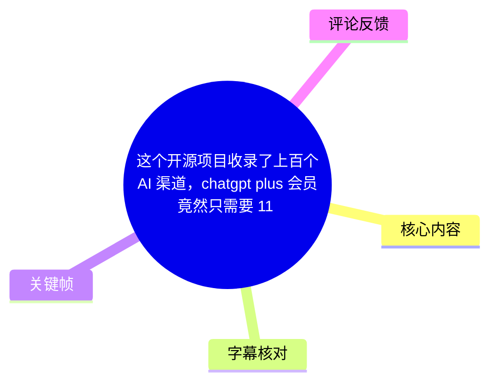
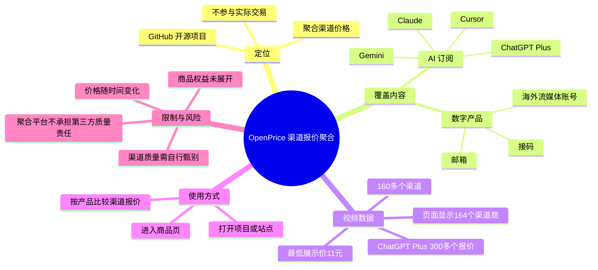
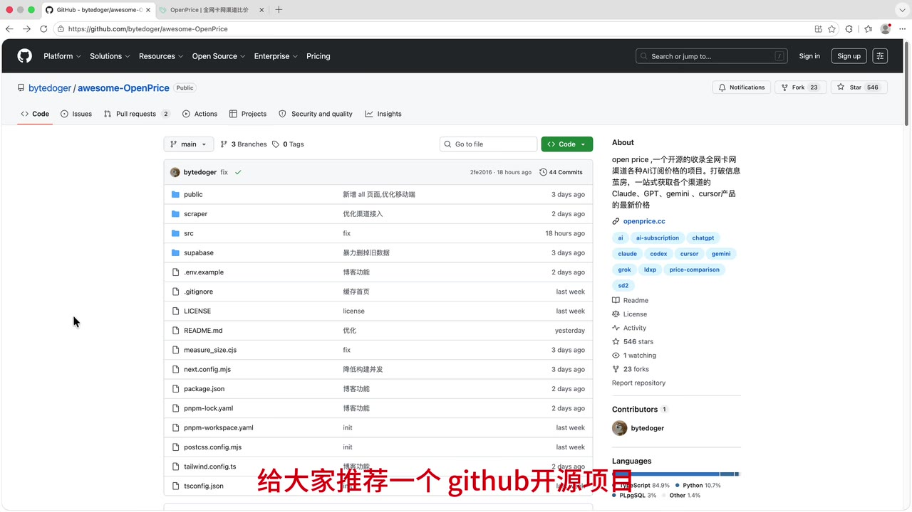
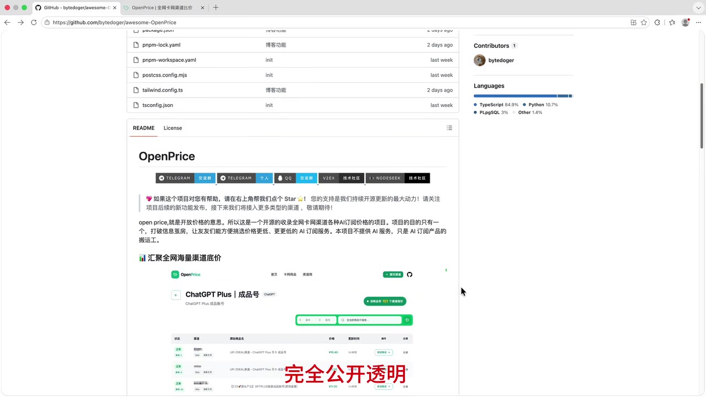
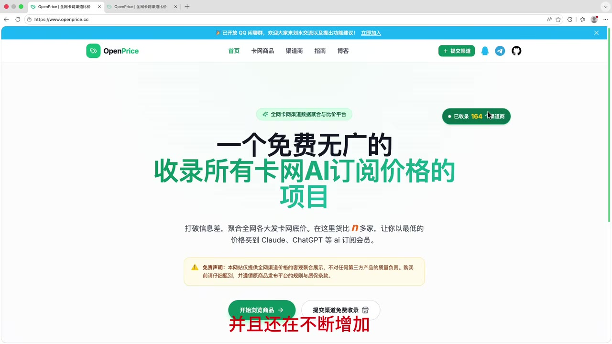
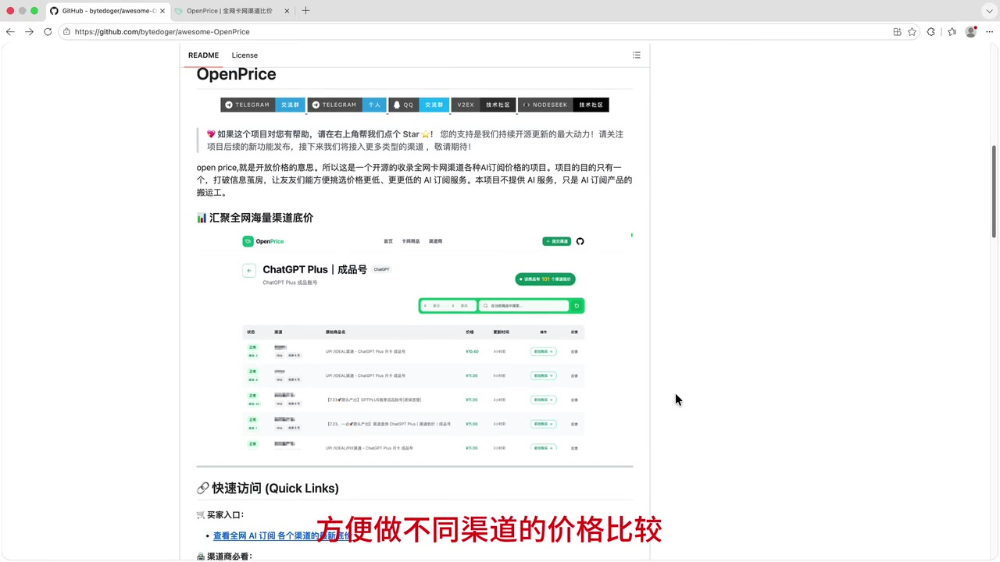

# 这个开源项目收录了上百个AI 渠道，chatgpt plus 会员竟然只需要 11 块？

> 来源：[Bilibili 视频](https://www.bilibili.com/video/BV1cF3F6YEMz)  
> UP 主：calvin_03｜视频时长：02:13｜合集：AIcode  
> 信息基准：视频与页面画面反映的是录制时状态；价格、收录数、渠道可用性均可能随后变化。

## 小结

视频介绍了 GitHub 开源项目 **OpenPrice**（画面中仓库为 `bytedoger/awesome-OpenPrice`）及其展示站点 `openprice.cc`。其定位是聚合多个“卡网渠道”的 AI 订阅及相关数字产品报价，帮助用户在一个界面内进行横向价格比较，而不是提供或参与实际交易。

视频给出的核心数据有两组口径：口播称项目已收录“**160 多个渠道**”，首页画面则显示“**已收录 164 个渠道商**”；在 ChatGPT Plus 成品账号条目中，口播称收录“**300 多个渠道报价**”，最低渠道价“**11 块钱**”。此外，视频还称 Claude Pro 成品号存在“低至 60”的渠道价，但没有交代具体币种以外的计价周期、账号类型、权益、库存或渠道名称。

OpenPrice 的使用流程是：进入项目或站点，打开商品页，按产品查找并比较各渠道报价。视频展示的覆盖对象包括 Claude、Gemini、Cursor、ChatGPT Plus 等 AI 订阅，也包括邮箱、接码、海外流媒体账号等数字产品。页面画面还显示“卡网商品”“渠道商”“指南”“博客”等导航。

最应注意的是，**低价不等于同等权益或低风险**。视频明确称项目仅做数据聚合、按价格排序、不参与交易；首页提示也写明平台不对第三方产品质量负责，购买前应自行甄别。因此，11 元等报价只能被视为录制时某些渠道提交的价格信息，不能直接视为官方订阅价、稳定可购价或等价服务承诺。

本内容适合需要了解 AI 订阅非官方渠道报价聚合方式的人阅读；不适合作为购买决策的唯一依据。视频没有演示付款、验证账号合法性、核验商品可用性或比较不同档位权益，也未给出数据更新频率、审核机制与价格有效期。

## 思维导图

## 目录

- [背景：为什么需要渠道报价聚合](#背景为什么需要渠道报价聚合)
- [项目定位与收录范围](#项目定位与收录范围)
- [使用步骤：从首页到商品比价](#使用步骤从首页到商品比价)
- [案例数据：Claude Pro 与 ChatGPT Plus](#案例数据claude-pro-与-chatgpt-plus)
- [开源、中立与提交机制](#开源中立与提交机制)
- [关键参数、限制与时效性](#关键参数限制与时效性)
- [字幕比对](#字幕比对)
- [评论分析](#评论分析)
- [处理记录](#处理记录)

## [背景：为什么需要渠道报价聚合](https://www.bilibili.com/video/BV1cF3F6YEMz?t=0)

视频开头以“渠道报价很多”为切入点，提出同一种 AI 订阅产品可能在不同渠道有不同标价；OpenPrice 试图解决的，是用户分别搜索、逐一比价的成本问题。

根据视频介绍，项目希望将不同渠道的 AI 产品订阅价格集中公开展示，以便用户比较。视频元数据中的项目描述进一步将目标表述为：汇聚全网渠道的 AI 订阅价格，在公开、透明的前提下查看 ChatGPT、Claude、Cursor 等产品的渠道报价。

这里的“渠道价”应与官方定价区分：

- 视频比较的是平台收录的第三方渠道商品报价，不是对官方价格体系的完整复述。
- 视频将低价与“上百的官方订阅”作对比，但并未说明官方订阅的地区、税费、币种、权益档位及结算周期。
- 因而“便宜”是视频对标价的描述，不构成产品等价性、长期可用性或合规性的证明。

## [项目定位与收录范围](https://www.bilibili.com/video/BV1cF3F6YEMz?t=8)

### [GitHub 项目与“公开价格”含义](https://www.bilibili.com/video/BV1cF3F6YEMz?t=8)

视频在约 00:08 推荐 GitHub 开源项目 **OpenPrice**，并将其名称解释为“公开价格”。站内字幕与本次 ASR 都能稳定识别出 `OpenPrice` 和 GitHub；关键帧中的仓库页面显示仓库名为 `bytedoger/awesome-OpenPrice`。

仓库页面右侧简介的可见文字说明，该项目聚合各类 AI 订阅价格，用于比较 Claude、GPT、Gemini、Cursor 等产品的最新价格。页面文件列表可见 `public`、`scraper`、`src`、`supabase` 等目录，以及 `package.json`、`pnpm-lock.yaml` 等文件；这只能说明仓库中存在这些目录和工程文件，**视频并未讲解具体爬取逻辑、数据库结构、部署过程或代码使用方式**。

> 图：关键帧展示 GitHub 仓库 `bytedoger/awesome-OpenPrice` 的首页、项目简介与目录结构。这是确认项目名称、开源仓库存在及可见工程目录的直接画面依据；它不等同于对代码功能的完整审计。

### [收录商品类型与范围](https://www.bilibili.com/video/BV1cF3F6YEMz?t=47)

进入商品页后，视频称平台收录了 Claude、Gemini、Cursor 等 AI 订阅产品价格；结合标题及后续案例，ChatGPT Plus 也是其中一个检索对象。约 00:57 起，视频还称页面覆盖邮箱、接码、海外流媒体账号等数字产品，并称覆盖“绝大部分卡网渠道的商品”。

应按以下边界理解这段信息：

| 类别 | 视频列举内容 | 视频是否展开具体权益或质量 |
| --- | --- | --- |
| AI 订阅 | ChatGPT Plus、Claude、Gemini、Cursor | 否 |
| 数字产品 | 邮箱、接码、海外流媒体账号 | 否 |
| 渠道覆盖 | 口播称覆盖绝大部分“卡网渠道”商品 | 未给出完整名单或覆盖率计算方法 |

> 图：关键帧中的 README 写有项目聚合 AI 订阅价格、非提供 AI 服务而是价格聚合的说明，并嵌入 ChatGPT Plus 价格列表示例；它补充了视频“公开透明、便于比较”的定位。

## [使用步骤：从首页到商品比价](https://www.bilibili.com/video/BV1cF3F6YEMz?t=33)

视频没有展示注册、安装或 API 调用，而是演示了一个面向浏览和比较的网页流程。可按视频顺序整理为：

1. **打开项目地址或站点**  
   视频先打开 GitHub 项目，随后进入 OpenPrice 页面。首页关键帧可见域名为 `openprice.cc`，页面有“首页”“卡网商品”“渠道商”“指南”“博客”等导航入口。

2. **查看总体收录规模**  
   口播在约 00:37 表示已收录“160 多个渠道”；首页画面右上绿色标识显示“已收录 164 个渠道商”。两者不冲突：前者为概括说法，后者是录屏时画面呈现的具体数值。

3. **进入商品页并选择目标产品**  
   视频在约 00:47 提示“进入商品页”，随后演示按产品查看报价。视频未展示具体筛选条件、排序开关、渠道详情页或搜索语法。

4. **横向比较价格与渠道**  
   项目宣称按价格高低排序；用户可据此查看同类商品的多条渠道报价。比较时不能只看最低价，还应自行核验商品说明、权益期限、地区限制、售后条件及渠道风险；后述事项是基于页面免责提示给出的审慎检查建议，并非视频提供的交易保障。

5. **需要时提交渠道**  
   视频称任何人都可以提交渠道并被免费收录，但没有展示提交表单、审核标准、审核时效或反作弊规则。

> 图：首页画面显示项目定位为“免费无广的收录所有卡网 AI 订阅价格的项目”，并在右上角显示“已收录 164 个渠道商”。底部黄色提示明确页面仅做客观聚合展示、用户购买前应仔细甄别，是理解使用边界的重要证据。

## [案例数据：Claude Pro 与 ChatGPT Plus](https://www.bilibili.com/video/BV1cF3F6YEMz?t=68)

### [Claude Pro 成品号：视频称低至 60](https://www.bilibili.com/video/BV1cF3F6YEMz?t=68)

视频在 01:08 左右查看 **Claude Pro 成品号** 的渠道价格，并在 01:15—01:19 表示部分渠道价格“低至 60”。

这一数字存在必要的信息缺口：

- 视频只说“60”，未明确在该句中说明结算周期、账户区域、库存状态或具体商品权益。
- 虽然中文口播语境通常用“块”指代人民币元，但此处视频没有完整展示币种规则，不能扩展为标准官方价格或月度价格。
- “成品号”属于视频对商品类型的称呼；视频没有说明账号来源、独占与否、是否可改密、是否有使用限制等关键信息。

因此，正确记录应为：**视频声称其录屏中部分 Claude Pro 成品号渠道报价低至 60，具体单位与条款需以当时商品页面为准。**

### [ChatGPT Plus 成品账号：300 多个报价与 11 元](https://www.bilibili.com/video/BV1cF3F6YEMz?t=85)

视频在约 01:25 切换至 **ChatGPT Plus 成品账号**，并给出两项具体说法：

| 指标 | 视频陈述 | 时间依据 |
| --- | --- | --- |
| 报价收录量 | 已收录 300 多个渠道报价 | 01:29—01:35 |
| 最低渠道价 | 已低至 11 块钱 | 01:29—01:35 |
| 主观评价 | “真的非常便宜”，并称相比“上百的官方订阅”更便宜 | 01:36—01:40 |

站内字幕在此段错误识别为“check group plus”，ASR 识别为“Tuckoops Plus”；结合视频标题、关键帧中嵌入的 `ChatGPT Plus｜成品号` 页面以及上下文，可校正为 **ChatGPT Plus 成品账号**。

> 图：关键帧可见 README 中的 OpenPrice 示例页面标题为“ChatGPT Plus｜成品号”，列表包含多个报价行。这为产品名称校正提供画面依据；由于图片中文字细节有限，不能据此逐项确认渠道名、价格或商品条款。

## [开源、中立与提交机制](https://www.bilibili.com/video/BV1cF3F6YEMz?t=104)

视频在 01:44 后集中说明项目的治理定位：

- 项目是**完全开源**的；
- 作者表示项目保持“中立与客观”；
- 项目**不参与实际交易**；
- 其作用是做客观的数据聚合；
- 页面按价格高低进行排序；
- 任何人均可提交渠道，且可被免费收录。

这些表述说明 OpenPrice 更接近信息索引或报价看板，而不是销售平台。也正因渠道可提交，列表规模和内容可能持续变化；视频并未说明提交后是否人工审核、是否自动抓取、是否保留历史价格，不能将“可免费收录”理解为对渠道可信度的背书。

视频结尾称项目地址已放在评论区，并呼吁用户在 GitHub 为项目点赞。当前提供的热评素材为空，因此无法据此复原评论区中的具体项目链接。

## [关键参数、限制与时效性](https://www.bilibili.com/video/BV1cF3F6YEMz?t=119)

### 视频中出现的参数与数字

| 项目 | 数值或状态 | 证据与说明 |
| --- | --- | --- |
| 视频时长 | 133 秒（约 02:13） | 元数据 |
| 站点收录规模 | 口播“160 多个渠道”；画面“164 个渠道商” | 00:37 起口播；首页关键帧 |
| ChatGPT Plus 成品账号报价数 | 300 多个 | 视频口播，01:29—01:35 |
| ChatGPT Plus 最低渠道价 | 11 块钱 | 视频口播，01:29—01:35 |
| Claude Pro 成品号低价 | 低至 60 | 视频口播，01:15—01:19 |
| 项目交易角色 | 不参与实际交易，仅做数据聚合 | 视频口播，01:44—01:58 |
| 排序原则 | 按价格高低排序 | 视频口播，01:54—01:58 |
| 渠道提交 | 任何人可提交、免费收录 | 视频口播，01:59—02:04 |

### 重要限制

1. **价格是强时效信息**  
   视频录制时的 164 个渠道商、300 多条报价、11 元和 60 等数据，均不能自动代表当前页面数据。视频本身也说渠道数仍在增加。

2. **最低价缺少完整商品条件**  
   视频未披露最低报价所对应的时长、地区、交付方式、账号独占性、售后、库存和权益范围。单一数字不适合脱离详情页比较。

3. **聚合不等于背书**  
   视频称项目不参与交易；首页提示还说明平台仅做客观聚合展示，不对第三方产品质量负责。渠道出现在列表中，不表示平台或视频作者保证其安全、合法、稳定或可用。

4. **未展示数据质量机制**  
   视频没有说明报价采集时间、自动更新频率、失效处理、重复渠道合并方式、提交审核与投诉机制。任何对“全网”“绝大部分”覆盖程度的理解，都应限于视频的宣传性表述。

5. **技术细节有限**  
   虽然 GitHub 画面可见 `scraper`、`supabase` 等目录，视频没有讲解部署、爬虫配置、数据库权限、接口或复现步骤，不能据此写成可执行的技术教程。

## 字幕比对

| 字幕来源 | 完整性 | 专有名词 | 时间轴 | 主要问题 |
| --- | --- | --- | --- | --- |
| Bilibili 站内字幕 | 覆盖从 00:00:00.160 至 00:02:12.860，分段细，基本覆盖完整口播 | 多处误识别，如“group plus”“cloud diamoni”“科色”“check group plus” | 较精细，可直接用于章节定位 | 产品名和“收录/渠道/价格”等词偶有错字；ChatGPT Plus 被严重误识别 |
| 本次 ASR（large-v3-turbo） | 14 段，语音覆盖约 93.72 秒，覆盖率 70.53%；首段至末段覆盖全片口播位置 | `OpenPrice`、GitHub 可识别；Claude、Gemini、Cursor、ChatGPT Plus 的错误更明显 | 有时间戳，但首段最长达 20.91 秒，颗粒度低于站内字幕 | “Goop Plus”“CloudZamonite”“Tuckoops Plus”等错误较多；“收入”与“收录”等同音混淆 |

最终以**站内字幕的细粒度时间轴**为主要定位依据，并检查本次 ASR 的全片识别结果作为交叉验证。专有名词采用“视频标题 + 关键帧画面 + 上下文”的校正结果：

- `OpenPrice`：两份字幕/ASR 均可大致识别，GitHub 页面可见项目名；
- `ChatGPT Plus`：站内字幕“check group plus”、ASR“Tuckoops Plus”均不准确，以标题及关键帧页面标题校正；
- `Claude`、`Gemini`、`Cursor`：站内字幕和 ASR 均有音译或错字，以 GitHub 画面简介与视频语境校正；
- “收录”：ASR 多次写作“收入”，结合站内字幕和页面统计语境校正为“收录”。

本次 ASR 诊断中**未标记 `noAudioStream=true`**，且素材提供了 `audio/audio.wav`、ASR 语言识别为中文（置信度约 0.998），因此本片属于有音轨且已完成语音识别的情况，并非无音轨视频。

## 评论分析

可获取的热评数据为空：`items: []`。虽然元数据显示视频回复数为 1，但本次素材未返回可分析的热评内容，因此：

- 无法概括热评前三条的观点；
- 无法从评论区验证项目地址、渠道体验或价格真实性；
- 不应将视频所称“项目地址在评论区”扩展为当前已经可获取的具体链接。

## 处理记录

- Worker ID：`worker-mrj0wjed-b0c290ad`
- 生成模型：`gpt-5.6-terra`
- ASR 模型：`large-v3-turbo`，语言：中文，设备：CUDA，计算类型：`int8_float16`
- 使用的素材工具产物：合并视频 `merged.mp4`、音频 `audio/audio.wav`、关键帧目录 `frames/`、站内字幕 `p01-ai-zh.srt`、本次 ASR 字幕与分段结果、评论数据 `comments/comments.json`。
- 字幕选择：以站内 SRT 的逐段时间轴作为章节链接依据；逐项检查本次 ASR，并通过标题、GitHub/网页关键帧纠正产品专名。
- 关键帧选择依据：  
  - `frame-001.jpg`：显示 GitHub 仓库名称、简介和可见目录；  
  - `frame-002.jpg`：显示 README 对项目定位及价格聚合的说明；  
  - `frame-003.jpg`：显示 ChatGPT Plus 成品号价格列表的页面示例；  
  - `frame-004.jpg`：显示 OpenPrice 首页、164 个渠道商计数及免责提示。  
  其余帧虽在素材清单中，但未在提供的可视画面材料内附带可核验内容，未强行使用。
- 缓存清理：素材未提供缓存目录或清理日志；本记录不声称已执行缓存清理。
- 未解决问题：未获取评论区实际项目链接；未获得各商品报价的完整条款、更新时间、审核机制和当前可用性；视频中的价格与收录数量均应以访问时页面为准。
