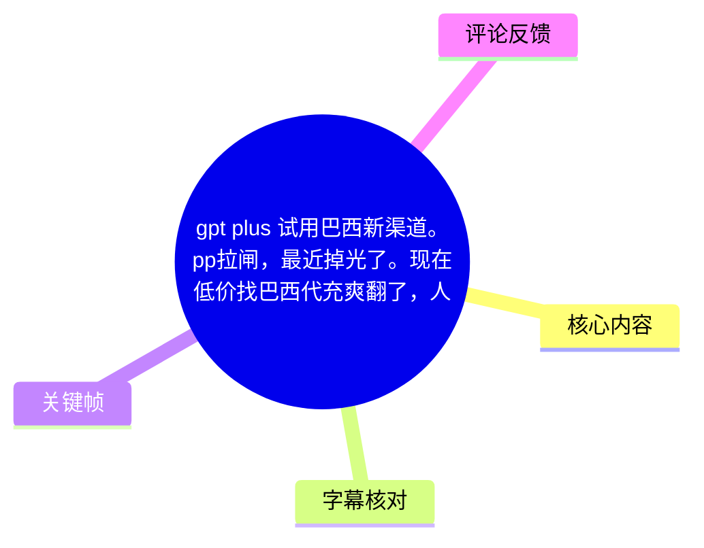
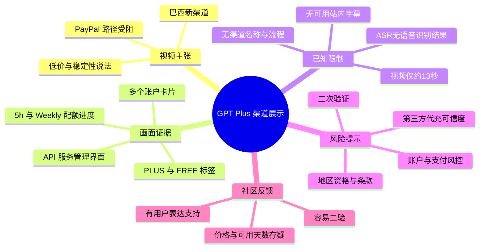
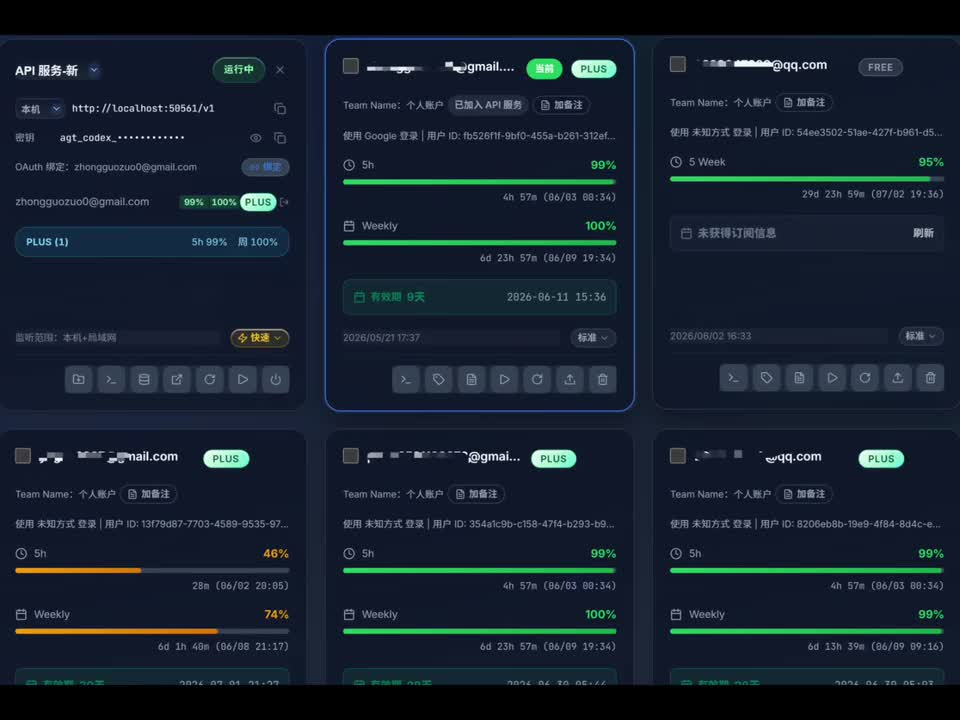

## 小结

视频时长约 13 秒，标题宣称正在尝试“巴西新渠道”的 GPT Plus 试用/充值，并称此前与 PayPal（标题中写作“pp”）相关的路径已“拉闸”、账号近期“掉光了”。这属于 UP 主的即时性经验与推广式表述，视频本身未提供可核验的渠道名称、价格、支付凭证、操作步骤或成功率统计。

可见画面为一个深色的账号/API 管理界面：左侧显示“API 服务-新”、本地地址 `http://localhost:5056/v1`、OAuth 绑定状态及一个带 `PLUS` 标记的账户；右侧和下方为多个账户卡片，其中同时出现 `PLUS`、`FREE`、5 小时（5h）与 Weekly 用量/配额进度条、到期/有效期等字段。画面能够证明视频展示了多账户状态管理，但**不能仅据此证明**账户来源、地区、充值方式、订阅真实性或渠道稳定性。

本次 ASR 未识别到任何语音片段，且未提供可用的 Bilibili 站内字幕。因此，本文只能依据视频标题、元数据、关键帧画面和热评整理；不将标题中的“低价”“人少”“稳定”等营销性描述视作已验证事实，也不补写未出现的代充流程。

这类跨区试用、代充或第三方账户服务通常涉及支付方式、账户归属、地区资格、身份验证与平台条款等风险。热评中已有用户反馈“容易二验”，说明至少存在额外验证风险；任何“稳定”“可长期使用”结论均不应从这段短视频中推出。

信息具有强时效性。视频元数据发布时间为 **2026-06-02 11:49:56 UTC**，抓取时间为 **2026-07-16**；支付路径、地区资格、风控策略、套餐规则及第三方服务状态都可能已变化。

## 思维导图

## 目录

- [视频背景与可确认范围](#视频背景与可确认范围00-00)
- [画面中的账户与配额面板](#画面中的账户与配额面板00-00)
- [标题主张、方法缺口与风险边界](#标题主张方法缺口与风险边界00-00)
- [参数、限制与时效性](#参数限制与时效性00-00)
- [字幕比对](#字幕比对)
- [评论分析](#评论分析)
- [处理记录](#处理记录)

## [视频背景与可确认范围（00:00）](https://www.bilibili.com/video/BV1VhVr6gELk?t=0)

视频标题为“gpt plus 试用巴西新渠道。pp拉闸，最近掉光了。现在低价找巴西代充爽翻了，人少非常稳定”，发布者为“是大宝贝吗”，归入 `AIcode` 收藏集。标题和标签涉及以下话题：

- GPT Plus 试用；
- 巴西相关渠道；
- PayPal（`pp`）路径受阻；
- GPT 充值方法；
- 第三方“代充”。

不过，标题不是操作证据。全片仅约 13 秒，且没有可用文字字幕或可识别旁白，无法从素材中确定：

1. 所谓“巴西新渠道”的具体服务商、网址、账户类型或支付通道；
2. “PayPal 拉闸”指的是支付失败、地区限制、账户风控、商家停止服务，还是其他情形；
3. “低价”的金额、币种、计价单位及是否包含接码、税费或服务费；
4. “人少”“非常稳定”的样本量、观察期限、成功率与失败条件；
5. 任何账户是否由本人合法持有、是否符合 OpenAI 与支付平台规则。

因此，本文将“巴西新渠道”“低价”“稳定”等全部标记为**视频标题中的主张**，而不是可验证结论。

## [画面中的账户与配额面板（00:00）](https://www.bilibili.com/video/BV1VhVr6gELk?t=0)

关键帧显示的是深色主题的账户/API 服务管理页面。可见信息包括：

- 左上区域标题为“API 服务-新”，状态显示“运行中”；
- 页面出现本地服务地址 `http://localhost:5056/v1`；
- 左侧账户区域可见 OAuth 绑定字段、邮箱字段、`PLUS` 标记，以及“5h 99%”“周 100%”一类用量状态；
- 主区域为多个账户卡片，每张卡片顶部有邮箱地址的打码/模糊显示；
- 卡片中可见 `PLUS` 或 `FREE` 标签；
- 若干卡片显示“5h”“Weekly”及对应百分比进度条；
- 有卡片显示“有效期 9天”与日期时间字段，也有卡片显示“未获得订阅信息”。

> 图：该帧集中展示本地 API 服务、OAuth 绑定以及多个账号卡片。它的价值在于确认视频主要呈现的是一个账户状态与配额监控界面，而不是支付、下单或充值页面；因此不能将该画面直接等同于“巴西代充成功”的证明。

从画面可观察到，部分带 `PLUS` 标签的卡片具有接近满额的绿色进度条，例如可见“5h 99%”“Weekly 100%”；另有一张卡片的进度条为橙色，显示约“5h 46%”“Weekly 74%”。这更接近**不同账户或不同周期下的用量状态展示**，并不等于套餐权益的官方定义。

> 图：该帧同时保留了 `PLUS`、`FREE` 标签及 5h、Weekly 周期字段，便于区分视频画面中存在不同账户状态。其价值是说明 UP 主展示的是多卡片、多状态的管理视图；但邮箱、用户 ID 等敏感字段已被模糊，无法追溯账户来源或验证订阅归属。

### 画面中可见的参数

| 项目 | 画面可见内容 | 可作出的谨慎解释 |
| --- | --- | --- |
| 服务地址 | `http://localhost:5056/v1` | 页面似乎关联一个本地 API 服务，但未展示软件名称、部署步骤、接口文档或实际调用结果。 |
| 账户状态 | `PLUS`、`FREE` | 界面将账户标记为不同状态；无法仅凭页面确认其是否与官方订阅状态完全一致。 |
| 短周期字段 | `5h`，可见 99%、46% 等 | 画面显示以 5 小时为单位的配额/用量条，但未解释百分比是剩余量、已用量还是健康度。 |
| 周期字段 | `Weekly`，可见 100%、99%、74%、95% 等 | 存在周维度进度显示，但视频没有定义其统计口径。 |
| 有效期字段 | 可见“有效期 9天”及日期时间 | 某个卡片具有到期信息，但该字段所对应的是订阅、账号、授权还是服务端记录，无法确定。 |
| 登录方式 | 可见“使用 Google 登录”“使用未知方式登录”等 | 多个账号可能采用不同登录方式；画面不足以判定账号注册地区、所有权或合规性。 |

## [标题主张、方法缺口与风险边界（00:00）](https://www.bilibili.com/video/BV1VhVr6gELk?t=0)

### 视频实际展示与未展示内容

视频的可见画面并未展示从“寻找渠道”到“完成充值”的完整过程。以下是素材边界：

| 内容 | 素材是否展示 | 说明 |
| --- | --- | --- |
| 多个账户的状态/配额面板 | 是 | 可由关键帧直接观察。 |
| 本地 API 服务配置界面 | 是 | 可见本地地址及运行状态，但缺乏具体产品与部署说明。 |
| 巴西渠道名称或链接 | 否 | 标题提及，但视频画面未给出。 |
| 充值订单或支付凭据 | 否 | 没有支付页面、账单、交易号或金额。 |
| “代充”服务提供者身份 | 否 | 无商家信息、售后方式、规则说明。 |
| 成功率、稳定性统计 | 否 | 没有样本数、观察周期或对照数据。 |
| 风控/二次验证处理步骤 | 否 | 未提供操作说明。 |
| 官方条款或地区政策依据 | 否 | 未提供。 |

### 可迁移的经验：先区分“状态展示”与“渠道验证”

对于账号、订阅或 API 服务相关的短视频，至少应按以下顺序验证，而不能只凭带有 `PLUS` 标签的截图作判断：

1. **确认主体**：确认服务是官方订阅、团队账户、共享账户、转售服务还是第三方中转服务。
2. **确认费用构成**：核对货币、订阅周期、税费、接码费、汇率差、服务费和退款条件。
3. **确认账户归属**：避免使用来源不明、由他人控制邮箱或恢复方式的账户。
4. **确认风控风险**：二次验证、支付拒付、异常登录、地区不一致都可能造成权益中断。
5. **确认售后证据**：要求查看真实订单、续费记录、退款规则与可验证的支持渠道，而不是只看配额截图。
6. **最小化敏感信息暴露**：不要向陌生代充方交付主账户密码、邮箱控制权、验证码、身份材料或支付账户信息。

以上是一般性核验框架，不构成对跨区购买、绕过地区规则、规避风控或使用代充服务的操作指引。

### 风险与合规边界

标题中所谓“代充”意味着可能由第三方接触账户、付款环节或订阅权益。即使某次页面显示为 `PLUS`，仍可能有以下风险：

- **二次验证与账户锁定**：热评已有“容易二验”的个体反馈，具体触发条件未获证实。
- **支付争议风险**：第三方付款若发生拒付、退款、盗刷争议或支付方式失效，订阅可能被取消。
- **账号控制权风险**：若邮箱、OAuth 登录、恢复信息不由本人控制，购买者可能无法找回账户。
- **地区资格风险**：账户注册地、付款地区、IP 环境及支付工具的地区信息不一致，可能触发服务审核。
- **服务连续性风险**：视频中“稳定”仅是标题判断；未见长期运行数据，不能推断可持续性。
- **隐私风险**：账号面板通常涉及邮箱、用户 ID、OAuth 或 API 信息，应避免在公开环境传播未脱敏截图或密钥。

## [参数、限制与时效性（00:00）](https://www.bilibili.com/video/BV1VhVr6gELk?t=0)

### 已知技术与素材参数

| 项目 | 数值/状态 |
| --- | --- |
| 视频 BV 号 | `BV1VhVr6gELk` |
| 视频时长 | 13 秒；ASR 音频时长诊断为 12.032 秒 |
| 分辨率 | 1440 × 1080 |
| 视频页数 | 1 P |
| 可用关键帧 | 12 张，路径范围为 `frames/frame-001.jpg` 至 `frames/frame-012.jpg` |
| 站内字幕 | 未提供可用字幕 |
| ASR 模型 | `medium` |
| ASR 自动识别语言 | `en`，置信度 0.541015625 |
| ASR 分段数 | 0 |
| 识别语音覆盖 | 0 秒，0% |
| 视频互动快照 | 播放 5,624；评论 31；收藏 68；硬币 35；点赞 38；分享 7 |

### 关键限制

1. **没有可引用的语音时间段**：本次 ASR 没有任何带起止时间的文本分段，站内也没有 SRT。因此，除全片起点 `00:00` 外，不能依据字幕把某一句话精确定位到视频中的某一秒。
2. **未检测到语音文本，不等于确认没有音轨**：ASR 诊断仅说明“未识别到语音片段”，并提示需核实音频是否可听；所给诊断中**没有** `noAudioStream=true` 标记。因此不能把它表述为“源视频没有音轨”，只能如实记录为 ASR 结果为空。
3. **关键帧不能提供交易证明**：画面是订阅/配额管理状态，而非付款、订单或官方账户设置页面。
4. **标题存在营销性措辞**：例如“低价”“爽翻”“人少”“非常稳定”均没有定义、量化数据或第三方证据支撑。
5. **短视频信息密度有限**：全片仅约 13 秒，无法承载完整流程、异常处理、售后规则和长期稳定性验证。

### 时效性判断

视频发布于 2026 年 6 月初，素材抓取于 2026 年 7 月中旬。涉及 GPT Plus、PayPal、地区资格、订阅与第三方支付的政策变化可能很快，故应将视频中的渠道状态视为**发布时的个人陈述**。即便视频展示的面板当时有效，也不能据此推断其在抓取时或当前仍有效。

## 字幕比对

| 字幕来源 | 完整性 | 专有名词 | 时间轴 | 主要问题 |
| --- | --- | --- | --- | --- |
| Bilibili 站内字幕 | 无可用字幕 | 无法核对 | 无 | 素材明确说明未提供可用站内字幕。 |
| 本次 ASR 字幕 | 空 | 未识别 | 无可用分段 | `medium` 模型自动识别为英语，语言置信度 0.541015625；共 0 个语音分段、语音覆盖 0 秒。诊断仅提示未识别到语音，不含 `noAudioStream=true` 标记。 |

最终未采用任何字幕文本，因为站内字幕缺失且 ASR 输出为空。正文使用以下来源进行交叉约束：

- **标题与标签**：用于记录 UP 主声称涉及“巴西新渠道”“PayPal 拉闸”“代充”等话题；
- **关键帧多模态画面**：用于确认存在本地 API 服务、多账户卡片、`PLUS`/`FREE` 标签及周期进度条；
- **元数据**：用于视频时长、分辨率、发布时间与互动快照；
- **热评**：仅作为个体用户反馈，不作为事实证明。

由于没有真实字幕分段，本篇所有章节均链接至全片起点 `00:00`，不对画面中的任一具体字段、标题主张或评论观点虚构精确到秒的语音时间轴。

## 评论分析

仅处理可获取的热评前三条。评论是用户体验或态度表达，不构成渠道安全性、价格或稳定性的验证。

| 排名 | 评论与点赞 | 观点与可用信息 | 可信度/边界 |
| --- | --- | --- | --- |
| 1 | 三鹰朝_ll：`容易二验`（3 赞） | 该用户认为该类方式容易触发“二验”，即二次验证或额外身份/安全校验。 | 没有说明使用的具体渠道、时间、账户状态或二验类型；只能作为风险信号，不能推导普遍发生率。 |
| 2 | 我不熬夜呦：`我看其他人试用加接码也差不多快7快了，不知道能不用1天`（3 赞） | 评论者提到其观察到“试用加接码”价格“差不多快 7 块”，并质疑是否能使用 1 天。 | 金额未明确币种，且是“看其他人”的二手信息；它反映价格与可用时长的不确定性，不能作为视频渠道的报价。 |
| 3 | hellosuna：`已三连`（2 赞） | 表达对视频的点赞、投币、收藏等支持态度。 | 不提供关于渠道效果、费用、风险或实际使用的可验证信息。 |

评论区最有价值的补充是：至少有用户将“二验”和短期可用性视为现实担忧。这与视频标题中的“非常稳定”形成信息张力，但两者都缺乏完整的复现条件与统计数据，不能据此裁定哪一方正确。

## 处理记录

- Worker ID：`worker-mrj0wjed-b0c290ad`
- 模型：`gpt-5.6-terra`
- 视频标识：`BV1VhVr6gELk`
- 素材工具输出：视频合并文件 `merged.mp4`、音频 `audio/audio.wav`、关键帧目录 `frames/`、ASR 输出目录 `asr/`、评论文件 `comments/comments.json`。
- ASR 检查：已检查本次 ASR 诊断与结果。模型为 `medium`，自动语言为英语，识别结果为空、0 个分段、语音覆盖 0%。诊断未标记 `noAudioStream=true`，因此未将其表述为无音轨。
- 字幕选择：站内字幕未提供可用内容；ASR 为空；最终不采用字幕转写，仅依据标题、元数据、关键帧和热评进行整理。
- 时间轴依据：没有 ASR/SRT 的真实文本起止时间。章节链接统一使用视频真实起点 `t=0`，不虚构细粒度时间定位。
- 关键帧选择依据：选用 `frames/frame-001.jpg` 与 `frames/frame-005.jpg`，因为二者清晰显示多账户状态、`PLUS`/`FREE` 标签、5h/Weekly 进度条及本地 API 服务区域；不据此推断账户来源、付款路径或订阅真实性。
- 评论处理：仅分析已提供的热评前三条，未扩展到其他评论或回复。
- 缓存清理：未提供缓存清理执行日志；本文不声称已完成清理。
- 未解决问题：渠道名称、充值金额与币种、实际操作步骤、账号归属、付款凭证、稳定性统计、二次验证条件、官方合规性及长期可用性均无法从现有素材确认。
