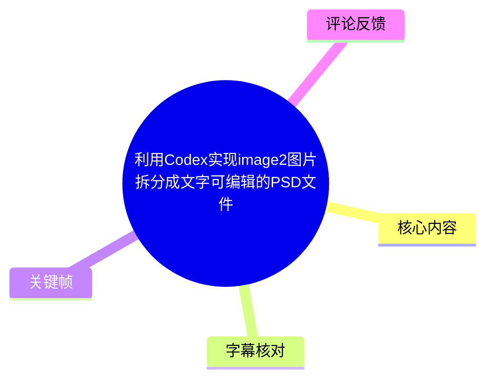
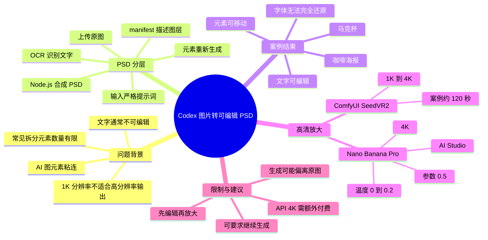
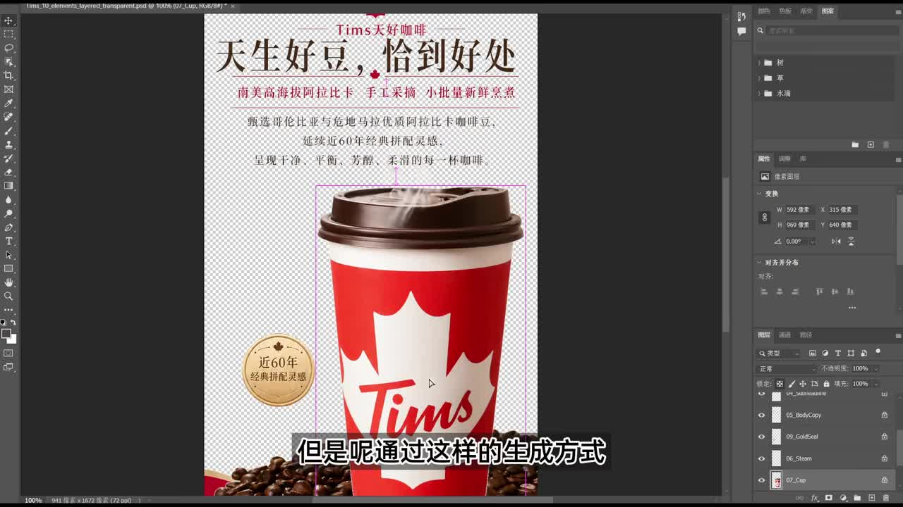
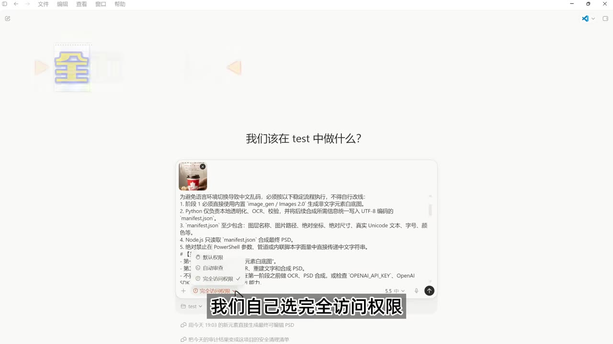
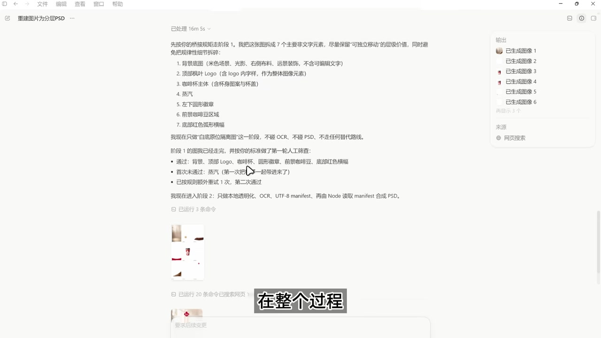
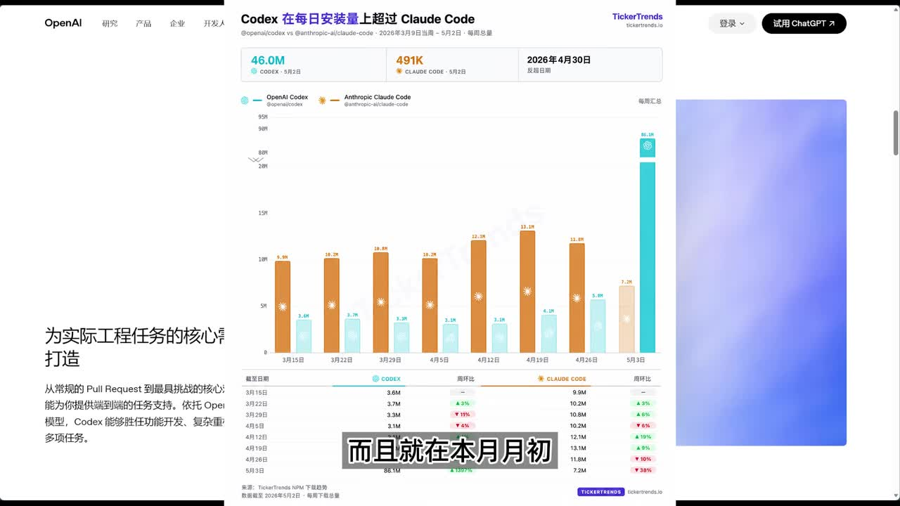

# 利用 Codex 实现 image2 图片拆分成文字可编辑的 PSD 文件

> 来源：[Bilibili 视频](https://www.bilibili.com/video/BV1TsGs6jEsJ)<br>
> UP 主：实验式｜视频时长：04:39｜合集：AIcode  
> 视频简介提供了提示词与工作流下载链接：<https://pan.quark.cn/s/797e945d62e1>

## 小结

视频展示了一条以 Codex 为核心的图片再拆分工作流：将一张由 GPT Images 2.0 等工具生成的海报或商品图，重新生成其中的视觉元素，并对文字进行 OCR 识别，最终组织为可在 Photoshop 中继续编辑的 PSD 分层文件。

作者提出的痛点是：常见的 AI 图片元素拆分方式，元素数量最多约不超过 10 个，且原图中的文字通常不可编辑。Codex 的价值不在于传统意义上的手工抠图，而在于把图片元素重建、文字 OCR、图层描述文件与 PSD 合成等环节串成自动化流程。

视频通过咖啡杯海报与马克杯两个案例验证结果：图像元素可被移动，文字可改；但字体无法保证 100% 还原。马克杯案例中还发生过一次生成中断，原因是生成结果与原图差异过大，作者通过要求其继续生成得到最终 PSD。

对于商用输出或打印需求，作者指出 GPT Images 2.0 常见直出为 1K 分辨率，不足以满足高分辨率需求。视频给出两种后处理放大方案：ComfyUI 中的 SeedVR2，以及 Google AI Studio 中的 Nano Banana Pro；两者均可将 1K 图放大至 4K，但后者的“重绘”倾向更明显。

关键经验是先完成图面编辑、PSD 分层与文字校改，再进行 4K 放大。若先放大再拆分，视频没有给出效果或成本验证，因此不应将其视为作者推荐的流程。

本视频中关于 Codex 功能、安装量、GPT Images 2.0 支持情况以及模型名称/可用性，均具有明显时效性，应以使用当日产品界面、定价与官方文档为准。视频的实际生成耗时也只是作者案例数据，不代表固定性能。

## 思维导图





## 目录

- [背景：AI 生图的拆分与文字编辑难题](#背景ai-生图的拆分与文字编辑难题)
- [Codex 分层思路与执行入口](#codex-分层思路与执行入口)
- [咖啡海报：生成可编辑 PSD 的结果](#咖啡海报生成可编辑-psd-的结果)
- [马克杯案例：中断与偏差修正](#马克杯案例中断与偏差修正)
- [1K 到 4K：SeedVR2 与 Nano Banana Pro 对比](#1k-到-4kseedvr2-与-nano-banana-pro-对比)
- [可复用操作流程与参数](#可复用操作流程与参数)
- [限制、风险与时效性](#限制风险与时效性)
- [关键帧索引](#关键帧索引)
- [字幕比对](#字幕比对)
- [评论分析](#评论分析)
- [处理记录](#处理记录)

## 背景：AI 生图的拆分与文字编辑难题 [00:00:37](https://www.bilibili.com/video/BV1TsGs6jEsJ?t=37)

作者在视频开头将需求定位为：把一张完整图片中的元素拆开，并将其中的文字转成可在 PSD 中编辑的文本图层。

视频陈述的现有问题包括：

1. 通过 GPT 生成图片元素以实现 PSD 分层的方式，生成元素数量“最多不超过 10 个”。
2. 图中的文字通常不可编辑。
3. 即使图层视觉上被分开，若文字仍是像素图，后续改文案、改字号或改内容仍不方便。
4. 图像生成模型常见输出为 1K 图，后续若面向打印或高分辨率商用输出，还需要额外放大。

作者将 Codex 描述为不仅服务于编程、也可用于工作自动化的 Agent。视频还提到“本月月初 Codex 每日安装量已超过 Claude Code”；这是作者引用页面中的趋势信息，视频没有展示独立的数据来源、统计口径或完整可核验链接，因而只能作为视频内陈述记录，不能据此得出产品市场份额结论。



> 图：关键帧直接呈现 Photoshop 中的分层结果。右侧图层面板与画布上的独立杯子、金色徽章、蒸汽、文字等内容，是理解“拆分后可移动”的主要视觉证据；但它不能单独证明所有图层均与原图完全一致。

## Codex 分层思路与执行入口 [00:00:38](https://www.bilibili.com/video/BV1TsGs6jEsJ?t=38)

视频称 Codex 已支持 GPT Images 2.0 图片生成，因此作者尝试在 Codex 中实现图面 PSD 分层。流程从上传一张圆形/海报式图片开始，然后选择权限并输入提示词执行。

作者演示中选择了“完全访问权限”。这意味着 Agent 可能具备更高的本地环境操作能力；视频将其用于简化演示，但并未讨论权限隔离、目录范围、密钥保护或代码审查。因此，在真实项目中不应因视频演示而默认授予完全访问权限。



> 图：该帧展示了作者向 Codex 下达任务时的界面，底部可见权限选项。它说明视频并非在 Photoshop 内手工拆图，而是把任务交由 Agent 执行；同时也提示高权限模式应按实际环境审慎选择。

从关键帧可辨识的提示词结构表明，作者对执行链路设置了较严格的约束，核心包括：

- 阶段 1：直接使用内置 `image_gen / Images 2.0` 生成为文字元素准备的白底图。
- Python：仅负责本地通信/服务相关环节，并使用 UTF-8 编码的 `manifest.json`。
- `manifest.json`：至少应包含图层名称、图片路径、绝对坐标、绝对尺寸、真实 Unicode 文本、字号、颜色等信息。
- Node.js：只读取 `manifest.json` 并合成最终 PSD。
- 禁止事项：不要在 PowerShell 参数、管道或内联脚本文字中直接传递中文字符串，以避免中文乱码或命令行环境切换问题。

上述内容来自画面中展示的提示词，部分局部字样受画面清晰度限制不宜逐字转录；但“UTF-8 manifest”“Node.js 合成 PSD”“避免 PowerShell 直接传递中文”的结构清晰可见。视频未公开完整提示词正文，完整版本应以视频简介链接中作者提供的文件为准。

## 咖啡海报：生成可编辑 PSD 的结果 [00:01:02](https://www.bilibili.com/video/BV1TsGs6jEsJ?t=62)

作者表示，由于提示词要求较严格、内容较长，本次咖啡海报案例耗时约 **16 分钟**，最终得到 PSD 文件。

作者对内部过程的说明是：

1. 对原图中的各个元素进行重新生成；
2. 对图中文字做 OCR 识别；
3. 将这些元素及文字组织到 PSD 中。

这里需要区分“分离”与“重建”：

- 视频描述的核心是**重新生成 + OCR**，不是展示基于原始像素边缘的传统精确抠图。
- 因此，结果是否接近原图，取决于生成模型对元素、构图与材质的复现程度。
- 文字能被编辑，得益于 OCR 和文本图层信息，而非把原图文字直接无损转换为原字体文件。

## 咖啡海报：可编辑性与字体限制 [00:01:26](https://www.bilibili.com/video/BV1TsGs6jEsJ?t=86)

作者在 Photoshop 中展示的结果为：

- 画面中的文字已变为可编辑状态；
- 文字以外的图层也已拆分，可独立移动；
- 字体不能做到 100% 还原；
- 即便字体不同，文字内容仍可在 Photoshop 中编辑和修改。

这意味着该方案更适合以下任务：

- 需要修改促销文案、标题、价格或短说明；
- 需要移动主体、装饰件、徽章、背景元素以重新排版；
- 需要将 AI 概念图转为可继续加工的设计初稿。

不适合直接视为以下任务的替代方案：

- 严格还原品牌标准字、商标字体或印刷级字距；
- 需要像素级复刻原始海报；
- 涉及版权素材、受保护商标或不能被重新生成替代的视觉资产。

## 马克杯案例：中断与偏差修正 [00:01:51](https://www.bilibili.com/video/BV1TsGs6jEsJ?t=111)

作者再展示一个马克杯案例，并沿用同一套提示词。该案例中，任务曾中断一次：作者判断生成结果与原图差距过大，于是要求 Codex 继续生成，最终得到 PSD 文件。

作者展示的最终结果是：

- 马克杯等元素可以移动；
- 图中文字可以编辑；
- 最终演示中没有出现明显的操作失败。

这一段提供了一个重要的实践经验：当自动化生成结果偏离原图时，不应把首次输出当作最终交付，应先检查元素、构图、文字识别和视觉一致性，再明确指出偏差并要求继续生成或重试。

不过，视频没有展示具体的追问文本、重试次数、失败日志、成本或每一步的图层质量。因此，“继续生成”可作为处理思路，但不能据此承诺每次均可自动修正。



> 图：该帧显示任务在分阶段推进，并列出若干已生成图像。它有助于理解该工作流会生成多个中间资产，而不是一次性直接输出完整 PSD；同时也反映出过程可能需要等待与复核。

## 1K 到 4K：SeedVR2 与 Nano Banana Pro 对比 [00:02:15](https://www.bilibili.com/video/BV1TsGs6jEsJ?t=135)

作者指出，使用 Images 2.0 制作图片时，通常得到的是 1K 图。若目标是打印或更高分辨率输出，1K 直出可能不够。

视频同时提到：通过 API 可以生成 4K 原图，但存在两个问题：

1. API 需要额外收费；
2. API 生成与前述拆分过程相对独立。

因此，作者推荐的顺序是：**先完成图面编辑，再进行高清放大**。

### 方案一：ComfyUI + SeedVR2 [00:02:39](https://www.bilibili.com/video/BV1TsGs6jEsJ?t=159)

作者给出的第一种方法是在 ComfyUI 中使用 **SeedVR2** 模型，将 1K 图片放大到 4K。

视频内案例参数与观察：

| 项目 | 视频信息 |
| --- | --- |
| 使用环境 | ComfyUI |
| 模型 | SeedVR2 |
| 输入/输出 | 1K 放大至 4K |
| 工作流复杂度 | 作者称“非常简单” |
| 案例耗时 | 约 120 秒 |
| 作者评价 | 放大效果尚可，未改变太多原图细节 |

作者的评价重点在“变化较小”：即放大结果相对保留了原图细节与构图。视频没有展示显存、模型版本、节点配置、采样参数、放大倍率实现细节或硬件环境，因此 120 秒不应作为其他设备的性能预期。

### 方案二：Google AI Studio + Nano Banana Pro [00:03:03](https://www.bilibili.com/video/BV1TsGs6jEsJ?t=183)

若不会使用 ComfyUI，作者提供了第二个更偏界面化的方案：在 Google AI Studio 中选择 **Nano Banana Pro** 进行放大。

视频明确给出的设置为：

| 设置项 | 作者建议/演示值 |
| --- | --- |
| 输出画质 | 4K |
| Temperature（温度） | 0～0.2 |
| 下方另一参数 | 0.5 |
| 处理耗时 | 约 1 分钟 |

ASR 未能准确识别“下方另一参数”的名称，画面素材也未提供该设置页的清晰关键帧，因此只能如实记录其数值为 **0.5**，不应擅自将其命名为特定 API 参数。

作者对该方案的对比结论是：

- 图片会变得更清晰；
- 相比 SeedVR2，重绘幅度略大；
- 大多数整体细节没有改变；
- 作者认为结果“可以勉强接受”。

因此，若更看重保持原构图、文字与产品细节，应优先自行测试 SeedVR2；若更看重低门槛操作，可评估 AI Studio 的方案，但必须检查是否发生了不希望的重绘。

## 可复用操作流程与参数 [00:00:38](https://www.bilibili.com/video/BV1TsGs6jEsJ?t=38)

以下流程按视频实际叙述顺序整理，未补充视频未展示的命令或节点配置。

### 1. 准备源图与目标

1. 选择需要继续编辑的海报、商品图或 AI 生成图。
2. 明确需要拆出的主体、装饰元素和文字区域。
3. 对品牌字体、Logo、精确文案等高保真要求建立人工复核预期。

### 2. 在 Codex 中提交分层任务

1. 上传原图。
2. 输入要求明确的提示词。
3. 按实际安全需求选择访问权限；作者演示选择完全访问权限，但这不是通用安全建议。
4. 要求任务按“图像元素重建—OCR—图层描述—PSD 合成”的顺序进行。

### 3. 约束文字与图层数据传递

提示词中应明确：

```text
- 文本与 manifest 文件统一使用 UTF-8。
- manifest 至少记录：图层名称、图像路径、绝对坐标、绝对尺寸、
  Unicode 文本、字号、颜色等。
- 由 Node.js 读取 manifest 并合成最终 PSD。
- 避免在 PowerShell 参数、管道或内联脚本中直接传递中文字符串，
  以降低中文乱码风险。
```

> 注：这是根据视频画面可辨识内容整理的约束要点，不是完整原始提示词，也不是可直接运行的代码。

### 4. 检查 PSD 成果

在 Photoshop 中逐项检查：

1. 每个视觉元素是否已独立成层并可移动；
2. 文案是否为可编辑文本，而非仅是一张文字图片；
3. OCR 得到的文字内容是否准确；
4. 字体、字号、颜色、位置与原图是否符合需要；
5. 是否存在重生成导致的主体形状、品牌标识或装饰细节偏差。

### 5. 对偏差执行追问或重试

若生成图与原图差异过大：

1. 标记偏差所在，例如杯子外形、构图、文字、背景或装饰件；
2. 要求继续生成或重新处理；
3. 复核新的 PSD，而不是仅检查预览图。

这是视频中马克杯案例实际采用的应对方式。

### 6. 完成编辑后再放大

- **SeedVR2 路线**：在 ComfyUI 内将 1K 放至 4K；作者案例约 120 秒。
- **Nano Banana Pro 路线**：在 Google AI Studio 选择模型，画质设为 4K，温度设为 0～0.2，视频中的另一参数设为 0.5；作者案例约 1 分钟。
- 放大完成后，再检查文字边缘、产品轮廓、小物件与细节是否被重绘。

## 限制、风险与时效性 [00:03:51](https://www.bilibili.com/video/BV1TsGs6jEsJ?t=231)

### 已被视频明确说明的限制

- **字体不能完全还原**：文字可编辑不等于字体、字形和排版与原图完全一致。
- **生成结果可能偏离原图**：马克杯案例需要继续生成才获得作者认可的结果。
- **1K 分辨率可能不足**：打印或高分辨率商用输出仍需后处理。
- **放大会带来重绘**：Nano Banana Pro 在作者案例中的重绘程度高于 SeedVR2。
- **API 4K 另有成本**：视频称 API 生成 4K 需要额外收费，但未给出具体价格。

### 视频未验证或未展开的事项

- 没有给出完整提示词、完整 Node.js/Python 项目代码和可复现目录结构；
- 没有给出 PSD 是否兼容所有 Photoshop 版本；
- 没有展示透明边缘、复杂遮挡、密集文字、特殊字体、长段落文字的成功率；
- 没有比较不同尺寸、不同风格图片的耗时与成本；
- 没有说明重生成素材的商用授权、第三方 Logo、字体与原图版权处理方式。

### 时效性说明

视频元数据显示发布时间为 2026 年 5 月。Codex、GPT Images 2.0、ComfyUI 模型、Google AI Studio 中可选模型、访问权限名称、价格与 API 能力都可能随产品更新而变化。尤其是视频中“Codex 日安装量超过 Claude Code”的趋势描述，只能视为当时视频所引用的信息，不能外推至当前状态。

## 关键帧索引

| 关键帧 | 对应内容 | 使用价值 |
| --- | --- | --- |
|  | Photoshop 内的咖啡海报分层 | 直观证明杯子、徽章、蒸汽、文字等可作为独立图层处理。 |
|  | Codex 与 Claude Code 的安装趋势页面 | 对应作者关于安装量的新闻式陈述；仅作为视频展示材料，不构成独立核验。 |
|  | Codex 任务输入与权限选择 | 支撑“以提示词约束自动化流程”及“完全访问权限”的演示事实。 |
|  | Codex 分阶段生成过程 | 展示任务会产生多个中间图像与阶段性输出，解释为何需等待和复核。 |

## 字幕比对

| 字幕来源 | 完整性 | 专有名词 | 时间轴 | 主要问题 |
| --- | --- | --- | --- | --- |
| Bilibili 站内字幕 | 未提供可用站内字幕，无法比对正文 | 无 | 无 | 素材明确标注未提供可用站内字幕。 |
| 本次 ASR 字幕 | 覆盖约 240.53 秒语音，覆盖率 86.27%；首段语音在 00:00:37.460 | 存在明显误识别 | 有效 SRT 时间轴，共 11 段 | 每段过长，混有同音/近音错误，如“Codec”“Config UI”“C 的 VR”“Nano 不 Nano”“提示池”等。 |

### 最终字幕选择与校正

本次采用**带时间戳的 ASR SRT**作为章节定位依据，所有章节时间均取自其真实分段起始时间；站内字幕不可用，无法进行双源文本合并。

ASR 诊断显示源文件具有正常音频识别结果，未标记 `noAudioStream=true`；因此不存在“源视频没有音轨”的情况。ASR 使用 `medium` 模型、中文识别，语言置信度为 `0.99951171875`。

结合视频标题、简介、标签与关键帧，对以下重要词语作了审慎规范化：

| ASR 结果 | 正文采用 | 校正依据 |
| --- | --- | --- |
| Codec / CodeX | Codex | 视频标题、简介、画面和上下文均指向 Codex。 |
| GPT images 2.0 / Images 2.0 | GPT Images 2.0 / Images 2.0 | 视频标题、简介及上下文。 |
| Config UI | ComfyUI | 视频简介及 AI 工作流语境。 |
| C 的 VR / SDVR | SeedVR2 | 视频简介标签含 `seedvr2`，并与放大模型语境一致。 |
| Nano 不 Nano Pro | Nano Banana Pro | 视频标签含 `banana`，且语境为 Google AI Studio 的图像处理模型。 |
| 提示池 | 提示词 | 中文语义与视频操作流程。 |
| Kong VR 工作流 | SeedVR2 工作流 | 与前述模型名称及简介“工作流”信息对应。 |

未能从字幕或关键帧确认的参数名称，正文未作臆测命名。

## 评论分析

仅获取到 2 条热评，未达到“前三条”的数量；以下仅分析可获取内容，不补写不存在的第三条评论。

1. **生擒舍友喂屎**（9 赞）：“八嘎[打call][打call] 潜心学习”  
   - 观点：以玩笑式表达表示正在学习或认可教程。  
   - 补充信息：没有提供工具设置、提示词、效果验证或技术纠错。  
   - 可信度：属于情绪反馈，不能作为工作流有效性的证据。

2. **云宠Cloudpet**（3 赞）：“只要是不主动要3连的,必须3连支持.”  
   - 观点：认可 UP 主未主动索要“三连”的表达方式，并表示支持。  
   - 补充信息：未涉及 Codex、PSD、放大模型或实际使用体验。  
   - 可信度：属于社区互动评价，不构成技术事实。

## 处理记录

- Worker ID：`worker-mrj0wjed-b0c290ad`
- 模型：`gpt-5.6-terra`
- 可用素材与工具产物：视频元数据、12 个关键帧路径、ASR 结果 JSON、ASR SRT、ASR 覆盖诊断、热评 JSON；ASR 模型为 `medium`，运行于 CUDA、`float16`。
- 字幕选择：站内字幕未提供可用内容；已检查并采用本次 ASR 的带时间戳 SRT 作为时间轴依据，同时以标题、简介、标签与关键帧校正明显专有名词误识别。
- 时间轴依据：正文链接使用 ASR SRT 的真实起始时间换算秒数，包括 37、38、62、86、111、135、159、183、231、255 秒；未按文字顺序猜测时间。
- 关键帧选择依据：`frame-001` 用于验证 Photoshop 分层与可移动元素；`frame-002` 对应视频中的安装趋势陈述；`frame-003` 用于说明 Codex 提示词与权限选择；`frame-004` 用于说明分阶段生成过程。未对未提供画面内容的其余帧作视觉细节编造。
- 热评范围：仅处理接口实际返回的前 2 条热评；第 3 条未获取，不补充推断。
- 缓存清理：提供的素材中未包含缓存清理执行日志，无法验证是否已清理；本记录不虚构清理结果。
- 未解决问题：完整提示词、SeedVR2 的 ComfyUI 节点工作流、Nano Banana Pro 中参数 `0.5` 的确切字段名称、实际 API 定价及不同图片类型下的复现成功率，均未在素材中完整提供。
