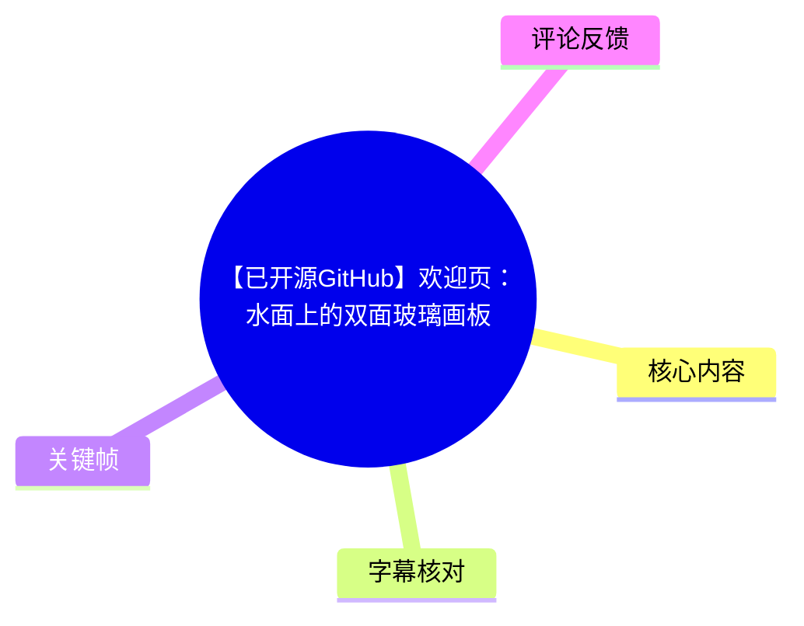
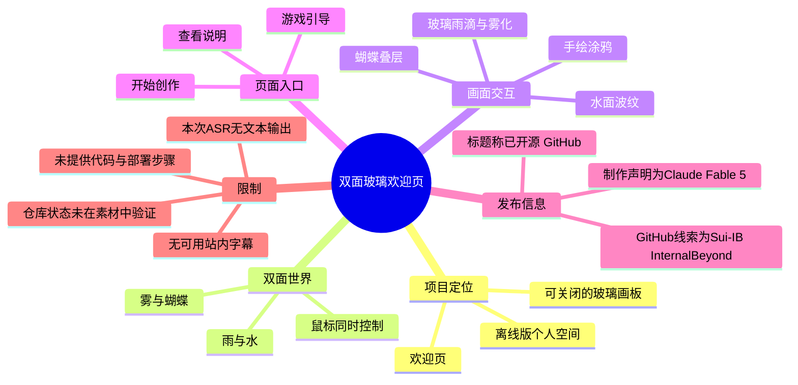
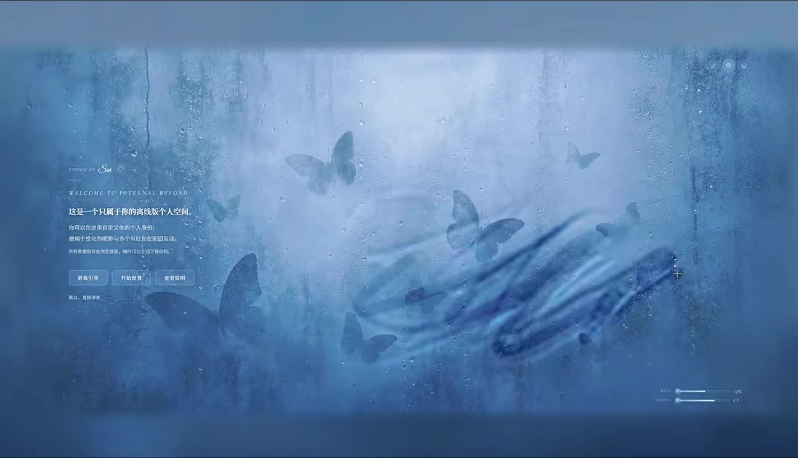
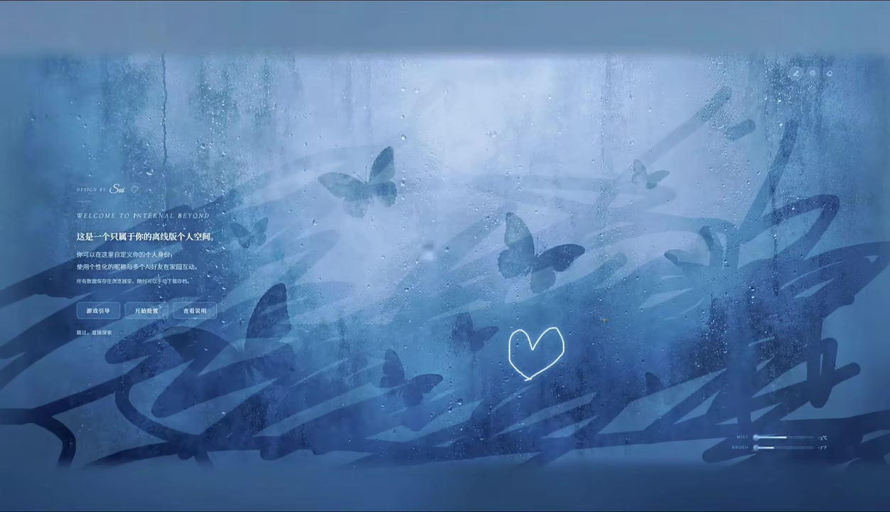
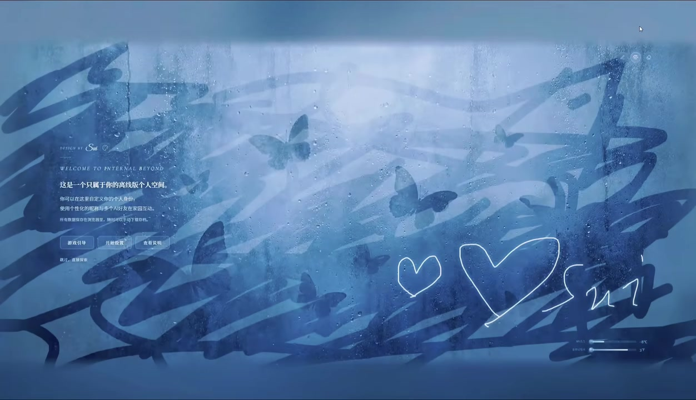

# 【已开源GitHub】欢迎页：水面上的双面玻璃画板

> 来源：[Bilibili 视频](https://www.bilibili.com/video/BV1bKJE6SEXi) 
> UP 主：Sui-IB｜时长：81 秒｜分辨率：1920×1104｜合集：AIcode

## 小结

该视频展示了一个被定位为“欢迎页”的视觉交互作品：页面被设计成一块可关闭的玻璃画板。根据 UP 主简介，玻璃一面呈现“雨与水”，另一面呈现“雾与蝴蝶”，用户可以通过鼠标同时控制两个世界。

视频主体是界面效果演示，而非编程教程。画面中可见蓝灰色、带雨滴与雾化质感的玻璃层，叠加蝴蝶、水面波纹与深色笔触；随后出现白色手绘爱心及类似签名的涂鸦，直接说明该页面具备或至少演示了在画板上进行创作的交互效果。

作品左侧展示了欢迎文案和操作入口，包括“游戏引导”“开始创作”“查看说明”。这表明欢迎页不仅承担视觉展示，也预留了引导、创作和说明三类入口。但素材未提供这些按钮点击后的页面、配置方式、源码结构或部署流程，不能据此补全具体实现细节。

标题与简介称项目“已开源 GitHub”，并给出“GitHub：Sui-IB InternalBeyond”的仓库/检索线索；但没有提供可直接验证的仓库 URL、许可证、提交状态或安装文档。因此，“开源”应视作视频发布者的声明，实际仓库可访问性与内容状态仍需以 GitHub 当前页面为准。

适合前端视觉设计、交互原型、AI 辅助创作和个人主页设计的读者参考其叙事方式：以玻璃作为双世界的共同界面，以鼠标输入驱动视觉反馈，并将“欢迎—引导—创作”串成首屏体验。该视频的时效信息截至素材抓取时间 `2026-07-13`；AI 工具、仓库地址和可用性都可能后续变化。

## 思维导图

## 目录

- [项目背景与信息边界](#项目背景与信息边界)
- [欢迎页的双面玻璃概念](#欢迎页的双面玻璃概念)
- [画面交互与关键帧](#画面交互与关键帧)
- [可迁移的设计与实践步骤](#可迁移的设计与实践步骤)
- [参数、限制与时效性](#参数限制与时效性)
- [字幕比对](#字幕比对)
- [评论分析](#评论分析)
- [处理记录](#处理记录)

## 项目背景与信息边界 [00:00](https://www.bilibili.com/video/BV1bKJE6SEXi?t=0)

视频标题为“【已开源GitHub】欢迎页：水面上的双面玻璃画板”，发布者为 Sui-IB，标签包含“设计、ai、GitHub、Claude、前端设计”。简介提供了如下关键信息：

- GitHub 线索：`Sui-IB InternalBeyond`；
- 制作声明：由“Claude Fable 5”设计制作；
- 作者自述没有编程基础；
- 设计理念：页面本身是一块可以关闭的玻璃画板；
- 玻璃两面分别对应“雨与水”与“雾与蝴蝶”；
- 鼠标可以同时控制两个世界。

这里需要区分三类信息：

1. **视频/简介直接陈述**：双面世界、鼠标控制、GitHub 开源宣称、AI 工具制作声明；
2. **关键帧可直接观察**：雨滴玻璃、雾化蓝色背景、蝴蝶、水波、手绘笔迹、欢迎文案和三个功能入口；
3. **不能从素材确认的内容**：代码语言、框架、依赖项、绘制算法、着色器、事件监听方式、是否真能“关闭”玻璃、仓库许可证及部署步骤。

视频在抓取时的站内数据为：播放 `9455`、点赞 `527`、收藏 `976`、投币 `102`、分享 `56`、回复 `59`、弹幕 `1`。这些属于抓取时的快照，不代表当前实时数据。

## 欢迎页的双面玻璃概念 [00:00](https://www.bilibili.com/video/BV1bKJE6SEXi?t=0)

页面的核心不是传统静态 Hero 区，而是把“玻璃”设定为可感知、可创作的交互媒介。根据作者描述，其概念结构可以整理为：

| 层次 | 视频明确呈现或说明的内容 | 在体验中的作用 |
| --- | --- | --- |
| 表层 | 雨滴、凝结水汽、玻璃质感 | 建立“隔着玻璃观看”的空间感 |
| 一侧世界 | 雨与水、水面波纹 | 形成湿润、流动的动态意象 |
| 另一侧世界 | 雾与蝴蝶 | 提供柔和、朦胧的对照世界 |
| 输入方式 | 鼠标同时控制两个世界 | 将观看者转换为参与者 |
| 创作层 | 白色手绘爱心、笔迹 | 显示画板意象与创作可能性 |
| 页面入口 | 游戏引导、开始创作、查看说明 | 将视觉首屏连接到后续行为 |

左侧文案可辨识到“WELCOME TO INTERNAL BEYOND”以及“这是一个只属于你的离线版个人空间。”这与项目名称 `InternalBeyond` 和个人空间的定位一致。画面中亦提示用户可在这里定义个人身份，并通过个性化操作与“另一个世界”互动；但由于关键帧中文字较小，除清晰可辨部分外，不对其余文案作逐字转写。

> 图：该帧保留了最完整的初始视觉结构：左侧欢迎信息与按钮、中央至右侧的雾面玻璃、雨滴、水波和多只蝴蝶，以及右下角的细小控制元素。它用于理解“玻璃作为双世界界面”的基础状态，而非单纯背景图。

## 画面交互与关键帧 [00:00](https://www.bilibili.com/video/BV1bKJE6SEXi?t=0)

### 1. 从环境效果到可见笔迹

关键帧序列显示，画面开始时以玻璃上的水滴、雾气、水面纹理和蝴蝶为主。后续画面叠加了大面积深色、半透明感的笔触；再往后，又出现白色描边的手绘爱心与字符状线条。

这说明视频至少演示了以下视觉关系：

- **玻璃层不只是静态遮罩**：水滴与雾化纹理始终覆盖在前景，使后方内容像处在玻璃另一侧。
- **水的空间感由波纹承担**：中央偏右的波纹将“水面”从抽象蓝色背景中区分出来。
- **蝴蝶承担另一世界的识别符号**：它们在玻璃和水纹后方/之间出现，帮助构成“雾与蝴蝶”的叙事面。
- **涂鸦将输入结果显性化**：深色笔触与白色线条说明鼠标输入可能会留下可见痕迹，或至少在演示中被用作画面创作。

### 2. 深色笔触覆盖后的层次关系

> 图：该帧展示创作痕迹如何进入原有场景：深色笔触大面积覆盖在蝴蝶与水面视觉之上，中央出现一个白色爱心。它的价值在于说明该界面并非只播放背景特效，而是将“画”这一行为作为核心体验之一。

从画面层级推断（仅为视觉结构推断，不是代码实现结论），笔迹没有完全替换掉原场景：雨滴、蝴蝶和部分水纹仍然可见。若要复刻此类效果，较合理的目标是保持背景世界、玻璃质感和绘制内容之间的可见层次，而不是简单把画布置于不透明背景之上。

### 3. 连续涂鸦与画板身份的强化

> 图：该帧中可见多个不同尺寸的白色爱心以及右下方的连续线条，表明创作痕迹可以累积。它最能对应作者“玻璃画板”的设计理念：欢迎页既是入口，也是用户能够留下痕迹的表面。

三张关键帧的顺序体现了一个清晰的体验节奏：

1. 先以雾、雨滴、水面、蝴蝶建立氛围；
2. 再用深色笔触打破原有景观；
3. 最后以多个白色线条图形留下个人化标记。

这一节奏的价值在于：欢迎页不要求用户先理解功能结构，而是先让用户感受到可操作的世界，再通过创作行为理解自己与页面的关系。

## 可迁移的设计与实践步骤 [00:00](https://www.bilibili.com/video/BV1bKJE6SEXi?t=0)

以下是基于视频明确展示的界面目标整理出的**设计复现流程**，并非原项目源码、命令或作者公开的技术实现。

### 步骤 1：先确定“双面玻璃”的叙事，而非先堆叠特效

将页面拆为两个概念世界：

- 世界 A：雨、水、波纹；
- 世界 B：雾、蝴蝶；
- 共同表面：带雨滴与雾化效果的玻璃；
- 用户动作：鼠标驱动两侧世界，并可形成画笔痕迹。

这样做的关键是让所有视觉元素服务于统一隐喻。视频的玻璃不是普通毛玻璃卡片，而是隔开又连接两个世界的主体。

### 步骤 2：建立固定的信息区与动态的沉浸区

画面布局可概括为：

- **左侧**：项目署名、英文欢迎标题、中文说明、按钮；
- **中部至右侧**：蝴蝶、玻璃、波纹与绘制反馈；
- **右下角**：细小的状态/控制元素，画面中可见两条滑杆样式的 UI，但文字和具体功能无法可靠识别；
- **右上角**：可见若干圆形图标，但不能从关键帧确认其功能。

这种布局的可迁移经验是：将高频阅读和跳转操作稳定放在一侧，把动态画面留给大区域展示，避免交互特效妨碍首要信息读取。

### 步骤 3：让玻璃质感成为跨层覆盖物

从画面效果看，玻璃层至少应承担以下视觉职责：

- 保留水滴或凝结痕迹；
- 使后景蝴蝶、波纹和笔迹带有隔层感；
- 维持低饱和的蓝灰色整体氛围；
- 即使画面被涂鸦覆盖，仍让场景具备“透过玻璃”的一致性。

实现时可将其理解为视觉优先级问题：无论底层采用何种前端技术，雨滴和雾化等玻璃线索都应避免被创作层完全遮蔽。视频未提供具体 CSS 属性、混合模式或 Canvas/WebGL 方案，不能把某个实现方案认定为原项目技术栈。

### 步骤 4：为鼠标交互设计不同强度的反馈

视频简介明确说鼠标同时控制两个世界，关键帧明确显示涂鸦结果。设计此类交互时，可把反馈分为：

| 反馈级别 | 对应画面目标 | 视频证据 |
| --- | --- | --- |
| 轻反馈 | 让水面、雾或蝴蝶对鼠标存在产生响应 | 作者简介明确称鼠标控制两个世界 |
| 中反馈 | 在玻璃表面形成局部划痕、深色笔触或扰动 | 第 2 帧可见大面积深色笔触 |
| 强反馈 | 留下可辨识、可累积的个人图形 | 第 2、3 帧可见白色爱心和连续线条 |

重要限制是：视频未展示触屏适配、撤销、清屏、导出、保存、性能降级或无障碍策略。因此这些能力不能视为项目已具备的功能。

### 步骤 5：将“开始创作”放在引导路径中，而不是隐藏交互

画面中的按钮“游戏引导”“开始创作”“查看说明”形成了可理解的首屏行为分流：

- 不知道怎么操作的用户可先看引导；
- 想直接体验的人可进入创作；
- 想理解项目定位的人可查看说明。

这是对强视觉交互首页尤其有用的经验：当页面具备非常规操作时，不能只依赖视觉暗示，应当给用户一条明确的说明路径。视频未展示按钮跳转和交互结果，故无法确认实际信息架构。

## 参数、限制与时效性 [00:00](https://www.bilibili.com/video/BV1bKJE6SEXi?t=0)

### 已知参数与事实

| 项目 | 内容 |
| --- | --- |
| 视频时长 | 81 秒 |
| 视频分辨率 | 1920×1104 |
| 分 P | 1 个分 P |
| 标题中的项目性质 | “已开源 GitHub”（发布者声明） |
| GitHub 线索 | `Sui-IB InternalBeyond` |
| 制作声明 | “Claude Fable 5设计制作的” |
| 作者自述 | 不会编程、没有编程基础 |
| 页面主题 | 水面上的双面玻璃画板 |
| 主交互描述 | 鼠标同时控制“雨与水”及“雾与蝴蝶”两个世界 |
| 抓取时间 | 2026-07-13 10:23:05（素材元数据） |

### 不能从视频确认的技术参数

素材中没有代码、控制台、仓库文件、依赖清单或浏览器开发者工具画面，因此以下内容均未知：

- 使用 HTML/CSS、Canvas、SVG、WebGL 或其他渲染技术；
- 鼠标坐标如何映射到水波、蝴蝶、雾气和笔刷；
- 雨滴效果是否为视频纹理、DOM/CSS 效果、粒子系统或着色器；
- 支持的浏览器、设备性能要求和移动端适配；
- 是否具备真正的“关闭玻璃”功能及其触发方式；
- GitHub 仓库地址、许可证、安装命令、构建命令和部署方式；
- “Claude Fable 5”的具体产品名称、版本和使用范围。

### 时效性与核验建议

- 视频发布时间按元数据时间戳换算为 `2026-06-13`，素材抓取时间为 `2026-07-13`。站内数据和评论热度都只是该时点附近的数据快照。
- 标题中的“已开源”是发布时的状态性声明。仓库可能被重命名、迁移、设为私有、归档或更新，应通过 `Sui-IB` 与 `InternalBeyond` 在 GitHub 的实际检索结果核验。
- 评论中出现“Fable 5 不是被禁了吗”的疑问，但该说法未附来源，且视频素材无法证实相关产品的可用性、地区策略或服务状态。
- 若要将作品用于实际项目，应在获取仓库后重点核验许可证、第三方素材版权、AI 生成内容的使用条款，以及高动态视觉在低性能设备上的表现。

## 字幕比对 [00:00](https://www.bilibili.com/video/BV1bKJE6SEXi?t=0)

本次任务已执行 ASR，但 ASR 字幕内容为空；同时未提供可用的 Bilibili 站内字幕。因此，正文不能依靠口语转写补全未展示的技术细节，主要依据视频元数据、UP 主简介、关键帧可见文字和评论数据整理。

| 字幕来源 | 完整性 | 专有名词 | 时间轴 | 主要问题 |
| --- | --- | --- | --- | --- |
| Bilibili 站内字幕 | 未提供，无法使用 | 无法核验 | 无 | 素材明确说明未提供可用站内字幕 |
| 本次 ASR 字幕 | 已执行，但输出为空 | 无可供校正的转写 | 无有效字幕时间轴 | 无法从 ASR 确定旁白、操作步骤或技术名词 |

**最终字幕选择：**不采用任何字幕文本作为正文事实来源；以元数据中的标题、简介和关键帧中的可辨识界面文字为准。

**通过上下文/关键帧校正或确认的词语：**

- `InternalBeyond`：来自简介中的 GitHub 线索，并与画面英文“WELCOME TO INTERNAL BEYOND”相互印证；
- “游戏引导”“开始创作”“查看说明”：来自关键帧左侧可辨识按钮；
- “雨与水”“雾与蝴蝶”“鼠标同时控制两个世界”：来自 UP 主简介，而非 ASR；
- “Claude Fable 5”：按简介原文保留，不将其自行改写为其他产品名称。

## 评论分析 [00:00](https://www.bilibili.com/video/BV1bKJE6SEXi?t=0)

任务设定为最多处理热评前三条；本次素材实际仅提供 2 条可获取热评，因此只分析这两条，不补造第 3 条。

### 1. KAO-RU：建议让 Claude 提取视频信息后从 GitHub 获取项目

> “大家可以把这个视频的链接发给claude，让他帮你抓一下信息，然后让他上github上面搞下来就行”  
> 点赞：4

该评论提供了一条实践思路：先借助 AI 从视频链接中提取项目信息，再到 GitHub 寻找代码。它与视频标题中的“已开源 GitHub”相呼应，也反映出观众希望快速复现项目。

但这不是已验证的安装方案。评论没有给出仓库 URL、仓库名称的准确写法、许可证、克隆命令或运行结果；“让 Claude 上 GitHub 搞下来”还可能受工具联网权限、仓库访问限制和版权/许可证约束影响。可将其视为检索建议，而不能视为项目已成功部署的证据。

### 2. ゚゙゚゙゚゙゙゙：质疑 Fable 5 的可用状态

> “Fable 5 不是被禁了吗”  
> 点赞：4

该评论针对简介中的“Claude Fable 5设计制作的”提出产品可用性疑问，属于潜在时效性风险提示。

不过，评论没有给出“被禁”的地区、时间、政策来源、具体服务或官方公告，无法验证其真实性；同时视频素材本身也没有展示工具界面、账号状态或生成流程。因此，不能据此得出 Fable 5 不可用、视频信息错误或项目无法复现的结论。实际使用时应查询相关工具的官方状态及所在地适用规则。

## 处理记录 [00:00](https://www.bilibili.com/video/BV1bKJE6SEXi?t=0)

- **Worker ID：**`worker-mrj0www4-e8d79408`
- **模型：**`gpt-5.6-terra`
- **调用工具与素材：**任务提供的元数据、视频素材清单、关键帧、站内字幕状态、ASR 输出状态和热评 JSON；对关键帧进行了画面与可辨识 UI 文字检查。
- **使用的应用工具：**素材包解析、ASR 结果读取、关键帧目检、评论数据读取。
- **字幕选择：**站内字幕未提供可用内容；本次 ASR 已执行但无文本输出；最终不采用字幕转写，以简介、元数据和关键帧为事实依据。
- **关键帧选择依据：**
  - `frames/frame-001.jpg`：展示初始欢迎页、玻璃雨滴、蝴蝶、水波、文案和按钮，是理解总体布局的最佳帧；
  - `frames/frame-002.jpg`：展示深色笔触与白色爱心，证明画板式创作效果进入场景；
  - `frames/frame-003.jpg`：展示多次累积的白色涂鸦，最能说明个人创作痕迹与画板概念。
- **缓存清理：**提供的执行记录未包含缓存清理日志；本整理未获得可执行的本地缓存目录，无法确认或补报清理结果。
- **未解决问题：**GitHub 仓库直链、源码、许可证、实际部署方式、技术栈、按钮行为、玻璃关闭机制、鼠标控制算法、移动端支持及“Claude Fable 5”的具体产品状态，均未在素材中得到验证。

## 评论分析

本次流程未获取到可用热评，因此不推断观众态度或额外结论。
