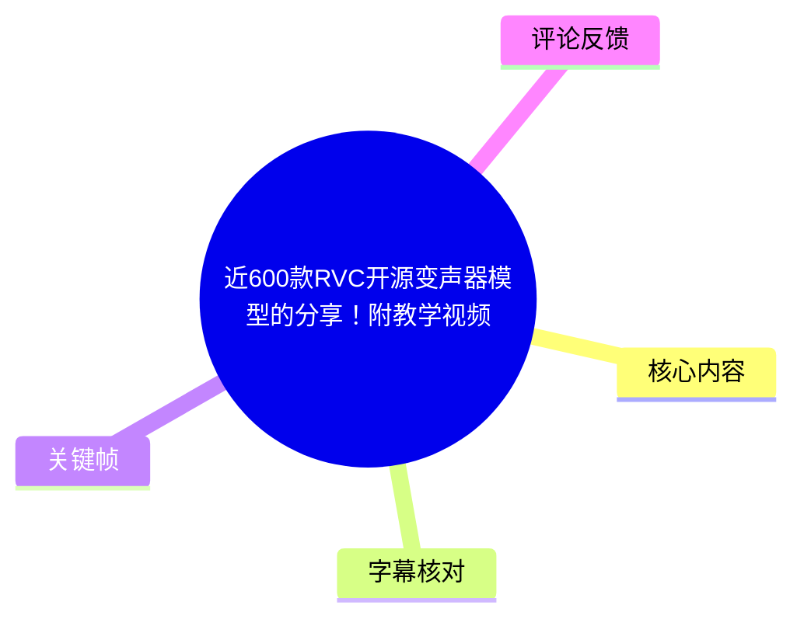
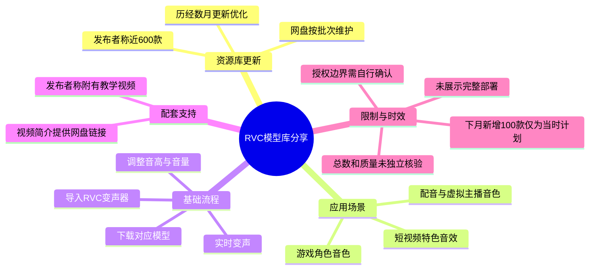
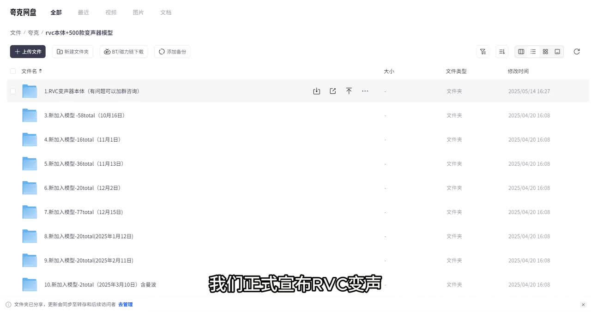
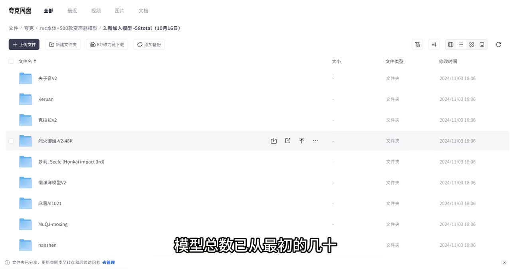
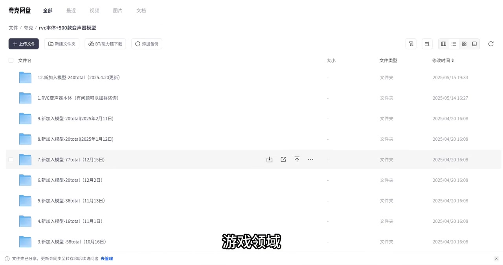
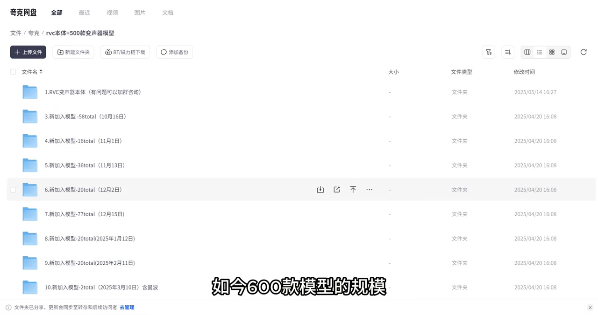

# 近600款RVC开源变声器模型的分享！附教学视频

> 来源：[Bilibili 视频](https://www.bilibili.com/video/BV1jnTfzbEju)  
> UP 主：连山AI前线｜发布时间：2025-06-12｜视频时长：91 秒｜合集：AIcode

## 小结

本视频是一次 RVC 变声器模型资源库的更新与分享公告。UP 主称模型库经过数月更新、优化，规模已从早期的几十或数百款扩展到目前约 600 款；视频简介提供了资源链接：<https://pan.quark.cn/s/df5642c6567b>。

资源用途被概括为三类：游戏角色音色、短视频创作所需的特色音效，以及专业配音方向的名人声线、虚拟主播定制音色等。画面直接展示的是夸克网盘中的模型目录与分批次文件夹，而非 RVC 软件的完整操作界面。

视频给出的实际使用路径为：下载对应模型文件、导入 RVC 变声器、启用实时变声，并按需要调整音高、音量等参数。该视频没有展示模型文件格式、软件版本、安装步骤、导入目录、硬件要求、延迟数据或具体参数值，因此它更适合作为资源入口和基础工作流说明，不能替代完整部署教程。

“近 600 款”“所有音色经过严格测试”“可满足绝大多数变声需求”等属于发布者陈述。关键帧可确认网盘以“新增模型”批次维护资源，但无法独立核验模型总数、音色质量、链接有效性、模型来源或授权边界。

视频还表示计划在“下个月”新增 100 款音色。该表述以 2025-06-12 的发布时间为基准，约指 2025 年 7 月的计划；素材未提供后续确认，不能据此认定资源库现已达到 700 款。

## 思维导图

## 目录

- [资源库更新、网盘结构与数量表述](#资源库更新网盘结构与数量表述)
- [应用场景与模型分类](#应用场景与模型分类)
- [RVC 使用流程、参数与缺失信息](#rvc-使用流程参数与缺失信息)
- [教学支持、更新计划与时效性](#教学支持更新计划与时效性)
- [结论与限制](#结论与限制)
- [字幕比对](#字幕比对)
- [评论分析](#评论分析)
- [处理记录](#处理记录)

## 资源库更新、网盘结构与数量表述 [00:28](https://www.bilibili.com/video/BV1jnTfzbEju?t=28)

本次 ASR 的首段有效时间为 **00:00:28,360—00:00:29,940**。在这一段及其紧接的后续语音中，UP 主宣布 RVC 变声模型库“完成全面升级”，称其经过数月持续更新与优化，模型数量已由最初的几十、数百款扩展至目前约 600 款；并称会“每隔几月”进行一次较大规模更新。

视频画面展示夸克网盘目录，路径文字可见为“夸克 / rvc本体+500款变声器模型”。根目录中可见：

- `1.RVC变声器本体（有问题可以加群咨询）`；
- `3.新加入模型-58total（10月16日）`；
- `4.新加入模型-16total（11月1日）`；
- `5.新加入模型-36total（11月13日）`；
- `6.新加入模型-20total（12月2日）`；
- `7.新加入模型-77total（12月15日）`；
- 以 2025 年 1 月、2 月、3 月等日期标记的后续新增批次；
- `12.新加入模型-240total（2025.4.20更新）`。

这些目录名称能够说明资源以“RVC 本体 + 多个新增模型批次”的方式维护。但画面路径仍写有“+500款”，而口述与画面字幕均提到“600款模型”的规模，二者存在版本标记或统计口径差异。仅凭当前画面，不能将各目录名称中的数字直接相加，也不能精确验证模型总数。

> 图：画面展示“rvc本体+500款变声器模型”根目录，包含 RVC 变声器本体与多个“新加入模型”文件夹。该关键帧的价值在于直接确认资源以网盘目录和批次文件夹方式组织，同时提示根目录名称与视频口述“600款”之间存在版本标记差异。

> 图：画面进入“3.新加入模型-58total（10月16日）”目录，可见多个以人物、角色或名称命名的子文件夹。它说明一个更新批次中包含多个独立条目，但没有展开文件内容，无法确认每个条目的模型格式、完整性或授权状态。

## 应用场景与模型分类 [00:29](https://www.bilibili.com/video/BV1jnTfzbEju?t=29)

依据 ASR 的 **00:00:29,940—00:00:54,120** 分段，视频将资源库主要用途归纳为三类：

1. **游戏领域**：覆盖热门游戏的角色音色。
2. **短视频创作**：为创作者提供特色音效相关选择。
3. **专业配音领域**：包含名人声线、虚拟主播定制音色等资源。

视频将这三类方向描述为资源库的主要覆盖范围，但未列出完整目录，也没有逐项演示任何模型。因此，“覆盖热门游戏”“包含名人声线”等应理解为 UP 主对资源内容的介绍，不代表涵盖全部游戏、角色、人物或主播声线。

涉及现实人物、游戏角色、虚拟主播等声线时，视频未提供模型训练来源、权利人许可、使用范围或商用授权说明。即使视频标题使用“开源变声器模型”的表述，也不能据此默认任意模型均可自由转载、公开发布、商业使用或用于拟冒充。使用者仍需自行核验模型来源、平台规范及相关授权。

> 图：网盘目录按修改时间显示，顶部可见“12.新加入模型-240total（2025.4.20更新）”，下方保留多个此前批次。该图支持“资源存在阶段性扩充”的描述；其中的 `240total` 未被视频定义为单次新增量、目录内总量或全库统计，不能与“600款”直接等同或相加。

## RVC 使用流程、参数与缺失信息 [00:29](https://www.bilibili.com/video/BV1jnTfzbEju?t=29)

在 ASR **00:00:29,940—00:00:57,380** 所覆盖的语音中，视频给出的使用流程可以整理为以下四步：

1. **下载对应文件**：从资源库选择所需的模型文件并下载。
2. **导入 RVC 变声器**：将下载文件导入 RVC 变声器后使用。
3. **使用实时变声**：UP 主称系统支持实时变声功能。
4. **微调输出效果**：可对音高、音量等参数进行调整，以追求更自然、流畅的输出。

其中，视频明确说到的参数仅包括：

| 参数 | 视频中的用途表述 | 视频未提供的信息 |
| --- | --- | --- |
| 音高 | 可微调 | 数值范围、推荐值、不同角色的适配规则 |
| 音量 | 可微调 | 数值范围、增益策略、爆音或削波处理 |
| 实时变声 | 系统支持 | 具体软件、声卡设置、延迟、CPU/GPU 占用和兼容性 |

UP 主还称所有音色经过严格测试，变声效果真实、自然，可用于日常娱乐或专业创作。这是发布者的质量判断，视频没有提供可复现实验材料，例如测试语料、原始音频、对比样本、采样率、推理框架、音高提取算法、显卡型号、延迟测量或不同模型的推荐配置。

因此，以下关键部署信息不能从本视频得出：

- 模型的文件扩展名及是否存在索引文件；
- RVC 变声器的具体发行版、版本号与下载位置；
- 模型应导入的目录或界面操作；
- 是否需要 Python、CUDA、虚拟声卡或额外依赖；
- 实时推理所需的硬件条件与延迟表现；
- 遇到导入失败、失真、爆音或音高异常时的处理方式。

> 图：画面再次展示 RVC 本体目录与多批次模型文件夹，画面字幕中出现“如今600款模型的规模”。它有助于对应视频的规模宣称和资源入口，但并未展示实际导入界面或调参面板，因此不能作为完整操作教学的证据。

## 教学支持、更新计划与时效性 [00:59](https://www.bilibili.com/video/BV1jnTfzbEju?t=59)

ASR 在 **00:00:59,300—00:01:17,620** 中记录到：UP 主考虑到部分用户不会使用 RVC 变声器，因此“还为大家放了教学视频”；并表示未来会继续扩充模型库，计划在“下个月”新增 100 款音色。

需要区分视频已经展示的内容与未来计划：

- **已展示或可从素材确认**：视频简介含夸克网盘链接；画面展示 RVC 本体目录和多个新增模型批次；口述说明了下载、导入、实时变声和调参的基本路径。
- **发布者的未来计划**：在发布当时的“下个月”新增 100 款音色。
- **素材不能确认的事项**：教学视频的具体位置、内容、可访问性、是否与当前模型包匹配，以及新增 100 款是否已经实际完成。

视频发布时间为 **2025-06-12**，因此“下个月”约对应 **2025 年 7 月**。本次素材抓取于 2026-07-16，但未提供后续官方更新公告或完整目录快照；热评中对“是否已有七百款”的提问也只是观众推测，不能作为更新已完成的证据。

## 结论与限制 [00:59](https://www.bilibili.com/video/BV1jnTfzbEju?t=59)

这条视频的实际价值在于提供一个 RVC 模型资源库线索，并交代最基础的使用逻辑：选取模型、下载、导入 RVC 变声器、使用实时变声、调节音高和音量。对于寻找游戏角色、短视频音效或配音方向音色的用户，它可以作为资源检索入口。

阅读和实践时应明确区分以下层次：

- **画面和语音可直接支持的信息**：存在夸克网盘资源入口；网盘中可见 RVC 本体及多个模型更新批次；视频提供了下载、导入和调参的概括性流程。
- **发布者主张、未被素材独立验证的信息**：模型总量约 600 款、全部音色经过严格测试、效果真实自然、能够满足绝大多数变声需求。
- **视频未提供的信息**：完整安装教程、模型格式、兼容性、实时延迟、性能需求、具体参数、模型质量差异、链接长期有效性及权利授权范围。

模型库内容、数量、网盘链接和配套教学资源均可能变化。尤其是人物、角色、主播等辨识度较高的声线，使用前应确认来源与授权，避免未经许可的商业化、误导性传播或身份冒充。

## 字幕比对

| 字幕来源 | 完整性 | 专有名词 | 时间轴 | 主要问题 |
| --- | --- | --- | --- | --- |
| Bilibili 站内字幕 | 未提供可用文本 | 无法核验 | 无法使用 | 素材清单中的字幕获取过程记录了 `Invalid URL` 警告，未产出可比对的站内字幕。 |
| 本次 ASR 字幕 | 检出语音区间为 28.36—77.62 秒，语音覆盖约 47.34 秒 | 可识别 RVC、音高、音量等核心词 | 提供 4 段带起止时间的 SRT | 存在“变生器/变身器”“模型裤”“游西”“规谋”“专页”等错识；首段仅 1.58 秒但文本极长，分段粒度异常。 |

本次 ASR 已被检查。其使用 `medium` 模型进行中文识别，语言概率为 `0.9970703125`，运行设备为 CUDA、计算类型为 `float16`。诊断信息中**没有** `noAudioStream=true` 标记，且产物包含 `audio/audio.wav`；因此源视频存在音轨，不应视为无音轨视频或工具失败。

最终正文的时间轴采用本次 ASR SRT 的真实起止时间；因站内字幕不可用，无法进行逐句对照。对于明显的 ASR 词形错误，结合视频标题、标签、画面文字与上下文进行了最小限度校正：

- `RV C`、`RVC`：统一为 **RVC**；
- `变生器`、`变身器`：依据标题与标签，统一为 **变声器**；
- `模型裤`：校正为 **模型库**；
- `游西`：校正为 **游戏**；
- `规谋`：校正为 **规模**；
- `专页创作`：校正为 **专业创作**。

由于 ASR 首段的时间长度和文本密度明显不匹配，本文没有把该段进一步拆分为未经字幕时间戳支持的细粒度时间点。

## 评论分析

以下仅处理本次可获取的热评前三条。评论反映的是观众诉求、猜测或反馈，均不构成模型库内容的已验证事实。

1. **倦怠的青春（获赞 2）：「求一个孙笑川模型」**  
   该评论提出了对特定人物声线模型的需求，说明评论者将该资源库视为可能收录人物或角色音色的渠道。视频没有展示或确认该模型存在；涉及现实人物声音时，也应额外注意授权与合规边界。

2. **遥远的她不可再见（获赞 0）：「仙逆王麻子」**  
   评论仅写出一个角色名称，可能是希望寻找或请求新增对应模型，但没有说明其是否已在网盘中发现该资源，也未提供质量、链接或版本信息。不能据此认定模型库已包含这一角色。

3. **大喵分享（获赞 0）：「意思是现在有七百款了吗」**  
   该评论将视频所称“目前约 600 款”与“下个月新增 100 款”的计划相联系，作出可能达到 700 款的推断。该推断不能作为事实：视频只提出未来计划，现有素材没有证明该计划已经执行。

## 处理记录

- **Worker ID**：`worker-mrj0wjed-b0c290ad`
- **生成模型**：`gpt-5.6-terra`
- **素材处理工具与产物**：已提供合并视频 `merged.mp4`、音轨 `audio/audio.wav`、关键帧目录 `frames/`、ASR 字幕 `asr/transcript.srt`、ASR 结构化结果 `asr/asr-result.json`、评论文件 `comments/comments.json`。ASR 诊断记录使用 `medium` 模型、CUDA 与 `float16`。
- **字幕选择**：站内字幕未提供可用文本，且获取记录含 `Invalid URL` 警告；已检查本次 ASR，正文采用其 SRT 起止时间作为章节时间轴，并以标题、标签、画面和语境校正明显错别字。
- **关键帧选择依据**：`frame-001` 用于确认网盘根目录、RVC 本体和分批模型组织；`frame-002` 用于展示单一更新批次下的多个子目录；`frame-003` 用于对应“600款”规模的画面文字；`frame-004` 用于展示带数量和日期标记的较大更新目录。所有图片仅用于说明资源组织与更新痕迹，未被用于证明精确总数、模型质量或授权状态。
- **缓存清理**：提供的素材与执行记录中未包含缓存清理结果，故无法确认是否已执行清理，不作已清理声明。
- **未解决问题**：夸克链接当前是否可访问、模型文件格式和实际总数、教学视频的具体入口与内容、模型训练来源、版权与商用授权、实时推理的性能要求，以及“新增 100 款”的计划是否完成，均无法仅凭现有素材确认。
