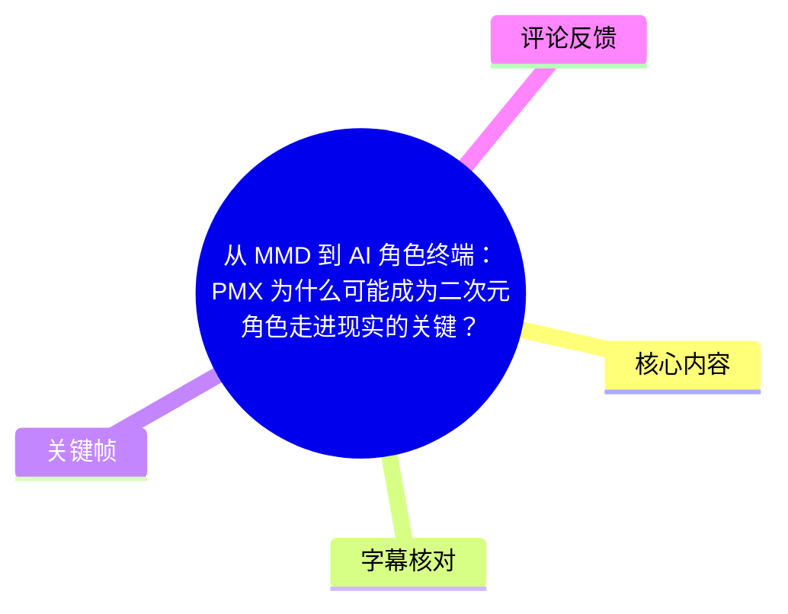
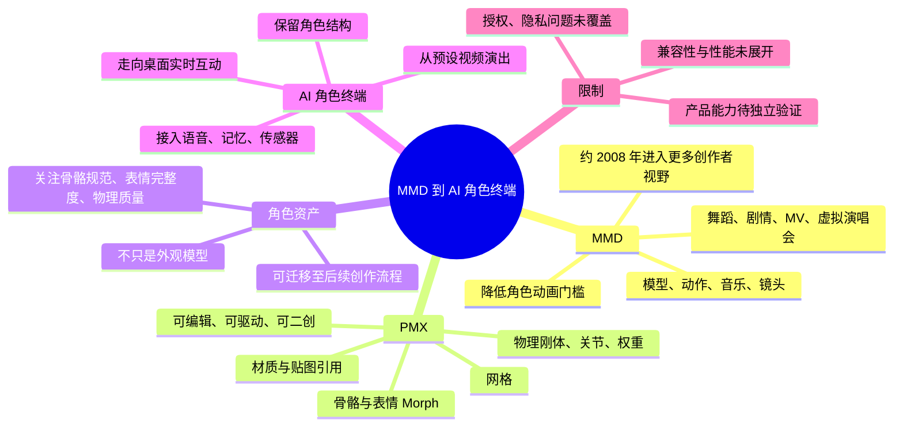
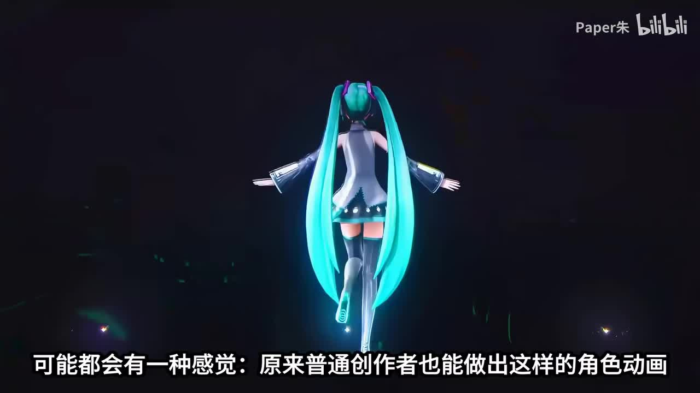
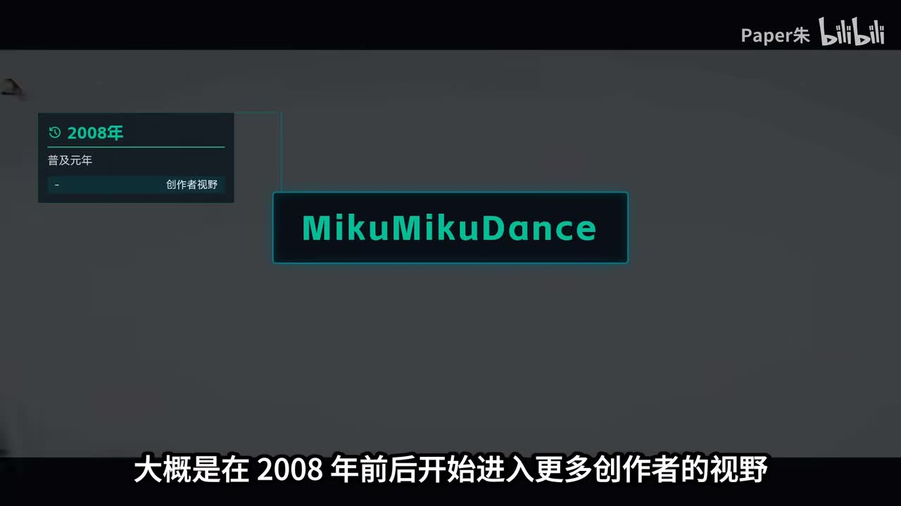
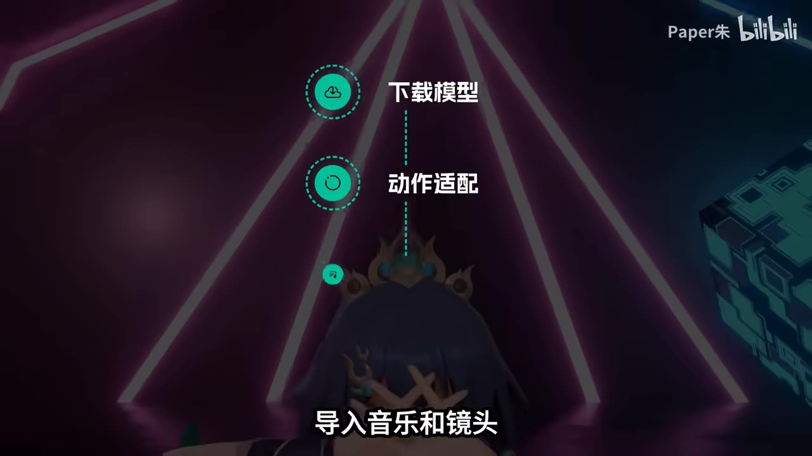
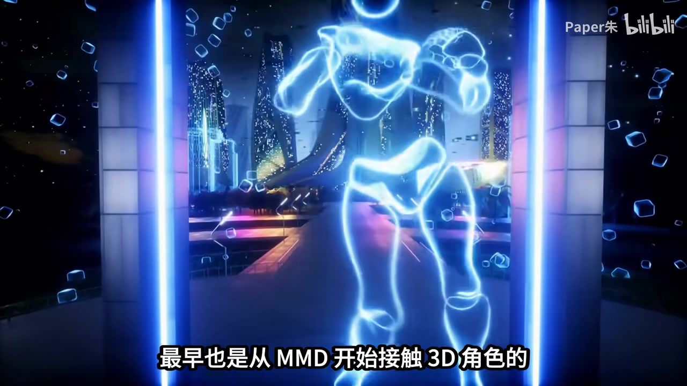

## 小结

视频以 **MMD（MikuMikuDance）→ PMX → AI 角色终端** 为主线，解释二次元角色如何从静态设定图、预设视频表演，逐步具备可编辑、可驱动、可持续互动的数字资产属性。

作者认为，MMD 的核心贡献不只是让初音未来等角色跳舞，而是显著降低了普通创作者进入 3D 角色演出的门槛。相较于从零学习建模、绑定、动画、镜头和渲染，创作者可以先使用现成模型、动作、音乐与镜头完成一次演出，再逐步学习骨骼、表情、物理、材质、布料、渲染和后期。

PMX 是视频的技术重点。按视频说法，较完整的 PMX 角色文件可承载网格、材质与贴图引用、骨骼、表情 Morph、物理刚体、关节与权重等结构化数据。它们直接关系到眨眼、口型、头发与裙摆摆动、手指姿势、穿模控制和后续改造能力；因此 PMX 的价值不止是“把模型导入 MMD”，而是将角色保留为可编辑、可驱动、可二创的数字角色资产。

视频进一步提出：AI 桌面陪伴设备或虚拟角色终端，试图解决的是让角色从预设作品中“走出来”，成为能在桌面环境中持续互动的存在。若未来设备支持用户导入角色，关键不应只是显示外观，而在于能否保留骨骼、表情、材质、物理与动作逻辑等角色结构，并在此基础上接入语音、记忆、传感器和桌面交互。

作者以 **Dipal-D1** 为例，称其可被理解为将数字角色放入桌面 AI 终端，通过屏幕、语音和传感器实现“看、听、回应”等交互，并称其支持上传 PMX 格式模型、定制音色和动作。该产品能力及“行业首个”说法仅来自视频素材，未提供官方规格、兼容列表、隐私策略或实测资料，应视为视频转述的产品主张，而非已独立验证的结论。

本内容适合希望理解 MMD 生态、PMX 模型资产价值、角色绑定与 AI 角色终端发展思路的读者。视频属于概念性与生态性讲解，不提供 PMX 格式规范、模型转换教程、嵌入式部署方案，也未展开版权授权、实时渲染性能、端云分工和隐私保护问题。

## 思维导图

## 目录

- [MMD：降低角色演出门槛](#mmd降低角色演出门槛)
- [从现成资源开始的学习路径](#从现成资源开始的学习路径)
- [PMX：结构化的数字角色资产](#pmx结构化的数字角色资产)
- [模型质量与创作生态的演进](#模型质量与创作生态的演进)
- [从 MMD 演出到 AI 角色终端](#从-mmd-演出到-ai-角色终端)
- [Dipal-D1 示例与信息边界](#dipal-d1-示例与信息边界)
- [结论、限制与时效性](#结论限制与时效性)
- [字幕比对](#字幕比对)
- [评论分析](#评论分析)
- [处理记录](#处理记录)

## MMD：降低角色演出门槛 [00:00](https://www.bilibili.com/video/BV1LGEw6mEyi?t=0)

视频开头以舞台上的 3D 初音未来为例：镜头随音乐切换，头发、裙摆与表情同步运动。作者借此提出，普通创作者也能制作此类角色动画，而 MMD 的重要性正在于降低了“驱动虚拟角色”的门槛。

> 图：画面展示 3D 角色在暗色舞台中的演出状态，字幕对应“普通创作者也能做出这样的角色动画”。它直观说明视频讨论的对象不是静态立绘，而是包含动作、镜头和演出效果的角色。

### MMD 的生态背景 [00:35](https://www.bilibili.com/video/BV1LGEw6mEyi?t=35)

MMD 全称为 **MikuMikuDance**。视频称，其大约在 **2008 年前后**进入更多创作者视野；Vocaloid、初音未来、Niconico，以及后来 Bilibili 上的大量二次创作内容，共同推动了这套生态的发展。

> 图：关键帧标注“2008年”与“MikuMikuDance”，对应作者对 MMD 进入更多创作者视野的时间描述。该图用于定位视频叙述，不构成独立的软件史料验证。

在作者的对比中，早期普通人若要完成 3D 角色动画，往往要分别掌握：

1. 建模；
2. 角色绑定；
3. 动画制作；
4. 镜头设计；
5. 渲染输出。

视频认为，其中任一环节都可能使初学者止步。MMD 的价值在于，不要求学习者一开始就从零搭建完整工业化流程。

### 静态角色与可演出角色 [01:33](https://www.bilibili.com/video/BV1LGEw6mEyi?t=93)

作者将角色形态概括为以下差异：

| 角色形态 | 视频所述能力 |
| --- | --- |
| 静态图片 | 主要展示角色外观 |
| MMD 模型 | 跳舞、做表情、转身、摆姿势、参与剧情 |
| 可持续创作的角色资产 | 可被驱动、被演出、被二次创作 |

作者认为，这种转变让角色不再只是视觉形象，而开始具备动作表现，并为粉丝的后续创作提供空间。这里的“有了性格”是对角色演出与观感的描述，不应理解为 PMX 文件本身具备人格或 AI 推理能力。

## 从现成资源开始的学习路径 [00:56](https://www.bilibili.com/video/BV1LGEw6mEyi?t=56)

作者提出的是一条由浅入深的学习路线：先利用已有资源完成演出，再研究更底层的角色技术。

### 视频中的入门操作顺序 [01:02](https://www.bilibili.com/video/BV1LGEw6mEyi?t=62)

1. **下载一个模型**；
2. **配置一套动作**；
3. **导入音乐和镜头**；
4. **先让角色跳起来**；
5. 在真正产生兴趣后，逐步研究骨骼、表情、物理、材质、布料、渲染与后期。

> 图：画面明确列出“下载模型”“动作适配”“导入音乐和镜头”。它是视频中最直接的操作流程视觉化，强调先获得可见成果，再逐步补齐技术能力。

这一路径的关键不是省略技术环节，而是改变学习顺序：先通过现成模型与动作进入角色演出，再根据创作需求深入绑定、材质、物理和渲染。

### MMD 的创作用途 [01:19](https://www.bilibili.com/video/BV1LGEw6mEyi?t=79)

视频列举的用途包括：

- 舞蹈视频；
- 剧情短片；
- 角色展示；
- 镜头练习；
- 打光练习；
- 二次元角色演出练习；
- 角色剧情；
- MV；
- 虚拟演唱会；
- 模型展示；
- 三维动画与角色绑定的入门学习。

作者还表示，部分后来使用 Blender、Unity、虚拟主播工具或从事游戏角色表现的人，最初也是通过 MMD 接触 3D 角色。

> 图：画面呈现角色在舞台与特效环境中的演出效果，适合说明 MMD 学习并不只停留在动作套用，也可延展到镜头、灯光、舞台与角色表现。它不是具体软件界面或跨软件兼容性的证明。

### 使用现成资源的前置限制

视频没有提供模型下载网站、动作文件格式、贴图管理、渲染参数或转换插件。因此，以下事项是将视频思路落地时必须自行确认的检查点，而不是视频给出的具体操作教程：

- 模型、动作、贴图、音乐和镜头数据是否允许使用、修改和发布；
- 模型是否附带正确的贴图与关联文件；
- 动作是否与目标模型骨骼匹配；
- 头发、服装等物理效果是否需要重新调校；
- 转换到其他软件时，表情、材质、骨骼或物理信息是否会丢失。

## PMX：结构化的数字角色资产 [01:57](https://www.bilibili.com/video/BV1LGEw6mEyi?t=117)

作者将 PMX 视为 MMD 生态中非常重要的角色模型格式，并特别强调它并非只保存“外观模型”。

按视频说明，一个相对完整的 PMX 文件可包含：

| 数据类别 | 视频列举内容 | 对角色表现的意义 |
| --- | --- | --- |
| 几何数据 | 角色网格 | 构成三维外形 |
| 外观数据 | 材质、贴图引用 | 关联角色表面视觉表现 |
| 控制结构 | 骨骼、关节权重 | 影响动作驱动与形变 |
| 表情数据 | 表情 / Morph | 支持眨眼、嘴型和表情变化 |
| 物理数据 | 物理刚体、关节 | 关系到头发、裙摆等动态效果 |
| 资产结构 | 可编辑的结构化信息 | 支持后续驱动、改造与二次创作 |

### PMX 数据影响哪些可见效果 [02:17](https://www.bilibili.com/video/BV1LGEw6mEyi?t=137)

作者用一系列直观问题说明 PMX 中结构化数据的价值：

- 眨眼是否自然；
- 嘴型能否对上台词；
- 头发、裙摆是否随动作摆动；
- 套用动作后是否发生穿模；
- 手指能否摆出姿势；
- 表情能否表达害羞等状态。

视频的准确表述是：这些效果与 PMX 保存的数据有关。实际成片效果通常还取决于动作本身、模型制作质量、物理参数、渲染环境以及导入或转换流程；素材中没有提供性能测试、格式字段说明或质量评估标准。

### 从“3D 外壳”到角色资产 [02:29](https://www.bilibili.com/video/BV1LGEw6mEyi?t=149)

作者的核心判断是，PMX 的真正价值在于把角色变成可继续编辑、继续驱动、继续二创的数字角色资产。

视频中的逻辑为：

- 缺少结构化数据时，角色可能只是“漂亮的 3D 外壳”；
- 具备 PMX 数据后，创作者可以套用动作、更换材质、调整表情、制作物理和修改演出；
- 视频还提到，可将角色转入 Blender、Unity、VRChat 或其他创作流程继续使用。

需要区分“可进入后续流程”与“直接、无损兼容”：视频没有展示 PMX 转换方法、所需插件、骨骼映射、物理转换结果和数据保真度，因此不能据此推导所有 PMX 文件均可完整迁移。

## 模型质量与创作生态的演进 [02:53](https://www.bilibili.com/video/BV1LGEw6mEyi?t=173)

### 作者提出的模型检查重点 [02:53](https://www.bilibili.com/video/BV1LGEw6mEyi?t=173)

作者指出，MMD 使用者会关注以下问题，因为它们关系到角色后续是否“能玩起来”：

| 检查项 | 视频关注点 | 可能影响 |
| --- | --- | ---|
| 文件格式 | 是否为 PMX | 是否具备目标流程所需的模型结构 |
| 骨骼 | 是否规范 | 动作适配、姿势与绑定表现 |
| 表情 Morph | 是否完整 | 口型、表情与角色演出表达 |
| 物理 | 是否做好 | 头发、服装摆动和碰撞体验 |

这意味着选择模型时不应只看截图或外观。对希望持续创作、迁移或交互使用的角色而言，骨骼、表情和物理质量同样重要。

### MMD 的生态演变 [03:04](https://www.bilibili.com/video/BV1LGEw6mEyi?t=184)

视频将 MMD 的发展概括为三个重心阶段：

1. **观看舞蹈阶段**：关注角色动作与歌曲的配合；
2. **演出品质阶段**：追求更好的镜头、灯光、材质、舞台和后期；
3. **角色创作生态阶段**：用于角色剧情、MV、虚拟演唱会、模型展示，并成为三维动画与角色绑定的学习入口。

作者最终将 MMD 生态的价值概括为让数字角色具备：

- **可传播**；
- **可驱动**；
- **可二创**。

这三个特征构成了视频把 PMX 与 AI 角色终端联系起来的基础。

## 从 MMD 演出到 AI 角色终端 [03:37](https://www.bilibili.com/video/BV1LGEw6mEyi?t=217)

### 三个层次的问题 [03:43](https://www.bilibili.com/video/BV1LGEw6mEyi?t=223)

视频对 MMD、PMX 与 AI 角色终端的定位可整理为：

| 层次 | 视频所述问题 | 对应场景 |
| --- | --- | --- |
| MMD | 普通创作者如何驱动角色表演 | 预设动作、镜头和音乐构成的视频演出 |
| PMX | 角色如何携带骨骼、表情、材质、物理等信息继续被使用 | 可编辑、可复用的角色资产 |
| AI 角色终端 | 角色如何从作品中“走出来”，成为实时互动存在 | 桌面及日常交互场景 |

因此，视频并没有说 PMX 本身能够实现 AI 对话、记忆或实时互动；作者的观点是，像 PMX 这样能够保留角色结构的信息形式，可能成为未来终端接入用户角色资产的基础。

### 对未来导入能力的判断 [04:14](https://www.bilibili.com/video/BV1LGEw6mEyi?t=254)

作者提出，未来若有更多 AI 角色设备允许用户导入自己的角色，真正关键的不只是导入一个外观，而是保留：

- 骨骼；
- 表情；
- 材质；
- 物理动作适配；
- 后续编辑空间。

视频以“喜欢的 PMX 角色被转成一张脸或简单模型”作为反例：若只保留外观，角色原有的表现能力会被削弱；若保留原本的表情、骨骼和动作逻辑，再接入语音、记忆、交互和桌面场景，角色才可能从“做过的 MMD 模型”转变为日常可互动的数字伙伴。

这一部分属于作者对未来产品形态的推演。素材未说明模型资产权属识别、动作和音乐版权、记忆保存机制、用户权限、格式转换损失、端侧或云侧计算分工等实施问题。

## Dipal-D1 示例与信息边界 [04:42](https://www.bilibili.com/video/BV1LGEw6mEyi?t=282)

作者举例提到名为 **Dipal-D1** 的产品，并将其方向描述为：把数字角色置入桌面 AI 终端，使角色能够看见用户、听见用户、回应用户，并经由屏幕、语音和传感器进行交互。

视频还称，该产品：

- 支持上传专属模型；
- 支持定制音色；
- 支持定制角色动作；
- 是“行业内第一个支持上传 PMX 格式的 3D 终端角色仓”。

上述信息应限定为视频中的产品介绍与主张，原因如下：

1. 给定素材未提供产品官网、说明书、SDK、兼容性清单或完整实测；
2. “支持上传 PMX”不代表所有 PMX 的贴图、表情、物理、骨骼和动作均可完整保留；
3. “看、听、回应”没有说明摄像头、麦克风、传感器、语音识别、延迟或网络依赖的具体条件；
4. “行业第一个”缺少行业范围、时间范围和比较对象，无法仅凭视频独立确认。

因此，该案例可以帮助理解作者对 AI 角色终端的设想，但不应直接作为购买依据或技术兼容性结论。

## 结论、限制与时效性 [05:03](https://www.bilibili.com/video/BV1LGEw6mEyi?t=303)

视频的主线可概括为：

> **MMD 让普通创作者能够驱动角色演出；PMX 让角色保有可编辑、可驱动和可复用的结构；AI 角色终端则尝试让角色进入日常桌面场景并持续互动。**

### 可迁移的经验

- 入门阶段可先用“模型 + 动作 + 音乐 + 镜头”完成演出，再深入学习底层制作技术。
- 判断模型价值时，不应只看外观；PMX 格式、骨骼规范、表情完整度与物理质量会影响后续可用性。
- 若 AI 角色设备希望承接用户已有角色，模型导入的重点不应只在“显示出来”，还应关注角色是否仍可驱动、可表达、可编辑。
- 视频提到 Blender、Unity、VRChat 等后续流程，但实际项目仍需逐项验证转换工具、数据损失与版权许可。

### 视频未展开的限制

- 未讲解 PMX 的字段、版本差异、导入导出方法或转换插件；
- 未说明 PMX 导入 AI 终端后的骨骼、物理、Morph、贴图兼容规则；
- 未讨论实时渲染对 CPU、GPU、内存、功耗、散热和网络的要求；
- 未讨论模型、动作、贴图、音乐与二次创作的授权边界；
- 未讨论摄像头、麦克风、角色记忆等功能涉及的隐私、数据存储与权限控制；
- Dipal-D1 的能力与“行业首个”主张缺乏给定素材之外的独立验证。

### 时效性

元数据中的发布时间戳对应 **2026-06-05**。AI 角色终端、PMX 兼容范围、模型导入能力、固件与云服务策略都可能随产品迭代变化。视频中关于“支持 PMX 上传”“可定制音色与动作”“行业首个”的说法，应以使用或购买时的最新官方资料、版本说明和实际测试结果为准。

## 字幕比对 [00:00](https://www.bilibili.com/video/BV1LGEw6mEyi?t=0)

| 字幕来源 | 完整性 | 专有名词表现 | 时间轴质量 | 主要问题 |
| --- | --- | --- | --- | --- |
| Bilibili 站内中文字幕 `p01-ai-zh.srt` | 覆盖约 00:00.120–05:39.480，内容连续完整 | 存在“MMD”写作“MD”、“AI”写作“AA”、“PMX”误作“DMX”等错误 | 分段细，SRT 起止时间可直接用于时间轴 | 个别术语误识别，但叙述结构和中文语义完整 |
| Bilibili 站内英文、日文等字幕 | 覆盖完整，可交叉确认语义 | 较清楚地出现 MikuMikuDance、PMX、Blender、Unity、VRChat、Dipal-D1 等 | 分段时间完整 | 属于站内生成字幕；不能替代产品主张的外部验证 |
| 本次 ASR `medium` | 检测为中文，语音覆盖 310.54 秒，诊断覆盖率 0.9147 | 专名误识别较多，如“佩佩猪”“M&D”“AA”“Valkyroid”“D-PAL D1” | 有时间戳，但从 00:28.540 才开始，且每段文本过长 | 首段时间明显晚于站内字幕，术语与分段不适合作为正文主依据 |

### 字幕选择与校正

正文优先采用 **站内中文字幕 `p01-ai-zh.srt` 的真实 SRT 起止时间**生成章节时间轴，并参考站内英文、日文字幕校正术语。

本次 ASR 已按要求检查。`asr-result.json` 中**未标记** `noAudioStream=true`；诊断显示：

- 音频时长约 `339.50` 秒；
- 识别语言为中文；
- 语言概率约 `0.9990`；
- 语音覆盖约 `91.47%`。

因此，源视频存在音轨。ASR 问题是时间起点偏移、分段过粗及专有名词识别错误，并非源视频无音轨，也不是工具失败。

根据站内字幕、多语字幕及上下文，本文统一采用以下校正：

| 误识别形式 | 正确写法 |
| --- | --- |
| `MD`、`M&D`、`M&A`、`M&B` | MMD |
| `PMPMX`、`DMX` | PMX |
| `AA` | AI |
| `WORKLOYD`、`Valkyroid` | Vocaloid |
| `Neko Neko` | Niconico |
| `佩佩猪`、`佩服猪` | Paper朱 |
| `D-PAL D1`、`d pd1` | Dipal-D1 |
| `we are chat` | VRChat |

## 评论分析 [00:00](https://www.bilibili.com/video/BV1LGEw6mEyi?t=0)

以下仅处理可获取的热评前三条。评论属于观众观点、经验或提问，不视为已验证事实。

1. **星野I梦美｜81 赞**  
   > “但是好像MMD大佬最后都会抛弃MMD上Blender+AE之类的软件[笑哭]”

   - **观点**：部分高水平 MMD 创作者最终会转向 Blender、AE 等更复杂的软件流程。
   - **与视频的关系**：呼应视频中“MMD 可作为 Blender、Unity 等工具入口”的说法。
   - **边界**：这是一种经验性概括，没有样本或统计支持；不能推导为所有 MMD 创作者都会放弃 MMD，也不能证明 Blender 或 AE 必然替代 MMD。

2. **雪琳Sherlyn｜21 赞**  
   > “现在最大的问题是怎么在一个嵌入式平台比如ESP32S31上本地调用PMX并且调用PPA(Pixel Processing Accelerator)和2D-DMA Accelerator，纯靠CPU算容易把两核干炸”

   - **观点**：关注资源有限的嵌入式平台如何本地调用 PMX，以及如何利用像素处理与 2D DMA 加速能力降低 CPU 压力。
   - **补充价值**：指出视频未展开的工程现实：PMX 解析、骨骼驱动、物理模拟和实时渲染都可能给桌面 AI 终端带来算力、功耗和散热压力。
   - **边界**：评论中的“ESP32S31”、PPA、2D-DMA Accelerator 的具体能力、实际架构与性能结论均未由视频或给定资料验证。

3. **气氛烘托の专业人士｜21 赞**  
   > “从零blender开始硬啃动画再想着学习mmd的有没有……”

   - **观点**：提出与视频建议相反的学习路线：先从 Blender 动画开始，再学习 MMD。
   - **与视频的关系**：视频建议先借 MMD 快速完成角色演出，再深入底层技术；评论说明实际学习路径会受目标影响。
   - **边界**：这是一种个人经验或提问，不能据此判定哪条路线普遍更高效。若目标是通用三维工作流，Blender 路线可能更匹配；若目标是快速完成 MMD 角色演出，视频所述路径更直接。

## 处理记录 [00:00](https://www.bilibili.com/video/BV1LGEw6mEyi?t=0)

- **Worker ID**：`worker-mrj0wbly-5dc4e50c`
- **模型**：`gpt-5.6-terra`
- **检查的素材与工具输出**：
  - 视频元数据、视频时长与分辨率信息；
  - Bilibili 站内多语时间轴字幕：中文、英文、日文、西班牙文、葡萄牙文、阿拉伯文；
  - 本次 ASR：`medium`，CUDA，`float16`；
  - ASR 文件：`asr/asr-result.json`、`asr/transcript.srt`；
  - 关键帧目录：`frames/`；
  - 热评数据：`comments/comments.json`，仅取前三条。
- **字幕选择**：以站内中文字幕 `p01-ai-zh.srt` 的 SRT 真实时间段作为正文时间轴依据；以英文、日文站内字幕交叉校正专有名词；本次 ASR 已检查但因首段偏移、分段过粗和术语误识别较多，未作为主时间轴来源。
- **关键帧依据**：
  - `frames/frame-001.jpg`：对应开头 3D 初音舞台演出，说明“普通创作者也可完成角色动画”的切入点；
  - `frames/frame-002.jpg`：画面明确显示“2008年”与“MikuMikuDance”，用于 MMD 生态背景；
  - `frames/frame-003.jpg`：画面列出下载模型、动作适配、导入音乐和镜头，用于入门步骤；
  - `frames/frame-004.jpg`：展示虚拟角色演出，用于说明 MMD 与后续角色表现学习的延展性。  
  图片仅用于辅助理解与画面佐证，未据画面补充未出现的技术事实。
- **缓存清理**：给定素材中没有缓存清理执行日志；本文不宣称已执行缓存清理。
- **未解决问题**：
  - Dipal-D1 的硬件规格、PMX 实际兼容范围、模型转换保真度及“行业首个”主张缺少独立验证；
  - 视频未给出 PMX 转 Blender、Unity、VRChat 的具体步骤、插件条件或数据损失情况；
  - 嵌入式终端的本地渲染性能、传感器交互、隐私保护与资产授权问题未在视频中展开。

## 评论分析

- 热评 1：但是好像MMD大佬最后都会抛弃MMD上Blender+AE之类的软件[笑哭]
- 热评 2：现在最大的问题是怎么在一个嵌入式平台比如ESP32S31上本地调用PMX并且调用PPA(Pixel Processing Accelerator)和2D-DMA Accelerator，纯靠CPU算容易把两核干炸
- 热评 3：从零blender开始硬啃动画再想着学习mmd的有没有……

以上内容是观众反馈摘录，只用于补充理解视频反响，不作为正文事实依据。
