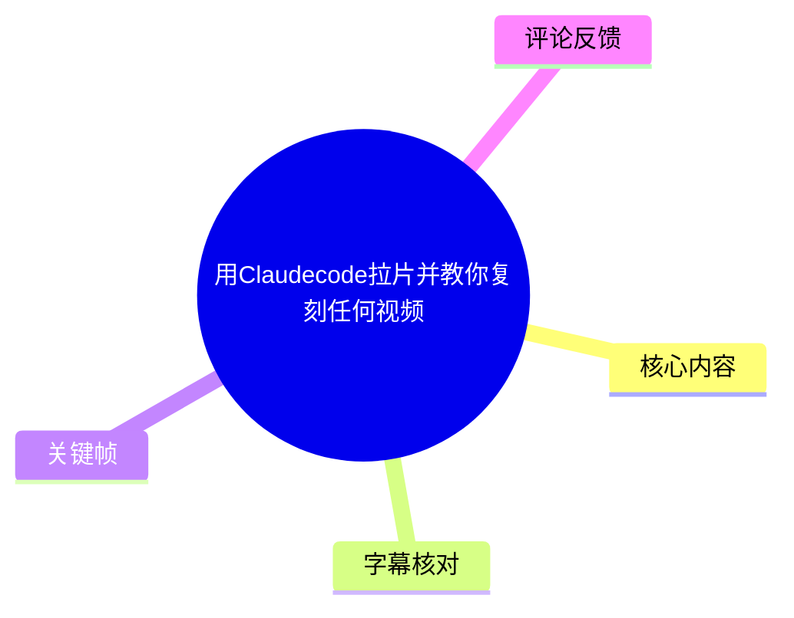
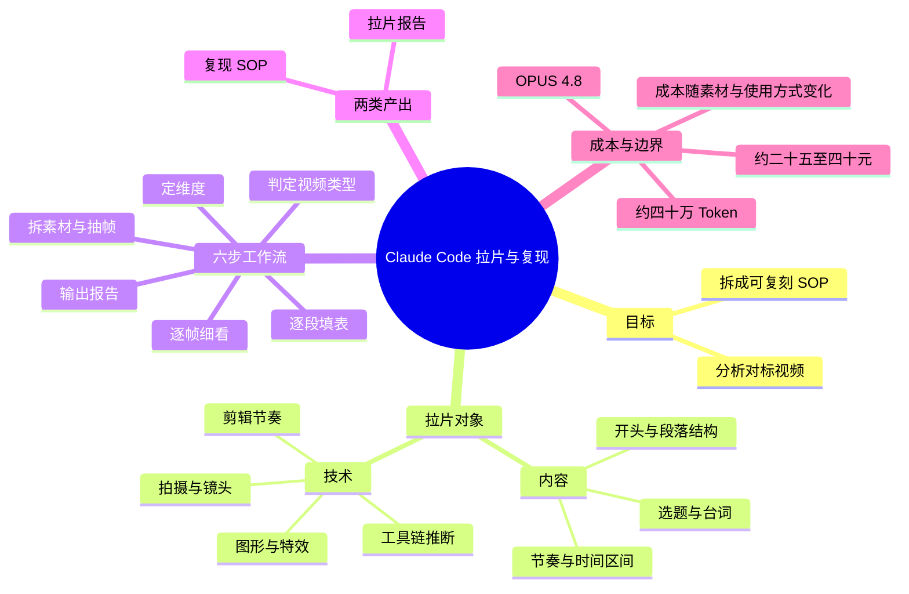
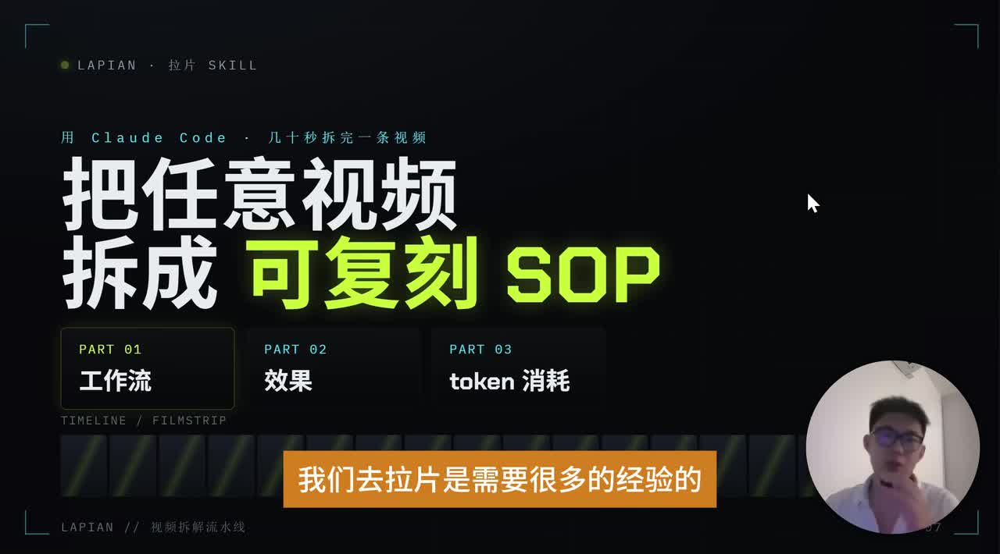
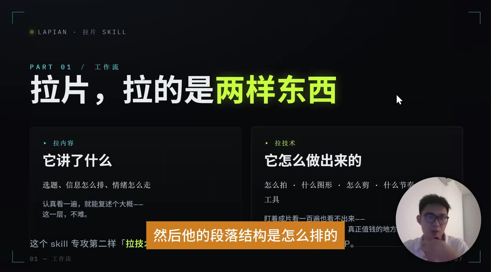
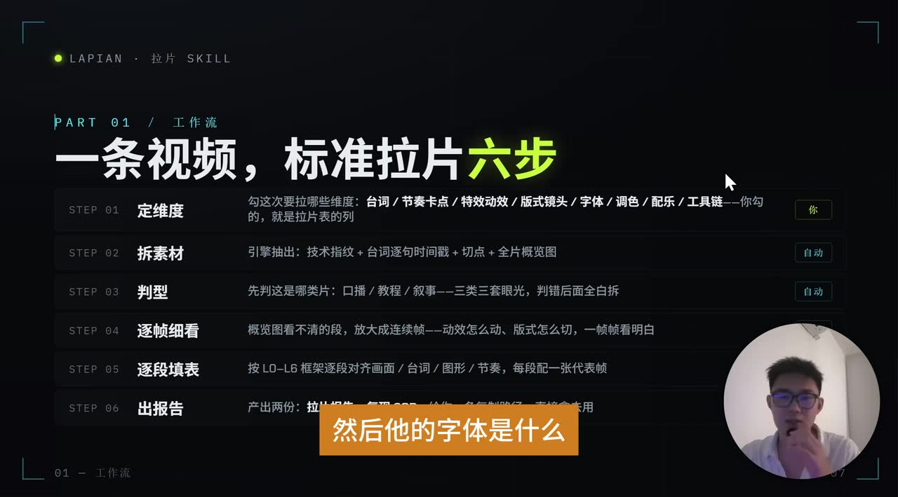
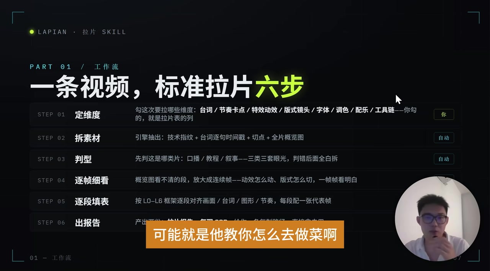

# 用Claudecode拉片并教你复刻任何视频

> 来源：[Bilibili 视频](https://www.bilibili.com/video/BV19eEd6wE9G)  
> UP 主：yan本人｜合集：AIcode｜时长：4 分 31 秒  
> 标签：AI、视频、人工智能、视频教程、教程、经验分享、干货

## 小结

本视频介绍一种借助 Claude Code 与“拉片 skill”分析参考视频的方法：将视频拆解为**内容**与**技术**两条线，再整理为按时间排列的拉片报告，最终输出可供执行的“复现 SOP”。这里的“复刻”并非直接生成成片，而是先得到对标视频的结构、节奏、镜头、图形动效及工具链推断，再据此重新完成脚本、拍摄、动效和剪辑。

UP 主给出的标准流程共六步：**定维度、拆素材、判型、逐帧细看、逐段填表、出报告**。其中，先进行按秒或间隔抽帧的粗分析；对于模型难以判断的片段，再缩小到约每 0.1 秒一帧进行细看。该方法的核心价值是把原本依赖经验和人工体力的拉片工作，转为 Agent 可读取、可结构化整理的素材序列。

视频强调两类交付物：一是说明“原作者怎么做”的**拉片报告**；二是说明“自己如何重做”的**复现 SOP**。对于录屏加露脸类口播视频，SOP 示例包括撰写口播逐字稿、实拍、剪除口误与气口、制作匹配内容的图形动效，以及最终剪辑导出。不同视频类型的步骤并不相同，不能把这一示例机械套用于所有题材。

成本方面，UP 主以个人使用 **OPUS 4.8** 模型的经验称，完整拉一条视频约消耗 **40 万 Token**、费用约 **25 元**；初次使用可能到约 **40 元**。他还称拆解同一博主约 3—5 条视频后，通常可归纳出其整体工作流。上述均为视频中的个人估算，并非通用报价或稳定性能承诺。

适合对象是希望系统研究对标账号、教程、口播、叙事视频或影片制作方式的内容创作者。需要注意：视频没有展示可复现的具体命令、Skill 文件内容、提示词、输入视频长度与分辨率条件，也没有给出实测的逐段 Token 明细；实际成本、模型能力、Claude Code/Skill 的可用方式均可能随产品版本和素材复杂度变化。

## 思维导图

## 目录

- [背景、目标与术语](#背景目标与术语)
- [拉片的两条主线：内容与技术](#拉片的两条主线内容与技术)
- [标准拉片六步工作流](#标准拉片六步工作流)
- [交付物一：按时间排列的拉片报告](#交付物一按时间排列的拉片报告)
- [交付物二：从报告到复现 SOP](#交付物二从报告到复现-sop)
- [成本、参数与时效性](#成本参数与时效性)
- [可执行实践清单](#可执行实践清单)
- [结论与限制](#结论与限制)
- [字幕比对](#字幕比对)
- [评论分析](#评论分析)
- [处理记录](#处理记录)

## 背景、目标与术语 [00:00](https://www.bilibili.com/video/BV19eEd6wE9G?t=0)

UP 主面向自媒体创作者提出的问题是：当看到一个高质量对标视频时，怎样理解它的制作方法，并据此进行复现。视频将这一过程称为“拉片”。

按照视频中的解释，拉片并非只总结视频主题，也不是简单下载、复制或直接生成原片，而是要回答两组问题：

1. **内容层面**：视频讲了什么、选题是什么、开头如何设置、段落怎样排列、口播每段内容对应什么时间区间、节奏如何推进。
2. **技术层面**：视频怎么拍、用了什么图形与特效、怎么剪、节奏如何实现、可能使用了哪些工具或 AI 工具。

UP 主的观点是，传统拉片常需要较多经验和人工整理工作；Claude Code 配合相应 Skill 后，可将视频转换为一系列带时间关系的图像，并让 Agent 据此阅读、归纳和产出结构化结果。

> 图：该帧展示“把任意视频拆成可复刻 SOP”的核心主张，并列出“工作流、效果、Token 消耗”三部分。这张图有助于确定视频的完整叙述框架，而不是把内容误解为单纯的 AI 视频生成教程。

## 拉片的两条主线：内容与技术 [00:27](https://www.bilibili.com/video/BV19eEd6wE9G?t=27)

视频将拉片明确拆成“拉内容”和“拉技术”。

### 1. 拉内容：解释视频“讲了什么”

内容分析应覆盖以下维度：

- 视频选题与切入角度；
- 开头的表达方式；
- 段落结构及其排列；
- 口播文字及每一段对应的起止时间；
- 内容信息的推进与节奏。

视频提及，可以通过观察“每 5 秒”发生了什么来辅助分析节奏。这里的“每 5 秒”是 UP 主对分析粒度的示例，不代表所有视频都必须固定每 5 秒分段。

### 2. 拉技术：解释视频“怎么做出来”

技术分析应覆盖：

- 拍摄方式；
- 图形、版式与视觉元素；
- 剪辑方法和节奏；
- 使用的工具及可能涉及的 AI 工具；
- 如“录屏并露脸”类视频的具体呈现方式。

视频特别强调：仅按较粗颗粒度观看，可能看不出真正值得研究的技术细节；因此，抽帧后还要依据理解难度对局部片段加密分析。

> 图：画面将拉片分为“拉内容：它讲了什么”与“拉技术：它怎么做出来的”。这是全文最关键的概念边界：复现不是只模仿台词，也需要研究呈现技术。

## 标准拉片六步工作流 [00:58](https://www.bilibili.com/video/BV19eEd6wE9G?t=58)

视频展示了一条“标准拉片六步”流程。结合 ASR 内容与关键帧中可辨识文字，可整理如下。

### 第 1 步：定维度

先决定本次希望提取的分析维度。视频举例包括：

- 台词；
- 节奏卡点；
- 特效动效；
- 版式镜头；
- 字体；
- 调色；
- 配乐；
- 工具链。

这一步由分析者决定。其作用是确定后续拉片表的列：如果一开始没有明确目标，即便提取了大量帧，也可能无法形成可执行结论。

### 第 2 步：拆素材与抽帧

将视频进行抽帧，形成大量图片。视频称可按“每隔几秒”或“每隔一秒”抽帧；关键是这些图像之间保留时间顺序，供 Agent 读取整段流程。

关键帧中的流程说明还写有“技术指纹 + 台词逐句时间戳 + 切点 + 全片概览图”。其中“技术指纹”可理解为对可见制作特征的归纳，但视频未给出其固定字段或计算规则。

### 第 3 步：判型

先粗略判断视频类型，再进行深入拆解。视频举例：

- 口播教程；
- 录屏加露脸；
- 纯露脸；
- 叙事类视频；
- 做菜教学；
- 生活日常 Vlog。

不同类别的拍摄和剪辑逻辑不同，因此不能以同一份复现流程覆盖所有类型。

### 第 4 步：逐帧细看

对粗抽帧仍无法理解的片段，继续缩小帧间隔。例如两张帧之间原本间隔约 1 秒时，可将该区间细化为约 **0.1 秒一张图片**，以判断动作、动效或版式切换。

这一步是对“抽帧分析是否足够”这一问题的回应：视频并非主张一次性粗抽帧即可理解所有动态，而是采取“粗看全片—局部加密”的方式。

### 第 5 步：逐段填表

按时间顺序记录每个片段的：

- 画面；
- 台词；
- 图形或视觉元素；
- 节奏；
- 片段作用；
- 一张代表帧。

关键帧显示此处按“L0—L6 框架”逐段对齐画面、台词、图形与节奏；但视频未解释 L0—L6 的具体含义，因此不能据此扩展出未提供的层级定义。

### 第 6 步：出报告

最终产出两份内容：

1. **拉片报告**：解释参考视频的作者是如何制作的；
2. **复现 SOP**：说明复做该类型视频时应该按什么顺序执行。

> 图：该帧直接列出“定维度、拆素材、判型、逐帧细看、逐段填表、出报告”六步，并标识第 1 步主要由用户确定、其余多由自动化流程承担。它是复现该方法时最有价值的流程总览。

## 交付物一：按时间排列的拉片报告 [02:02](https://www.bilibili.com/video/BV19eEd6wE9G?t=122)

UP 主将第一项交付物称为“拉片报告”。其用途是说明一条视频总体如何制作，而不是只输出一句主题概述。

视频描述的报告结构包括：

- **封面**；
- **一句话结论**：概括视频大致如何拍摄、博主的节奏特点等；
- **配帧逐段表**：按时间展示每段内容；
- **工具链推断**：推测视频可能用到的制作工具。

配帧逐段表的核心字段包括：

| 字段 | 视频中的说明 |
| --- | --- |
| 时间 | 标识该段发生的时间区间 |
| 台词 | 记录该时间段说了什么 |
| 图形/特效 | 记录画面中的图形和特效表现 |
| 作用 | 解释该段在内容结构中的功能 |
| 节奏 | 记录片段时长与推进感 |
| 代表帧 | 每段配一张能代表画面状态的图片 |

视频以不同句子持续约 20 秒、23 秒为例，说明表格会反映实际片段长度。它没有提供一份完整的示例表格原文，也未定义“作用”字段的固定分类，因此这些字段应根据具体视频调整。

工具链部分属于**推断**而非必然事实。例如，UP 主举例称某类视频可能由 AI 工具和自己录制的素材结合制作。仅靠成片画面无法始终准确确认对方实际使用的软件、模板或工作流；在报告中应将这类结论标记为“可能”或“推断”。

## 交付物二：从报告到复现 SOP [02:42](https://www.bilibili.com/video/BV19eEd6wE9G?t=162)

第二项交付物是“复现 SOP”。拉片报告回答“对方怎么做”，复现 SOP 则把观察转为“自己接下来怎么做”。

视频针对“录屏加露脸/口播”类型给出的示例顺序是：

1. **制作口播逐字稿**；
2. **对着电脑进行实拍**；
3. **剪辑实拍口播**，去除错误与气口；
4. 得到完整的实拍视频；
5. 在视频上增加图形动效；
6. 动效可由 AI 制作，例如视频提及可能使用 **Remotion skill**；
7. 让工具先读取视频本身内容，再制作与内容配合的动效；
8. 使用剪辑软件或 AI 进行最终剪辑并导出。

这里有两个重要限制：

- “Remotion skill”是视频中提到的可能工具方案，视频没有提供安装方法、代码、配置、版本或实际生成结果，不能据此承诺任何 Remotion 工作流都能自动匹配动效。
- UP 主明确说不同视频的步骤“肯定会不一样”。因此，上述 SOP 只对应其刚才拆解的示例类型；做菜、Vlog、剧情叙事、纯口播等内容应从其自身素材、镜头与节奏需求出发重新生成 SOP。

> 图：该帧位于工作流讲解阶段，画面与字幕强调视频类型可能是做菜、Vlog 等不同形态。它说明“判型”是后续生成差异化 SOP 的前提，避免把录屏口播的做法误用到其他类型。

## 成本、参数与时效性 [03:42](https://www.bilibili.com/video/BV19eEd6wE9G?t=222)

### 视频中给出的成本口径

UP 主基于自己的使用经验给出以下数据：

| 项目 | 视频陈述 |
| --- | --- |
| 使用模型 | OPUS 4.8 |
| 拉一整条视频的 Token 消耗 | 约 40 万 Token |
| 费用估计 | 约 25 元 |
| 首次使用时的可能费用 | 约 40 元 |
| 经验性建议 | 拆解同一博主约 3—5 条视频，可大致了解其整体工作流 |

UP 主还说“拉一条 30 分钟视频”的成本仍可控，但本视频本身时长为 4 分 31 秒，且没有给出“整条视频”对应的精确时长、分辨率、抽帧间隔、是否重复分析、上下文长度、是否包含多轮修订等条件。因此，不能将“40 万 Token”理解为对任意 30 分钟视频都成立的固定消耗。

### 影响实际成本的变量

以下变量是根据视频已说明的工作机制直接可得的实践风险，而非视频的精确计费公式：

- 抽帧间隔：每秒抽帧与每几秒抽帧产生的图片数量不同；
- 局部加密：难以判断时若按约 0.1 秒/帧细看，输入量会显著增加；
- 视频时长和镜头切换密度；
- 画面复杂度，例如字幕、屏幕录制、图形动效、多人镜头；
- 模型版本、套餐、地区价格及平台计费策略；
- 初次使用时的反复调试、补帧与返工。

### 时效性说明

本视频元数据的发布时间按 Unix 时间戳换算为 **2026-06-10**，但未附带时区。模型名、Claude Code 的产品能力、套餐权益、Token 单价以及 Skill 的调用方式都有可能在之后变动。视频中的成本与工具可用性应视为该 UP 主在当时的个人经验，不应替代实际产品页面、账户账单或当前文档。

## 可执行实践清单 [01:00](https://www.bilibili.com/video/BV19eEd6wE9G?t=60)

下面将视频的方法整理为不超出原素材范围的执行清单。

### A. 确定研究目标

在开始前，明确希望复现的不是“原视频本身”，而是哪些可观察、可迁移的要素：

- 选题和开头；
- 台词结构；
- 段落长度；
- 镜头与露脸方式；
- 字体、版式和调色；
- 图形/动效；
- 节奏、切点与配乐；
- 可能的工具链。

### B. 形成粗粒度全片视图

1. 对视频按固定间隔抽帧；
2. 保留每张图片的时间信息；
3. 让 Agent 按时间顺序阅读图片；
4. 先判断视频类型，获得全片大致结构。

此阶段的目标不是立即识别所有细节，而是建立“内容如何推进、形式如何变化”的全局认知。

### C. 对难点片段加密分析

1. 标记粗抽帧后仍看不明白的时间区间；
2. 在局部缩小帧间隔；
3. 视频给出的示例是细化至约 **0.1 秒一帧**；
4. 重新检查动作变化、动效启动/结束、版式切换及剪辑点。

### D. 按段填充拉片表

每个段落至少应对齐：

- 时间范围；
- 画面；
- 台词；
- 图形/特效；
- 节奏；
- 该段作用；
- 代表帧。

如果目标是复现风格而非复述内容，则应避免把对方的具体台词、素材或成片当作可以直接照搬的对象；更适合提炼的是结构和方法。

### E. 生成并执行复现 SOP

以分析出的目标视频类型为依据，安排自己的制作顺序。对于视频提供的口播示例，可依次完成逐字稿、实拍、口播粗剪、图形动效、最终剪辑与导出。执行中应保留与参考视频的差异说明：哪些是结构借鉴，哪些是自身内容和素材的原创替换。

## 结论与限制 [04:10](https://www.bilibili.com/video/BV19eEd6wE9G?t=250)

视频提供的可迁移经验是：把“看视频找感觉”改成一条可检查的分析管线——先定维度，再以抽帧建立全片视图，根据需要局部加密，按时间段填写内容与技术要素，最后分离输出“分析报告”和“执行 SOP”。

其中最值得保留的原则有三点：

1. **内容与技术分开分析**：知道视频讲什么，不等于知道它为什么看起来有效。
2. **粗看与细看结合**：全片采用较低成本的抽帧概览，局部复杂处再提高采样密度。
3. **先判类型，再写 SOP**：同一套制作顺序并不适用于口播、Vlog、教程、做菜和叙事视频。

同时，视频存在以下信息边界：

- 没有公开拉片 Skill 的具体内容、提示词、文件结构或操作命令；
- 没有演示一条真实目标视频从输入到报告、SOP 的完整案例；
- 没有提供拉片报告和复现 SOP 的完整模板；
- “工具链推断”天然存在不确定性，不能替代对原作者实际工具的确认；
- 成本数字是个人案例，缺少视频长度、抽帧策略等可复算条件；
- 视频标题中的“复刻任何视频”应理解为分析与生成复现流程的目标，不意味着可无条件、无成本、无版权风险地复制任意作品。

此外，复现内容时仍需注意版权、肖像、音乐、素材授权及平台规范。原视频没有就这些问题展开说明，因而不能将其视为版权或合规建议。

## 字幕比对 [00:00](https://www.bilibili.com/video/BV19eEd6wE9G?t=0)

本次任务已执行 ASR。站内字幕抓取过程报错，素材明确标注“未提供可用站内字幕”，因此不能进行逐句校对或合并。

| 字幕来源 | 完整性 | 专有名词 | 时间轴 | 主要问题 |
| --- | --- | --- | --- | --- |
| Bilibili 站内字幕 | 不可用 | 无法评估 | 无法评估 | 获取失败；工具提示缺少 JSON 资源 URL |
| 本次 ASR 字幕 | 覆盖全片主要口播内容 | 存在多处同音/识别偏差 | 未提供逐句时间戳 | “Claude Code”“拉片”“复现 SOP”等词语有误识别，且部分句子断句不稳定 |

### 最终字幕选择

正文以**本次 ASR 字幕为唯一可用文本来源**，并结合标题、上下文和关键帧可见文字进行有限校正；未将无法确认的内容扩展为事实。

重要校正如下：

| ASR 表述 | 正文采用 | 校正依据 |
| --- | --- | --- |
| cloud code / clock code | Claude Code | 视频标题及开场画面文字“用 Claude Code” |
| 抽真 / 拆真 | 抽帧 | 上下文为按秒、按 0.1 秒输出图片进行分析 |
| 拉篇 scale | 拉片 skill | 视频标题、画面“LAPIAN·拉片 SKILL”及上下文 |
| 附线 / 父亲 SOP / 浮现 SOP | 复现 SOP | 标题“可复刻 SOP”及前后语义 |
| OPUS 4.8 | OPUS 4.8 | ASR 明确提及，但未能由素材确认其完整官方命名或版本状态 |
| remotion skill | Remotion skill | ASR 音译为“remotion”，按常见工具名称规范大小写；视频未给出具体配置 |

ASR 未附带逐句时间码，因此本文各章节时间轴为依据视频叙述顺序和关键帧内容整理的导航锚点，不应视为逐字字幕的精确起止标注。

## 评论分析 [03:42](https://www.bilibili.com/video/BV19eEd6wE9G?t=222)

以下仅处理本次可获取的热评前三条，按点赞数排序。评论代表个人观点，不作为已验证事实。

### 1. 落枫一瑟：认为视频与“复刻视频”的关联不足

> “完全没看出来这跟复刻视频有什么关系”  
> 点赞：8

这条评论质疑标题承诺与视频展示内容之间的衔接。视频确实主要讲述了“分析—报告—SOP”的方法框架，没有现场展示从一条目标视频到一条复现成片的完整过程。因此，若将“复刻”理解为直接产出一个高度相似的成片，评论的疑问具有合理性。

但按视频自身定义，“复刻”的中间产物是拉片报告与复现 SOP，而不是直接复制文件或自动生成同款成片。争议本质上是“复刻”一词的预期不同：视频提供的是前期分析和流程规划，不是完整交付式演示。

### 2. hunthunt：质疑为何要拆帧，认为 AI 可直接读取视频

> “不是早有ai能够直接读视频吗？还要拆分图？我记得一年前就用过gemini读视频了。[doge]”  
> 点赞：7

评论提出替代路径：直接把视频交给具备视频理解能力的模型，而非转换成帧。原视频没有比较 Claude Code 的抽帧方案与其他原生视频理解模型的准确率、成本、上下文限制或操作复杂度，因此不能据此判断哪种方案更优。

从视频所述工作流看，抽帧的目的不仅是“让模型看到视频”，还包括保留可逐段引用的时间序列、对局部以更细时间粒度复查、生成配帧表。直接视频理解是否能够同样稳定完成这些要求，需取决于具体模型和产品能力，视频未验证。

### 3. 王子殿下朴一生先生：关注 Token 成本

> “ai读视频应该特别费token吧[思考]”  
> 点赞：4

该评论聚焦成本，与视频最后一部分直接相关。UP 主给出的个人经验是：使用 OPUS 4.8 拉一整条视频约 40 万 Token、约 25 元，初次使用可能约 40 元；但他没有展示详细账单和输入规模。

评论的担忧有现实基础：视频中的局部加密抽帧策略意味着复杂片段会增加图片输入量。不过，具体成本不能从评论或视频中进一步精确推算，仍取决于视频时长、抽帧策略、模型计费和返工次数。

## 评论分析

本次流程未获取到可用热评，因此不推断观众态度或额外结论。

## 处理记录

- Worker ID：`worker-mrj0wjed-b0c290ad`
- 模型：`gpt-5.6-terra`
- 调用工具与素材：视频素材处理产物 `merged.mp4`、`audio/audio.wav`、`frames/`、`comments/comments.json`、`asr/`；本次已执行 ASR。
- 使用的应用工具：素材处理记录显示曾调用字幕获取工具，但因缺少 JSON 资源 URL 而失败；可用文本改用本次 ASR 结果。
- 字幕选择：站内字幕不可用；采用本次 ASR，并依据标题、上下文与画面文字校正“Claude Code”“拉片 skill”“抽帧”“复现 SOP”等关键术语。
- 关键帧选择依据：选用 `frame-001.jpg` 概括视频主题与三部分结构，`frame-002.jpg` 说明内容/技术双线，`frame-003.jpg` 呈现标准六步，`frame-004.jpg` 支撑“判型与不同视频类型”的限制说明；其余关键帧未在提供素材中附带可辨识描述，未强行引用。
- 评论范围：仅使用可获取热评前三条，未扩展至其他评论或回复。
- 缓存清理：提供的素材记录未包含缓存清理执行结果；本记录不宣称已完成清理。
- 未解决问题：未获得站内字幕、完整 Skill 文件、提示词、命令行流程、拉片报告样例全文、实际账单明细及目标视频到复现成片的端到端演示。
