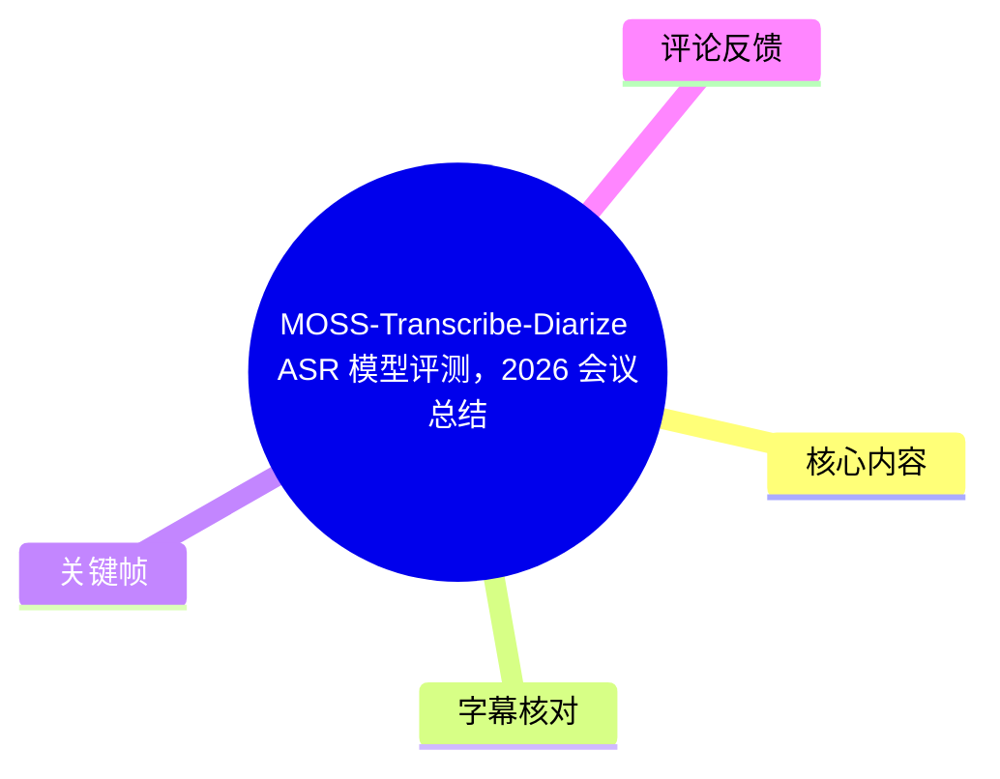
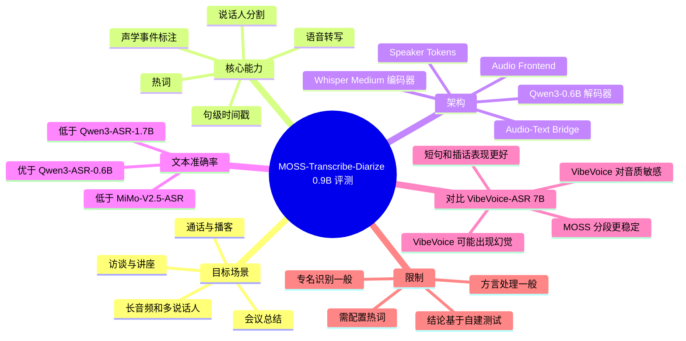
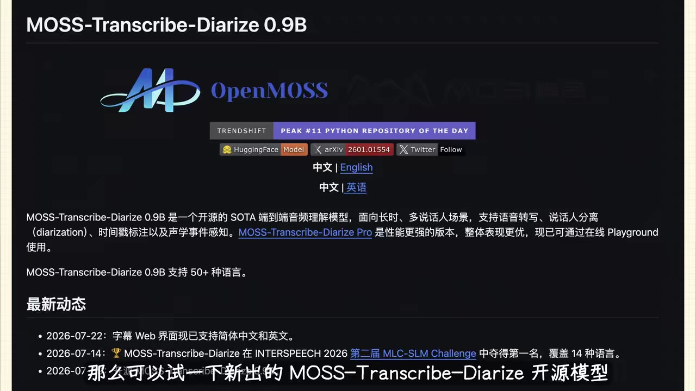
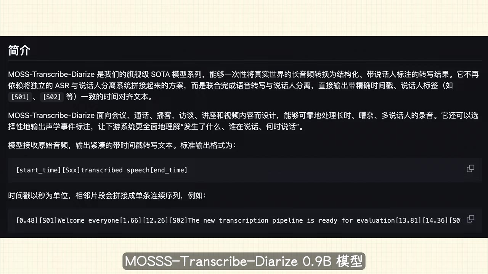
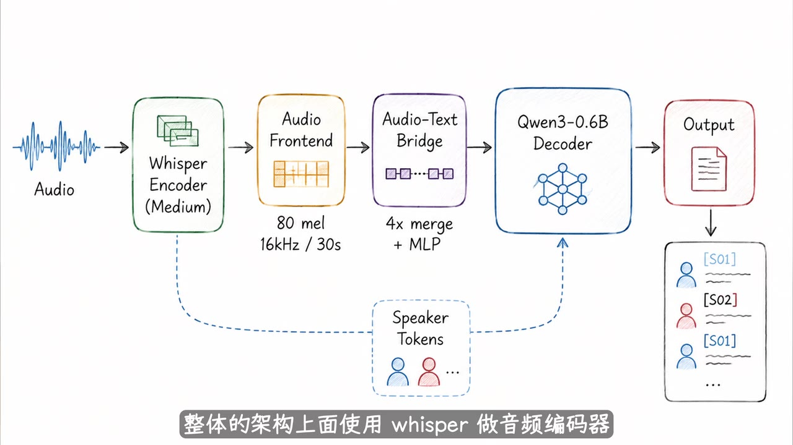
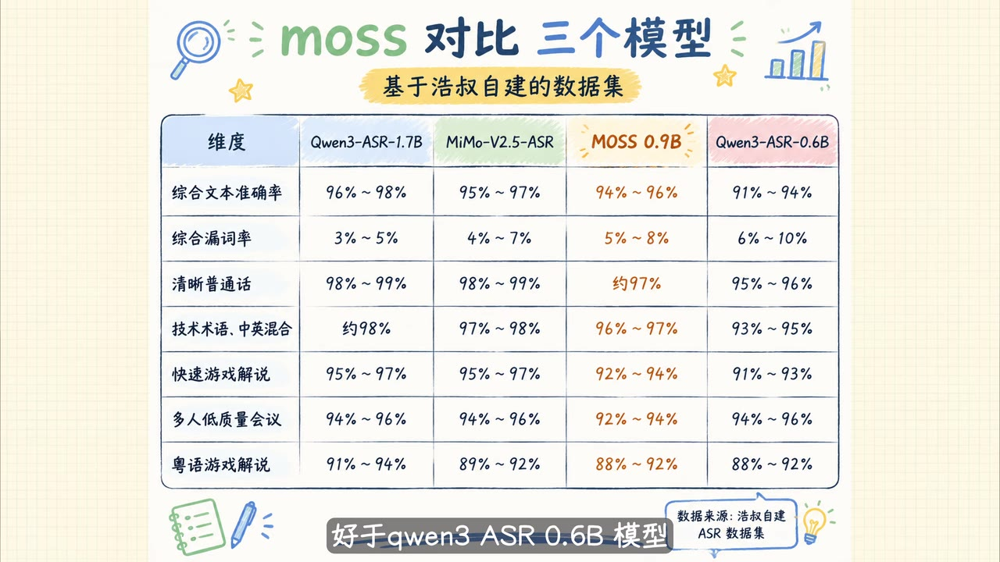

# MOSS-Transcribe-Diarize ASR 模型评测，2026 会议总结场景首推模型

> 来源：[Bilibili 视频](https://www.bilibili.com/video/BV1Bp3k6mEX9)  
> UP 主：浩叔_AI编程｜时长：3 分 15 秒｜合集：AIcode  
> 视频主题：比较 **MOSS-Transcribe-Diarize 0.9B** 与 **VibeVoice-ASR 7B** 在中文会议场景下的转写、说话人分割与时间戳表现。

## 小结

视频评测的对象是开源模型 **MOSS-Transcribe-Diarize 0.9B**。它面向会议、通话、播客、访谈、讲座等长音频、多说话人内容，目标是在一次转录中同时输出文本、句级时间戳、说话人标签，并可选输出声学事件标注。UP 主的核心推荐并非“它的纯文本识别率最高”，而是它在中文会议总结所需的**说话人切分稳定性、短句处理与插话后的说话人身份恢复**方面表现突出。

从视频展示的自建数据集比较表看，MOSS 0.9B 的综合文本准确率为 **94%～96%**、综合漏词率为 **5%～8%**，低于 Qwen3-ASR-1.7B 和 MiMo-V2.5-ASR 的纯文本成绩，但优于 Qwen3-ASR-0.6B。UP 主口述称，Qwen3-ASR-1.7B 的准确率约比 MOSS 高 **2%**；因此，对“只追求逐字文本准确率”的任务，MOSS 并不一定是首选。

与 VibeVoice-ASR 7B 的实测对比是视频重点。UP 主在一个含 **10 名发言人**、包含短句和频繁插话的困难音频中观察到：MOSS 虽仍可能发生说话人归属错误，但通常能保持正确的分段边界；VibeVoice-ASR 则对音频质量更敏感，可能产生幻觉，并在多次说话人切换时将短句并到同一发言人名下，导致会议纪要的可用性显著降低。

实务上，应将 MOSS 视为“会议结构化转写”模型，而不是无条件替代所有 ASR 的通用最优方案。视频明确提示其限制：**方言能力一般、专用名词识别一般，须配合热词功能**。对于普通话会议、多人讨论、交替发言以及需要追溯“谁在何时说了什么”的场景，它具有较强针对性；对粤语、方言、术语密集内容，则应先做样本验证并配置热词。

视频的“2026 年现阶段首推”属于 UP 主基于其测试与使用体验的判断，具有时效性。模型版本、在线 Playground、基准集和竞争模型迭代都可能改变结论；视频中的准确率表也标明数据源为“浩叔自建 ASR 数据集”，不能直接等同于统一公开基准排名。

## 思维导图





## 目录

- [背景、适用问题与时效性](#背景适用问题与时效性)
- [模型定位、输出形式与架构](#模型定位输出形式与架构)
- [自建数据集的文本识别对比](#自建数据集的文本识别对比)
- [与 VibeVoice-ASR 7B 的会议实测](#与-vibevoice-asr-7b-的会议实测)
- [会议总结的选型步骤](#会议总结的选型步骤)
- [结论、限制与验证边界](#结论限制与验证边界)
- [字幕比对](#字幕比对)
- [评论分析](#评论分析)
- [处理记录](#处理记录)

## 背景、适用问题与时效性 [00:00:28](https://www.bilibili.com/video/BV1Bp3k6mEX9?t=28)

视频针对的不是简单的“音频转文字”，而是会议总结中常见的结构化需求：

1. 长音频能稳定转录；
2. 能分割不同说话人；
3. 能提供精确时间戳，方便回听原音频；
4. 专有名词可借助自定义热词改善；
5. 需要处理多人轮流、短句、插话等会议口语现象。

UP 主表示，其因需要在“浩旺字幕软件”（ASR 对该软件名识别不稳定，以下不据此扩展产品细节）中集成说话人分割与识别能力，测试过市面上的多种技术方案，最终认为新出的 MOSS-Transcribe-Diarize 整体体验较好，并将其推荐给有会议总结需求的用户。

画面中的模型页面将 MOSS-Transcribe-Diarize 0.9B 描述为开源的端到端音频理解模型，面向长时、多说话人场景；该页还写明其支持语音转写、说话人分离（diarization）、时间戳标注和声学事件感知，并标注支持 **50+ 种语言**。画面列出的动态包括：

- **2026-07-22**：字幕 Web 界面现已支持简体中文和英文；
- **2026-07-14**：MOSS-Transcribe-Diarize 在 INTERSPEECH 2026 第二届 MLC-SLM Challenge 中获得第一名，覆盖 14 种语言。

这些内容来自视频中展示的模型页面，未在本视频内提供可独立复核的赛事详情、测试任务设置或完整榜单，因此应作为画面转述，而非对模型全能力的独立验证。



> 图：关键帧展示模型名称、OpenMOSS 标识、端到端长音频/多说话人定位、50+ 语言支持，以及视频引用的 2026 年 7 月更新与竞赛信息。它用于核对模型的正式名称、版本和画面中的时效性声明。

## 模型定位、输出形式与架构 [00:00:31](https://www.bilibili.com/video/BV1Bp3k6mEX9?t=31)

### 面向会议的端到端输出

视频介绍，MOSS-Transcribe-Diarize 0.9B 专为会议、通话、播客、访谈、讲座等内容设计，能够一次性处理长音频，并带有：

- **说话人分割**：将连续音频切为不同发言人的片段；
- **句子时间戳**：为转写文本定位到音频时间；
- **声学事件识别/标注**：视频口述为“可以识别声学事件”，画面表述为“可选择性输出声学事件标注”。

画面进一步给出其标准输出的概念格式：

```text
[start_time][Sxx]transcribed speech[end_time]
```

其中，`start_time` 与 `end_time` 的单位为秒，`[Sxx]` 是说话人标签，例如 `[S01]`、`[S02]`。这类格式的关键价值在于，输出不仅回答“说了什么”，还保留“谁说”“何时说”的对齐信息，便于后续会议纪要、检索、发言归因与回放。



> 图：关键帧说明模型将 ASR 与说话人分离联合完成，直接生成含时间戳、说话人标签的文本；这解释了视频为何将其定位为会议总结而非普通字幕转写模型。

### 视频展示的架构

UP 主口述称，整体架构使用 Whisper 做音频编码器、Qwen3 0.6B 做解码器。画面架构图给出的链路更具体：

```text
Audio
  → Whisper Encoder (Medium)
  → Audio Frontend（80 mel，16 kHz / 30 s）
  → Audio-Text Bridge（4× merge + MLP）
  → Qwen3-0.6B Decoder
  → Output（文本与说话人标签）
```

图中还绘制了 **Speaker Tokens**，以虚线连接到 Whisper Encoder 和 Qwen3-0.6B Decoder，输出侧展示交替的 `[S01]`、`[S02]` 等标签。视频没有展开训练数据、参数总量的精确构成、推理显存、吞吐量或部署命令，因此不能从本视频推导其硬件成本或实时性能。



> 图：关键帧给出 Whisper Medium、80 mel、16 kHz/30 秒、4× merge + MLP、Qwen3-0.6B Decoder 等明确架构参数，是理解其端到端“转写+分离”设计的主要依据。

## 自建数据集的文本识别对比 [00:00:55](https://www.bilibili.com/video/BV1Bp3k6mEX9?t=55)

UP 主先明确区分了“纯识别准确率”与“会议可用性”：作为非大参数模型，MOSS 在文本准确率上不如 MiMo-V2.5-ASR 与 Qwen3-ASR-1.7B，但优于 Qwen3-ASR-0.6B；其中 Qwen3-ASR-1.7B 的准确率约高出 MOSS **2%**。

视频画面展示“基于浩叔自建的数据集”的对比表。以下为画面可读数值：

| 维度 | Qwen3-ASR-1.7B | MiMo-V2.5-ASR | MOSS 0.9B | Qwen3-ASR-0.6B |
| --- | ---: | ---: | ---: | ---: |
| 综合文本准确率 | 96%～98% | 95%～97% | 94%～96% | 91%～94% |
| 综合漏词率 | 3%～5% | 4%～7% | 5%～8% | 6%～10% |
| 清晰普通话 | 98%～99% | 98%～99% | 约 97% | 95%～96% |
| 技术术语、中英混合 | 约 98% | 97%～98% | 96%～97% | 93%～95% |
| 快速游戏解说 | 95%～97% | 95%～97% | 92%～94% | 91%～93% |
| 多人低质量会议 | 94%～96% | 94%～96% | 92%～94% | 94%～96% |
| 粤语游戏解说 | 91%～94% | 89%～92% | 88%～92% | 88%～92% |



> 图：关键帧保留了视频中最具体的量化比较。其价值在于避免将“会议场景推荐”误读为“MOSS 在所有纯文本识别指标上第一”；表中 MOSS 的综合文本准确率和漏词率均不是四者最佳。

### 能力取舍与限制

根据视频口述和对比表，可归纳出以下选型边界：

- **MOSS 的优势不以文本准确率第一为前提**：其主要卖点是说话人识别、分割与短句处理带来的结构化可用性。
- **方言不是其强项**：UP 主明确评价其方言处理能力“一般”。表中粤语游戏解说为 88%～92%，低于 Qwen3-ASR-1.7B 的 91%～94%。
- **专有名词需要热词补强**：UP 主称专用名词识别一般，“必须配合热词功能使用”。视频没有演示热词的具体 API、词表格式、权重参数或配置步骤。
- **短语完整性较好**：UP 主认为其短语保留较完整，出现“漏句、漏词”的情况较少；这是主观测试结论，视频未给出对应的逐条误差统计。
- **表格的外推限制**：数据来自 UP 主自建数据集，视频没有披露样本数量、录音设备、音质分层、人工标注规则、计算方法和置信区间。因此这些区间适合用于该评测内部比较，不应直接当成公开标准榜单结果。

## 与 VibeVoice-ASR 7B 的会议实测 [00:01:19](https://www.bilibili.com/video/BV1Bp3k6mEX9?t=79)

### 官方指标与主要对标对象

UP 主称，官方的三个指标对比中，MOSS 相比 VibeVoice-ASR、Gemini、SenseVoice、ElevenLabs 和豆包有更好的表现。由于本视频提供的画面与 ASR 文本均未完整呈现这“三个指标”的名称、具体分数、测试条件和版本号，无法在本文复原完整横向表格，也不应将该口述扩展为所有任务上的绝对领先结论。

视频认为，**VibeVoice-ASR 7B** 是最适合与 **MOSS 0.9B** 对标的对象，理由是两者均为开源模型且功能相近。后续实测的判断重点并非参数量，而是中文会议中的稳定性、说话人识别与切分质量。

### 十人、高频插话音频测试 [00:01:43](https://www.bilibili.com/video/BV1Bp3k6mEX9?t=103)

UP 主使用多个中文语音案例验证后，给出的结论是：MOSS 在中文识别稳定性、说话人识别和分割准确率上优于参数更大的 VibeVoice-ASR。

其中一个困难样本具有以下条件：

- 含 **10 个发言人**；
- 存在大量短句；
- 存在频繁插话；
- 因而对说话人边界判断、身份归属和连续上下文恢复提出更高要求。

UP 主展示两个模型的转录对比表后，认为 MOSS 明显优于 VibeVoice-ASR，具体观察包括：

| 观察维度 | MOSS-Transcribe-Diarize | VibeVoice-ASR |
| --- | --- | --- |
| 对音频质量的敏感性 | 视频未称其没有影响，但总体更稳定 | UP 主称其对音频质量较敏感 |
| 幻觉 | 视频未报告该样本中的突出幻觉问题 | UP 主称其容易出现幻觉 |
| 多次说话人切换 | 可能发生说话人归类错误，但分割边界仍正确 | 短句可能被归类到同一说话人 |
| 短句识别与分割 | UP 主评价“非常出色” | 视频评价“几乎是不可用的” |

这里需要严格区分：上述是 UP 主对于展示样本的评测结论，不表示任意音频、任意版本、任意部署配置下的必然结果。

### 155 秒处的插话恢复案例 [00:02:31](https://www.bilibili.com/video/BV1Bp3k6mEX9?t=151)

视频继续分析一个发生在约 **155 秒** 的案例：一名发言人开始较长发言，MOSS 将其标为 `S06`；他人插话时切换为 `S02`；插话结束后，MOSS 又回到主发言人 `S06`。UP 主以此说明，模型能在短暂打断后恢复主发言人的身份连续性。

对照之下，UP 主称 VibeVoice-ASR 在被插话后，将后续内容识别成新的发言人。这会直接影响会议纪要：长段发言可能被错误拆到多个虚拟说话人名下，使“发言人—观点—时间”的关联难以使用。

这一案例也揭示了会议 ASR 的评估原则：不宜只检查字错率，还应检查以下结构化指标。

1. **说话人边界**：每次轮次切换是否切在合理位置；
2. **发言人连续性**：插话结束后能否回归原发言人；
3. **短句归属**：简短回应是否被并入错误的人；
4. **文本幻觉**：低音质、重叠语音下是否生成原音频中不存在的内容；
5. **时间对齐**：每段文本能否有效回跳到原始音频。

## 会议总结的选型步骤 [00:02:55](https://www.bilibili.com/video/BV1Bp3k6mEX9?t=175)

视频没有提供安装命令、模型下载地址、API 调用代码或热词配置样例，因此无法从素材中整理可复现的部署教程。结合视频已经实际展示的评估逻辑，可采用以下不超出素材边界的选型流程。

### 1. 先确认任务是否需要“谁在何时说了什么”

优先考虑 MOSS 的场景：

- 多人会议、访谈、电话沟通；
- 需要在纪要中标记发言人；
- 需要按时间回听和核对；
- 存在短回应、抢话和插话；
- 长音频需要一次性结构化转写。

若任务只是清晰普通话单人音频的逐字转写，则应同时比较文本准确率更高的模型，而不应仅根据本视频的会议场景结论做决定。

### 2. 用真实业务音频做小样本对比

应至少覆盖视频指出的困难条件：

- 正常清晰普通话；
- 多人低质量会议；
- 多人连续交替与短句；
- 一名主发言人被插话后继续发言；
- 业务中实际存在的中英混合、技术术语、专有名词；
- 若涉及方言，还应单独加入粤语或目标方言样本。

### 3. 同时评估文本和结构化质量

不要只看“文本有没有大体识别出来”。建议逐段核查：

| 检查项 | 与视频结论的关系 |
| --- | --- |
| 文本准确率与漏词 | MOSS 不一定优于 Qwen3-ASR-1.7B、MiMo-V2.5-ASR |
| 说话人标签是否稳定 | 是视频推荐 MOSS 的主要理由 |
| 切分边界是否正确 | MOSS 即使归属有误，UP 主仍认为其分段常保持正确 |
| 插话后是否恢复主说话人 | 视频以 `S06 → S02 → S06` 为重点案例 |
| 短句是否被吞并 | 视频认为这是 VibeVoice-ASR 的明显问题 |
| 是否出现幻觉 | 视频指出 VibeVoice-ASR 对音质敏感且容易幻觉 |
| 时间戳能否回听 | MOSS 的结构化输出关键能力之一 |

### 4. 对术语和方言设置额外验证

视频明确指出 MOSS 的专用名词与方言表现存在限制。因此：

- 将高频人名、产品名、公司名、技术缩写整理为热词候选；
- 在上线前人工检查热词是否确实改善术语识别；
- 对关键结论、金额、日期、行动项等会议纪要字段进行人工复核；
- 不能因为模型输出带有说话人标签和时间戳，就跳过敏感业务的校验环节。

## 结论、限制与验证边界 [00:02:55](https://www.bilibili.com/video/BV1Bp3k6mEX9?t=175)

UP 主的最终结论是：MOSS-Transcribe-Diarize 的说话人识别与分割属于“目前第一梯队”水平，并可能是 **2026 年现阶段最适合中文会议总结的 ASR 模型**。这是一条明确但带条件的推荐，其支撑主要来自中文实测、十人插话样本、与 VibeVoice-ASR 的对照，以及模型提供的端到端结构化输出。

可迁移的经验是：

- 会议总结模型的价值不只来自文本字准率，还来自说话人归因、边界切分、时间对齐和插话恢复；
- 小参数模型可能在面向特定任务的结构化能力上优于大参数对手；
- 对多人会议，应使用最复杂、最接近业务的录音来评测，不应只拿清晰单人普通话做测试；
- 当专名、方言是核心内容时，热词和人工审校仍是必要环节。

同时必须保留以下限制：

1. 视频没有展示完整公开基准、统一测试协议、推理配置和逐项原始转写，不能据此验证所有横向性能宣称。
2. 准确率表来自 UP 主自建数据集，样本规模与统计方法未披露。
3. “第一梯队”“首推”是创作者判断，而非本素材可独立证明的客观排名。
4. 视频未提供安装、部署、显存、延迟、吞吐、许可证、热词接口和价格等工程信息。
5. 视频中出现的模型页面更新为 2026 年 7 月信息；模型和竞争产品会持续变化，选型前应复核当前版本与官方文档。

## 字幕比对

站内字幕未提供可用文件，因此本次无法进行逐句的“站内字幕—ASR”一致性核验；但已检查本次 ASR 结果。ASR 诊断未标记 `noAudioStream=true`，且识别到中文音轨：总时长 **194.769 秒**、语音时长 **165.5 秒**、语音覆盖率 **84.97%**、首段语音始于 **00:00:28.820**、最后语音止于 **00:03:14.480**。因此，开头约 28.82 秒未识别到语音属于视频画面/静音引入，不能据此视为无音轨或工具故障。

| 字幕来源 | 完整性 | 专有名词 | 时间轴 | 主要问题 |
| --- | --- | --- | --- | --- |
| Bilibili 站内字幕 | 未提供可用字幕，无法评估 | 无法评估 | 无法评估 | 素材中没有站内 SRT 或可用字幕文本 |
| 本次 ASR 字幕 | 覆盖主要口述内容；共 8 段 | 较多模型名、产品名误识别 | 可用；提供毫秒级 SRT 起止时间 | 单段过长，断句不足；英文模型名、软件名与技术词存在明显谐音/拼写错误 |

最终正文以 **本次 ASR 的真实 SRT 时间轴**作为章节定位依据，并以关键帧中的可读文字校正或限定以下重点术语：

| ASR 原始识别（部分） | 正文采用 | 校正依据 |
| --- | --- | --- |
| MOS Transliber Dialize / MOS TraceLiber Dialize | MOSS-Transcribe-Diarize | 关键帧模型标题与视频标题 |
| MOS 0.9B | MOSS-Transcribe-Diarize 0.9B | 关键帧模型介绍页 |
| Web Voice / Webvo ASR | VibeVoice-ASR 7B | 视频标题、口述上下文；英文拼写以标题主题中的对比对象说明为准 |
| VSAP | Whisper | 架构关键帧明确标注 “Whisper Encoder (Medium)” |
| 千问三 0.6B | Qwen3-0.6B | 架构关键帧明确标注 |
| 说话能分割 / 分剋 | 说话人分割 | 中文 ASR 同音错误，结合画面中的 diarization 与 speaker labels 校正 |
| 短剧 | 短句 | 上下文为短发言、插话场景 |
| 插画 | 插话 | 上下文为多人会议打断发言 |

需要注意：ASR 将部分句子合并为约 24 秒的大段，导致“模型介绍”“架构”“榜单口述”等内容共用一个时间段。本文只在章节层面使用这些 SRT 起点链接，避免伪造更细粒度的句内时间点。

## 评论分析

仅获取到 2 条热评，未取得第 3 条；以下不将评论内容当作已验证事实。

1. **你挖你挖的**（1 赞）  
   评论仅发布了一个 Bilibili 专栏链接：`https://www.bilibili.com/read/cv51888095`。这可能意在补充资料，但当前素材没有提供该专栏正文，也未对外链内容做抓取或验证，无法判断它与视频结论的具体关系及可信度。

2. **YAKUSUKA**（0 赞）  
   评论为“UP主加油！”。这是对创作者的支持性反馈，不包含模型性能、部署经验、争议或补充技术信息。

3. **第 3 条热评**  
   素材的热评结果仅返回两条，未提供第三条可分析评论，因此不补造内容。

## 处理记录

- Worker ID：`worker-mrj0www4-e8d79408`
- 生成模型：`gpt-5.6-terra`
- 调用工具与模型：素材处理流程提供的视频元数据、关键帧、评论结果、字幕目录检查结果；语音识别模型为 `large-v3-turbo`。
- 使用的应用工具：视频合并文件、音频导出 `audio/audio.wav`、关键帧提取 `frames/`、ASR 输出 `asr/asr-result.json` 与 `asr/transcript.srt`、站内字幕检索 `subtitles/`、评论采集 `comments/comments.json`。
- 字幕选择：站内字幕未提供可用内容；已检查本次 ASR，采用其 SRT 的真实起止时间作为时间轴来源，并以关键帧可读文字修正模型名、架构名和部分技术术语。
- ASR 音轨判断：诊断未标记 `noAudioStream=true`；音轨存在，识别语言为中文，语言概率 `0.9951171875`，使用 CUDA 与 `int8_float16` 推理。
- 关键帧选择依据：`frame-001.jpg` 用于模型定位与更新信息；`frame-002.jpg` 用于核对结构化输出格式；`frame-003.jpg` 用于确认架构和参数；`frame-004.jpg` 用于转录准确率比较表。其余关键帧未在提供素材中附带可验证画面说明，未强行引用。
- 缓存清理：提供的素材未包含缓存清理执行日志；因此无法确认是否已清理，不将其表述为已完成。
- 未解决问题：缺少站内字幕；缺少模型官方指标完整表与链接；缺少实测转录对比表原文、样本音频、测试配置和热词参数；无法独立验证画面中赛事、在线 Playground 与跨模型性能声明。
