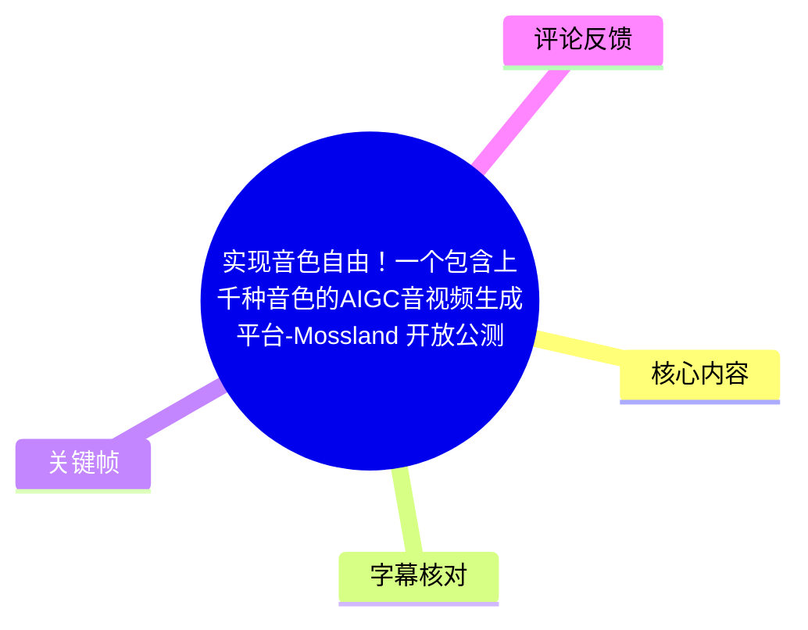
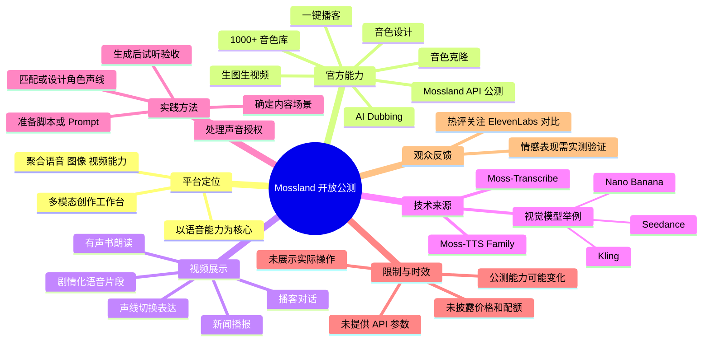
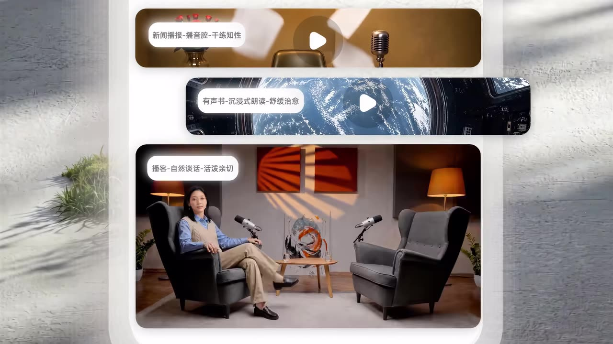
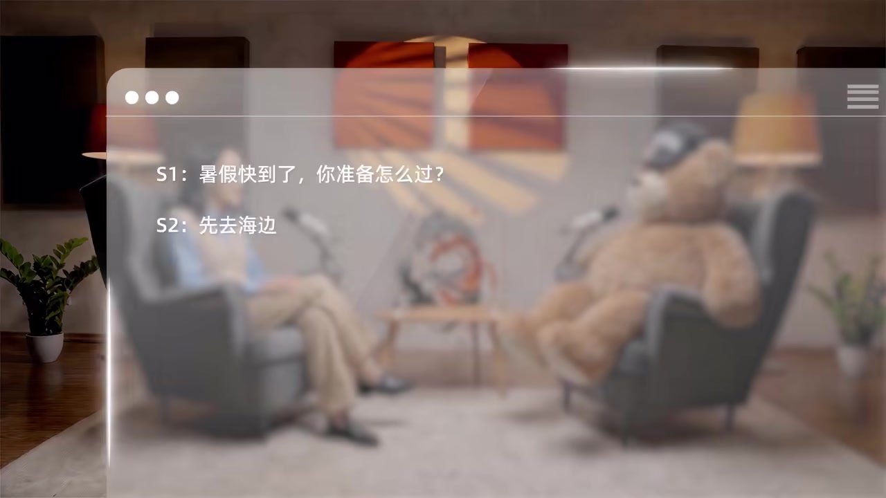
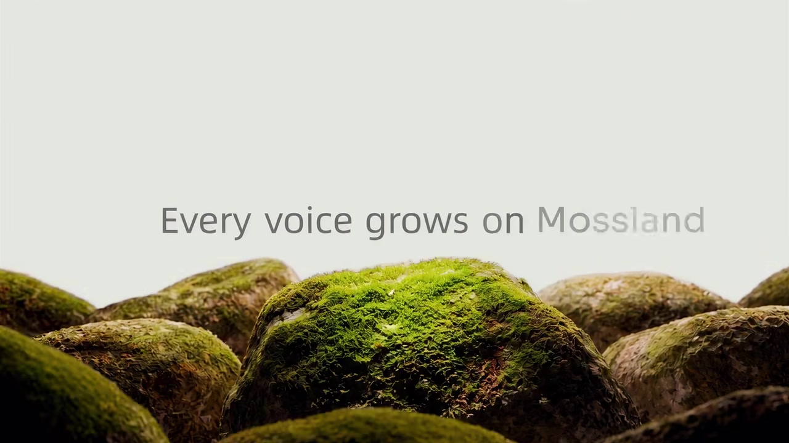

# 实现音色自由！一个包含上千种音色的AIGC音视频生成平台-Mossland 开放公测啦！

> 来源：[Bilibili 视频](https://www.bilibili.com/video/BV1kjNj6PESZ)  
> UP 主：MosiAI｜合集：AIcode｜时长：1 分 53 秒｜视频分辨率：3840×2160  
> 发布状态：Mossland 开放公测宣传视频｜元数据抓取时间：2026-07-13

## 小结

MosiAI 在本视频中宣布 AIGC 音视频创作平台 **Mossland 开放公测**。官方将其定位为以“语音能力”为核心的一站式多模态创作工作台：以语音生成作为基础能力，同时聚合图像、视频等模型能力，面向内容创作者和开发者提供创作入口。

素材中明确列出的平台能力包括：**1000+ 音色库**、音色设计、音色克隆、生图生视频、Prompt 驱动的一键播客、AI Dubbing（视频翻译配音或声线转换），以及同步开放公测的 Mossland API。官方简介还提到其音视频模型矩阵包含 Moss-TTS Family、Moss-Transcribe，并举例称视觉能力可接入 Kling、Seedance、Nano Banana。

视频重点不是后台操作教学，而是以剧情对白、新闻播报、有声书和播客等场景来呈现“声音可选、可设计、可转换”的创作愿景。关键帧直接展示了“新闻播报—播音腔—干练知性”“有声书—沉浸式朗读—舒缓治愈”“播客—自然谈话—活泼亲切”等场景化标签，并用 `S1`、`S2` 形式展示双角色播客文本。

对于创作者，视频传递的可迁移经验是：先按内容场景组织脚本，再匹配或设计对应声线；涉及对话时，应明确拆分角色与台词。对于开发者，API 公测意味着存在程序化接入可能，但本素材没有提供认证、端点、价格、限流或请求参数，实际接入必须以实时 API 文档为准。

需特别注意：视频为 113 秒品牌宣传片，未展示完整的注册、生成、编辑、导出或 API 调用流程；也未披露音色克隆样本要求、支持语言范围、音色授权、免费额度、模型延迟、输出规格及审核机制。因此，宣传中的“1000+”“一键”“任何语言”等相关表达不能被延伸解读为已验证的性能承诺。

信息具有时效性。该视频发布时产品处于“开放公测”阶段，模型版本、功能入口、第三方模型接入、计费策略、调用配额及服务规则均可能后续调整。

## 思维导图





## 目录

- [发布背景与时效性](#发布背景与时效性)
- [平台定位与官方能力](#平台定位与官方能力)
- [视频中的音色与内容形态展示](#视频中的音色与内容形态展示)
- [播客示例与可提炼创作流程](#播客示例与可提炼创作流程)
- [技术来源、API 与参数缺口](#技术来源api-与参数缺口)
- [结论、限制与使用建议](#结论限制与使用建议)
- [字幕比对](#字幕比对)
- [评论分析](#评论分析)
- [处理记录](#处理记录)

## 发布背景与时效性 [00:00](https://www.bilibili.com/video/BV1kjNj6PESZ?t=0)

视频标题宣布 Mossland “开放公测”。根据官方简介，Mossland 是一个以“语音能力”为核心的 AIGC 一站式创作平台：平台将语音生成作为原子能力，并希望在一个工作台中聚合语音、图像与视频等多模态模型能力，从而减少创作者在多个工具之间切换的成本。

官方还称，Mossland 在内测期间“活跃创作者已突破一万”。这是发布方提供的阶段性数据，素材未提供统计口径、统计截止时间、留存数据或独立验证信息，因此只能视为官方运营表述，不能据此推导总注册用户量或平台商业表现。


> 图：开场画面为人物使用电话的剧情化场景，强调声音、人物与叙事之间的关系。其价值在于帮助理解宣传片的表达重点是“声音服务于角色与故事”，但该画面不是具体产品界面，也不能证明某项可操作功能。

### 时效性说明

- 视频时长为 113 秒，定位为开放公测宣传，而非产品技术白皮书或操作教程。
- 素材中提供的体验入口为 `https://mossland.mosi.cn`，开放平台入口为 `https://platform.mosi.cn`。
- 本次素材未包含上述网站的实时页面、套餐、服务条款或 API 文档内容，本文不对网站当前状态作额外推断。
- 公测阶段的模型版本、可用功能、调用额度、收费方式与合规规则可能变化，应以使用时的官方网站和服务条款为准。

## 平台定位与官方能力 [00:20](https://www.bilibili.com/video/BV1kjNj6PESZ?t=20)

### 1. 语音能力：音色库、设计与克隆

官方简介将 Mossland 的语音相关能力概括为：

- **1000+ 音色库**：用于覆盖不同内容场景的海量音色；
- **音色设计**：按创作需求塑造目标声线；
- **音色克隆**：基于参考声线生成相近的声音；
- **AI Dubbing**：视频一键翻译配音，或快速转换声线；
- **一键播客**：输入 Prompt，生成创意播客。

本次 ASR 中可辨识出“我有一千声音”“我有一万故事”“不只是选择的声音，而是设计的声线”等宣传性表述，与官方简介中的“1000+ 音色库”“音色设计”形成呼应。

但视频并未展示音色库的具体列表、音色筛选条件、试听方式、音色数量统计口径、商用授权范围，亦未展示克隆流程。因此，不能从宣传片进一步确认音色数量是否按角色、语言、风格、模型版本或其他方式统计。

### 2. 多模态工作台

官方描述称，Mossland 除语音能力外，还聚合图像、视频等多模态模型能力。“生图生视频”部分举例提到 Kling、Seedance、Nano Banana。

这一信息说明平台目标是将语音、图像、视频创作放到同一创作链路中，但素材没有说明：

- 这些视觉模型是否均为长期稳定可用的接入项；
- 具体接入的模型版本；
- 各模型是自研、第三方接口接入，还是两者并存；
- 视觉生成与语音生成是否能够自动形成同一项目工作流；
- 图像、视频任务的价格、时长、排队情况和导出限制。

### 3. 官方能力与素材证据范围

| 能力 | 官方描述 | 视频中可见的方向 | 素材未披露的信息 |
| --- | --- | --- | --- |
| 1000+ 音色库 | 多场景海量音色 | 新闻、有声书、播客等情境 | 分类逻辑、试听机制、授权范围 |
| 音色设计 | “捏出”想要的声音 | “设计声线”的口播 | 可调节维度、输入方式、控制参数 |
| 音色克隆 | 声线复现或转换 | 标题与简介直接列出 | 样本时长、采样质量、授权验证 |
| 一键播客 | 输入 Prompt 生成创意播客 | 双角色播客与对话文本 | Prompt 模板、角色上限、编辑能力 |
| AI Dubbing | 翻译配音或声线转换 | 官方简介列出 | 支持语种、口型同步、字幕导入导出 |
| 生图生视频 | 接入主流视觉模型能力 | 宣传片展示丰富视觉内容 | 模型版本、参数、任务限制 |
| Mossland API | 同步开放公测 | 官方简介列出 | 鉴权、端点、SDK、限流、计费 |



> 图：画面直接给出三种场景标签：“新闻播报—播音腔—干练知性”“有声书—沉浸式朗读—舒缓治愈”“播客—自然谈话—活泼亲切”。这张关键帧的价值在于明确展示平台宣传中“内容场景—声音风格”的对应关系；它属于宣传式界面表达，不足以证明完整功能菜单或参数配置。

## 视频中的音色与内容形态展示 [00:40](https://www.bilibili.com/video/BV1kjNj6PESZ?t=40)

视频使用连续的剧情短句、独白和播客语音片段，表现不同内容类型与声线风格。ASR 可识别出的内容包括：

```text
我总是找到一个声音
我在听说
小鲁，你怎么样？
先生，是我
终于，那声音就出现在照片里了
我有一千声音
我有一万故事
是你走还是我走
有非常孤独地漂浮在太空中
Hello，大家好
欢迎来到今天的播客
不只是选择的声音，而是设计的声线
虽然我现在的声音是这样
但是我随时可以变成这样
变成这样
```

其中，开头数句与“有非常孤独地漂浮在太空中”等句子存在明显识别歧义，且 ASR 未提供逐句时间戳与上下文，不能将这些内容视为精确台词。较可靠的结论是：视频通过多角色对白、叙事语句、播客开场和声线切换式表达，强调语音在角色、情绪与场景中的可塑性。

### 三类可见内容形态

1. **新闻播报**  
   关键帧将该方向标为“播音腔—干练知性”。这类音色定位强调清晰、正式与信息传递效率，适合资讯、口播或知识内容。

2. **有声书朗读**  
   画面标为“沉浸式朗读—舒缓治愈”。该方向对应故事、小说、叙事性内容的氛围化表达，重点在于声音是否能够承载连贯的叙述体验。

3. **播客自然对话**  
   画面标为“自然谈话—活泼亲切”。视频后段以双人座椅、麦克风和 `S1`、`S2` 文本，强化了多角色对话与播客内容生产的使用方向。

视频中的“音色自由”是品牌主张。素材没有提供音色相似度、情绪控制精度、语速范围、停顿调节、长文本稳定性、跨语言能力、发音准确率或模型延迟等量化指标，不能据此评价其技术效果优于同类产品。

## 播客示例与可提炼创作流程 [01:00](https://www.bilibili.com/video/BV1kjNj6PESZ?t=60)

视频后段出现双人播客场景。本次 ASR 可识别出如下对话：

```text
S1：暑假快到了，你准备怎么过？
S2：先去海边旅行，再报个水彩班学画画。
```

关键帧画面可直接阅读到：

```text
S1：暑假快到了，你准备怎么过？
S2：先去海边
```

因此，`S1`、`S2` 角色结构以及第一句完整文本可由画面确认；第二句“旅行，再报个水彩班学画画”属于 ASR 补充内容，画面中未完整展示，不应伪称为画面文字。



> 图：该画面在双人播客场景上叠加文本窗口，直接展示 `S1`、`S2` 的说话人标签与对话内容。它是素材中支持“角色化文本组织”的最直接证据；但画面未展示生成按钮、声线选择、参数面板、音频波形或导出流程，不能据此推断实际产品操作细节。

### 基于素材可提炼的概念流程

以下流程结合官方功能说明和视频中的对话示例整理，属于创作思路，不是视频实录的界面教程：

1. **确定内容形态**  
   先明确目标是新闻播报、有声书、播客、视频配音还是其他内容。不同内容形态对声音的正式程度、情绪强度和角色区分度要求不同。

2. **准备 Prompt、脚本或角色台词**  
   官方将一键播客描述为“输入 Prompt，生成创意播客”。若是多人内容，可像视频示例一样按 `S1`、`S2` 或角色名拆分台词。

3. **匹配、设计或克隆声线**  
   官方称可从音色库中选择声音，也可使用音色设计或音色克隆。素材未说明这三种能力是否在同一页面完成，或如何切换。

4. **生成后进行表达验收**  
   应重点检查角色区分、语速、语气、情绪、发音和长文本一致性是否符合脚本场景。宣传样片不能替代真实业务文本上的试听测试。

5. **需要视觉内容时再结合图像、视频能力**  
   官方称平台支持生图生视频，但没有明确展示文本、语音、图片和视频在同一项目中的自动联动方式。

6. **涉及他人声音时先处理授权**  
   音色克隆与声线转换可能涉及人格权益、著作权、表演者权或平台治理要求。素材未披露平台审核机制，但使用者应确保拥有本人声音或获得权利人的明确授权。

### 本视频未给出的关键参数

素材中没有可复现的界面参数、命令行命令或 API 调用示例，以下内容均无法确定：

- 音色设计是否支持年龄感、情绪、语速、音高、口音等维度；
- 音色克隆所需参考音频长度、格式、信噪比和文本要求；
- 单次生成可输入的文本长度、角色数和并发上限；
- 支持的语言、方言、翻译质量及跨语言音色保持能力；
- 输出音频格式、采样率、比特率、声道与下载限制；
- AI Dubbing 是否具备字幕识别、翻译审校、口型同步、背景音处理等能力；
- 生图生视频任务的具体模型选择、参数、积分或计费规则。

## 技术来源、API 与参数缺口 [01:10](https://www.bilibili.com/video/BV1kjNj6PESZ?t=70)

官方简介称，Mossland 的多模态能力基于模思智能团队自研的 **Moss-TTS Family**、**Moss-Transcribe** 等音视频模型矩阵；同时，模思开放平台的 **Mossland API** 也同步开放公测。

根据名称及官方描述，可以进行以下谨慎整理：

- **Moss-TTS Family**：名称中的 TTS 通常指文本转语音；结合官方“语音生成能力”的描述，可确认其与语音合成能力相关。素材未给出具体子模型、版本号、语言覆盖、音色数量或客观测评数据。
- **Moss-Transcribe**：名称表明其与转写能力相关，但素材未说明是否用于字幕生成、说话人分离、视频转写、翻译或其他具体任务。
- **Mossland API**：官方确认其为同步开放公测状态，但没有给出 API 地址、认证方式、模型标识、请求字段、返回字段、SDK、错误码、异步任务机制或限流策略。

开发者如果计划基于 API 接入，不应仅以宣传片作为实施依据。至少应核验以下信息：

1. API Key 或其他认证机制；
2. 可调用模型及模型标识；
3. 文本、音频、视频输入格式与大小限制；
4. 异步任务提交、查询和下载的机制；
5. 并发、速率限制、失败重试与错误码；
6. 音频输出格式和数据保存期限；
7. 内容审核、音色授权与用户数据处理规则；
8. 公测配额、计费口径与商用限制。



> 图：结尾画面显示 “Every voice grows on Mossland”。其价值在于概括视频的品牌叙事：让声音成为可扩展的创作媒介。画面不包含产品规格、模型版本或 API 参数，不能作为技术能力的量化依据。

## 结论、限制与使用建议 [01:50](https://www.bilibili.com/video/BV1kjNj6PESZ?t=110)

Mossland 的核心主张是：以语音与声线能力为中心，将音色库、音色设计、音色克隆、播客、AI Dubbing，以及图像视频生成能力汇聚在一个 AIGC 创作平台中。视频通过新闻、有声书、播客等场景，表达了“声音可选择、可设计、可服务于不同内容形态”的产品方向。

### 可迁移经验

- **按内容场景选择声音，而不只是按“好听”选择声音**  
  新闻播报强调清晰与可靠感；有声书强调叙事氛围与听觉耐受性；播客则更看重自然交流与角色区分。

- **多人内容应保留明确的角色结构**  
  使用 `S1`、`S2` 或角色名拆分台词，可方便为不同角色匹配声线，并为后续审校、替换局部文本和重生成提供结构基础。

- **将语音生成视为需要验收的制作环节**  
  应使用自己的目标文本测试发音、情感、停顿、重音、语速、专有名词和长段一致性，不能仅依据官方宣传片判断实际效果。

- **音色克隆必须前置授权与合规判断**  
  即使产品具备克隆或声线转换能力，使用者仍应确保参考声音的使用权利清晰，并遵守平台规则及适用法律。

### 明确限制

1. 视频没有展示注册、登录、创建项目、文本输入、音色选择、生成、编辑和导出的完整过程。
2. 视频没有披露价格、免费额度、积分消耗、模型延迟、队列时长或并发限制。
3. 视频没有说明音色克隆的样本要求、质量标准、相似度控制或权利验证机制。
4. 视频没有提供与 ElevenLabs 或其他 TTS 产品的客观横向测评。
5. 视频中的“1000+ 音色库”“一键播客”“AI Dubbing”“任何语言”等相关能力，缺少参数边界与实测条件，不宜超出官方文字描述进行推断。
6. 产品处于公测阶段，功能、模型、配额、政策和第三方能力接入均可能变化。

## 字幕比对 [00:00](https://www.bilibili.com/video/BV1kjNj6PESZ?t=0)

本次任务中，**Bilibili 站内字幕未提供可用内容**；同时，**本次 ASR 已执行**，并输出了若干口播转写片段。由于 ASR 未提供逐句时间戳，本文中的章节时间轴根据关键帧顺序、视频结构和总时长设置，用于导航而非逐字级对齐。

| 字幕来源 | 完整性 | 专有名词 | 时间轴 | 主要问题 |
| --- | --- | --- | --- | --- |
| Bilibili 站内字幕 | 无可用字幕 | 无法评估 | 无法评估 | 素材明确说明未提供可用站内字幕，无法用于文本校对。 |
| 本次 ASR 字幕 | 部分覆盖，包含宣传口播与播客示例 | 平台名、模型名未在 ASR 片段中稳定出现 | 未提供逐句时间戳 | 存在繁简混用、断句不稳、部分内容语义不完整及开场台词识别歧义。 |

### 最终字幕选择与校正原则

本文采用**本次 ASR 作为口播线索**，并以官方标题、官方简介和关键帧中可直接读取的文字进行交叉核对。

校正与保留原则如下：

- “我有一千声音”是 ASR 可识别的宣传语；“1000+ 音色库”则来自官方简介。二者语义对应，但本文仍区分口播与官方能力清单。
- “新闻播报—播音腔—干练知性”“有声书—沉浸式朗读—舒缓治愈”“播客—自然谈话—活泼亲切”可在关键帧中直接读取，优先级高于模糊 ASR。
- `S1：暑假快到了，你准备怎么过？` 与 `S2：先去海边` 可由关键帧确认；ASR 识别出的“旅行，再报个水彩班学画画”作为后续语音内容保留，但不伪称为画面全文。
- ASR 中“任何语言都可以一按”语义不完整，无法可靠恢复原始措辞，也不能据此确认平台支持的语言范围。
- “我在听说”“有非常孤独地漂浮在太空中”等语句缺少可靠上下文，未被作为精确引用、功能参数或技术证据使用。

## 评论分析 [00:00](https://www.bilibili.com/video/BV1kjNj6PESZ?t=0)

任务要求仅处理可获取的热评前三条。本次素材实际返回 **2 条可获取热评**，因此以下仅分析这两条，不补造第三条评论。

### 1. 从从从从从心丶｜1 赞

> “你们和elevenlab比怎么样，感觉tts还是说话很平淡，是我操作问题吗[笑哭]，参数感情啥的都整上了啊”

- **评论观点**：评论者将 Mossland 与 ElevenLabs 进行比较，并提出自身使用 TTS 时感到表达“很平淡”的疑问。
- **补充价值**：该评论指出语音合成实际体验中的重要评价维度：即便设置了与情感有关的参数，输出仍可能在情绪起伏、自然度或表现力上未达预期。
- **争议与可信度边界**：这是单一用户的主观体验，没有提供使用的模型版本、音色、输入文本、参数、生成音频或测试环境。它不能证明 Mossland 整体效果优于或弱于 ElevenLabs，也不能确认问题来自用户操作、参数配置、目标文本、模型能力或其他因素。视频本身未提供横向测试，需在统一脚本和评价标准下进行实测验证。

### 2. 我的一生都在原地踏步｜0 赞

> “💀”

- **评论观点**：仅表达情绪性反应，没有明确说明支持、质疑或使用体验。
- **补充价值**：未提供关于音色、功能、价格、参数或实际效果的有效信息。
- **可信度边界**：由于缺少可解释的文本论据，不能据此推断观众对 Mossland 的具体态度，也不能将其作为产品评价依据。

## 处理记录 [00:00](https://www.bilibili.com/video/BV1kjNj6PESZ?t=0)

- **Worker ID**：`worker-mrj0www4-e8d79408`
- **模型**：`gpt-5.6-terra`
- **任务对象**：`BV1kjNj6PESZ`
- **使用工具与素材产物**：
  - 视频与元数据整理；
  - 音频提取产物：`audio/audio.wav`；
  - 关键帧提取产物：`frames/`；
  - ASR 转写产物：`asr/`；
  - 评论获取产物：`comments/comments.json`；
  - 站内字幕检查目录：`subtitles/`。
- **字幕选择**：站内字幕未提供可用内容；本次 ASR 已执行。正文以 ASR 作为口播线索，以官方简介核对平台能力，以关键帧校正画面可见文字。
- **关键帧选择依据**：
  - `frames/frame-001.jpg`：电话人物场景，适合说明视频以声音、角色与叙事为开场主题；
  - `frames/frame-002.jpg`：直接显示新闻播报、有声书、播客三类内容场景及音色风格标签；
  - `frames/frame-003.jpg`：直接显示 `S1`、`S2` 说话人结构和播客文本示例；
  - `frames/frame-004.jpg`：显示品牌口号，用于说明宣传片的结尾定位与品牌收束。
- **时间轴依据**：素材未提供逐句时间戳 ASR 或完整镜头清单；章节链接依据关键帧顺序、视频内容结构和 113 秒总时长设置，为导航性时间点，不保证逐字对齐。
- **评论处理范围**：已按热评前三条要求处理可获取数据；实际仅获取到 2 条热评，因此只分析 2 条。
- **缓存清理**：素材未提供下载缓存、音频中间文件、关键帧文件或 ASR 临时文件的清理执行日志，无法确认缓存是否已清理；不对此作未验证声明。
- **未解决问题**：未获取站内字幕、逐句 ASR 时间戳、产品实时网页内容、完整 API 文档、价格配额、音色克隆授权政策及可复现实测音频；以上信息均未在正文中扩展推断。

## 评论分析

本次流程未获取到可用热评，因此不推断观众态度或额外结论。
