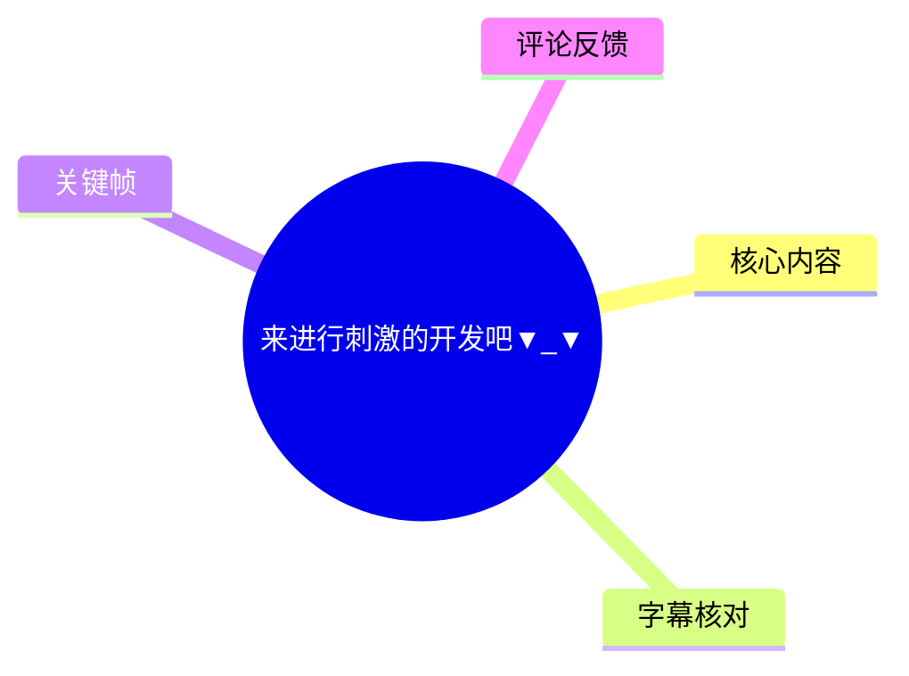
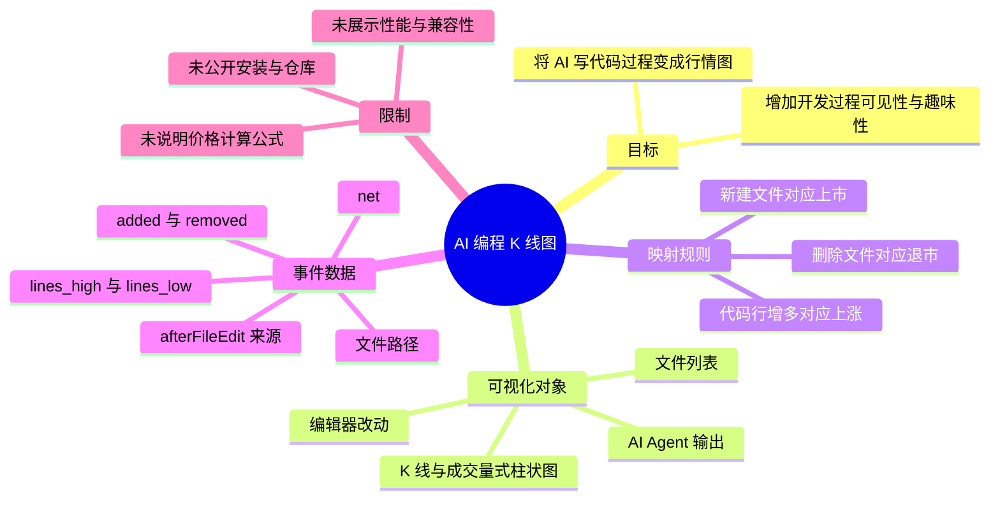
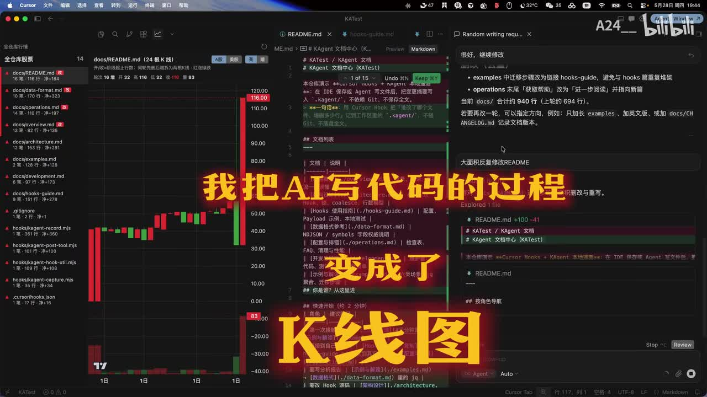
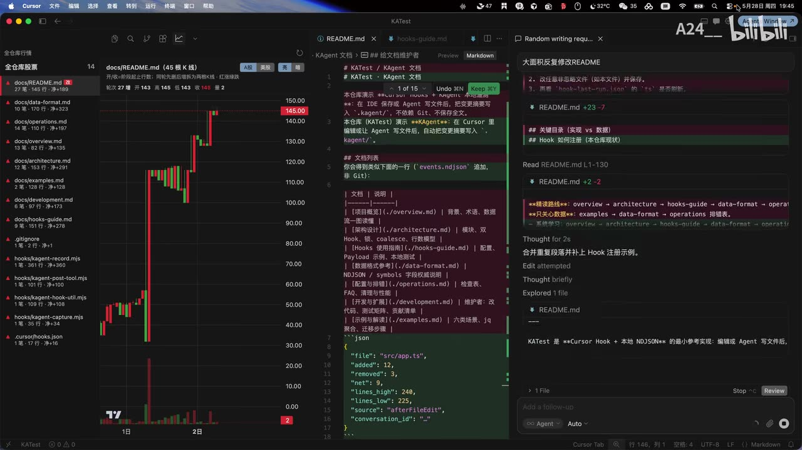
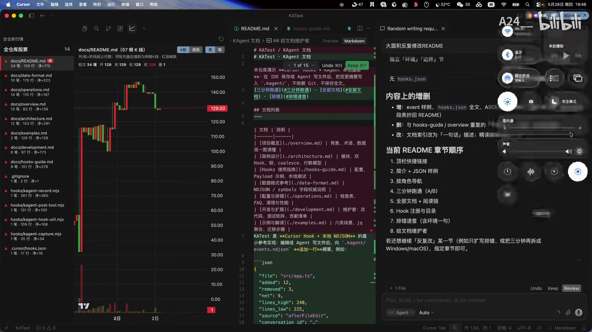

# 来进行刺激的开发吧▼_▼

> 来源：[Bilibili 视频](https://www.bilibili.com/video/BV1GTVb6MEKj)<br>
> UP 主：A24__ ｜发布时间：2026-05-29 ｜视频时长：27 秒<br>
> 标签：游戏开发、编程、网站

## 小结

视频展示了一个将 AI 编程过程“金融化可视化”的创意：UP 主把 AI 写代码时的文件与代码行变动映射为类似股票交易软件的 K 线图，使开发过程可以像查看行情一样被观看。

核心规则由视频口述和画面共同呈现：代码行数增多对应“上涨”；新建文件被比喻为“上市”；删除文件被比喻为“退市”。画面左侧为多文件的行情列表与蜡烛图，中央是编辑器中的文档/代码改动，右侧则是 AI Agent 的任务与差异输出，三者同步构成“开发行情”。

视频中可见该实现以编辑事件记录为基础。画面展示了类似 `events.ndjson` 的记录，其中包含文件路径、`added`、`removed`、`net`、`lines_high`、`lines_low`、事件来源等字段；这说明图表至少需要从编辑行为中提取增删行及文件状态，再把这些数据转换为价格或蜡烛图数据。

这是一个概念演示而非完整教程。视频没有公开插件名称、仓库地址、安装方式、依赖、图表计算公式、数据持久化策略或性能测试结果。因此，它适合希望为 AI 辅助开发增加过程反馈、游戏化氛围或可视化监控的人参考设计思路，但不能据此直接复现完整工具。

内容时效性截至视频发布于 2026-05-29 的展示状态。AI 编程工具、编辑器 Hook/API 以及插件实现均可能变化；视频未提供版本号，不能确认其适用于哪些 Cursor、IDE 或 Agent 版本。

## 思维导图





## 目录

- [背景：把代码修改看成行情](#背景把代码修改看成行情)
- [核心规则：代码行、文件生命周期与涨跌](#核心规则代码行文件生命周期与涨跌)
- [画面中的事件数据与界面联动](#画面中的事件数据与界面联动)
- [可迁移的实现步骤](#可迁移的实现步骤)
- [参数、限制与时效性](#参数限制与时效性)
- [字幕比对](#字幕比对)
- [评论分析](#评论分析)
- [处理记录](#处理记录)

## 背景：把代码修改看成行情 [00:00:00](https://www.bilibili.com/video/BV1GTVb6MEKj?t=0)

视频开头直接提出创意：“我把 AI 写代码的过程，变成了 K 线图。”这里的“K 线图”是对软件开发改动的视觉隐喻，并非金融交易、投资建议或真实证券价格。

画面同时出现三个工作区：

1. **左侧行情区**：以文件为单位排列列表，旁边显示红绿蜡烛图、价格刻度和底部柱状图。
2. **中央编辑区**：显示项目文档与代码/配置内容的编辑状态。
3. **右侧 AI Agent 区**：显示 AI 对任务的理解、修改摘要、文件差异与继续操作入口。

这种布局将“AI 做了什么”从单纯的文字 diff，扩展为可持续观察的走势界面。它尤其适合 AI Agent 连续修改多个文件时，用来观察当前改动的规模与方向。



> 图：画面左侧是多文件 K 线列表，中央为编辑器，右侧为 AI 任务及改动结果；叠加文字明确说明“把 AI 写代码的过程变成了 K 线图”。该帧确立了视频的核心产品定位与三栏界面关系。

## 核心规则：代码行、文件生命周期与涨跌 [00:00:07](https://www.bilibili.com/video/BV1GTVb6MEKj?t=7)

### 代码行增多与“上涨” [00:00:07](https://www.bilibili.com/video/BV1GTVb6MEKj?t=7)

ASR 在此识别为“行数变多久会上涨？”，结合上下文，其稳定可理解的含义是：**代码行数变多时，K 线会向上涨**。这是一条展示中的映射规则，而不是软件工程质量评价规则。

视频表达的重点是把“增量”转换为一种易感知的行情变化：

- 代码或文档内容增加时，图表可表现为上涨；
- 编辑过程中连续发生的改动可形成多根 K 线；
- 左侧文件列表使不同文件能够呈现各自走势。

但应注意，**行数增加不等于代码质量提升**。重构、删除冗余、压缩实现、修复错误都可能减少行数，却具有实际价值。视频采用的是“刺激开发”的游戏化反馈逻辑，而非严谨的工程质量度量。

### 新建文件“上市” [00:00:11](https://www.bilibili.com/video/BV1GTVb6MEKj?t=11)

UP 主口述“新建文件后，上市”（ASR 将“后”误识别为“90”，并将语句输出为“新建文件90，上市”）。其意图是把一个新文件进入项目监控范围，比喻为证券上市。

在这种模型中，新文件需要至少具备：

- 可区分的文件标识，例如相对路径；
- 首次被观测到的创建事件；
- 初始代码行数或初始“价格”；
- 后续编辑事件，用于持续更新该文件的走势。



> 图：左侧按文件列出多条行情，中央编辑区出现事件记录结构，右侧 AI 面板显示对 README 的修改过程。该帧表明可视化并非只针对单个文件，而是可按文件聚合事件。

### 删除文件“退市” [00:00:15](https://www.bilibili.com/video/BV1GTVb6MEKj?t=15)

UP 主随后口述“删除文件后，退市”（ASR 同样将“后”误识别为“90”）。这与“新建文件上市”形成完整的文件生命周期隐喻：

| 文件动作 | 视频中的市场化表达 | 对可视化系统的含义 |
| --- | --- | --- |
| 新建文件 | 上市 | 开始为该文件建立并展示行情 |
| 编辑并增加行数 | 上涨 | 更新走势，反映增量变化 |
| 删除文件 | 退市 | 停止追踪或将其移出当前行情列表 |

视频未说明“退市”后历史数据是否保留、是否可以恢复，也没有展示重命名、移动文件、二进制文件、自动格式化或 Git 回滚时的处理方式。这些都是实际实现时需要补全的边界条件。

## 画面中的事件数据与界面联动 [00:00:18](https://www.bilibili.com/video/BV1GTVb6MEKj?t=18)

UP 主称“我做的插件，你可以在敲代码时看看行情”。从画面可见，这个插件/工具与编辑器工作流并行：中央是项目内容，右侧是 AI Agent 操作，左侧则持续显示行情。

画面中的事件记录看起来采用 NDJSON（每行一个 JSON 对象）或相近结构。截图中可辨识的一条示例包含以下字段：

```json
{
  "file": "src/app.ts",
  "added": 12,
  "removed": 3,
  "net": 9,
  "lines_high": 240,
  "lines_low": 225,
  "source": "afterFileEdit",
  "conversation_id": ""
}
```

从这条画面可见记录可以谨慎归纳出：

- `file`：被修改文件的路径或标识；
- `added`：本次事件增加的行数；
- `removed`：本次事件删除的行数；
- `net`：净变化，截图示例为 `12 - 3 = 9`；
- `lines_high`、`lines_low`：事件前后或事件范围内的行数上、下界，可能可用于构造 K 线区间；
- `source: "afterFileEdit"`：事件在一次文件编辑之后产生；
- `conversation_id`：预留了将编辑事件与 AI 对话关联的字段，但截图示例中为空，视频未说明其具体使用方式。

这些字段足以支持一种“事件驱动”的图表生成思路：捕捉编辑后事件，记录行数变化，按文件累计，然后将数据交给图表层渲染。需要强调的是，视频没有展示完整的数据采集代码或 K 线 OHLC（开、高、低、收）计算规则，因此不能确认 `lines_high`、`lines_low` 是否直接等同于真实 K 线的 high/low。



> 图：左侧图表显示某文件从约 40 上升至 150 后回落至 129 的走势；中央仍为文档与事件数据，右侧为 AI 的修改说明。这一帧最直观地体现“编辑活动—事件数据—行情图”的联动效果。

## 可迁移的实现步骤 [00:00:22](https://www.bilibili.com/video/BV1GTVb6MEKj?t=22)

UP 主以“从此手画 K 线不是梦？”收束，强调的是开发过程可视化的可玩性。以下步骤是根据视频已展示的事件字段和界面关系整理出的**概念性实现流程**，并非视频提供的安装教程或可直接运行的代码。

### 1. 确定监控对象与最小事件模型

首先决定要按什么粒度显示行情。视频画面倾向于“一个文件一条行情”，因此最小模型可包括：

- 文件路径；
- 事件发生时间；
- 新增行数；
- 删除行数；
- 净行数变化；
- 编辑前后总行数；
- 事件来源，例如用户编辑或 AI 编辑。

同时需要定义不追踪的对象，例如依赖目录、构建产物、锁文件和二进制文件；否则图表会被无意义的大规模变动淹没。视频没有展示过滤规则。

### 2. 在文件编辑后写入事件

截图中的 `source: "afterFileEdit"` 表明，较合理的采集点是在文件修改完成后。每次事件至少要记录增删量与当前行数，且应避免把同一次保存拆成大量重复记录。

概念上可以使用如下结构：

```text
编辑完成
  -> 计算本次 diff 的 added / removed
  -> 读取或计算当前总行数
  -> 写入一条事件记录
  -> 按文件更新图表数据
```

视频未说明其使用的是 Cursor Hook、编辑器扩展 API、文件监听器还是其他机制；画面仅能确认其在编辑/Agent 工作流后获得了事件数据。

### 3. 将文件生命周期映射为图表状态

按照视频口述的设定：

1. 首次出现的文件创建行情实体，即“上市”；
2. 后续编辑事件更新该文件的图表；
3. 文件删除时结束该实体的当前追踪，即“退市”。

真正实现时还应明确初始值。例如，可将初始总行数作为初始收盘值，或从固定基准值起算；视频没有提供这项参数，也没有给出“价格”单位。

### 4. 聚合事件并渲染 K 线

K 线通常需要开盘、最高、最低、收盘四类值。视频画面表现为蜡烛图，但没有解释其聚合周期。实现者需要自行选择，例如：

- 每次编辑事件生成一根 K 线；
- 按固定时间窗口聚合；
- 按一次 AI Agent 任务或一轮对话聚合；
- 按 Git commit 聚合。

如果以代码总行数为数值基础，可将窗口首末行数作为 open/close，将窗口内最大/最小行数作为 high/low。若以净增删量作为数值基础，则应另行定义累计值。两种方式都会得到视觉走势，但代表的指标不同，不能混用。

### 5. 在编码过程中提供“行情”而非质量结论

视频的适用方式是“敲代码时看看行情”，因此图表更适合承担：

- 过程反馈；
- AI Agent 修改量的直观观察；
- 文件活跃度提示；
- 展示或直播中的视觉化效果。

不宜将其直接作为代码质量、项目进度、生产力或 AI 输出正确性的判断依据。特别是大范围重构、格式化和生成代码会制造显著波动，却不必然代表高质量产出。

## 参数、限制与时效性 [00:00:22](https://www.bilibili.com/video/BV1GTVb6MEKj?t=22)

### 已知素材参数

| 项目 | 内容 |
| --- | --- |
| 视频时长 | 27 秒；ASR 音频实际分析时长约 26.35 秒 |
| 视频分辨率 | 2560 × 1440 |
| ASR 语言 | 中文，语言识别概率约 0.984 |
| 识别语音时长 | 约 15.58 秒 |
| 语音覆盖率 | 约 59.12% |
| 视频标签 | 游戏开发、编程、网站 |
| 可见工具环境 | Cursor 风格编辑器界面、AI Agent 面板、K 线图界面 |
| 可见事件来源字段 | `afterFileEdit` |
| 可见事件数据格式 | 类似 `events.ndjson` 的逐条 JSON 记录 |

### 视频没有交代的关键技术参数

以下信息在视频和提供素材中均未出现，不能补写为既定事实：

- 插件的正式名称、下载链接、开源仓库与许可证；
- 使用的图表库、语言、框架或存储方案；
- 图表的 OHLC 计算公式与时间聚合周期；
- “上涨/下跌”是否只由行数变化决定；
- 文件重命名、移动、恢复、合并、冲突解决的处理逻辑；
- Git 提交、分支、撤销、格式化、代码生成等行为的去重策略；
- 对大型项目、频繁保存和多 Agent 并发编辑的性能表现；
- 对 Cursor 以外编辑器的兼容性；
- 数据是否上传、是否保留对话/文件内容，以及隐私策略。

### 时效性与使用风险

该视频是短演示，发布后相关插件接口和 AI 编程工具均可能变动。若要将此思路用于实际项目，应优先验证事件捕获的准确性、文件排除策略、数据本地化方式与性能开销。

此外，视频将“代码变多”表现为上涨，是刻意的游戏化语言。实际开发中，删除冗余、简化代码、降低复杂度同样可能是正向成果；建议把“K 线”定位为行为可视化，而不是 KPI。

## 字幕比对

| 字幕来源 | 完整性 | 专有名词 | 时间轴 | 主要问题 |
| --- | --- | --- | --- | --- |
| Bilibili 站内字幕 | 未提供可用字幕，无法比较内容 | 无法评估 | 无法评估 | 素材明确标注“未提供可用站内字幕” |
| 本次 ASR 字幕 | 共 6 段，覆盖主要口述；语音覆盖约 59.12%，其余为画面展示或停顿 | 对“AI”“K线图”等核心词识别可用；对“后”等短词存在误识别 | 有真实起止时间，可直接用于时间轴 | 将“行数变多”误作“行数变多久”；将“后”误作“90”；“敲代码”误作“敲代砝”；“K线”误作“K纤” |

最终采用**本次 ASR 的 SRT 时间轴**作为章节定位依据，因为没有可用站内字幕。ASR 并未标记 `noAudioStream=true`；相反，诊断确认存在约 15.58 秒可识别语音，因此不存在“源视频无音轨”的情况。

结合语境和关键帧，对 ASR 中影响理解的内容作如下保守校正：

| ASR 原文 | 正文采用的理解 | 校正依据 |
| --- | --- | --- |
| 行数变多久会上涨？ | 行数变多会上涨 | 与开场“代码过程变成 K 线图”及上涨图表语境一致 |
| 新建文件90，上市 | 新建文件后，上市 | “90”在此不构成合理参数；与后续“退市”构成文件生命周期比喻 |
| 删除文件90，退市 | 删除文件后，退市 | 与“新建文件后，上市”形成对偶表达 |
| 你可以在敲代砝时看看 | 你可以在敲代码时看看 | 常用中文技术表达，且画面为编辑器编码场景 |
| 手画K纤不是梦 | 手画 K 线不是梦 | 与视频核心对象“Ｋ线图”一致 |

上述校正只用于提高文本可读性；涉及插件实现细节时仍以画面实际可见字段为限，不将推测写成视频已证实的功能。

## 评论分析

仅分析可获取的热评前三条；评论体现的是观众观点或个人实践，不应视为对插件功能、实现质量或可用性的验证。

1. **suugaku_lover（1223 赞）**  
   评论：“成功解决了 vibe coding 过于放松的痛点[doge]”。  
   这是一种玩笑式认可：观众将 K 线带来的涨跌刺激理解为对“vibe coding”松弛感的补充。它与视频“刺激开发”的标题和游戏化表达高度一致，但没有提供任何技术验证信息。

2. **梓杉彬钐（214 赞）**  
   评论称自己按该思路进行 vibe coding，做出了“从 git 仓库生成 K 线图的版本”。  
   这条评论补充了另一种实现路径：不监听实时编辑事件，而是从 Git 仓库历史生成图表。该做法在概念上可行，也说明视频的核心创意具有可迁移性；但评论没有给出代码、图表规则或仓库链接，无法确认实现细节、准确性与是否与视频插件等价。

3. **hvwyl（212 赞）**  
   评论建议“一个文件夹就是一个 ETF，然后再搞一个综合指数”。  
   该评论将视频的“单文件行情”进一步扩展为层级化指标：文件夹可作为组合资产，项目整体可作为综合指数。这是有趣的产品设计方向，但仅为社区创意，视频本身没有展示文件夹聚合、权重计算或指数公式。

## 处理记录

- Worker ID：`worker-mrj0www4-e8d79408`
- 调用模型：`gpt-5.6-terra`
- ASR 模型与运行参数：`medium`；语言自动识别为中文，`cuda`，`float16`
- 使用的素材工具/产物：视频元数据、音频 ASR 结果与 SRT 时间轴、关键帧、热评 JSON、封面与视频信息
- 字幕选择：站内无可用字幕；检查并采用本次 ASR 的 6 个带时间戳分段作为时间轴依据，再以画面与语境校正明显误识别词语
- 关键帧选择依据：
  - `frames/frame-001.jpg`：最清楚地展示“AI 写代码过程变为 K 线图”的主题与三栏布局；
  - `frames/frame-003.jpg`：可同时观察多文件行情、编辑区和类似事件 JSON 的数据结构；
  - `frames/frame-004.jpg`：展示运行中的 K 线走势、中央改动内容与右侧 AI 修改摘要的关系。
- 缓存清理：提供的素材中未包含缓存清理执行日志；未将未证实的清理行为记录为已完成。
- 未解决问题：插件名称与获取渠道未知；事件采集实现、K 线计算方法、数据隐私、兼容性、性能和完整操作步骤均未在 27 秒视频中披露。
