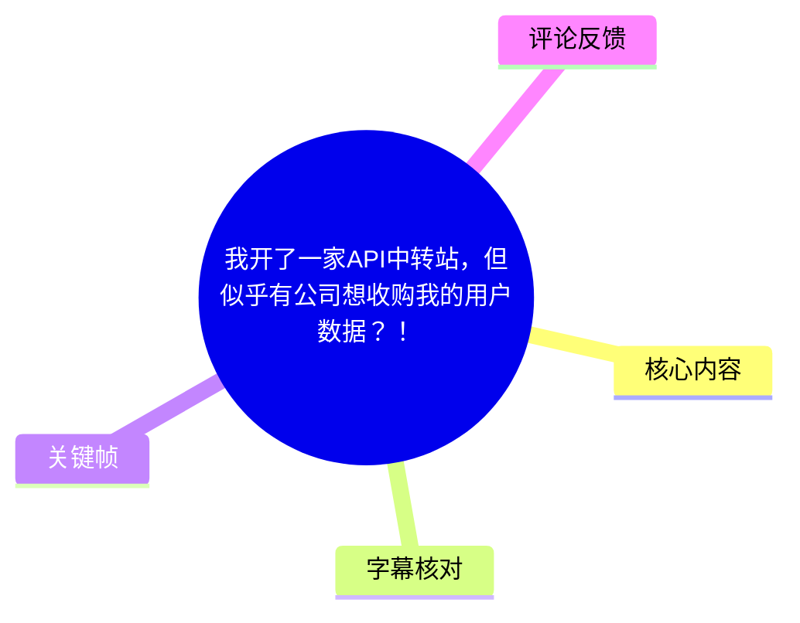
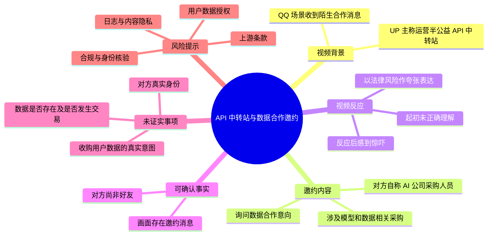
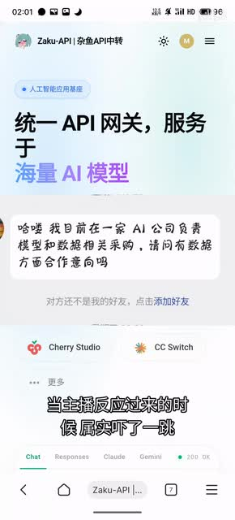

# 我开了一家API中转站，但似乎有公司想收购我的用户数据？！

> 来源：[Bilibili 视频](https://www.bilibili.com/video/BV1wN7E6eETb)  
> UP 主：mizaawa｜时长：39 秒｜分辨率：1080 × 2374（竖屏）  
> 视频简介提及：AI 交流群 `720084643`、杂鱼 API 中转站 `https://zayuapi.com`。

## 小结

视频以段子式叙述分享了一次与 API 中转站运营有关的私信经历。UP 主称自己开设了“半公益”的 API 中转站；在 QQ 日常“水群”时，收到一名尚未加好友者发来的合作询问，对方自称在一家 AI 公司负责模型和数据相关采购，并询问是否有“数据方面合作意向”。

视频的核心情绪是“后知后觉的惊吓”：UP 主最初没有正确理解该消息的含义，反应过来后联想到潜在的数据合规与法律风险，并用“以后新年铁窗”的夸张说法制造戏剧效果。视频没有展示后续实际合作、数据交易、拒绝话术或技术处置过程。

可确认的是：画面中确实出现了上述合作邀约文本，且该联系人尚不是 UP 主好友。不可确认的是：对方是否确为 AI 公司人员、是否真的意图收购用户数据、UP 主是否持有可交易的用户数据，以及其 API 中转站的数据收集、留存、脱敏、授权和上游供应商政策。标题中的“似乎”也应被理解为 UP 主的疑虑或调侃，而非已经证实的收购事实。

对 API 中转站、代理服务或任何处理请求日志的平台运营者而言，本视频的可迁移提醒是：涉及模型调用数据、用户身份信息、提示词、响应内容或访问日志的合作邀约，必须先核实对方身份、明确数据范围与授权基础，并评估数据最小化、合同、隐私告知及上游服务条款；不能因“采购”或“合作”表述而默认可以提供数据。

## 思维导图

## 目录

- [背景与视频边界](#背景与视频边界-0000)
- [消息内容与画面证据](#消息内容与画面证据-0000)
- [UP 主的叙述与风险指向](#up-主的叙述与风险指向-0010)
- [运营实践：视频可推导的审慎步骤](#运营实践视频可推导的审慎步骤-0020)
- [参数、技术信息与限制](#参数技术信息与限制-0030)
- [字幕比对](#字幕比对-0000)
- [评论分析](#评论分析-0000)
- [处理记录](#处理记录-0000)

## 背景与视频边界 [00:00](https://www.bilibili.com/video/BV1wN7E6eETb?t=0)

视频开头的 ASR 表述为“众所不周知，主播开了一家半公益的 API 中转站”。这里的“半公益”是 UP 主的自述，视频未说明其具体收费模式、可用模型、用户量、日志保存策略、服务端技术栈或运营主体。

画面展示的网站页头为“Zaku-API｜杂鱼API中转”，主视觉文案为“统一 API 网关，服务于海量 AI 模型”。这能够说明视频将“杂鱼 API 中转站”作为叙述背景，但不能据此证明其服务能力、模型覆盖范围或数据处理承诺。

视频简介提供了站点链接和 QQ 群号，但这些属于发布者提供的外部信息；本视频本身没有演示注册、充值、模型调用、密钥管理、日志查询或隐私政策页面。

## 消息内容与画面证据 [00:00](https://www.bilibili.com/video/BV1wN7E6eETb?t=0)

关键画面中的 QQ 消息可辨认为：

> “哈喽 我目前在一家 AI 公司负责模型和数据相关采购，请问有数据方面合作意向吗”

消息下方同时显示：

> “对方还不是我的好友，点击添加好友”

这两个画面信息分别支持以下事实：

1. 有一个陌生联系人向 UP 主发送了涉及“模型和数据相关采购”的合作询问。
2. 该联系人在截图时不是 UP 主的 QQ 好友。
3. 消息只是在询问“是否有数据方面合作意向”，没有在视频画面中列出数据类型、价格、合法来源、使用目的、地域、保存期限、交付方式或合同条款。

> 图：该关键帧同时展示“统一 API 网关，服务于海量 AI 模型”的站点背景、陌生人的数据合作询问，以及“对方还不是我的好友”的状态。它是判断视频事实边界的重要证据：能够证实收到过此类询问，但不能证实对方身份、交易目的或任何数据交易已经发生。

需要特别区分“模型和数据相关采购”与“收购用户数据”：

- 前者是消息中的原始措辞，范围可能包含公开数据、标注服务、模型评测、数据处理能力等多种可能；
- 后者是标题和视频叙事所强化的风险联想；
- 两者之间是否等同，视频没有提供进一步聊天记录或证据，因此不能直接下结论。

## UP 主的叙述与风险指向 [00:10](https://www.bilibili.com/video/BV1wN7E6eETb?t=10)

ASR 显示，UP 主称自己因“出色的阅读理解能力”起初没有成功理解对方是来“对接”的；当反应过来时“吓了一跳”，并联想到“以后新年铁窗”的场景。该部分是自嘲和夸张表达，传递的是对潜在违法或不当处理数据后果的担忧，而不是对具体法律事件的陈述。

视频结尾的 ASR 大意为：UP 主最终认为自己的 API “终于成功了”“真的很香”，并以“即将卖 token”收尾。这里“卖 token”在 API 服务语境中可能是指销售调用额度或令牌相关服务，但视频没有解释具体定价、Token 计费单位、上游模型、可用性或销售规则，不能扩展解释为任何未展示的商业模式。

从风险管理角度，视频隐含的关键问题包括：

- **数据权属与授权**：即使平台能接触到请求日志、提示词或调用记录，也不代表平台拥有将其出售、共享或用于训练的权利。
- **敏感内容风险**：AI 调用内容可能包含个人信息、业务机密、源代码、访问令牌或其他敏感数据。
- **身份与目的核验**：陌生人自称“AI 公司采购人员”不等于其身份已经核实；其采购用途也未说明。
- **上游链路约束**：中转站的上游模型供应商可能对转售、数据留存、监控、训练用途或跨境传输设有限制；视频未展示相关条款。
- **法律与地域差异**：视频没有说明运营主体所在地、用户所在地或适用法域，因此无法基于该视频给出具体法律结论。

## 运营实践：视频可推导的审慎步骤 [00:20](https://www.bilibili.com/video/BV1wN7E6eETb?t=20)

视频没有提供实际操作教程、命令、代码、配置文件或处置结果。以下不是对视频中已执行动作的复述，而是基于其“陌生数据合作邀约”场景整理的审慎处理顺序，适合 API 中转站或类似服务的运营者参考。

1. **不要在私信中直接确认可提供的数据**
   - 在未识别数据范围、权属和授权前，不应承诺提供“用户数据”“调用日志”或“模型请求内容”。
   - 不要将陌生联系人的“采购”身份视为充分授权。

2. **核验合作方身份**
   - 要求对方使用可验证的企业域名邮箱、企业主体信息和正式采购需求进行联系。
   - 核验企业主体、联系人职务、授权关系及其采购目的。
   - 视频只展示了 QQ 私信，未展示任何核验结果。

3. **明确数据对象与用途**
   - 区分公开数据、运营统计数据、去标识化汇总指标、原始日志、用户输入、模型输出和账号信息。
   - 明确是否包含个人信息、敏感个人信息、商业秘密、源代码或密钥。
   - 明确是否用于分析、模型训练、转售、广告、风控或其他用途。

4. **先审查自身的收集基础与对外承诺**
   - 检查隐私政策、服务协议、注册页面、用户授权记录及日志留存设置。
   - 若没有明确的收集与二次使用授权，不能因为技术上能导出数据就对外提供。
   - 若用户数据经过上游模型服务商，还应检查上游服务条款是否允许该处理方式。

5. **采用数据最小化原则**
   - 如业务确实需要对外提供统计能力，优先考虑聚合、匿名化或去标识化后的指标。
   - 不应将“匿名化”当作当然安全；若数据可与其他信息重新关联，仍可能存在识别和合规风险。
   - 视频没有展示其采取了任何匿名化、脱敏或导出技术。

6. **形成正式评审与留痕**
   - 对外合作前应有书面合同、用途限制、保密义务、保留期限、删除机制、再委托限制和安全责任约定。
   - 对高风险处理应保留审批、数据清单、传输记录和删除证明。
   - 这些是一般性运营建议，不应被视作视频中已经完成的流程。

## 参数、技术信息与限制 [00:30](https://www.bilibili.com/video/BV1wN7E6eETb?t=30)

### 视频中明确出现的信息

| 项目 | 内容 | 证据/说明 |
| --- | --- | --- |
| 视频时长 | 39 秒 | 元数据 |
| 视频画面 | 1080 × 2374，竖屏 | 元数据 |
| 站点名称 | Zaku-API／杂鱼API中转 | 关键帧网页页头、视频简介 |
| 站点定位文案 | “统一 API 网关，服务于海量 AI 模型” | 关键帧 |
| 联系场景 | QQ 陌生人消息 | 关键帧 |
| 对方自述职责 | 模型和数据相关采购 | 关键帧消息 |
| 视频简介中的群号 | `720084643` | 元数据简介 |
| 视频简介中的站点 | `https://zayuapi.com` | 元数据简介 |

### 视频未提供、不能补写的技术参数

视频没有给出以下信息，因此无法据此形成可复现的部署或调用教程：

- API Base URL、接口路径、认证方式和密钥格式；
- 支持的具体模型、模型版本、上下文窗口和上游渠道；
- Token 单价、倍率、余额规则、速率限制、并发限制或配额；
- 请求与响应日志是否保存、保存多久、谁可以访问；
- 数据库、缓存、网关、代理、审计或脱敏实现；
- 数据导出接口、数据加密方式、删除机制和安全响应流程；
- 与任何公司、采购方或数据交易相关的合同、报价及实际结果。

因此，本视频更接近一次围绕 API 中转站与数据风险的短篇经历/段子，而非产品说明、法律意见或数据合作公告。

### 时效性

元数据显示视频发布时间为 `2026-06-27T00:56:00Z`。站点状态、政策、模型供应、价格、监管环境和评论所称的“严打”情况均可能随时间变化。尤其是外部站点链接及 API 服务政策，应以访问时实际页面、现行协议和适用法律为准，不能仅凭这条 39 秒视频判断。

## 字幕比对 [00:00](https://www.bilibili.com/video/BV1wN7E6eETb?t=0)

本次任务已执行 ASR。站内字幕抓取失败，素材记录的告警为：`Missing JSON resource URL.`，因此没有可用的 Bilibili 站内字幕可供逐句对照。

| 字幕来源 | 完整性 | 专有名词 | 时间轴 | 主要问题 |
| --- | --- | --- | --- | --- |
| Bilibili 站内字幕 | 不可用 | 不可评估 | 不可评估 | 未提供可用字幕；抓取过程提示缺少 JSON 资源 URL。 |
| 本次 ASR 字幕 | 覆盖了主要叙述段落，但未附逐句时间戳 | 识别不稳定 | 无逐句时间轴 | 存在繁简混用、同音误识别和语义不通顺，如“众所不周知”“半工艺”“日常雪群”“思量”“工作系”“坚毅情”等。 |

最终采用策略为：**以本次 ASR 作为叙述线索，以关键帧可见文字作为消息原文与页面文案的优先依据，并保留无法证实部分的不确定性。**

关键校正如下：

| ASR 结果 | 校正/处理方式 | 依据 |
| --- | --- | --- |
| “众所不周知” | 很可能是“众所周知”，但正文不将其作为技术事实 | 汉语固定表达与上下文 |
| “半工艺的 API 中转站” | 按语义整理为“半公益的 API 中转站”，并注明为 UP 主自述 | ASR 上下文；音近词校正，非画面文字 |
| “QQ 日常雪群” | 依语境理解为 QQ 日常水群 | 上下文语义；未作为独立可验证事实扩写 |
| “这么一条思量” | 不采用该词，改述为“收到一条合作询问” | 关键帧消息文本 |
| “工作系前来对接” | 不采用；仅保留对方在画面中自称负责采购 | 关键帧消息文本 |
| “即将卖 token” | 保留为 ASR 所反映的结尾语义，但不推导其定价或业务规则 | ASR；视频未展示参数 |

## 评论分析 [00:00](https://www.bilibili.com/video/BV1wN7E6eETb?t=0)

以下仅处理当前可获取的热评前三条。评论是观众观点，不构成对视频中任何事实的验证。

1. **老梁爱吃棒棒糖｜23 赞**  
   > “中转站默认卖隐私[吃瓜]”  
   该评论表达了对 API 中转站隐私风险的讽刺与不信任，呼应了视频“数据合作”带来的担忧。但“默认卖隐私”是概括性判断，未给出对该站点的证据，不能据此认定 UP 主或任何中转站出售用户隐私。

2. **沐夏Le｜3 赞**  
   > “ai 中转站不是严打吗 有想做的念头但最近好像在严打”  
   评论提出 AI 中转站可能面临监管或平台治理压力，并表示自己听闻“最近好像在严打”。这提供了一个值得进一步核验的行业风险线索，但未说明地区、监管主体、时间、规则依据或具体执法案例，可信度与适用范围均无法仅凭评论确认。

3. **某宇AI｜0 赞**  
   > “你上游是谁的？你怎么保证你上游卖不卖[吃瓜]”  
   评论将关注点从中转站自身扩展至上游供应链：即使中转站不进行不当数据处理，上游服务商的数据政策与实际执行同样重要。这是合理的风险提问，但视频未披露上游是谁，也没有展示上游条款或技术审计材料，因此没有答案。

## 处理记录 [00:00](https://www.bilibili.com/video/BV1wN7E6eETb?t=0)

- Worker ID：`worker-mrj0www4-e8d79408`
- 模型：`gpt-5.6-terra`
- 调用工具与素材：读取视频元数据、素材清单、站内字幕获取结果、本次 ASR 文本、关键帧清单及热评数据；本次可用关键帧为 `frames/frame-001.jpg`。
- 字幕选择：站内字幕不可用，且抓取告警为缺少 JSON 资源 URL；已执行本次 ASR。正文以 ASR 恢复叙述顺序，以关键帧中的可见文字校正消息内容和页面文案。
- 关键帧选择依据：`frame-001.jpg` 是唯一提供的关键帧，同时包含 API 中转站页面、陌生人合作消息、非好友状态和视频叠加文案，能够直接支撑正文最重要的可验证事实。
- 热评范围：仅分析了可获取热评前三条，未将评论内容视为已证实事实。
- 缓存清理：提供的素材中没有缓存清理执行日志；无法验证是否已清理，不作“已清理”声明。
- 未解决问题：无法核验发信人的真实身份、合作真实目的、UP 主是否回复或交易、站点的数据收集与留存实践、上游模型服务商及其数据条款，也无法取得带时间轴的站内字幕。

## 评论分析

本次流程未获取到可用热评，因此不推断观众态度或额外结论。
