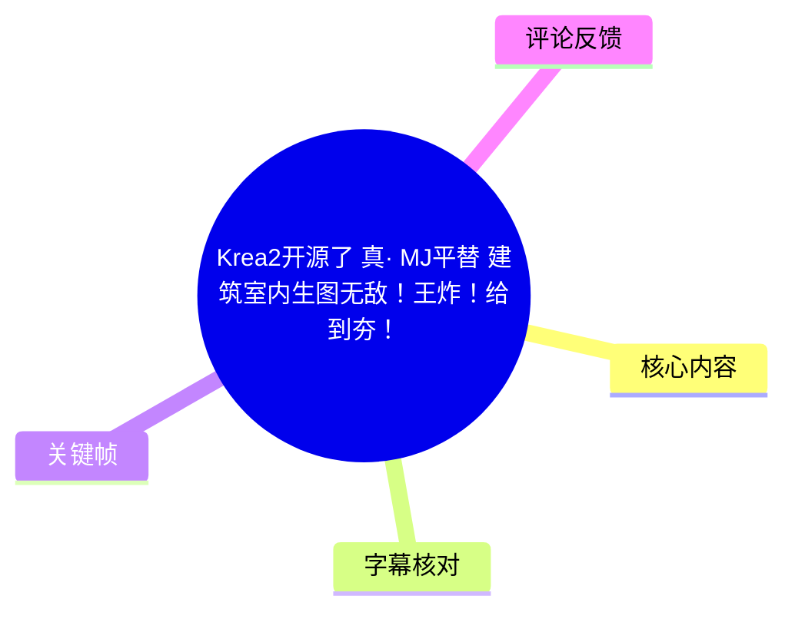
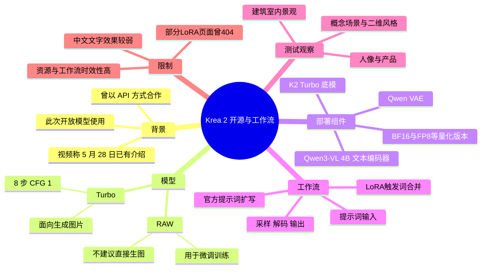
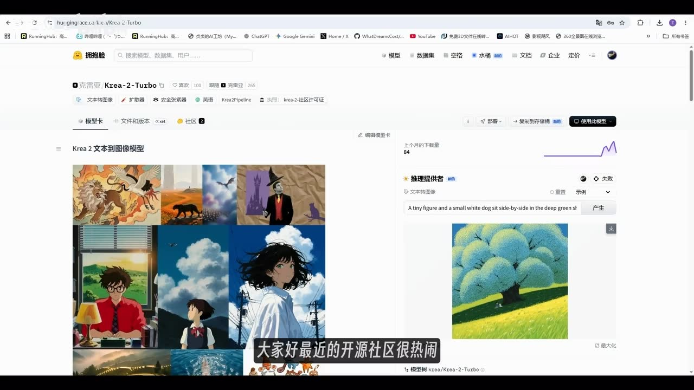
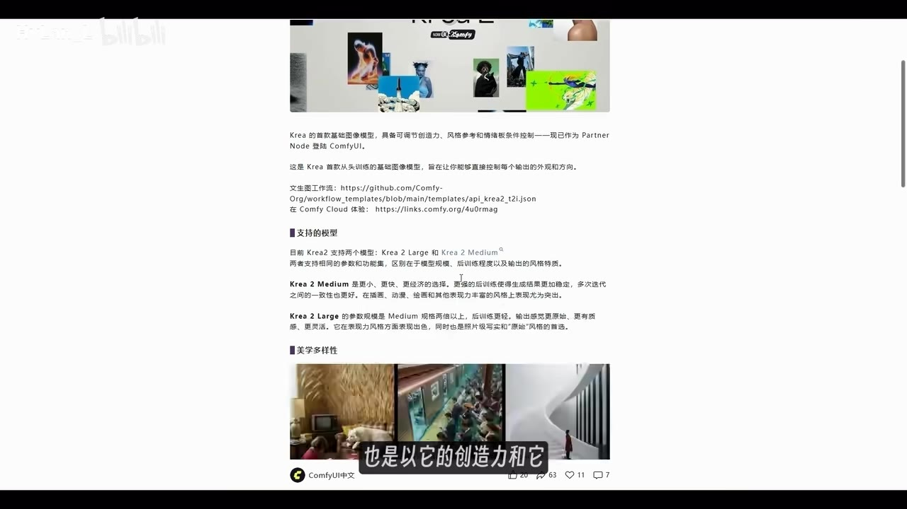
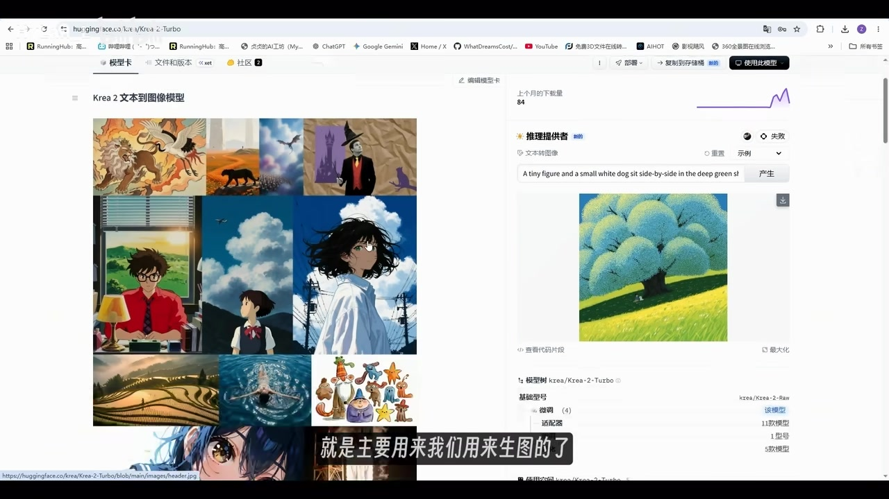
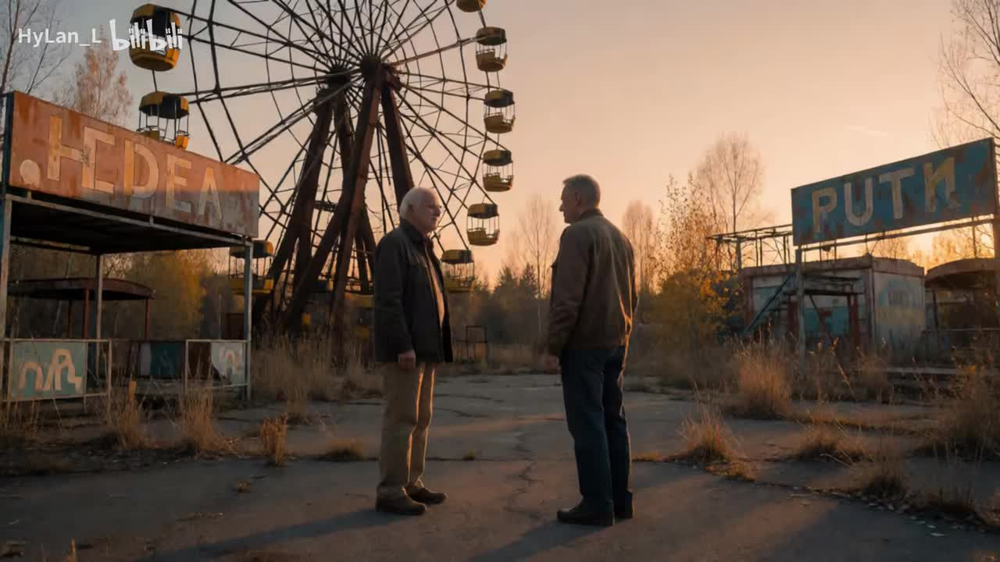

# Krea2开源了 真· MJ平替 建筑室内生图无敌！王炸！给到夯！

> 来源：[Bilibili 视频](https://www.bilibili.com/video/BV1fujd6aEyn)<br>
> UP 主：HyLan_L｜时长：09:39｜分区收藏：AIcode  
> 视频简介称：云端体验地址见置顶评论；模型与工作流将提供夸克、百度网盘链接。

## 小结

视频介绍了刚刚开源的 **Krea 2（视频中简称 K2）** 图像模型及其 ComfyUI 工作流。UP 主回顾称，该模型曾于 5 月 28 日以 API 方式与 ComfyUI 合作；此次开源后，重点可用版本是面向生图的 **Turbo**，而 **RAW** 主要用于按个人需求进行微调训练，不建议直接拿来文生图。

在部署层面，视频给出的核心组合是：K2 Turbo 底模、Qwen3-VL 4B 文本编码器与 Qwen VAE；Turbo 工作流使用 **8 步、CFG 1**，采样器和调度器按官方推荐设置。模型存在 BF16、FP8，以及 ASR 识别为“NFP4”的量化版本；UP 主建议按显存选择，文本编码器通常可选 FP8。

工作流本身由底模、文本编码器、VAE、采样、解码和输出组成，并可接入官方提示词扩写模板。官方模板还默认挂载四个 LoRA，通过触发词选择风格后与原始提示词合并。视频同时提到官方展示了多种风格 LoRA，但其当时访问部分页面时出现 404，因此链接与资源可用性具有实时变化性。

UP 主的主观测试结论是：K2 在创意前期、风格探索、品牌视觉和艺术表达上有强美感；尤其在建筑、室内和景观生成方面，被其评价为目前见过的开源模型中最强的一档，并将其称为“MJ 平替”。这属于 UP 主基于样图的经验判断，不等同于跨模型、统一提示词和统一硬件条件下的客观基准测试。

明确限制是：视频称该模型对**中文文字生成支持不佳**。此外，视频主要展示文生图与风格 LoRA；对于评论中关心的图生图、一致性控制、本地运行兼容性及 GGUF/CLIP 量化模型来源，视频没有给出完整验证或具体解决方案。

## 思维导图





## 目录

- [背景：Krea 2 开源信息与模型定位](#背景krea-2-开源信息与模型定位)
- [模型版本、LoRA 与量化选择](#模型版本lora-与量化选择)
- [云端与本地 ComfyUI 使用路径](#云端与本地-comfyui-使用路径)
- [工作流拆解与关键参数](#工作流拆解与关键参数)
- [实测展示与适用场景](#实测展示与适用场景)
- [限制、时效性与使用建议](#限制时效性与使用建议)
- [字幕比对](#字幕比对)
- [评论分析](#评论分析)
- [处理记录](#处理记录)

## 背景：Krea 2 开源信息与模型定位 [00:00](https://www.bilibili.com/video/BV1fujd6aEyn?t=0)

UP 主以“开源社区很热闹”为背景，介绍 Krea 2，并在后续将其简称为 **K2**。根据视频陈述：

1. 该模型在视频所称的 5 月 28 日已由 ComfyUI 相关微信公众号介绍过。
2. 当时模型以 API 形式与 ComfyUI 合作。
3. UP 主认为其此前就以“创造力”和“美学多样性”见长。
4. 此次开源后，ComfyUI 生态已较快给出支持或相关工作流入口。

视频中提到 ComfyUI 官方仓库展示了 K2 的模型入口。需要区分两类信息：

- **视频中的产品/仓库介绍**：K2 提供 RAW 与 Turbo 两个模型方向；
- **UP 主的实际使用建议**：普通生图优先选择 Turbo，RAW 不作为直接生图模型使用。



> 图：画面展示 Krea 2 Turbo 的模型页面、左侧多风格示例图及右侧生成区。它说明视频的讨论对象是一个可在模型平台页面中调用/查看的图像模型，也直观呈现了视频强调的风格覆盖范围。

视频中还展示了 ComfyUI 中文页面的文字说明。页面内容涉及 Krea 模型能力与合作节点，但页面内容、在线服务入口和模型下载状态都可能在视频发布后改变，应以当下官方页面为准。



> 图：该关键帧保留了视频中引用的 ComfyUI 页面与模型说明文字，是理解“此前 API 合作、后续开源工作流”这一时间脉络的依据；不过该截图只是视频录制时的页面状态，并非当前可用性的保证。

## 模型版本、LoRA 与量化选择 [01:08](https://www.bilibili.com/video/BV1fujd6aEyn?t=68)

### RAW 与 Turbo 的分工

视频给出的分工明确：

| 项目 | 视频中的定位 | 使用建议 |
| --- | --- | --- |
| K2 RAW | 用于训练、根据个人需求微调 | 不建议直接用于日常生图 |
| K2 Turbo | 主要用于生成图片 | 普通文生图工作流优先使用 |

这里的“RAW 用于训练”是 UP 主基于仓库/模型说明做出的使用解释；视频未展开 RAW 的训练数据、训练命令、授权条款或训练显存需求，因此不能据此推导完整训练方案。

### 官方风格 LoRA

UP 主称 ComfyUI 官方仓库给出了 4 个 LoRA 链接，但其浏览时多个页面曾返回 **404**；随后又从另一处模型集合中发现共 **9 个 LoRA**，并依次概览了风格。视频口述可整理为：

| 风格序号/名称线索 | 视频描述 |
| --- | --- |
| 1 | 美式复古漫画，整体偏紫色调 |
| 2 | 带镜头虚焦、概念感和轻微模糊的风格 |
| 3 | 简笔画式风格 |
| 4 | 雨天窗户/隔着玻璃观看的视觉效果 |
| 5 | Dark Brush，视频描述为水墨感、白色水墨感 |
| 6 | 黑白铅笔风格 |
| 7 | 油画式涂抹风格 |
| 8 | 手绘彩铅风格 |
| 9 | 水彩风格 |

每个 LoRA 都有独立触发词。视频没有逐条展示完整的 LoRA 文件名、触发词文本、权重建议或许可证；实际使用时需要在当前可访问的模型页确认这些信息。

### 量化版本与显存选择

UP 主提到，K2 Turbo 经 ComfyUI 量化后有多个版本，包括：

- BF16；
- FP8；
- ASR 识别为“NFP4”的版本。

其中“FP8”在上下文中较明确；“NFP4”可能是 ASR 对量化格式名称的转写，视频素材未提供可核对的原始下载页文字，因此本文保留 ASR 原貌，不擅自改写为其他格式。UP 主的建议是：**根据自身显存选择模型版本**。

同时，视频指定的辅助模型配置为：

| 组件 | 视频说法 | 选择建议 |
| --- | --- | ---|
| Text Encoder | Qwen3-VL 4B | 依据显存选择；一般可选 FP8 |
| VAE | Qwen VAE | 按工作流要求加载 |
| 底模 | K2 Turbo | 生图优先使用 |
| LoRA | 官方风格 LoRA | 需对应触发词；部分页面当时不可用 |



> 图：该画面清晰显示模型页面中的风格样张拼图与生成结果区。它与视频关于“美学多样性”“可做二维、插画及概念视觉”的描述相互对应，但不能证明所有样图均由同一参数、同一 LoRA 或同一版本生成。

## 云端与本地 ComfyUI 使用路径 [02:23](https://www.bilibili.com/video/BV1fujd6aEyn?t=143)

### 云端：Running Hub 工作流

UP 主称已将 K2 生图工作流部署到 Running Hub，并将其称为自己常用的 AI 应用平台。视频说明的操作路径为：

1. 通过视频评论区置顶链接注册；
2. 视频称该链接注册可赠送 1000 点；
3. 每日登录可赠送 100 点；
4. 在平台中进入本次 K2 工作流；
5. 加载模型、输入提示词并执行生成。

上述点数、注册链接与云端工作流可用性均是视频发布时信息，存在调整、下线、活动结束或节点改版的可能，不能视为长期固定权益。

### 本地：更新 ComfyUI 并查找开源模板

UP 主给出的本地使用路线为：

1. 将本地 ComfyUI 更新到最新版本；
2. 进入模板（Templates）；
3. 搜索 “Krea”；
4. 搜索结果中，第一个与第三个被说明为 API 工作流，即视频开头所见的付费方式；
5. **第二个**才是本次开源模型对应的工作流；
6. 下载后按工作流节点配置本地模型路径。

视频未展示实际的 Git 仓库地址、ComfyUI 精确版本号、custom nodes 列表、Python/CUDA 环境或模型文件校验值。因此，遇到节点缺失、版本冲突或无法导入时，不能仅凭本视频完成排错。

### 模型文件放置

UP 主表示模型放置位置“参考页面说明去走即可”。素材中没有给出可可靠转录的完整目录结构，因此不能虚构诸如 `models/checkpoints`、`models/text_encoders` 等具体落盘路径。实际应以所下载工作流中加载节点的目录提示、官方 README 和当前 ComfyUI 版本要求为准。

## 工作流拆解与关键参数 [03:17](https://www.bilibili.com/video/BV1fujd6aEyn?t=197)

### 云端简化工作流

UP 主展示的云端工作流总体较简单，组成包括：

1. 加载 K2 Turbo 底模；
2. 加载 Text Encoder；
3. 加载 VAE；
4. 在提示词节点输入内容；
5. 选择系统默认设置或自定义设置；
6. 经采样与解码输出图片；
7. 可选启用上方的提示词扩写模块。

关键参数如下：

| 参数 | 视频设置 | 说明 |
| --- | ---: | --- |
| 模型类型 | Turbo | 视频用于直接生成图片 |
| 采样步数（Steps） | 8 | UP 主称因使用 Turbo 模型而设为 8 |
| CFG | 1 | 视频明确给出 |
| 采样器 | 官方推荐方式 | 未在 ASR 中得到具体名称 |
| 调度器 | 官方推荐方式 | 未在 ASR 中得到具体名称 |

> 重要：视频只说采样器和调度器采用“官方推荐的方式”，没有在可用文本素材中给出具体枚举值。本文不补写任何采样器或调度器名称。

### 本地官方工作流的结构

UP 主把本地模板拆开后，认为其基础结构与常见 ComfyUI 文生图工作流一致：

```text
加载大模型
  └─ 加载 LoRA
      └─ Text Encode
          └─ 采样
              └─ VAE 解码
                  └─ 输出图片
```

其特别之处在于：

- 工作流默认直接加载 4 个 LoRA；
- 可从节点中选择不同 LoRA 对应的触发词；
- 触发词会经过文本合并，自动加入最终提示词；
- 工作流中还有一段提示词模板，用于把输入内容按官方固定模式扩写。

### 提示词扩写的使用方式

UP 主称已将官方工作流中的提示词扩写模板复制到 Qwen3-VL 的提示词扩写模块中。实际操作逻辑是：

- **需要扩写时**：开启提示词扩写模块，让 Qwen3-VL 按官方模板扩充输入描述；
- **不需要扩写时**：关闭该部分，直接在提示词节点填写内容。

这提供了两种控制粒度：

| 模式 | 适合情况 | 取舍 |
| --- | --- | --- |
| 直接提示词 | 已有明确构图、对象、材质和风格要求 | 可控性更直接，但提示词质量完全依赖手写 |
| 官方模板扩写 | 只有简短创意方向，或希望获得较完整视觉描述 | 可补足描述，但可能改变原始表达重点 |

视频没有展示该扩写模板的全文，因此无法在本文中复现其具体提示词工程内容。

## 实测展示与适用场景 [05:04](https://www.bilibili.com/video/BV1fujd6aEyn?t=304)

### UP 主的总体判断

UP 主在展示生成结果前先给出结论：K2 最突出的感受是**美感好**，因此将其评价为“MJ 的真平替”。这里的“M​​J”按视频标题与标签语境指 Midjourney，但这不是官方兼容性或性能认证，而是创作者对视觉产出风格与创意能力的主观类比。

视频认为 K2 更适合以下任务：

- 前期创意发散；
- 风格探索；
- 具有设计感的品牌视觉；
- 艺术表达；
- 建筑、室内和景观概念图。

### 建筑、室内与景观

UP 主说明自己有建筑设计背景，因此在每次开源模型生图测试中都会关注建筑、室内和景观。其对 K2 的判断包括：

- 在自己见过的开源模型中，K2 是建筑、室内、景观方向最强的一档；
- 建筑与室内样图具有较强真实感；
- 墙面纹理、水面处理和画面细节在约 1K 图像中表现良好；
- 部分样图呈现“国际风效果图制作公司”的视觉感；
- 有些结果在其看来已接近难以辨别照片与 AI 图的程度。

这些结论建立在视频展示图与 UP 主个人审美标准之上。视频未提供提示词全文、随机种子、分辨率、生成次数、失败样本比例，也未与其他模型进行同条件盲测，因此适合当作选型线索，而非严格性能排名。

### 人像、产品与概念场景

视频还展示并评价了：

- **人像**：UP 主称真实感不错，人物不易出现明显“游移”问题，皮肤质感较真实；
- **梦核/超现实场景**：认为表现良好；
- **产品类画面**：认为有较足的真实感；
- **概念与电影感场景**：认为构图、画面氛围表现突出；
- **二维漫画及不同插画风格**：认为也能生成较好的结果；
- **动漫相关生成**：视频称效果“很棒”。



> 图：画面为废弃游乐场、摩天轮与两名人物构成的暖色电影感场景。它适合作为视频所称“概念场景、电影感画面与构图能力”的视觉例子；但仅凭单张图无法判断模型在复杂人物一致性、文字渲染或连续批量任务中的稳定性。

## 限制、时效性与使用建议 [08:33](https://www.bilibili.com/video/BV1fujd6aEyn?t=513)

### 视频明确提到的限制

1. **中文文字支持不佳**  
   这是视频中唯一明确提出的模型能力短板。若任务包含海报标题、招牌、包装文案、界面文本或需要准确中文排版，不能把 K2 的直接生成结果当作最终交付，应预留后期排字、局部修图或其他文字处理流程。

2. **部分 LoRA 页面曾 404**  
   UP 主在录制时遇到了若干官方 LoRA 页面无法访问的情况。模型集合、文件 URL、工作流模板与下载方式可能持续变动。

3. **RAW 不适合直接生图**  
   对普通用户而言，应避免误将 RAW 当作 Turbo 的同等替代品。RAW 的主要用途被视频描述为微调训练，实际训练条件仍须查阅官方文档。

4. **缺乏图生图与一致性验证**  
   视频重点是文生图、风格 LoRA 与样图展示，没有演示图生图、参考图控制、角色一致性或多轮重绘流程。

### 建议的实际验证顺序

在不超出视频信息范围的前提下，可将视频经验转化为如下验证步骤：

1. 先选择 K2 Turbo，而非 RAW，完成基础文生图测试；
2. 以视频参数 **Steps=8、CFG=1** 作为起点；
3. 按本机显存选择 BF16、FP8 或其他当前官方列出的量化版本；
4. 使用 Qwen3-VL 4B Text Encoder 与 Qwen VAE，并核对工作流实际节点要求；
5. 分别测试直接提示词与提示词扩写两种模式；
6. 试用 LoRA 前先核对当前页面、触发词和文件可访问性；
7. 单独测试中文文字、复杂建筑结构、人物手部及需要一致性的任务，而不要只以精选样图判断能力。

### 时效性说明

本视频发布时间由元数据换算为 2026 年 6 月 24 日，素材抓取时间为 2026 年 7 月 13 日。以下内容均具有较强时效性：

- Krea 2 是否仍可下载、下载地址是否改变；
- ComfyUI 是否内置对应模板；
- API 工作流是否收费、价格是否变化；
- Running Hub 的注册送点与每日登录送点规则；
- LoRA 页面与模型镜像的可访问状态；
- 模型量化版本、节点依赖与推荐参数。

因此，本文只记录视频与素材中出现的事实，不对当前在线状态作保证。

## 字幕比对 [09:05](https://www.bilibili.com/video/BV1fujd6aEyn?t=545)

本次任务**已执行 ASR**。未提供可用的 Bilibili 站内字幕，因此没有可供逐句比对和合并的站内文本。

| 字幕来源 | 完整性 | 专有名词 | 时间轴 | 主要问题 |
| --- | --- | --- | --- | --- |
| Bilibili 站内字幕 | 无可用字幕 | 无法评估 | 无法评估 | 素材明确标注“未提供可用站内字幕” |
| 本次 ASR 字幕 | 覆盖完整口述流程，含开场、部署、参数、实测与结尾 | 存在多处识别偏差 | 未提供逐句时间戳，仅能按视频段落定位 | 模型名、工具名、量化格式和 LoRA 等术语有误识别 |

### 最终字幕选择与校正

本文以**本次 ASR 字幕为唯一正文依据**，并结合标题、标签、视频页面截图与上下文对明显术语做了有限校正。重要校正如下：

| ASR 表述 | 本文采用 | 校正依据 |
| --- | --- | --- |
| Korea 2 / KR | Krea 2 / K2 | 视频标题、标签含 `krea2`，模型页面显示 “Krea-2-Turbo” |
| 康复 UI / KonfiY / Config | ComfyUI | 视频语境与画面中的 ComfyUI 页面 |
| Laura / LOL / 老二 | LoRA | 图像生成工作流常用术语，且上下文为风格模型与触发词 |
| Tax Encoder | Text Encoder | 上下文为文本编码器组件 |
| 千蚊 3VL | Qwen3-VL | 中文语音转写与模型名称上下文 |
| F18 | FP8 | 视频上下文为模型量化格式；但未据此推断其他格式 |
| 唯一 | VAE | 上下文为生成工作流中的解码组件 |
| NFP4 | 保留为“NFP4（ASR 原文）” | 无可核验的原始页面文本，不作擅自替换 |

## 评论分析 [09:18](https://www.bilibili.com/video/BV1fujd6aEyn?t=558)

以下仅处理素材中可获取的热评前三条；评论代表个人提问或经验，不应视为已验证事实。

### 1. 本地工作流与 Running Hub 专用节点

> 用户“一Pt一”：  
> “请问大佬。有本地运行的工作流吗？RH下载有时会有RH专用节点，本地无法GIT安装”

- **观点/问题**：担忧从 Running Hub 下载的工作流依赖平台专用节点，导致本地无法通过 Git 安装或运行。
- **与视频的关系**：视频确实提供了本地路线：更新 ComfyUI 后在模板中搜索 Krea，并称第二个是开源工作流。但视频没有列出完整节点依赖，未直接回答 Running Hub 工作流能否无修改迁移到本地。
- **可信度与结论**：这是合理的兼容性风险提示，不构成对该工作流实际不可本地运行的证明。应以导入后的缺失节点列表和官方模板依赖为准。

### 2. 图生图与一致性控制能力

> 用户“消耗27个硬币”：  
> “能图生图吗，像klein一样保持完整的一致性吗，就是截一个模型图，然后丢k2渲染”

- **观点/问题**：询问能否将已有模型图作为输入，进行图生图渲染并保持完整一致性。
- **与视频的关系**：视频展示的是文生图、LoRA 风格和提示词扩写，没有展示参考图输入、ControlNet/IP-Adapter 类控制、图生图参数或一致性测试。
- **可信度与结论**：该评论提出的是视频未覆盖的关键应用需求。不能从“建筑图真实感较好”推导出“图生图一致性强”；需要独立测试确认。

### 3. GGUF Q4 与量化 CLIP/Text Encoder

> 用户“f9yang”：  
> “我下的GGUF Q4版本，但是不知道哪里有量化过的CLIP模型[笑哭]现在的CLIP模型一个比一个大，很多已经超过大模型了”

- **观点/问题**：用户已下载 GGUF Q4 版本，但缺少相匹配的量化 CLIP/Text Encoder，并感叹文本编码器体积压力。
- **与视频的关系**：视频提到 Text Encoder 使用 Qwen3-VL 4B，并建议按显存选择、通常选择 FP8；但没有提到 GGUF Q4、CLIP 下载地址，或具体兼容矩阵。
- **可信度与结论**：这反映本地部署的真实资源压力，但评论没有给出模型来源、节点版本或报错信息，无法判断其具体兼容问题。视频中“通常选 FP8”的建议不能直接等同于 GGUF Q4 环境的解决方案。

## 评论分析

本次流程未获取到可用热评，因此不推断观众态度或额外结论。

## 处理记录

- **Worker ID**：worker-mrj0wbly-5dc4e50c
- **模型**：gpt-5.6-terra
- **调用工具与素材**：视频元数据、素材清单、ASR 字幕、关键帧列表、可获取热评前三条、视频页面截图关键帧。
- **使用的应用工具**：素材解析与 ASR 结果读取；关键帧视觉核对；评论与元数据读取。
- **字幕选择**：站内字幕未提供可用版本；本次 ASR 已执行并作为唯一字幕来源。对 Krea 2、ComfyUI、LoRA、Qwen3-VL、FP8、VAE 等明显专有名词根据标题、画面和上下文进行了标注式校正；对无法证实的“NFP4”保留 ASR 原文。
- **关键帧选择依据**：选用 `frame-001.jpg` 说明电影感概念场景，选用 `frame-002.jpg` 与 `frame-004.jpg` 说明 Krea 2 Turbo 页面和多风格样图，选用 `frame-003.jpg` 说明 ComfyUI 相关页面与合作背景；均与正文对应，未将截图外信息当作事实。
- **缓存清理**：提供的素材清单未包含缓存清理执行结果或日志；因此无法确认是否已清理缓存，不作编造性声明。
- **未解决问题**：
  - 官方模型与 LoRA 的当前链接、许可证、版本和可访问状态未在素材中核验；
  - 具体采样器、调度器名称及提示词扩写模板全文未由 ASR 提供；
  - 图生图、一致性、GGUF Q4 与量化 Text Encoder 的兼容性未在视频中验证；
  - 关键帧仅反映视频截取时的页面和样图，不能替代当前官方文档或复现实验。
