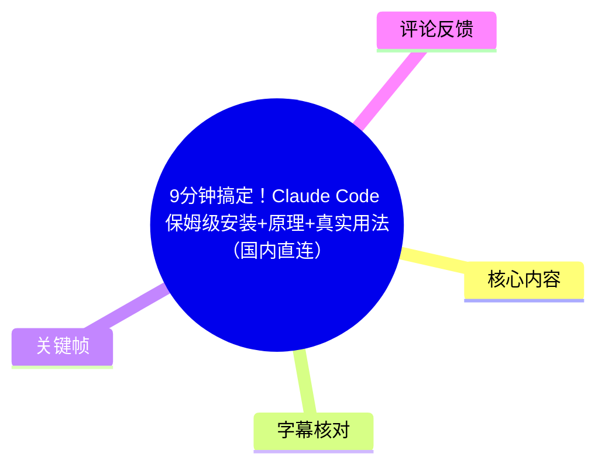
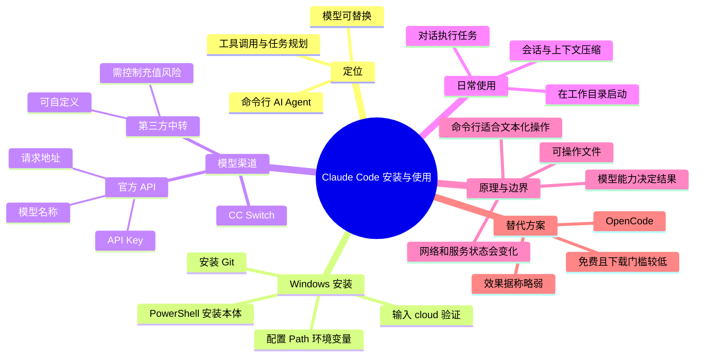
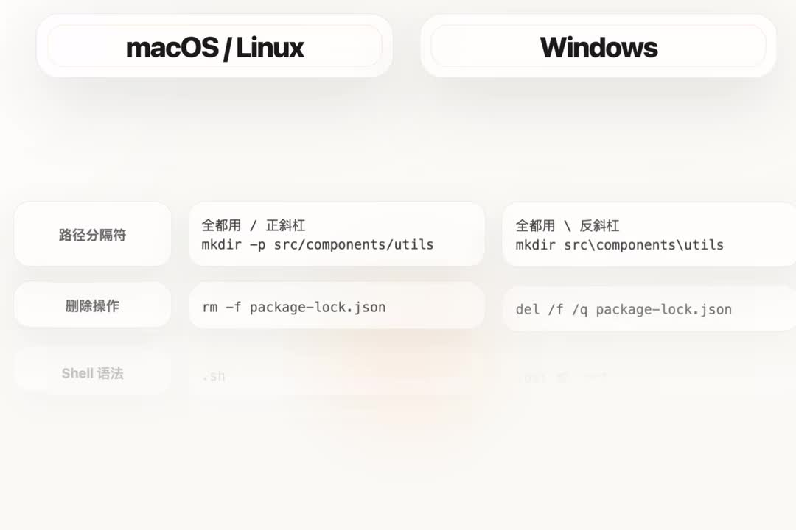

# 9分钟搞定！Claude Code 保姆级安装+原理+真实用法（国内直连）

> 来源：[Bilibili 视频](https://www.bilibili.com/video/BV1KjoxBoEQJ)  
> UP 主：人工大黑｜合集：AIcode  
> 本次可用音频与 ASR 覆盖的是 **P1，时长约 09:15（555.52 秒）**。虽然页面元数据记录为 3P、总时长 2099 秒，但 P2「Windows扩展包」、P3「macOS扩展包」没有对应的本次 ASR 音频素材，本文不会将其内容混入 P1 教程。

## 小结

视频以一台刚装完系统、缺少环境与依赖的 Windows 电脑为例，演示如何安装并使用 Claude Code。核心流程是：Windows 先安装 Git；在 PowerShell 中安装 Claude Code；将安装目录加入 `Path` 环境变量，使 `cloud` 命令可在新终端中直接启动；再借助 CC Switch 配置非官方模型渠道。

作者对 Claude Code 的定位并不只是“聊天 AI”，而是一个围绕模型工作的命令行 Agent 工具：它具备工具调用、记忆与任务规划等基础设施，并通过终端命令读写、查看、复制、删除文件，因此可以在指定工作目录中完成编程、查看 GitHub 项目、排查电脑问题等任务。模型并非必须使用 Claude 官方模型，但最终质量取决于实际接入的模型。

对 Windows 而言，Git 是关键前置条件。视频将其解释为 Windows 与原生偏向 Linux/macOS 的命令习惯之间的“翻译层”；macOS 与 Linux 用户通常可跳过这一步。安装后若只能使用一条很长的完整路径启动 Claude Code，应把安装提示中给出的目录加入系统 `Path`，重开 PowerShell 后再输入 `cloud` 验证。

视频针对“国内直连”提出的实际限制是：作者称 Claude 官方安装访问可能对中国区用户报错；其提供的替代安装方式仅优化了“发现最新版本与自动化安装”环节，并显示下载进度，但下载仍取决于用户自身网络。作者置顶评论进一步说明，脚本不在中间转发或缓存数据，实际下载安装由用户直连官方渠道完成。是否可访问、速度如何、安装流程是否仍有效，均会随网络和上游服务变化。

切换模型时，CC Switch 的关键不是某个固定平台，而是统一的三项配置：**请求地址、个人 API Key、模型名称**。视频分别讲了国内厂商官方 API 与第三方中转站两类渠道；后者存在稳定性、服务持续性与资金风险，作者明确建议少量充值、逐步测试，不要一次性大额充值。

基础使用上，Claude Code 应从目标文件夹启动，使该文件夹成为工作目录。通过 `cd <文件夹路径>` 进入目录后运行 `cloud`；对话在模型上下文窗口内持续，视频以 GLM-5.1 的 **200K 上下文**为例，指出接近上限会发生压缩，也可用 `/compact` 手动压缩，但历史细节会越来越容易失真。

## 思维导图





## 目录

- [视频范围、前置条件与时效性](#视频范围前置条件与时效性)
- [Claude Code 的定位：从对话到可执行 Agent](#claude-code-的定位从对话到可执行-agent)
- [Windows 安装：Git、PowerShell 与网络限制](#windows-安装gitpowershell-与网络限制)
- [配置 Path：让 cloud 成为可直接调用的命令](#配置-path让-cloud-成为可直接调用的命令)
- [切换模型：CC Switch 与三项配置](#切换模型cc-switch-与三项配置)
- [官方 API 与第三方中转的接入差异](#官方-api-与第三方中转的接入差异)
- [在工作目录中使用 Claude Code](#在工作目录中使用-claude-code)
- [上下文、压缩与命令行原理](#上下文压缩与命令行原理)
- [典型任务、替代方案与限制](#典型任务替代方案与限制)
- [字幕比对](#字幕比对)
- [评论分析](#评论分析)
- [处理记录](#处理记录)

## 视频范围、前置条件与时效性 [00:00:00](https://www.bilibili.com/video/BV1KjoxBoEQJ?t=0)

视频开场展示的目标是：一台约 10 分钟前还在装系统的电脑，随后已能通过 Claude Code 生成一段关于“做 AI 是一种什么感受”的视频。作者用这一案例强调，工具的价值在于让模型不止输出文字，还能围绕本地工作任务执行操作。

本教程的演示环境与范围如下：

- **主要演示系统：Windows。**
- **macOS/Linux：**作者称这两类系统的安装更简单，并会在关键位置给出相应操作提示；但本次 P1 音频没有给出完整的 macOS/Linux 命令文本，不能据此补写。
- **初始状态：**一台刚装好系统、缺少依赖的电脑，作者将其称作“最初始也是最差”的情况。
- **材料获取：**作者称软件下载与命令整理在其网站；视频中还提到关注后回复“cc安装”可自动获取。置顶评论公开了页面地址：<https://daheiai.com/cc-install.html>。
- **时间敏感性：**安装脚本、模型名、厂商 API、第三方中转站、官方地域访问与网络连通性均可能变化。本文只记录视频及其前三条热评所述内容，不保证当前仍可用。



> 图：关键帧展示 macOS/Linux 与 Windows 的路径分隔符、删除命令等差异，例如前者常用 `/` 与 `rm -f`，后者常用 `\` 与 `del /f /q`。它有助于理解为什么视频将 Windows 用户安装 Git 视为额外步骤，也提示读者不要把不同系统的命令直接混用。

## Claude Code 的定位：从对话到可执行 Agent [00:00:11](https://www.bilibili.com/video/BV1KjoxBoEQJ?t=11)

作者认为，Claude Code 是面向使用 AI 人群的重要工具之一。其与普通网页对话工具的差别，在于为中间的 AI 模型配备了额外能力：

- 工具使用；
- 记忆；
- 任务规划；
- 面向本地工作目录的命令行操作。

据视频表述，Claude Code 可理解为“软件/基础设施层”，而模型是其中可替换的“能力核心”。因此：

1. 不一定必须登录或使用 Claude 官方模型；
2. 可以切换到国内厂商 API 或第三方渠道；
3. 使用效果、推理能力和最终任务质量，仍主要由所接入模型决定。

这种拆分也是后续配置 CC Switch 的逻辑基础：**Claude Code 负责 Agent 工作流与终端协作，渠道配置负责将请求发送给哪一个模型服务。**


> 图：关键帧为作者出镜讲解画面，适合作为视频“面向普通用户讲解 AI 工具”的叙述锚点。图像本身不提供安装参数，正文中的具体技术内容仍以带时间戳的 ASR 为准。

## Windows 安装：Git、PowerShell 与网络限制 [00:00:59](https://www.bilibili.com/video/BV1KjoxBoEQJ?t=59)

### 1. Windows 先安装 Git [00:00:59](https://www.bilibili.com/video/BV1KjoxBoEQJ?t=59)

作者的步骤是先安装 Git，并说明：

- macOS/Linux 用户可跳过这一步；
- Windows 用户下载 Git 安装包后，安装过程通常保持默认选项、持续点击“下一步”即可；
- 若 Git 官网下载太慢，可使用作者准备的安装包，但视频未在可用字幕中给出该安装包的具体链接；
- 视频将 Git 解释为 Windows 与 Claude Code 原生命令适配之间的“翻译功能”。

这里需要区分视频的通俗解释与严格技术表述：视频意在说明 Git 提供的类 Unix 命令行环境/工具链能帮助 Windows 用户顺畅使用该工作流；实际依赖关系与 Claude Code 当前版本的 Windows 支持状态应以官方安装文档为准。

### 2. 以管理员身份打开 PowerShell [00:01:23](https://www.bilibili.com/video/BV1KjoxBoEQJ?t=83)

Git 安装期间，作者转入 Claude Code 本体安装：

1. 右键 Windows 开始菜单；
2. 选择以管理员身份打开 PowerShell/终端；
3. 输入作者整理的一行安装命令以启动安装。

视频强调命令行并非“过时界面”，而是后续使用 Claude Code 的主要交互入口。由于素材没有提供该完整安装脚本文本，本文不能编造命令；建议从作者公开页面或当前官方文档复制，而不要根据视频画面手输。

### 3. 中国区访问、下载与安装结果 [00:01:46](https://www.bilibili.com/video/BV1KjoxBoEQJ?t=106)

作者陈述的网络情况与应对方式：

- Claude 官方安装访问对中国区用户可能报错；
- 若报错，可改用作者提供的另一行命令；
- 作者称该替代方式是在官方安装命令基础上增加下载进度显示，并调整“发现最新版本 + 自动化安装”步骤；
- 他表示：若连不上官方服务器，替代命令至少可能连上其所提供的入口；但视频也明确表示，后续下载速度无法由作者保证；
- 安装会下载一个 **200 多 MB**的文件；
- 网络较差时，下载可能很久，只能等待；
- 成功后界面会显示安装成功、版本号及安装目录。

置顶热评补充了更新后的说法：即使已下载完成，Claude Code 最后安装阶段仍可能有验证；作者又优化了一版脚本，并称只要能完成下载通常就可正常安装。评论同时声明脚本不转发或缓存用户数据，实际安装下载仍由用户个人直连官方渠道。该说明属于作者评论中的自述，并非本文独立验证结论。

## 配置 Path：让 `cloud` 成为可直接调用的命令 [00:02:34](https://www.bilibili.com/video/BV1KjoxBoEQJ?t=154)

安装完成后，视频指出直接启动 Claude Code 的完整命令路径很长。作者用图形界面中的“快捷方式”类比 `Path`：

- 输入完整路径，相当于逐层打开磁盘和文件夹寻找程序；
- 输入 `cloud`，相当于调用一个已被系统识别的快捷入口；
- 要让系统识别这一入口，需要把 Claude Code 的安装目录添加进环境变量 `Path`。

操作步骤为：

1. 在开始菜单搜索“环境变量”；
2. 打开“编辑系统环境变量”；
3. 在弹窗中点击“环境变量”；
4. 在下半部分的系统环境变量中找到 `Path`；
5. 双击 `Path`，新建一条条目；
6. 从 Claude Code 安装成功提示中复制其给出的目录，粘贴到新条目；
7. 保存、确认；
8. **关闭当前 PowerShell，重新打开一个新窗口**；
9. 输入 `cloud` 验证是否可正常启动。

```powershell
cloud
```

> 视频明确提醒：环境变量修改不会立即作用于已经打开的终端窗口；必须重开 PowerShell/终端再测试。

启动后可能出现主题/样式选择。视频将其视为不影响核心功能的初始偏好设置。此后若进入官方登录页面或出现无法连接官方站点，不代表安装本体一定失败；作者的方案是继续通过 CC Switch 改接其他模型渠道。

## 切换模型：CC Switch 与三项配置 [00:03:46](https://www.bilibili.com/video/BV1KjoxBoEQJ?t=226)

作者使用 **CC Switch** 配置模型渠道。视频将其描述为可自定义不同 AI 渠道的软件，既可切换国内厂商官方 API，也可切换各类第三方中转站。

核心配置可归纳为固定的“三件套”：

| 配置项 | 含义 | 来源 |
| --- | --- | --- |
| 请求地址 | API 的服务端请求入口 | 模型厂商或中转站文档 |
| API Key | 用户个人凭证 | 用户登录平台后自行创建 |
| 模型名称 | 要调用的具体模型标识 | 平台接口文档或模型广场 |

作者反复强调：请求地址往往对同一平台的用户一致，**API Key 每个人不同**；模型名称必须与平台文档保持一致。视频提及的国内模型/平台例子包括 DeepSeek、阿里百炼、火山方舟、Kimi、智谱、MiniMax 等，但没有对它们逐一演示配置。

### 官方 API 示例的流程 [00:04:11](https://www.bilibili.com/video/BV1KjoxBoEQJ?t=251)

视频在可用 ASR 中以“智谱官方 API”为示例：

1. 登录对应模型平台官网；
2. 创建一个新的 API Key；
3. 在 CC Switch 的渠道配置中填入密钥；
4. 指定模型名称；
5. 保存后点击“启用”；
6. 再次运行 `cloud`；
7. 若 Claude Code 显示已配置的模型名，且发送消息能获得回复，说明渠道生效。

ASR 将演示模型名识别为“JRM5.1/GM5.1”，属于明显的专有名词识别不稳。根据上下文，视频意图是在说明“使用某个模型并显示其模型名”，但现有素材不足以无歧义确认该精确字符串，因此不将其作为可直接复制的模型 ID。

视频还提出一个重要关系：接入成功后不再需要使用 Claude 官方网页登录流程，因为模型请求已改由所配置渠道处理；这不等于可以忽略服务商账户、API 计费、密钥权限或渠道协议。


> 图：关键帧展示 AI 对话界面正在处理“国内 AI 模型 coding plan 现状”的请求，并列出搜索过程。它可辅助理解视频提出的“模型能力可替换、工具层与模型层分离”思路；但该画面不是 CC Switch 配置页，不能据此推断具体 API 地址或模型参数。

## 官方 API 与第三方中转的接入差异 [00:04:11](https://www.bilibili.com/video/BV1KjoxBoEQJ?t=251)

### 国内官方 API：字段通常需要完整填写 [00:04:35](https://www.bilibili.com/video/BV1KjoxBoEQJ?t=275)

作者称，国内厂商通常提供官网创建 API Key，并在接口文档中写明：

- 请求地址；
- 可用模型名称；
- 可能的高级参数或长上下文模型名称写法。

视频前半段站内字幕（与本视频不匹配的 P2 扩展字幕）还包含更细的操作演示：以 DeepSeek 为例，在 CC Switch 中填写请求地址、API Key、模型名称，并在高级选项中检查模型名；作者称某新模型支持“百万级长上下文”，在 Claude Code 中可能需要使用特定模型名称形式开启。但该段并非本次 P1 的对应字幕，且没有可匹配 P1 音频，故仅能作为“站内另一分 P 字幕所述内容”记录，不能与 P1 主流程混为已验证事实。

### 第三方中转：可自定义，但存在资金与稳定性风险 [00:08:10](https://www.bilibili.com/video/BV1KjoxBoEQJ?t=490)

P1 ASR 中，作者表示其整理过接近 200 个 API/平台入口，并称可以在其中选择官方或第三方渠道。对于第三方中转站，他的风险建议十分明确：

- 不要一次充太多钱；
- 先少量充值测试；
- 即使当前可用，也不保证下个月仍可用；
- 作者不为这些平台背书，也无法保证其长期服务状态。

站内 P2 字幕提供了较具体的第三方演示：某示例站点使用类似 New API 的界面，用户可通过“自定义渠道”粘贴请求地址、申请并填入 API Key；有些站会预设默认主模型，也可手动指定模型名。该字幕还演示通过 `/model` 切换模型，并把不同模型按“大杯/中杯/小杯”描述。由于它属于页面的 P2「Windows扩展包」字幕，而本次 ASR 音频仅覆盖 P1，因此应视作**单独分 P 的补充材料**。

使用第三方服务时，除稳定性与余额风险外，还应注意：

- API Key 不应泄露到截图、日志、公开仓库或聊天记录；
- 应了解服务商是否记录请求与文件内容；
- 对包含公司代码、个人隐私或密钥的工作目录，尤其要审慎授权；
- 不应因视频演示成功就默认任意第三方服务可信。

## 在工作目录中使用 Claude Code [00:05:21](https://www.bilibili.com/video/BV1KjoxBoEQJ?t=321)

安装和模型配置完成后，作者给出的常规使用方法是：**先进入目标文件夹，再启动 Claude Code。**

两种进入工作目录的方式：

1. 在文件夹内右键，直接打开终端；
2. 从开始菜单打开终端，再使用 `cd` 加目录路径进入。

```powershell
cd <目标文件夹路径>
cloud
```

其中：

- `cd` 后需要空格，再跟工作目录路径；
- `cloud` 在该目录中启动后，会把这个目录作为工作目录；
- 随后的对话、文件读取和命令操作都围绕该目录进行；
- 发送任务后，界面左下角可能显示一些英文状态或玩笑式文案，作者建议不必过度关注，应重点看回复结果及实际执行了哪些操作。

作者还提到，关闭终端后想回到原来的工作，需要再次回到相同目录并启动 `cloud`。ASR 在这里漏识别了“用于找回原对话内容”的具体命令名称，因此本文不补写。操作时应以 CLI 当前的帮助信息或官方文档为准。

## 上下文、压缩与命令行原理 [00:06:10](https://www.bilibili.com/video/BV1KjoxBoEQJ?t=370)

### 上下文窗口与 `/compact` [00:06:10](https://www.bilibili.com/video/BV1KjoxBoEQJ?t=370)

Claude Code 的多轮对话不是无限保存并无限精确理解的。作者说明：

- 上下文上限由接入的模型决定；
- 视频举例称，所用模型的上下文为 **200K**；
- 接近上限时，系统会进行压缩；
- 也可以用 `/compact` 主动压缩：

```text
/compact
```

压缩的代价是信息损失：

- 压缩前的细节很难完整恢复；
- 多次压缩后，早期对话内容会越来越容易失真；
- 这不是单一工具能够彻底避免的问题，而是模型有限上下文下的取舍。

实践上，可将大型任务拆分为多个目标明确的会话；在关键决策、路径、约束、验收标准出现时，保留在项目文档或提示中，而不要只依赖长对话历史。

### 为什么终端适合 Agent [00:06:34](https://www.bilibili.com/video/BV1KjoxBoEQJ?t=394)

作者用“网页聊天模型碰不到本地文件”概括普通对话框的限制。若让 AI 纯靠图形界面操作电脑，它需要循环执行：

1. 截图；
2. 识别界面内容；
3. 定位按钮；
4. 移动鼠标并点击；
5. 再截图确认状态。

这会增加 Token 消耗并降低速度。相比之下，终端中的许多动作可被表达成简短文本命令，返回结果通常也是纯文本，例如：

- 列出目录文件；
- 查看文件内容；
- 复制；
- 粘贴；
- 删除；
- 切换目录。

作者的核心判断是：**文本命令到文本结果的交互形式，非常适合模型理解与执行。** 当用户在 Claude Code 中提出任务时，Agent 可以经由命令行更高效地处理工作目录中的文件。这也是其作为编程工具的原始设计方向。

## 典型任务、替代方案与限制 [00:07:46](https://www.bilibili.com/video/BV1KjoxBoEQJ?t=466)

### 视频列举的使用场景 [00:07:46](https://www.bilibili.com/video/BV1KjoxBoEQJ?t=466)

作者列出的典型场景包括：

- **编程：**在项目目录内协助完成代码相关任务；
- **电脑故障排查：**例如检查外接 U 盘分区异常，并尝试使用磁盘相关命令扫描或格式化；
- **GitHub 项目使用：**帮助非程序员理解、配置或运行看中的开源仓库；
- **多任务并行：**作者称自己日常会打开多个命令行窗口，为不同任务分别安排工作，以提高效率。

这些场景的共同点是：任务涉及文件、目录、代码、配置或系统命令。与此同时，视频中“可以做到任何事情”的说法应理解为强调命令行控制能力，而非无条件保证。实际能力仍受以下因素限制：

| 限制 | 影响 |
| --- | --- |
| 模型能力与上下文 | 决定理解复杂需求、生成代码、持续执行任务的质量 |
| API 渠道与额度 | 决定是否能请求、速度、价格和模型可用性 |
| 用户权限 | 管理员权限、磁盘权限与系统策略会限制命令执行 |
| 工作目录与授权范围 | Agent 能否看到、修改哪些文件取决于所在路径和用户确认 |
| 高风险操作 | 删除、格式化、覆盖配置等不可逆动作可能造成数据丢失 |
| 网络环境 | 下载、登录、API 请求与模型响应都会受影响 |

尤其是磁盘格式化、批量删除、覆盖文件、执行陌生仓库脚本等操作，应先备份、检查命令，并在确认影响范围后再授权执行。

### 安装失败时的替代方案：OpenCode [00:08:34](https://www.bilibili.com/video/BV1KjoxBoEQJ?t=514)

视频最后给出 **OpenCode** 作为替代方案。作者称：

- 对于网络差、长时间仍无法完成 Claude Code 安装的用户，可尝试 OpenCode；
- 它开源、免费，下载速度可能更快、使用门槛更低；
- 功能和使用方式与 Claude Code 接近；
- 但作者主观评价其效果会比 Claude Code 略差。

该比较是作者经验判断，未提供同一任务、同一模型、同一环境下的量化测试。因此，选择工具时仍应以当前版本、所接模型、系统兼容性、安全模型与实际任务测试为准。

## 字幕比对

本任务**已检查本次 ASR**。ASR 诊断显示：源视频存在音轨，语言为中文，识别模型为 `medium`，音频时长 555.52 秒，语音覆盖率约 **99.56%**，首段从 00:00:00 开始、末段到 00:09:15.160；`noAudioStream=true` 未出现，因此不存在“源视频无音轨”的情况。

| 字幕来源 | 完整性 | 专有名词 | 时间轴 | 主要问题 |
| --- | --- | --- | --- | --- |
| Bilibili 站内字幕 P1 | 不匹配 | 大量不匹配 | 有时间轴，但对应其他内容 | 内容是潜水员、珊瑚保育节目，与 Claude Code 教程完全无关 |
| Bilibili 站内字幕 P2 | 覆盖约 12:42 的 Windows 扩展包 | Git、CC Switch、DeepSeek 等相对可辨 | 有真实分段时间轴 | 属于页面 P2，不是本次 P1 音轨；部分词存在口语转写和模型名误识别 |
| 本次 ASR | 覆盖 P1 全程，约 09:15 | 多处英文/专名误识别 | 时间轴连续、覆盖充分 | 将 Claude/Cloud、Git/Gate、Linux/Linus、OpenCode 等混淆；部分命令名遗漏或识别错误 |

### 最终字幕选择

正文以**本次 ASR 的时间轴**作为 P1 各章节链接依据，因为它与视频主题、时长和音频内容相匹配。站内 P1 字幕被判定为错配，未用于正文事实；站内 P2 字幕仅在明确标注为“P2 扩展包补充”的位置参考，不与 P1 事实混同。

结合上下文与关键帧，对 ASR 中的重要校正如下：

| ASR 原识别 | 本文采用写法 | 校正依据 |
| --- | --- | --- |
| Cloud Code / Clarkode | Claude Code | 视频标题、任务主题与上下文一致 |
| Gate / Get it | Git | 安装步骤语义、站内 P2 字幕明确写作 Git |
| Linus | Linux | 系统名称语境与关键帧的 macOS/Linux 对照 |
| 环景变亮 | 环境变量 | Windows 设置路径语境 |
| Path/Test | `Path` | Windows 环境变量标准名称、站内 P2 字幕 |
| Compat | `/compact` | Claude Code 上下文压缩命令语境；仅在 ASR 可辨的命令结构内修正 |
| OpenCode | OpenCode | 结尾替代工具语境；ASR 音近但总体可辨 |
| JRM5.1 / GM5.1 | 不确定的模型名 | 现有素材不足以确认精确 API 模型标识，保留不确定性 |

## 评论分析

仅处理可获取的热评前三条，以下均为评论者观点或经验，不视为已独立验证的事实。

### 1. UP 主置顶：更新安装脚本与直连声明

- **评论者：**人工大黑  
- **点赞：**2171  
- **主要内容：**UP 主称 Claude Code 在安装最后阶段仍有验证，于是再次优化脚本；并公开安装页面 <https://daheiai.com/cc-install.html>。
- **补充价值：**解释了视频上线后可能出现“已下载却在最后安装环节失败”的新情况，具备较强时效性。
- **可信度与边界：**评论来自视频作者，属于一手说明；但“不会转发或缓存数据”“下载均由用户直连官方渠道”仍是作者自述，用户应根据脚本内容、网络请求和自身安全要求自行判断。

### 2. 用户建议：通过 WinGet 安装

- **评论者：**libra6666  
- **点赞：**977  
- **主要内容：**评论称可尝试 Windows 包管理器 WinGet：

```powershell
winget install Anthropic.ClaudeCode
```

并称如果系统提示没有 `winget`，可在 Microsoft Store 安装“应用安装程序”。
- **补充价值：**提供了与视频脚本不同的安装路径，针对“国内下载慢”的痛点。
- **可信度与边界：**该方案由评论者转述自 DeepSeek，并非视频作者演示，也未在本任务素材中实际验证。软件包 ID、地区可用性、包源、当前版本与系统要求都可能变化；执行前应通过 WinGet 搜索或官方文档确认包名。

### 3. 用户反馈：接入 DeepSeek 新模型

- **评论者：**传奇Vertin  
- **点赞：**447  
- **主要内容：**称“用 Claude Code 接最新的 deepseek v4，美滋滋”。
- **补充价值：**印证评论区用户关注将 Claude Code 作为工具层、接入其他模型的使用方式。
- **可信度与边界：**这是简短使用感受，没有提供渠道、模型 ID、配置方法、成功截图或性能比较；“DeepSeek v4”是否为准确公开名称及其接入可行性，不能仅凭该评论确认。

## 处理记录

- **Worker ID：**worker-mrj0wbly-5dc4e50c
- **模型：**gpt-5.6-terra
- **使用工具与素材：**视频元数据、P1/P2 站内 SRT、本次 ASR `asr-result.json` 与 SRT、3 张关键帧、热评前三条。
- **ASR 检查结果：**已检查；ASR 使用 `medium`、中文识别、CUDA/float16，音频时长 555.52 秒、语音覆盖率 99.56%。未标记 `noAudioStream=true`，因此按“有音轨”处理。
- **字幕选择：**P1 正文采用本次 ASR 时间轴；站内 P1 字幕内容与视频主题完全错配，不采纳；站内 P2 字幕属于独立扩展分 P，仅作为明确标注的补充参考。
- **关键帧依据：**
  - `frames/frame-001.jpg`：可见 macOS/Linux 与 Windows 命令差异，支撑跨平台命令不能混用的说明；
  - `frames/frame-002.jpg`：作者讲解画面，用于呈现教程叙述场景；
  - `frames/frame-003.jpg`：AI 对话与搜索界面，辅助说明模型层与工具层的关系。
- **缓存清理：**未提供实际缓存清理执行日志；本文不虚构已清理结果。
- **未解决问题：**
  - 元数据记录总时长 2099 秒、共 3P，而本次 ASR 仅覆盖 P1 约 555 秒；
  - 视频中部分实际安装脚本、下载链接和精确模型 ID 未出现在可可靠识别的 P1 素材中；
  - 第三方渠道、模型可用性、WinGet 包名与官方地域策略均具有强时效性，需在实际操作前复核。
