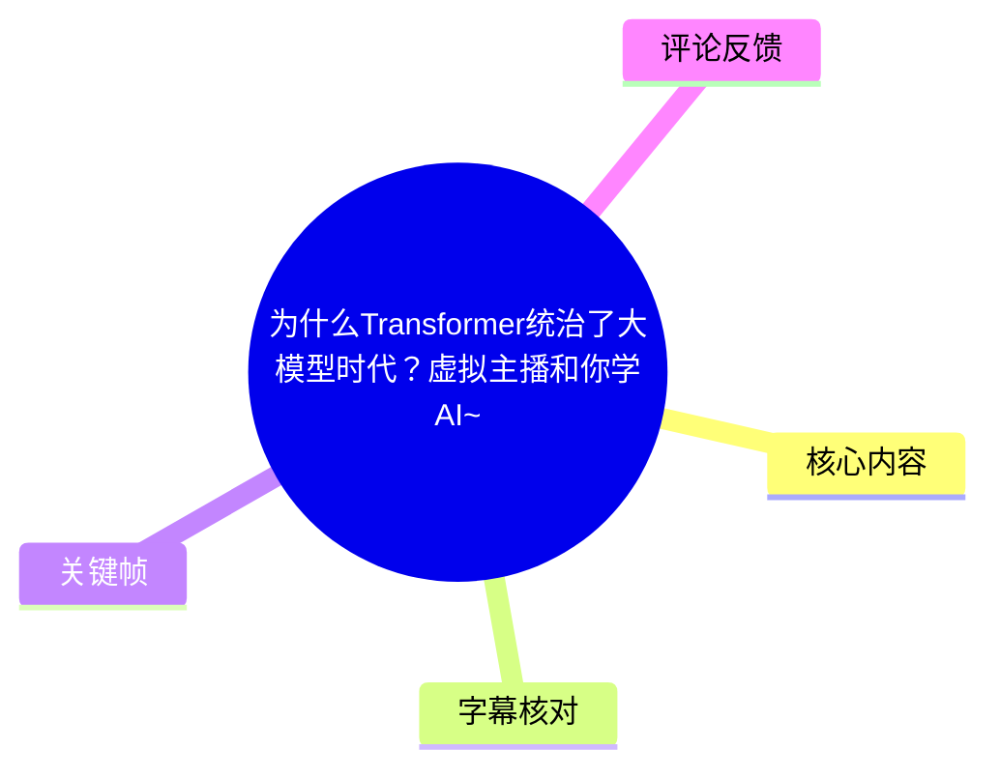
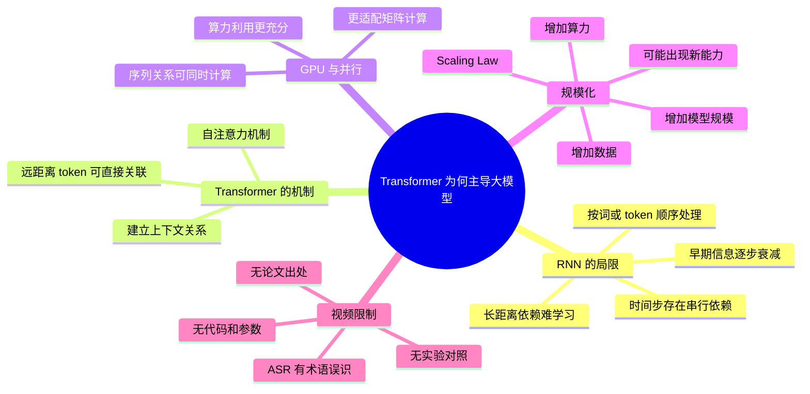

## 小结

视频以虚拟主播科普的形式，回答“为什么 Transformer 成为大模型时代主流架构”。全片围绕 RNN 与 Transformer 的对比展开：RNN 按序列顺序处理信息，面对长文本时容易出现早期信息难以传递到后部的问题；Transformer 则依靠自注意力机制，让相隔较远的 token 直接建立关联。

作者给出的第二个关键原因是并行计算。RNN 的当前状态依赖前一状态，处理多个词时有显著的顺序依赖；Transformer 可在同一层内同时计算序列中多个位置之间的关系，因此更适合 GPU 的大规模矩阵计算。视频将这一点概括为：在“算力为王”的大模型训练环境里，能有效利用算力的架构更具优势。

后半段进一步引入 Scaling Law（缩放规律）：视频认为，当数据、算力与模型规模被持续增加时，Transformer 模型能够继续扩展，并可能在规模跨越某些阶段后表现出此前不明显的能力。作者以 OpenAI 的 GPT 路线作为例子，说明其看重 Transformer 的规模化潜力。

这是一支概念入门视频，适合希望快速建立“RNN 局限—自注意力—GPU 并行—模型扩展”逻辑链的读者。视频没有提供代码、训练命令、模型参数、论文出处、实验图表或性能基准，因此不应将其中“没有长距离遗忘”“堆数据和算力就会变聪明”等表述理解为无条件成立的严格工程结论。

时效性方面，视频元数据抓取时间为 2026-07-13；RNN、Transformer、自注意力及 GPU 并行的基础概念具有较稳定的参考价值。但“Transformer 统治大模型时代”属于概括性标题表达，具体架构格局、长上下文方案和训练技术仍会持续变化。

## 思维导图

## 目录

- [视频定位、范围与时效性](#视频定位范围与时效性)
- [RNN：长距离信息与顺序依赖](#rnn长距离信息与顺序依赖)
- [自注意力：让远距离信息建立关联](#自注意力让远距离信息建立关联)
- [并行计算：为什么更适合 GPU](#并行计算为什么更适合-gpu)
- [Scaling Law：为何适合持续做大](#scaling-law为何适合持续做大)
- [视频中的学习步骤与术语表](#视频中的学习步骤与术语表)
- [结论、限制与待验证点](#结论限制与待验证点)
- [字幕比对](#字幕比对)
- [评论分析](#评论分析)
- [处理记录](#处理记录)

## 视频定位、范围与时效性 [00:00](https://www.bilibili.com/video/BV1Wa7W6nETk?t=0)

视频标题为《为什么Transformer统治了大模型时代？虚拟主播和你学AI~》，时长 164 秒，即约 2 分 44 秒。画面为 1080 × 1440 的竖屏虚拟主播科普形式，内容重点不是展示模型训练过程，而是通过口语化类比说明 Transformer 相对 RNN 的几个主要优势。

视频的论证结构可整理为四步：

1. 以 RNN 为“经典算法”对照对象；
2. 说明 RNN 在长文本中会出现早期信息难以保留的问题；
3. 引入 Transformer 的自注意力机制，说明其可关注远距离上下文；
4. 将并行计算和 Scaling Law 连接到大模型扩展能力。

素材中的视频标签主要是“虚拟偶像”“虚拟主播”“VUP”等，未出现“机器学习”“深度学习”等技术标签。因此，这支视频应理解为面向泛兴趣受众的 AI 入门内容，而非面向研究者或工程师的完整技术课程。

元数据抓取时的统计为：6,387 播放、662 点赞、229 收藏、55 投币、31 分享、43 评论、1 条弹幕。此类互动统计会随时间变化，仅记录素材抓取时状态。

## RNN：长距离信息与顺序依赖 [约 00:12](https://www.bilibili.com/video/BV1Wa7W6nETk?t=12)

视频首先以 RNN（Recurrent Neural Network，循环神经网络）作为对照。作者的通俗解释是：RNN 处理一句话时，需要“一个字一个字处理”；当文本增长到数百字甚至更长时，开头的字经过一层层传递后，可能逐渐被“遗忘”。

> 图：`frame-001.jpg` 画面中的重点文字为“RNN”和“经典算法RNN来说吧”。该帧直接确认了视频的比较起点，有助于将后续“自注意力”“并行计算”的优势理解为相对 RNN 的比较，而非对所有旧架构的一概而论。

视频将这种长文本中的困难对应到“梯度消失”。本次 ASR 将相关术语误识为“剃度型消失”，但结合前后语义，可有限校正为“梯度消失”。

从技术概念上看，视频传递的是以下关系：

- RNN 的序列状态需要逐步传递；
- 越早出现的信息，要影响越靠后的内容，通常需要跨越更多时间步；
- 在长序列训练中，早期信息的影响可能衰减；
- 因此，模型学习远距离依赖会更困难。

视频的说法属于基础科普层面的简化。应注意，RNN 并不等于“完全无法处理长文本”；LSTM、GRU 等带门控的循环结构正是为缓解长期依赖问题而设计。视频没有展开这些架构，也没有给出 RNN、LSTM、GRU 与 Transformer 的实验比较数据。

## 自注意力：让远距离信息建立关联 [约 00:38](https://www.bilibili.com/video/BV1Wa7W6nETk?t=38)

作者随后介绍 Transformer 的核心：**自注意力机制（Self-Attention）**。视频表达的重点是，序列中相隔很远的两个字或 token，仍然可以建立联系，不必像 RNN 一样让信息按位置逐步传递。

> 图：`frame-002.jpg` 明确写有“自注意力机制（Self-Attention）”。该帧是校正 ASR 的重要视觉依据：ASR 中出现的“自治引力激进”等文本不可靠，正文采用画面可验证的“自注意力机制”。

视频使用了包含“Switch”与“塞尔达”的语句作为例子。根据可辨识的 ASR 语义，作者要表达的是：模型能够结合“Switch”这一上下文线索，判断“塞尔达”更可能对应游戏，而不是人名。由于 ASR 对示例完整原句存在多处误识，本文不恢复未经可靠确认的逐字句子，只保留视频明确传达的语义结论。

从概念关系上，视频强调：

- 自注意力允许一个位置参考其他位置的信息；
- 远距离词语之间可以直接形成关联；
- 这使模型更容易利用上下文判断词语含义；
- 因而相对顺序递归传播，Transformer 更适合建模长程关系。

视频随后将其概括为 Transformer “不存在长距离遗忘问题”。这一表述应理解为对比 RNN 的通俗表达，而非绝对承诺。更审慎的技术理解是：自注意力缩短了远距离 token 之间的信息交互路径，但模型在超长上下文中能否稳定检索、理解和使用信息，仍取决于训练数据、上下文窗口、位置编码、注意力实现和任务设计等条件。

## 并行计算：为什么更适合 GPU [约 01:10](https://www.bilibili.com/video/BV1Wa7W6nETk?t=70)

视频给出的第二项优势是并行计算。作者描述 RNN 时说，它必须先处理第一个词，再处理第二个词、第三个词；这种顺序依赖使其难以充分利用 GPU 的并行计算能力。

> 图：`frame-003.jpg` 的字幕为“像RNN它就必须得先处理第一个词”。该帧直观呈现视频的核心论据：RNN 的时间步存在先后依赖，这是视频解释其并行性受限的直接依据。

视频认为，Transformer 的自注意力机制可以同时计算句子中“所有字之间的关系”，因而像是“为 GPU 量身订做”。这句话的核心并不是 GPU 只能运行 Transformer，而是 Transformer 的矩阵化计算模式更容易利用 GPU 擅长的批量并行计算。

> 图：`frame-004.jpg` 突出“算力!!!”。该帧将前面的架构差异与视频后半段的规模化叙事连接起来：作者将 GPU 并行能力视为大模型竞争中的关键资源条件。

视频的主张可整理为：

| 对比项 | 视频对 RNN 的描述 | 视频对 Transformer 的描述 |
| --- | --- | --- |
| 输入处理方式 | 按词或字逐步处理 | 可同时处理序列中的关系 |
| 依赖形式 | 后一步依赖前一步 | 位置间可通过注意力建立联系 |
| GPU 利用 | 不易充分利用并行计算 | 更适合 GPU 并行计算 |
| 对大规模训练的影响 | 算力浪费较明显 | 有利于规模化训练 |

需要补充的是，视频没有区分训练与自回归生成。在训练或处理完整输入上下文时，Transformer 的许多计算可以并行化；但在常见的自回归文本生成中，生成下一个 token 仍需依赖已经生成的前缀，因此输出 token 通常仍有顺序性。这是对视频简化表达的必要边界说明，不是视频中已展开讲述的内容。

## Scaling Law：为何适合持续做大 [约 01:43](https://www.bilibili.com/video/BV1Wa7W6nETk?t=103)

后半段中，作者称 Transformer 还有一个“更恐怖的武器”：**Scaling Law**。ASR 将这一术语记录为“Scaling Lo”，但结合其后紧接的“堆算力和数据，模型就能变聪明”以及常见术语，可校正为“Scaling Law（缩放规律）”。

视频给出的通俗定义是：

> 增加算力和数据，模型就能变聪明。

作者进一步将 Transformer 比作“搭乐高”：旧架构在规模扩大后容易面对梯度消失，难以训练前所未有的大模型；Transformer 则可以持续堆叠、扩大规模。视频认为，当参数规模突破某个临界点后，模型甚至可能出现“涌现能力”，即学会没有被直接教过的推理能力。

视频还提到，OpenAI 当年看中了这一点，因而坚定走 GPT 路线。这里应明确区分素材中的陈述与可验证材料：

| 内容 | 素材支持情况 | 本文处理方式 |
| --- | --- | --- |
| Transformer 具有良好的规模化训练适配性 | 视频明确陈述 | 作为视频核心观点记录 |
| Scaling Law 与数据、算力扩展有关 | 视频明确陈述 | 作为概念性解释记录 |
| 存在固定的能力“临界点” | 视频没有参数、论文或实验 | 仅记录为作者表述，不当作定量结论 |
| OpenAI 选择 GPT 路线完全由此单一因素决定 | 视频未提供出处 | 记录为视频归因，不作独立事实确认 |
| 扩大规模必然得到更强能力 | 素材未证明 | 明确标注为不能无条件推出 |

Scaling Law 在视频中承担的作用，是将“架构更容易并行”进一步连接到“大模型可持续扩张”。可迁移的理解不是简单地“堆资源必定成功”，而是：如果架构、数据、训练稳定性和计算资源能够协同扩展，模型性能可能随规模增长而改善。

## 视频中的学习步骤与术语表 [约 02:12](https://www.bilibili.com/video/BV1Wa7W6nETk?t=132)

视频未提供命令行、代码仓库、训练框架、模型配置、GPU 型号、batch size、学习率、参数量或上下文窗口等实操参数。其实际提供的是一套适合入门复习的概念学习顺序。

### 按视频逻辑复习

1. **先识别 RNN 的序列递归特征**
   - 视频称 RNN 按字或按词处理；
   - 后面的处理依赖前面的状态；
   - 长文本中较早信息较难影响较后位置。

2. **理解“长距离依赖”问题**
   - 文本越长，信息跨越的位置越远；
   - 视频使用“遗忘”描述早期信息传递困难；
   - 该问题被作者关联到梯度消失。

3. **学习 Transformer 的自注意力直觉**
   - 任何位置可关注其他位置；
   - 相隔很远的词语也能建立关系；
   - 上下文关系可用于词义判断。

4. **理解并行计算的意义**
   - RNN 的时间步处理有顺序性；
   - Transformer 可同时计算序列内关系；
   - GPU 在大规模并行矩阵计算中更有用武之地。

5. **将并行能力与规模化相连**
   - 大模型训练需要大量算力与数据；
   - 更容易并行的架构更便于扩大训练规模；
   - 视频以 Scaling Law 解释持续扩展的可能性。

### 视频中出现或可有限校正的术语

| 术语 | 在视频中的含义或作用 | ASR 质量与校正依据 |
| --- | --- | --- |
| RNN | 作为经典顺序模型的对照对象 | 识别稳定；`frame-001.jpg` 可确认 |
| Transformer | 视频讨论的核心架构 | ASR 多处误识为“穿梭”；标题可确认 |
| 自注意力机制 | Transformer 能建立远距离关联的核心说明 | `frame-002.jpg` 明确标注 Self-Attention |
| 梯度消失 | 作者用以说明长序列困难的术语 | ASR 误识明显，依据上下文作有限校正 |
| GPU | 视频强调的并行算力载体 | ASR 可辨识，且与并行语境一致 |
| Scaling Law | 解释模型可随资源扩展的概念 | ASR 误识为“Scaling Lo”，依据上下文校正 |
| 涌现能力 | 视频称规模突破后可能出现的能力 | ASR 表达不稳定；保留概念层结论 |
| GPT | 视频提及的 OpenAI 路线 | ASR 误识为“GBT”，按语境有限校正 |

## 结论、限制与待验证点 [约 02:32](https://www.bilibili.com/video/BV1Wa7W6nETk?t=152)

视频的中心结论是：Transformer 之所以在大模型时代成为主流，是因为自注意力帮助其建立远距离上下文关系，同时其矩阵化、并行化特征更适合利用 GPU 算力；这些特征又与数据、计算和模型规模持续扩张的趋势相匹配。

从视频可直接迁移的经验是：

- 理解 Transformer 时，不能只记住“注意力”，还应同时理解其与 RNN 的顺序依赖差异；
- 并行能力是大模型训练中与模型效果同等重要的工程因素；
- “模型架构—GPU 算力—训练规模—能力表现”是相互关联的，而非独立问题；
- 面对“Scaling Law”“涌现”等热门说法，应追问适用条件、实验设置和评估指标。

视频本身存在以下限制：

- **无参数**：未给出模型层数、参数量、数据规模、训练 token 数、上下文长度、GPU 型号、吞吐量、显存占用或训练成本。
- **无实验对照**：未展示 RNN、LSTM、Transformer 或其他架构在同一任务、同一硬件条件下的效果与速度比较。
- **无论文引用**：关于 Scaling Law、涌现能力、OpenAI 选择 GPT 路线的说法没有给出文献来源。
- **长距离能力被简化**：Transformer 缩短了 token 间交互路径，但不保证在任何长度和任何任务中都不会丢失关键信息。
- **并行性被简化**：生成式模型的逐 token 解码仍有序列依赖，不能将“Transformer 可并行”理解为所有推理阶段完全并行。
- **未讨论注意力成本**：视频没有涉及标准全注意力在长序列下可能面临的计算量和显存压力。
- **架构格局会变化**：标题中的“统治”是修辞性概括；未来是否存在颠覆 Transformer 的新架构，正是视频结尾留给观众的开放问题，素材没有提供确定答案。

## 字幕比对 [00:00](https://www.bilibili.com/video/BV1Wa7W6nETk?t=0)

本次任务已经执行 ASR。素材明确说明：**未提供可用的 Bilibili 站内字幕**。因此，无法进行逐句的站内字幕与 ASR 时间对齐，但仍可比较两类字幕来源的可用性。

| 字幕来源 | 完整性 | 专有名词 | 时间轴 | 主要问题 |
| --- | --- | --- | --- | --- |
| Bilibili 站内字幕 | 未提供可用内容 | 无法核验 | 无法核验 | 素材中没有可用站内字幕文件或文本 |
| 本次 ASR 字幕 | 覆盖开场、RNN、自注意力、GPU、Scaling Law、结尾提问等主要内容 | 技术术语误识较多 | 未提供逐句时间戳 | 中英混读、专有名词和部分示例句识别不稳定 |

### 最终字幕选择

正文采用**本次 ASR 字幕**作为唯一可用字幕基础，并按以下原则进行有限校正：

1. 优先保留 ASR 能可靠表达的叙事顺序；
2. 仅在标题、上下文和关键帧画面文字共同支持时校正术语；
3. 对无法确认的示例原句，不补写或重构为看似精确的原文；
4. 正文中的“约”时间点仅根据视频叙事顺序与关键帧顺序推定，不能视为逐字精确定位。

### 重要校正记录

| ASR 片段或问题 | 正文采用表述 | 校正依据 |
| --- | --- | --- |
| “AI全被穿梭了统治” | Transformer 主导大模型时代 | 视频标题含“Transformer统治了大模型时代” |
| “自治引力激进” | 自注意力机制 | `frame-002.jpg` 直接显示“自注意力机制（Self-Attention）” |
| “剃度型消失” | 梯度消失 | 前后内容对应 RNN 长距离训练问题 |
| “Scaling Lo” | Scaling Law | 后文紧接“堆算力和数据，模型就能变聪明” |
| “GBT 路线” | GPT 路线 | OpenAI 与 GPT 的语境匹配，属于字母误识 |
| “魔形看到这句话” | 模型看到这句话 | 上下文语义可确认，但不恢复完整示例句 |
| “并行计算”附近部分语句 | GPU 并行计算优势 | `frame-003.jpg` 与 `frame-004.jpg` 支持叙事主旨 |

## 评论分析 [约 02:38](https://www.bilibili.com/video/BV1Wa7W6nETk?t=158)

以下仅分析可获取的热评前三条。评论内容体现观众互动与态度，不构成对视频技术观点的独立验证。

### 1. @_鸠九鸟鸠｜37 赞

> “阿巴…阿巴阿巴，CPU…G…GCU啊不，GPU，学会了喵，我厉害吗七七……”

- **评论观点**：评论者以夸张的“刚学会”口吻与主播互动，并特意从 CPU、GCU 改口到 GPU。
- **与视频的关联**：呼应了视频强调的“GPU”“算力”和并行计算。
- **补充信息**：没有提供额外技术事实、案例或纠错。
- **可信度判断**：属于轻松互动评论，不能据此判断评论者的技术理解程度，也不能作为 GPU 与 Transformer 关系的证据。

### 2. @好哦喵｜10 赞

> “喵太多佔用我算力了[doge]”

- **评论观点**：调侃视频中反复出现的“喵”口癖占用了自己的“算力”。
- **与视频的关联**：借用了视频的核心高频词“算力”制造幽默。
- **补充信息**：未提出技术补充、反驳或问题。
- **可信度判断**：这是对表达风格的反馈，而非对 Transformer、RNN 或 Scaling Law 的讨论。

### 3. @地线带电20V｜5 赞

> “Transformers / More than meets the eye”

- **评论观点**：引用与《变形金刚》相关的英文口号，对“Transformer(s)”这一词进行双关。
- **与视频的关联**：仅与名称相同有关，不涉及机器学习 Transformer 的技术原理。
- **补充信息**：没有提供可验证的技术信息。
- **可信度判断**：属于文化梗互动，不能用于支持或反驳视频中的任何 AI 结论。

## 处理记录 [00:00](https://www.bilibili.com/video/BV1Wa7W6nETk?t=0)

- Worker ID：`worker-mrj0wjed-b0c290ad`
- 模型：`gpt-5.6-terra`
- 任务视频：`BV1Wa7W6nETk`
- 素材工具产物：任务素材包已提供 `merged.mp4`、`audio/audio.wav`、`frames/`、`info.json`、`comments/comments.json`、`subtitles/`、`asr/` 等输出路径。
- 使用依据：视频元数据、任务提供的 ASR 文本、可获取热评前三条、5 个关键帧路径及用户提供的关键帧画面。
- 字幕选择：未提供可用 Bilibili 站内字幕；本次 ASR 已执行，故正文以 ASR 为主。对 Transformer、Self-Attention、梯度消失、Scaling Law、GPT 等术语，仅在标题、上下文与画面文字可共同支持时作有限校正。
- 关键帧选择依据：
  - `frames/frame-001.jpg`：画面明确显示“RNN”，用于确认视频的对照架构；
  - `frames/frame-002.jpg`：直接显示“自注意力机制（Self-Attention）”，用于核心术语确认及 ASR 校正；
  - `frames/frame-003.jpg`：显示“RNN它就必须得先处理第一个词”，用于支撑顺序依赖说明；
  - `frames/frame-004.jpg`：突出“算力!!!”，用于连接 GPU 并行与规模化训练话题；
  - `frames/frame-005.jpg`：任务仅列出路径，未提供对应可核验画面内容，未在正文描述或引用，以避免编造画面信息。
- 时间轴依据：ASR 未附逐句时间戳；正文时间轴根据 164 秒总时长、内容顺序及关键帧叙事位置作近似定位，供回看使用。
- 缓存清理：素材中未提供缓存清理日志，无法确认缓存是否已清理；本记录不将其标记为已完成。
- 未解决问题：
  - 缺少可用站内字幕，无法完成逐句字幕交叉核验；
  - ASR 对英文技术词、中文技术术语和示例句存在明显误识；
  - 视频未提供 Scaling Law、涌现能力、GPT 路线相关说法的论文出处、参数或实验条件；
  - 视频中关于“长距离遗忘不存在”“规模临界点”的表述为科普性概括，不能从素材中推出严格的量化结论。

## 评论分析

本次流程未获取到可用热评，因此不推断观众态度或额外结论。
