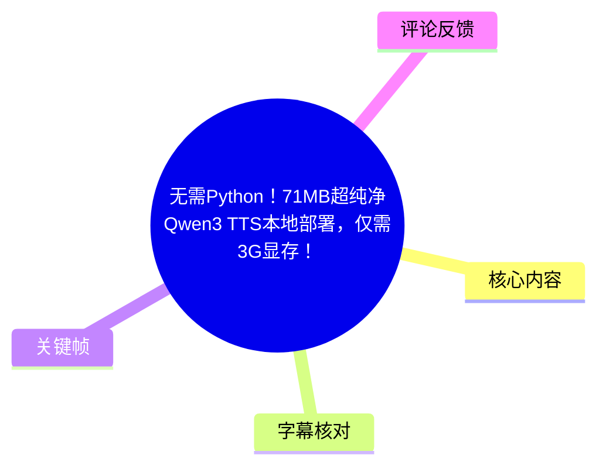
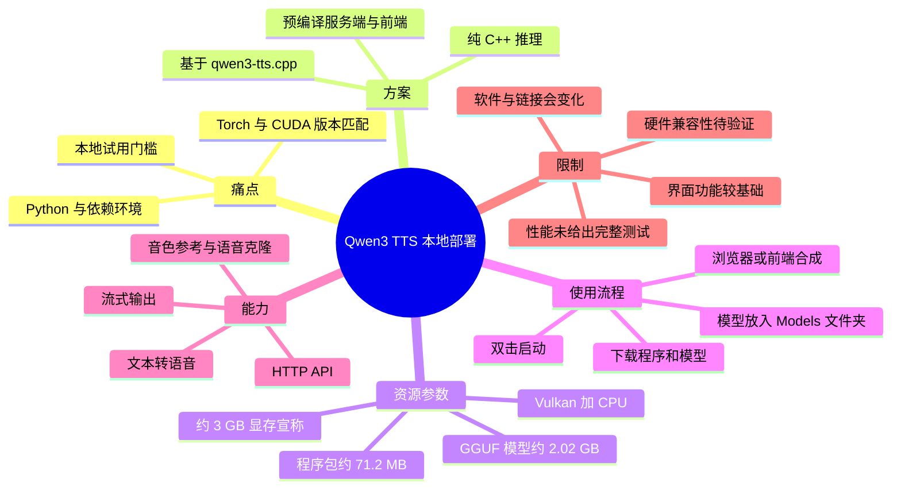
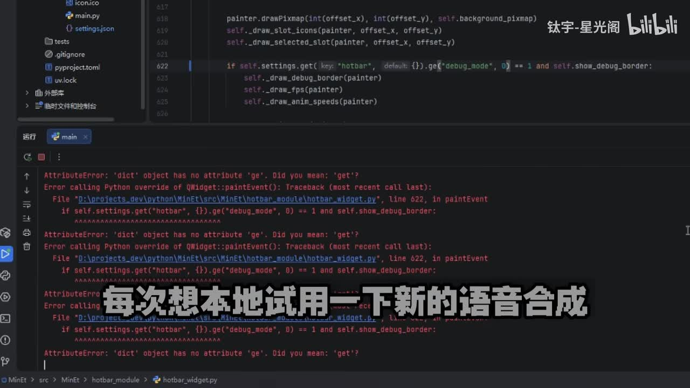
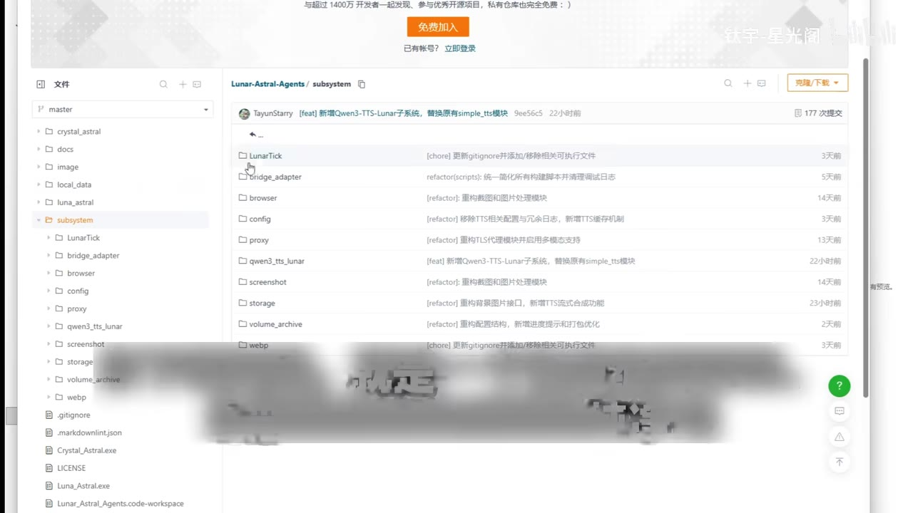
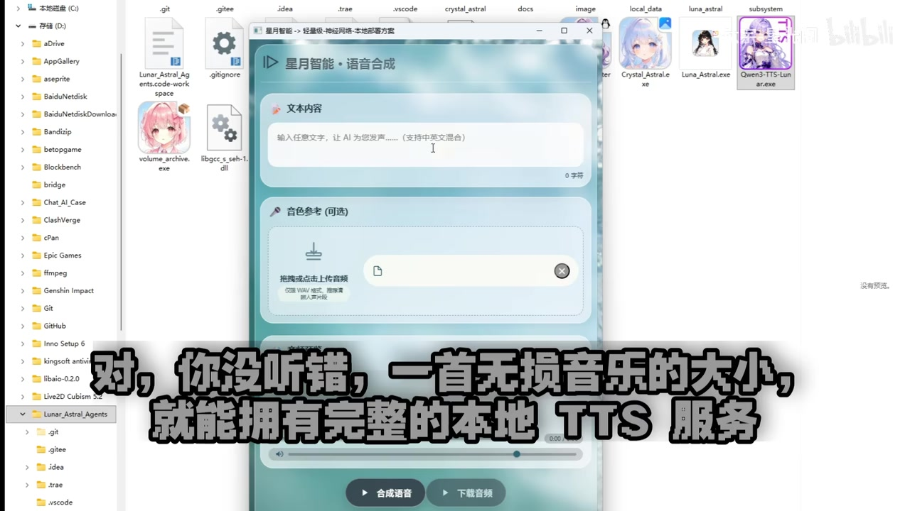
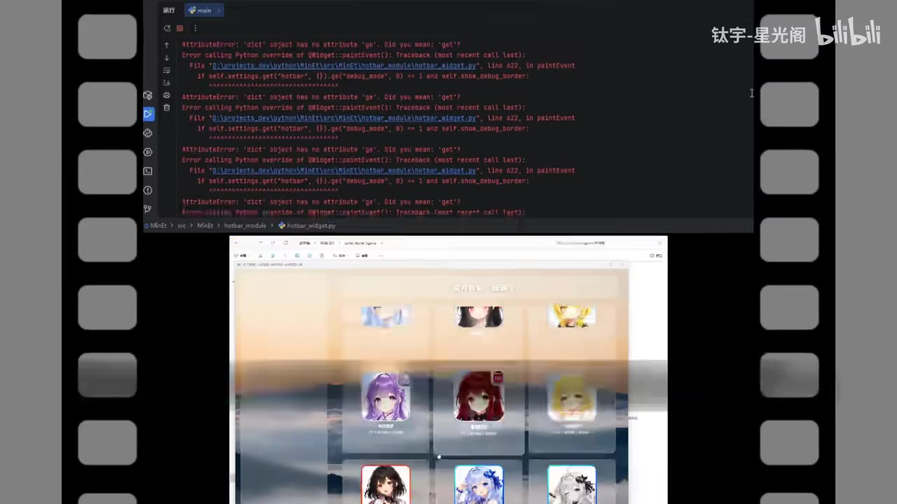

# 无需Python！71MB超纯净Qwen3 TTS本地部署，仅需3G显存！

> 来源：[Bilibili 视频](https://www.bilibili.com/video/BV1VFLz66E37) 
> UP 主：钛宇-星光阁｜视频时长：2 分 48 秒｜合集：AIcode  
> 本文仅据视频元数据、ASR、关键帧与可获取热评整理；其中“项目能力”均为视频/项目说明的陈述，不等同于独立复测结论。

## 小结

视频介绍了一个从 **Lunar-Astral-Agents** 拆分出的本地 **Qwen3-TTS** 语音合成方案。其主张是基于上游 `qwen3-tts.cpp` 进行纯 C++ 推理，用户不必安装 Python、pip、Conda 或 CUDA 开发环境，下载预编译程序与 GGUF 模型后即可启动。

该方案的核心参数为：前后端程序包约 **71.2 MB**，另需下载约 **2.02 GB 的 GGUF 模型**；视频称模型放入 `Models` 文件夹后双击启动。推理路径被描述为 **Vulkan + CPU**，视频宣称约 **3 GB 显存**即可流畅运行，但没有给出显卡型号、量化规格、生成时长或实时系数，因此该显存结论应视为项目方经验值。

功能层面，视频与项目描述提及本地 Web 前端、HTTP API、流式输出与语音克隆；关键帧显示界面可输入文本、上传音色参考音频，并提供“合成语音”“下载音频”按钮。ASR 后半段是多段合成语音样音，内容围绕果茶、咖啡、日记和游戏剧情，用于展示语音输出，而非额外教程步骤。

适合希望绕开 Python 依赖、先快速验证本地 TTS 是否可运行的 Windows 本地部署用户，以及需要通过 HTTP 接入语音合成能力的开发者。它不适合作为“所有硬件均可运行”或“实时低延迟”的保证：热评中已有用户反馈无主流 NVIDIA/AMD/核显的设备打不开，另有用户提到其自行编译上游项目时 RTF 约为 1.2。

视频发布于元数据所示的 2026 年 5 月，软件包、模型地址、显卡驱动兼容性和项目功能都可能随版本更新而变化；部署前应以项目仓库 README、发布包说明和当前模型页面为准。

## 思维导图

## 目录

- [背景：Python 依赖与部署痛点](#背景python-依赖与部署痛点)
- [方案与资源参数](#方案与资源参数)
- [操作流程与界面能力](#操作流程与界面能力)
- [语音克隆、API 与样音展示](#语音克隆api-与样音展示)
- [结论、限制与时效性](#结论限制与时效性)
- [字幕比对](#字幕比对)
- [评论分析](#评论分析)
- [处理记录](#处理记录)

## 背景：Python 依赖与部署痛点 [00:00:28](https://www.bilibili.com/video/BV1VFLz66E37?t=28)

视频先将问题指向本地尝试新语音合成工具时常见的环境配置负担：Python 环境、`No module named ...` 类模块错误、Torch/CUDA 版本不匹配以及安装依赖耗时。这里是作者对传统部署体验的概括，并非对所有 TTS 项目的统一结论。

作者提出的替代方案是“完全脱离 Python”的 Qwen3-TTS 本地部署。结合视频简介可知，该独立程序是从 **Lunar-Astral-Agents** 项目中拆分，底层基于 **Qwen3-TTS.CPP / `qwen3-tts.cpp`**。其定位不是提供训练环境，而是让用户使用预编译的本地推理服务。

> 图：关键帧展示 IDE 中的 Python `AttributeError`/调用栈及“每次想本地试用一下新的语音合成”字幕。它直观交代了本视频的切入点：降低 Python 及依赖错误带来的试用门槛，而不是讨论语音模型训练。

## 方案与资源参数 [00:00:30](https://www.bilibili.com/video/BV1VFLz66E37?t=30)

### 预编译纯 C++ 包与模型体积

视频称下载得到的是一个“已编译好”、自带服务端和前端的纯净包。项目简介将其概括为：

- **运行时形态**：纯 C++ 推理，宣称零 Python 依赖；
- **程序包体积**：前端与后端合计约 **71.2 MB**；
- **模型格式与大小**：约 **2.02 GB 的 GGUF 模型**；
- **推理后端**：Vulkan 与 CPU；
- **前端实现**：原生 HTML、CSS、JavaScript，可通过 WebView 封装桌面应用。

ASR 将模型格式误识别为“GQF”，但视频简介明确给出 **GGUF**；本文采用元数据中的 GGUF 表述。视频用“71.2 MB”强调的是**应用程序包**，并不包含 2.02 GB 模型，因此实际首次下载与磁盘占用至少还要加上模型文件，以及运行时生成的音频、日志等数据。

### 显存主张的边界 [00:00:54](https://www.bilibili.com/video/BV1VFLz66E37?t=54)

作者称，模型放入 `Models` 文件夹并启动后，本地 TTS 即可运行；其口播与简介均给出 **Vulkan + CPU、约 3 GB 显存**的说法。

需要区分以下信息：

| 项目 | 视频/简介明确给出的信息 | 未在素材中给出的信息 |
| --- | --- | --- |
| 模型 | GGUF，约 2.02 GB | 具体量化级别、上下文配置 |
| 显存 | “约 3 GB 显存即可流畅运行” | 测试显卡、分辨率、显存峰值与余量 |
| 后端 | Vulkan + CPU | 不同平台的驱动要求、CPU-only 性能 |
| 性能 | 热评有个体体验“速度挺快” | 官方 RTF、首包延迟、吞吐基准 |

因此，“3 GB 显存”只能理解为视频作者对特定配置下的目标或测试经验，不能从现有素材推出低显存卡、非主流显卡、无可用 Vulkan 驱动的设备均能运行。

> 图：关键帧展示 Gitee 上的 `Lunar-Astral-Agents / subsystem` 目录，列表中可见 `qwen3_tts_lunar`。它为“该功能来自 Lunar-Astral-Agents 中的子模块/拆分项目”提供了画面佐证，但不能据此推断完整源码结构或版本状态。

## 操作流程与界面能力 [00:00:54](https://www.bilibili.com/video/BV1VFLz66E37?t=54)

### 最小启动步骤

视频简介给出了可执行的快速开始流程，视频口播覆盖了其中“放入模型目录、双击启动”的关键操作：

1. 下载程序包，标称大小约 **71.2 MB**。
2. 下载 Qwen3-TTS 的 **GGUF 模型文件**，标称约 **2.02 GB**。
3. 将模型放入程序指定的 `Models` 文件夹。
4. 双击启动程序。
5. 在浏览器打开前端页面，或通过其桌面封装界面输入文本、生成并下载语音。

素材没有提供压缩包文件名、可执行文件名、端口号、启动命令、模型精确文件名或目录树，故不能补写这些细节。项目简介列出了 Gitee、123 云盘、ModelScope 与上游 GitHub 链接，但链接可用性应在实际操作时自行确认。

### 前端界面与参考音频 [00:01:07](https://www.bilibili.com/video/BV1VFLz66E37?t=67)

关键帧中的“星月智能·语音合成”界面包含：

- **文本内容**输入区，提示可输入任意文字；
- **音色参考（可选）**上传区域；
- 合成结果播放进度条；
- **合成语音**与**下载音频**按钮。

画面中的上传提示写有“仅支持 WAV 格式，需提供一段”，这意味着至少该展示版本的参考音频入口要求 WAV。热评第一条也反馈“只能上传 wav 格式音源”，与画面一致；不过热评属于用户经验，仍不能替代当前版本的正式兼容格式说明。

> 图：这是正文中最有操作价值的关键帧。它将抽象的“本地 TTS 服务”具体化为可直接输入文本、上传参考音频、试听和下载的界面，并明确显示参考音色上传区域。

### 使用建议与复现检查

在缺少安装日志与实测参数的前提下，建议按以下顺序检查部署结果：

1. **先确认模型位置**：模型是否确实位于程序约定的 `Models` 目录，而非仅留在下载目录。
2. **再确认可启动性**：双击后是否有服务窗口、网页前端或桌面界面出现；素材未提供端口，勿擅自假定固定 URL。
3. **用短文本验证生成链路**：确认能生成、播放和下载音频后，再尝试较长文本。
4. **需要音色参考时使用 WAV**：这是视频画面所示限制；应准备短且清晰的人声片段，并确认你拥有使用该声音的授权。
5. **开发接入时验证 API**：项目描述声称提供 HTTP API 与流式输出，但本视频未展示请求路径、JSON 字段、鉴权、错误码或流式协议，实际应以仓库文档为准。

## 语音克隆、API 与样音展示 [00:01:07](https://www.bilibili.com/video/BV1VFLz66E37?t=67)

视频称：提供一小段音频后，模型能够捕捉音色特征，再用该声音朗读任意内容；项目简介将这项能力称为“语音克隆”。视频还称其适合嵌入自己的应用或搭建语音相关服务，并强调“一个 HTTP 请求，剩下的全交给它”。这些是能力定位，素材没有展示实际 HTTP 调用示例或克隆质量对照，因此不能判断接口稳定性、并发性能、语音相似度与滥用防护情况。

从 [01:56](https://www.bilibili.com/video/BV1VFLz66E37?t=116) 起，视频播放了数段合成语音样本，文本包括：

- “好久不见，最近有没有什么好玩的事想分享？”
- “快尝尝看甜不甜，你平时喜欢怎么喝咖啡或者饮料呀？”
- “刚还在窗边写日记……要不要先尝尝我泡的果茶……”
- “这可是我刚亲手做的，加了点蜂蜜呢……”

这些段落应理解为 **TTS 输出试听**。它们展示的是自然语言对话式文案的生成效果，不构成关于部署、接口或模型参数的新增技术信息。

> 图：关键帧呈现多个角色/音色卡片式界面和语音工具画面。它有助于理解视频所强调的“前端可用性”和音色相关功能，但画面未给出每个卡片对应的模型、授权范围或可配置参数，不能据此扩展解释。

## 结论、限制与时效性 [00:01:32](https://www.bilibili.com/video/BV1VFLz66E37?t=92)

视频结尾将 Lunar-Astral-Agents 相关方案总结为“完全脱离 Python”的 Qwen3-TTS 解决方案，并强调开源代码可在 Gitee 获取。可迁移的实践经验是：对仅需本地推理和应用集成的用户，优先寻找**预编译推理包 + 明确模型目录 + 可视化前端/API**的分发方式，能显著减少 Python 依赖管理的初始成本。

但“免 Python”不等于“零配置”或“全设备兼容”。本素材可确认或应当保留的限制包括：

- **模型仍需单独下载**：71.2 MB 并非完整运行总大小，另有约 2.02 GB GGUF 模型。
- **硬件兼容性未充分展示**：虽称 Vulkan + CPU、约 3 GB 显存，但没有给出 GPU 白名单、Vulkan 驱动条件及 CPU 回退性能。
- **前端功能可能较基础**：热评用户反馈不能调节音色、参考音频仅 WAV、下载目录不能自定义；这些是该用户的版本体验，需等待项目维护者确认。
- **生成性能尚无视频实测基准**：没有演示首字延迟、生成倍率、长文本稳定性或并发能力。
- **语音克隆涉及授权与伦理**：视频展示的是功能，实际使用任何可识别个人声音前，应取得合法授权，并遵守平台、地区及应用场景要求。
- **时效性**：仓库目录、发行包、模型文件、驱动兼容性和 API 都可能变化；视频发布时间以元数据为准，实际部署时应阅读最新文档。

## 字幕比对

| 字幕来源 | 完整性 | 专有名词 | 时间轴 | 主要问题 |
| --- | --- | --- | --- | --- |
| Bilibili 站内字幕 | 未提供可用字幕，无法比较文本内容 | 无法评估 | 无法使用 | 素材明确标注“未提供可用站内字幕” |
| 本次 ASR 字幕 | 有 9 段，覆盖约 118.55 秒语音；前 28.8 秒无识别文本，后段包含样音 | 较多误识别 | 有真实 SRT 起止时间，可用于定位 | 多个中英文术语、人名/项目名和格式名失真；单段过长，标点与断句不足 |

本次 ASR 使用 `medium` 模型，语言识别为中文，置信度约 **0.9819**，音频时长约 **167.488 秒**，语音覆盖率约 **70.78%**。诊断未标记 `noAudioStream=true`，且提供了可用音频及带时间戳的 ASR 结果，因此不能将字幕问题归因于“源视频无音轨”。

最终采用策略为：**时间位置采用 ASR SRT 的真实起始时间；技术专名和关键参数以视频元数据、项目简介与关键帧校正；语义模糊处不强行补全。**

重要校正如下：

| ASR 误识别/模糊内容 | 本文采用表述 | 校正依据 |
| --- | --- | --- |
| “Hawk TTS”“統一千萬三 TTS”“Kuansan TTS” | Qwen3-TTS | 视频标题、简介 |
| “GQF 格式” | GGUF 格式 | 视频简介中的模型说明 |
| “ModelStore” | ModelScope | 视频简介中的模型下载地址 |
| “VLKM” | Vulkan | 视频简介中的推理后端 |
| “HTMLCSSJSAwebView” | HTML / CSS / JavaScript 与 WebView | 视频简介 |
| “服務燈” | 服务端 | 结合上下文与简介“自研服务端”校正 |

## 评论分析

以下仅处理可获取热评前三条。评论反映的是用户体验与提问，不作为已验证的项目规格。

1. **威尔老王（46 赞）**  
   - 观点：其公司电脑无法运行 IndexTTS、VoxCPM，但下载本项目后可以使用，认为该工具解决了“有无问题”，且速度较快。  
   - 补充信息：其称使用 **5060 显卡**生成约 90 个字“半分钟不到”；同时反馈不能调音色、只能传 WAV、下载不能自定义目录。  
   - 建议：希望取消“相同文本生成后不允许再次生成”的限制，因为不同次生成的语气可能不同。  
   - 可信度边界：这是单一用户、未说明版本号、模型、驱动和完整测试条件的体验；可作为兼容性和交互优化线索，不能外推为普遍性能结论。

2. **雪城零（35 赞）**  
   - 观点：询问无 NVIDIA、无 AMD、无核显的设备是否能运行。  
   - 补充信息：其使用“国内小众显卡”，下载后发现打不开。  
   - 价值：该评论直接提示“Vulkan + CPU”宣传并不能自动保证所有图形硬件可启动，驱动、图形 API 支持和程序打包平台仍是部署前置条件。  
   - 可信度边界：没有提供报错日志、系统版本或显卡型号，无法定位问题究竟来自硬件、驱动、缺失运行库还是软件版本。

3. **雪色夜（27 赞）**  
   - 观点：询问 UP 主实测延迟；其自行在 CUDA 环境编译 `qwen3-tts.cpp` 后测得 RTF 约 **1.2**，认为可能更适合离线生成。  
   - 补充信息：RTF（Real-Time Factor）通常可用于表示生成耗时相对音频时长的比例；但该评论没有说明文本、音色模式、GPU、量化和测试方法。  
   - 价值：提醒使用者不要仅凭“可运行”推断适合实时对话，应单独测量首包延迟与整体 RTF。  
   - 可信度边界：评论测试的是其自行编译的上游项目环境，未必等同于视频展示的预编译分发包。

## 处理记录

- **Worker ID**：`worker-mrj0www4-e8d79408`
- **模型**：`gpt-5.6-terra`
- **素材与工具产物**：使用任务提供的视频元数据、描述、ASR 结果 `asr/asr-result.json`、带时间戳字幕 `asr/transcript.srt`、关键帧目录 `frames/`、热评数据 `comments/comments.json`。
- **字幕选择**：站内字幕未提供可用版本；已检查本次 ASR。正文时间轴采用 ASR SRT 的真实分段起始时间，术语以元数据、简介和关键帧进行有限校正。
- **关键帧选择依据**：`frame-001.jpg` 用于呈现 Python 报错痛点；`frame-003.jpg` 用于展示仓库中 `qwen3_tts_lunar` 目录；`frame-004.jpg` 用于展示文本、WAV 参考音频、合成和下载操作界面；`frame-002.jpg` 辅助说明前端/音色相关可视化。未根据未提供时间戳的关键帧反推精确视频秒数。
- **缓存清理**：未提供缓存清理执行日志；本文不将其写作已完成，状态为“无法核验”。
- **未解决问题**：程序的操作系统要求、模型精确文件名、端口和 API 参数、不同显卡兼容性、CPU-only 速度、实际显存峰值、首包延迟、RTF、流式协议及当前版本功能均未在现有视频素材中完整披露。
