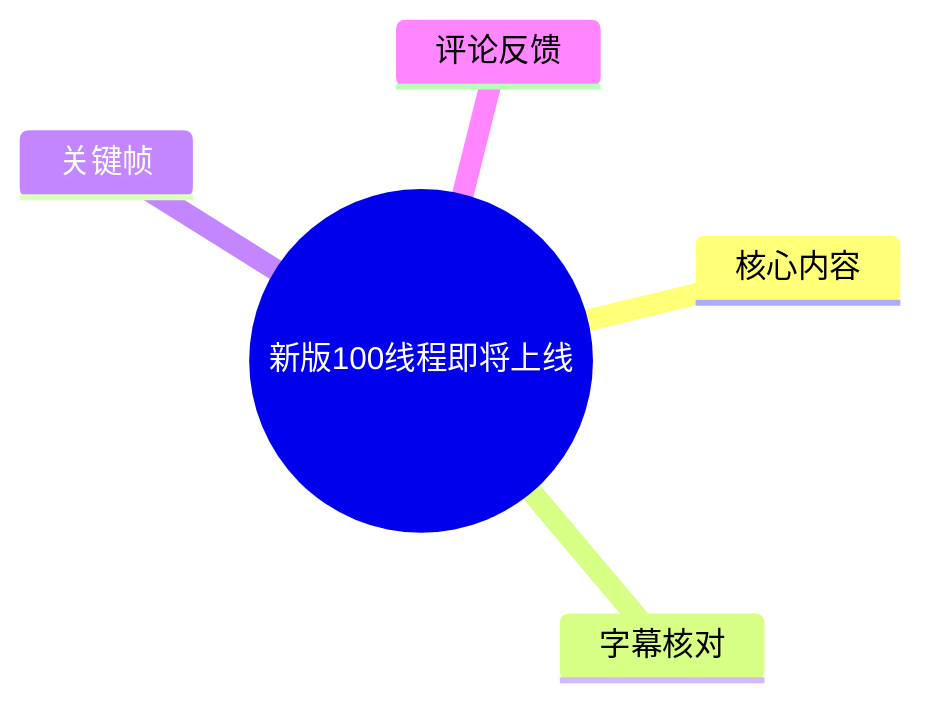
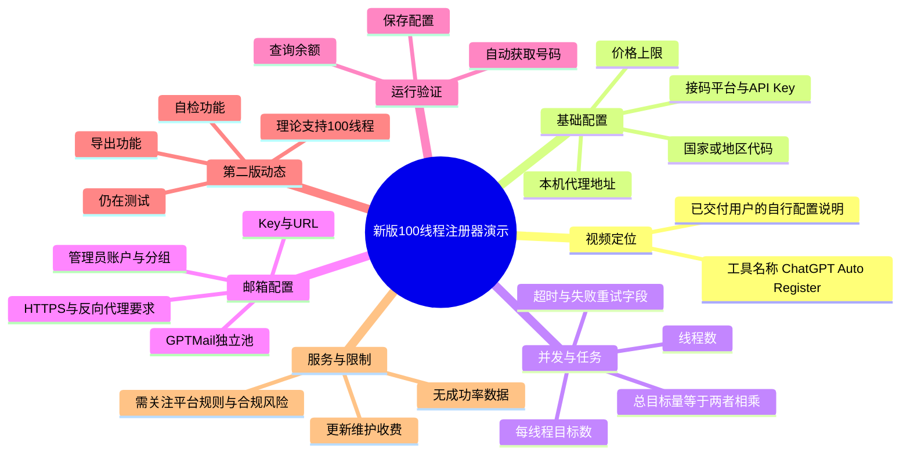
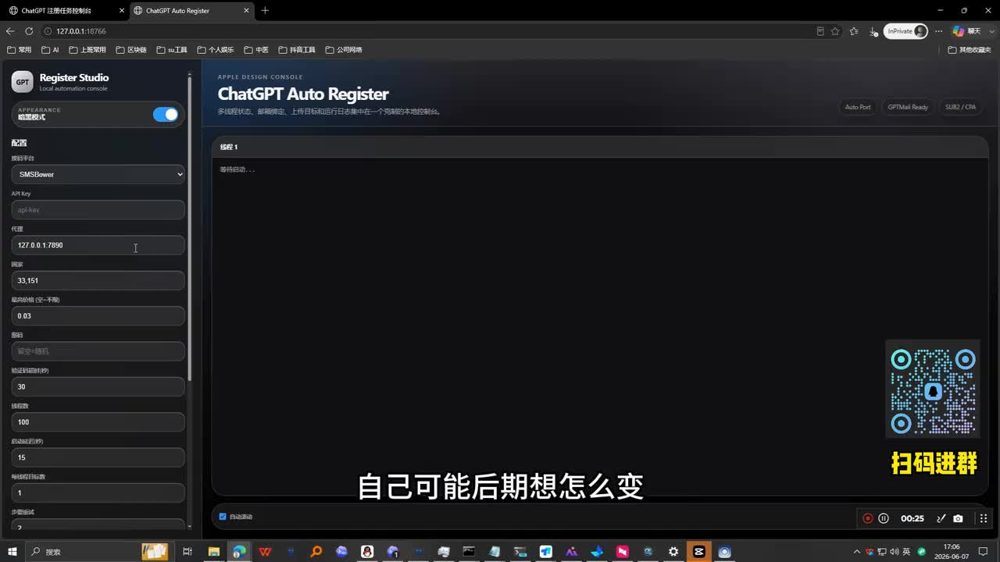
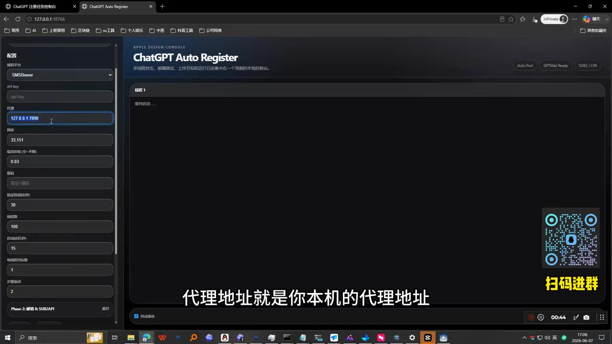
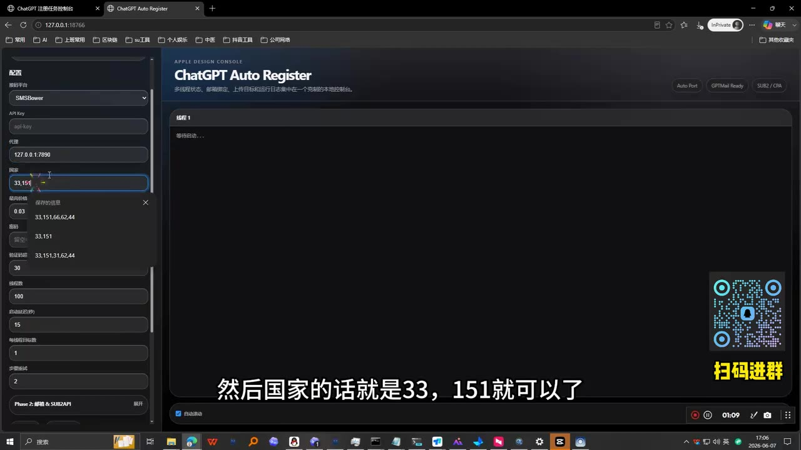
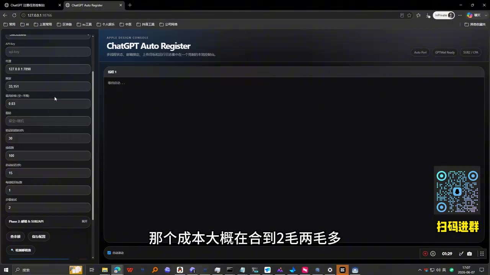

# 新版100线程即将上线

> 来源：[Bilibili 视频](https://www.bilibili.com/video/BV1HuEb6vE4S)<br>
> UP 主：大牛科技-AI｜发布时间：2026-06-07｜视频时长：04:01｜整理时抓取数据：2026-07-16

## 小结

视频是一次名为 **ChatGPT Auto Register / Register Studio** 的注册器配置演示。UP 主面向已购买并通过远程方式交付该工具的用户，说明用户后续如何自行调整接码平台、API Key、本机代理、国家/地区代码、价格、线程数、目标数量，以及邮箱独立池等配置。

配置层面的关键逻辑是：接码服务需要填写平台 API Key；代理地址使用本机代理监听地址，画面与口述均以 `127.0.0.1:端口` 为例；接码国家/地区字段可填 `33,151`；价格上限会影响可获取号码的成本与成功概率。UP 主建议在不急用时以较低价格持续尝试，并将 `0.02` 作为其常用的挂起价格，但这些成本与成功率均为其个人陈述，不构成稳定报价或效果保证。

并发设置由“线程数”和“每线程目标数”共同决定。视频明确举例：4 个线程、每线程目标数为 10 时，总目标量为 40。界面还显示了失败重试、验证码超时、号码获取超时等字段；UP 主称通常只需重点调整线程数与目标数，其他字段暂不建议随意改动。

邮箱部分涉及独立池、GPTMail、Key、URL、邮箱、管理员账户和分组等配置。UP 主特别强调相关地址必须使用 **HTTPS**；若仅为 HTTP，则其称会因“不安全”而无法正常执行，因此需要通过反向代理转换为 HTTPS。这是视频中最明确的环境限制之一。

视频的“新闻”重点是第二版正在测试：UP 主称新版**理论上可支持 100 线程**，并新增导出与自检功能，但尚未完成公开稳定性验证。其计划是在自身测试“差不多”后，再交由内部群用户继续测试。因此，“100 线程”应理解为待验证的开发中能力，而不是已正式上线、可保证达到的性能指标。

UP 主还说明后续更新、邮箱系统维护、远程协助均有成本，因此更新并非免费；同时宣传该工具可在无人值守状态下连续运行一夜、次日查看结果。该说法属于作者的产品宣传，视频未提供成功率、失败率、资源占用、平台合规性或长期稳定性数据。此类自动化注册、验证码接收与批量账号操作可能违反相关服务、接码平台或邮箱服务的规则，使用前应自行核实授权、条款与适用法律。

## 思维导图





## 目录

- [背景、对象与时效性](#背景对象与时效性)
- [基础配置：接码平台与本机代理](#基础配置接码平台与本机代理)
- [价格、号码获取与成本说法](#价格号码获取与成本说法)
- [线程与任务目标的计算关系](#线程与任务目标的计算关系)
- [邮箱独立池与 HTTPS 环境要求](#邮箱独立池与-https-环境要求)
- [保存、余额查询与运行演示](#保存余额查询与运行演示)
- [第二版：100 线程、导出与自检](#第二版100-线程导出与自检)
- [收费、维护与无人值守宣传](#收费维护与无人值守宣传)
- [参数清单与操作顺序](#参数清单与操作顺序)
- [限制、风险与时效性](#限制风险与时效性)
- [字幕比对](#字幕比对)
- [评论分析](#评论分析)
- [处理记录](#处理记录)

## [背景、对象与时效性](https://www.bilibili.com/video/BV1HuEb6vE4S?t=0)

视频开头说明，UP 主此前为购买者提供远程交付；本片的目的，是将配置逻辑从头梳理一遍，让已获得工具的用户能够在后续自行修改参数，而不必完全依赖远程协助。

画面展示本地网页控制台，标题为 **ChatGPT Auto Register**，左侧为“配置”面板，右侧为日志/任务显示区域。界面顶部还能看到 `Auto Port`、`GPTMail Ready`、`SUB2 / C2` 等状态或入口文字，但视频没有逐一解释其含义。



> 图：该帧展示了 Register Studio 的整体布局：左侧集中放置接码、代理、国家/地区、价格、线程等参数，中央是任务日志区域。它说明本视频是桌面浏览器中的界面演示，而非命令行教程。

**时效说明：**

- 视频发布于 2026-06-07，素材抓取于 2026-07-16。
- 视频标题称“新版 100 线程即将上线”，而正文口述明确该版本仍在测试；不能据此认定其在整理时已完成发布。
- 接码价格、代理可用性、服务端接口、邮箱系统要求及平台反自动化规则都可能随时间变化，视频中的参数仅能视为该视频录制时的作者经验。

## [基础配置：接码平台与本机代理](https://www.bilibili.com/video/BV1HuEb6vE4S?t=0)

### [接码平台与 API Key](https://www.bilibili.com/video/BV1HuEb6vE4S?t=0)

UP 主称软件中预设了三个接码平台，但建议使用其当前选择的平台。画面可见“接码平台”下拉项，示例选择为 `SMSBower`；其下为 `API Key` 输入框。视频的操作逻辑是：

1. 在接码平台下拉框中选择平台。
2. 从对应平台获取 API Key。
3. 将 Key 填入工具配置页。

这里的“接码平台”是用于获取短信号码/验证码的外部服务。视频没有展示平台的注册流程、具体 API 文档、计费规则或对接协议，也没有说明 API Key 的保存、加密或轮换机制。

### [本机代理地址](https://www.bilibili.com/video/BV1HuEb6vE4S?t=26)

UP 主说明“代理地址”应填写本机的代理地址，可在代理软件中搜索或查看对应代理设置。其口述的构成方式是：

```text
127.0.0.1:端口号
```

其中：

- `127.0.0.1`：指向运行该浏览器/工具所在设备的本机回环地址；
- `:`：地址与端口的分隔符；
- `端口号`：取决于用户本机代理软件的实际监听端口。

画面示例中，代理栏显示为 `127.0.0.1:7890`。这是演示机器上的配置样例，不应推定为所有环境都必须使用该端口。



> 图：该帧清楚显示“代理”字段中的 `127.0.0.1:7890`，并与字幕中“本机的代理地址”相互印证。其价值在于确认地址格式为本机回环地址加端口，而不是远程代理 URL。

### [国家/地区字段](https://www.bilibili.com/video/BV1HuEb6vE4S?t=34)

UP 主口述称国家/地区可填 `33,151`，画面中“国家”字段也可辨识为 `33,151`。视频未说明这两个数字与具体国家或服务商编号之间的映射关系，因此不能将其擅自解释为某一确定地区。



> 图：该帧中“国家”输入框显示 `33,151`，下方可见“最高价格（全-不限）”字段。它用于校正 ASR 中将该参数误识别为“333”等不稳定文本的情况。

## [价格、号码获取与成本说法](https://www.bilibili.com/video/BV1HuEb6vE4S?t=34)

UP 主将价格上限描述为影响号码获取成本与可用概率的参数，并给出了以下经验性说法：

| 参数/情境 | 视频中的说法 | 证据属性 |
| --- | --- | --- |
| 价格上限示例 | 可设置 `0.03`，并称 `0.02` 也可作为设置值 | 口述；画面可见示例值 `0.03` |
| 低价尝试 | 可尝试 `0.01` | UP 主经验陈述 |
| `0.02` | 在“不着急用”时可挂着跑、等待低价资源 | UP 主个人使用策略 |
| `0.03` | UP 主称可能获取到约 `0.06` 的号码 | 非可验证报价，未给出样本量 |
| 成本 | UP 主称低价情形约“一毛七”，另一情形约“两毛多” | 口述估计，单位与计算过程未展开 |
| 过低价格 | ASR 识别为约 `0.002` 时可能难以获取号码或概率很低 | 数值识别不够稳定，应谨慎采用 |

需要区分两层信息：

- **可从界面确认的事实**：存在“最高价格（全-不限）”配置项，画面示例为 `0.03`。
- **不可独立验证的经验结论**：不同价格对应的号码成本、取得概率及最终注册成本。视频没有展示接码平台订单记录、样本数量、统计周期或失败原因，不能把这些数字当成通用市场价格。



> 图：该帧显示价格输入框为 `0.03`，并同时出现验证码超时、线程数、号码获取超时等相邻字段，有助于理解价格只是整套运行参数中的一项。

## [线程与任务目标的计算关系](https://www.bilibili.com/video/BV1HuEb6vE4S?t=82)

UP 主在此段重点说明两个需要调节的字段：

1. **线程数**
2. **每线程目标数**

其给出的计算关系可以整理为：

```text
总目标量 = 线程数 × 每线程目标数
```

视频中的明确举例为：

```text
4 个线程 × 每线程 10 个目标 = 40 个总目标
```

UP 主称通常以 4 个线程运行；并提到如果提高相关数量，任务总量会同步增加。ASR 在后半句将一组数字识别为“填 10 个就是 200 个”，原音文本前后不够清晰，且无法从提供画面可靠复原其完整条件，因此不将该句作为精确参数结论。

画面左侧还可见下列辅助字段：

| 字段 | 画面可见示例 | 视频说明程度 |
| --- | ---: | --- |
| 验证码超时（秒） | 30 | 仅展示，未解释调整原则 |
| 线程数 | 100 | 画面显示值；不等于口述“通常跑 4 线程” |
| 号码获取超时（秒） | 15 | 仅展示，未解释调整原则 |
| 每线程目标数 | 1 | 画面显示值；与口述示例值不同 |
| 失败重试 | 2 | 仅展示，未解释调整原则 |

这说明画面被截取时的界面配置与口述示例并不完全一致。阅读时应优先把“4 × 10 = 40”理解为演算示例，而不要把任一截帧上的数值视为推荐生产配置。

## [邮箱独立池与 HTTPS 环境要求](https://www.bilibili.com/video/BV1HuEb6vE4S?t=105)

UP 主称下方区域用于配置“独立池 Gmail”，并提到 `GPTMail` 独立池。其描述的必要信息包括：

- Key；
- URL；
- 邮箱；
- 管理员账户；
- 所需分组。

视频称这些内容在其说明文档中已有提供，用户可复制填写；也称注册邮箱可以直接复制过来。由于素材中没有附带该说明文档、完整 URL 或字段格式，无法据此还原具体接口参数。

### [HTTPS 是明确前置条件](https://www.bilibili.com/video/BV1HuEb6vE4S?t=105)

UP 主特别强调：填写的相关地址必须为 **HTTPS**。其陈述为，HTTP 地址由于不安全而无法正常执行，需经过“反代”（反向代理）转为 HTTPS 才可使用。

可将视频表达的依赖关系概括为：

```text
邮箱/服务接口地址为 HTTP
        ↓
UP 主称无法正常运行
        ↓
通过反向代理提供 HTTPS
        ↓
再填写 HTTPS 地址
```

但视频未展示反向代理软件、证书申请、域名绑定、TLS 配置、端口映射或安全策略。因而“做反代”仅是环境要求的方向性说明，并非可复现的完整部署教程。

## [保存、余额查询与运行演示](https://www.bilibili.com/video/BV1HuEb6vE4S?t=130)

完成配置后，UP 主演示的验证顺序是：

1. 保存配置；
2. 查询余额；
3. 观察页面提示是否显示成功及余额数；
4. 在确认可用后点击开始。

UP 主在演示时表示自己的配置中原本未填 Key，随后补填并再次保存、查询余额。其称若页面右上角显示成功且能显示余额，即可开始运行。

从该流程可归纳出一个实用检查点：**开始任务前先验证外部接码服务的凭据与余额是否可用**。不过视频没有展示失败提示、余额不足、网络不可达、Key 无效、代理失效等异常处理分支，不能认为“查询成功”就代表后续每个任务都会成功。

## [第二版：100 线程、导出与自检](https://www.bilibili.com/video/BV1HuEb6vE4S?t=179)

这是视频中关于版本更新的核心信息。

UP 主称自己做了第二版，且该版本“未来即将更新”。关于性能与功能，其逐项说法如下：

| 项目 | 视频表述 | 当前状态判断 |
| --- | --- | --- |
| 并发能力 | 理论上可支持 100 线程 | 仍在测试，不是已证实的稳定承诺 |
| 配置逻辑 | 与第一版“一个逻辑、一个道理” | 作者说明，未展示完整新版页面 |
| 导出功能 | 可将做好的结果导出 | 声称新增，未演示具体导出格式或位置 |
| 自检功能 | 已增加 | UP 主明确说“还在测试” |
| 测试计划 | 自测接近可用后，交由用户/内部群继续测试 | 表明测试覆盖尚不充分 |

因此，标题中的“新版 100 线程即将上线”应准确理解为：UP 主正在预告一项测试中的第二版能力，而非宣布正式可用的 100 线程稳定版本。

视频未提供以下关键性能证据：

- 100 线程运行时的 CPU、内存、网络和浏览器实例占用；
- 连续运行时长；
- 任务成功率、验证码失败率与号码弃用率；
- 线程间隔离机制；
- 代理并发限制；
- 风控触发率；
- 导出数据格式及自检的检测范围。

## [收费、维护与无人值守宣传](https://www.bilibili.com/video/BV1HuEb6vE4S?t=203)

UP 主回应了购买后是否有更新、维护的问题，并称有维护群。其商业与服务表述可概括为：

- 会提供后续更新、邮箱系统维护、远程协助等服务；
- 因更新与维护有成本，后续更新不可能完全免费；
- 市面上存在免费方案，用户可自行尝试；
- UP 主称其方案可实现“全自动”“全自动单”（ASR 该处存在明显误识，准确产品术语无法确认）；
- 其宣传效果是可以让任务夜间持续运行，次日早上查看成果。

其中，“无需看管、跑一夜即可”属于产品能力宣传。视频没有展示完整夜间运行过程、任务失败率、账号后续有效性、平台封禁风险或售后边界，因此不能将其视为经过独立验证的可靠性结论。

视频末尾引导有需求者通过右下角二维码加入微信群了解详情。热评中有人反馈扫码后出现下载提示，说明该入群路径对部分用户可能存在兼容性或跳转问题。

## [参数清单与操作顺序](https://www.bilibili.com/video/BV1HuEb6vE4S?t=0)

以下仅按视频内容整理界面配置顺序，不补充视频未展示的接口细节、绕过机制或批量操作技巧。

### 配置项汇总

| 配置区域 | 视频要求或示例 | 注意点 |
| --- | --- | --- |
| 接码平台 | 预设多个平台，UP 主建议使用其选定平台 | 平台具体规则未展示 |
| API Key | 从接码平台获取后填入 | 不应泄露或分享密钥 |
| 代理 | 示例 `127.0.0.1:7890` | 端口应以本机代理实际监听值为准 |
| 国家/地区 | 示例 `33,151` | 视频未解释编号含义 |
| 最高价格 | 画面示例 `0.03`；UP 主提及 `0.02`、`0.01` | 成本与成功率属经验，不具普适保证 |
| 验证码超时 | 画面示例 30 秒 | 未说明最优取值 |
| 线程数 | 口述常规 4；画面示例 100 | 两者适用场景不同，不能混为推荐值 |
| 每线程目标数 | 口述示例 10；画面示例 1 | 与线程数相乘决定总任务量 |
| 号码获取超时 | 画面示例 15 秒 | 未展示失败处理 |
| 失败重试 | 画面示例 2 | 未说明重试边界 |
| GPTMail/独立池 | 需配置 Key、URL 等 | 具体字段格式未提供 |
| 邮箱接口地址 | 必须 HTTPS | HTTP 需通过反向代理转 HTTPS |
| 管理员与分组 | 填写对应账户及所需分组 | 权限范围未说明 |

### 视频呈现的执行顺序

1. 选择接码平台并填写 API Key。  
2. 填写本机代理地址。  
3. 填写国家/地区编号、价格及并发相关字段。  
4. 配置邮箱独立池、Key、URL、管理员账户和分组。  
5. 确保相关 URL 是 HTTPS，而不是 HTTP。  
6. 保存配置。  
7. 查询余额，确认页面返回成功和余额信息。  
8. 点击开始，观察任务是否持续运行。  

## [限制、风险与时效性](https://www.bilibili.com/video/BV1HuEb6vE4S?t=203)

### 视频自身的信息边界

- 没有展示软件安装方式、版本号、下载来源或授权协议。
- 没有展示第二版的完整界面、100 线程实测记录或性能对比。
- 没有提供导出文件示例，也没有说明自检功能检查什么内容。
- 没有展示接码失败、代理故障、邮箱接口异常、余额不足等问题的排查步骤。
- “成本约一毛七/两毛多”“可跑一夜”等数字或效果均缺少统计方法与验证数据。
- 对于口述中出现的“4000 帧/线程”等 ASR 识别文本，音频与画面都不足以确认其原意，本文不将其纳入参数结论。

### 合规与安全边界

该视频涉及自动化注册、代理、接码与邮箱系统联动。此类用途可能触及目标平台的反滥用机制、账号规则、接码服务协议、邮箱服务条款及所在地区法律要求。尤其是高并发、批量注册或以他人身份信息接收验证码的行为，可能导致账号限制、资金损失、服务封禁或其他法律与合规风险。

因此，本文只记录视频中出现的产品与参数信息，不对其实际效果、合法性、稳定性或适用性作背书。应仅在具有明确授权、符合服务条款且经过安全评估的场景下使用相关技术。

## 字幕比对

| 字幕来源 | 完整性 | 专有名词 | 时间轴 | 主要问题 |
| --- | --- | --- | --- | --- |
| Bilibili 站内字幕 | 未提供可用字幕 | 无法评估 | 无法使用 | 素材记录显示字幕工具因 `Invalid URL` 退出，未获得站内 SRT |
| 本次 ASR 字幕 | 高：11 段，覆盖约 237.49 秒，占视频约 98.73% | 一般：产品/字段名与数字有多处误识 | 可用：每段均有精确起止时间 | 将“线程”多次识别为“县层/现场”，将部分数字、Key、URL、HTTPS、GPTMail 等识别不稳定 |

### 最终字幕选择

本整理采用**本次 ASR 时间轴**作为章节定位依据，因为没有可用站内字幕。ASR 诊断显示：

- 识别语言：中文；
- 模型：`medium`；
- 音频时长：240.5355 秒；
- 首段语音从 00:00 开始，末段至 04:00.330；
- 未标记 `noAudioStream=true`，说明源视频存在可供识别的音轨；
- 未发现大段语音空缺。

### 基于画面和上下文的重点校正

| ASR 原始识别倾向 | 本文采用写法 | 校正依据 |
| --- | --- | --- |
| “建码平台/建砂平台” | 接码平台 | 界面字段可见“接码平台”，语义与接收短信号码服务相符 |
| “PIN” | API Key | 画面字段明确标注 `API Key` |
| “代理帝址” | 代理地址 | 画面字段与上下文一致 |
| “127.0.0 .1” | `127.0.0.1` | 画面示例可见完整回环地址 |
| “333” | `33,151` | 画面国家字段和口述更接近 `33,151` |
| “县层/现场” | 线程 | 视频标题、界面字段和上下文均指向线程数 |
| “king” | Key | 邮箱独立池配置语境及英文界面术语 |
| “ul,url” | URL | UP 主在配置地址语境中口述 |
| “httb/httbs” | HTTP / HTTPS | UP 主明确对比不安全的 HTTP 与可用的 HTTPS |
| “382 地址” | 地址类型无法确认 | 无法从现有素材可靠恢复，本文不作臆测 |
| “4000 帧同时跑” | 未采纳为技术参数 | 与上下文和已知线程示例冲突，且无法由画面确认 |
| “全资政全赐单” | 原术语无法确认 | ASR 明显失真，仅保留为“全自动”宣传的概括 |

## 评论分析

仅处理素材中可获取的热评前三条；三条评论点赞数均为 0，且均不能作为已验证事实。

1. **_灬_： “扫码进群提示下载，群号多少”**  
   - 观点：视频右下角的入群二维码对该用户未能直接完成入群，反而触发下载提示。  
   - 补充价值：与视频末尾“扫码进群”的引导相对应，提示二维码跳转可能存在设备、应用或链接兼容性问题。  
   - 可信度与边界：这是单个用户的使用反馈，不能据此判断二维码整体失效，也无法确认 UP 主是否在评论区回复群号。

2. **HCcccvc： “在哪里付费呢？”**  
   - 观点：用户对购买/付费入口不明确。  
   - 补充价值：视频虽提到更新维护收费、引导加入微信群，却没有在素材中明确展示购买链接、价格、套餐或支付方式。  
   - 可信度与边界：评论反映信息呈现不足，不代表该工具一定没有正式付费渠道。

3. **官方20刀可开票149r： “✧感觉AI最强的是能把不确定的想法先具体化✧”**  
   - 观点：评论者泛谈 AI 的价值在于将模糊想法具体化。  
   - 补充价值：与视频中自动化注册器的具体产品能力没有直接的事实补充。  
   - 可信度与边界：属于主观看法，不能用于证明本视频工具的性能、合规性或实际效果。

## 处理记录

- Worker ID：`worker-mrj0www4-e8d79408`
- 模型：`gpt-5.6-terra`
- 视频与音频素材：`merged.mp4`、`audio/audio.wav`
- ASR 工具结果：使用 `medium` 模型进行中文识别；计算设备为 CUDA，计算类型为 float16；ASR 时间轴覆盖约 98.73% 的视频语音。
- 站内字幕检查：未提供可用 Bilibili 站内字幕。素材警告记录为 `subtitles: Tool process exited with code 1`，原因为 `Invalid URL`；因此未能取得站内 SRT。
- 字幕选择：以本次 ASR SRT 的真实时间段作为时间轴来源，并通过关键帧界面文字、字段布局与上下文校正 `API Key`、`127.0.0.1:7890`、`33,151`、线程、HTTP/HTTPS 等明显误识；无法确认的词语不强行补写。
- 关键帧选择依据：
  - `frames/frame-001.jpg`：展示控制台全貌及配置区域，适合作为视频对象与界面结构的证据；
  - `frames/frame-002.jpg`：清楚展示代理字段 `127.0.0.1:7890`；
  - `frames/frame-003.jpg`：显示国家字段 `33,151` 与价格字段，帮助修正数字识别；
  - `frames/frame-004.jpg`：显示价格、超时、线程、目标与重试等一组相邻参数，适合说明参数并存关系。
- 评论处理：只分析了可获取热评前三条，未扩展至其他评论。
- 缓存清理：素材中未提供缓存清理执行日志或清理结果，无法确认是否已清理；本文不虚构清理状态。
- 未解决问题：
  - 第二版是否已正式发布、是否稳定支持 100 线程，素材未证实；
  - 导出与自检的具体行为、格式和测试结果未展示；
  - 接码编号、成本数字与成功率缺少可独立验证的文档或统计数据；
  - 邮箱独立池中一处被 ASR 识别为“382 地址”的原始术语无法可靠确认。
