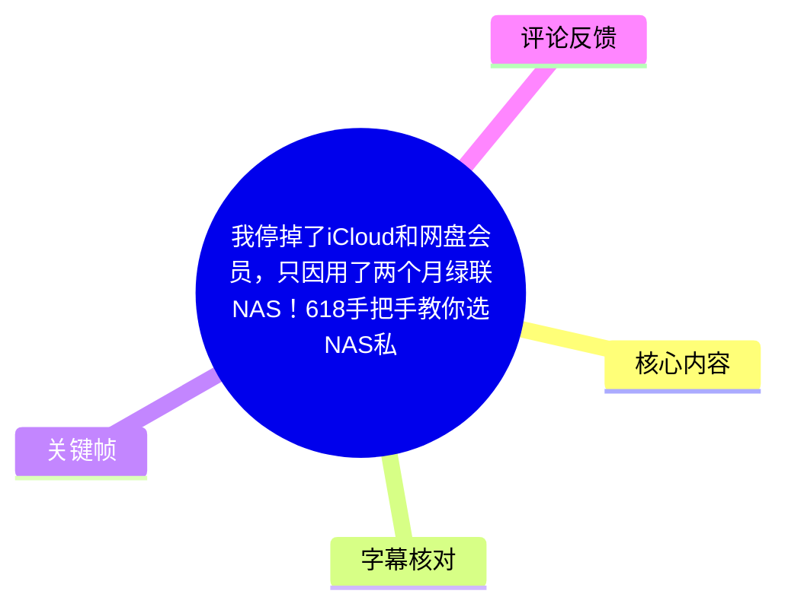
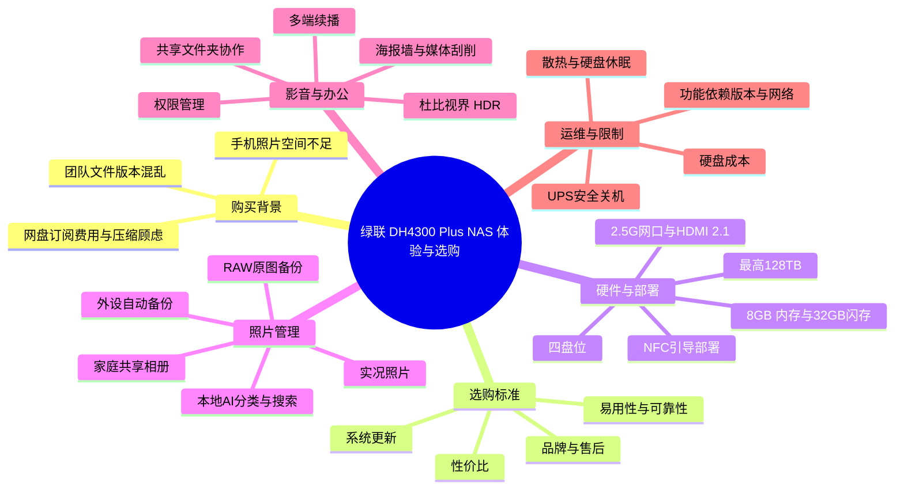
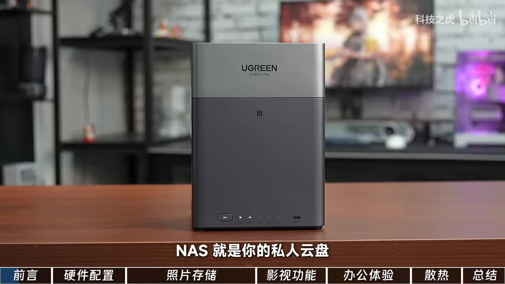
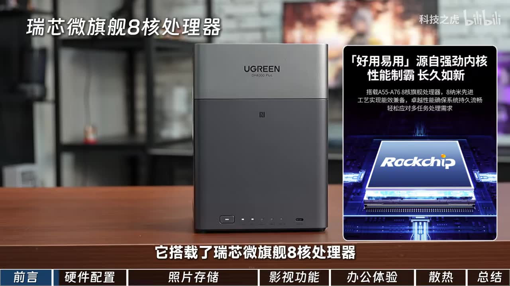
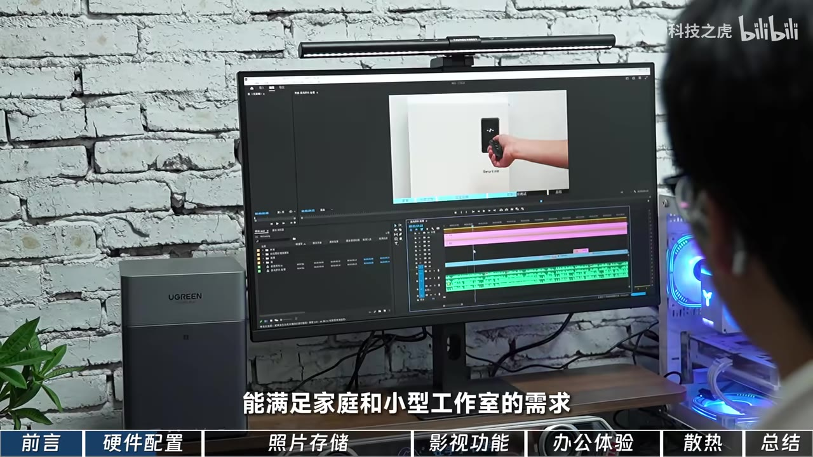
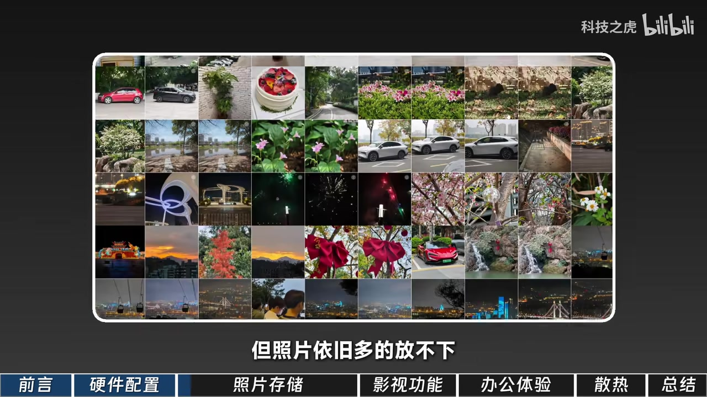

# 我停掉了iCloud和网盘会员，只因用了两个月绿联NAS！618手把手教你选NAS私人云盘！

> 来源：[Bilibili 视频](https://www.bilibili.com/video/BV1KuLA6ZE3Y) 
> UP 主：科技之虎｜视频时长：07:03｜合集：AIcode  
> 本文中的产品功能、价格环境、系统版本与促销判断均以视频发布时素材为准。

## 小结

视频以 UP 主使用绿联 DH4300 Plus 约两个月的体验为线索，面向第一次购买 NAS 的家庭用户、小型工作室与内容创作者，说明 NAS 可以如何替代部分 iCloud 和传统网盘的照片、文件协作及影音存储需求。其核心判断是：若用户重视本地数据掌控、照片原图备份、多人共享和持续扩容，四盘位 NAS 会比单纯升级手机容量或持续续费网盘更适合。

选购层面，作者提出了五项标准：**品牌售后、产品可靠与易用、系统更新积极、性价比，以及自身需求是否需要更高的盘位与扩展能力**。所介绍的 DH4300 Plus 为四盘位产品，视频称其配备瑞芯微旗舰八核处理器、8GB 内存、32GB 闪存、6 TOPS NPU 算力，支持 3.5/2.5 英寸硬盘，最高存储空间为 128TB，并强调可以先装 1～2 块硬盘、之后按需加盘。

体验重点分为四部分：照片管理支持苹果与安卓实况照片、RAW 原图和外接设备自动备份；相册 2.0 借助本地 AI 做人物、地点、场景、时间及物体分类与搜索；影视中心可自动刮削媒体信息、播放高规格影片并支持字幕；多人办公可借助共享文件夹、挂载本地磁盘和权限控制统一素材版本。

需要注意，视频具有明显的产品推荐与体验分享属性。诸如“远程访问完全免费且不限速”“最高 128TB”“无损扩容”“支持的网盘、字幕和应用”等说法均来自视频陈述，实际能力会受到硬盘规格、阵列与文件系统配置、网络环境、地区服务、客户端版本及后续系统更新影响；“618 是入手时机”“内存和硬盘涨价”等也属于强时效性判断，不能直接视作当前价格结论。

## 思维导图

## 目录

- [背景、NAS 定位与选购框架](#背景nas-定位与选购框架)
- [硬件规格与新手部署](#硬件规格与新手部署)
- [照片备份、相册 20 与家庭共享](#照片备份相册-20-与家庭共享)
- [影视中心与媒体库能力](#影视中心与媒体库能力)
- [团队协作与远程访问](#团队协作与远程访问)
- [散热、UPS、应用生态与更新节奏](#散热ups应用生态与更新节奏)
- [选购步骤、限制与时效性](#选购步骤限制与时效性)
- [字幕比对](#字幕比对)
- [评论分析](#评论分析)
- [处理记录](#处理记录)

## 背景、NAS 定位与选购框架

### NAS 解决的是什么问题？[00:00:26](https://www.bilibili.com/video/BV1KuLA6ZE3Y?t=26)

视频开场聚焦三个常见痛点：

1. 手机照片过多，不敢删除；
2. 网盘会员持续付费，且作者担心照片被压缩或内容受限制；
3. 团队通过 U 盘、网盘反复传文件，容易出现版本混乱。

作者将 NAS 解释为“私人云盘”：数据保存在家中设备内，但可在外部访问。这里的关键区别不是“没有成本”，而是从持续购买公有云容量，转为购置 NAS、硬盘、网络及可能的断电保护设备；能否更快地访问，取决于家庭上行带宽、外网质量、客户端与网络配置。

> 图：画面展示 DH4300 Plus 主机，底部栏目依次标出“前言、硬件配置、照片存储、影视功能、办公体验、散热、总结”。它直观呈现了视频的内容组织，并对应作者将 NAS 定位为“私人云盘”的主张。

### 作者的 NAS 选购标准 [00:00:27](https://www.bilibili.com/video/BV1KuLA6ZE3Y?t=27)

作者表示，自己在 618 选 NAS 时主要关注：

- 大品牌及售后是否可靠；
- 产品是否稳定、易用；
- 系统是否积极更新；
- 性价比是否合理、投入是否值得。

其使用路径是从“偶尔存东西”发展为“彻底离不开”。这是一种个人经验，而不是所有用户都需要 NAS 的证明。对于仅有少量文件、没有多端访问/自动备份/多人协作需求的用户，订阅云盘或使用移动硬盘仍可能更简单。

## 硬件规格与新手部署

### 四盘位、性能参数和接口 [00:00:51](https://www.bilibili.com/video/BV1KuLA6ZE3Y?t=51)

视频中介绍的型号为 **绿联 DH4300 Plus**。按作者陈述及画面信息，其主要规格如下：

| 项目 | 视频给出的信息 | 使用含义 |
| --- | --- | --- |
| 处理器 | 瑞芯微旗舰八核处理器 | 承担系统、文件服务、媒体与 AI 分类等处理任务 |
| 架构工艺 | 画面标注 A55-A76 八核、8nm 工艺 | 这是画面宣传信息，未在素材中给出完整 SoC 型号 |
| NPU 算力 | 6 TOPS | 视频将其用于支撑本地 AI 分类等体验 |
| 内存 | 8GB | 多任务、应用运行的基础资源 |
| 闪存 | 32GB | 用于系统及相关存储，不等同于用户数据盘容量 |
| 硬盘位 | 4 盘位 | 比双盘位有更高的盘位扩展空间 |
| 硬盘规格 | 支持 3.5 英寸、2.5 英寸硬盘 | 购买前仍需确认具体硬盘兼容性与安装方式 |
| 最大容量 | 最高 128TB | 属于视频标称上限，具体受单盘容量、阵列模式和系统支持限制 |
| 视频接口 | HDMI 2.1 | 可面向显示输出等场景，视频未展开具体输出模式 |
| 数据接口 | 2 个 USB-A、1 个 USB-C、1 个 2.5G 网口 | 满足外设接入与较高局域网带宽需求 |

作者强调，用户可先安装 1～2 块硬盘，未来再增加硬盘，数据无需迁移。这里的“无损扩容”应理解为产品/系统宣称的扩容流程便利性；不同存储池、RAID/冗余方案下的可扩容路径、剩余空间利用率与风险并不相同，购买前应以当前系统文档为准。

> 图：画面写有“瑞芯微旗舰 8 核处理器”，右侧展示 Rockchip 芯片宣传图，并标注 A55-A76 八核与 8nm 工艺。这张图用于核对 ASR 中“瑞芯微旗舰八核处理器”的产品信息。

### 从装盘到完成部署的流程 [00:01:15](https://www.bilibili.com/video/BV1KuLA6ZE3Y?t=75)

视频给出的新手操作顺序为：

1. 将硬盘装入硬盘仓；
2. 上好螺丝；
3. 接入网线；
4. 用手机触碰机身 NFC 区域；
5. 手机自动弹出绿联云 App 下载入口；
6. 正常开机；
7. 根据新手引导完成部署；
8. 在应用中心按需安装功能。

系统名称为 **UGOS Pro**（ASR 多处误识别为“UG OS Pro”“绿连”）。作者评价其界面简洁，应用可通过应用中心自由选择安装。

部署前还应自行补足以下准备：硬盘不是主机自带的通用数据容量；首次建存储池通常涉及磁盘初始化，已有数据的硬盘不应直接在未备份的情况下初始化；NAS 也不是备份策略的终点，重要资料宜至少保留额外副本。

> 图：画面中 NAS 放置在剪辑电脑旁，显示器运行视频剪辑软件。这说明作者不仅将设备用于照片归档，也将其放在家庭与小型工作室的高频文件访问场景中。

## 照片备份、相册 2.0 与家庭共享

### 实况照片、RAW 与外部设备自动备份 [00:02:03](https://www.bilibili.com/video/BV1KuLA6ZE3Y?t=123)

照片存储是作者最强调的使用场景。他表示曾购买某网盘年费会员及 iCloud 订阅，但认为照片仍然难以存下，并担忧长期存储的压缩问题。视频列出的能力包括：

- 支持苹果和安卓设备的**实况照片**完整存储；
- 在绿联云 App 相册中查看、播放动态效果；
- 支持备份相机 **RAW 格式**高清原图；
- 视频称 4 月系统更新后，支持连接外部设备自动备份；
- 作者称单张 RAW 图像可达数十 MB，通过自动备份保存到 NAS，以避免手机空间不足与原图压缩。

“完整保留”“零损失”等是作者体验性表述。实际导入是否包含全部动态照片组件、元数据、RAW 兼容性及预览速度，应在用户自己的手机型号、相机格式、App 版本与网络条件下验证。

> 图：画面以多张旅行、车辆、花卉和夜景照片构成图库，配文“但照片依旧多的放不下”。它有效说明 NAS 照片备份的目标场景是大量原图的长期归档，而非少量临时文件传输。

### 相册 2.0：本地 AI 分类、搜索和智能相册 [00:02:27](https://www.bilibili.com/video/BV1KuLA6ZE3Y?t=147)

视频称，相册 2.0 内置本地 AI 模型，可对照片和视频进行识别、分类与定位，维度包括：

- 人物；
- 地点；
- 场景；
- 时间；
- 截图；
- 自拍；
- 实物。

作者举例：搜索“车”可返回对应照片。视频还提到相册界面改善，包括纵横布局、个人图库与共享图库入口统一，以减少反复切换。

智能相册可按多个条件组合，例如“2026 年 + 福州 + 交通工具”；后续新增的符合条件照片会自动进入该相册。Web 和电脑端可将常用智能分类、相册拖拽到侧边导航栏，建立快捷入口。

需区分两点：一是视频称 AI 模型“本地”运行，这意味着其定位是减少上传到第三方云端的需要；二是识别结果仍可能存在误分类、漏检或标签不准确，素材没有提供识别准确率、离线资源占用与首次索引耗时数据。

### 家庭账户、共享相册与外链 [00:02:51](https://www.bilibili.com/video/BV1KuLA6ZE3Y?t=171)

家庭共享部分，作者描述了三类协作方式：

- 为其他家庭成员建立账户，成员间上传和分享；
- 创建共享相册，全家集中上传；
- 通过外部链接向朋友分享，接收方无需安装 App、注册或登录，即可浏览、下载高清照片。

这使设备在作者叙事中成为“家庭相册”与“私人网盘”的结合。外链分享虽然方便，但也是访问控制边界：应关注链接有效期、是否设置密码、下载权限、失效后的可访问性，以及是否避免分享敏感照片。视频未给出这些具体安全设置。

## 影视中心与媒体库能力

### 自动刮削、格式播放与字幕 [00:03:15](https://www.bilibili.com/video/BV1KuLA6ZE3Y?t=195)

作者称，将电影文件放入任意文件夹后，影视中心可自动刮削内容，联网匹配海报、演员、简介、评分等信息，生成类似流媒体服务的海报墙。

视频列出的播放器能力有：

- 支持蓝光原盘、杜比视界、HDR 影片；
- 对无字幕片源可一键搜索并加载字幕；
- 新增外挂 **SUP 特效字幕**支持，视频称字幕特效可以正常显示；
- 电视剧、综艺支持跳过片头片尾；
- 多端自动同步观看进度。

这些能力高度依赖片源封装、音视频编码、客户端解码能力、版权/地区限制及字幕源质量。特别是“支持某格式”不必然等于所有终端都能硬解、直通或流畅播放，视频没有提供码率、转码性能和兼容性测试数据。

### 车机续播、网盘直链与儿童媒体库 [00:04:03](https://www.bilibili.com/video/BV1KuLA6ZE3Y?t=243)

作者以理想汽车为例：在车机版绿联云看了一半的影片，回家后可在电视或电脑继续观看；手机局域网播放时，作者称拖动进度条“几乎秒响应”。

此外，视频称影视中心媒体库可挂载 **115、夸克网盘**并开启网盘直链播放，网盘内影片无需先下载到 NAS 即可串流。还可以建立独立的儿童影视库，仅向孩子显示适龄内容，用于家长管理。

这里应注意：

- 网盘挂载和直链能力受第三方网盘的接口、会员策略、地区、账号状态和后续规则变化影响；
- “不下载即可观看”不代表不消耗网盘侧流量或不需要网络；
- 儿童媒体库只解决库内可见性管理，家庭仍应自行管理账号、播放端和内容来源。

## 团队协作与远程访问

### 共享文件夹、挂载本地盘与权限控制 [00:04:27](https://www.bilibili.com/video/BV1KuLA6ZE3Y?t=267)

作者的办公场景是视频内容团队，涉及拍摄、剪辑和审核。此前通过 U 盘和网盘传递素材时，常出现文件传递慢、版本混乱、审核人员看到旧文件的问题。

使用 NAS 后，视频给出的改造方式是：

1. 全员将素材存入 NAS 共享文件夹；
2. 剪辑师直接在线处理素材；
3. 将 NAS 挂载为本地磁盘，避免“先下载、再剪辑”；
4. 审核人员直接在 NAS 上在线播放成片；
5. 按岗位设置不同访问权限；
6. 活动照片通过共享相册集中管理，设计部门自行取用原图。

这一方案的核心不是 NAS 自动消除版本问题，而是将素材入口和工作版本集中到同一处。若多个剪辑师同时改同一个项目文件，仍需团队定义文件命名、素材目录、锁定机制、版本号与备份规则；视频没有展示并发项目文件冲突的处理方式。

### 远程访问的主张 [00:05:15](https://www.bilibili.com/video/BV1KuLA6ZE3Y?t=315)

作者称，绿联的远程访问“完全免费且不限速”，在公司、高铁或国外通过绿联云 App 均可访问家中 NAS 文件，用于查看照片、电影及调取办公文件。

这一能力对经常出差和远程取素材的人有现实价值，但要补充两个限制：

- 远程实际速率通常受家庭宽带的**上行带宽**、外网链路、网络拥塞及访问端网络影响；
- “不限速”是视频对服务策略的描述，不等于用户在任何场景都能获得局域网级别速度。

重要文件远程访问还应使用强密码、双重验证（如系统支持）、最小权限账户，并避免在公共网络中进行不必要的高权限操作。

## 散热、UPS、应用生态与更新节奏

### 温度、休眠和断电保护 [00:05:39](https://www.bilibili.com/video/BV1KuLA6ZE3Y?t=339)

视频给出一个散热测试条件：**室温 26℃、风扇默认普通模式**下，硬盘温度为 **33℃**。作者认为硬盘温度超过 45℃会进入较危险范围，DH4300 Plus 的低温表现说明风道和风扇调度较好。

这一温度数据仅对应作者的单次环境与硬盘负载，不能外推为所有使用条件下的固定表现。硬盘温度会受盘数、硬盘型号、读写负载、环境温度、设备摆放位置和风扇策略影响。

作者还建议：

- 设置硬盘自动休眠：长时间不用时自动停转，以节电并减少运行时间；
- 数据特别重要时，搭配绿联 UPS：停电时 NAS 自动安全关机。

应补充：硬盘休眠可能增加再次唤醒等待，也未必适合持续有后台任务的场景；UPS 能降低突发断电风险，但不替代异地备份、版本备份或防误删机制。

### 应用中心与系统更新 [00:06:03](https://www.bilibili.com/video/BV1KuLA6ZE3Y?t=363)

作者称应用中心支持按需一键选择、安装日常及进阶功能，提到了以下应用/服务名称：

- 龙虾；
- Hermes；
- Docker；
- qBittorrent。

ASR 对这组名称识别不稳定，尤其将 Docker、qBittorrent 识别为“Dock”“QB Torrent”；本文按常见软件名称整理，但视频素材未提供具体版本、配置方式或兼容性清单。涉及容器、下载工具等进阶功能时，用户还需自行处理安全更新、端口暴露、存储空间、网络规则及内容合规问题。

作者认为，在内存与硬盘普遍涨价的背景下，该机仍有较高性价比；并称系统基本保持“每月一次大更新”。视频列出的 **4 月更新**亮点包括：

- 相册 2.0 全面升级；
- OpenCore 可一键接入微信；
- 支持连接外部设备；
- 支持全局搜索。

其中“OpenCore 可一键接入微信”来自 ASR，专有名词和具体功能表述存在识别不确定性，未能由站内字幕交叉验证，应以实际更新日志为准。

### 作者结论 [00:06:27](https://www.bilibili.com/video/BV1KuLA6ZE3Y?t=387)

作者的最终推荐条件是：在 618 期间选购第一台 NAS，希望少折腾复杂设置，同时需要全面功能、较易用系统和较高性价比的用户，可以考虑 DH4300 Plus。

这并非“所有人都应购买 NAS”的结论。四盘位 NAS 的总投入还包含硬盘，且容量需求越高，机械硬盘成本越会显著影响总价。

## 选购步骤、限制与时效性

### 可复用的选购步骤

基于视频内容，可将选购过程整理为以下顺序：

1. **确认需求是否真实存在**：是否有大量照片、RAW、视频素材、多设备访问、家庭共享或多人协作需求。
2. **评估容量与盘位**：根据未来 2～3 年的数据增长估算容量；需要渐进扩容、冗余或多人资料库时，四盘位通常比双盘位留有更多余量。
3. **把主机和硬盘分开预算**：不能只看 NAS 裸机价格，应计算硬盘、UPS、网线/交换机与备份介质成本。
4. **核对网络条件**：2.5G 网口只有在电脑网卡、交换机、网线与局域网均匹配时才可能发挥优势；远程访问还依赖家庭上行带宽。
5. **核对核心软件能力**：重点验证手机自动备份、实况照片、RAW、照片搜索、影音格式、字幕、共享链接和权限是否满足自己的设备组合。
6. **设计数据保护**：RAID/多盘冗余不等于备份；应至少保留额外副本，关键数据可考虑异地或云端备份。
7. **再考虑促销时点**：618 等活动价格需以当期实际商品页、硬盘价格、赠品、保修与售后条款为准。

### 视频未充分验证或需要谨慎看待的部分

| 项目 | 视频说法 | 应如何理解 |
| --- | --- | --- |
| 省去网盘/iCloud 会员费 | NAS 可减少订阅支出 | 裸机、硬盘、电费、UPS、维护和备份都有成本，不是零成本 |
| 隐私和安全 | 数据在家中、自己掌控 | 自主管理也意味着需处理账户、权限、漏洞更新、外链和物理设备风险 |
| 无损扩容 | 后续加盘不迁移数据 | 具体受存储模式与当前容量布局影响，应先看官方扩容规则 |
| 远程不限速 | 免费且不限速 | 家庭上行与外部网络仍可能成为瓶颈 |
| 最高 128TB | 四盘位可达 128TB | 需核实单盘兼容性、阵列方式、可用容量与重建风险 |
| 影视兼容性 | 蓝光原盘、杜比视界、HDR、SUP 字幕等 | 需按终端设备、编码、码率和授权情况实测 |
| 系统月更 | 基本每月一次大更新 | 更新节奏与功能可能调整，建议以官方更新日志为准 |

### 时效性说明

视频标题与内容均围绕 618 选购，且提到“4 月系统更新”和当时内存、硬盘价格上涨。这些信息具有明显时间属性：

- 促销价格、套餐、赠品与库存随活动变化；
- 系统功能、App 名称、第三方网盘挂载能力可能更新或下线；
- 硬盘价格波动会直接影响 NAS 的实际入门成本；
- 视频发布时的功能宣称不应自动等同于当前固件状态。

## 字幕比对

| 字幕来源 | 完整性 | 专有名词 | 时间轴 | 主要问题 |
| --- | --- | --- | --- | --- |
| Bilibili 站内字幕 | 未提供可用字幕 | 无法核验 | 无法核验 | 素材明确标注“未提供可用站内字幕” |
| 本次 ASR 字幕 | 覆盖约 395.38 秒语音，诊断覆盖率 93.64% | 存在较多误识别 | 提供 18 段真实 SRT 起止时间 | 首段在 00:26:620～00:27:000 内包含异常长文本；品牌、系统、应用名及部分技术术语识别不稳定 |

本次 ASR 使用 `medium` 模型，识别语言为中文，语言置信度为 `0.9990234375`，带时间戳；诊断未标记 `noAudioStream=true`，且音频时长约为 422.23 秒，说明源视频存在音轨，本次确实完成了 ASR 检查。

由于没有站内字幕，正文以本次 ASR 的 SRT 时间轴为主，并结合关键帧及上下文校正了部分明显文本问题：

| ASR 原始识别或疑点 | 正文采用的写法 | 校正依据 |
| --- | --- | --- |
| “綠連 / 绿连” | 绿联 | 视频标题、元数据与机身 UGREEN 标识 |
| “UG OS Pro” | UGOS Pro | 视频语义中的绿联系统名称；无站内字幕可进一步核验 |
| “瑞星微” | 瑞芯微 | 关键帧中可见“瑞芯微旗舰8核处理器” |
| “DH400 Plus” | DH4300 Plus | 标题及前文反复明确的产品型号；办公段 ASR 疑似漏识“3” |
| “Dock”“QB Torrent” | Docker、qBittorrent（保留不确定性） | 常见应用名称与段落语境；原始视频未提供可复核的应用列表截图 |
| “OpenCore 一键接入微信” | 保留为 ASR 转写的更新项目，不作功能扩展 | 专有名词语义存在不确定性，未将其作为已独立验证的事实 |

时间轴链接优先采用 ASR/SRT 中各段的真实起始时间换算为秒数，而非按正文顺序估算。

## 评论分析

仅处理素材中可获取的热评前三条；评论反映观众观点，不构成价格、需求或产品能力的已验证事实。

1. **玄东COIN（96 赞）**：“资本经典套路：没有需求创造需求”。  
   - 观点：质疑 NAS 是否属于被营销放大的需求。  
   - 启示：这与视频的强推荐叙事形成对照。NAS 是否值得购买应回到真实使用频率、数据量、远程访问和协作需求，而非仅因“停掉会员”这一卖点决定。  
   - 可信度边界：该评论没有提供具体使用数据或产品反例，属于态度表达。

2. **牢大一路曼肘（47 赞）**：“报价组来了，感觉价格还行，就是机械价格有点高”。  
   - 观点：认为主机报价尚可，但机械硬盘成本较高。  
   - 补充价值：指出 NAS 总成本不能只看裸机，硬盘是关键支出，与视频中“硬盘普遍涨价”的背景相互呼应。  
   - 可信度边界：评论未给出具体报价、硬盘型号、容量或购买渠道，不能据此判断实际价格水平。

3. **不混社区纯玩（40 赞）**：“想不到吧，nas居然会被硬盘涨价给杀穿”。  
   - 观点：用夸张语气强调硬盘涨价对 NAS 性价比的冲击。  
   - 补充价值：提醒潜在购买者，四盘位扩容虽灵活，但盘位越多，完整配盘的资金压力可能越大。  
   - 可信度边界：未提供价格曲线或时间范围；“杀穿”是主观夸张，并非可直接量化的市场结论。

## 处理记录

- Worker ID：`worker-mrj0wbly-5dc4e50c`
- 模型：`gpt-5.6-terra`
- ASR 模型：`medium`，CUDA / `float16`，自动语言识别为中文。
- 使用素材与工具产物：视频元数据、`audio/audio.wav`、`asr/transcript.srt`、`asr/asr-result.json`、关键帧目录 `frames/`、热评文件 `comments/comments.json`。
- 字幕选择：站内字幕未提供可用版本；已检查本次 ASR，正文采用 ASR 的真实 SRT 时间段作为时间轴来源，并用标题、元数据、关键帧画面和上下文对明显误识别做有限校正。
- 关键帧选择依据：
  - `frames/frame-001.jpg`：展示 NAS 主机和视频章节结构，用于说明产品定位；
  - `frames/frame-002.jpg`：可见“瑞芯微旗舰8核处理器”及芯片宣传信息，用于核对硬件段；
  - `frames/frame-003.jpg`：NAS 与剪辑工作站同框，用于说明办公协作场景；
  - `frames/frame-004.jpg`：多照片图库画面，用于说明大规模照片归档需求。
- 缓存清理：未提供缓存清理执行日志；本文未将“已清理”作为既成事实记录。
- 未解决问题：
  - 无站内字幕，部分 ASR 专有名词无法交叉核验；
  - 首条 ASR 分段的时间长度异常短但文字量很大，正文将其作为开场时间定位使用，不据此拆分更细粒度时间点；
  - 未提供产品实时价格、硬盘兼容列表、系统更新日志及实际网络测速数据，相关内容不作超出视频素材的断言。
